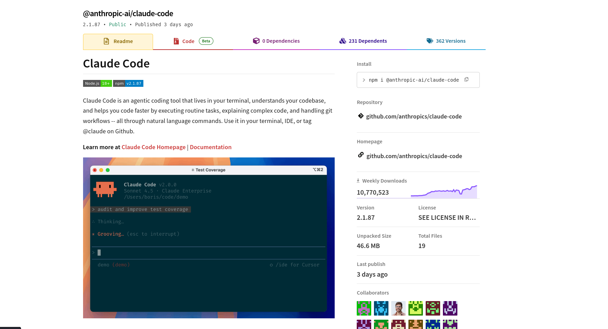
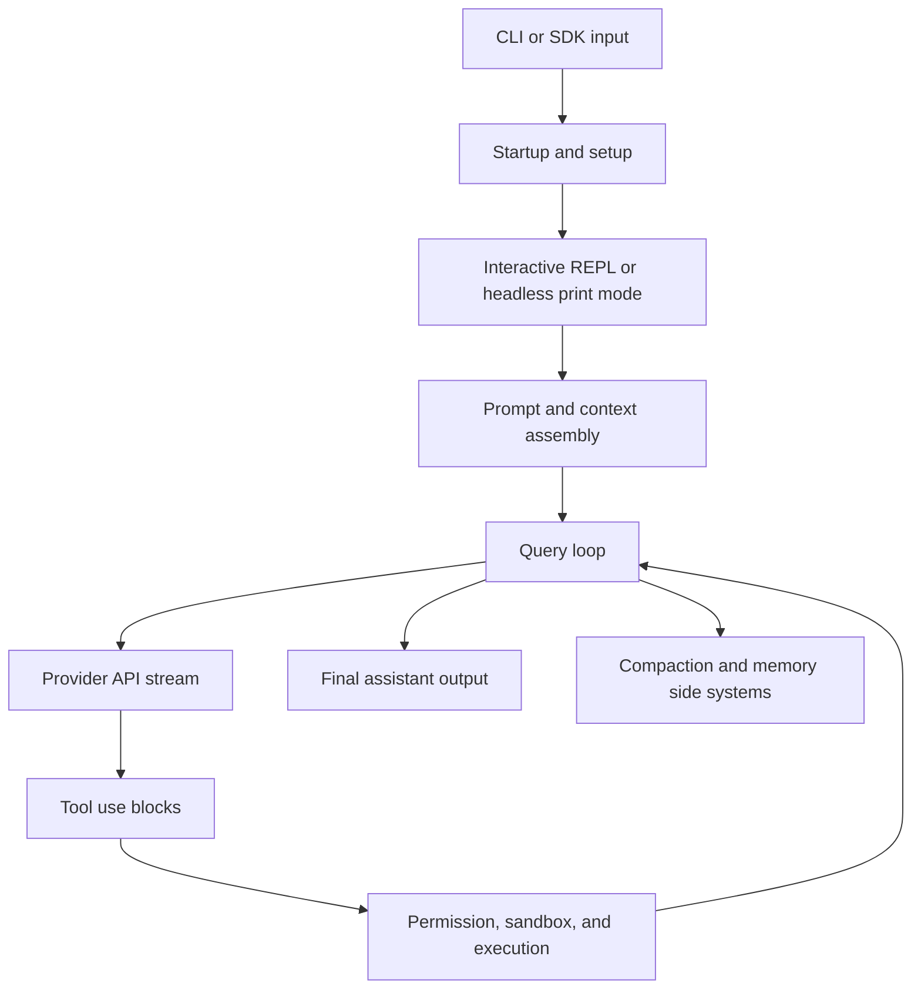

# How to Use This Book

This book is a guided source study of the repository mirror at commit `a371abbe75ffa0d0a3c92290e2bbf56a7ef54367`. Treat it as an architecture course for building an equivalent agentic coding CLI from scratch, not as official product documentation and not as installation instructions. The pinned checkout is source-rich but package-incomplete: the evidence run found source files, assets, and README material, but no local package manifest, lockfile, CI config, explicit license file, or runnable test harness in the checked-out tree [1](#source-1) [2](#source-2).

The reading order is intentional. First learn the product model, then the repository map, then the runtime path from process start to model call, then the tool and safety systems, and only then the rebuild plan. The code is large, feature-gated, and partly transformed from source-map material, so this book uses "the pinned mirror contains" when describing source facts and keeps legal/provenance warnings visible throughout [1](#source-1) [2](#source-2).

Each lecture has a learning goal, key terms, plain-language explanation, source-backed implementation details, a worked example, from-scratch implementation steps, common mistakes, and self-check questions. Citations point to public GitHub commit URLs. Exact local file-line evidence lives in `verification/evidence-matrix.md`, not in the PDF body.

This upgraded edition is every-file gated. The pinned checkout has exactly 1,906 tracked files at commit `a371abbe75ffa0d0a3c92290e2bbf56a7ef54367`; `verification/every-file-coverage.jsonl` has exactly 1,906 rows. The ledger marks 1,899 files as `read`, excludes 3 PNG assets as `binary_or_media_excluded`, excludes 4 generated protobuf TypeScript files as `generated_or_metadata_excluded`, and leaves 0 source/docs/config/script files ambiguous. The appendix explains the classification method without dumping source code [1](#source-1).



The book assumes you are comfortable with TypeScript, async generators, CLI protocols, React/Ink-style terminal UI, schema validation, and model/tool loops. It does not assume prior knowledge of this repository [3](#source-3) [5](#source-5).

# Course Map

The course has four arcs. The first arc builds the mental model: what the repo is, why the checkout is unusual, and what major directories matter. The second arc follows one user input through startup, setup, REPL or headless mode, query-loop execution, model streaming, tool use, and output rendering. The third arc studies boundaries: prompts, context, memory, provider/API calls, permissions, sandboxing, file IO, remote/session surfaces, and security posture. The final arc turns the study into a rebuild plan with labs, critique, glossary, and review questions [1](#source-1) [5](#source-5) [6](#source-6).

| Arc | Units | Engineering outcome |
|---|---|---|
| Orientation | Units 1-2 | You can explain the repo's product model and navigate source clusters without confusing mirror metadata for runtime code [2](#source-2). |
| Runtime | Units 3-5 | You can trace a prompt from CLI entry through the agent loop, model stream, and tool execution [3](#source-3) [5](#source-5) [6](#source-6). |
| Boundaries | Units 6-7 | You can reason about context, memory, provider requests, permissions, sandboxing, file IO, and safety boundaries [7](#source-7) [11](#source-11) [13](#source-13). |
| Rebuild | Units 8-10 | You can implement an equivalent system module by module, then critique its tradeoffs like a staff engineer [21](#source-21) [23](#source-23). |
| Audit | Appendix | You can verify that every tracked file has a coverage row, a hash, a classification, and either a concise read summary or a concrete exclusion reason [1](#source-1). |



# Prerequisite Crash Course

An agentic coding CLI has five moving parts. First, it needs an entrypoint that turns command-line flags, environment, settings, trust decisions, and user input into a runtime session. Second, it needs a model loop that can stream assistant output and tool-use requests. Third, it needs a tool layer that validates inputs, checks permissions, executes side effects, and returns model-visible results. Fourth, it needs context management so long sessions can survive prompt limits. Fifth, it needs output surfaces for humans and machines [3](#source-3) [5](#source-5) [7](#source-7) [23](#source-23).

The repository uses patterns you will see in production agent systems: typed tool contracts, async generators, stream events, permission callbacks, sandbox policy adapters, prompt-cache stability, compaction, background subagents, and separate interactive versus headless output surfaces. If any of those concepts are new, read this crash course as a vocabulary layer before entering Unit 1 [7](#source-7) [10](#source-10).

**Key term: tool-use block.** A model response can include a structured request to invoke a named tool with JSON input. The app validates that input, checks permission, runs the tool, and appends a `tool_result` back into the conversation [7](#source-7) [9](#source-9).

**Key term: query loop.** The query loop is the async state machine that repeatedly calls the model, handles stream events, runs tools, handles recovery paths, and stops only when a terminal condition is reached [6](#source-6).

**Key term: permission context.** Permission context is the set of mode, rules, tool-specific checks, user approvals, hooks, and sandbox state that determines whether a tool call may run [7](#source-7) [12](#source-12).

**Key term: compaction.** Compaction replaces an old transcript segment with a model-generated summary plus carefully selected rehydrated attachments. It preserves continuity but not exact full-state fidelity [17](#source-17).

**Key term: source-level rebuild.** A source-level rebuild means implementing equivalent behavior from observed architecture and source evidence. It is not the same as compiling this mirror, which lacks local dependency and build metadata [1](#source-1) [2](#source-2).

# Unit 1: What This Repo Is

**Learning goals.** Understand the repository's identity, product model, provenance caveat, and why this course treats it as a source study rather than a build artifact.

```{=typst}
#pagebreak()
```

## Lecture 1: Product Model And Provenance

**Learning goal.** By the end of this lecture, you should be able to explain what problem the repository appears to solve, what kind of agent product it represents, and why provenance affects how we teach it.

**Key terms.** Coding CLI, source mirror, sourcemap, prompt-driven tool use, provenance risk, source-level reconstruction.

The pinned repository presents itself as a mirror of Claude Code source material recovered from source-map exposure. The README says the author did not leak the files, describes the source-map mechanism, and states that the original source is proprietary and the repo is not official Anthropic product material [1](#source-1) [2](#source-2). That matters for the course: we can study architecture, but we should not treat the mirror as an authorized distribution, a clean license grant, or a reproducible package.

Product-wise, the source is for a terminal coding agent. It includes a Commander-style CLI entrypoint, an interactive React/Ink terminal UI, headless SDK-style output, a model query loop, dozens of tools, permission systems, MCP and remote surfaces, memory/compaction systems, and subagent/task orchestration [3](#source-3) [5](#source-5) [7](#source-7) [21](#source-21). The problem it solves is not merely "send a prompt to Claude." It builds an operating environment where the assistant can inspect files, edit code, run shell commands, coordinate subtasks, manage long context, and expose either a TUI or machine-readable protocol [6](#source-6) [23](#source-23).

Plainly: this is an agent runtime around a coding model. The runtime mediates between a user, a filesystem, a terminal, a model provider, local/remote tools, and persistent session state. The model proposes actions; the runtime controls whether and how they happen [7](#source-7) [9](#source-9). That separation is the central mental model for the entire book.

**Source-backed implementation details.** The README's architecture sketch names `main.tsx`, `QueryEngine.ts`, `Tool.ts`, `tools/`, `services/`, `coordinator/`, `bridge/`, and `buddy/` as major clusters [2](#source-2). The source reads confirmed `main.tsx` as the large CLI/control entrypoint, `QueryEngine.ts` as the SDK/headless conversation owner, `query.ts` as the lower-level loop, and `Tool.ts` plus `tools.ts` as the tool contract and registry [3](#source-3) [5](#source-5) [6](#source-6) [7](#source-7).

**Worked example.** Suppose a user types "fix the failing parser test." In an equivalent product, the CLI has to capture the prompt, collect project context, ask the model for a plan or tool use, maybe run `rg`, maybe read files, ask for edit permission, apply a patch, run a shell command if permitted, compact if context grows too large, and render the result. This repository has distinct subsystems for each part of that path [5](#source-5) [7](#source-7) [14](#source-14).

**From-scratch implementation steps.** Start with a minimal CLI that accepts interactive and print modes. Add a conversation state object. Add one model-call adapter. Add a typed tool contract with `Read` and `Edit`. Add a permission callback. Add a loop that calls the model, detects tool requests, runs tools, appends results, and repeats. Only after that should you add compaction, remote transports, or subagents [5](#source-5) [6](#source-6) [7](#source-7).

**Common mistakes.** Do not confuse the README's narrative claims with verified runtime behavior. Do not treat the mirror as build-complete. Do not put all agent behavior into prompts; the important product behavior is enforced by runtime code, permission checks, IO shaping, and state machines [1](#source-1) [2](#source-2).

**Self-check questions.** What boundary separates a model suggestion from an actual shell command? Why is the repository's missing package metadata important? Which three files would you open first to understand the product model?

```{=typst}
#pagebreak()
```

## Lecture 2: The Product As A Runtime, Not A Prompt

**Learning goal.** Learn to see the repository as a layered runtime with model calls in the middle, not as a prompt file wrapped by a CLI.

**Key terms.** Runtime shell, model boundary, tool registry, event stream, app state, transcript.

A simple prompt wrapper has a linear shape: input, model call, output. This repo is not shaped that way. It has an entry layer, setup layer, UI/headless layer, prompt and context layer, query loop, provider layer, tool execution layer, memory layer, and task/subagent layer. The model call is one component inside a larger control system [3](#source-3) [6](#source-6) [19](#source-19).

The runtime layer matters because coding agents operate in hazardous environments. Reading files, editing files, running commands, making network requests, loading plugins, and accepting remote permissions are not just language-model outputs. They are application actions that need validation, user consent, sandbox boundaries, and error handling [7](#source-7) [11](#source-11) [25](#source-25).

The central data object is the conversation, but the conversation is not just a list of chat messages. It includes system prompt blocks, user context, tool definitions, MCP state, permission state, compact boundaries, usage accounting, read-file state, task state, and transcript persistence [5](#source-5) [7](#source-7) [16](#source-16). Rebuilding an equivalent repo means designing those state objects explicitly instead of letting them emerge accidentally.

**Source-backed implementation details.** `QueryEngine` stores mutable messages, abort control, SDK permission denials, cumulative usage, read-file state, discovered skills, and nested memory state [5](#source-5). `ToolUseContext` carries options, abort control, app-state callbacks, permissions, message history, agent metadata, and content replacement state into tool execution [7](#source-7). The API layer turns normalized messages and tools into provider-specific streaming requests [19](#source-19).

**Worked example.** Imagine the model asks for a `Bash` tool call. A prompt wrapper would execute a command string. This runtime validates the schema, checks tool-specific permissions, runs hooks, evaluates ask/allow/deny rules, decides whether a sandbox should be used, possibly prompts the user, streams progress, maps results, records telemetry, and returns a shaped `tool_result` [9](#source-9) [11](#source-11) [12](#source-12).

**From-scratch implementation steps.** Define interfaces first: `Message`, `Tool`, `ToolUseContext`, `PermissionResult`, `ToolResult`, `ModelEvent`, and `AppState`. Make the model loop depend on those interfaces. Then implement tools behind the interface. Then implement output adapters that consume events instead of reaching inside the loop [6](#source-6) [7](#source-7) [23](#source-23).

**Common mistakes.** The common failure is to let the model loop call arbitrary helpers directly. That makes permissions, telemetry, cancellation, result shaping, and testing inconsistent. Another mistake is treating UI messages and persisted transcript messages as the same thing; this repo keeps UI streaming state separate from committed messages [23](#source-23) [24](#source-24).

**Self-check questions.** Why is `ToolUseContext` larger than a simple `call(input)` argument? Which actions belong in the model loop and which belong in a tool executor? What breaks if UI streaming text is persisted as final transcript content?

```{=typst}
#pagebreak()
```

# Unit 2: Repository Map

**Learning goals.** Learn the major directories and important file clusters, identify missing package metadata, and build a mental map for source navigation.

```{=typst}
#pagebreak()
```

## Lecture 3: Directory And File Clusters

**Learning goal.** Build a practical repository map that helps you find behavior quickly.

**Key terms.** Source cluster, entrypoint, service layer, command registry, tool cluster, UI surface.

The pinned checkout root is small: `README.md`, `assets/`, and `src/` are the meaningful non-git entries [1](#source-1) [2](#source-2). The full tracked inventory is not small: 1,906 files are tracked by `git ls-files`, of which 1,902 are under `src/`, 3 are under `assets/`, and 1 is the README. Most architecture lives under `src/`. That source tree is broad: CLI, commands, components, services, tools, tasks, remote, state, context, plugins, output styles, skills, bridge, server, and utility layers appear as directories or file clusters [1](#source-1) [7](#source-7) [23](#source-23).

At the highest level, `src/main.tsx` is the process entrypoint and top-level command parser. `src/setup.ts` prepares environment and session state. `src/replLauncher.tsx` lazily starts the interactive UI. `src/screens/REPL.tsx` owns the live interactive session. `src/QueryEngine.ts` wraps SDK/headless conversation state, while `src/query.ts` is the lower-level async loop [3](#source-3) [5](#source-5) [6](#source-6).

The tool layer splits into the generic contract and concrete tools. `Tool.ts` defines the interface and `ToolUseContext`; `tools.ts` assembles built-ins and MCP tools; `services/tools/*` executes tool calls; `src/tools/*` contains tool implementations such as Bash, file read/edit/write, grep/glob, web, MCP, tasks, agent, plan mode, and more [7](#source-7) [8](#source-8) [9](#source-9).

The service layer is where the runtime gets serious. `services/api` handles providers, request construction, streaming, retry, logging, and errors. `services/compact`, `services/SessionMemory`, and `services/autoDream` manage context pressure and memory. `services/mcp`, `services/oauth`, `services/teamMemorySync`, `services/tools`, and plugin/settings services form additional backend subsystems [17](#source-17) [18](#source-18) [19](#source-19) [25](#source-25).

**Source-backed implementation details.** The README itself lists the main architecture clusters, but the source-specific reads verified the real paths and caveats [2](#source-2). The every-file inventory adds two practical corrections for a rebuild: the entrypoint family includes `src/entrypoints/*` files in addition to the large `src/main.tsx` control surface, and the query helper directory contains `config.ts`, `deps.ts`, `stopHooks.ts`, and `tokenBudget.ts`; `src/query/transitions.ts` is not tracked in this pinned tree [1](#source-1) [3](#source-3) [6](#source-6). The inventory also confirms that a standalone `src/tools/MultiEditTool/MultiEditTool.ts` is not tracked, so rebuilders should model multi-edit behavior from the available file-edit surfaces instead of assuming that path exists [1](#source-1) [15](#source-15).

**Worked example.** If you want to understand why an edit was denied, do not start in the UI. Start at `FileEditTool`, follow it to filesystem permission helpers, then to the generic permission path and any relevant UI approval surface. If you want to understand why a tool result appears in the terminal, start at `toolExecution`, then `Messages`, then `AssistantToolUseMessage` [9](#source-9) [15](#source-15) [24](#source-24).

**From-scratch implementation steps.** Create directories by ownership: `entrypoints`, `setup`, `query`, `tools`, `services/api`, `services/compact`, `ui`, `cli`, `state`, `tasks`, and `security`. Keep core contracts in shallow files. Put large feature implementations in their own folders. Add a generated repository map to your docs so new engineers can navigate by behavior [3](#source-3) [7](#source-7).

**Common mistakes.** Do not organize by "model stuff" versus "UI stuff." A coding agent crosses boundaries constantly. Organize by runtime responsibility: input, context, model, tool, permission, IO, rendering, persistence, and recovery [5](#source-5) [6](#source-6) [23](#source-23).

**Self-check questions.** Which files would you read to trace startup? Which files would you read to trace a Bash command? Which directory contains provider request shaping?

```{=typst}
#pagebreak()
```

## Lecture 4: Metadata, Tests, And Build Surface

**Learning goal.** Understand why this checkout is useful for architecture study but weak as a reproducible build target.

**Key terms.** Manifest, lockfile, CI, license, test harness, source mirror.

The pinned checkout does not look like a normal TypeScript application root. The evidence pass found no local `package.json`, lockfile, `tsconfig`, CI config, explicit license file, or runnable test suite in the checkout. The README includes generic install/build/run instructions, but those instructions are not locally supported by a manifest in the pinned tree [1](#source-1) [2](#source-2).

This does not make the source useless. It means the course must distinguish "architecture can be studied" from "the package can be built." The every-file gate strengthens that distinction: it proves static coverage of all tracked files, but it still does not prove that the checkout compiles, links, or behaves at runtime. For a rebuild, you should design an equivalent system from first principles and source evidence, then create your own manifest, dependency graph, test strategy, and license-cleared codebase [1](#source-1) [2](#source-2).

The lack of tests also changes how you evaluate claims. This course relies on static source reading and subagent reports, not runtime verification of the target repo. Where behavior depends on feature gates, environment variables, provider state, internal build flags, or external packages, the book says so [1](#source-1) [19](#source-19).

**Source-backed implementation details.** The repo metadata audit found only root source entries and assets, with no dependency or CI metadata. The every-file ledger read every `.ts`, `.tsx`, `.js`, and `.md` file except four generated protobuf TypeScript files with explicit generated-code headers; those generated files were hashed and excluded as generated metadata. The README's legal disclaimer says the original source is proprietary and the repo is not official. The docs/tests read found command/help, prompt, output-style, Undercover, Buddy, and Dream source surfaces, but not a runnable test suite [1](#source-1) [2](#source-2).

**Worked example.** A naive reader might run `npm install` because the README says so. In this pinned checkout, there is no local package manifest to make that command meaningful. A careful engineer instead records the gap, treats the checkout as evidence, and creates a clean-room rebuild plan with explicit dependency choices [1](#source-1) [2](#source-2).

**From-scratch implementation steps.** For your equivalent repo, create `package.json`, lockfile, `tsconfig`, lint config, unit tests, integration tests with fake model/tool adapters, and CI. Include license and contributor docs. Add a "source evidence" document if your design is based on a source study [1](#source-1).

**Common mistakes.** Do not infer dependencies from import names alone. Do not call missing tests "passing." Do not copy proprietary code. Do not cite a source-map mirror as if it were official upstream product documentation [2](#source-2).

**Self-check questions.** What are the risks of a source-rich but manifest-poor checkout? What test types would you add first in a rebuild? Why should license status affect implementation choices?

```{=typst}
#pagebreak()
```

# Unit 3: Runtime Architecture

**Learning goals.** Trace startup, setup, headless and interactive branch selection, prompt/context assembly, model/provider requests, state, logging, and error boundaries.

```{=typst}
#pagebreak()
```

## Lecture 5: Startup, Setup, And Session Construction

**Learning goal.** Follow the process from module load through CLI parsing, setup, and REPL/headless branch selection.

**Key terms.** Commander action, preAction hook, setup boundary, non-interactive mode, worktree mode, trust screen.

Startup begins before the explicit `main()` path finishes. The entrypoint performs profiling and platform prefetches, then imports a broad dependency surface for CLI parsing, analytics, MCP, settings, permissions, plugins, migration, session recovery, remote modes, and rendering [3](#source-3). This is a cold-start optimization pattern: overlap slow platform reads while the module graph loads.

The entrypoint then classifies the launch. It rewrites direct-connect URLs, deep links, assistant/SSH modes, and other arguments before Commander fully acts on them. It determines non-interactive mode from print flags, init-only mode, SDK URL, or non-TTY stdout. That early classification decides whether the runtime will build a headless structured IO path or mount the interactive Ink app [3](#source-3) [23](#source-23).

`setup()` is the major environment boundary. It checks Node version, sets session and cwd state, may start UDS messaging, handles optional worktree and tmux behavior, snapshots hooks, prefetches plugins, attaches analytics sinks, and enforces bypass-permission safety checks. Worktree mode lives there because it can change cwd and project root before command and agent loading complete [4](#source-4).

**Source-backed implementation details.** Interactive mode creates the Ink root after the non-interactive branch is ruled out. It runs setup/trust screens before LSP and API prefetches, resolves MCP configs, builds initial app state, and eventually calls `launchRepl`. `launchRepl` dynamically imports the `App` provider wrapper and the `REPL` screen [3](#source-3) [4](#source-4).

**Worked example.** If a user runs print mode from a CI script, the app should not mount the TUI. It should build a headless app state, connect MCP servers into that state, start prefetches when allowed, import the headless runner, and stream output through structured IO. If a user opens an interactive terminal, it should instead go through setup screens, trust handling, and REPL launch [3](#source-3) [23](#source-23).

**From-scratch implementation steps.** Implement startup as a series of gates: parse raw argv, classify entrypoint, load settings and policy, initialize permission context, prepare cwd/worktree, load commands and agents, then branch into headless or interactive mode. Keep branch-specific rendering separate from shared setup state [3](#source-3) [4](#source-4).

**Common mistakes.** Do not let setup depend on UI-only objects. Do not load plugin or command state before worktree mode has finalized cwd. Do not let print mode write stray stdout if stream-json is machine-readable [4](#source-4) [23](#source-23).

**Self-check questions.** Why is worktree setup inside `setup()`? What makes non-interactive mode more than a flag? Which startup work can be safely parallelized?

```{=typst}
#pagebreak()
```

## Lecture 6: QueryEngine And Query Loop Ownership

**Learning goal.** Separate the SDK/headless conversation wrapper from the lower-level query loop.

**Key terms.** Conversation owner, async generator, compact boundary, stream event, terminal transition, continuation.

The runtime has two related but different control planes. `QueryEngine` is a conversation owner. It wraps configuration, mutable messages, permission-denial recording, read-file state, transcript writes, prompt construction, SDK message conversion, usage accounting, structured-output retry, and final result construction [5](#source-5). `query.ts` is the lower-level async generator that performs the repeated model/tool/recovery loop [6](#source-6).

That split is a useful rebuild pattern. The outer object adapts the loop to a product surface: SDK messages, persistence, permission callback wrapping, app-state accessors, and result types. The inner loop focuses on state transitions: prepare context, call model, process stream, execute tools, recover from failures, and decide whether to continue [5](#source-5) [6](#source-6).

The query loop's state includes message windows, tool context, compaction tracking, max-output recovery, reactive compact guard, pending summaries, stop-hook activity, turn count, and previous continuation reason. Each iteration normalizes the history after the latest compact boundary, applies tool-result budgeting, microcompaction, context collapse, autocompaction, task-budget adjustments, model selection, streaming, recovery, tool execution, attachments, and next-state rebuild [6](#source-6).

**Source-backed implementation details.** `QueryEngine` wraps `canUseTool` so SDK permission denials are recorded. It persists accepted user input before the API response so a killed mid-request session can resume. It trims pre-compact messages when compact boundaries appear. The loop handles prompt-too-long recovery, max-output recovery, fallback model retry, abort handling, stop hooks, and token-budget continuations [5](#source-5) [6](#source-6).

**Worked example.** When the model emits a tool-use block, the loop does not finish. It runs or awaits the tool, appends the result as a user-side tool result, folds in queued commands, memory prefetches, skill prefetches, and refreshed tools, then calls the model again. A final assistant answer appears only when no follow-up tool or recovery continuation is needed [6](#source-6) [9](#source-9).

**From-scratch implementation steps.** Implement `QueryEngine` as the API-facing session class and `queryLoop` as a pure async generator over events. Pass dependencies into the loop for model calls, compaction, and UUIDs so tests can inject fakes. Model state transitions explicitly. Emit events for stream start, assistant message, tool progress, tool result, compact boundary, error, and final result [5](#source-5) [6](#source-6).

**Common mistakes.** Avoid one giant function that owns both SDK adaptation and loop transitions. Avoid mutating one global message array from every subsystem. Avoid treating compaction as a UI event; it changes the actual query window [5](#source-5) [17](#source-17).

**Self-check questions.** Why does `QueryEngine` persist user input before the model returns? Which recovery paths can continue the loop without tools? What state must survive a compact boundary?

```{=typst}
#pagebreak()
```

## Lecture 7: Provider, Model, Retry, And Error Boundary

**Learning goal.** Understand how the runtime turns normalized query state into provider-specific API requests and user-facing failures.

**Key terms.** Provider selector, model alias, prompt cache, beta header, raw stream event, retry controller.

The provider boundary is layered. Environment flags select first-party Anthropic, Bedrock, Vertex, or Foundry. Model selection resolves user overrides, aliases, provider-sensitive defaults, subscription/user-type defaults, long-context suffixes, and normalized wire model strings. The client factory then constructs provider-specific SDK clients with headers, auth, credentials, proxy fetch options, and request IDs [19](#source-19) [20](#source-20).

The request builder is not a thin SDK call. It normalizes messages, repairs tool-use/tool-result pairing, strips unsupported fields, caps media, builds system prompt blocks, configures prompt caching, latches beta headers, merges extra body params, sets thinking and effort controls, constructs tools, and dispatches streaming or non-streaming requests [19](#source-19).

The streaming path parses raw stream events directly. It accumulates text, thinking, tool use, server tool use, usage, stop reasons, max-token outcomes, context-window errors, and final assistant messages. It also has watchdogs, resource cleanup, fallback-to-non-streaming paths, usage/cost updates, logging, and error classification [19](#source-19) [20](#source-20).

**Source-backed implementation details.** `withRetry` refreshes clients on auth and stale-connection cases, handles fast-mode retries/cooldown, avoids retry amplification for background sources, supports repeated 529 fallback, and has persistent unattended retry mode. Error mapping turns API failures into assistant-facing messages and analytics categories [19](#source-19) [20](#source-20).

**Worked example.** A Sonnet request on a third-party provider may use a different default model than first-party. A streaming gateway that fails mid-stream can fall back to non-streaming. A repeated overload can trigger fallback model logic. These are provider-boundary decisions, not query-loop prompt decisions [19](#source-19).

**From-scratch implementation steps.** Build `ProviderConfig`, `ModelResolver`, `ClientFactory`, `RequestBuilder`, `StreamParser`, `RetryController`, `ErrorMapper`, and `ApiLogger` as separate modules. Keep provider selection deterministic. Keep model display names separate from wire names. Make retry decisions observable with structured events [19](#source-19) [20](#source-20).

**Common mistakes.** Do not hide provider differences in ad hoc conditionals inside the query loop. Do not let arbitrary env extra-body fields silently override critical invariants without documenting the escape hatch. Do not assume streaming and non-streaming fallback are behaviorally identical when tools may have side effects [19](#source-19).

**Self-check questions.** What is the difference between model display name and API model string? Why does first-party base URL detection matter? Which errors should retry, and which should surface immediately?

```{=typst}
#pagebreak()
```

# Unit 4: The Main Execution Flow

**Learning goals.** Walk a user prompt through the full runtime path from input to final output.

```{=typst}
#pagebreak()
```

## Lecture 8: From User Input To Final Assistant Output

**Learning goal.** Trace the dominant interactive flow step by step.

**Key terms.** Prompt submission, processUserInput, query guard, stream event, committed message, render adapter.

In interactive mode, the REPL owns the prompt submission path. The prompt input component calls the submission callback, the REPL handles local slash-command cases, queued commands, remote forwarding, pending hook barriers, and local prompt submission. The lower-level input processor normalizes text, images, pasted content, attachments, slash commands, bash commands, and normal prompt text [3](#source-3) [24](#source-24).

If the input requires a model call, the REPL enters `onQuery`. A query guard prevents overlapping local queries. The runtime appends messages, prepares IDE state, writes command-scoped allowed tools into app state, builds current tool/MCP context, loads system/user context, builds the effective system prompt, then iterates the `query(...)` generator [3](#source-3) [5](#source-5) [6](#source-6).

The generator calls the model, receives stream events, yields assistant text or tool-use blocks, and either executes tools or terminates. The UI consumes those events separately from the persisted transcript. Streaming text, streaming thinking, and streaming tool uses appear as live UI state before final committed messages are appended [6](#source-6) [23](#source-23).

**Source-backed implementation details.** Headless mode uses `runHeadless` and `StructuredIO` instead of the REPL. It serializes SDK-shaped events, status changes, command lifecycle messages, control requests, and final results through an ordered outbound queue. Remote IO subclasses that structured contract [23](#source-23).

**Worked example.** A user asks: "Search for the config loader and explain it." The prompt goes through `PromptInput` and `REPL`, `processUserInput` determines it is a text prompt, context and tools are assembled, the model emits a `Grep` or `Read` tool-use block, the tool executor validates and runs it, the result is appended, the model emits an explanation, and the UI renders both tool row and final text [6](#source-6) [14](#source-14) [23](#source-23).

**From-scratch implementation steps.** Build an event pipeline: `InputEvent -> NormalizedUserMessage -> QueryEvent -> ToolEvent -> RenderEvent`. Keep a committed transcript and a live render state. Make headless and interactive consumers subscribe to the same conceptual event stream but render it differently [23](#source-23) [24](#source-24).

**Common mistakes.** Do not call the model before hook and command processing has resolved. Do not let multiple local queries mutate shared state concurrently. Do not print debug text to stdout in machine-readable stream mode [3](#source-3) [23](#source-23).

**Self-check questions.** Where are slash commands handled relative to model calls? Why is live streaming state separate from committed transcript state? What does headless mode need that interactive mode does not?

```{=typst}
#pagebreak()
```

## Lecture 9: Data Objects Moving Through The System

**Learning goal.** Identify the main data objects and how they change during a turn.

**Key terms.** Message, content block, tool result, app state, permission result, transcript, attachment.

The core data flow starts with user-facing input but quickly becomes structured. A user prompt can become text blocks, image blocks, attachment messages, slash-command outputs, command lifecycle events, or normal user messages. Model responses can contain assistant text, thinking, tool-use blocks, usage deltas, and stop reasons. Tools return data, model-visible content, new messages, context modifiers, and optional metadata [5](#source-5) [7](#source-7).

App state is the second data plane. It contains tools, MCP clients, permission context, tasks, bridge state, messages, streaming state, and callbacks that let tools update UI or persistent stores. This explains why tool calls receive a large context object instead of only their parsed input [7](#source-7) [21](#source-21).

Transcript state is the third data plane. The system records accepted user input early, appends assistant and system events, maps sidechain messages for subagents, stores task output paths, and trims pre-compact messages after compact boundaries. Transcript persistence is not the same as terminal rendering [5](#source-5) [21](#source-21) [23](#source-23).

**Source-backed implementation details.** `ToolResult` is intentionally small: tool data, optional `newMessages`, optional `contextModifier`, and optional MCP metadata. Result storage can persist oversized tool outputs and replace model-visible content with previews while keeping prompt-cache stability [7](#source-7) [9](#source-9).

**Worked example.** A file read returns raw text data, line-numbered model-facing content, UI render data, read-file cache updates, and maybe transcript entries. Those are related but not identical. The model sees enough text to reason; the UI shows a friendly row; the edit subsystem later uses the read-file state for staleness checks [14](#source-14) [15](#source-15).

**From-scratch implementation steps.** Define message and event schemas first. Add separate stores for committed transcript, live UI state, read-file cache, permission state, and task state. Make every side effect declare which store it updates [5](#source-5) [7](#source-7) [23](#source-23).

**Common mistakes.** Do not use one untyped dictionary for all events. Do not let a UI-only progress event enter the model history. Do not lose tool-use IDs; they bind assistant requests to tool results [6](#source-6) [23](#source-23).

**Self-check questions.** Which data objects are model-visible? Which are UI-only? Which are needed for later safety checks?

```{=typst}
#pagebreak()
```

# Unit 5: Agent Loop And Tooling

**Learning goals.** Understand the tool contract, registry, execution pipeline, file tools, subagents, and task mechanisms.

```{=typst}
#pagebreak()
```

## Lecture 10: Tool Contract And Execution Pipeline

**Learning goal.** Rebuild the tool layer as a typed, permission-aware, observable execution system.

**Key terms.** Tool schema, validation, permission hook, concurrency safety, model-facing result, context modifier.

The tool layer starts with a generic contract. A tool defines its name, description, input schema, permission behavior, validation behavior, concurrency/read-only/destructive classification, call method, model-facing result mapper, UI renderer, progress renderer, and optional MCP/deferred metadata [7](#source-7). The defaults are conservative for concurrency and read-only status but permissive for permission unless a tool or higher-level permission path says otherwise [7](#source-7).

The registry assembles built-ins, feature-gated tools, MCP tools, and filtered visible tools. Deny rules can remove tools before the model sees them. Built-ins and MCP tools are sorted for prompt-cache stability, then deduplicated by name with built-ins first [8](#source-8). This is a subtle but important optimization: the order of tool definitions affects prompt cache keys and model behavior.

Execution has two orchestrators and one shared core. Non-streaming batches partition tool calls into concurrency-safe and unsafe batches. Streaming execution starts safe tools concurrently as assistant tool blocks arrive, treats unsafe calls as barriers, yields progress immediately, and buffers final results in original order. Both paths call the same single-tool pipeline [9](#source-9) [10](#source-10).

**Source-backed implementation details.** The single-tool pipeline resolves the tool, handles unknown names and aborts, validates schema, validates tool-specific input, runs PreToolUse hooks, resolves permission, executes the tool, maps the result, persists large outputs, runs PostToolUse hooks, handles MCP auth state, and emits model-visible errors on failure [9](#source-9).

**Worked example.** A `WebFetch` failure should not cancel an unrelated `Read`; a Bash failure in streaming mode can cancel sibling tools because shell commands may have coupled side effects. The streaming executor encodes that policy at the orchestration layer rather than inside every tool [10](#source-10).

**From-scratch implementation steps.** Build a `Tool` interface, `ToolRegistry`, `ToolExecutor`, `BatchOrchestrator`, `StreamingToolExecutor`, and `ToolResultStorage`. Require schemas. Treat unknown tools as model-visible errors. Keep permission resolution before execution. Make concurrency safety opt-in [7](#source-7) [9](#source-9).

**Common mistakes.** Do not let tools return arbitrary objects directly into model context. Do not run all tool calls concurrently. Do not make permission checks a UI concern only. Do not forget that result size affects future prompt budget [9](#source-9).

**Self-check questions.** Why should concurrency safety default to false? Which layer should persist oversized tool results? Why does built-in-before-MCP dedupe matter?

```{=typst}
#pagebreak()
```

## Lecture 11: File Tools As Purpose-Built APIs

**Learning goal.** Understand why read/search/edit/write tools should not be thin Bash wrappers.

**Key terms.** Read-before-edit, optimistic concurrency, line-range read, exact replacement, checkpoint, notebook cell.

The file tools are specialized APIs. `Read` supports file paths, line offsets, limits, PDF page ranges, image handling, binary rejection, device-path protection, read-file cache updates, deduplication for unchanged reads, and model-facing line-numbered output [14](#source-14). `Grep` and `Glob` wrap structured search behavior rather than arbitrary shell commands, applying caps, hidden-file handling, VCS exclusions, permission-derived ignore globs, and path normalization [14](#source-14).

Mutating tools enforce read-before-write. `FileEditTool`, `FileWriteTool`, and `NotebookEditTool` require a prior full read for existing files and then repeat staleness checks close to the write. This gives the agent optimistic concurrency: it can edit files, but only from a known snapshot, and it can detect likely external modification [15](#source-15).

`Edit` is exact string replacement. It rejects no-op edits, missing strings, and ambiguous multiple matches unless `replace_all` is set. It preserves encoding and line endings, creates pre-edit history, updates LSP/VS Code integrations, and refreshes read-file state after writing. Full-file `Write` is a separate tool with separate validation. Notebook editing is structured JSON cell editing, not text replacement [15](#source-15).

**Source-backed implementation details.** The requested standalone `MultiEditTool` path was absent at this pinned commit, but helper-level batch edit mechanics exist in FileEdit utilities. Course material should not pretend a missing public tool file exists; it should explain the helper-level multi-edit concept [15](#source-15).

**Worked example.** A model wants to replace `foo()` with `bar()`. The safe flow is: read the file, store content and mtime, validate the edit input, check permissions, reload and compare mtime/content, apply an exact replacement, write with preserved metadata, update read-file state, and return a structured diff. A shell command like `perl -pi` skips most of those safety and observability steps [14](#source-14) [15](#source-15).

**From-scratch implementation steps.** Implement `Read`, `Grep`, and `Glob` before `Edit`. Build a read-file cache keyed by absolute path. For edits, require a full prior read, exact old string, final stale check, backup checkpoint, synchronous write section, and post-write state update. For notebooks, parse JSON and edit cells structurally [14](#source-14) [15](#source-15).

**Common mistakes.** Do not edit files the agent has not read. Do not rely only on mtime without content fallback. Do not use shell search output as your only file-search API. Do not expose raw notebook JSON editing when cell-level semantics are available [15](#source-15).

**Self-check questions.** Why does `Edit` need the exact old string? What should happen if a file changed after the read? Why is notebook editing a separate tool?

```{=typst}
#pagebreak()
```

## Lecture 12: Subagents, Forks, And Background Tasks

**Learning goal.** Learn how the repo implements delegated work as in-process query loops plus task state.

**Key terms.** Agent definition, forked agent, sidechain transcript, background task, task output, teammate.

The subagent system is not a separate microservice. It is a tool-driven way to start another query loop with an isolated context, selected tools, an agent-specific prompt, optional MCP servers, optional worktree/remote isolation, and sidechain transcript state [21](#source-21) [22](#source-22). `AgentTool` routes between teammate spawning, normal subagents, and fork subagents [21](#source-21).

Agent definitions are data. They can specify tools, disallowed tools, skills, MCP servers, hooks, model, effort, permission mode, max turns, required MCP servers, background mode, prompt, memory, and isolation mode. Built-in agents such as general-purpose, explore, and plan represent different tool and prompt policies [21](#source-21).

Background execution is represented as task state. Async agents register a local-agent task before the loop runs. Foreground agents can be backgrounded later. `TaskOutputTool` can return clean final output or raw output; `TaskStopTool` delegates kill behavior through task implementations. Todo-style `TaskCreateTool` is separate: it creates planning records, not execution workers [21](#source-21).

**Source-backed implementation details.** Fork subagents preserve parent context for cache identity: they use a synthetic agent definition, inherit tools, preserve thinking config, clone parent messages, and insert placeholder tool results with per-child directives. Normal subagents resolve their own tools and prompts [21](#source-21) [22](#source-22).

**Worked example.** A main agent asks a background research agent to inspect a subsystem. The runtime allocates an agent ID, registers a task, constructs an isolated `ToolUseContext`, starts `runAgent`, writes a sidechain transcript, updates progress, and later returns final output via `TaskOutputTool`. The main query loop can continue while the task runs [21](#source-21).

**From-scratch implementation steps.** Build task registry first. Then add agent definitions. Then implement `AgentTool` as a router. Then implement `runAgent` using the same query loop with isolated context. Finally add task output, stop, named-agent messaging, and optional fork semantics [21](#source-21) [22](#source-22).

**Common mistakes.** Do not confuse planning tasks with background execution tasks. Do not share mutable read-file or permission state accidentally between parent and child. Do not implement forked agents unless you need cache-identical parent context; ordinary delegation is much simpler [21](#source-21).

**Self-check questions.** What makes a subagent in-process? Why register async agents before launch? How does a forked agent differ from a normal selected agent?

```{=typst}
#pagebreak()
```

# Unit 6: State, Context, Prompts, And Memory

**Learning goals.** Understand prompt priority, context snapshots, compaction, session memory, and background consolidation.

```{=typst}
#pagebreak()
```

## Lecture 13: Prompt And Context Assembly

**Learning goal.** Build a clear mental model of how system prompt, user context, and runtime context enter a turn.

**Key terms.** Default prompt, custom prompt, append prompt, user context, system context, cache-safe prefix.

Prompt assembly is layered. The runtime fetches default prompt parts, user context, and system context. A custom prompt can replace the default prompt and system context while still collecting user context. Later, effective prompt selection honors explicit override, coordinator mode, agent prompt, custom prompt, default prompt, and appended prompt in a defined priority order [16](#source-16).

Context is snapshot-oriented. Git status is memoized and explicitly described as a start-of-conversation snapshot. User context may include discovered Claude memory files and the current date. System context may include git status and cache-breaker data depending on mode and config [16](#source-16).

The purpose is cache stability as much as information. Prompt cache works best when the prefix changes predictably. That is why some context is collected once, some dynamic sections are separated, and side-question fallback tries to reconstruct cache-safe params when the normal snapshot is unavailable [16](#source-16) [19](#source-19).

**Source-backed implementation details.** System prompt priority has a direct source path: override first, coordinator when enabled and relevant, agent prompt, custom prompt, default prompt, and appended prompt. Proactive/Kairos agent prompts can append to defaults rather than replacing them [16](#source-16).

**Worked example.** A user starts with `--append-system-prompt "Be concise"`. The runtime should not throw away the default coding-agent prompt. It should build default/user/system context, then append the extra instruction after the selected base prompt. A custom full system prompt is different: it can replace the default and suppress normal system context [16](#source-16).

**From-scratch implementation steps.** Implement `fetchPromptParts`, `buildEffectiveSystemPrompt`, `getUserContext`, and `getSystemContext`. Make prompt priority explicit. Memoize context that should be session-stable. Keep prompt-cache-sensitive sections stable unless a deliberate cache breaker is needed [16](#source-16).

**Common mistakes.** Do not append dynamic noisy context into a cache-stable prefix. Do not let custom prompt mode accidentally include hidden default behavior unless documented. Do not assume git status updates live during a long session [16](#source-16).

**Self-check questions.** Which prompt source has highest priority? Why is git status a snapshot? What should side-question fallback do if exact cache-safe params are missing?

```{=typst}
#pagebreak()
```

## Lecture 14: Compaction, Session Memory, And AutoDream

**Learning goal.** Understand how long sessions survive context pressure and how memory systems differ.

**Key terms.** Autocompact, compact boundary, summary, rehydration, session memory, AutoDream.

Long coding sessions exceed context windows. The repository uses multiple lossy memory systems rather than pretending exact full-history retention is possible. Autocompact triggers near a threshold, generates a summary, inserts a compact boundary, rehydrates selected attachments, and resumes with a smaller query window [17](#source-17).

Full compaction is a model-authored summary plus structure. It strips high-cost images/documents to markers for summarization, can retry prompt-too-long by dropping old API-round groups, clears read-file and nested-memory caches, restores recent files and skills within budgets, re-announces deferred tools/MCP instructions, and emits telemetry [17](#source-17).

Session memory is different. It is an ongoing side channel that triggers after token/tool thresholds and launches a forked extraction agent that can edit only a specific session memory file. AutoDream is broader: it waits for time/session gates, excludes the current session, acquires a lock, and runs a forked consolidation agent over durable memory roots [18](#source-18).

**Source-backed implementation details.** Compaction prompt design asks for continuity, not a short abstract. It includes primary request, technical concepts, files, errors, fixes, user messages, pending tasks, current work, and next step. Session memory and AutoDream are gated and opportunistic, not guaranteed exact memory [17](#source-17) [18](#source-18).

**Worked example.** If a session has read many files and is near the context limit, the runtime may compact. After compaction, the model sees a summary, recent attachments, selected file context, and renewed tool instructions, not every old token. A later edit may require rereading files because read-file caches were cleared or bounded [17](#source-17) [14](#source-14).

**From-scratch implementation steps.** Implement token estimation, warning thresholds, compact eligibility, summary prompt, summary model call, compact boundary marker, post-compact attachment builder, and telemetry. Then add session memory extraction as a separate forked-agent path. Add cross-session consolidation only after the single-session path is stable [17](#source-17) [18](#source-18).

**Common mistakes.** Do not call compaction exact memory. Do not keep stale read-file caches across compaction without thinking through correctness. Do not let memory extraction tools edit arbitrary files. Do not trigger background consolidation in the active session path [17](#source-17) [18](#source-18).

**Self-check questions.** What information is lost during compaction? Why is session memory allowed to edit only one file? How does AutoDream differ from autocompact?

```{=typst}
#pagebreak()
```

# Unit 7: Safety, Permissions, And Sandboxing

**Learning goals.** Understand the major safety boundaries: file permissions, Bash rules, sandboxing, trust, SSRF, plugins, team memory, MCP, and remote sessions.

```{=typst}
#pagebreak()
```

## Lecture 15: Bash, Sandbox, And Filesystem Permissions

**Learning goal.** Rebuild the command and filesystem safety model without reducing it to a single allowlist.

**Key terms.** Deny rule, ask rule, prefix rule, read-only command, sandbox auto-allow, dangerous override.

Bash safety is layered. The Bash tool schema hides internal fields that could bypass edit safety. The permission engine checks exact deny/ask before allow, strips env vars differently for deny/ask versus allow matching, blocks prefix allows on compound commands, parses commands with tree-sitter when available, falls back to legacy parsing, checks read-only constraints, and only sandbox-auto-allows when sandboxing is enabled and will actually be used [11](#source-11) [12](#source-12).

The sandbox adapter is a policy converter around an external runtime. It maps settings and permission rules into read/write/network constraints, denies settings writes, denies `.claude/skills` writes, handles bare-git scrubbing, derives network domain policy, checks platform/dependency availability, and wraps commands when sandboxing is active [13](#source-13).

Filesystem permission helpers provide a parallel layer for read and write tools. They expand and normalize paths, match rules, handle UNC/suspicious Windows patterns, allow working-directory reads, require ask or deny when rules say so, perform safety checks for dangerous paths, and integrate edit/write permission rules [14](#source-14) [15](#source-15).

**Source-backed implementation details.** The default sandbox posture is settings-dependent. Sandbox availability can be false, auto-allow sandboxed Bash can be true, and unsandboxed command overrides can be allowed depending on configuration. The course should describe sandboxing as optional containment plus permission policy, not as a universal security boundary [11](#source-11) [13](#source-13).

**Worked example.** `git status` can be read-only in a normal cwd, but `cd other && git status` is not equivalent because cwd changes can alter threat boundaries. The Bash permission code includes special handling for compound cd plus git and read-only validation [12](#source-12).

**From-scratch implementation steps.** Implement rule parsing, exact/prefix/wildcard matching, compound-command parsing, read-only validation, sandbox decision, sandbox config builder, and filesystem permission matcher. Put explicit deny and ask before allow. Treat sandbox excluded commands as convenience behavior, not security [11](#source-11) [12](#source-12) [13](#source-13).

**Common mistakes.** Do not auto-allow a command merely because it looks read-only. Do not let allow-prefix rules cover compounds. Do not present sandboxing as active when platform or dependencies make it unavailable. Do not let hidden internal edit fields be model-facing [11](#source-11) [12](#source-12).

**Self-check questions.** Why does sandbox auto-allow depend on `shouldUseSandbox`? Which permission rule type should win first? What is the difference between read-only validation and sandbox containment?

```{=typst}
#pagebreak()
```

## Lecture 16: Trust, Plugins, Remote Permissions, And Failure Modes

**Learning goal.** Understand the safety boundaries outside Bash: trust prompts, hooks, plugins, team memory, MCP, and remote sessions.

**Key terms.** Workspace trust, safe environment, SSRF guard, plugin policy, channel permission, remote permission bridge.

Workspace trust is a consent checkpoint, not a capability minimizer. Before trust, project/local settings can only set safe env vars. After trust, full merged env variables can apply. The trust dialog tells the user the workspace grants read, edit, and execute authority in the folder. Non-interactive mode can treat trust as implicit, which is operationally important for CI or automation [25](#source-25).

HTTP hooks have a direct-connection SSRF guard that validates DNS resolution results and blocks private, link-local, shared, unspecified, ULA, and mapped variants while allowing loopback for local dev. Proxy paths delegate DNS/security behavior to the proxy or sandbox proxy, so SSRF protection is not unconditional [25](#source-25).

Team memory uses client-side secret scanning both at write/edit validation time and upload time. The scanner returns labels/rule IDs rather than secret text and skips entire suspect files during sync. Plugin trust combines user warning copy, org policy, marketplace allow/block rules, dependency closure checks, startup install gating after trust, and plugin-agent frontmatter restrictions [25](#source-25).

Remote permission and MCP channel permission flows are distributed. Remote sessions create synthetic local permission messages for tools that execute elsewhere. MCP channel approval uses structured pending IDs and channel notifications, but an approved or compromised channel remains a powerful actor [25](#source-25).

**Source-backed implementation details.** The code's security posture is staged. It does cheap policy checks first, sanitizes inputs, delegates only when explicit, and keeps user approval flows structured. But several boundaries are trust-based rather than cryptographic: env proxy SSRF delegation, remote tool semantics, channel server honesty, and plugin install trust [25](#source-25).

**Worked example.** A malicious plugin dependency is the obvious bypass if only the root plugin is checked. The plugin install path checks root policy and dependency policy before settings writes. A rebuild should preserve dependency-closure checks before materializing or enabling extensions [25](#source-25).

**From-scratch implementation steps.** Build safe-env and full-env APIs, trust state, SSRF guarded direct HTTP client, secret scanner, plugin policy module, MCP permission broker, and remote permission bridge. Write threat-model comments at each delegated boundary [25](#source-25).

**Common mistakes.** Do not say "SSRF solved" if proxy mode bypasses local DNS validation. Do not let project env apply before trust. Do not return raw secret matches to UI or logs. Do not treat remote permission payloads as independently verified semantics [25](#source-25).

**Self-check questions.** What does workspace trust grant? Why does loopback remain allowed in the SSRF guard? What can a compromised approved MCP channel do?

```{=typst}
#pagebreak()
```

# Unit 8: Rebuilding The Repo From Scratch

**Learning goals.** Turn the architecture study into a practical implementation plan, module by module.

```{=typst}
#pagebreak()
```

## Lecture 17: Minimal Viable Rebuild

**Learning goal.** Design the smallest equivalent repo that preserves the core product model.

**Key terms.** MVP, contracts first, fake provider, fake tools, event protocol, integration seam.

Start with a clean TypeScript repo. Do not copy code from the mirror. Implement contracts and behavior. The minimal equivalent product needs a CLI, settings loader, conversation state, model provider interface, query loop, tool contract, a few tools, permission callback, transcript store, and two outputs: default text and stream-json [3](#source-3) [5](#source-5) [7](#source-7) [23](#source-23).

The first provider should be fake. A deterministic fake model can emit text, tool-use blocks, errors, and stop reasons. That lets you test query-loop transitions, tool execution, compaction triggers, and output adapters without real API cost or nondeterminism [6](#source-6) [19](#source-19).

The first tools should be `Read`, `Grep`, `Edit`, and `Bash` in constrained form. `Read` and `Grep` teach bounded read-only IO. `Edit` teaches read-before-write and exact replacement. `Bash` teaches permission checks and sandbox-policy abstraction even if your first sandbox implementation is a no-op policy stub [11](#source-11) [14](#source-14) [15](#source-15).

**Source-backed implementation details.** The pinned repo's complexity is mostly layering, not magic. Entry setup leads to UI/headless branch. Query loop calls provider and tools. Tool executor validates and permissions calls. Context and memory manage long sessions. Output adapters consume events. Subagents reuse the same query loop with isolated context [3](#source-3) [6](#source-6) [9](#source-9) [21](#source-21).

**Worked example.** Your first end-to-end test: fake model emits `Read({file_path})`, executor reads a fixture, fake model emits final text, stream-json emits ordered events, and the transcript contains user, assistant tool use, tool result, and final assistant message. This covers the core loop without real provider calls [6](#source-6) [14](#source-14) [23](#source-23).

**From-scratch implementation steps.** Module 1: CLI and config. Module 2: message/event schemas. Module 3: fake provider and query loop. Module 4: tool contract and executor. Module 5: read/search/edit tools. Module 6: permission rules. Module 7: output adapters. Module 8: transcript and compaction. Module 9: real provider. Module 10: subagents and tasks [5](#source-5) [7](#source-7) [21](#source-21).

**Common mistakes.** Do not start with UI polish. Do not add subagents before the base loop is testable. Do not add a real provider before fake-provider tests exist. Do not skip stream-json; it forces you to define stable events [23](#source-23).

**Self-check questions.** What is the first fake-model scenario you would test? Which tools belong in the MVP? Which module should own permission decisions?

```{=typst}
#pagebreak()
```

## Lecture 18: Module-By-Module Rebuild Blueprint

**Learning goal.** Convert the course into a concrete engineering plan with module boundaries and tests.

**Key terms.** Boundary test, integration test, state machine test, adapter, fixture.

Build the repo around contracts. The query loop should depend on a provider interface and a tool executor interface. The tool executor should depend on a permission service and result storage. The UI should depend on events, not query-loop internals. The provider adapter should depend on normalized request objects, not raw app state [6](#source-6) [7](#source-7) [19](#source-19) [23](#source-23).

Recommended modules: `src/cli`, `src/setup`, `src/state`, `src/messages`, `src/query`, `src/providers`, `src/tools`, `src/permissions`, `src/context`, `src/compact`, `src/output`, `src/ui`, `src/tasks`, `src/agents`, and `src/security`. The every-file pass adds several modules that should not be treated as afterthoughts in a serious rebuild: `bridge` for remote/session transport, `commands` for a broad slash-command surface, `components` and `ink` for terminal rendering, `hooks` for app/runtime integration, `plugins` for extensibility policy, `swarm` for multi-agent execution, `telemetry` for observability, and `computerUse` for host-control boundaries [1](#source-1) [23](#source-23) [25](#source-25).

Testing strategy should mirror risk. Unit-test schema validation, permission rule matching, read-only classification, exact edit matching, result budgeting, provider request building, and stream parser behavior. Integration-test one full turn with tool use, one denied tool, one aborted request, one compaction, one stream-json session, one bridge/remote permission handoff, one plugin policy failure, and one background agent [9](#source-9) [11](#source-11) [15](#source-15) [21](#source-21).

**Source-backed implementation details.** The original source uses dependency injection at the edges in places, such as query dependencies and provider/client factories, but it still has large functions. A rebuild can improve by making transitions and side effects smaller and more testable while preserving the same product semantics [6](#source-6) [19](#source-19).

**Worked example.** Implement `ToolExecutor.run(toolUse)`. Test cases: unknown tool returns model-visible error; invalid schema returns validation error; permission deny returns denial tool result; allowed tool maps result; oversized result persists to storage; abort before call returns cancellation. These cases correspond directly to the inspected execution pipeline [9](#source-9).

**From-scratch implementation steps.** Write contracts. Write fake provider. Write query-loop state tests. Write read/search/edit tools. Add permission rules. Add stream-json. Add interactive UI. Add compaction. Add real provider. Add subagents. Add security hardening. Add documentation and labs [5](#source-5) [6](#source-6) [23](#source-23).

**Common mistakes.** Do not let module boundaries mirror the source's largest files one-for-one. Use the source as behavior evidence, not as the ideal decomposition. Do not postpone tests until after real provider integration [6](#source-6) [19](#source-19).

**Self-check questions.** Which module owns retry? Which module owns permission prompts? Which tests prove output ordering?

### Discussion 1

Discuss whether a coding-agent runtime should make Bash available in its MVP. Argue from both product utility and safety risk, using the Bash permission and file-tool designs as evidence [11](#source-11) [14](#source-14).

### Discussion 2

Should a rebuild implement compaction before real provider integration? Consider fake-model testability, context-window pressure, and product realism [17](#source-17) [19](#source-19).

```{=typst}
#pagebreak()
```

# Unit 9: Tests, Debugging, And Operations

**Learning goals.** Design tests, debugging tools, logging, and operational practices that compensate for the pinned checkout's missing runnable harness.

```{=typst}
#pagebreak()
```

## Lecture 19: Test Strategy And Debugging Surfaces

**Learning goal.** Build a test plan for an equivalent runtime.

**Key terms.** Fake model, golden transcript, property test, permission test, stream fixture, operational log.

Because the pinned checkout lacks a runnable test harness, a rebuild must create one. The test strategy should follow risk: permissions and file mutations first, query-loop transitions next, provider request building and stream parsing next, then UI rendering and background tasks [1](#source-1) [6](#source-6) [15](#source-15).

Fake providers are essential. They let you emit specific stream sequences: text-only, tool-use, malformed tool input, tool result required, prompt-too-long, max-output, abort, fallback, and stop-hook blocked. Without fake providers, edge-case coverage becomes expensive and flaky [6](#source-6) [19](#source-19).

Debugging surfaces should be structured. Headless stream-json is useful because it can expose every event in order. Transcript logs are useful because they show committed state. Tool telemetry is useful because it captures validation, permission, execution, and result-size boundaries. UI status lines are useful because they expose model, workspace, cost, context, remote, and worktree state without polluting the transcript [9](#source-9) [23](#source-23).

**Source-backed implementation details.** The source has broad logging around API queries, errors, successes, retries, cost, provider, request IDs, and tracing. Tool execution logs validation, permission, output, and failure classes. The UI separately logs message deltas through transcript hooks [9](#source-9) [19](#source-19) [23](#source-23).

**Worked example.** A regression test for edit safety should read a fixture file, mutate the file externally, then ask `Edit` to apply a replacement based on stale state. Expected result: the edit rejects or revalidates through content comparison, and no silent overwrite occurs [15](#source-15).

**From-scratch implementation steps.** Build test fixtures for messages, model events, tool uses, filesystem states, permission rules, and transcripts. Add golden tests for stream-json output ordering. Add unit tests for provider params. Add integration tests for denied tools and compact boundaries [6](#source-6) [9](#source-9) [23](#source-23).

**Common mistakes.** Do not rely only on UI smoke tests. Do not test real providers for deterministic state-machine behavior. Do not log raw secrets or full file contents by default. Do not let debugging output corrupt machine-readable stdout [19](#source-19) [23](#source-23) [25](#source-25).

**Self-check questions.** Which fake stream events are required for loop coverage? What is the difference between transcript log and UI render state? Which permission tests should block a release?

```{=typst}
#pagebreak()
```

## Lecture 20: Operations And Observability

**Learning goal.** Understand what operators and developers need to debug a deployed coding-agent CLI.

**Key terms.** Request ID, cost tracking, retry attempt, task notification, sandbox unavailable reason, audit artifact.

Operationally, the system needs visibility without leaking sensitive data. Provider logs should include provider, model, request ID, retry attempt, latency, usage, cost, query source, and error category. Tool logs should include tool name, validation outcome, permission decision, duration, output-size class, and failure type. Task logs should include agent ID, status, output path, usage, and terminal result [9](#source-9) [19](#source-19) [21](#source-21).

Sandbox and permission operations need especially clear messages. A denied tool should tell the model and user enough to recover. A sandbox unavailable state should say whether platform, dependencies, settings, or policy caused it. A remote permission request should show that execution semantics come from the remote side [11](#source-11) [13](#source-13) [25](#source-25).

The output protocols double as operational interfaces. Stream-json can drive SDK clients and capture event order. Interactive UI rows show streaming tool state, queued/permission status, and final results. Transcript logs preserve enough state to resume or audit without being the same as terminal rendering [21](#source-21) [23](#source-23).

**Source-backed implementation details.** API logging records query, error, and success metadata; retry logic emits meaningful fallback and wait behavior; task lifecycle emits progress and notification state; structured IO serializes requests and responses through one outbound queue [19](#source-19) [21](#source-21) [23](#source-23).

**Worked example.** A user reports that an agent hung after a background task. You need task state, output file path, transcript entries, progress events, abort signal history, and any tool calls still running. That information crosses the task subsystem, query loop, tool executor, and UI/headless protocol [6](#source-6) [21](#source-21) [23](#source-23).

**From-scratch implementation steps.** Add structured logs at provider, query-loop, tool-executor, permission, sandbox, task, and output layers. Add redaction. Add a diagnostics command. Add a "save repro bundle" command that captures non-secret config, event logs, and version metadata [19](#source-19) [25](#source-25).

**Common mistakes.** Do not log full prompts, file contents, or secrets by default. Do not make telemetry callbacks hold large conversations in memory. Do not hide retry loops that can wait for minutes. Do not let task output paths become the only source of final answer truth [19](#source-19) [21](#source-21).

**Self-check questions.** Which log fields help debug provider failures? How should a task surface progress? What should a diagnostics bundle exclude?

### Discussion 3

How should an agent CLI balance user privacy against useful diagnostics? Use provider logging, tool telemetry, team-memory secret scanning, and transcript persistence in your argument [19](#source-19) [23](#source-23) [25](#source-25).

```{=typst}
#pagebreak()
```

# Unit 10: Staff Engineer Design Review

**Learning goals.** Critique the architecture's strengths, weaknesses, security risks, and extensibility points, then identify best-in-class improvements.

```{=typst}
#pagebreak()
```

## Lecture 21: Strengths, Tradeoffs, And Risks

**Learning goal.** Evaluate the architecture like a staff-level AI systems engineer.

**Key terms.** Blast radius, capability boundary, prompt-cache stability, feature gate, refactor pressure.

The strongest design choice is explicit runtime mediation. Tools are typed, permissioned, validated, and rendered through a common path. Query-loop behavior is separate from provider request construction. Headless and interactive outputs are separate adapters. File tools enforce read-before-mutate. Bash safety is layered. Subagents reuse the same query loop rather than inventing a second execution model [6](#source-6) [7](#source-7) [11](#source-11) [21](#source-21) [23](#source-23).

The main tradeoff is size and coupling. Some files are very large, and several methods own many concerns. `QueryEngine` and `query.ts` carry substantial state and recovery logic. `main.tsx` owns many launch modes. `print.ts` owns many protocol and bridge paths. That is understandable in a mature product, but it raises refactor and testability pressure [3](#source-3) [5](#source-5) [6](#source-6) [23](#source-23).

Security posture is pragmatic rather than absolute. Workspace trust is consent, not containment. Sandboxing is settings and platform dependent. SSRF protection delegates under proxy modes. Remote permission semantics depend on remote payload honesty. Plugins remain executable extensions. The architecture has many good gates, but a staff engineer should avoid overclaiming them [11](#source-11) [13](#source-13) [25](#source-25).

**Source-backed implementation details.** Prompt-cache stability appears repeatedly: sorted tools, prompt context snapshots, cache-marker request shaping, forked-agent cache preservation, result-replacement freezing, and compaction cache-sharing attempts. This is a mature optimization, but it constrains refactors because ordering and byte-identical replacements matter [8](#source-8) [17](#source-17) [19](#source-19) [21](#source-21).

**Worked example.** A seemingly harmless change to tool ordering can reduce prompt-cache hits and alter model behavior. A rebuild should test tool definition ordering and request normalization as behavior, not formatting [8](#source-8) [19](#source-19).

**From-scratch implementation steps.** Preserve capability boundaries, but simplify modules. Extract query transitions into explicit state-machine helpers. Extract provider request building into pure functions. Extract output protocol handling from headless run orchestration. Add tests around cache-sensitive ordering [6](#source-6) [19](#source-19) [23](#source-23).

**Common mistakes.** Do not dismiss complexity that exists to protect users. Do not copy complexity before the product needs it. Do not let prompt-cache optimization obscure correctness. Do not treat feature-gated source as always shipped behavior [1](#source-1) [19](#source-19).

**Self-check questions.** Which complexity is essential? Which complexity is product-history baggage? What invariants would you write down before refactoring the query loop?

```{=typst}
#pagebreak()
```

## Lecture 22: Best-In-Class Improvements

**Learning goal.** Identify concrete improvements a staff engineer would propose for an equivalent system.

**Key terms.** State machine, policy engine, threat model, deterministic replay, capability manifest.

First, make query transitions explicit. The source imports a transition module that was absent from the artifact tree, and the loop still rebuilds state manually in many branches. A rebuild should define transition types, guards, and state updates in a small testable module [6](#source-6).

Second, formalize policy. Bash, filesystem, plugins, team memory, MCP channels, remote permissions, and sandbox policy all have good logic, but the product would benefit from a unified policy model with explainability, test fixtures, and threat-model docs for each delegated boundary [11](#source-11) [13](#source-13) [25](#source-25).

Third, improve deterministic replay. A best-in-class agent runtime should replay transcripts with fake providers and tools, preserve event order, validate prompt-cache-sensitive shapes, and expose a repro bundle without secrets. The source already has structured IO, transcript logs, and provider logging; the improvement is to turn those into a first-class replay harness [19](#source-19) [23](#source-23).

Fourth, split large orchestration files by public contracts. `main.tsx`, `query.ts`, `QueryEngine.ts`, and `print.ts` can remain behaviorally rich while extracting smaller units: launch mode resolver, setup planner, query transition reducer, provider params builder, stream-json protocol adapter, and UI event adapter [3](#source-3) [5](#source-5) [6](#source-6) [23](#source-23).

**Source-backed implementation details.** The source already points in this direction: query config and deps are extracted, token-budget logic is standalone, provider selection is compact, client construction is separate, and task abstractions exist. A rebuild can continue that direction more aggressively [6](#source-6) [19](#source-19) [21](#source-21).

**Worked example.** Replace ad hoc retry tests with a `RetryScenario` table: status, headers, source, fast mode, fallback model, auth state, expected action. That would cover 429/529, auth refresh, stale keep-alive, fast-mode cooldown, and unattended retry without hitting a real provider [19](#source-19).

**From-scratch implementation steps.** Write a policy spec. Write a query transition spec. Write a protocol spec for stream-json. Build deterministic fixtures. Add golden request snapshots. Add fuzz tests for path and Bash parsing. Add threat-model docs for plugins, remote sessions, and MCP channels [11](#source-11) [19](#source-19) [23](#source-23) [25](#source-25).

**Common mistakes.** Do not propose "just simplify" without naming the invariant you preserve. Do not replace runtime safety with better prompts. Do not add replay harnesses that capture secrets. Do not centralize every policy so much that tool-specific nuance disappears [7](#source-7) [25](#source-25).

**Self-check questions.** What should the query transition type include? Which policy checks are generic and which are tool-specific? How would you prove replay fidelity?

### Discussion 4

Pick one subsystem to refactor first: query loop, provider boundary, tool executor, Bash permissions, or headless output. Defend the choice by risk reduction, testability, and user impact [6](#source-6) [9](#source-9) [19](#source-19) [23](#source-23).

### Discussion 5

Design a threat model for remote permission bridging. What does the local UI know, what does the remote side know, and what cannot be verified locally [25](#source-25)?

```{=typst}
#pagebreak()
```

# Cheat Sheets

## Source Cluster Field Notes

### Startup And Entrypoints

Use this cluster when you need to answer "how does the process become a session?" The critical path starts in the CLI entrypoint, performs early platform/profile prefetch, rewrites special argv forms, classifies interactive versus non-interactive execution, loads policy and settings, then delegates environment preparation to setup before choosing headless or REPL mode [3](#source-3) [4](#source-4).

The rebuild lesson is that startup is a planner. It should not contain every feature implementation, but it does need to decide which feature paths are active. A clean rebuild should extract launch-mode detection, settings/policy loading, permission-context initialization, worktree/cwd resolution, command/agent discovery, and UI/headless branching into separate functions with clear order constraints [3](#source-3) [4](#source-4).

Operationally, startup has to be conservative. Worktree mode can change cwd. Trust screens decide when project-local env becomes active. Non-interactive mode cannot rely on interactive prompts. Stream-json mode cannot tolerate stray stdout. These constraints explain why startup code looks larger than a simple Commander parser [3](#source-3) [23](#source-23).

### Query Engine And Loop

Use this cluster when you need to answer "where does one turn actually run?" The outer `QueryEngine` adapts a conversation to SDK/headless semantics: it stores mutable messages, wraps permission callbacks, persists accepted input, builds prompt/context state, translates query events into SDK messages, tracks usage, and constructs final result objects [5](#source-5).

The inner query loop owns the model/tool state machine. It prepares the query window, manages compaction and context-collapse paths, calls the provider, processes stream events, runs tools, handles aborts, retries, stop hooks, max-output recovery, and then rebuilds state for the next iteration [6](#source-6). That separation gives a rebuild a good boundary: session adapter outside, transition engine inside.

The design risk is that both layers are still large and mutable. A best-in-class rebuild should make transitions explicit: `call_model`, `execute_tools`, `recover_prompt_too_long`, `recover_max_output`, `run_stop_hooks`, `continue_for_budget`, and `terminal_success`. Each transition should state which fields it reads and writes [6](#source-6).

### Tool Contract And Executor

Use this cluster when you need to answer "how does the model safely touch the outside world?" The tool contract defines schemas, permissions, validation, concurrency classification, read-only/destructive status, rendering, result mapping, progress, and optional MCP/deferred loading metadata [7](#source-7). The registry decides which tools are visible to the model, including built-ins and MCP tools [8](#source-8).

Execution is deliberately layered. The orchestrator decides concurrency order; the single-tool pipeline validates input, applies hooks, resolves permissions, calls the tool, maps results, stores oversized outputs, runs post hooks, and converts errors into model-visible tool results [9](#source-9) [10](#source-10). This prevents each tool from inventing its own safety behavior.

In a rebuild, implement the executor before adding many tools. With only `Read`, `Edit`, and a fake `EchoTool`, you can test unknown-tool errors, schema errors, permission denial, aborts, progress, successful calls, large result replacement, and post-hook behavior. More tools should be boring additions after that contract is stable [7](#source-7) [9](#source-9).

### Bash Permissions And Sandbox

Use this cluster when you need to answer "why is shell execution so hard?" Bash command safety is not one allowlist. It involves exact rules, prefix rules, env/wrapper stripping, compound-command handling, AST or legacy parsing, read-only classification, sandbox availability, sandbox auto-allow, and explicit override behavior [11](#source-11) [12](#source-12).

The sandbox adapter is a policy bridge rather than the full sandbox implementation. It converts app settings into runtime filesystem and network constraints, denies sensitive settings/skills paths, handles bare-git cleanup, checks availability, and wraps commands when enabled [13](#source-13). That means a rebuild must design both permission policy and containment policy, then state when containment is unavailable.

The staff-level lesson is to preserve layered defense. Deny/ask should beat allow. Prefix allows should not cover compounds. Sandbox auto-allow should only apply when the command will actually be sandboxed. Read-only validation should be conservative. A command that cannot be confidently understood should ask or deny, not silently run [11](#source-11) [12](#source-12).

### File Tools

Use this cluster when you need to answer "why not just use shell commands for file IO?" Purpose-built file tools provide structured schemas, path permission checks, bounded output, read-file caching, exact edit matching, staleness detection, and model-facing formatting [14](#source-14) [15](#source-15).

The most important invariant is read-before-mutate. Existing-file edit, write, and notebook-edit paths require a prior non-partial read and repeat stale checks near the write. Exact edit rejects missing or ambiguous old strings. Full write is separate from exact edit. Notebook editing operates on cell structure rather than raw text [15](#source-15).

In a rebuild, put file safety in shared helpers: path normalization, permission matching, safe resolve, read cache, read-range implementation, backup/checkpoint service, encoding and line-ending preservation, and post-write cache refresh. Then keep individual tools small enough to reason about [14](#source-14) [15](#source-15).

### Prompt, Context, And Memory

Use this cluster when you need to answer "what does the model know at the start of a turn?" Prompt assembly collects default prompt, user context, system context, custom prompt, agent/coordinator prompts, and appended prompt with explicit priority. Context is snapshot-oriented to protect cache stability and avoid constantly shifting prompt prefixes [16](#source-16).

Long-session memory is layered. Autocompaction reduces old transcript content into a summary plus bounded rehydration. Session memory extracts ongoing notes into a constrained file. AutoDream consolidates across sessions after time and session-count gates. These systems preserve continuity, not exact full state [17](#source-17) [18](#source-18).

The rebuild lesson is to name memory systems honestly. "Current prompt context" is not "durable memory." "Compacted summary" is not "full transcript." "AutoDream" is not "active-session preservation." Each system needs its own trigger, tool permissions, storage, and quality expectations [16](#source-16) [17](#source-17) [18](#source-18).

### Provider And API Boundary

Use this cluster when you need to answer "what is between the loop and the model API?" Provider selection checks environment flags; model selection resolves user settings, aliases, provider-sensitive defaults, long-context suffixes, and wire normalization; client construction handles provider SDKs, credentials, headers, proxy fetch options, and request IDs [19](#source-19) [20](#source-20).

Request shaping is a major subsystem. It normalizes messages, repairs tool pairs, strips unsupported fields, configures prompt caching, latches betas, adds tools, sets thinking/effort/task budgets, and parses raw stream events. Retry and error mapping are separate enough to make provider failures user-visible and diagnosable [19](#source-19) [20](#source-20).

In a rebuild, do not let provider-specific behavior leak into the query loop. Define normalized request objects, provider adapters, stream parsers, retry scenarios, and error categories. Then write golden tests for request shapes and fake-stream tests for response parsing [19](#source-19).

### Subagents And Tasks

Use this cluster when you need to answer "how does delegated work run?" Subagents are in-process query loops with isolated context, selected tools, optional MCP servers, optional fork context, sidechain transcripts, and task state. Background agents are represented as local-agent tasks; Todo-style tasks are a separate planning system [21](#source-21) [22](#source-22).

The key design pattern is reuse with isolation. A child agent should reuse the same query engine semantics, but not accidentally share mutable parent state. Tool pools, read-file state, callbacks, skill discovery, and task setters must be cloned or explicitly shared [21](#source-21) [22](#source-22).

In a rebuild, implement task state before subagent sophistication. You need IDs, status, progress, kill behavior, output paths, final result capture, and blocking/non-blocking retrieval. Once task lifecycle is stable, ordinary agents and fork agents become special cases of "run another loop and expose it as a task" [21](#source-21).

### UI, CLI, And Output

Use this cluster when you need to answer "how does state become visible?" Headless output serializes SDK-shaped messages and control requests through ordered structured IO. Interactive output is a React/Ink state machine that keeps committed messages, live streaming text, thinking state, in-progress tools, synthetic rows, and prompt input separate [23](#source-23) [24](#source-24).

The output layer is not just display. Stream-json mode is a protocol and needs stdout discipline. Remote IO uses the same structured contract over a transport. Interactive tool rows delegate user-facing names and progress details to tool-owned renderers. Transcript logging is separate from terminal painting [23](#source-23) [24](#source-24).

In a rebuild, define events before UI. If event ordering is correct, headless output and interactive rendering can evolve independently. If the UI reaches directly into model-loop internals, every streaming, abort, permission, or remote feature becomes harder to reason about [23](#source-23).

### Security Boundaries

Use this cluster when you need to answer "where are the trust decisions?" Workspace trust controls when full project-local environment applies. HTTP hook SSRF protection guards direct DNS lookup but delegates under proxy modes. Team memory scans for high-confidence secrets. Plugin trust checks root plugins, dependencies, source policies, and startup install timing. MCP and remote permissions use structured bridges but depend on approved remote/channel actors [25](#source-25).

The staff-level lesson is that many boundaries are explicit trust boundaries, not hard isolation. That is acceptable if the product tells users and administrators what is being trusted. It is dangerous if docs or UI imply stronger guarantees than the code provides [25](#source-25).

In a rebuild, write threat models next to policy modules. For each boundary, state the attacker, trusted actor, delegated dependency, decision point, and failure behavior. Then test the boundary with fixtures: malicious plugin dependency, proxy SSRF delegation, remote unknown tool, unsafe env before trust, and secret-bearing team memory write [25](#source-25).

## Architecture Cheat Sheet

| Concern | Primary source cluster | Rebuild module |
|---|---|---|
| CLI startup and setup | `main.tsx`, `setup.ts`, `replLauncher.tsx` | `cli`, `setup`, `runtime` [3](#source-3) [4](#source-4) |
| Conversation owner | `QueryEngine.ts` | `session`, `sdk-adapter` [5](#source-5) |
| Agent loop | `query.ts` | `query-loop`, `transitions` [6](#source-6) |
| Tool contract | `Tool.ts`, `tools.ts` | `tools/core`, `tools/registry` [7](#source-7) [8](#source-8) |
| Tool execution | `services/tools/*` | `tools/executor`, `result-storage` [9](#source-9) [10](#source-10) |
| Bash/sandbox | `BashTool`, `bashPermissions`, `sandbox-adapter` | `permissions/bash`, `sandbox` [11](#source-11) [12](#source-12) [13](#source-13) |
| File IO | `FileReadTool`, `FileEditTool`, `FileWriteTool` | `tools/files`, `filesystem-policy` [14](#source-14) [15](#source-15) |
| Prompt/context | `queryContext`, `systemPrompt`, `context` | `context`, `prompts` [16](#source-16) |
| Memory | `compact`, `SessionMemory`, `autoDream` | `compact`, `memory` [17](#source-17) [18](#source-18) |
| Provider/API | `services/api`, `utils/model` | `providers`, `retry`, `errors` [19](#source-19) [20](#source-20) |
| Subagents/tasks | `AgentTool`, `runAgent`, `Task` | `agents`, `tasks` [21](#source-21) [22](#source-22) |
| Output | `structuredIO`, `print`, `REPL`, `Messages` | `output/headless`, `ui/terminal` [23](#source-23) [24](#source-24) |
| Security | SSRF, trust, plugins, team memory, MCP, remote | `security`, `policy` [25](#source-25) |

## Detailed Control-Flow Matrix


### Detailed Control-Flow Matrix Part 1

| Step | Runtime question | Implementation responsibility | Rebuild check |
|---|---|---|---|
| 1 | What process mode is this? | Parse flags, raw argv rewrites, TTY state, SDK URL, direct-connect and remote handoff before selecting a branch [3](#source-3). | Unit tests cover every launch mode and produce a typed launch plan. |
| 2 | Which settings and policies are active? | Load user, project, managed, flag, and environment policy with pre-trust filtering where needed [4](#source-4) [25](#source-25). | Tests prove project-local env cannot apply fully before trust. |
| 3 | What cwd and project root are authoritative? | Resolve cwd, optional worktree, project root, hook snapshots, and memory caches before command and agent discovery [4](#source-4). | A worktree fixture changes cwd before command loading. |
| 4 | Is the session interactive? | Branch between headless structured IO and Ink REPL after setup and permission initialization [3](#source-3) [23](#source-23). | Headless mode never imports or mounts terminal UI components. |
| 5 | What tools are visible? | Assemble built-ins, feature-gated tools, MCP tools, and denied-tool filters with stable ordering [8](#source-8). | Tool order snapshot is stable across runs. |
| 6 | What prompt applies? | Build default/custom/agent/coordinator/appended prompt in priority order [16](#source-16). | Prompt priority tests cover every combination. |
| 7 | What user and system context applies? | Gather memoized git status, memory files, current date, and cache-breaker/system context as configured [16](#source-16). | Context snapshot remains stable after a fake repo status change. |

```{=typst}
#pagebreak()
```

### Detailed Control-Flow Matrix Part 2

| Step | Runtime question | Implementation responsibility | Rebuild check |
|---|---|---|---|
| 8 | Has input already been handled locally? | Process slash commands, bash shortcuts, attachments, image blocks, and hooks before calling the model [3](#source-3). | Local command tests do not call fake provider. |
| 9 | Can a model call begin? | Query guard prevents overlapping local turns and appends accepted user messages [3](#source-3) [5](#source-5). | Concurrent prompt test queues or rejects the second turn. |
| 10 | Is context too large? | Apply tool-result budget replacement, microcompact, context collapse, autocompact, or prompt-too-long recovery [6](#source-6) [17](#source-17). | Large transcript fixture triggers expected compact path. |
| 11 | Which model is used? | Resolve user/session setting, alias, provider default, subscription default, and wire model normalization [19](#source-19) [20](#source-20). | Model matrix proves provider-sensitive defaults. |
| 12 | What API request is sent? | Normalize messages, tools, system prompt, cache markers, thinking, betas, task budget, and output config [19](#source-19). | Golden request snapshots catch accidental shape drift. |
| 13 | What happens during streaming? | Parse raw events, accumulate text/thinking/tool use, track usage, handle watchdogs and fallback [19](#source-19). | Fake streams cover text, tool use, max token, refusal, and malformed JSON. |
| 14 | Did the model request a tool? | Convert assistant tool-use blocks into executor work, preserving IDs and original order [6](#source-6) [9](#source-9). | Tool-use ID pairing test fails on mismatch. |

```{=typst}
#pagebreak()
```

### Detailed Control-Flow Matrix Part 3

| Step | Runtime question | Implementation responsibility | Rebuild check |
|---|---|---|---|
| 15 | Can the tool run concurrently? | Partition safe versus unsafe tools; unsafe calls become barriers and safe calls are batched [9](#source-9) [10](#source-10). | Mixed safe/unsafe fixture proves ordering. |
| 16 | Is tool input valid? | Schema parse, deferred-tool hints, tool-specific validation, and observable input backfill [9](#source-9). | Invalid schema returns model-visible validation error. |
| 17 | Is the tool allowed? | Apply hooks, permission rules, ask/deny/allow modes, classifier or user approval, and sandbox policy [9](#source-9) [11](#source-11). | Denied tool produces no side effect and returns a denial result. |
| 18 | How is Bash contained? | Decide sandbox use from platform/settings/override/exclusions and build runtime config when active [11](#source-11) [13](#source-13). | Sandbox unavailable test reports a clear reason. |
| 19 | How are file writes protected? | Require prior read, stale check, checkpoint, exact replacement or full write, and post-write cache refresh [15](#source-15). | External modification fixture rejects stale edit. |
| 20 | How is tool output shaped? | Map tool data to model-visible blocks, persist oversized content, attach previews, and keep cache-stable replacements [9](#source-9). | Oversized output test stores artifact and returns preview. |
| 21 | Does the loop continue? | Append tool results, queued commands, skills, memory updates, refreshed tools, then call provider again [6](#source-6). | One-turn and two-turn fixtures both pass. |

```{=typst}
#pagebreak()
```

### Detailed Control-Flow Matrix Part 4

| Step | Runtime question | Implementation responsibility | Rebuild check |
|---|---|---|---|
| 22 | Did recovery trigger? | Handle fallback model, prompt-too-long, max-output, abort, stop hook, or token-budget continuation [6](#source-6) [20](#source-20). | Recovery scenario table covers every terminal and continuation path. |
| 23 | What is rendered live? | Interactive UI tracks streaming text, thinking, in-progress tool IDs, and synthetic tool rows [24](#source-24). | UI adapter test does not persist live-only progress. |
| 24 | What is serialized for machines? | Headless output writes ordered NDJSON/control messages through one queue [23](#source-23). | Direct stdout write is caught in stream-json mode. |
| 25 | What persists after the turn? | Transcript, usage, read-file state, task state, compact boundary, and sidechain transcripts update according to event type [5](#source-5) [21](#source-21). | Resume fixture can reconstruct post-turn state. |
| 26 | Did a subagent start? | Register task, build isolated context, run child query loop, stream progress, and expose output [21](#source-21) [22](#source-22). | Background agent output is available before and after completion. |
| 27 | Did memory update? | Session memory extraction or AutoDream may run as gated forked-agent side systems [18](#source-18). | Memory tool permission boundary allows only intended file edits. |
| 28 | Did trust boundaries hold? | SSRF, plugin, remote, MCP, team-memory, and env gates apply according to configured trust [25](#source-25). | Security fixtures exercise direct and delegated boundaries. |

## Module Build Matrix


### Module Build Matrix Part 1

| Module | Inputs | Outputs | Tests to write first |
|---|---|---|---|
| `launch-plan` | Raw argv, TTY state, env | Typed launch plan | Flag combinations, URL rewriting, print/non-print split [3](#source-3). |
| `settings-policy` | Config files, managed settings, env | Effective settings and policy | Pre-trust safe env, post-trust full env, policy override [25](#source-25). |
| `setup-runtime` | Launch plan, settings, cwd | Session setup result | Node/runtime gate, worktree cwd switch, hook snapshot [4](#source-4). |
| `command-registry` | Built-ins, plugins, skills, MCP | Visible commands | Source ordering, availability filters, hidden/internal commands [2](#source-2). |
| `tool-core` | Tool definitions | Typed registry | Schema presence, default permission/concurrency behavior [7](#source-7). |
| `tool-pool` | Built-ins, MCP tools, deny rules | Prompt-visible tools | Stable sort, built-in precedence, denied tool removal [8](#source-8). |
| `permission-core` | Rules, mode, tool input | Permission result | Deny/ask/allow precedence and bypass-immune checks [7](#source-7). |

```{=typst}
#pagebreak()
```

### Module Build Matrix Part 2

| Module | Inputs | Outputs | Tests to write first |
|---|---|---|---|
| `bash-policy` | Command string, rules, sandbox state | Bash permission result | Env stripping, compounds, read-only, sandbox auto-allow [12](#source-12). |
| `sandbox-adapter` | Sandbox settings and cwd | Runtime sandbox config | Denied settings paths, writable project paths, network policy [13](#source-13). |
| `filesystem-policy` | Path, operation, rules | Read/write permission | UNC handling, dangerous path block, cwd allow [15](#source-15). |
| `file-read` | Path, range, media hints | Model-visible content plus read cache | Bounded text, binary rejection, unchanged dedup [14](#source-14). |
| `file-edit` | Path, old/new string, read cache | Patch and updated file | Exact match, stale check, checkpoint, post-state [15](#source-15). |
| `file-write` | Path, full content, read cache | Create/update result | Existing file read requirement, create path, diff output [15](#source-15). |
| `notebook-edit` | Notebook path and cell edit | Structured notebook update | Cell ID resolution, output clearing, JSON preservation [15](#source-15). |

```{=typst}
#pagebreak()
```

### Module Build Matrix Part 3

| Module | Inputs | Outputs | Tests to write first |
|---|---|---|---|
| `tool-executor` | Tool-use block, context | Tool result event | Unknown tool, invalid schema, deny, allow, exception [9](#source-9). |
| `streaming-tools` | Incremental tool blocks | Ordered progress/results | Safe concurrency, unsafe barrier, sibling cancel [10](#source-10). |
| `result-storage` | Tool result content | Preview or full result | Large text persistence, cache-stable replacement [9](#source-9). |
| `messages` | User/model/tool events | Normalized history | Tool-use pairing, compact boundary filtering [6](#source-6). |
| `prompt-context` | Settings, cwd, memory | Prompt parts | Custom prompt, append prompt, memoized git status [16](#source-16). |
| `query-loop` | Messages, prompt, tools, provider | Query events | Text-only, tool-use, recovery, abort, stop hook [6](#source-6). |
| `query-engine` | SDK config and input | SDK/headless messages | Permission denial recording, transcript writes, result objects [5](#source-5). |

```{=typst}
#pagebreak()
```

### Module Build Matrix Part 4

| Module | Inputs | Outputs | Tests to write first |
|---|---|---|---|
| `provider-models` | Settings and env | Model and provider choice | Alias parsing, provider defaults, long-context suffix [20](#source-20). |
| `api-client` | Provider config, auth | SDK client | First-party, Bedrock, Vertex, Foundry fake credentials [20](#source-20). |
| `api-request` | Normalized messages/tools | Provider request | Betas, prompt cache, thinking, output config [19](#source-19). |
| `api-stream` | Raw provider events | Assistant/model events | Text, tool-use, usage, errors, stop reasons [19](#source-19). |
| `retry` | API operation and errors | Retry/fail/fallback action | 429, 529, auth refresh, fast mode, fallback [20](#source-20). |
| `compact` | Long transcript | Compact summary messages | Threshold, boundary, rehydration, retry truncation [17](#source-17). |
| `session-memory` | Transcript and memory file | Memory edit side effect | Threshold, exact-file permission, skipped remote mode [18](#source-18). |

```{=typst}
#pagebreak()
```

### Module Build Matrix Part 5

| Module | Inputs | Outputs | Tests to write first |
|---|---|---|---|
| `autodream` | Session history and memory root | Consolidated memory task | Time/session gates, lock, current-session exclusion [18](#source-18). |
| `tasks` | Task operations | Task state/output/kill | Async agent, foreground backgrounding, stop, output [21](#source-21). |
| `agents` | Agent definitions and prompt | Child query loop | Tool filtering, MCP requirements, isolated context [21](#source-21) [22](#source-22). |
| `headless-output` | Query events/control requests | NDJSON/default/json output | Ordered queue, stdout guard, inbound interrupt [23](#source-23). |
| `interactive-ui` | Query events and app state | Terminal render state | Streaming text, synthetic tool rows, prompt input [24](#source-24). |
| `security-http` | Hook URL and proxy mode | Allowed/blocked request | Direct DNS guard, loopback policy, proxy delegation [25](#source-25). |
| `plugin-policy` | Plugin graph and marketplace source | Install/enable decision | Root block, dependency block, source allowlist [25](#source-25). |

```{=typst}
#pagebreak()
```

### Module Build Matrix Part 6

| Module | Inputs | Outputs | Tests to write first |
|---|---|---|---|
| `remote-permission` | Remote tool request | Local decision response | Unknown tool stub, allow/deny/abort serialization [25](#source-25). |

## Test Matrix


### Test Matrix Part 1

| Test | Fixture | Expected behavior | Source basis |
|---|---|---|---|
| Launch print mode | `--print` with TTY stdout | Headless branch, no Ink root | [3](#source-3) [23](#source-23) |
| Launch non-TTY | no print flag, piped stdout | Non-interactive classification | [3](#source-3) |
| Worktree setup | worktree flag and git cwd | cwd/project root switch before discovery | [4](#source-4) |
| Custom prompt | custom prompt plus append prompt | default/system context replacement is explicit | [16](#source-16) |
| Agent prompt | selected agent with model inherit | child system prompt and tools resolve | [21](#source-21) |
| Unknown tool | model emits missing tool | model-visible error result | [9](#source-9) |
| Invalid tool schema | wrong JSON shape | validation error before permission | [9](#source-9) |
| Denied tool | explicit deny rule | no call side effect, denial result | [9](#source-9) |
| Safe concurrent tools | two read-only safe calls | concurrent execution and ordered results | [10](#source-10) |

```{=typst}
#pagebreak()
```

### Test Matrix Part 2

| Test | Fixture | Expected behavior | Source basis |
|---|---|---|---|
| Unsafe tool barrier | edit then read | serialized unsafe call | [9](#source-9) |
| Bash prefix compound | allow `cd:*`, command `cd x && run` | ask or deny, not allow | [12](#source-12) |
| Bash sandbox auto-allow | sandbox enabled and no ask/deny | allow only if sandbox will be used | [11](#source-11) [13](#source-13) |
| Bash sandbox unavailable | missing platform/dependency | clear unavailable reason | [13](#source-13) |
| File read range | offset and limit | bounded line-numbered output | [14](#source-14) |
| File unchanged | repeat same full read | dedup stub instead of full content | [14](#source-14) |
| Edit without read | existing file no read state | validation failure | [15](#source-15) |
| Edit stale file | file modified after read | reject or compare full content safely | [15](#source-15) |
| Edit ambiguous string | multiple old_string matches | reject unless replace_all | [15](#source-15) |

```{=typst}
#pagebreak()
```

### Test Matrix Part 3

| Test | Fixture | Expected behavior | Source basis |
|---|---|---|---|
| Notebook replace | code cell replacement | clear outputs and execution count | [15](#source-15) |
| Large tool output | huge JSON result | persist and replace with preview | [9](#source-9) |
| Prompt too long | provider overflow | context collapse or compact recovery | [6](#source-6) [17](#source-17) |
| Max output | max tokens stop | retry/escalate or meta continuation | [6](#source-6) |
| Abort during stream | user interrupt | synthetic interruption or cancellation result | [6](#source-6) |
| 529 foreground | provider overload | retry/fallback according to policy | [20](#source-20) |
| 529 background | background source overload | avoid retry amplification | [20](#source-20) |
| Auth refresh | stale credential error | refresh client and retry | [20](#source-20) |
| Stream-json ordering | result plus control request | FIFO order preserved | [23](#source-23) |

```{=typst}
#pagebreak()
```

### Test Matrix Part 4

| Test | Fixture | Expected behavior | Source basis |
|---|---|---|---|
| Stray stdout | debug print in stream mode | test fails or guard catches | [23](#source-23) |
| Interactive streaming | text delta then final | live state then committed message | [24](#source-24) |
| Tool row progress | streaming tool use | queued/permission/resolved UI states | [24](#source-24) |
| Async agent | background launch | task registered before execution | [21](#source-21) |
| Task output blocking | running then complete | waits then returns clean result | [21](#source-21) |
| Task stop | running local agent | kill dispatch by task type | [21](#source-21) |
| Session memory | threshold reached | forked agent can edit only memory file | [18](#source-18) |
| AutoDream | enough sessions and time | lock, consolidate, exclude current session | [18](#source-18) |
| SSRF direct private IP | hook to private address | blocked under direct route | [25](#source-25) |

```{=typst}
#pagebreak()
```

### Test Matrix Part 5

| Test | Fixture | Expected behavior | Source basis |
|---|---|---|---|
| SSRF env proxy | hook with proxy | documented proxy delegation | [25](#source-25) |
| Unsafe env before trust | project env sets PATH | blocked until trust | [25](#source-25) |
| Plugin dependency blocked | root allowed, dep blocked | install fails before settings write | [25](#source-25) |
| Team memory secret | token-like content | reject or skip without logging secret | [25](#source-25) |
| Remote unknown tool | remote requests unknown name | permission-needed stub | [25](#source-25) |
| MCP channel event | pending ID plus reply | resolve only structured pending request | [25](#source-25) |

## Failure-Mode Matrix


### Failure-Mode Matrix Part 1

| Failure mode | Likely layer | First diagnostic question | Response pattern |
|---|---|---|---|
| CLI exits before UI | Startup/setup | Did launch classification or runtime gate fail? | Inspect launch plan and setup result [3](#source-3) [4](#source-4). |
| Commands unavailable | Command/tool discovery | Did worktree or bare mode change discovery? | Recompute command/agent registry after cwd is final [4](#source-4). |
| Model never called | Input processing | Did slash command or hook consume input? | Check `processUserInput` result and hook outcomes [3](#source-3). |
| Model request rejected | Provider boundary | Which provider/model/beta/body field failed? | Use request snapshot and error mapper [19](#source-19) [20](#source-20). |
| Stream stalls | API stream | Did watchdog fire or fallback trigger? | Record raw stream stage and fallback state [19](#source-19). |
| Tool not visible | Tool registry | Was it denied or not discovered? | Inspect tool pool and deny rules [8](#source-8). |
| Tool validation error | Tool executor | Did schema or tool-specific validation fail? | Return model-visible validation detail [9](#source-9). |
| Permission prompt loops | Permission system | Is ask rule broader than expected? | Show matching rule and tool input summary [7](#source-7) [11](#source-11). |
| Bash unexpectedly asks | Bash policy | Is parser uncertain or command compound? | Prefer ask on uncertainty [12](#source-12). |

```{=typst}
#pagebreak()
```

### Failure-Mode Matrix Part 2

| Failure mode | Likely layer | First diagnostic question | Response pattern |
|---|---|---|---|
| Bash unexpectedly unsandboxed | Sandbox decision | Is sandbox disabled, unavailable, excluded, or overridden? | Report decision reason [13](#source-13). |
| Read output too large | File read/result storage | Was range or byte cap missing? | Apply range limits or result replacement [14](#source-14). |
| Edit denied | File permissions | Missing prior read, stale file, or deny rule? | Ask model to read/retry safely [15](#source-15). |
| Edit corrupts line endings | File write | Did writer preserve metadata? | Use read metadata and write helper [15](#source-15). |
| Tool results disappear | Result budgeting | Were outputs persisted and replaced? | Inspect replacement state [9](#source-9). |
| Context repeatedly overflows | Compact/recovery | Did compact fail or threshold underestimate? | Surface compact failure count [17](#source-17). |
| Summary loses important state | Compaction | Did prompt/rehydration cover current work? | Improve summary prompt and rehydration rules [17](#source-17). |
| Session memory edits wrong path | Memory permissions | Did forked agent permission boundary fail? | Allow only exact memory path [18](#source-18). |
| Background agent no output | Task lifecycle | Was task registered and output linked? | Check task state/output file [21](#source-21). |

```{=typst}
#pagebreak()
```

### Failure-Mode Matrix Part 3

| Failure mode | Likely layer | First diagnostic question | Response pattern |
|---|---|---|---|
| Foreground agent cannot background | Task signal | Was foreground task registered with signal? | Verify background signal path [21](#source-21). |
| Stream-json client breaks | Headless output | Did non-protocol text reach stdout? | Enforce stdout guard [23](#source-23). |
| UI duplicates tool rows | Interactive renderer | Are streaming and committed rows both rendered? | Deduplicate by stable IDs [24](#source-24). |
| Remote permission misleading | Remote bridge | Does local UI know remote semantics? | Label as remote-provided request [25](#source-25). |
| Plugin install bypass | Plugin policy | Were dependencies checked? | Check full dependency closure [25](#source-25). |
| Team memory leak | Secret guard | Was scanner applied on write and upload? | Block write or skip file [25](#source-25). |
| SSRF bypass concern | Hook network | Was proxy mode active? | Document delegated proxy policy [25](#source-25). |
| Unsafe env applied early | Trust boundary | Was project/local source pre-trust? | Use safe-env API before trust [25](#source-25). |
| Feature appears absent | Build gates | Is code gated by user type/env/feature? | Treat source presence as conditional [1](#source-1). |

## Turn Flow Cheat Sheet

1. Startup classifies mode and loads settings/policy [3](#source-3).
2. Setup establishes cwd, session, worktree, hooks, and safety checks [4](#source-4).
3. REPL or headless path captures user input [3](#source-3) [23](#source-23).
4. Input is normalized into messages or local command outputs [3](#source-3).
5. System prompt and context are assembled [16](#source-16).
6. Query loop calls provider and streams model events [6](#source-6) [19](#source-19).
7. Tool-use blocks enter the tool executor [9](#source-9).
8. Permission and sandbox checks decide whether tools run [11](#source-11) [13](#source-13).
9. Tool results re-enter the conversation [7](#source-7).
10. Loop stops, recovers, compacts, or continues [6](#source-6) [17](#source-17).
11. Output adapter renders final state [23](#source-23) [24](#source-24).

## Rebuild Labs

**Lab 1: Fake query loop.** Implement a fake provider that emits text, tool-use, and final stop events. Write a query loop that appends tool results and continues [6](#source-6).

**Lab 2: Read tool.** Implement bounded file read with path permission, line ranges, max bytes, and model-facing line numbers [14](#source-14).

**Lab 3: Exact edit.** Implement read-before-edit, old string matching, stale check, backup, write, and diff output [15](#source-15).

**Lab 4: Stream-json.** Emit ordered NDJSON events for prompt start, assistant delta, tool use, tool result, and final answer. Add a stdout guard [23](#source-23).

**Lab 5: Bash permission mini-engine.** Implement exact deny/ask/allow, prefix matching, compound-command rejection for prefix allows, and a read-only allowlist [11](#source-11) [12](#source-12).

**Lab 6: Compact summary.** Trigger compaction when token estimates cross a threshold, replace old messages with a summary, and rehydrate one recent file attachment [17](#source-17).

**Lab 7: Background agent.** Launch a second query loop with isolated context, register a task, stream progress, and retrieve final output [21](#source-21).

**Lab 8: Provider retry.** Write a retry controller over fake API errors for 429, 529, auth refresh, and fallback model [19](#source-19).

## Extended Implementation Workbook

```{=typst}
#pagebreak()
```

### Lab 9: Launch Mode Resolver

Build a pure function that accepts argv, stdout/stderr TTY status, environment flags, and special URL inputs, then returns a launch plan. The plan should distinguish interactive REPL, print/headless, init-only, SDK URL, remote/direct-connect, and early-exit help/version cases [3](#source-3).

Acceptance criteria: unit tests cover normal interactive launch, `--print`, non-TTY stdout, SDK URL, deep link, assistant/SSH style handoff, and invalid flag combinations. The function must not mutate process state. A later setup function may apply the plan [3](#source-3) [4](#source-4).

Reflection question: which launch decisions are safe before settings load, and which require policy or trust state?

```{=typst}
#pagebreak()
```

### Lab 10: Setup Planner

Implement a setup module that checks runtime version, resolves cwd/project root, starts optional local messaging, snapshots hook configuration, handles worktree creation, and emits a setup result consumed by either REPL or headless mode [4](#source-4).

Acceptance criteria: tests prove worktree mode changes cwd before command/agent discovery, bypass-permission mode rejects unsafe root/sandbox/internet combinations, and bare mode disables nonessential discovery. Use fake filesystem and fake hook loaders [4](#source-4).

Reflection question: why should worktree logic live before command loading?

```{=typst}
#pagebreak()
```

### Lab 11: Message And Event Schema

Define message and event types for user input, assistant output, tool use, tool result, system messages, compact boundaries, progress, permission request, permission response, model error, and final result. Write serialization tests for stream-json [6](#source-6) [23](#source-23).

Acceptance criteria: every event has a stable ID or correlation key where needed. Tool use and tool result IDs match. Permission responses can be correlated with pending requests. UI-only progress events cannot be accidentally appended to model history [6](#source-6) [23](#source-23).

Reflection question: which objects are persisted, which are model-visible, and which are render-only?

```{=typst}
#pagebreak()
```

### Lab 12: Query Transition Reducer

Extract query-loop state transitions into a reducer-like module. Include transitions for model start, assistant message, tool-use pending, tool-result received, compact boundary, prompt-too-long recovery, max-output recovery, abort, stop-hook block, and terminal success [6](#source-6).

Acceptance criteria: tests cover every transition with before/after state snapshots. No transition mutates input state in place. Each transition declares whether it changes model-visible history, local loop state, or output events [6](#source-6).

Reflection question: which current loop branches are easiest to forget when adding a new recovery path?

```{=typst}
#pagebreak()
```

### Lab 13: Permission Rule Engine

Build a generic permission matcher that supports allow, ask, deny, exact tool rules, path rules, and Bash prefix rules. Then add tool-specific hooks for Bash and filesystem operations [7](#source-7) [11](#source-11) [15](#source-15).

Acceptance criteria: deny beats ask and allow; ask beats broad allow when content-specific; compound Bash commands cannot be covered by unsafe prefix allow; filesystem write rules block dangerous paths before bypass mode [11](#source-11) [12](#source-12) [15](#source-15).

Reflection question: which checks should be bypass-immune?

```{=typst}
#pagebreak()
```

### Lab 14: Result Budgeting

Implement model-visible tool result replacement for oversized outputs. Persist large text/json content to a safe output directory and return a preview wrapper to the model. Freeze prior replacement decisions so repeated turns remain prompt-cache stable [9](#source-9).

Acceptance criteria: large outputs are persisted, image blocks are not converted into fake text, repeated turns reuse byte-identical replacement strings, and tools can opt out when replacement would create a circular read path [9](#source-9).

Reflection question: when is context minimization less important than cache stability?

```{=typst}
#pagebreak()
```

### Lab 15: Bash Safety Harness

Create a suite of Bash permission fixtures. Include simple read-only commands, compounds, env-var wrappers, unsafe prefix cases, `cd` plus git, commands requiring ask, commands explicitly denied, and sandbox auto-allow cases [11](#source-11) [12](#source-12).

Acceptance criteria: every fixture explains expected decision and why. Tree-sitter and fallback parser paths should agree for simple cases. Unknown or too-complex syntax should ask rather than allow [12](#source-12).

Reflection question: how should the system behave when parsing infrastructure is unavailable?

```{=typst}
#pagebreak()
```

### Lab 16: Sandbox Policy Adapter

Implement a sandbox config adapter that turns app settings into read paths, write paths, denied writes, network allow/deny domains, and unavailable reasons. It can use a fake sandbox runtime for tests [13](#source-13).

Acceptance criteria: current project and temp dir are writable, settings paths are denied, managed settings and skill paths are protected, network policy follows settings, unavailable platform/dependency reasons are distinct, and cleanup hooks run after commands [13](#source-13).

Reflection question: what security claims can you make when the sandbox runtime is unavailable?

```{=typst}
#pagebreak()
```

### Lab 17: File Mutation Rewind

Add a file-history service that captures pre-edit snapshots before `Edit`, `Write`, and notebook mutation. Store backups safely and implement a rewind operation that restores or deletes files according to prior existence [15](#source-15).

Acceptance criteria: backups are created before mutation, file permissions are preserved, nonexistent files restore to nonexistent state, large files do not require loading entire content into JS memory, and repeated edits in one turn do not corrupt snapshots [15](#source-15).

Reflection question: why is rewind a service rather than part of each individual tool?

```{=typst}
#pagebreak()
```

### Lab 18: Prompt Cache Snapshot Tests

Write golden tests for prompt prefix construction. Include default prompt, custom prompt, appended prompt, agent prompt, coordinator prompt, user context, system context, and side-question fallback [16](#source-16).

Acceptance criteria: prompt priority is explicit, custom prompt behavior is documented, git status snapshot is stable across a session, and cache-sensitive tool ordering is deterministic [8](#source-8) [16](#source-16).

Reflection question: which context should be dynamic and which should be stable?

```{=typst}
#pagebreak()
```

### Lab 19: Compact Boundary Replay

Implement a compaction fixture where a long conversation is summarized, old messages are replaced by a compact boundary and summary, and selected attachments are rehydrated. Then replay a subsequent turn from post-compact state [17](#source-17).

Acceptance criteria: pre-compact messages are not sent again, summary is model-visible, recent attachments are bounded, read-file caches are reset or refreshed correctly, and post-compact transcript state remains understandable [17](#source-17).

Reflection question: what exact data is intentionally lost?

```{=typst}
#pagebreak()
```

### Lab 20: Structured IO Protocol

Implement a line-delimited JSON protocol with one outbound queue shared by stream events and control requests. Add request IDs, pending response maps, duplicate response handling, keepalive filtering, interrupt control, and end-session control [23](#source-23).

Acceptance criteria: control requests never overtake earlier stream events; duplicate tool-use responses are ignored or reported; invalid JSON is handled without corrupting the stream; stdout guard prevents stray text in machine-readable mode [23](#source-23).

Reflection question: why is ordered output a correctness property rather than just formatting?

```{=typst}
#pagebreak()
```

### Lab 21: Interactive Event Adapter

Build a UI adapter that consumes query events and maintains committed messages, live streaming text, live thinking, streaming tool uses, permission overlays, and prompt availability. Render a simple terminal UI with synthetic tool rows [23](#source-23) [24](#source-24).

Acceptance criteria: streaming text appears before final commit, tool rows can show queued/permission/resolved states, progress can update without becoming transcript content, and final assistant messages replace or append consistently [24](#source-24).

Reflection question: which state belongs in transcript and which belongs only in the renderer?

```{=typst}
#pagebreak()
```

### Lab 22: Subagent Task Lifecycle

Implement async subagent launch around the same query loop. Register a task before launch, write progress, capture final output, expose blocking and non-blocking output retrieval, and support stop/kill [21](#source-21) [22](#source-22).

Acceptance criteria: background tasks have stable IDs, progress updates are observable, output path exists, final clean result is preferred over raw transcript when available, and stop requests call task-specific kill logic [21](#source-21).

Reflection question: why should Todo planning tasks be separate from execution tasks?

```{=typst}
#pagebreak()
```

### Lab 23: Remote Permission Simulation

Simulate a remote session that asks the local UI to approve a tool the local runtime cannot introspect. Create synthetic assistant/tool messages, display the requested input, collect allow/deny, and serialize the response back to the remote transport [25](#source-25).

Acceptance criteria: unknown remote tools are permission-needed by default, user-deny includes a reason, abort is distinct from deny, and local UI never claims it independently verified remote tool semantics [25](#source-25).

Reflection question: what trust does the local user place in the remote controller?

```{=typst}
#pagebreak()
```

### Lab 24: Plugin Policy Closure

Implement a plugin policy checker that validates root plugin, transitive dependencies, marketplace source, startup install timing, and plugin-agent restrictions before writing enabled-plugin settings [25](#source-25).

Acceptance criteria: blocked root plugin fails; blocked dependency fails; source allowlist is enforced before download/materialization; startup installs wait for workspace trust; plugin-agent frontmatter cannot silently add hooks or MCP servers [25](#source-25).

Reflection question: why is dependency closure the obvious bypass if unchecked?

```{=typst}
#pagebreak()
```

### Lab 25: Provider Request Golden Tests

Build provider request snapshots for first-party, Bedrock, Vertex, Foundry, fast mode, prompt caching, tool search, thinking mode, structured output, and task budget. Use fake credentials and never call real APIs [19](#source-19) [20](#source-20).

Acceptance criteria: provider selection is deterministic, model aliases normalize correctly, prompt-cache markers are stable, provider-specific beta placement is tested, and extra body escape hatches are documented [19](#source-19) [20](#source-20).

Reflection question: which fields are product behavior rather than implementation detail?

```{=typst}
#pagebreak()
```

### Lab 26: Retry Scenario Table

Implement retry tests from a scenario table. Include 408, 409, 429, 529, 5xx, auth refresh, revoked token, stale keep-alive, fast-mode rejection, foreground/background source differences, and fallback model trigger [20](#source-20).

Acceptance criteria: every scenario states retry or fail, sleep/backoff class, client refresh behavior, user-visible message, and telemetry category. Background sources should not amplify provider overload by retrying aggressively [20](#source-20).

Reflection question: when should a retry loop stop helping the user and start harming the provider?

```{=typst}
#pagebreak()
```

### Lab 27: Team Memory Secret Guard

Implement high-confidence secret scanning before shared memory writes and before upload. Return labels and rule IDs, not secret values. Add an allowlisted test corpus and false-positive corpus [25](#source-25).

Acceptance criteria: obvious provider tokens are blocked, raw secret text is not logged, entire suspect files are skipped during upload, and scanner precision/recall tradeoffs are documented [25](#source-25).

Reflection question: why is this not a complete DLP system?

```{=typst}
#pagebreak()
```

### Lab 28: SSRF Guard Fixture Set

Build direct HTTP hook tests for public IPs, localhost, private IPv4, link-local, shared address, unspecified, ULA IPv6, IPv4-mapped IPv6, DNS rebinding simulation, sandbox proxy, and env proxy [25](#source-25).

Acceptance criteria: direct requests block sensitive ranges, loopback behavior is intentional and documented, proxy modes delegate policy explicitly, and the DNS result actually used for connection is the one checked [25](#source-25).

Reflection question: why is proxy delegation operationally useful but security-sensitive?

## Operations Playbooks

### Playbook: Tool Call Denied

Collect the tool name, parsed input, visible permission rules, permission mode, hook results, sandbox status, and user decision. Then decide whether the denial came from schema validation, tool validation, explicit deny, ask response, safety check, sandbox unavailability, or classifier/hook behavior [9](#source-9) [11](#source-11).

Do not ask the user to "just allow all tools." Prefer a narrower rule or a safer tool. If the task can be done with read-only APIs, use `Read`, `Grep`, or `Glob` instead of Bash. If a write is needed, ensure the file has been read and the edit is exact [14](#source-14) [15](#source-15).

### Playbook: Model Stream Failed Mid-Turn

Record provider, model, request ID, client request ID, retry attempt, stream stop/error type, fallback status, and whether any streaming tools had already started. If streaming-to-non-streaming fallback is enabled, check whether duplicate tool side effects are possible [19](#source-19) [20](#source-20).

In a rebuild, expose this as a structured diagnostic event. The operator needs to know whether the failure occurred before request creation, during stream creation, during raw event parsing, after partial assistant output, or after tool-use emission [19](#source-19).

### Playbook: Context Near Limit

Inspect token estimates, last compact boundary, pending summaries, compact failure count, session-memory availability, and recent large tool results. If compaction succeeds, verify that the summary, boundary, and rehydrated attachments are present. If it fails repeatedly, surface a user-readable reason [17](#source-17).

Do not silently drop recent user instructions. If the system uses prompt-too-long retry truncation, record which old groups were dropped and insert a marker so the model understands loss occurred [17](#source-17).

### Playbook: Background Agent Appears Stuck

Inspect task status, agent ID, progress messages, last emitted tool use, output path, sidechain transcript, abort controller state, and child shell/monitor tasks. Use blocking output only when the user expects to wait; otherwise return current output and status [21](#source-21) [22](#source-22).

If the agent was backgrounded from foreground mode, confirm the foreground task transitioned to background and continuation restarted correctly. If it was launched async from the start, confirm registration happened before the loop began [21](#source-21).

### Playbook: Machine-Readable Output Corrupted

Check for stray stdout writes, hook messages, debug logs, progress messages, and remote bridge echoes. In stream-json mode, every message should pass through the ordered structured IO queue or an explicitly documented protocol path [23](#source-23).

In a rebuild, add a test that monkey-patches stdout during stream-json sessions and fails on direct writes outside the protocol adapter. This catches accidental console logging before SDK clients see invalid JSON [23](#source-23).

### Playbook: Workspace Trust Incident

Identify whether the session was interactive or non-interactive, whether trust was accepted, which env sources were applied before trust, which were applied after trust, and whether plugins or project settings changed execution behavior. Treat non-interactive sessions as a separate operational trust decision [25](#source-25).

For a rebuild, add an audit command that reports trust state, env source categories, plugin enablement, MCP project servers, and dangerous project-local settings without exposing secret values [25](#source-25).


```{=typst}
#pagebreak()
```

# Glossary

**Agent loop.** The repeated model/tool/recovery cycle that continues until a terminal condition is reached [6](#source-6).

**App state.** Runtime state shared by UI, tools, MCP, tasks, permissions, and query execution [7](#source-7) [23](#source-23).

**Autocompact.** Threshold-triggered replacement of older conversation content with a model-authored summary and selected rehydrated context [17](#source-17).

**Bash auto-allow.** Permission path that can allow sandboxed Bash commands when explicit deny/ask checks do not block and the command will actually run sandboxed [11](#source-11) [12](#source-12).

**Compact boundary.** A system marker inserted into conversation history to separate pre-compact messages from post-compact messages [17](#source-17).

**Context modifier.** Tool result data that can modify future tool context, applied carefully around concurrency barriers [7](#source-7) [9](#source-9).

**Forked agent.** A subagent that preserves parent context and tool definitions for cache identity rather than using a normal selected-agent prompt [21](#source-21).

**Headless mode.** Non-interactive execution path that uses structured stdout/stderr and SDK-style event serialization [23](#source-23).

**MCP tool.** A tool provided through Model Context Protocol server integration rather than built into the local code [8](#source-8).

**Permission context.** Rules, mode, hooks, callbacks, and tool-specific checks used to decide whether a tool call may run [7](#source-7) [11](#source-11).

**Prompt cache stability.** Design goal that keeps prompt/tool/request ordering and replacement strings stable so provider prompt caches can be reused [8](#source-8) [19](#source-19).

**Read-before-edit.** Safety invariant requiring an existing file to be read before edit/write/notebook mutation [15](#source-15).

**Sidechain transcript.** Separate transcript path for subagent runs, preserving delegated work without merging every event into the main thread [21](#source-21).

**Stream-json.** Machine-readable output mode that emits ordered line-delimited JSON events [23](#source-23).

**Tool-use block.** Model-generated structured request to call a named tool with JSON input [7](#source-7).

**Workspace trust.** User consent checkpoint that permits broader project-local execution behavior, including full environment application after trust [25](#source-25).

```{=typst}
#pagebreak()
```

# Exam-Style Review

1. Explain why this repository should be studied as source evidence rather than built directly. Include package metadata, license, and test-harness implications [1](#source-1) [2](#source-2).

2. Trace a prompt from interactive input through REPL, prompt/context construction, query loop, provider stream, tool execution, and output rendering [3](#source-3) [6](#source-6) [23](#source-23).

3. Compare `QueryEngine` and `query.ts`. Which concerns belong to each? Which concerns would you extract in a rebuild [5](#source-5) [6](#source-6)?

4. Describe the tool execution pipeline from schema validation to model-visible result. Where do hooks and permissions fit [7](#source-7) [9](#source-9)?

5. Explain why Bash permissioning cannot be reduced to a simple command allowlist [11](#source-11) [12](#source-12).

6. Explain read-before-edit and how stale writes are prevented or reduced [14](#source-14) [15](#source-15).

7. Design a minimal fake-provider test that proves the query loop handles one tool-use turn [6](#source-6).

8. Explain how compaction differs from session memory and AutoDream [17](#source-17) [18](#source-18).

9. Compare headless stream-json output with interactive Ink rendering [23](#source-23) [24](#source-24).

10. Identify three security boundaries that are trust-based or settings-dependent rather than absolute [13](#source-13) [25](#source-25).

11. Explain why subagents are best understood as isolated in-process query loops plus task state [21](#source-21) [22](#source-22).

12. Propose a refactor plan for the query loop that preserves behavior while improving testability [6](#source-6).

```{=typst}
#pagebreak()
```

# Every-File Coverage Appendix

This appendix is the machine-verifiable gate added in the upgraded edition. It does not replace the source-specific read reports; it closes the gap between selected-cluster reading and the full tracked repository. The pinned checkout was inventoried with `git -C repos/claude-code rev-parse HEAD` and `git -C repos/claude-code ls-files`, then every tracked path was written to `verification/every-file-inventory.txt` and represented in `verification/every-file-coverage.jsonl` [1](#source-1).

**Gate verdict.** Every-file gating passed for the static source-study standard. The commit is `a371abbe75ffa0d0a3c92290e2bbf56a7ef54367`; the tracked-file count is 1,906; the coverage ledger row count is 1,906; missing ledger rows are 0; extra ledger rows are 0; ambiguous tracked source/docs/config/script files are 0. The inventory SHA-256 is recorded in `verification/every-file-summary.json`.

| Classification | Count | Meaning |
|---|---:|---|
| `read` | 1,899 | Full text was read as data, hashed, summarized, assigned a role, and scanned for important symbols. |
| `binary_or_media_excluded` | 3 | PNG assets were hashed and inventoried, but not treated as source logic. |
| `generated_or_metadata_excluded` | 4 | Generated protobuf TypeScript files with explicit generated-code headers were hashed and excluded as authored-source material. |
| `not_relevant_with_reason` | 0 | No tracked file needed this escape hatch. |
| uncertain interpretation | 0 | No source/docs/config/script file was left in an ambiguous state. |

The ledger row schema is intentionally concise: `path`, `status`, `size_bytes`, `sha256`, `reader`, `evidence_artifact`, `summary`, `important_symbols`, `role_in_repo`, and `exclusion_reason`. For read files, summaries describe purpose and symbols without copying long source bodies. For excluded files, the row carries a concrete reason.

| Tracked extension | Count | Coverage decision |
|---|---:|---|
| `.ts` | 1,332 | 1,328 read; 4 generated protobuf outputs excluded with explicit generated headers. |
| `.tsx` | 552 | 552 read. |
| `.js` | 18 | 18 read. |
| `.md` | 1 | 1 read. |
| `.png` | 3 | 3 media assets excluded after hashing. |

The full traversal changed the repository map. The first course-book pass correctly emphasized the runtime spine, but the full ledger shows that the repo is also dominated by terminal UI, command, hook, utility, bridge, plugin, and operational surfaces. A rebuild that ignores those areas may reproduce the model loop but not the product.

| Largest read groups | Files read | Rebuild implication |
|---|---:|---|
| `src/components/**` | 389 | Treat terminal UI as a major subsystem, not a thin rendering layer. |
| shared `src/utils/**` | 348 | Extract utility boundaries deliberately; avoid a catch-all utility dump in a rebuild. |
| `src/commands/**` | 207 | Slash commands are a product surface with many independent flows. |
| `src/tools/**` | 184 | Tool implementations deserve per-tool tests and permission fixtures. |
| top-level `src/*` | 133 | Important orchestration files sit outside deep folders. |
| `src/hooks/**` | 104 | Runtime hooks are a first-class extension and safety surface. |
| `src/services/**` outside API/compact | 99 | Memory, MCP, OAuth, telemetry, and operational services are separate backend concerns. |
| `src/ink/**` | 96 | Rendering/root integration is large enough to isolate behind an event adapter. |

```{=typst}
#pagebreak()
```

| Additional read groups | Files read | Rebuild implication |
|---|---:|---|
| `src/bridge/**` | 31 | Remote/session bridge behavior needs its own transport and permission design. |
| `src/utils/plugins/**` | 44 | Plugin policy, marketplace, loading, and cache logic are security-sensitive. |
| `src/utils/permissions/**` | 24 | Permission rules and classifiers should be tested independently from tools. |
| `src/utils/bash/**` | 23 | Bash parsing and read-only analysis are deeper than a string prefix check. |
| `src/utils/swarm/**` | 22 | Multi-agent execution needs lifecycle and permission synchronization tests. |
| `src/services/api/**` | 20 | Provider request/retry/error logic belongs behind a clean adapter. |
| `src/cli/**` | 19 | Headless IO should be a stable protocol, not terminal-print side effects. |
| `src/utils/settings/**` | 19 | Settings and managed policy validation deserve schema-level tests. |

The excluded files are narrow and auditable. The media exclusions are `assets/claude-logo.png`, `assets/claude-npm-img.png`, and `assets/x-post.png`. The generated exclusions are the four files under `src/types/generated/**`; their headers say they were generated by `protoc-gen-ts_proto` and should not be edited. No authored source file was excluded as "not relevant."

The previous selected-cluster read reports remain useful because they provide deep narrative evidence for the runtime spine. The reconciliation file `verification/cluster-to-file-coverage.md` records that those prior cluster reports explicitly covered 152 tracked files. The other 1,754 tracked files are not retroactively claimed by those reports; their coverage appears row-by-row in `verification/every-file-coverage.jsonl`.

For a rebuild, this means the architecture should be taught in two layers. Layer one is the critical path: startup, setup, query loop, provider calls, tool execution, permissions, output, compaction, and subagents. Layer two is the product surface: commands, UI components, hooks, bridge, plugins, telemetry, settings, computer-use boundaries, secure storage, and swarm helpers. Layer one gives you a working agent runtime. Layer two makes it a product-grade coding-agent application.

The proof artifacts for this appendix are `verification/every-file-inventory.txt`, `verification/every-file-summary.json`, `verification/every-file-coverage.jsonl`, and `verification/cluster-to-file-coverage.md`. These artifacts are local verification records, not reader-facing public citations; public source citations still point to the pinned GitHub repository and commit [1](#source-1).

```{=typst}
#pagebreak()
```

# Citation Appendix

### [1] Repository tree at pinned commit {#source-1}

Public URL: https://github.com/yasasbanukaofficial/claude-code/tree/a371abbe75ffa0d0a3c92290e2bbf56a7ef54367

Use: repository identity, root inventory, source tree, and pinned commit.

### [2] README at pinned commit {#source-2}

Public URL: https://github.com/yasasbanukaofficial/claude-code/blob/a371abbe75ffa0d0a3c92290e2bbf56a7ef54367/README.md

Use: provenance narrative, architecture sketch, and legal disclaimer.

### [3] `src/main.tsx` at pinned commit {#source-3}

Public URL: https://github.com/yasasbanukaofficial/claude-code/blob/a371abbe75ffa0d0a3c92290e2bbf56a7ef54367/src/main.tsx

Use: CLI entrypoint, launch mode classification, headless/interactive branch, setup handoff.

### [4] `src/setup.ts` at pinned commit {#source-4}

Public URL: https://github.com/yasasbanukaofficial/claude-code/blob/a371abbe75ffa0d0a3c92290e2bbf56a7ef54367/src/setup.ts

Use: environment/session setup, worktree handling, hook snapshots, bypass-permission checks.

### [5] `src/QueryEngine.ts` at pinned commit {#source-5}

Public URL: https://github.com/yasasbanukaofficial/claude-code/blob/a371abbe75ffa0d0a3c92290e2bbf56a7ef54367/src/QueryEngine.ts

Use: SDK/headless conversation owner, mutable messages, prompt setup, transcript persistence.

### [6] `src/query.ts` at pinned commit {#source-6}

Public URL: https://github.com/yasasbanukaofficial/claude-code/blob/a371abbe75ffa0d0a3c92290e2bbf56a7ef54367/src/query.ts

Use: lower-level async query loop, model streaming, recovery paths, tool follow-up.

### [7] `src/Tool.ts` at pinned commit {#source-7}

Public URL: https://github.com/yasasbanukaofficial/claude-code/blob/a371abbe75ffa0d0a3c92290e2bbf56a7ef54367/src/Tool.ts

Use: tool contract, `ToolUseContext`, `ToolResult`, and default tool behavior.

### [8] `src/tools.ts` at pinned commit {#source-8}

Public URL: https://github.com/yasasbanukaofficial/claude-code/blob/a371abbe75ffa0d0a3c92290e2bbf56a7ef54367/src/tools.ts

Use: built-in and MCP tool registry, filtering, sorting, dedupe.

### [9] `src/services/tools/toolExecution.ts` at pinned commit {#source-9}

Public URL: https://github.com/yasasbanukaofficial/claude-code/blob/a371abbe75ffa0d0a3c92290e2bbf56a7ef54367/src/services/tools/toolExecution.ts

Use: single-tool validation, hooks, permissions, execution, result mapping, errors.

### [10] `src/services/tools/StreamingToolExecutor.ts` at pinned commit {#source-10}

Public URL: https://github.com/yasasbanukaofficial/claude-code/blob/a371abbe75ffa0d0a3c92290e2bbf56a7ef54367/src/services/tools/StreamingToolExecutor.ts

Use: streaming tool orchestration, concurrency barriers, progress, cancellation.

### [11] `src/tools/BashTool/BashTool.tsx` at pinned commit {#source-11}

Public URL: https://github.com/yasasbanukaofficial/claude-code/blob/a371abbe75ffa0d0a3c92290e2bbf56a7ef54367/src/tools/BashTool/BashTool.tsx

Use: Bash tool schema, read-only classification, sandbox execution handoff.

### [12] `src/tools/BashTool/bashPermissions.ts` at pinned commit {#source-12}

Public URL: https://github.com/yasasbanukaofficial/claude-code/blob/a371abbe75ffa0d0a3c92290e2bbf56a7ef54367/src/tools/BashTool/bashPermissions.ts

Use: Bash permission engine, rules, static analysis, sandbox auto-allow.

### [13] `src/utils/sandbox/sandbox-adapter.ts` at pinned commit {#source-13}

Public URL: https://github.com/yasasbanukaofficial/claude-code/blob/a371abbe75ffa0d0a3c92290e2bbf56a7ef54367/src/utils/sandbox/sandbox-adapter.ts

Use: sandbox configuration, availability, filesystem and network policies.

### [14] `src/tools/FileReadTool/FileReadTool.ts` at pinned commit {#source-14}

Public URL: https://github.com/yasasbanukaofficial/claude-code/blob/a371abbe75ffa0d0a3c92290e2bbf56a7ef54367/src/tools/FileReadTool/FileReadTool.ts

Use: file read tool, range reads, dedup, image/PDF handling, read-file state.

### [15] `src/tools/FileEditTool/FileEditTool.ts` at pinned commit {#source-15}

Public URL: https://github.com/yasasbanukaofficial/claude-code/blob/a371abbe75ffa0d0a3c92290e2bbf56a7ef54367/src/tools/FileEditTool/FileEditTool.ts

Use: exact edit, read-before-mutate, staleness checks, diff output.

### [16] Prompt and context files at pinned commit {#source-16}

Public URLs: https://github.com/yasasbanukaofficial/claude-code/blob/a371abbe75ffa0d0a3c92290e2bbf56a7ef54367/src/utils/queryContext.ts and https://github.com/yasasbanukaofficial/claude-code/blob/a371abbe75ffa0d0a3c92290e2bbf56a7ef54367/src/utils/systemPrompt.ts and https://github.com/yasasbanukaofficial/claude-code/blob/a371abbe75ffa0d0a3c92290e2bbf56a7ef54367/src/context.ts

Use: prompt parts, effective system prompt, user/system context.

### [17] Compaction files at pinned commit {#source-17}

Public URLs: https://github.com/yasasbanukaofficial/claude-code/blob/a371abbe75ffa0d0a3c92290e2bbf56a7ef54367/src/services/compact/autoCompact.ts and https://github.com/yasasbanukaofficial/claude-code/blob/a371abbe75ffa0d0a3c92290e2bbf56a7ef54367/src/services/compact/compact.ts

Use: autocompact thresholds, summary generation, compact boundaries, rehydration.

### [18] Memory files at pinned commit {#source-18}

Public URLs: https://github.com/yasasbanukaofficial/claude-code/blob/a371abbe75ffa0d0a3c92290e2bbf56a7ef54367/src/services/SessionMemory/sessionMemory.ts and https://github.com/yasasbanukaofficial/claude-code/blob/a371abbe75ffa0d0a3c92290e2bbf56a7ef54367/src/services/autoDream/autoDream.ts

Use: session memory extraction and cross-session AutoDream consolidation.

### [19] API request path at pinned commit {#source-19}

Public URL: https://github.com/yasasbanukaofficial/claude-code/blob/a371abbe75ffa0d0a3c92290e2bbf56a7ef54367/src/services/api/claude.ts

Use: request construction, prompt caching, streaming, fallback, usage, logging hooks.

### [20] API client, retry, errors, and model utilities at pinned commit {#source-20}

Public URLs: https://github.com/yasasbanukaofficial/claude-code/blob/a371abbe75ffa0d0a3c92290e2bbf56a7ef54367/src/services/api/client.ts and https://github.com/yasasbanukaofficial/claude-code/blob/a371abbe75ffa0d0a3c92290e2bbf56a7ef54367/src/services/api/withRetry.ts and https://github.com/yasasbanukaofficial/claude-code/blob/a371abbe75ffa0d0a3c92290e2bbf56a7ef54367/src/utils/model/model.ts

Use: provider clients, retry, error conversion, model resolution.

### [21] `src/tools/AgentTool/AgentTool.tsx` at pinned commit {#source-21}

Public URL: https://github.com/yasasbanukaofficial/claude-code/blob/a371abbe75ffa0d0a3c92290e2bbf56a7ef54367/src/tools/AgentTool/AgentTool.tsx

Use: Agent tool routing, async launch, fork/teammate/background modes.

### [22] `src/tools/AgentTool/runAgent.ts` at pinned commit {#source-22}

Public URL: https://github.com/yasasbanukaofficial/claude-code/blob/a371abbe75ffa0d0a3c92290e2bbf56a7ef54367/src/tools/AgentTool/runAgent.ts

Use: subagent query-loop setup, isolated tool context, sidechain transcripts.

### [23] Headless output files at pinned commit {#source-23}

Public URLs: https://github.com/yasasbanukaofficial/claude-code/blob/a371abbe75ffa0d0a3c92290e2bbf56a7ef54367/src/cli/structuredIO.ts and https://github.com/yasasbanukaofficial/claude-code/blob/a371abbe75ffa0d0a3c92290e2bbf56a7ef54367/src/cli/print.ts

Use: structured IO, stream-json, headless mode, ordered output queue.

### [24] Interactive UI files at pinned commit {#source-24}

Public URLs: https://github.com/yasasbanukaofficial/claude-code/blob/a371abbe75ffa0d0a3c92290e2bbf56a7ef54367/src/screens/REPL.tsx and https://github.com/yasasbanukaofficial/claude-code/blob/a371abbe75ffa0d0a3c92290e2bbf56a7ef54367/src/components/Messages.tsx

Use: interactive REPL state, message rendering, streaming tool rows.

### [25] Security boundary files at pinned commit {#source-25}

Public URLs: https://github.com/yasasbanukaofficial/claude-code/blob/a371abbe75ffa0d0a3c92290e2bbf56a7ef54367/src/utils/hooks/ssrfGuard.ts and https://github.com/yasasbanukaofficial/claude-code/blob/a371abbe75ffa0d0a3c92290e2bbf56a7ef54367/src/utils/managedEnv.ts and https://github.com/yasasbanukaofficial/claude-code/blob/a371abbe75ffa0d0a3c92290e2bbf56a7ef54367/src/remote/remotePermissionBridge.ts

Use: SSRF guard, trust/env boundary, remote permission bridging.

```{=typst}
#pagebreak()
```

# Verification Appendix

The research run cloned the target repository into the artifact directory, pinned it to commit `a371abbe75ffa0d0a3c92290e2bbf56a7ef54367`, generated candidate and raw artifact manifests, ran broad discovery fanout, then ran eleven source-specific read agents. All eleven selected source IDs in `sources/manifest.jsonl` have matching reports under `reviews/subagents/`.

The local evidence matrix is `verification/evidence-matrix.md`. It maps material claims in this book to exact local line references. The PDF body intentionally avoids local line references so the public citation trail remains stable and shareable.

The every-file upgrade added `verification/every-file-inventory.txt`, `verification/every-file-summary.json`, `verification/every-file-coverage.jsonl`, `verification/cluster-to-file-coverage.md`, `verification/pdf-page-review.md`, and `verification/final-every-file-audit.md`. The hard gate is numeric: 1,906 tracked files and 1,906 ledger rows. Of those, 1,899 were read as text/source/docs/scripts, 3 PNG assets were hashed and excluded as media, 4 generated protobuf TypeScript files were hashed and excluded as generated metadata, and 0 source-like files remain ambiguous.

Verification artifacts created for this run include `sources/candidates.jsonl`, `sources/manifest.jsonl`, `reviews/fanout-report.md`, `reviews/subagents/read-*.md`, `verification/evidence-matrix.md`, the every-file artifacts, and the renderer feedback file. The run did not execute downloaded repository code, install dependencies, run builds, or run tests.

Residual risks: the checkout is a mirror with legal/provenance caveats, source may be transformed from source-map material, build/test behavior was not verified, feature gates can change runtime availability, and some imported or requested paths were absent in the pinned tree.
