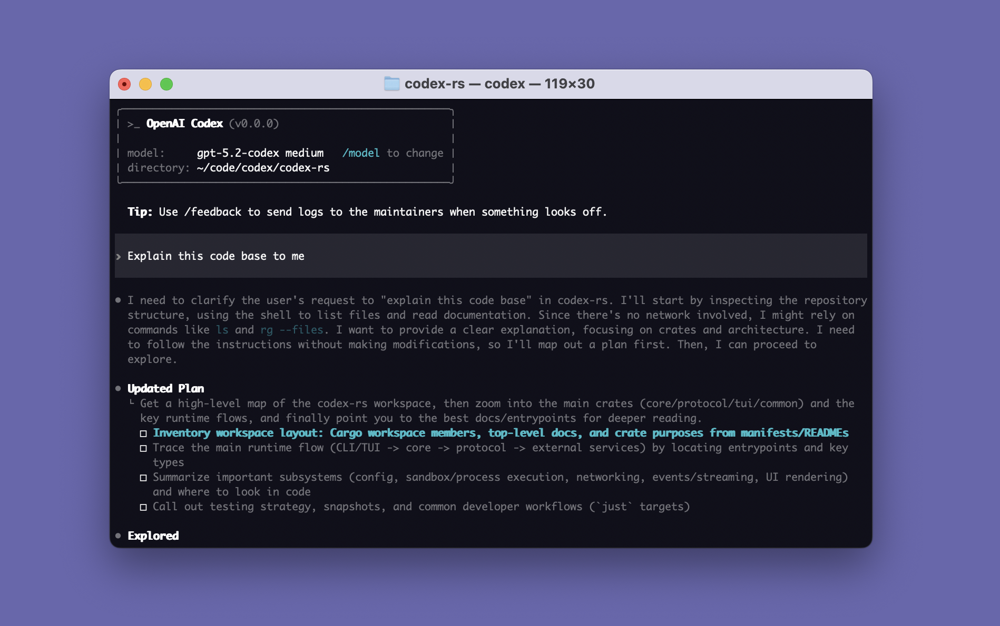
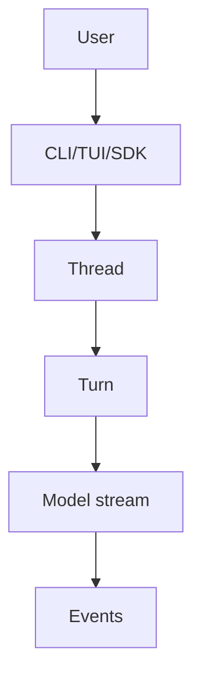
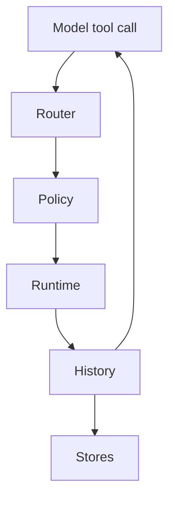

This book reconstructs the tracked source of OpenAI Codex at commit `07298a948cbac94c7b0b505e91279fc69786f78c`. It uses the local source snapshot as the corpus, but the PDF body cites only public GitHub commit URLs through the citation appendix.

# How to Use This Book

Read this as a guided source tour, not as a product manual or an implementation proposal. The goal is to leave with a mental model of how the repository is shaped, how a user request flows through entrypoints and runtime state, where model calls and tool calls cross boundaries, and where the source places permission, sandbox, account, persistence, protocol, and verification surfaces.

The course follows the source from outside to inside. First it establishes the product/runtime model and repository map. Then it traces runtime entrypoints, the session/turn loop, model streaming, tool dispatch, shell execution, app-server JSON-RPC, persistence, context, config, auth, sandboxing, plugins, MCP, skills, generated schemas, and live user journeys. Each lecture has learning goals, key terms, worked examples, source-reading pitfalls, self-check questions, and nearby citations.

The run was static. The target checkout was verified at the pinned commit, copied into an artifact snapshot, and inspected through read-only source commands. Builds, tests, generators, dependency installs, and Codex repo execution were not run. Treat every runtime statement as source reconstruction from tracked files, not as empirical runtime validation.

# Course Map

| Unit | Lectures | Main question |
|---|---:|---|
| Unit 1: What Codex Is | 1-2 | What product/runtime is this source implementing, and what surfaces are present? |
| Unit 2: Repository Map | 3-5 | Which directories, crates, schemas, tests, SDKs, and generated files matter? |
| Unit 3: Runtime Architecture | 6-8 | Where do requests enter, how are sessions represented, and how does the model boundary work? |
| Unit 4: The Main Execution Flow | 9-11 | How does user input move through TUI/CLI/app-server paths into core operations? |
| Unit 5: Agent Loop And Tooling | 12-15 | How does the turn loop call the model, expose tools, and execute tool requests? |
| Unit 6: State, Context, Prompts, And Persistence | 16-18 | What history, context, compaction, memory, rollout, and thread-store state is kept? |
| Unit 7: Safety, Permissions, Sandboxing, And Execution Boundaries | 19-21 | How do permission profiles, approval policy, sandbox transforms, and auth state interact? |
| Unit 8: App, Server, Plugin, MCP, And Remote Surfaces | 22-23 | What server, protocol, SDK, exec-server, MCP, plugin, and connector surfaces exist? |
| Unit 9: Source-Grounded User Journeys | 24 | How do complete journeys compose the preceding mechanisms without adding advisory design? |

## Lecture Evidence Spine

This table ties each lecture to the source evidence family it teaches. It is a compact map for readers who want to revisit a lecture by returning to the repository surfaces behind it rather than relying on the course prose alone [1](#source-1) [6](#source-6) [20](#source-20).

| Lecture | Evidence family | Primary source anchors |
|---|---|---|
| 1. Product and runtime model | Product framing, npm wrapper, native CLI dispatch, and app/server surfaces. | README product/install text, `codex-cli`, CLI parser, app-server main [2](#source-2) [3](#source-3) [8](#source-8) [10](#source-10) [39](#source-39). |
| 2. Reading the repository | Contributor guidance, generated artifacts, tests, platform gates, and feature gates. | `AGENTS.md`, app-server schema export, sandboxing, tests/snapshots [4](#source-4) [5](#source-5) [36](#source-36) [65](#source-65) [68](#source-68). |
| 3. Top-level repository map | Monorepo structure, Rust workspace, npm wrapper, SDKs, docs, workflows, and tracked-file corpus. | Workspace manifest, package wrapper, SDK packages, every-file ledger [6](#source-6) [7](#source-7) [8](#source-8) [66](#source-66) [67](#source-67). |
| 4. Rust crate roles | Runtime crates, utility crates, execution/sandbox crates, state/persistence crates, and MCP/plugin surfaces. | Cargo workspace, crate conventions, core/tools/sandbox/state files [4](#source-4) [6](#source-6) [7](#source-7) [30](#source-30) [36](#source-36). |
| 5. Protocols and generated surfaces | App-server protocol types, schema generation, SDK consumption, tests, and snapshots. | App-server protocol v2, export/filter code, SDKs, fixtures [44](#source-44) [45](#source-45) [65](#source-65) [66](#source-66) [68](#source-68). |
| 6. Entrypoints | Native CLI, TUI, exec, app-server, MCP server, exec-server, desktop app path, and lifecycle commands. | CLI parser/dispatch, TUI main, exec-server protocol, app-server main [10](#source-10) [11](#source-11) [12](#source-12) [38](#source-38) [39](#source-39). |
| 7. Session lifecycle | `Codex` spawn, submission queues, event streams, `Op`, thread store, and multi-agent version preservation. | Session module, protocol module, thread store, multi-agent sources [18](#source-18) [19](#source-19) [20](#source-20) [48](#source-48) [62](#source-62). |
| 8. Model boundary | `run_turn`, sampling request construction, Responses API client, HTTP/websocket paths, and stream events. | Turn code, model client, protocol events, event mapping [22](#source-22) [24](#source-24) [25](#source-25) [26](#source-26) [47](#source-47). |
| 9. Normal prompt | TUI startup, app-server/thread path, `Op::UserInput`, `TurnStartParams`, and prompt construction. | TUI main/lib, protocol, app-server v2 turn params, turn setup [12](#source-12) [14](#source-14) [20](#source-20) [22](#source-22) [45](#source-45). |
| 10. Slash and command-like paths | Slash registry, command availability, local dispatch, CLI subcommand distinction, and specialized operations. | Slash command files, CLI parser, protocol operations [10](#source-10) [15](#source-15) [16](#source-16) [20](#source-20). |
| 11. Settings plus user text | App-server start/turn params, active permission profile, sandbox policy compatibility, model/personality fields. | App-server processors and v2 thread/turn protocol [41](#source-41) [45](#source-45) [54](#source-54) [55](#source-55). |
| 12. Main loop | Turn context, model sampling, tool follow-up, context window, compaction, and turn termination. | Turn code, sampling code, context manager, compaction [22](#source-22) [24](#source-24) [59](#source-59) [60](#source-60). |

| Lecture | Evidence family | Primary source anchors |
|---|---|---|
| 13. Tool router | Tool specs, router dispatch, built-in/dynamic/MCP/extension tools, deferred tools, and provenance. | Tool modules, core turn integration, MCP/plugin/skills sources [23](#source-23) [27](#source-27) [28](#source-28) [64](#source-64). |
| 14. Shell and execution | Shell handler, shell runtime, approval cache, exec policy, patch path, and sandbox handoff. | Shell handler/runtime, approvals, exec policy, apply patch, sandboxing [30](#source-30) [31](#source-31) [32](#source-32) [33](#source-33) [36](#source-36). |
| 15. External tools | MCP client/server, hosted plugins, skills, connectors, dynamic tools, and explicit mention behavior. | Core turn integration, MCP/plugin/skills crates [23](#source-23) [27](#source-27) [64](#source-64). |
| 16. Prompts/context | Base/developer instructions, config-driven prompt fragments, environment context, context manager, reference context. | `AGENTS.md`, config/context sources, context manager [5](#source-5) [53](#source-53) [58](#source-58) [59](#source-59). |
| 17. Compaction | Token-budget context, context-window checks, manual and auto-compaction, history replacement. | Token budget/context manager/compaction sources [59](#source-59) [60](#source-60). |
| 18. Persistence | Thread store trait, rollout JSONL, local store, state DB, memory mode, summaries, and spawn edges. | Thread-store, rollout, state DB, local store sources [48](#source-48) [49](#source-49) [51](#source-51) [52](#source-52). |
| 19. Config/permissions | Config loader, managed requirements, permission profile, trusted project defaults, approval/sandbox fields. | Config and permission profile sources [53](#source-53) [54](#source-54) [55](#source-55). |
| 20. Execution boundaries | Exec policy, approvals, sandbox manager, macOS/Linux/Windows isolation, command runtime, and denial paths. | Exec policy, shell runtime, sandbox manager/platform sources [31](#source-31) [33](#source-33) [36](#source-36) [37](#source-37). |
| 21. Auth and failure modes | API key, ChatGPT auth, auth storage, unauthorized recovery, model/client failures, tool/sandbox failures. | Model client and login/auth sources [25](#source-25) [26](#source-26) [56](#source-56) [57](#source-57). |
| 22. App-server protocol | JSON-RPC processor, thread/turn request types, event mapping, thread items, and SDK consumption. | App-server main/message processor/protocol/event mapping/SDKs [39](#source-39) [40](#source-40) [44](#source-44) [47](#source-47) [66](#source-66). |
| 23. Exec-server | Structured process, filesystem, environment, and HTTP-style JSON-RPC protocol distinct from core shell tools. | Exec-server protocol, CLI entrypoint, shell runtime contrast [10](#source-10) [30](#source-30) [38](#source-38) [40](#source-40). |
| 24. Live journeys | Prompt, slash command, app-server turn, tool/permission, subagent, resume, compaction, and persistence traces. | Cross-cutting path through CLI/TUI, protocol, turn, tools, stores, app-server, and multi-agent sources [10](#source-10) [20](#source-20) [22](#source-22) [48](#source-48) [62](#source-62). |

# Prerequisite Crash Course

Codex is primarily a Rust workspace, but the repository also includes an npm wrapper, TypeScript and Python SDK surfaces, schema fixtures, workflows, docs, scripts, and checked-in generated artifacts. A Rust crate is a package; a workspace is the crate set managed together. In this repository, `codex-rs/Cargo.toml` is the best first map of runtime crates, because it names app-server, CLI, core, protocol, sandboxing, tools, TUI, MCP, plugin, state, rollout, thread-store, SDK-adjacent helpers, and many utilities in one place [6](#source-6) [7](#source-7).

The model boundary is an API boundary. Core builds a prompt and streams from the Responses API client; streamed items may become assistant text, reasoning, or tool calls. A tool call is not automatically shell execution: it is parsed into a payload, routed through a registry, checked against policy and approvals, and then executed through a runtime such as shell or MCP [22](#source-22) [24](#source-24) [28](#source-28).

The app-server is a JSON-RPC surface for clients. The TUI and SDKs do not need to reinvent the core loop; they can talk in terms of thread and turn requests, item notifications, and protocol schemas. App-server v2 types derive JSON schema and TypeScript exports, so the repository includes both handwritten protocol code and checked-in generated outputs [44](#source-44) [45](#source-45) [65](#source-65).

The persistence vocabulary matters. A thread is the user-visible conversation lineage. A turn is one submitted operation and its resulting model/tool activity. A rollout is a durable JSONL record of session items. The local thread store also maintains SQLite metadata for queryable state such as thread lists, child edges, and memory mode [48](#source-48) [49](#source-49) [51](#source-51) [52](#source-52).

# Unit 1: What Codex Is

## Lecture 1: Product And Runtime Model

### Learning goals

- Identify the product surfaces the repository itself names.
- Separate local CLI/TUI runtime, app-server surface, SDK surface, desktop app route, and Codex Web route.
- Read product claims as source evidence without inventing operational behavior that is not in the tracked files.

### Key terms

Local coding agent, CLI, TUI, app-server, Codex Web, desktop app, SDK, pinned source snapshot [2](#source-2) [8](#source-8) [10](#source-10).

### Explanation

The README opens with the product sentence: Codex CLI is a coding agent from OpenAI that runs locally on the user's computer. It immediately distinguishes the editor experience, desktop app path, and cloud-based Codex Web path. That first page is not the whole runtime, but it gives the correct product framing for the rest of the source: this repository is not only a terminal app and not only a cloud agent; it contains a local CLI surface plus app, server, protocol, SDK, and packaging surfaces that serve different clients [2](#source-2).

The repository's installation text names several packaging paths: install scripts, npm, Homebrew, and release binaries. The npm path is source-backed by the `codex-cli` wrapper package, whose launcher resolves a platform-specific native binary and spawns it with inherited stdio. The implementation is therefore not a Node agent; the Node package is a launcher and distribution wrapper around native binaries [3](#source-3) [8](#source-8).

At runtime, the default terminal experience is interactive. The top-level Rust CLI parser says no subcommand forwards options to the interactive CLI, and the CLI subcommand enum fans out to exec, review, login/logout, MCP, plugin, app-server, app, sandbox, apply, resume/archive/delete/fork, cloud, proxy, stdio-to-UDS, exec-server, and features surfaces. That breadth is the first sign that "Codex" in source means a family of local and server-facing surfaces around one core agent runtime [10](#source-10).

### Worked example

Suppose a reader sees `codex app`, `codex app-server`, and `Codex Web` in nearby documentation. The source-grounded reading is that `codex app` belongs to the desktop app path named by the README, `app-server` is a local JSON-RPC/server command in the CLI source, and Codex Web is the cloud-based product route named separately by the README. The mistake would be to collapse all three into one runtime process. The source instead gives three distinct surfaces with related branding [2](#source-2) [10](#source-10) [39](#source-39).

### Common mistakes

- Treating the npm package as the agent implementation. The source makes it a launcher around native binaries.
- Treating Codex Web as the same source surface as the local CLI. The README names it as the cloud-based agent, while the repository source emphasizes local CLI and app/server surfaces.
- Reading the subcommand list as proof every feature is active in every run. Several subcommands, feature gates, platform paths, and experimental APIs are mediated by config, platform, or flags.

### Self-check questions

1. Which source file gives the public product framing, and what product surfaces does it separate?
2. What does the npm wrapper do before the Rust binary starts?
3. Why is the top-level CLI subcommand enum a map of surfaces rather than a complete runtime trace?

### Sources

[2](#source-2), [3](#source-3), [8](#source-8), [10](#source-10), [39](#source-39).

## Lecture 2: How To Read This Repository From Source

### Learning goals

- Use the repository's own contributor guidance without confusing it with runtime behavior.
- Distinguish tracked source, generated artifacts, tests, schema fixtures, and local untracked files.
- Understand why the course avoids redesign advice and rebuild recipes.

### Key terms

Tracked source, generated schema, fixture, feature gate, contributor guidance, runtime mechanism, source-reading pitfall [4](#source-4) [5](#source-5) [65](#source-65).

### Explanation

The repository includes an `AGENTS.md` file that gives contributor guidance. It names crate conventions, sandbox environment caveats, model-visible context rules, app-server API guidance, test authoring guidance, and TUI style conventions. That file is valuable source evidence about how maintainers expect changes to be made and reviewed, but it is not the core runtime loop. A course reader should use it to understand source boundaries and maintainer terminology, not to infer behavior that only runtime code can establish [4](#source-4) [5](#source-5).

Generated artifacts need a similar separation. App-server protocol types are written in Rust and exported into JSON schema and TypeScript fixtures; SDK generated files are downstream surfaces; TUI and core snapshots are checked-in verification artifacts. A generated file is evidence of the public or test contract, but the generator/export code is the stronger source when explaining how that artifact is produced [65](#source-65) [68](#source-68).

Feature-gated and platform-gated code requires care. The source contains macOS seatbelt, Linux landlock/bubblewrap, and Windows sandbox paths, but platform selection and policy transforms decide which path is applicable. The same is true of multi-agent v1/v2 paths, app-server experimental fields, web search, token-budget context, and generated schema options. Source presence means "available in the codebase"; it does not by itself mean "active in this session" [36](#source-36) [37](#source-37) [62](#source-62) [65](#source-65).

### Worked example

If a reader sees a checked-in TypeScript file under the app-server protocol schema directory, the right reconstruction is two-step: first, identify it as generated schema output; second, read the Rust export and fixture code that writes and verifies that output. That keeps the course grounded in what the source actually does instead of treating generated declarations as handwritten control-flow logic [65](#source-65).

### Common mistakes

- Confusing contributor guidance in `AGENTS.md` with the runtime entrypoint.
- Treating checked-in generated schema files as the only source of protocol truth.
- Assuming tests were run because test files exist. This course inspected test source and fixtures but did not execute them.
- Assuming untracked local files are part of the source corpus. This run used tracked files at the pinned commit and ignored untracked files in the target checkout.

### Self-check questions

1. When is `AGENTS.md` useful evidence, and when is it insufficient?
2. Why does generated schema output need to be read together with generator code?
3. What is the difference between source presence and feature availability?

### Sources

[4](#source-4), [5](#source-5), [36](#source-36), [37](#source-37), [62](#source-62), [65](#source-65), [68](#source-68).

# Unit 2: Repository Map

## Lecture 3: Top-Level Repository Map

### Learning goals

- Identify the major top-level directories and what each contributes.
- Understand why `codex-rs/` dominates the implementation surface.
- Locate packaging, docs, scripts, SDKs, generated artifacts, and third-party patches.

### Key terms

Monorepo, Rust workspace, npm wrapper, SDK, workflow, patch, docs, artifact snapshot [6](#source-6) [8](#source-8) [66](#source-66) [67](#source-67).

### Explanation

The top level is a monorepo around a large Rust workspace. The root `package.json` is explicitly a private maintenance package with formatting and schema-generation scripts; it is not the user-facing npm package. The user-facing npm wrapper is in `codex-cli/`. The Rust implementation sits under `codex-rs/`. SDKs live under `sdk/`. Documentation, GitHub workflows, scripts, Bazel files, patches, and third-party support files fill out the repository [6](#source-6) [8](#source-8).

The tracked-file coverage ledger for this run counted 5,121 tracked files. The largest semantic buckets were TUI Rust crate files, app/server and persistence surfaces, core runtime files, tooling/MCP/plugin/skills surfaces, sandboxing/execution surfaces, tests/fixtures/snapshots, SDK files, build metadata, config/auth/policy files, protocol/schema/generated API files, docs, scripts, and vendored or patch evidence. Those buckets are mechanical coverage categories, not a substitute for semantic reading, but they keep the map honest.

The Rust workspace list is the best source-backed directory map. It names app-server, app-server-protocol, app-server-client, CLI, TUI, core, protocol, tools, sandboxing, exec-server, execpolicy, login, config, thread-store, rollout, state, MCP, plugin, skills, cloud tasks, model provider, connectors, SDK-adjacent helpers, and many utility crates. That list is not a runtime call graph, but it shows how the source has been split into ownership areas [6](#source-6) [7](#source-7).

### Worked example

To orient a new subsystem, start from the directory and then ask what kind of surface it is. `codex-rs/app-server-protocol` is a protocol/schema surface. `codex-rs/app-server` is server request processing. `codex-rs/core` is the agent/session/tool runtime. `codex-rs/tui` is terminal interaction and rendering. `codex-cli` is npm distribution. `sdk/python` and `sdk/typescript` wrap app-server/exec surfaces for external users [6](#source-6) [65](#source-65) [66](#source-66) [67](#source-67).

### Common mistakes

- Treating every top-level package as a runtime component. Some are packaging, maintenance, generated artifacts, or verification fixtures.
- Using file count as importance without reading code. The TUI has many files, but core/session code still defines the central loop.
- Ignoring SDKs because the core is Rust. SDK files reveal how app-server and exec surfaces are exposed outside the Rust workspace.

### Self-check questions

1. Which top-level directory contains the dominant Rust workspace?
2. Why is root `package.json` different from `codex-cli/package.json`?
3. What does the every-file ledger prove, and what does it not prove?

### Sources

[6](#source-6), [7](#source-7), [8](#source-8), [65](#source-65), [66](#source-66), [67](#source-67).

## Lecture 4: Rust Workspace And Crate Roles

### Learning goals

- Read `codex-rs/Cargo.toml` as the canonical crate inventory.
- Separate app, core, protocol, execution, sandbox, persistence, MCP/plugin/skills, and utility crates.
- Understand how crate naming supports source navigation.

### Key terms

Workspace member, crate, core runtime, protocol crate, utility crate, app-server crate, TUI crate [6](#source-6) [7](#source-7).

### Explanation

The workspace member list is long because Codex splits runtime responsibility across many crates. App-server crates own JSON-RPC server, daemon, client, protocol, transport, and tests. Core owns the central agent/session/tool runtime. Protocol owns shared operations, events, models, and config types. TUI owns terminal UI. Exec and exec-server own headless execution and process/filesystem protocol surfaces. Sandboxing, linux-sandbox, shell-command, shell-escalation, execpolicy, and process-hardening cluster around execution boundaries [6](#source-6) [7](#source-7).

MCP, plugin, connectors, skills, and extension crates represent external tool and app integration surfaces. Login, config, keyring-store, secrets, cloud-config, and model-provider-info are account and configuration support. Rollout, rollout-trace, thread-store, state, and agent-graph-store are persistence and state surfaces. Utilities such as absolute-path, path-uri, output-truncation, cache, pty, stream-parser, and cargo-bin keep cross-cutting details out of the large runtime crates [7](#source-7).

`AGENTS.md` says crate names are prefixed with `codex-`, using the `core` folder's crate `codex-core` as an example. That guidance is useful when mapping folder names to package names and when reading dependency declarations. It also warns that `codex-core` has grown large, which explains why the course treats core as central but not as the only important source boundary [4](#source-4).

### Worked example

If a model tool call reaches shell execution, multiple crates participate. Shared protocol types describe the call/event shapes, core routes and handles the tool call, exec policy evaluates command permission, sandboxing transforms process execution, and utility crates normalize paths/output. The source map therefore prevents a false "single file owns shell" reading [20](#source-20) [27](#source-27) [30](#source-30) [33](#source-33) [36](#source-36).

### Common mistakes

- Reading crate names as isolated products. Many crates are internal support layers for one runtime.
- Treating `codex-core` as the only source worth reading. It is central, but app-server, protocol, TUI, sandboxing, thread-store, and tools carry essential mechanisms.
- Assuming workspace membership implies a crate is active in all builds or sessions.

### Self-check questions

1. Which crates form the app-server family?
2. Which crates belong to execution and sandbox boundaries?
3. Why does `AGENTS.md` matter for crate naming but not replace reading runtime code?

### Sources

[4](#source-4), [6](#source-6), [7](#source-7), [20](#source-20), [27](#source-27), [30](#source-30), [33](#source-33), [36](#source-36).

## Lecture 5: Protocols, SDKs, Tests, And Generated Surfaces

### Learning goals

- Identify protocol/schema surfaces and generated artifacts.
- Understand how app-server schemas and SDK generated files relate to runtime APIs.
- Read test and snapshot files as verification posture, not as executed proof.

### Key terms

JSON-RPC, schema fixture, TypeScript export, SDK generated model, snapshot test, fixture, experimental API filtering [44](#source-44) [65](#source-65) [66](#source-66) [67](#source-67).

### Explanation

The app-server protocol crate exposes Rust protocol modules, JSON-RPC envelopes, export functions, and schema fixture helpers. The v2 protocol files define thread, turn, item, account, config, permissions, MCP, plugin, process, realtime, environment, and other API types with serialization, JSON schema, and TypeScript export derives. Generated TypeScript and JSON schema files are checked into `schema/`, and generator/fixture code writes and compares them [44](#source-44) [45](#source-45) [46](#source-46) [65](#source-65).

The TypeScript SDK and Python SDK are downstream surfaces. The TypeScript SDK exposes `Codex`, `Thread`, and exec helpers that start or resume threads, normalize input, stream turns, and spawn the CLI for `codex exec --experimental-json`. The Python SDK wraps app-server JSON-RPC over stdio and has generated protocol models. These are important because they show how non-Rust clients consume the app-server/exec contracts [66](#source-66) [67](#source-67).

The repository's verification posture includes core integration suites, TUI snapshots, app-server schema fixtures, config schema checks, hook schemas, apply-patch scenario fixtures, and SDK contract generation tests. This course did not run them. The source still teaches which behaviors maintainers have encoded as fixtures, snapshots, schema comparisons, and generated contract checks [5](#source-5) [68](#source-68) [69](#source-69).

### Worked example

When a course claim uses `TurnStartParams`, cite the Rust protocol type for the fields and the schema export files for generated contract behavior. Do not cite only the generated TypeScript output as if it were handwritten control flow. Conversely, when explaining SDK consumption, cite the SDK files that call the server surface rather than the core loop [45](#source-45) [65](#source-65) [66](#source-66) [67](#source-67).

### Common mistakes

- Confusing generated API declarations with the source that decides runtime behavior.
- Assuming a checked-in snapshot means the corresponding test was run in this course.
- Missing experimental API filtering: default schema outputs can omit experimental methods or fields that the Rust source still defines.

### Self-check questions

1. Which files define app-server v2 thread and turn request types?
2. What is the relationship between generated schema output and schema fixture writer code?
3. Why are SDK files part of the repository map even though the runtime core is Rust?

### Sources

[5](#source-5), [44](#source-44), [45](#source-45), [46](#source-46), [65](#source-65), [66](#source-66), [67](#source-67), [68](#source-68), [69](#source-69).

# Unit 3: Runtime Architecture

## Lecture 6: Entrypoints Across CLI, TUI, Exec, App-Server, And Exec-Server

### Learning goals

- Trace the main process entrypoints without executing them.
- Separate interactive TUI, headless exec, app-server, MCP server, desktop app path, and exec-server surfaces.
- Understand the dispatch role of the top-level `codex` binary.

### Key terms

Entrypoint, subcommand, clap parser, interactive TUI, headless exec, app-server, exec-server, MCP server [10](#source-10) [11](#source-11) [12](#source-12) [38](#source-38) [39](#source-39).

### Explanation

The top-level native CLI is the dispatcher. It parses global options, then either launches the interactive TUI when no subcommand is present or dispatches to subcommands such as exec, review, login/logout, MCP, plugin, app-server, app, sandbox, apply, resume/archive/delete/fork, cloud, proxy, stdio-to-UDS, exec-server, and features. The subcommand enum is the source map of command surfaces, while lower dispatch code shows which library entrypoint each path calls [10](#source-10) [11](#source-11).

Interactive mode flows into the TUI. The TUI main path parses its own top-level CLI, merges config overrides, calls `run_main`, handles output or errors, and can print a resume hint. The TUI library then owns terminal initialization, app-server attachment/startup, login/trust onboarding, session start/resume/fork decisions, chat widget construction, and event loops. That means "TUI" is more than rendering: it is the interactive client around the app-server/thread runtime [12](#source-12) [13](#source-13) [14](#source-14).

Headless exec is a separate user surface, but it does not imply a separate agent loop. The broad source reads show exec uses app-server protocol-style thread and turn requests. App-server itself is a JSON-RPC surface with listen modes and request processors. Exec-server is another server protocol, focused on process, filesystem, and HTTP-like operations through a JSON-RPC method set [38](#source-38) [39](#source-39) [40](#source-40).

### Worked example

If the user runs `codex review`, the top-level dispatch wraps review arguments into the exec path rather than launching the TUI. If the user runs `codex resume`, the top-level command finalizes TUI resume flags and launches the interactive path. Those are both session-related commands, but they enter different runtime surfaces [11](#source-11) [12](#source-12).

### Common mistakes

- Treating `codex` as a single path. The source makes it a dispatcher over several command families.
- Treating app-server as only an implementation detail of the TUI. It is also exposed as a CLI subcommand and consumed by SDK/client surfaces.
- Confusing exec-server with shell execution inside core. Exec-server has its own JSON-RPC process/filesystem protocol surface.

### Self-check questions

1. What happens when no subcommand is supplied to `codex`?
2. Which entrypoints are server surfaces rather than terminal UI surfaces?
3. Why is `codex review` closer to exec than to in-session `/review`?

### Sources

[10](#source-10), [11](#source-11), [12](#source-12), [13](#source-13), [14](#source-14), [38](#source-38), [39](#source-39), [40](#source-40).

## Lecture 7: Session And Thread Lifecycle

### Learning goals

- Understand the `Codex` interface as submission queue plus event stream.
- Follow how spawn arguments become a session configuration and background submission loop.
- Relate core session state to thread lifecycle and persistence.

### Key terms

Session, thread, submission, event, operation, turn, `Codex::spawn`, submission queue, thread store [18](#source-18) [20](#source-20) [48](#source-48).

### Explanation

The core `Codex` interface is a pair of queues around a `Session`: a submission sender and an event receiver. Spawn arguments include config, auth, model manager, environment manager, skills, plugins, MCP connection manager, initial history, session/thread sources, agent control, dynamic tools, exec policy manager, thread store, and multi-agent controls. That constructor surface is broad because a running session needs model access, tool systems, persistence, environment choices, and safety policy at turn time [18](#source-18).

`Codex::spawn` delegates to internal setup that builds bounded submission channels, unbounded events, exec policy management, model refresh strategy, base instructions, dynamic tools, session configuration, session state, and the submission loop. The source also preserves multi-agent version across resumed or forked histories, so thread lineage can affect collaboration semantics [18](#source-18) [19](#source-19) [62](#source-62).

The protocol side models a `Submission` with id, operation, optional client user-message id, and trace. The `Op` enum includes interrupt, cleanup, realtime operations, `UserInput`, thread settings, inter-agent communication, exec and patch approvals, and elicitation resolution. That is the command language between client surfaces and the core session loop [20](#source-20).

### Worked example

A TUI or app-server client does not call `run_turn` directly. It submits an `Op::UserInput` wrapped in a `Submission`. The session's submission loop receives it, applies thread settings and context, and eventually creates a `TurnContext`. That turn context feeds the model/tool loop and emits `EventMsg` variants back to clients [20](#source-20) [21](#source-21) [22](#source-22).

### Common mistakes

- Treating a thread as just a transcript file. The source also has live session state, event streams, thread metadata, and persistence stores.
- Reading `Op` as only user messages. It includes approvals, interrupts, realtime control, thread settings, and inter-agent communication.
- Assuming forked/resumed threads always use the current multi-agent defaults. The session code preserves version information from history or inherited configuration.

### Self-check questions

1. What are the two queue-like halves of the `Codex` interface?
2. Why does spawn need auth, model, thread-store, tool, and environment services?
3. Which protocol type carries user input into the session loop?

### Sources

[18](#source-18), [19](#source-19), [20](#source-20), [21](#source-21), [22](#source-22), [48](#source-48), [50](#source-50), [62](#source-62).

## Lecture 8: Model Boundary And Streaming

### Learning goals

- Identify where prompt sampling crosses into the model provider.
- Understand how HTTP and websocket Responses API streaming are selected.
- Separate model events from tool execution and UI notifications.

### Key terms

Responses API, prompt, sampling request, stream, websocket, HTTP fallback, response item, context window [22](#source-22) [24](#source-24) [25](#source-25) [26](#source-26).

### Explanation

The model boundary sits inside the turn loop. `run_turn` prepares history and turn context, then `run_sampling_request` builds tools, base instructions, a tool-call runtime, and a prompt before calling the model client. The comments around `run_turn` state the loop explicitly: sample from the model, handle function calls by executing tools and returning outputs into the next sampling request, and finish when the model produces assistant output without follow-up tool calls [22](#source-22) [24](#source-24).

The client has both HTTP and websocket Responses API streaming paths. The HTTP path builds a request, uses an API responses client to stream, records telemetry, and handles unauthorized recovery. The websocket path builds payloads, connects, falls back to HTTP when required, handles unauthorized refresh, records inference trace context, and maps stream events. The high-level stream function chooses websocket when enabled and healthy; otherwise it uses HTTP [25](#source-25) [26](#source-26).

Model output is not the same thing as UI output. Core model stream items become internal response items and protocol events. App-server event mapping and TUI rendering then convert those events into notifications or terminal surfaces. Tool calls are a model output type, but the side effects happen only after router/registry/policy/runtime handling [21](#source-21) [24](#source-24) [28](#source-28) [47](#source-47).

### Worked example

In a shell-tool turn, the first model stream may contain a function call. Core builds a tool call from the response item, dispatches it, records the tool output as a response item, then sends another sampling request with updated history. The assistant message appears only when the loop reaches a no-follow-up path [22](#source-22) [24](#source-24) [28](#source-28).

### Common mistakes

- Treating streamed text as the only model output. Reasoning, function calls, web search, image generation, and tool outputs have distinct event paths.
- Treating websocket and HTTP paths as two agent loops. They are transport options under the same client boundary.
- Assuming a function call is execution. It is first a model response item that must be routed, checked, executed, and returned.

### Self-check questions

1. What condition ends the `run_turn` sampling loop?
2. Where does websocket streaming fall back to HTTP?
3. Why is a model tool call not yet a shell command?

### Sources

[21](#source-21), [22](#source-22), [24](#source-24), [25](#source-25), [26](#source-26), [28](#source-28), [47](#source-47).

# Unit 4: The Main Execution Flow

## Lecture 9: Normal Prompt From CLI Or TUI

### Learning goals

- Trace a normal user prompt from launch to core `Op::UserInput`.
- Understand where TUI startup, app-server client state, and thread selection fit.
- Distinguish launch-time prompt handling from model-visible prompt construction.

### Key terms

Initial prompt, chat widget, app event, active thread, `turn/start`, `Op::UserInput`, client user-message id [12](#source-12) [14](#source-14) [20](#source-20) [45](#source-45).

### Explanation

In the interactive path, the top-level CLI normalizes prompt text and calls TUI `run_main`. TUI startup builds terminal state, app-server access, account/config state, and a thread path: start fresh, resume, fork, or route through a picker. Once the chat widget is active, user input becomes app events and eventually app-server/core operations rather than a direct model call [12](#source-12) [13](#source-13) [14](#source-14).

The protocol object for submitted user text is `Op::UserInput`. It carries input items, optional final-output schema, Responses API client metadata, additional context, and thread settings. App-server v2 `TurnStartParams` has analogous fields: thread id, client user-message id, input, metadata, additional context, environments, cwd, runtime workspace roots, approval policy, reviewer, sandbox policy or permissions profile, model, service tier, effort, summary, personality, output schema, and collaboration mode [20](#source-20) [45](#source-45).

The key reading distinction is between user prompt text and model prompt payload. User text enters as structured input. The model prompt is later built from history, base instructions, context fragments, tool specs, settings, and possibly skill/plugin injections. A normal prompt is therefore not "sent directly"; it is recorded and contextualized before sampling [22](#source-22) [24](#source-24) [58](#source-58) [59](#source-59).

### Worked example

A user launches `codex "summarize this repo"`. The CLI treats that as an initial prompt for interactive mode when no subcommand is present. The TUI starts a thread, queues the initial user message, and the session receives `Op::UserInput`. Only inside `run_turn` does history become a model prompt with base instructions and tool definitions [10](#source-10) [12](#source-12) [20](#source-20) [22](#source-22) [24](#source-24).

### Common mistakes

- Believing command-line prompt text bypasses app/thread/session machinery.
- Treating `TurnStartParams.input` as the full model prompt. It is one source of input, not the whole prompt.
- Missing that app-server turn parameters can update settings for subsequent turns, so a "prompt" may carry runtime settings too.

### Self-check questions

1. Which operation type carries normal user input in core protocol?
2. What does TUI startup decide before a prompt can become a turn?
3. Why is model prompt construction later than user input submission?

### Sources

[10](#source-10), [12](#source-12), [13](#source-13), [14](#source-14), [20](#source-20), [22](#source-22), [24](#source-24), [45](#source-45), [58](#source-58), [59](#source-59).

## Lecture 10: Slash Commands And Command-Like Paths

### Learning goals

- Separate TUI slash commands from CLI subcommands.
- Understand slash command parsing, availability, and dispatch.
- Recognize source-reading pitfalls around command names that appear in multiple places.

### Key terms

Slash command, command palette, inline args, availability filter, CLI subcommand, in-session command [10](#source-10) [15](#source-15) [16](#source-16).

### Explanation

Slash commands are a TUI command system. The slash command enum includes user-facing commands for feedback, new, init, compact, review, rename, resume, archive, delete, clear, fork, app, quit, copy, raw, diff, mention, skills, import, hooks, status, usage, debug config, theme, process status, stop, model, IDE, personality, plan, goal, agent, permissions, keymap, vim, sandbox read roots, experimental settings, memories, MCP, apps, plugins, logout, and more. Visibility is filtered by platform, debug mode, feature support, task-running state, and side-conversation state [15](#source-15).

Slash dispatch is handled in chat widget code after composer parsing. Bare commands and inline-argument commands are dispatched separately, and accepted commands can record history. Some commands open panels or popups; others submit operations, alter UI state, or route to app-server actions. This is local TUI behavior, not ordinary text sent to the model by default [16](#source-16).

CLI subcommands with the same words are separate surfaces. `codex resume` at process launch sets TUI resume flags and launches interactive mode. In-session `/resume` is parsed by the chat widget. `codex review` wraps exec review; `/review` is an in-session TUI review command. A source-grounded course has to name the surface before tracing behavior [11](#source-11) [12](#source-12) [15](#source-15) [16](#source-16).

### Worked example

If a user types `/compact` in the TUI, the input is intercepted as a slash command and can route to compaction behavior. If a user types a filesystem path beginning with `/`, slash parsing has to avoid treating every leading slash as a command. The source-specific read reports identify that slash parsing is first-line and prefix-based with fallbacks for noncommands [15](#source-15) [16](#source-16).

### Common mistakes

- Treating slash commands as text prompts. Recognized slash commands are local UI commands.
- Treating CLI `resume` and TUI `/resume` as the same path.
- Assuming enum presence means a command is visible. Availability filters and feature gates matter.

### Self-check questions

1. Which files define the slash command registry and dispatch path?
2. Why can the same word, such as `review`, name different paths?
3. What source mechanism prevents every slash-like input from being model text?

### Sources

[11](#source-11), [12](#source-12), [15](#source-15), [16](#source-16).

## Lecture 11: Settings, Thread Updates, And App-Server Turns

### Learning goals

- Trace how app-server `turn/start` maps settings and input into core operations.
- Understand thread-level versus turn-level settings.
- Identify where active permission profiles, sandbox policy, model, effort, and personality are represented.

### Key terms

Thread settings, turn settings, runtime workspace roots, permission profile, approval policy, app-server v2, request processor [41](#source-41) [45](#source-45) [55](#source-55).

### Explanation

App-server v2 distinguishes thread start, thread settings update, thread resume, and turn start. `ThreadStartParams` can include model, provider, service tier, cwd, runtime workspace roots, approval policy, approvals reviewer, sandbox or permissions, config map, base and developer instructions, personality, ephemeral flag, thread source, environments, dynamic tools, selected capability roots, and experimental raw events. `ThreadStartResponse` returns thread summary, model/provider/service tier, cwd, runtime workspace roots, instruction sources, approval policy, reviewer, sandbox compatibility policy, active permission profile, and reasoning effort [44](#source-44).

`TurnStartParams` does the per-turn version of this work. It includes thread id, client user-message id, input, Responses API client metadata, additional context, environments, cwd, runtime workspace roots, approval policy, reviewer, sandbox policy, permissions profile, model, service tier, effort, summary, personality, output schema, and collaboration mode. In the request processor, these fields are converted into thread settings overrides and core `Op::UserInput` with additional context and client metadata [41](#source-41) [45](#source-45).

The app-server message processor is the central request dispatcher. It deserializes JSON-RPC requests, constructs request context/trace metadata, handles initialization, gates experimental requests, serializes selected operations, and delegates to request processors. This means app-server is not just a type crate; it is a live request routing surface around core session/thread behavior [40](#source-40) [41](#source-41).

### Worked example

An IDE client sends `turn/start` with a new model and a permissions profile. App-server validates and maps those fields into thread settings for the turn and subsequent turns, then submits a core user input operation. The model call later uses the updated turn context; shell tools later see the effective approval and permission profile rather than the raw app-server JSON object [41](#source-41) [45](#source-45) [53](#source-53) [54](#source-54).

### Common mistakes

- Assuming app-server settings are only UI preferences. Some fields affect model choice, approval policy, sandbox policy, permission profile, workspace roots, and context.
- Combining `sandboxPolicy` and named `permissions` in mental models. The v2 protocol documents that named permissions cannot be combined with sandbox policy in relevant request types.
- Treating response fields like `activePermissionProfile` as legacy sandbox policy. The source explicitly keeps compatibility sandbox fields while exposing active permission profile provenance.

### Self-check questions

1. What is the difference between `ThreadStartParams` and `TurnStartParams`?
2. Where does app-server map turn input into core operations?
3. Why does active permission profile matter alongside legacy sandbox policy?

### Sources

[40](#source-40), [41](#source-41), [44](#source-44), [45](#source-45), [53](#source-53), [54](#source-54).

# Unit 5: Agent Loop And Tooling

## Lecture 12: The `run_turn` Loop

### Learning goals

- Reconstruct the turn loop from source comments and control flow.
- Understand pre-sampling compaction, context updates, hooks, and follow-up decisions.
- Connect model sampling results to tool execution and turn completion.

### Key terms

Turn context, pending input, sampling request, follow-up, context window, auto-compaction, turn completion [22](#source-22) [24](#source-24) [59](#source-59) [60](#source-60).

### Explanation

The source comment at the top of `run_turn` gives the course's central mental model: the loop samples from the model; if the model returns function calls, those calls are executed and their outputs are sent in the next sampling request; if the model returns only an assistant message, the turn completes. The implementation around that comment sets up model session prewarming, pre-sampling compaction, context updates, hooks, skill/plugin construction, pending input recording, connector selection, metadata, token status, and context-window handling [22](#source-22).

The loop clones history for prompt construction, builds sampling request input, calls `run_sampling_request`, processes token usage and follow-up, handles auto-compaction, and finalizes when no follow-up remains. Error paths include turn abortion, invalid image requests, context-window handling, and generic error emission. That means the core loop is a stateful orchestrator around model I/O, not a single API call [22](#source-22) [24](#source-24).

Tool and plugin availability is assembled per turn. Guardian sessions skip skill/plugin interpretation. Otherwise the turn code can load plugin data, inspect explicit plugin mentions, list MCP tools when app or plugin conditions require it, build connector lists, evaluate skill mentions and dependencies, and inject skill/plugin context. These paths explain why the tool surface can vary by turn [23](#source-23).

### Worked example

A normal prompt asks for a file edit. First sampling may return a shell or apply-patch call. The turn loop dispatches that tool, records its output, then samples again with the result. If the second sampling returns an assistant message without more tool calls, stop hooks run, warnings may emit, and the turn completes [22](#source-22) [24](#source-24) [28](#source-28) [30](#source-30).

### Common mistakes

- Treating `run_turn` as "call model once." It is a loop across model output, tool output, and follow-up sampling.
- Assuming the tool list is static. Per-turn context, features, MCP, plugins, skills, dynamic tools, and model/tool modes affect it.
- Ignoring compaction in turn flow. Pre-sampling and auto-compaction paths can rewrite history before or during turn execution.

### Self-check questions

1. What two model result shapes drive the loop's next step?
2. Why does the turn clone history before prompt construction?
3. Where do skills/plugins enter the turn?

### Sources

[22](#source-22), [23](#source-23), [24](#source-24), [28](#source-28), [30](#source-30), [60](#source-60).

## Lecture 13: Tool Router And Model-Visible Tool Surface

### Learning goals

- Identify how model response items become tool invocations.
- Separate model-visible specs, deferred tools, dynamic tools, MCP tools, and extension tools.
- Understand registry dispatch and unsupported-tool handling.

### Key terms

Tool spec, tool payload, tool router, registry, MCP tool, dynamic tool, extension executor, deferred tool [27](#source-27) [28](#source-28) [29](#source-29) [64](#source-64).

### Explanation

The tool router stores a registry plus model-visible specs. Its params include MCP tools, deferred tools, tool suggestions, extension executors, and dynamic tools. It can expose specs to the model, build tool calls from model response items, map function calls, tool-search calls, and custom tool calls into `ToolPayload` variants, and dispatch tool invocations through the registry [27](#source-27) [28](#source-28).

Tool-building happens after the model stream produces a response item. That distinction matters: the model produces a structured request; the router validates what kind of request it is; the registry finds a runtime; the runtime may emit events, ask approval, perform side effects, and return a response item for model history. Unsupported tools become model-facing errors rather than arbitrary execution [28](#source-28) [29](#source-29).

The turn builds tools before sampling. It loads MCP manager state, plugin information, connector tools, tool suggestions, MCP exposure, extension executors, and dynamic tools into a `ToolRouter`. The model sees only the specs that are visible for that turn and mode. Some tools can be direct, deferred, direct-model-only, hidden, or provided through extensions [24](#source-24) [64](#source-64).

### Worked example

When the model asks for `shell`, the router does not execute a string. It builds a function payload, dispatches a `ToolInvocation`, and the shell handler constructs a `ShellRequest` with command, cwd, environment, network, sandbox permissions, approval requirement, and justification. Only then does a shell runtime handle approval and sandbox execution [28](#source-28) [30](#source-30) [31](#source-31).

### Common mistakes

- Reading a tool spec as proof a side effect happened. Specs are model-visible contracts, not execution.
- Ignoring deferred/searchable tools. Not every available tool is necessarily in the immediate model-visible list.
- Treating MCP, extension, dynamic, and built-in tools as the same source path. The router unifies them at dispatch, but their discovery and execution code differs.

### Self-check questions

1. What inputs does the `ToolRouter` receive?
2. How does a model function call become a runtime invocation?
3. Why can two turns expose different tool surfaces?

### Sources

[24](#source-24), [27](#source-27), [28](#source-28), [29](#source-29), [30](#source-30), [31](#source-31), [64](#source-64).

## Lecture 14: Shell, Apply Patch, And Permission Flow

### Learning goals

- Trace shell-like tool execution from handler to runtime.
- Understand approval, exec policy, sandbox transform, and output return.
- Separate `apply_patch` interception from ordinary shell execution.

### Key terms

Shell request, approval requirement, exec policy, permission profile, sandbox attempt, command output, apply patch [30](#source-30) [31](#source-31) [33](#source-33) [36](#source-36).

### Explanation

The shell handler starts by verifying the primary turn environment has shell access. It normalizes explicit environment overrides, additional permissions, and escalation requests. It rejects explicit escalation in non-`OnRequest` modes unless preapproved, intercepts `apply_patch`, emits begin events, calls the exec policy manager, constructs a `ShellRequest`, and runs it through the tool orchestrator and shell runtime. Finished output is emitted and returned to the model [30](#source-30).

The shell runtime implements approvable and sandboxable behavior. It defines cache keys for command/cwd/permissions, uses session approval when needed, handles network approval specs, chooses shell backend, builds effective permissions, applies managed network policy, prepares environment, transforms the command through sandboxing, and executes under a sandbox attempt. This is the point where user approval and sandbox configuration become process execution state [31](#source-31) [32](#source-32) [36](#source-36).

`apply_patch` is special. The shell handler intercepts it so file changes can go through patch handling rather than being treated as an arbitrary shell command. The app-server item protocol also has file-change approval decisions distinct from command execution approval decisions, preserving a separate file-change surface in UI/server output [30](#source-30) [46](#source-46).

### Worked example

If the model requests `python script.py` with `require_escalated`, the handler checks approval mode before permitting escalation. In `on-request`, it can form an approval request. In modes where escalation is not allowed, the source returns a model-facing rejection instead of running the command. If approved, the runtime still applies sandbox policy and permission profile before execution [30](#source-30) [31](#source-31) [32](#source-32) [33](#source-33).

### Common mistakes

- Assuming approval is the same as sandbox bypass. Approval and sandbox transform are separate mechanisms.
- Treating `apply_patch` as just a shell command. The source intercepts it for patch-specific handling.
- Assuming a command string is evaluated as one atom. Exec policy can parse command segments and evaluate policy across them.

### Self-check questions

1. What does the shell handler check before constructing a `ShellRequest`?
2. What is cached for command approval?
3. Why does patch approval differ from command approval?

### Sources

[30](#source-30), [31](#source-31), [32](#source-32), [33](#source-33), [36](#source-36), [46](#source-46).

## Lecture 15: MCP, Plugins, Skills, Connectors, And Dynamic Tools

### Learning goals

- Map external tool surfaces without collapsing them into one mechanism.
- Understand how MCP tools/resources, plugins, skills, connectors, and dynamic tools enter turns.
- Identify source boundaries for app connector and plugin-driven tool exposure.

### Key terms

MCP, plugin, skill, connector, dynamic tool, resource, deferred tool, tool search, explicit mention [23](#source-23) [27](#source-27) [64](#source-64).

### Explanation

MCP and plugin surfaces are present at several layers. The `codex-mcp` crate exports MCP connection/resource clients, catalog resolution, app connector auth elicitation, hosted plugin runtime config, OAuth support, and tool provenance. The MCP server crate provides a stdio JSON-RPC processor with Codex tool config and approval handling. The plugin crate defines package models, manifests, providers, app connector declarations, capability summaries, hook sources, and metadata [64](#source-64).

The turn-level code decides what to include. It can load plugins, handle explicit plugin mentions, list MCP tools when apps or plugin mentions require it, build connector lists, resolve skill mentions and dependencies, and inject skill/plugin instructions. The tool router then receives MCP tools, deferred tools, suggestions, extension executors, and dynamic tool specs for that turn [23](#source-23) [24](#source-24) [27](#source-27) [64](#source-64).

Skills are a source-managed instruction mechanism. The skills crate embeds system skills, writes them under a Codex home system directory, fingerprints embedded content, and supports skill metadata/instructions through core-skills. A skill mention in user input is not the same as a plugin install; skill instructions are context injected into the model, while plugins can contribute MCP/app/tool surfaces and local package metadata [23](#source-23) [58](#source-58) [64](#source-64).

### Worked example

If a user mentions a skill path and also uses an app connector, the turn may include skill instructions, connector descriptors, and MCP tools. The source path is not "the skill runs code." It is: user input is inspected, skill metadata is resolved, instructions are injected, app/MCP tools may be listed, and any actual tool call later goes through router/registry execution [23](#source-23) [24](#source-24) [28](#source-28) [64](#source-64).

### Common mistakes

- Treating skills as executable plugins. In this source, skills primarily supply structured instructions and metadata.
- Assuming MCP tools are always listed. Tool exposure depends on config, apps, plugin mentions, and turn context.
- Confusing dynamic tools with built-in tools. Dynamic tool specs are input to the router, but their provenance differs.

### Self-check questions

1. Which crates/files represent MCP client/server surfaces?
2. Where does the turn decide which skills/plugins/connectors to include?
3. What is the difference between a skill instruction and a model tool call?

### Sources

[23](#source-23), [24](#source-24), [27](#source-27), [28](#source-28), [58](#source-58), [64](#source-64).

# Unit 6: State, Context, Prompts, And Persistence

## Lecture 16: Context Fragments, Instructions, And Prompt Construction

### Learning goals

- Identify base instructions, developer instructions, user instructions, and context fragments.
- Understand how context is recorded and normalized before model sampling.
- Avoid confusing user text with the full prompt payload.

### Key terms

Base instructions, developer instructions, contextual fragment, history, prompt, context manager, reference context item [5](#source-5) [58](#source-58) [59](#source-59).

### Explanation

Configuration carries optional base instructions and developer instructions overrides, plus booleans controlling whether permission, app, collaboration, skill, and environment context blocks are injected. Turn context carries developer instructions, user instructions, personality, model info, permission profile, dynamic tools, turn skills, and environment selection. The prompt sent to the model is therefore built from several configured and runtime sources, not just user text [53](#source-53) [54](#source-54) [58](#source-58).

The context module organizes model-visible fragments: app instructions, available plugins, available skills, collaboration mode, environment context, hook context, image-generation instructions, internal model context, permissions, personality, plugin instructions, recommended plugins, subagent notifications, token budget, user instructions, and shell command context. The repository guidance says injected fragments must be bounded and implemented as context fragments, which matches the code organization [5](#source-5) [58](#source-58).

The context manager stores response items, history version, token info, and a reference context item used for diffing. It records API message items, normalizes history for prompt input modalities, estimates token count, replaces invalid images, drops user turns for rollback, and updates token info. That makes history an active runtime object, not a plain append-only transcript [59](#source-59).

### Worked example

When the user submits "edit this file", the prompt also reflects the selected model, base instructions, developer/user instructions, environment context, available tools, permissions guidance, and possibly skill or plugin instructions. The context manager normalizes history and strips unsuitable items for the model's input modalities before sampling [24](#source-24) [53](#source-53) [58](#source-58) [59](#source-59).

### Common mistakes

- Treating a user message as the complete prompt.
- Confusing context fragments with arbitrary string concatenation. The source organizes them as fragment types.
- Ignoring reference context items, which are used for diffing and reinjection after rollback or compaction.

### Self-check questions

1. Which config fields affect instruction injection?
2. What does the context manager store besides raw response items?
3. Why does model modality affect prompt history?

### Sources

[5](#source-5), [24](#source-24), [53](#source-53), [54](#source-54), [58](#source-58), [59](#source-59).

## Lecture 17: Token Budget, Context Windows, And Compaction

### Learning goals

- Understand token-budget context and auto-compaction triggers.
- Trace manual and inline compaction source paths.
- Explain compaction replacement history without inventing new memory systems.

### Key terms

Token budget, context window, compaction prompt, replacement history, summarization prompt, auto-compaction window [59](#source-59) [60](#source-60).

### Explanation

Token-budget context is feature-gated. The token-budget code records remaining-context fragments only when the feature is enabled, a model context window exists, token usage increases, and usage crosses configured thresholds. It calculates tokens left and records a contextual user fragment into conversation history [61](#source-61).

Compaction uses a summarization prompt, either configured or default. Manual compaction emits a turn-start event, then calls the same inner compaction machinery with manual trigger and user-requested reason. Inline auto-compaction selects initial-context injection behavior depending on phase. The implementation records a context-compaction turn item, clones history, records compaction input, creates a model client session, builds a prompt from history plus base instructions, drains the stream to completion, and then replaces history as needed [60](#source-60).

The source has a specific distinction for initial context injection. Pre-turn/manual compaction variants replace history with summary and clear reference context so the next regular turn reinjects initial context. Mid-turn compaction can inject initial context before the last user message because the model is trained to see the summary as the last item after mid-turn compaction. That is a source-specific mechanism, not generic summarization advice [60](#source-60).

### Worked example

If a turn crosses a context-window threshold, the token-budget feature may add a remaining-context fragment. If the context window is exceeded or auto-compaction conditions apply, the compaction task can summarize history using the configured prompt and replace the session history. Later turns see the compacted history plus reinjected initial context as governed by the compaction mode [22](#source-22) [60](#source-60) [61](#source-61).

### Common mistakes

- Treating compaction as a text-only utility outside the model loop. The source uses model sampling and session history replacement.
- Assuming token-budget context is always active. It is feature-gated and threshold-based.
- Confusing compaction with long-term memory. Memory mode appears in thread metadata, but compaction is history-window management.

### Self-check questions

1. What conditions must hold before token-budget context is recorded?
2. How does manual compaction differ from inline auto-compaction in trigger and initial context behavior?
3. Why does compaction use base instructions in its prompt?

### Sources

[22](#source-22), [53](#source-53), [59](#source-59), [60](#source-60), [61](#source-61).

## Lecture 18: Persistence, Rollout JSONL, Thread Store, And State DB

### Learning goals

- Identify persistence layers: rollout JSONL, thread store trait, local store, and state DB.
- Understand how thread metadata and history are stored and queried.
- Separate durable source evidence from runtime validation not performed here.

### Key terms

Thread store, rollout recorder, JSONL, SQLite state DB, thread metadata, memory mode, spawn edge [48](#source-48) [49](#source-49) [51](#source-51) [52](#source-52).

### Explanation

The `ThreadStore` trait defines the persistence contract: create, resume, append items, persist items, flush, shutdown, discard, load history, read thread, list threads, search, list turns/items, update, archive, and delete. That trait boundary matters because app-server and core code can talk to persistence through a storage-neutral interface [48](#source-48).

The local thread store combines durable rollout JSONL and a SQLite state DB. Its module comments say live appends write canonical JSONL while metadata patches update SQLite; history can be loaded from a live rollout or from stored thread files. Thread metadata includes cwd, model provider, and memory mode. Create/resume/append types carry thread id, parent/fork ids, source, base instructions, dynamic tools, multi-agent version, and metadata [49](#source-49) [50](#source-50).

The rollout recorder persists JSONL session items and supports create/resume writer commands. The runtime state DB has functions to read thread records, set previews, upsert spawn edges, list children and descendants, and find child/descendant threads by agent path. This is how multi-agent/thread lineage becomes queryable state instead of only transcript text [51](#source-51) [52](#source-52).

### Worked example

When a thread is resumed, app-server can rejoin a running thread or load non-running history by id, path, or provided history. The local store then reconstructs stored history and metadata from rollout/state sources. If a subagent was spawned, state DB spawn-edge records allow parent/child traversal by thread id or agent path [42](#source-42) [48](#source-48) [49](#source-49) [52](#source-52).

### Common mistakes

- Treating rollout JSONL as the only persistence layer. SQLite state holds queryable metadata and relationships.
- Treating thread id, parent thread id, and forked-from id as interchangeable. The source uses distinct fields.
- Assuming persistence behavior was validated by this course. The source was inspected; the storage paths were not executed.

### Self-check questions

1. What operations does the `ThreadStore` trait define?
2. What does the local store use JSONL for, and what does SQLite add?
3. How are subagent spawn edges represented in state?

### Sources

[42](#source-42), [48](#source-48), [49](#source-49), [50](#source-50), [51](#source-51), [52](#source-52), [63](#source-63).

# Unit 7: Safety, Permissions, Sandboxing, And Execution Boundaries

## Lecture 19: Config And Permission Profiles

### Learning goals

- Understand configuration as layered, constrained state rather than one file.
- Explain permission profiles and legacy sandbox compatibility.
- Connect active permission profile to runtime filesystem/network policy.

### Key terms

Config layer, requirements, constrained value, permission profile, workspace roots, sandbox policy, approval policy [53](#source-53) [54](#source-54) [55](#source-55).

### Explanation

`Config` is loaded from disk and overrides into an application configuration. It stores provenance in a config layer stack, startup warnings, model/provider settings, context-window and auto-compaction limits, effective permission configuration, custom permission profiles, approvals reviewer, residency constraints, reasoning display flags, base/developer instructions, context-injection toggles, compact prompt, notification/TUI settings, and many other runtime fields [53](#source-53).

The config loader applies requirements and overrides. It rejects incompatible override combinations such as specifying both legacy sandbox mode and permission profile, resolves feature flags, cwd, active project trust, effective permission selection, workspace roots, permission profile syntax, network proxy configuration, approval policy, managed filesystem constraints, helper readable roots, and active permission profile state. It also preserves compatibility between legacy sandbox policy and newer profile-based permissions [54](#source-54) [55](#source-55).

Built-in permission profiles include read-only, workspace, and danger-full-access. The default built-in profile depends on project trust and Windows sandbox state. Workspace profiles can control filesystem and network policy. The config code materializes workspace roots and additional readable roots for runtime helpers. Shell execution later consumes the effective permission profile, not just a raw config string [55](#source-55) [31](#source-31) [36](#source-36).

### Worked example

An app-server client selects a named permissions profile for a turn. Protocol types carry that profile id, config resolves it into effective permission state, thread settings expose active permission profile provenance, and shell runtime later receives filesystem/network sandbox policies derived from the permission profile. The same run may still expose a legacy sandbox policy for compatibility [44](#source-44) [45](#source-45) [53](#source-53) [54](#source-54) [55](#source-55).

### Common mistakes

- Treating `sandbox_mode` as the only permission representation. The source has profile-based permissions and compatibility sandbox policy.
- Ignoring managed requirements. Config requirements can constrain approval policy, permission profile, web search, Windows sandbox mode, filesystem, and network behavior.
- Assuming trusted project status simply disables safety. The default profile selection uses trust, but runtime policy still flows through permission profile and sandboxing.

### Self-check questions

1. What does `Config` store beyond model selection?
2. Which override combinations does config reject?
3. How does a permission profile reach shell execution?

### Sources

[31](#source-31), [36](#source-36), [44](#source-44), [45](#source-45), [53](#source-53), [54](#source-54), [55](#source-55).

## Lecture 20: Exec Policy And Sandbox Manager

### Learning goals

- Explain command approval requirements from exec policy source.
- Understand sandbox type selection and platform transforms.
- Separate policy decisions, user approvals, and OS isolation mechanisms.

### Key terms

Exec policy, approval requirement, sandbox type, seatbelt, landlock, Linux sandbox, Windows restricted token, network policy [31](#source-31) [33](#source-33) [36](#source-36) [37](#source-37).

### Explanation

Exec policy evaluates command prompts and parsed command segments. It can reject, prompt, allow, or forbid commands depending on approval policy, configured exec policy, sandbox restrictions, known-safe command logic, dangerous command detection, and unmatched-command rendering. An allowed policy decision can bypass sandbox only when parsed segments explicitly match policy; otherwise sandbox and approval logic remain in play [33](#source-33) [34](#source-34).

The sandbox manager defines sandbox types: none, macOS seatbelt, Linux seccomp, and Windows restricted token. It selects an initial sandbox according to requested mode and policy. Its transform builds effective filesystem and network permission profiles, then wraps commands through platform-specific mechanisms: `/usr/bin/sandbox-exec` on macOS, `codex-linux-sandbox` on Linux, and Windows restricted/elevated handling when supported. Transform errors represent unsupported or unenforceable sandbox requests [36](#source-36) [37](#source-37).

This is a layered boundary. Exec policy decides whether a command can proceed, needs approval, or is forbidden. Approval can ask the user or guardian reviewer. Sandbox transform decides how the process is constrained. Filesystem and network policies are derived from permission profiles and managed constraints. None of these alone is the complete safety model [31](#source-31) [32](#source-32) [33](#source-33) [34](#source-34) [36](#source-36).

### Worked example

A command with network access under restricted workspace permissions can require network approval, command approval, or sandbox execution depending on policy and command parsing. If approved, the runtime still constructs a sandboxed command with effective permissions. If policy forbids it, the command is rejected before execution. If a platform sandbox cannot enforce a requested policy, transform errors preserve that boundary [31](#source-31) [33](#source-33) [34](#source-34) [36](#source-36) [37](#source-37).

### Common mistakes

- Equating approval with full trust. Approval can authorize an action while sandbox policy still constrains execution.
- Assuming macOS, Linux, and Windows share the same sandbox implementation. The source has platform-specific transforms.
- Reading danger-full-access paths as default behavior. They are explicit permission modes, not the ordinary safe path.

### Self-check questions

1. What are the possible command approval outcomes?
2. Which sandbox types are represented in the sandbox manager?
3. Why can a command be approved but still sandboxed?

### Sources

[31](#source-31), [32](#source-32), [33](#source-33), [34](#source-34), [36](#source-36), [37](#source-37).

## Lecture 21: Auth, Account, Managed Settings, And Failure Modes

### Learning goals

- Identify authentication modes and storage backends.
- Connect auth/account handling to model client recovery paths.
- Read failure modes as source behavior, not generic reliability advice.

### Key terms

API key, ChatGPT auth, agent identity, personal access token, Bedrock API key, keyring, auth.json, unauthorized recovery [25](#source-25) [26](#source-26) [56](#source-56) [57](#source-57).

### Explanation

The auth manager models several authentication mechanisms: API key, ChatGPT, ChatGPT auth tokens, agent identity, personal access token, and Bedrock API key. It can load auth from `auth.json`, classify auth mode, construct ChatGPT auth state, create API key auth, parse agent identity JWTs, handle personal access tokens, and use token refresh URLs and override environment variables [56](#source-56).

Auth storage is abstracted. `AuthDotJson` can contain auth mode, OpenAI API key, tokens, last refresh, agent identity, personal access token, and Bedrock API key. Storage backends include file storage with Unix `0600` mode, direct keyring storage keyed by a hash of `codex_home`, and secrets/keyring-related mechanisms. The source therefore separates auth representation from the chosen local credential store [57](#source-57).

Failure modes show up across several boundaries: config load can reject incompatible settings; model streaming can handle unauthorized recovery; shell handlers can reject escalation; exec policy can forbid or prompt; sandbox transforms can fail when unsupported; app-server initialization can gate requests; compaction hooks can abort; context window errors can trigger compaction or emit errors. These are source-grounded paths, not a generic operations checklist [25](#source-25) [26](#source-26) [30](#source-30) [33](#source-33) [40](#source-40) [60](#source-60).

### Worked example

If the model API returns unauthorized during streaming, the client code has retry/recovery paths tied to auth refresh. That is separate from command approvals, which are handled in tool runtime. A reader should not put all "permission denied" behaviors in one bucket: account authorization, command approval, sandbox enforcement, config constraints, and app-server request gating are different source mechanisms [25](#source-25) [26](#source-26) [31](#source-31) [56](#source-56) [57](#source-57).

### Common mistakes

- Treating auth as only API keys. The enum has multiple modes.
- Treating auth storage as only `auth.json`. The source has file, keyring, and secrets-oriented storage paths.
- Mixing account authorization failures with shell approval denials or sandbox failures.

### Self-check questions

1. Which auth variants does the source model?
2. What does `AuthDotJson` store?
3. Name three failure modes that occur outside model streaming.

### Sources

[25](#source-25), [26](#source-26), [30](#source-30), [31](#source-31), [33](#source-33), [40](#source-40), [56](#source-56), [57](#source-57), [60](#source-60).

# Unit 8: App, Server, Plugin, MCP, And Remote Surfaces

## Lecture 22: App-Server Protocol, Events, And SDK Consumption

### Learning goals

- Understand app-server as JSON-RPC request processing plus event/notification mapping.
- Relate core protocol events to app-server v2 item notifications.
- Connect TypeScript/Python SDK consumption to app-server and exec surfaces.

### Key terms

JSON-RPC, client request, server notification, thread item, event mapping, SDK, generated type [40](#source-40) [44](#source-44) [46](#source-46) [47](#source-47).

### Explanation

App-server main accepts listen URL modes, auth behavior, strict config, plugin test flags, and remote-control options. The message processor holds processors for account, apps, catalog, command exec, config, environment, feedback, filesystem, git, initialize, marketplace, MCP, plugin, remote control, search, thread goal, thread, turn, and Windows sandbox. It handles JSON-RPC deserialization, request context, initialization, experimental gating, serialization queues, and processor dispatch [39](#source-39) [40](#source-40).

The app-server protocol types define what clients send and receive. `ThreadStartParams`, `ThreadResumeParams`, `ThreadSettingsUpdateParams`, and `TurnStartParams` model thread and turn control. `ThreadItem` models user messages, agent messages, command execution, file changes, MCP tool calls, dynamic tool calls, collab agent tool calls, and more. Event mapping converts core `EventMsg` variants into app-server v2 notifications for started/completed items, collab events, dynamic tool responses, and terminal interaction surfaces [44](#source-44) [45](#source-45) [46](#source-46) [47](#source-47).

SDKs consume these surfaces. The TypeScript SDK exposes a `Codex` class and `Thread` APIs for starting/resuming and streaming turns, while its exec wrapper launches `codex exec --experimental-json`. The Python SDK wraps `codex app-server` over stdio and exposes generated v2 types. These files prove that app-server/protocol contracts are intended for non-TUI clients too [66](#source-66) [67](#source-67).

### Worked example

When core emits a command execution begin/end event, app-server mapping can turn it into `ThreadItem::CommandExecution` notifications with command, cwd, status, output, exit code, and duration. A TypeScript or Python client can consume the app-server stream without knowing the internal `run_turn` state machine, because the protocol exposes item-level state [46](#source-46) [47](#source-47) [66](#source-66) [67](#source-67).

### Common mistakes

- Treating app-server protocol structs as internal-only because they are Rust. They derive JSON schema and TypeScript exports.
- Treating SDKs as separate agents. They are client surfaces around app-server or exec protocols.
- Reading event mapping as core loop logic. It projects core events into server notifications; it does not decide model sampling.

### Self-check questions

1. Which request processor handles `turn/start`?
2. What does `ThreadItem` represent?
3. How do SDKs consume Codex without embedding the core loop?

### Sources

[39](#source-39), [40](#source-40), [44](#source-44), [45](#source-45), [46](#source-46), [47](#source-47), [65](#source-65), [66](#source-66), [67](#source-67).

## Lecture 23: Exec-Server, Remote Process/File Surfaces, And Boundary Adapters

### Learning goals

- Identify exec-server JSON-RPC methods and their boundary role.
- Separate exec-server from core shell tool runtime.
- Understand how remote filesystem/process surfaces relate to app/server architecture.

### Key terms

Exec-server, JSON-RPC method, process start/read/write/signal, filesystem read/write, environment info, HTTP request [38](#source-38) [40](#source-40).

### Explanation

The exec-server protocol declares JSON-RPC methods for initialization, process lifecycle, environment info, filesystem read/open/read-block/close/write/create-directory/metadata/canonicalize/read-directory/remove/copy, and HTTP request/body deltas. Its `ExecParams` include process id, argv, cwd path URI, environment policy, explicit env, tty flag, stdin piping, and arg0. That makes exec-server a structured remote process/filesystem protocol, not just a string shell wrapper [38](#source-38).

Core shell execution is a different path. It starts from model tool calls, shell handler checks, exec policy, approval, sandboxing, and runtime execution. Exec-server is a server surface with process and filesystem methods. Both belong to execution boundaries, but they solve different interface problems: core shell is model-tool execution inside a turn; exec-server is a JSON-RPC API for process/filesystem operations [30](#source-30) [31](#source-31) [35](#source-35) [38](#source-38).

App-server and exec-server also differ. App-server is thread/turn/protocol state around Codex sessions. Exec-server is lower-level execution/filesystem protocol. In the source architecture, both can appear under the top-level CLI and workspace, but app-server speaks Codex conversation concepts while exec-server speaks process and filesystem concepts [10](#source-10) [38](#source-38) [40](#source-40).

### Worked example

If a remote client wants to read a file block or start a process through exec-server, it uses filesystem or process JSON-RPC methods. If the model inside a Codex turn wants to run a shell command, it emits a tool call routed through core shell handling. Both may touch files or processes, but their protocol objects and approval/sandbox context are not identical [30](#source-30) [31](#source-31) [38](#source-38).

### Common mistakes

- Equating exec-server methods with model-visible tools. Exec-server is a protocol surface; model tools are routed by core.
- Treating app-server and exec-server as the same server. Their method vocabularies and state models differ.
- Reading filesystem methods as permission-free. Boundary enforcement depends on the surrounding runtime and configuration.

### Self-check questions

1. Name three method families in exec-server protocol.
2. How does exec-server differ from shell tool runtime?
3. Which server surface understands threads and turns?

### Sources

[10](#source-10), [30](#source-30), [31](#source-31), [35](#source-35), [38](#source-38), [40](#source-40).

# Unit 9: Source-Grounded User Journeys

## Lecture 24: Live Journeys And Compact Source Maps

### Learning goals

- Reconstruct complete user journeys from source-only evidence.
- Compose entrypoints, session state, model streaming, tool execution, permissions, app-server, persistence, and subagents.
- Use compact maps without turning the course into redesign advice.

### Key terms

Journey, control flow, data flow, state flow, permission flow, event stream, subagent, resume, compaction [20](#source-20) [22](#source-22) [42](#source-42) [48](#source-48) [62](#source-62).

### Explanation

Normal TUI journey: user launches `codex`, optionally with an initial prompt. CLI dispatch enters TUI. TUI starts or attaches app-server state, selects start/resume/fork path, constructs chat widget state, and submits user input as structured core operation. Core builds a turn context, constructs a prompt from history, instructions, context fragments, and tool specs, streams model output, executes any requested tools, emits events, records history, and persists thread state [10](#source-10) [12](#source-12) [14](#source-14) [20](#source-20) [22](#source-22) [24](#source-24) [48](#source-48).

Slash-command journey: user types `/model`, `/permissions`, `/compact`, `/resume`, or another recognized command. The composer and dispatch code parse and route the command locally. Some commands alter UI state, open a picker, request app-server actions, or submit a specialized operation. If input is not a recognized slash command, it can fall back to normal text submission. The key source distinction is local command handling before model prompt construction [15](#source-15) [16](#source-16).

Tool and permission journey: the model emits a tool call; the router builds a payload and dispatches through registry. A shell-like call checks environment availability, escalation mode, `apply_patch` interception, exec policy, approval cache/request, network approval, permission profile, and sandbox transform before execution. Output returns to model history and may cause another sampling request [27](#source-27) [28](#source-28) [30](#source-30) [31](#source-31) [32](#source-32) [33](#source-33) [36](#source-36).

App-server journey: a client calls `thread/start`, `thread/resume`, `thread/settings/update`, or `turn/start`. Message processing deserializes JSON-RPC, checks initialization and experimental gates, dispatches to processors, maps input/settings into core thread/turn operations, listens for core events, and emits v2 server notifications. SDKs consume this surface by wrapping app-server or exec protocols [40](#source-40) [41](#source-41) [42](#source-42) [44](#source-44) [45](#source-45) [47](#source-47) [66](#source-66) [67](#source-67).

Subagent journey: multi-agent v2 usage hints appear only when the turn's multi-agent version is v2 and usage hints are enabled. The v2 spawn handler parses task name, role, model/effort/service tier, fork-turn mode, builds spawn config from parent turn state, applies runtime overrides, creates inter-agent communication for text-only tasks, calls agent control spawn, emits subagent activity, and returns task metadata. State DB thread edges can preserve parent/child relationships [62](#source-62) [63](#source-63) [52](#source-52).

Resume and compaction journey: app-server resume can rejoin running threads or load by history/path/id depending on request fields. The thread store reconstructs history and metadata from rollout/state storage. Compaction can summarize history with model sampling, replace history, clear or inject initial context depending on phase, and let later turns continue within context-window limits [42](#source-42) [48](#source-48) [49](#source-49) [50](#source-50) [59](#source-59) [60](#source-60).

### Worked example

A user asks the TUI to run tests, the model proposes a shell command, and the user denies approval. The prompt entered through TUI becomes `Op::UserInput`; `run_turn` streams a tool call; shell handling asks for approval; denial returns a model-visible result and the turn can continue or be interrupted depending on the decision path. The source evidence for this journey spans CLI/TUI entry, protocol operation, turn loop, router, shell handler/runtime, approval decision types, and event mapping [12](#source-12) [20](#source-20) [22](#source-22) [28](#source-28) [30](#source-30) [31](#source-31) [46](#source-46).

### Common mistakes

- Drawing a single straight line from user text to model response. Real journeys branch through app-server, turn context, tools, approvals, persistence, and event adapters.
- Treating subagent support as always-on. The source has version checks, config hints, spawn depth/concurrency concepts, and v1/v2 handler differences.
- Treating resume and compaction as UI-only features. They depend on persisted history, thread metadata, context manager behavior, and compaction model calls.

### Self-check questions

1. What objects move through the normal prompt path?
2. Which source path handles shell approval before process execution?
3. How does a v2 subagent spawn preserve parent/child identity?
4. What does resume load, and from where?

### Sources

[10](#source-10), [12](#source-12), [14](#source-14), [15](#source-15), [16](#source-16), [20](#source-20), [22](#source-22), [24](#source-24), [27](#source-27), [28](#source-28), [30](#source-30), [31](#source-31), [32](#source-32), [33](#source-33), [36](#source-36), [40](#source-40), [41](#source-41), [42](#source-42), [44](#source-44), [45](#source-45), [46](#source-46), [47](#source-47), [48](#source-48), [49](#source-49), [50](#source-50), [52](#source-52), [59](#source-59), [60](#source-60), [62](#source-62), [63](#source-63), [66](#source-66), [67](#source-67).

## Source-Grounded Journey Trace Tables

These trace tables compress the late-course material into stepwise source maps. They are not alternate designs; each row names what the source already exposes as a path, state object, protocol object, or boundary. Use them as a reading index when moving from a user-visible action back to the files that implement it [10](#source-10) [20](#source-20) [22](#source-22) [40](#source-40).

### Normal Interactive Prompt

The normal prompt path is not a direct call from terminal text to the model. It crosses command dispatch, TUI startup, thread selection, structured operation submission, turn context construction, model streaming, event adaptation, and persistence. The important source-reading move is to keep each layer's vocabulary separate while following the same user request across them [12](#source-12) [14](#source-14) [20](#source-20) [22](#source-22).

| Step | Source object or surface | What moves | Boundary to remember |
|---|---|---|---|
| 1 | Native CLI dispatcher | The user invokes `codex` with no subcommand or with initial prompt text [10](#source-10) [11](#source-11). | CLI parsing decides the surface; it is not yet a model request. |
| 2 | TUI main path | Config overrides, login/trust state, and startup options are resolved for the interactive client [12](#source-12) [13](#source-13). | TUI startup is client orchestration around session/thread state. |
| 3 | TUI app construction | Chat widget, event handling, resume/fork selection, and app-server attachment/startup are prepared [13](#source-13) [14](#source-14). | Rendering state and session state meet here, but neither is the model loop. |
| 4 | User input item | Text becomes a structured submission path rather than raw prompt concatenation [20](#source-20). | `Op::UserInput` is the core operation vocabulary. |
| 5 | Session loop | The `Codex` session receives a `Submission` and applies turn/session machinery [18](#source-18) [19](#source-19). | The session owns queues and events; clients do not call `run_turn` directly. |
| 6 | Turn context | Config, auth, model info, instructions, tools, environment, permissions, and context fragments become per-turn state [22](#source-22) [58](#source-58). | `TurnContext` is wider than user text. |
| 7 | Prompt and history | History and context manager state are prepared for sampling [24](#source-24) [59](#source-59). | The model sees prompt history assembled from multiple source objects. |
| 8 | Model stream | HTTP or websocket Responses API streaming returns model events [25](#source-25) [26](#source-26). | Transport choice is inside the client boundary, not a different agent loop. |
| 9 | Event adaptation | Core events become TUI output or app-server notifications [21](#source-21) [46](#source-46) [47](#source-47). | UI and server clients consume adapted events, not raw model stream internals. |
| 10 | Persistence | Rollout, thread store, and state DB preserve history and metadata [48](#source-48) [49](#source-49) [51](#source-51). | Persisted thread state is more than visible terminal text. |

### Slash Command Or Command-Like Path

Slash commands are a local interactive command surface. They can change UI state, invoke app/server actions, or submit specialized operations, but recognized slash commands are parsed before ordinary model prompt construction. This is the source-grounded reason `/compact` or `/permissions` must be read differently from a natural-language prompt that happens to contain the same words [15](#source-15) [16](#source-16).

| Step | Source object or surface | What moves | Boundary to remember |
|---|---|---|---|
| 1 | Composer text | A leading slash enters command parsing rather than ordinary prompt submission [15](#source-15). | Recognition happens in the TUI command layer. |
| 2 | Slash command enum | The available command set includes model, permissions, compact, resume, fork, apps, plugins, MCP, and many UI/runtime commands [15](#source-15). | Enum presence is not the same as command visibility. |
| 3 | Availability filter | Platform, debug state, feature support, task-running state, and side conversation state filter commands [15](#source-15). | Feature presence is mediated by runtime state. |
| 4 | Command dispatch | A command may mutate local UI, open a picker, call app-server, or create an operation [16](#source-16). | Slash handling is not one uniform backend call. |
| 5 | Core operation path | Some commands eventually create core operations such as settings updates, compaction, resume, or user input [20](#source-20) [60](#source-60). | Source readers must identify which commands cross into core. |
| 6 | Client feedback | TUI rendering reports command state, errors, status, or follow-up prompts [13](#source-13) [14](#source-14). | The user's visible result can be a UI state change, not model text. |

### App-Server Turn Path

The app-server journey speaks JSON-RPC and v2 protocol types. A client does not need terminal UI semantics; it can start, resume, configure, and turn a thread through request processors and event streams. That makes app-server a first-class protocol surface while still relying on core session and turn logic for the model/tool loop [39](#source-39) [40](#source-40) [44](#source-44) [45](#source-45).

| Step | Source object or surface | What moves | Boundary to remember |
|---|---|---|---|
| 1 | App-server main | Listen mode, auth behavior, strict config, plugin test flags, and remote-control options configure the server process [39](#source-39). | Server startup is not a thread start. |
| 2 | Message processor | JSON-RPC request context, initialization checks, experimental gating, serialization queue, and processor dispatch run before a method body [40](#source-40). | Protocol envelope handling precedes Codex turn logic. |
| 3 | Thread processor | `thread/start`, `thread/resume`, thread settings, and thread lifecycle requests map into thread state [41](#source-41) [42](#source-42). | Thread lifecycle has its own processor vocabulary. |
| 4 | Turn processor | `turn/start` carries thread id, input, cwd, workspace roots, permissions, model fields, output schema, and collaboration mode [45](#source-45). | `TurnStartParams` is richer than prompt text. |
| 5 | Core submission | App-server maps request state into core operations and listens for session events [40](#source-40) [41](#source-41). | App-server mediates; it does not implement model sampling itself. |
| 6 | Event mapping | Core `EventMsg` values become v2 item notifications and app-server protocol events [46](#source-46) [47](#source-47). | Mapping code is an adapter from core events to client-facing items. |
| 7 | SDK consumption | TypeScript and Python SDKs consume app-server and exec-style contracts without embedding the Rust core loop [66](#source-66) [67](#source-67). | SDK files are downstream clients of protocol surfaces. |
| 8 | Persistence and resume | Thread stores, rollout records, and state DB data let clients reconnect, resume, list, archive, fork, and inspect thread state [48](#source-48) [49](#source-49) [51](#source-51). | Server continuity depends on persistence layers. |

### Tool Call And Permission Flow

The source treats a model function call as a proposal to use a tool. The router, registry, handler, approval cache, exec policy, permission profile, sandbox manager, runtime, and event mapping decide what happens next. That layered path is why a tool call in the stream is not equivalent to a process already running [27](#source-27) [28](#source-28) [30](#source-30) [31](#source-31).

| Step | Source object or surface | What moves | Boundary to remember |
|---|---|---|---|
| 1 | Model response item | Streaming output can contain assistant text, reasoning, or a function/tool call [22](#source-22) [24](#source-24). | A function call is model output, not side effect. |
| 2 | Tool router | Tool payloads are parsed and dispatched through router/registry state [27](#source-27) [28](#source-28). | The router creates a common dispatch path across tool types. |
| 3 | Built-in or external handler | Built-in tools, MCP tools, dynamic tools, extension executors, and deferred tools have different discovery and execution origins [23](#source-23) [27](#source-27) [64](#source-64). | Unified dispatch does not erase provenance. |
| 4 | Shell handler | Shell-like requests handle environment checks, escalation modes, `apply_patch`, approval need, and runtime construction [30](#source-30). | Shell execution is one tool family, not the whole tool system. |
| 5 | Approval cache/request | Runtime request state is keyed by command/cwd/permissions and can ask for command or network approval [31](#source-31) [32](#source-32). | Approval is stateful and scoped. |
| 6 | Exec policy | Parsed command segments can be allowed, skipped, prompted, or forbidden depending on configured policy and command analysis [33](#source-33) [34](#source-34). | Policy decisions are separate from sandbox transforms. |
| 7 | Permission profile | The effective profile carries read-only/workspace/danger-style filesystem and network permissions plus compatibility sandbox fields [55](#source-55). | Legacy sandbox vocabulary and active permission profile coexist. |
| 8 | Sandbox manager | Platform and policy select no sandbox, macOS seatbelt, Linux sandbox/seccomp, or Windows restricted-token paths [36](#source-36) [37](#source-37). | Source presence of a platform path does not mean it is active on all systems. |
| 9 | Command output | Runtime output, exit status, truncation, and events return through the tool response path [31](#source-31) [46](#source-46). | Tool output becomes model-visible history and client-visible events. |
| 10 | Follow-up sample | `run_turn` may sample again with tool output in history until the model produces a terminal response [22](#source-22) [24](#source-24). | The loop ends on assistant output without follow-up calls. |

### Resume, Fork, Compaction, And Persistence Path

Resume, fork, and compaction are stateful paths, not cosmetic UI actions. They depend on thread identity, history reconstruction, rollout/state stores, context manager behavior, and compaction sampling. The source separates thread lineage from context-window repair, so readers should not treat every "continue a conversation" behavior as the same mechanism [42](#source-42) [48](#source-48) [50](#source-50) [59](#source-59).

| Step | Source object or surface | What moves | Boundary to remember |
|---|---|---|---|
| 1 | Resume command or request | CLI/TUI and app-server can route resume by interactive choice, id, path, or running-thread rejoin path [12](#source-12) [42](#source-42). | Resume source depends on the client surface. |
| 2 | Thread store trait | The store models create, resume, append, read, list, search, update, archive, and delete operations [48](#source-48). | Persistence is expressed as a trait, not only one local file. |
| 3 | Rollout JSONL | Durable response/session items are stored and replayed for history reconstruction [49](#source-49) [51](#source-51). | Rollout carries item history; it is not the only metadata store. |
| 4 | SQLite state DB | Thread metadata, summaries, child edges, memory mode, and queryable state live in state DB tables/types [51](#source-51) [52](#source-52). | State DB gives list/search/relationship behavior beyond transcript replay. |
| 5 | Context manager | History items, versions, reference context, rollback, token estimates, and normalization participate in prompt reconstruction [59](#source-59). | Context state is not just saved chat text. |
| 6 | Manual compaction | Compaction samples a summary, replaces history, and handles initial context according to phase [60](#source-60). | Compaction is model-mediated history replacement. |
| 7 | Auto-compaction | Turn-time context-window checks can trigger compaction before or during a sampling path [24](#source-24) [60](#source-60). | Context repair can happen inside the turn lifecycle. |
| 8 | Fork lineage | Fork and subagent paths can preserve parent/child identity through thread metadata and state DB edges [52](#source-52) [62](#source-62). | Lineage is explicit state, not inferred from text similarity. |

### Subagent And Thread/Fork Path

The source keeps subagent support behind versioned multi-agent machinery. V2 spawn flow has task metadata, role, model/effort/service tier, fork-turn mode, parent-derived config, inter-agent communication, spawn activity, and state DB relationships. That evidence supports explaining the path as source-defined collaboration mechanics, not as a general claim that every Codex run uses subagents [62](#source-62) [63](#source-63).

| Step | Source object or surface | What moves | Boundary to remember |
|---|---|---|---|
| 1 | Multi-agent version | Spawn behavior depends on preserved or configured multi-agent version [19](#source-19) [62](#source-62). | Resumed/forked history can affect collaboration semantics. |
| 2 | Usage hints | V2 tool hints appear only under the relevant version and configuration [62](#source-62). | Hints are conditional, not universal prompt text. |
| 3 | Spawn handler | Task name, role, model, effort, service tier, and fork-turn mode are parsed [62](#source-62) [63](#source-63). | The task request becomes structured spawn metadata. |
| 4 | Parent turn state | Spawn config is derived from parent context and runtime overrides [62](#source-62). | Subagent config is not independent of the parent session. |
| 5 | Inter-agent communication | Text-only task communication channels are created for v2 paths [63](#source-63). | Communication is explicit protocol/state, not ordinary transcript text only. |
| 6 | Agent control | The handler calls agent-control spawn and emits activity metadata [62](#source-62) [63](#source-63). | The spawn action crosses from tool handling into agent management. |
| 7 | State edges | Thread edges and spawn relationships can be stored for parent/child inspection [52](#source-52). | Fork/subagent identity is durable state when recorded. |

# Cheat Sheets

## Key Files And Directories

| Surface | Source map |
|---|---|
| Product framing | `README.md` distinguishes local CLI, IDE, desktop app, and Codex Web [2](#source-2). |
| Native CLI dispatcher | `codex-rs/cli/src/main.rs` owns top-level parser, subcommands, and dispatch [10](#source-10) [11](#source-11). |
| Interactive TUI | `codex-rs/tui` owns terminal/app event rendering, chat widget, slash commands, resume/fork UI, approvals, and status surfaces [13](#source-13) [14](#source-14) [15](#source-15). |
| Core runtime | `codex-rs/core/src/session` and `turn.rs` own session spawn, submission loop, turn context, model sampling, and tool follow-up [18](#source-18) [22](#source-22). |
| Shared protocol | `codex-rs/protocol/src/protocol.rs` models submissions, operations, events, approvals, and many turn events [20](#source-20) [21](#source-21). |
| Tool system | `codex-rs/core/src/tools` owns router, registry, handlers, runtimes, network approval, and sandboxing integration [27](#source-27) [28](#source-28) [29](#source-29). |
| Shell/exec safety | Shell handler/runtime, exec policy, and sandboxing crates implement command approval and process isolation [30](#source-30) [31](#source-31) [33](#source-33) [36](#source-36). |
| App-server | `codex-rs/app-server` processes JSON-RPC requests and maps thread/turn state to notifications [39](#source-39) [40](#source-40) [41](#source-41). |
| App protocol | `codex-rs/app-server-protocol` defines v2 thread, turn, item, and schema export surfaces [44](#source-44) [45](#source-45) [46](#source-46) [65](#source-65). |
| Persistence | `thread-store`, `rollout`, and `state` store history, metadata, JSONL, SQLite state, and thread relationships [48](#source-48) [49](#source-49) [51](#source-51) [52](#source-52). |
| Config/auth | `core/src/config` and `login/src/auth` resolve config layers, permission profiles, auth modes, and credential storage [53](#source-53) [54](#source-54) [56](#source-56) [57](#source-57). |
| MCP/plugins/skills | `codex-mcp`, `mcp-server`, `plugin`, `skills`, and core turn integration expose external tool and instruction surfaces [23](#source-23) [64](#source-64). |
| SDKs | `sdk/typescript` and `sdk/python` wrap app-server/exec contracts for non-Rust clients [66](#source-66) [67](#source-67). |

## Key Runtime Phases

| Phase | Objects and boundaries |
|---|---|
| Launch | npm wrapper or native CLI resolves command path, then CLI dispatch selects TUI, exec, app-server, MCP server, exec-server, or session lifecycle command [8](#source-8) [10](#source-10) [11](#source-11). |
| Client submission | TUI/app-server/SDK forms structured input, settings, and thread id; core receives `Submission` with an `Op` [20](#source-20) [45](#source-45). |
| Turn setup | Core builds `TurnContext`, context fragments, tool specs, skills/plugins, metadata, and prompt history [22](#source-22) [23](#source-23) [24](#source-24) [58](#source-58) [59](#source-59). |
| Model stream | Client chooses HTTP or websocket Responses API stream and maps events back to core response items [25](#source-25) [26](#source-26). |
| Tool dispatch | Router converts model response items into tool payloads and dispatches through registry/runtime [27](#source-27) [28](#source-28). |
| Permission/sandbox | Shell-like commands pass through escalation checks, exec policy, approval cache/request, network policy, and sandbox transform [30](#source-30) [31](#source-31) [33](#source-33) [36](#source-36). |
| Event adaptation | Core `EventMsg` becomes TUI output or app-server v2 notifications [21](#source-21) [46](#source-46) [47](#source-47). |
| Persistence | Thread history and metadata persist through rollout JSONL, thread store, and SQLite state [48](#source-48) [49](#source-49) [51](#source-51) [52](#source-52). |

## Key States, Types, And Terms

| Term | Source-grounded meaning |
|---|---|
| `Config` | Effective application configuration derived from layers, overrides, requirements, permissions, model settings, instructions, features, and UI/runtime settings [53](#source-53) [54](#source-54). |
| `Permissions` / permission profile | Effective command execution permission state, with read-only/workspace/danger profiles and compatibility sandbox policy [55](#source-55). |
| `Codex` | Core session interface around submission queue, event stream, agent status, and session handle [18](#source-18). |
| `Submission` | Protocol wrapper carrying id, operation, optional client user-message id, and trace [20](#source-20). |
| `Op::UserInput` | Core operation carrying structured user items, metadata, additional context, final-output schema, and thread settings [20](#source-20). |
| `TurnContext` | Per-turn runtime context: config, auth, model info, provider, environments, instructions, approval policy, permission profile, dynamic tools, skills, and telemetry [22](#source-22). |
| `ContextManager` | History manager with response items, history version, token info, reference context, normalization, rollback, and token estimates [59](#source-59). |
| `ToolRouter` | Per-turn router over model-visible specs and tool dispatch inputs [27](#source-27) [28](#source-28). |
| `ShellRequest` | Shell-runtime request with command, cwd, environment, sandbox, network, permissions, approval requirement, and justification [31](#source-31). |
| `ThreadStore` | Storage-neutral persistence trait for create/resume/append/read/list/search/update/archive/delete operations [48](#source-48). |

## Key Safety Decisions

| Decision point | Source behavior |
|---|---|
| Config constraints | Loader rejects incompatible permission overrides and applies managed requirements before final config [54](#source-54). |
| Command policy | Exec policy can skip, require approval, or forbid command execution based on policy and parsed segments [33](#source-33) [34](#source-34). |
| Approval cache | Shell runtime keys approval cache by command/cwd/permissions and can request command or network approval [31](#source-31) [32](#source-32). |
| Sandbox selection | Sandbox manager chooses none, macOS seatbelt, Linux sandbox/seccomp, or Windows restricted-token paths according to policy/platform [36](#source-36) [37](#source-37). |
| Auth refresh | Model client and auth manager have unauthorized/token-refresh paths separate from shell approvals [25](#source-25) [26](#source-26) [56](#source-56). |
| Generated API filtering | App-server protocol export can filter experimental methods and fields; generated schema presence must be read with generator options [65](#source-65). |

## Control-Flow Spine

This spine is the compact "where do I start reading" map. Each row names the first source surface, the next handoff, and the state or event vocabulary to keep in view. It is deliberately descriptive rather than prescriptive: the table tells the reader how the pinned source is arranged [6](#source-6) [10](#source-10) [20](#source-20) [22](#source-22).

| User-visible action | First source surface | Next handoff | Source vocabulary |
|---|---|---|---|
| Install through npm | `codex-cli` package launcher [8](#source-8). | Platform-native binary execution. | Distribution wrapper, native binary, inherited stdio. |
| Run `codex` interactively | Native CLI parser and dispatcher [10](#source-10) [11](#source-11). | TUI main and app construction [12](#source-12) [13](#source-13). | Subcommand, interactive mode, config overrides, TUI app. |
| Run headless exec | CLI exec dispatch [11](#source-11). | App-server/protocol style execution path [38](#source-38) [66](#source-66). | Exec input, JSON events, thread/turn style state. |
| Run app-server | CLI app-server subcommand [10](#source-10) [39](#source-39). | Message processor and request processors [40](#source-40) [41](#source-41). | JSON-RPC request, processor, initialization, v2 notifications. |
| Start a thread | TUI/app-server thread path [14](#source-14) [41](#source-41). | Core `Codex` session spawn [18](#source-18) [19](#source-19). | Thread id, session source, initial history, spawn args. |
| Submit text | TUI/app-server/SDK input [14](#source-14) [45](#source-45). | Core `Submission` with `Op::UserInput` [20](#source-20). | Input items, metadata, thread settings, trace. |
| Sample model | Core turn loop [22](#source-22) [24](#source-24). | Responses API client [25](#source-25) [26](#source-26). | Prompt, response item, stream event, websocket/HTTP. |
| Execute a tool | Tool router and registry [27](#source-27) [28](#source-28). | Built-in, MCP, dynamic, extension, or shell runtime [23](#source-23) [30](#source-30) [64](#source-64). | Tool spec, payload, provenance, runtime output. |
| Run shell command | Shell handler/runtime [30](#source-30) [31](#source-31). | Exec policy and sandbox manager [33](#source-33) [36](#source-36). | Approval requirement, permission profile, sandbox type. |
| Resume conversation | CLI/TUI/app-server resume path [12](#source-12) [42](#source-42). | Thread store, rollout, and state DB [48](#source-48) [49](#source-49) [51](#source-51). | Thread record, history, metadata, parent/child edges. |
| Compact history | Slash command or turn-time compaction [16](#source-16) [60](#source-60). | Model sampling and context replacement [24](#source-24) [59](#source-59). | Summary item, history replacement, token budget. |
| Spawn subagent | Multi-agent v2 tool path [62](#source-62) [63](#source-63). | Agent control and state DB edge storage [52](#source-52). | Task metadata, fork-turn mode, inter-agent communication. |

## Protocol And Event Map

The repository has several protocol layers. The shared core protocol models operations and events inside a session. App-server protocol v2 models JSON-RPC requests, thread items, and notifications for clients. Exec-server protocol models process and filesystem methods. SDK generated files consume these surfaces from outside the Rust runtime [20](#source-20) [38](#source-38) [44](#source-44) [66](#source-66).

| Protocol family | Representative objects | Producer | Consumer | Reading pitfall |
|---|---|---|---|---|
| Core submissions | `Submission`, `Op`, `Op::UserInput`, approval operations, interrupts [20](#source-20). | TUI, app-server, session clients. | Core session submission loop. | Do not treat every `Op` as ordinary user text. |
| Core events | `Event`, `EventMsg`, command/tool/model/turn events [21](#source-21). | Core session and turn loop. | TUI renderer, app-server event mapping. | Core events are not the same as final UI formatting. |
| Turn start | `TurnStartParams`, thread id, input, cwd, environments, permissions, model fields [45](#source-45). | App-server client or SDK path. | App-server turn processor and core bridge. | `TurnStartParams` is not the final prompt. |
| Thread control | `ThreadStartParams`, `ThreadResumeParams`, `ThreadSettingsUpdateParams` [44](#source-44) [45](#source-45). | App-server clients. | Thread processor and stores. | Thread lifecycle is not identical to one model turn. |
| Thread items | User messages, agent messages, command executions, file changes, MCP/dynamic tool calls [46](#source-46). | Event mapping and server state. | App-server clients and SDKs. | Item projection is an adapter over lower-level events. |
| Schema export | JSON schema and TypeScript export derivations [65](#source-65). | App-server protocol exporter and fixtures. | SDKs, clients, generated contract checks. | Generated output is contract evidence, not core control flow. |
| Exec-server | Process, filesystem, environment, and HTTP-style JSON-RPC methods [38](#source-38). | Exec-server clients. | Exec-server handlers. | Exec-server methods are not model-visible shell tools. |
| SDK models | Python generated v2 models and TypeScript thread/exec wrappers [66](#source-66) [67](#source-67). | Generated code and SDK wrapper code. | External application code. | SDK files consume contracts; they do not replace core. |

## State And Persistence Map

The state model spans live session objects, per-turn context, model history, persistent rollout records, SQLite metadata, config/auth stores, and protocol state projected to clients. Keeping those layers separate prevents a common source-reading mistake: reducing "state" to whichever file a reader happened to open first [18](#source-18) [48](#source-48) [51](#source-51) [59](#source-59).

| State layer | Source-backed role | Lifetime | Key evidence |
|---|---|---|---|
| CLI/TUI startup state | Parsed options, config overrides, login/trust onboarding, resume/fork choice, terminal app state [12](#source-12) [13](#source-13). | Process/client lifetime. | TUI startup and app construction paths. |
| Core `Codex` state | Submission sender, event receiver, session handle, agent status, session configuration [18](#source-18) [19](#source-19). | Active session lifetime. | `Codex::spawn` and internal setup. |
| Submission state | Operation id, op payload, client user-message id, trace [20](#source-20). | One submitted operation. | Shared protocol definitions. |
| Turn context | Per-turn config/auth/model/environment/tools/permissions/instructions state [22](#source-22). | One turn. | Turn setup and `run_turn`. |
| Prompt/history state | Response items, history version, reference context, rollback, normalization, token estimates [59](#source-59). | Session history, modified by turns and compaction. | Context manager. |
| Tool runtime state | Router specs, tool provenance, shell request fields, approval cache keys, runtime output [27](#source-27) [31](#source-31). | Per turn and per approval/runtime request. | Tool router and shell runtime. |
| Rollout state | Durable JSONL-like record of session items and history replay [49](#source-49) [51](#source-51). | Persistent local history. | Rollout/local store paths. |
| State DB | SQLite metadata, thread summaries, child edges, memory mode, thread queries [51](#source-51) [52](#source-52). | Persistent local metadata. | State DB types and local store usage. |
| Config state | Layered config, managed requirements, permission profile, model settings, features [53](#source-53) [54](#source-54) [55](#source-55). | Startup and turn-request dependent. | Config loader and permissions code. |
| Auth state | API key, ChatGPT auth, token refresh, keyring/file/secrets stores [56](#source-56) [57](#source-57). | Account/session dependent. | Login/auth crates and model client recovery. |
| App-server projected state | Thread items, server notifications, active permission profile, running turn state [46](#source-46) [47](#source-47). | Client-visible stream and thread record. | v2 event mapping. |

## Generated And Fixture Surface Map

Generated files are part of the tracked corpus, but this course treats them as contract surfaces unless the source specifically shows generator behavior. The stronger explanation usually pairs a generated output with the Rust export, schema fixture, or SDK generator that produces or consumes it [65](#source-65) [66](#source-66) [67](#source-67) [68](#source-68).

| Surface | What it proves | Stronger paired source | Reading pitfall |
|---|---|---|---|
| App-server JSON schema | Public method/type shape at the pinned commit [65](#source-65). | Rust protocol types and export/filter code [44](#source-44) [45](#source-45). | Treating schema output as handwritten runtime logic. |
| TypeScript protocol output | Client-facing generated declarations and fixtures [65](#source-65). | Export fixture writer and Rust derives. | Missing experimental field filtering. |
| Python generated models | SDK-side protocol model consumption [67](#source-67). | Python SDK app-server wrapper and generated model source. | Reading generated models as the server implementation. |
| TypeScript SDK wrappers | External client patterns for threads and exec [66](#source-66). | App-server protocol and CLI exec surface. | Treating SDK convenience methods as core agent loop. |
| TUI snapshots | Expected rendering output for terminal components [68](#source-68). | TUI code and snapshot tests. | Assuming snapshots were run during this course. |
| Core fixtures/tests | Encoded expected behavior for session, tools, config, compaction, hooks, and apply patch [5](#source-5) [69](#source-69). | Runtime code under core/tools/config. | Confusing test existence with runtime validation in this run. |
| Schema fixture checks | Contract comparison between generated and expected schema files [65](#source-65). | Schema export and fixture code. | Forgetting that checked-in generated artifacts can lag if generators are not run. |

## Safety Boundary Map

Safety in the source is layered. Auth decides who can call the model or services, config requirements constrain effective settings, permission profiles describe what execution is allowed, exec policy evaluates command intent, approvals collect user/reviewer decisions, sandboxing transforms process isolation, and event mapping reports what happened. No single file is the whole safety system [31](#source-31) [33](#source-33) [36](#source-36) [54](#source-54).

| Boundary | Source-backed mechanism | What it is not |
|---|---|---|
| Auth/account | API key and ChatGPT auth variants, keyring/file/secrets storage, unauthorized refresh paths [25](#source-25) [26](#source-26) [56](#source-56). | It is not command approval. |
| Managed config | Requirements and constrained values can restrict approval policy, permission profile, filesystem, network, web search, and Windows sandbox mode [54](#source-54). | It is not merely a UI preference. |
| Permission profile | Read-only/workspace/danger-style effective permission state and compatibility sandbox fields [55](#source-55). | It is not the same object as exec policy. |
| Exec policy | Command segment parsing and allow/prompt/forbid decisions [33](#source-33) [34](#source-34). | It is not platform sandboxing. |
| Approval request | Command/network approval prompts and cached decision scope [31](#source-31) [32](#source-32). | It does not automatically disable sandboxing. |
| Sandbox transform | macOS seatbelt, Linux sandbox/seccomp, Windows restricted-token, or no-sandbox path selection [36](#source-36) [37](#source-37). | It is not proof that every platform uses the same isolation. |
| App-server trust boundary | JSON-RPC initialization, experimental gates, request processors, serialization queues, and event projection [40](#source-40). | It is not a raw pass-through to core internals. |
| Exec-server trust boundary | Structured process/filesystem/HTTP-style methods with request objects [38](#source-38). | It is not the same surface as model-visible shell execution. |
| Generated API filter | Export filters can omit experimental methods or fields from default generated schemas [65](#source-65). | Schema presence alone is not feature availability. |
| Static inspection boundary | This run read source and artifacts but did not build, test, install, or execute the target repository. | It is not runtime proof. |

## Subsystem Source Maps

The maps below are compact reading indexes for the major subsystems covered by the course. They do not rank modules or propose changes; they show which source surfaces carry which facts in the pinned tree. When a later reader wants to verify a claim, these maps narrow the search from "the repository" to the files and object families that actually hold the evidence [6](#source-6) [7](#source-7) [18](#source-18) [40](#source-40).

### CLI And TUI Map

The CLI/TUI cluster is the user-facing terminal path. It owns native command selection, interactive startup, terminal event handling, slash command parsing, chat widget state, resume/fork UI, approval UI, status surfaces, and bridges into app-server or core-backed thread operations. It is a client and orchestration layer, not the entire agent loop [10](#source-10) [12](#source-12) [13](#source-13) [14](#source-14).

| Source surface | What to extract from it | How it connects |
|---|---|---|
| CLI main parser | Global options, subcommand enum, default interactive path, and command fanout [10](#source-10). | Decides whether the process enters TUI, exec, app-server, MCP, exec-server, or lifecycle commands. |
| CLI dispatch | Which library entrypoint handles each subcommand [11](#source-11). | Separates `review`/`exec`-like paths from interactive resume/fork paths. |
| TUI main | TUI-specific option parsing, config override handling, error output, and resume hint behavior [12](#source-12). | Starts interactive client initialization after CLI selection. |
| TUI library startup | Terminal setup, app-server attachment/startup, login/trust handling, and run-main orchestration [13](#source-13). | Prepares the client around thread/session state. |
| Chat widget/app state | User input handling, event routing, status rendering, and prompt/submission preparation [14](#source-14). | Converts terminal actions into structured operations or UI state. |
| Slash command registry | Command set, visibility rules, and command metadata [15](#source-15). | Determines whether leading-slash text is local command handling. |
| Slash dispatch | Local command execution, app/server calls, and operations triggered by commands [16](#source-16). | Bridges recognized commands into the right state path. |
| TUI snapshots/tests | Expected terminal rendering and UI behavior fixtures [68](#source-68). | Shows verification posture for rendering without proving this run executed tests. |

### Core Session And Turn Map

The core cluster is the runtime spine. It owns session spawning, submission queues, event streams, context construction, prompt preparation, Responses API sampling, tool follow-up, history updates, compaction integration, and turn completion. The main source-reading boundary is that clients submit operations and receive events; the core turn loop performs the model/tool iteration [18](#source-18) [20](#source-20) [22](#source-22) [24](#source-24).

| Source surface | What to extract from it | How it connects |
|---|---|---|
| `Codex` session interface | Submission sender, event receiver, session handle, agent status, and spawn arguments [18](#source-18). | Defines how clients talk to a live session. |
| Spawn internals | Channel setup, event queues, config/session state, base instructions, dynamic tools, exec policy, and multi-agent preservation [19](#source-19). | Builds the active runtime from config and persisted/history inputs. |
| Core protocol | `Submission`, `Op`, approval operations, realtime operations, thread settings, and inter-agent communication [20](#source-20). | Gives the session its command language. |
| Event protocol | `Event`/`EventMsg` variants for turns, messages, commands, tools, and status [21](#source-21). | Feeds TUI and app-server adapters. |
| Turn setup | `TurnContext`, pending input, context fragments, permissions, environment, instructions, and tools [22](#source-22). | Creates the per-turn object used by sampling and tools. |
| Tool/plugin setup | Per-turn skills/plugins/MCP/dynamic tool integration [23](#source-23). | Decides the model-visible and dispatchable tool set. |
| Sampling request | Prompt assembly, tool-call runtime, model call, and follow-up loop [24](#source-24). | Performs the repeated model/tool cycle. |
| Model client | HTTP/websocket Responses API transport, fallback, unauthorized recovery, and telemetry context [25](#source-25) [26](#source-26). | Defines the external model boundary. |

### Tool Execution Map

The tool cluster is a family of dispatch paths, not a single mechanism. Built-in tools, shell commands, MCP tools, dynamic tools, extension executors, deferred tools, web search, and image generation have different discovery and execution surfaces. The router unifies dispatch, while handlers and runtimes preserve each tool family's semantics [27](#source-27) [28](#source-28) [29](#source-29) [64](#source-64).

| Source surface | What to extract from it | How it connects |
|---|---|---|
| Tool definitions | Model-visible tool specs and built-in tool families [27](#source-27). | Tells the model what tools can be called in a given turn. |
| Tool router | Payload parsing, registry dispatch, runtime inputs, and tool output return path [28](#source-28). | Converts model response items into actual handler calls. |
| Tool registry/runtime support | Dynamic tools, deferred tools, MCP tools, extension executor, and built-in handlers [29](#source-29). | Preserves provenance while sharing dispatch infrastructure. |
| Shell handler | Environment checks, escalation mode, `apply_patch` handling, approval need, and runtime request construction [30](#source-30). | Turns a shell-like tool call into a bounded execution request. |
| Shell runtime | `ShellRequest`, network approval, command approval, sandbox fields, output collection, and denial behavior [31](#source-31). | Executes or rejects the command and returns result state. |
| Approval decisions | Command/network approval object shapes and reviewer/user decision flow [32](#source-32). | Separates authorization decisions from model output. |
| Apply patch path | Patch-specific approval and execution handling [35](#source-35). | Prevents treating patch application as an ordinary shell string. |
| MCP/tool provenance | MCP client/server, resources, apps, hosted plugins, OAuth, and tool provenance [64](#source-64). | Shows which tools originate outside built-in core code. |

### App-Server And SDK Map

The app-server cluster exposes thread and turn concepts over JSON-RPC. It processes requests, gates initialization/experimental methods, maps request fields into thread/session operations, adapts events into v2 notifications, and supports SDK clients. Its source is essential because the repository is not only a terminal program [39](#source-39) [40](#source-40) [44](#source-44) [47](#source-47).

| Source surface | What to extract from it | How it connects |
|---|---|---|
| App-server main | Listen URL modes, auth behavior, strict config, plugin flags, and remote-control options [39](#source-39). | Defines the server process startup surface. |
| Message processor | Request context, initialization checks, experimental gates, serialization queues, and processor dispatch [40](#source-40). | Routes JSON-RPC methods to domain processors. |
| Thread processor | Start, resume, settings update, archive/delete/fork/list-like thread paths [41](#source-41) [42](#source-42). | Bridges app-server requests to thread/session persistence and live sessions. |
| Turn processor | Turn start, running turn state, settings/input mapping, and app-server to core bridge [41](#source-41) [45](#source-45). | Converts protocol request fields into operations. |
| Protocol modules | Account, config, permissions, MCP, plugin, process, realtime, thread, turn, and item types [44](#source-44) [45](#source-45). | Defines client/server contract vocabulary. |
| Thread items | Agent/user messages, command executions, file changes, MCP/dynamic tool calls, collab items [46](#source-46). | Projects lower-level runtime activity into client-visible objects. |
| Event mapping | Core `EventMsg` to v2 notification conversion [47](#source-47). | Keeps app-server notification shape separate from core sampling logic. |
| SDKs | TypeScript and Python wrappers around app-server and exec-style contracts [66](#source-66) [67](#source-67). | Demonstrates external consumption of protocol surfaces. |

### Context, Prompt, And Persistence Map

Context and persistence are split across prompt construction, history management, compaction, rollout records, thread store traits, and SQLite metadata. The model-visible prompt is not just the user's current text, and persisted thread state is not only a transcript. The source supports both live context-window management and durable session reconstruction [48](#source-48) [49](#source-49) [59](#source-59) [60](#source-60).

| Source surface | What to extract from it | How it connects |
|---|---|---|
| Instructions/config context | Base/developer/user instructions, config fields, and model-visible context fragments [5](#source-5) [53](#source-53) [58](#source-58). | Contributes to prompt construction before sampling. |
| Context manager | Response items, history version, reference context, rollback, token estimates, and normalization [59](#source-59). | Maintains history and context state across turns. |
| Token budget context | Conditions for token-budget context recording and context-window metadata [60](#source-60). | Adds bounded context information when enabled and available. |
| Compaction | Summary sampling, history replacement, initial context behavior, and auto-compaction triggers [60](#source-60). | Repairs/reduces history for later model calls. |
| Thread store trait | Storage-neutral operations for create/resume/append/read/list/search/update/archive/delete [48](#source-48). | Defines persistence operations independent of one backend. |
| Local rollout store | Durable JSONL/session item storage and replay [49](#source-49) [51](#source-51). | Reconstructs history for resume and thread records. |
| State DB | SQLite thread metadata, memory mode, summaries, spawn edges, and query support [51](#source-51) [52](#source-52). | Stores structured metadata and relationships. |
| Resume/fork state | Resume by id/path/history, fork lineage, and inherited session details [42](#source-42) [50](#source-50). | Lets conversation state continue or branch. |

### Config, Auth, And Safety Map

Config, auth, and safety code form a layered gate around model calls and command execution. Config resolves settings and managed requirements, auth provides credentials and refresh behavior, permission profiles describe execution boundaries, exec policy evaluates commands, approvals collect decisions, and sandboxing isolates runtime side effects. Reading one layer alone gives an incomplete safety model [53](#source-53) [54](#source-54) [56](#source-56) [33](#source-33).

| Source surface | What to extract from it | How it connects |
|---|---|---|
| Config loader | Layered config, overrides, managed requirements, validation, features, model settings, and instructions [53](#source-53) [54](#source-54). | Determines effective runtime settings. |
| Permission profiles | Read-only/workspace/danger-like permission state and compatibility sandbox policy [55](#source-55). | Feeds shell/runtime/sandbox decisions. |
| Auth manager | API key, ChatGPT auth, token refresh, account identity, and error recovery [56](#source-56). | Authorizes model/service access, separate from shell approval. |
| Credential stores | `auth.json`, keyring, secrets-oriented storage, and personal access token support [57](#source-57). | Defines where auth material can live. |
| Exec policy | Command parsing, trusted/known-safe handling, allow/prompt/forbid decisions, and sandbox bypass constraints [33](#source-33) [34](#source-34). | Evaluates command intent before runtime execution. |
| Shell approval | Command/network approval requests, reviewer state, denial behavior, and approval cache [31](#source-31) [32](#source-32). | Mediates user/reviewer consent. |
| Sandbox manager | Platform-specific sandbox selection and process isolation paths [36](#source-36) [37](#source-37). | Applies execution containment after policy/profile decisions. |
| Failure modes | Unauthorized recovery, environment failures, tool denials, sandbox failures, protocol errors, and app-server mapping errors [25](#source-25) [26](#source-26) [31](#source-31) [40](#source-40). | Shows where runtime can fail outside model reasoning. |

### Extension, Generated, And Test Map

Extension surfaces and generated/test artifacts prove different things. MCP, plugins, skills, connectors, and dynamic tools explain how external capabilities enter the turn. Generated schemas and SDK files show public contracts and client consumption. Tests, snapshots, and fixtures show verification posture. The common source-reading mistake is to flatten all of these into "implementation code" [23](#source-23) [64](#source-64) [65](#source-65) [68](#source-68).

| Source surface | What to extract from it | How it connects |
|---|---|---|
| Skills integration | Skill metadata/instructions loaded into turn context when selected or available [23](#source-23). | Adds model-visible instruction/tool context, not arbitrary executable code. |
| Plugin integration | Plugin manifests, hosted plugin tools, explicit mentions, and extension execution paths [23](#source-23) [64](#source-64). | Adds externally sourced tools/instructions. |
| MCP integration | MCP tools/resources/apps, OAuth, server/client surfaces, and provenance [64](#source-64). | Bridges external tool providers into the tool system. |
| Dynamic tools | Runtime-provided tool specs and dispatch payloads [27](#source-27) [28](#source-28). | Lets non-built-in tools share router infrastructure. |
| Protocol generation | App-server JSON schema and TypeScript export code [65](#source-65). | Produces checked-in contract surfaces. |
| SDK generation/consumption | Python generated models and TypeScript wrappers [66](#source-66) [67](#source-67). | Shows how non-Rust clients use server contracts. |
| Test fixtures | Core/app-server/config/hook/apply-patch fixtures and schema checks [5](#source-5) [68](#source-68) [69](#source-69). | Encodes expected behavior without proving this run executed it. |
| Snapshot artifacts | TUI and generated outputs checked into source [68](#source-68). | Provides visual/API contract evidence, with generator/runtime code as context. |

## Residual Caveats

- Source traversal is not semantic mastery; the course explains selected mechanisms and cites evidence, but the repository is large enough that any subsystem can reward deeper local reading.
- Static inspection is not runtime validation; no builds, tests, generators, network calls, or repo code execution were run.
- Tracked source is not untracked local state; untracked files in the target checkout were ignored.
- Generated/schema files show checked-in surfaces, but handwritten generator and runtime files explain how those surfaces are produced and consumed.
- Source presence is not feature availability; config, platform, auth mode, feature flags, and experimental gating decide active behavior.

# Glossary

**App-server**: Codex JSON-RPC server surface for clients that manage threads, turns, settings, events, and protocol items [39](#source-39) [40](#source-40).

**Approval policy**: Runtime policy for when command/tool execution needs user or reviewer approval; it interacts with exec policy and sandboxing rather than replacing them [31](#source-31) [33](#source-33).

**Context fragment**: A bounded model-visible fragment such as permissions instructions, environment context, available skills, plugin instructions, or token-budget context [5](#source-5) [58](#source-58).

**Exec policy**: Source layer that evaluates command permission requirements, prompt/forbid decisions, trusted command handling, and sandbox bypass constraints [33](#source-33) [34](#source-34).

**Exec-server**: JSON-RPC process/filesystem/HTTP-style server protocol, distinct from model-visible shell tool execution [38](#source-38).

**MCP**: Model Context Protocol integration surface for tools, resources, app connectors, hosted plugin runtime, OAuth, and tool provenance [64](#source-64).

**Permission profile**: Profile-derived filesystem/network permission state used to produce effective runtime sandbox policy and active profile provenance [55](#source-55).

**Rollout**: Durable JSONL-style session record used by local persistence and thread history reconstruction [49](#source-49) [51](#source-51).

**Session**: Core runtime state behind `Codex`, accepting submissions and emitting events for a thread [18](#source-18) [19](#source-19).

**Thread**: Conversation lineage and persisted session identity, including metadata, history, resume state, parent/fork relationships, and app-server summaries [42](#source-42) [48](#source-48) [50](#source-50).

**Tool router**: Per-turn dispatcher that maps model response items to tool payloads and registry/runtime execution [27](#source-27) [28](#source-28).

**Turn**: One unit of user/core operation processing: context setup, model sampling loop, tool follow-up, events, and completion or failure [22](#source-22) [24](#source-24).

# Exam-Style Review

1. Explain why the npm package is not the main agent implementation. Include the relevant source surfaces and the native binary handoff.
2. Given a user input in the TUI, list the major objects it passes through before the first model sampling request.
3. Compare CLI subcommands and TUI slash commands. Give two examples where the same word appears in both worlds but means different paths.
4. Draw the boundary between `TurnStartParams`, `Op::UserInput`, `TurnContext`, and `Prompt`.
5. Explain why a model function call is not execution. Name the router, registry, approval, policy, and sandbox steps.
6. Describe how app-server event mapping differs from core turn logic.
7. Explain how compaction changes history and why initial context injection behavior differs by phase.
8. Compare rollout JSONL and SQLite state DB roles in local thread persistence.
9. Explain how permission profiles relate to legacy sandbox policy.
10. Identify three source-reading mistakes around generated schema files.
11. Explain multi-agent v2 spawn flow, including fork-turn modes and inter-agent communication.
12. State five residual risks of this static source course.

## Answer Key

1. The npm package is not the main agent implementation because the `codex-cli` package is a distribution wrapper that resolves a platform-native binary and spawns it with inherited stdio. The product README presents Codex CLI as a local coding agent, while the Rust CLI source owns the broad command dispatcher and runtime entrypoints. The source-backed mental model is "npm starts native Codex"; it is not "Node implements the agent loop" [2](#source-2) [8](#source-8) [10](#source-10) [11](#source-11).

2. A normal TUI user input first crosses CLI/TUI startup and chat widget state, then becomes a structured core operation. The key objects are startup config and TUI app state, `Submission`, `Op::UserInput`, session state behind `Codex`, `TurnContext`, context/history state, prompt construction, model stream items, tool outputs when present, and core/app/TUI events. The first model sampling request is therefore downstream of client routing and turn-context construction [12](#source-12) [14](#source-14) [18](#source-18) [20](#source-20) [22](#source-22) [24](#source-24).

3. CLI subcommands and slash commands are different command systems. A CLI subcommand is parsed before the process chooses a runtime surface; examples include `codex app-server`, `codex exec`, `codex resume`, and `codex review`. A slash command is parsed inside the interactive TUI composer and may mutate UI state, open a picker, submit a specialized operation, or call another surface. The word "resume" can identify a CLI command that launches a resume path or a TUI slash command inside an already running interactive session [10](#source-10) [11](#source-11) [15](#source-15) [16](#source-16).

4. `TurnStartParams` is an app-server protocol request object; it can carry thread id, input, metadata, cwd, workspace roots, permission/profile fields, model parameters, output schema, and collaboration mode. `Op::UserInput` is the core protocol operation that carries structured user input and associated metadata into the session loop. `TurnContext` is per-turn runtime state after config, auth, model, environment, tools, permissions, instructions, and context have been assembled. The prompt is what the turn prepares for the model from history, context, instructions, and tool specs [20](#source-20) [22](#source-22) [24](#source-24) [45](#source-45).

5. A model function call is not execution because it is first a streamed response item. The tool router parses and dispatches it, the registry/handler chooses the applicable tool path, shell-like calls pass through shell handler logic, approval cache/request flow, exec policy, permission profile, sandbox selection, and runtime execution. Only after that path does output return to model-visible history or client-visible events [24](#source-24) [27](#source-27) [28](#source-28) [30](#source-30) [31](#source-31) [33](#source-33) [36](#source-36).

6. App-server event mapping adapts core events into v2 protocol notifications and thread items; it does not decide the model sampling loop. Core turn logic builds context, samples the model, handles tool calls, appends outputs, and decides whether to continue. App-server mapping projects those outcomes into client-facing items such as messages, command executions, file changes, MCP/dynamic tool calls, and other server notifications [21](#source-21) [22](#source-22) [46](#source-46) [47](#source-47).

7. Compaction changes history by using a model-mediated summary path and replacing or adjusting session history. It interacts with the context manager's response items, versions, reference context, rollback, token estimates, and prompt construction. Manual compaction and turn-time auto-compaction differ in trigger and phase: a slash/user command can request compaction directly, while context-window pressure can cause compaction before or during a turn path [16](#source-16) [24](#source-24) [59](#source-59) [60](#source-60).

8. Rollout JSONL and SQLite state DB have different persistence jobs. Rollout-style records preserve durable session items/history for reconstruction. The local state DB adds queryable metadata such as thread summaries, memory mode, parent/child or spawn edges, thread listing/search support, and other structured state. A complete persistence reading therefore follows thread store traits, rollout storage, and state DB types together [48](#source-48) [49](#source-49) [51](#source-51) [52](#source-52).

9. Permission profiles are the source's active permission representation for filesystem/network behavior and profile-derived runtime policy, while legacy sandbox policy fields remain as compatibility or protocol-facing fields. Config loading, managed requirements, app-server request fields, shell runtime requests, and sandbox selection all participate. The accurate reconstruction is layered: config determines effective profile, tool/shell execution reads it, exec policy evaluates commands, approval can be requested, and sandboxing transforms process execution [31](#source-31) [33](#source-33) [54](#source-54) [55](#source-55) [36](#source-36).

10. Three source-reading mistakes around generated schemas are: treating checked-in TypeScript or JSON schema output as handwritten core logic, ignoring generator/export code and fixture comparisons, and assuming a generated field's presence means the feature is always active. The app-server protocol derives/export surfaces and experimental filtering show why generated artifacts are contract evidence that must be paired with Rust protocol and export code [44](#source-44) [45](#source-45) [65](#source-65) [66](#source-66).

11. Multi-agent v2 spawn flow is conditional on the multi-agent version and usage hints. The v2 handler parses task name, role, model, effort, service tier, fork-turn mode, and parent-derived runtime state; it creates inter-agent communication for text-only task paths, calls agent-control spawn, emits activity, and can rely on state DB relationships for parent/child identity. The key boundary is that this is source-defined collaboration state, not an always-active property of every turn [19](#source-19) [52](#source-52) [62](#source-62) [63](#source-63).

12. The five residual risks are part of the course's evidence posture. Source traversal is not semantic mastery of every subsystem; static inspection is not runtime behavior; tracked source excludes untracked local files; generated/schema files are contract surfaces rather than always the strongest logic evidence; and source presence does not prove feature availability because config, platform, auth state, feature gates, and experimental filters decide active behavior [1](#source-1) [36](#source-36) [37](#source-37) [54](#source-54) [65](#source-65).

# Every-File Coverage Appendix

The every-file gate mechanically reconciled the pinned snapshot against tracked files. The source corpus was tracked files only, from commit `07298a948cbac94c7b0b505e91279fc69786f78c`.

| Check | Result |
|---|---:|
| `git ls-files` tracked file count | 5,121 |
| Inventory rows | 5,121 |
| Coverage ledger rows | 5,121 |
| Missing rows | 0 |
| Extra rows | 0 |
| Duplicate rows | 0 |
| Text/source/config/docs/schema/test files mechanically read | 5,113 |
| Binary/media exclusions | 8 |
| Candidate rows | 5,121 |
| Manifest rows | 5,122 |

Role buckets from the coverage ledger:

| Role | Count |
|---|---:|
| Terminal UI Rust crate | 1,248 |
| App/server thread, transport, cloud task, or persistence surface | 1,165 |
| Tracked repository source or metadata | 656 |
| Core Rust runtime and agent/session logic | 536 |
| Tooling, MCP, plugin, or skills surface | 164 |
| Sandboxing, execution policy, or process isolation surface | 161 |
| Test, fixture, or snapshot artifact | 156 |
| Configuration or dependency metadata | 147 |
| Command execution and exec-server surface | 118 |
| Bazel build metadata | 113 |
| SDK package surface | 113 |
| Configuration, auth, account, secret, or managed policy surface | 110 |
| GitHub workflow, issue, release, or automation metadata | 78 |
| Prompts, context, memory, or message history surface | 77 |
| Protocol, schema, or generated API surface | 74 |
| Documentation or repository guidance | 62 |
| CLI launch and packaging surface | 56 |
| Repository maintenance script or tool | 53 |
| Vendored third-party source or patch evidence | 34 |

The raw per-file ledger is `verification/every-file-coverage.jsonl`; the tracked inventory is `verification/every-file-inventory.txt`; the count/hash summary is `verification/every-file-summary.json`.

## Coverage Status Guide

The every-file gate was a mechanical coverage control, not a substitute for deep semantic reading. It proves that every tracked path in the pinned snapshot was inventoried, hashed, classified, and reconciled against `git ls-files`. It does not prove equal human attention to every file; binary/media files were excluded by status, generated artifacts were treated as contract evidence, and source/code/docs/config/build/test/protocol/schema files were read or summarized with a role-specific reason [1](#source-1).

| Status | Meaning in this run | Count | Interpretation |
|---|---|---:|---|
| `read` | The file was part of the text/source/config/docs/schema/test corpus and received a ledger row with role, summary, symbols, and evidence artifact. | 5,113 | This is traversal coverage, not proof that every file received equal narrative space. |
| `binary_or_media_excluded` | The file was tracked but not text-readable in the same way as source. | 8 | These files remain part of the repository inventory but are not analyzed as code paths. |
| `generated_or_metadata_excluded` | Allowed by the gate but not used for this snapshot's final counts. | 0 | Generated files in this run were generally classified/read as tracked artifacts rather than excluded wholesale. |
| `not_relevant_with_reason` | Allowed by the gate but not used for this snapshot's final counts. | 0 | The run avoided broad "not relevant" exclusions for tracked source. |

The role buckets explain why file count alone is a weak proxy for runtime importance. The TUI bucket is the largest, but the central model/tool loop still lives in core/session/turn sources. App-server and persistence files are also large because server protocol, generated contracts, thread lifecycle, cloud task, and storage surfaces are extensive. Safety and execution boundaries span fewer files than TUI, but they are spread across shell runtime, exec policy, sandboxing, config, approvals, auth, and platform-specific code [18](#source-18) [22](#source-22) [30](#source-30) [36](#source-36) [40](#source-40).

| Ledger question | Source-grounded answer |
|---|---|
| Does the ledger include untracked target files? | No. The corpus is tracked files at the pinned commit; untracked local files in the target checkout were intentionally ignored. |
| Does a `read` row mean the file appears in the PDF? | No. It means the file was inventoried and classified, with evidence available in verification artifacts. The PDF summarizes major mechanisms. |
| Does a generated schema row mean generated code is core logic? | No. Generated/schema files are public contract evidence and must be paired with exporter, fixture, SDK, or runtime sources [65](#source-65) [66](#source-66). |
| Does a test fixture row mean tests passed? | No. Tests and fixtures were inspected as source evidence; the target repository was not executed [5](#source-5) [68](#source-68) [69](#source-69). |
| Does source presence mean feature availability? | No. Platform, auth, config, feature flags, permission profile, and experimental filtering can decide active behavior [36](#source-36) [37](#source-37) [54](#source-54) [65](#source-65). |
| Does the ledger replace the evidence matrix? | No. The ledger proves inventory coverage; the evidence matrix maps material claims to exact local file-line evidence. |

# Citation Appendix

## Source 1 {#source-1}
Pinned OpenAI Codex repository tree: https://github.com/openai/codex/tree/07298a948cbac94c7b0b505e91279fc69786f78c

## Source 2 {#source-2}
README product framing: https://github.com/openai/codex/blob/07298a948cbac94c7b0b505e91279fc69786f78c/README.md#L1-L8

## Source 3 {#source-3}
README install/auth/docs surface: https://github.com/openai/codex/blob/07298a948cbac94c7b0b505e91279fc69786f78c/README.md#L12-L71

## Source 4 {#source-4}
Repository contributor guidance and crate conventions: https://github.com/openai/codex/blob/07298a948cbac94c7b0b505e91279fc69786f78c/AGENTS.md#L1-L84

## Source 5 {#source-5}
Model-visible context, test, and app-server guidance: https://github.com/openai/codex/blob/07298a948cbac94c7b0b505e91279fc69786f78c/AGENTS.md#L92-L260

## Source 6 {#source-6}
Rust workspace member list: https://github.com/openai/codex/blob/07298a948cbac94c7b0b505e91279fc69786f78c/codex-rs/Cargo.toml#L1-L124

## Source 7 {#source-7}
Rust workspace dependency map: https://github.com/openai/codex/blob/07298a948cbac94c7b0b505e91279fc69786f78c/codex-rs/Cargo.toml#L136-L255

## Source 8 {#source-8}
npm CLI launcher package and platform binary resolution: https://github.com/openai/codex/blob/07298a948cbac94c7b0b505e91279fc69786f78c/codex-cli/bin/codex.js#L15-L198

## Source 9 {#source-9}
npm package build script: https://github.com/openai/codex/blob/07298a948cbac94c7b0b505e91279fc69786f78c/codex-cli/scripts/build_npm_package.py#L23-L367

## Source 10 {#source-10}
CLI parser and subcommand enum: https://github.com/openai/codex/blob/07298a948cbac94c7b0b505e91279fc69786f78c/codex-rs/cli/src/main.rs#L90-L211

## Source 11 {#source-11}
CLI dispatch branches: https://github.com/openai/codex/blob/07298a948cbac94c7b0b505e91279fc69786f78c/codex-rs/cli/src/main.rs#L986-L1044

## Source 12 {#source-12}
CLI interactive/resume/fork dispatch helpers: https://github.com/openai/codex/blob/07298a948cbac94c7b0b505e91279fc69786f78c/codex-rs/cli/src/main.rs#L2229-L2374

## Source 13 {#source-13}
TUI main entrypoint: https://github.com/openai/codex/blob/07298a948cbac94c7b0b505e91279fc69786f78c/codex-rs/tui/src/main.rs#L50-L83

## Source 14 {#source-14}
TUI module surface: https://github.com/openai/codex/blob/07298a948cbac94c7b0b505e91279fc69786f78c/codex-rs/tui/src/lib.rs#L89-L203

## Source 15 {#source-15}
TUI slash command registry: https://github.com/openai/codex/blob/07298a948cbac94c7b0b505e91279fc69786f78c/codex-rs/tui/src/slash_command.rs#L7-L142

## Source 16 {#source-16}
TUI slash dispatch: https://github.com/openai/codex/blob/07298a948cbac94c7b0b505e91279fc69786f78c/codex-rs/tui/src/chatwidget/slash_dispatch.rs#L42-L81

## Source 17 {#source-17}
Headless exec source surface: https://github.com/openai/codex/blob/07298a948cbac94c7b0b505e91279fc69786f78c/codex-rs/exec/src/lib.rs

## Source 18 {#source-18}
Core `Codex` interface and spawn arguments: https://github.com/openai/codex/blob/07298a948cbac94c7b0b505e91279fc69786f78c/codex-rs/core/src/session/mod.rs#L383-L490

## Source 19 {#source-19}
Core session spawn internals: https://github.com/openai/codex/blob/07298a948cbac94c7b0b505e91279fc69786f78c/codex-rs/core/src/session/mod.rs#L490-L690

## Source 20 {#source-20}
Core protocol `Submission` and `Op`: https://github.com/openai/codex/blob/07298a948cbac94c7b0b505e91279fc69786f78c/codex-rs/protocol/src/protocol.rs#L148-L590

## Source 21 {#source-21}
Core protocol event messages: https://github.com/openai/codex/blob/07298a948cbac94c7b0b505e91279fc69786f78c/codex-rs/protocol/src/protocol.rs#L1203-L1515

## Source 22 {#source-22}
Core `run_turn` loop: https://github.com/openai/codex/blob/07298a948cbac94c7b0b505e91279fc69786f78c/codex-rs/core/src/session/turn.rs#L126-L408

## Source 23 {#source-23}
Turn skill/plugin/context construction: https://github.com/openai/codex/blob/07298a948cbac94c7b0b505e91279fc69786f78c/codex-rs/core/src/session/turn.rs#L465-L620

## Source 24 {#source-24}
Sampling request and built tool router: https://github.com/openai/codex/blob/07298a948cbac94c7b0b505e91279fc69786f78c/codex-rs/core/src/session/turn.rs#L1049-L1284

## Source 25 {#source-25}
HTTP Responses API streaming client: https://github.com/openai/codex/blob/07298a948cbac94c7b0b505e91279fc69786f78c/codex-rs/core/src/client.rs#L1263-L1364

## Source 26 {#source-26}
Websocket Responses API streaming and selection: https://github.com/openai/codex/blob/07298a948cbac94c7b0b505e91279fc69786f78c/codex-rs/core/src/client.rs#L1381-L1660

## Source 27 {#source-27}
Tool router structure and specs: https://github.com/openai/codex/blob/07298a948cbac94c7b0b505e91279fc69786f78c/codex-rs/core/src/tools/router.rs#L28-L77

## Source 28 {#source-28}
Tool call building and dispatch: https://github.com/openai/codex/blob/07298a948cbac94c7b0b505e91279fc69786f78c/codex-rs/core/src/tools/router.rs#L112-L259

## Source 29 {#source-29}
Core tools module and output formatting: https://github.com/openai/codex/blob/07298a948cbac94c7b0b505e91279fc69786f78c/codex-rs/core/src/tools/mod.rs#L1-L102

## Source 30 {#source-30}
Shell handler: https://github.com/openai/codex/blob/07298a948cbac94c7b0b505e91279fc69786f78c/codex-rs/core/src/tools/handlers/shell.rs#L45-L244

## Source 31 {#source-31}
Shell runtime: https://github.com/openai/codex/blob/07298a948cbac94c7b0b505e91279fc69786f78c/codex-rs/core/src/tools/runtimes/shell.rs#L54-L330

## Source 32 {#source-32}
Core tool sandboxing and approval cache: https://github.com/openai/codex/blob/07298a948cbac94c7b0b505e91279fc69786f78c/codex-rs/core/src/tools/sandboxing.rs#L39-L275

## Source 33 {#source-33}
Exec policy command approval construction: https://github.com/openai/codex/blob/07298a948cbac94c7b0b505e91279fc69786f78c/codex-rs/core/src/exec_policy.rs#L168-L375

## Source 34 {#source-34}
Exec policy unmatched command decisions: https://github.com/openai/codex/blob/07298a948cbac94c7b0b505e91279fc69786f78c/codex-rs/core/src/exec_policy.rs#L627-L745

## Source 35 {#source-35}
Core exec params and request building: https://github.com/openai/codex/blob/07298a948cbac94c7b0b505e91279fc69786f78c/codex-rs/core/src/exec.rs#L90-L360

## Source 36 {#source-36}
Sandbox manager: https://github.com/openai/codex/blob/07298a948cbac94c7b0b505e91279fc69786f78c/codex-rs/sandboxing/src/manager.rs#L33-L437

## Source 37 {#source-37}
Platform sandbox files: https://github.com/openai/codex/tree/07298a948cbac94c7b0b505e91279fc69786f78c/codex-rs/sandboxing/src

## Source 38 {#source-38}
Exec-server protocol: https://github.com/openai/codex/blob/07298a948cbac94c7b0b505e91279fc69786f78c/codex-rs/exec-server/src/protocol.rs#L12-L260

## Source 39 {#source-39}
App-server main: https://github.com/openai/codex/blob/07298a948cbac94c7b0b505e91279fc69786f78c/codex-rs/app-server/src/main.rs#L19-L109

## Source 40 {#source-40}
App-server message processor: https://github.com/openai/codex/blob/07298a948cbac94c7b0b505e91279fc69786f78c/codex-rs/app-server/src/message_processor.rs#L540-L990

## Source 41 {#source-41}
App-server turn processor: https://github.com/openai/codex/blob/07298a948cbac94c7b0b505e91279fc69786f78c/codex-rs/app-server/src/request_processors/turn_processor.rs#L350-L470

## Source 42 {#source-42}
App-server thread lifecycle: https://github.com/openai/codex/blob/07298a948cbac94c7b0b505e91279fc69786f78c/codex-rs/app-server/src/request_processors/thread_lifecycle.rs#L137-L590

## Source 43 {#source-43}
App-server thread state: https://github.com/openai/codex/blob/07298a948cbac94c7b0b505e91279fc69786f78c/codex-rs/app-server/src/thread_state.rs#L30-L547

## Source 44 {#source-44}
App-server v2 thread protocol: https://github.com/openai/codex/blob/07298a948cbac94c7b0b505e91279fc69786f78c/codex-rs/app-server-protocol/src/protocol/v2/thread.rs#L52-L340

## Source 45 {#source-45}
App-server v2 turn protocol: https://github.com/openai/codex/blob/07298a948cbac94c7b0b505e91279fc69786f78c/codex-rs/app-server-protocol/src/protocol/v2/turn.rs#L67-L320

## Source 46 {#source-46}
App-server v2 item protocol: https://github.com/openai/codex/blob/07298a948cbac94c7b0b505e91279fc69786f78c/codex-rs/app-server-protocol/src/protocol/v2/item.rs#L45-L340

## Source 47 {#source-47}
App-server event mapping: https://github.com/openai/codex/blob/07298a948cbac94c7b0b505e91279fc69786f78c/codex-rs/app-server-protocol/src/protocol/event_mapping.rs#L25-L254

## Source 48 {#source-48}
Thread store trait: https://github.com/openai/codex/blob/07298a948cbac94c7b0b505e91279fc69786f78c/codex-rs/thread-store/src/store.rs#L31-L130

## Source 49 {#source-49}
Local thread store: https://github.com/openai/codex/blob/07298a948cbac94c7b0b505e91279fc69786f78c/codex-rs/thread-store/src/local/mod.rs#L44-L260

## Source 50 {#source-50}
Thread store types: https://github.com/openai/codex/blob/07298a948cbac94c7b0b505e91279fc69786f78c/codex-rs/thread-store/src/types.rs#L46-L131

## Source 51 {#source-51}
Rollout recorder: https://github.com/openai/codex/blob/07298a948cbac94c7b0b505e91279fc69786f78c/codex-rs/rollout/src/recorder.rs#L1-L260

## Source 52 {#source-52}
Thread runtime state DB helpers: https://github.com/openai/codex/blob/07298a948cbac94c7b0b505e91279fc69786f78c/codex-rs/state/src/runtime/threads.rs#L7-L260

## Source 53 {#source-53}
Config struct: https://github.com/openai/codex/blob/07298a948cbac94c7b0b505e91279fc69786f78c/codex-rs/core/src/config/mod.rs#L603-L697

## Source 54 {#source-54}
Config load and requirements: https://github.com/openai/codex/blob/07298a948cbac94c7b0b505e91279fc69786f78c/codex-rs/core/src/config/mod.rs#L2743-L3596

## Source 55 {#source-55}
Permission profile resolution: https://github.com/openai/codex/blob/07298a948cbac94c7b0b505e91279fc69786f78c/codex-rs/core/src/config/permissions.rs#L43-L280

## Source 56 {#source-56}
Auth manager: https://github.com/openai/codex/blob/07298a948cbac94c7b0b505e91279fc69786f78c/codex-rs/login/src/auth/manager.rs#L57-L280

## Source 57 {#source-57}
Auth storage: https://github.com/openai/codex/blob/07298a948cbac94c7b0b505e91279fc69786f78c/codex-rs/login/src/auth/storage.rs#L38-L260

## Source 58 {#source-58}
Context fragments module: https://github.com/openai/codex/blob/07298a948cbac94c7b0b505e91279fc69786f78c/codex-rs/core/src/context/mod.rs#L1-L71

## Source 59 {#source-59}
Context manager history: https://github.com/openai/codex/blob/07298a948cbac94c7b0b505e91279fc69786f78c/codex-rs/core/src/context_manager/history.rs#L32-L260

## Source 60 {#source-60}
Compaction implementation: https://github.com/openai/codex/blob/07298a948cbac94c7b0b505e91279fc69786f78c/codex-rs/core/src/compact.rs#L50-L260

## Source 61 {#source-61}
Token budget context: https://github.com/openai/codex/blob/07298a948cbac94c7b0b505e91279fc69786f78c/codex-rs/core/src/session/token_budget.rs#L1-L44

## Source 62 {#source-62}
Multi-agent usage hints and v1/v2 handlers: https://github.com/openai/codex/tree/07298a948cbac94c7b0b505e91279fc69786f78c/codex-rs/core/src/tools/handlers

## Source 63 {#source-63}
Multi-agent v2 spawn handler: https://github.com/openai/codex/blob/07298a948cbac94c7b0b505e91279fc69786f78c/codex-rs/core/src/tools/handlers/multi_agents_v2/spawn.rs#L1-L264

## Source 64 {#source-64}
MCP, plugin, and skills crates: https://github.com/openai/codex/tree/07298a948cbac94c7b0b505e91279fc69786f78c/codex-rs

## Source 65 {#source-65}
App-server protocol export and schema fixtures: https://github.com/openai/codex/tree/07298a948cbac94c7b0b505e91279fc69786f78c/codex-rs/app-server-protocol

## Source 66 {#source-66}
TypeScript SDK source: https://github.com/openai/codex/tree/07298a948cbac94c7b0b505e91279fc69786f78c/sdk/typescript/src

## Source 67 {#source-67}
Python SDK source: https://github.com/openai/codex/tree/07298a948cbac94c7b0b505e91279fc69786f78c/sdk/python/src/openai_codex

## Source 68 {#source-68}
Tests, fixtures, snapshots, and generated schema surfaces: https://github.com/openai/codex/tree/07298a948cbac94c7b0b505e91279fc69786f78c/codex-rs

## Source 69 {#source-69}
Config and hook schema generation surfaces: https://github.com/openai/codex/tree/07298a948cbac94c7b0b505e91279fc69786f78c/codex-rs/hooks

# Verification Appendix

## Research And Source Coverage

- Target repository state was verified before analysis: `HEAD`, `origin/main`, and the pinned commit all resolved to `07298a948cbac94c7b0b505e91279fc69786f78c`.
- The target checkout had an untracked `ORCHESTRATION_ARCHITECTURE.md`; it was ignored. The artifact corpus used tracked files only.
- A read-only local snapshot was created under the artifact directory and inspected at the pinned commit.
- Every-file inventory, summary, reconciliation, and coverage ledger were written under `verification/`.
- Broad subagent fanout produced 12 lane reports under `reviews/fanout/`.
- Source-specific subagent read reports produced 10 `reviews/subagents/read-*.md` reports and passed reconciliation in `reviews/subagent-report-reconcile.md`.
- The evidence matrix maps material claims to local file-line proof in `verification/evidence-matrix.md`.

## Render And Runtime Caveats

This course book is a static source reconstruction. It does not claim that tests passed, that generated artifacts were regenerated, that command paths were executed, or that feature-gated code was active in a live session. It explains what the tracked source says and where the source places the relevant mechanisms.

## Verification Artifact Index

The verification artifacts separate source evidence, traversal evidence, subagent evidence, and render evidence. That separation matters because each artifact answers a different question: what was inspected, what was selected, which source clusters were read in depth, which claims have local proof, and whether the final PDF rendered without visible defects.

| Artifact | Question answered | How to read it |
|---|---|---|
| `sources/candidates.jsonl` | What tracked source files entered the candidate corpus? | One row per tracked file, classified into source lanes and role buckets. |
| `sources/manifest.jsonl` | What raw local artifacts and selected corpus entries were recorded? | The selected snapshot row is the corpus-level source; per-file rows provide raw evidence coverage. |
| `reviews/fanout-report.md` | Which broad reading lanes were assigned and completed? | Confirms explicit fanout across repo orientation, CLI/TUI, core loop, tools, exec/sandbox, app-server, prompts, auth/config, UI, tests/generated, security, and live journeys. |
| `reviews/subagents/read-*.md` | Which source clusters received source-specific deep reads? | Use these reports for subsystem-level notes and local file-line evidence before reading the manuscript synthesis. |
| `reviews/subagent-report-reconcile.md` | Did selected source ids have matching read reports? | Confirms the selected corpus report and source-specific reports existed before synthesis. |
| `verification/evidence-matrix.md` | Which local file-line evidence supports material claims? | This is the exact proof ledger for the course claims; the PDF keeps those local refs out of the body. |
| `verification/every-file-inventory.txt` | What did `git ls-files` report for the pinned snapshot? | Treat this as the tracked-file source of truth for coverage reconciliation. |
| `verification/every-file-coverage.jsonl` | Did every tracked file receive a ledger row? | Check path, status, sha256, size, role, summary, symbols, evidence artifact, and exclusion reason. |
| `verification/every-file-summary.json` | What are the count and hash summaries? | Use this to verify tracked count, row count, read/excluded counts, and ledger hash. |
| `verification/every-file-reconcile.json` | Were missing, extra, or duplicate rows present? | The expected outcome is zero missing, zero extra, zero duplicate. |
| `verification/pdf-page-review.md` | Did rasterized PDF pages pass visual checks? | This is written after final render and records page count, blank-page scan, and representative-page inspection. |
| `feedback.md` | What prior feedback and residual risks were applied? | Confirms the course stayed source-only and did not turn into implementation advice. |

The PDF's public citations point to GitHub URLs at the pinned commit. The verification artifacts keep local `file:line` evidence because they are audit artifacts, not the reader-facing citation surface. This split lets the PDF remain portable while preserving exact local proof for review.

## Final Verification Checklist

| Check | Expected result |
|---|---|
| Pinned commit | `HEAD == origin/main == 07298a948cbac94c7b0b505e91279fc69786f78c`. |
| Target mutation | No writes to `/Users/liuzikai/Documents/GitHub/codex`; snapshot was used for artifacts. |
| Untracked files | Ignored in target checkout; not included in source corpus. |
| Every-file gate | 5,121 inventory rows, 5,121 ledger rows, zero missing/extra/duplicate rows. |
| Read/excluded counts | 5,113 `read`, 8 `binary_or_media_excluded`. |
| Public citations | PDF body uses public GitHub commit citation links. |
| Local evidence | Local `file:line` proof lives in `verification/evidence-matrix.md`, not in body prose. |
| Subagent fanout | 12 broad lanes plus 10 source-specific read reports reconciled before synthesis. |
| Render profile | `course_book` profile with 24 expected lecture sections. |
| PDF QA | Page count, rasterized pages, blank scan, and representative-page visual inspection recorded. |

## Residual Risks

- Source traversal versus semantic mastery: the every-file ledger proves traversal coverage; it does not prove complete mastery of every subsystem.
- Static source inspection versus runtime behavior: no build, test, generator, app-server, CLI, TUI, network, or shell runtime path from the Codex repo was executed.
- Tracked source versus untracked local files: tracked files at the pinned commit formed the corpus; untracked target files were intentionally excluded.
- Generated/schema files versus hand-authored logic: generated artifacts were read as tracked contract surfaces, while generator/runtime files were used for mechanism claims.
- Source presence versus feature availability: config, platform, auth mode, feature flags, and experimental gates decide active behavior in a particular run.
