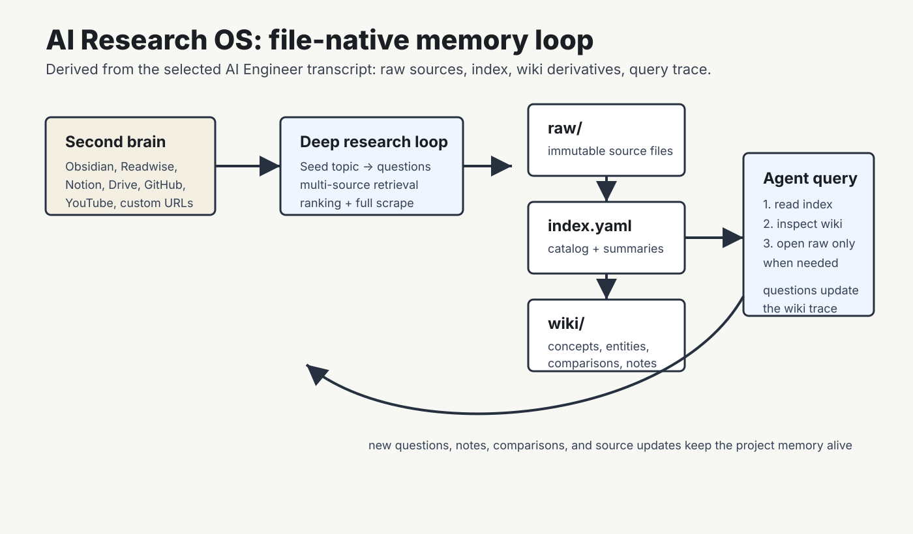
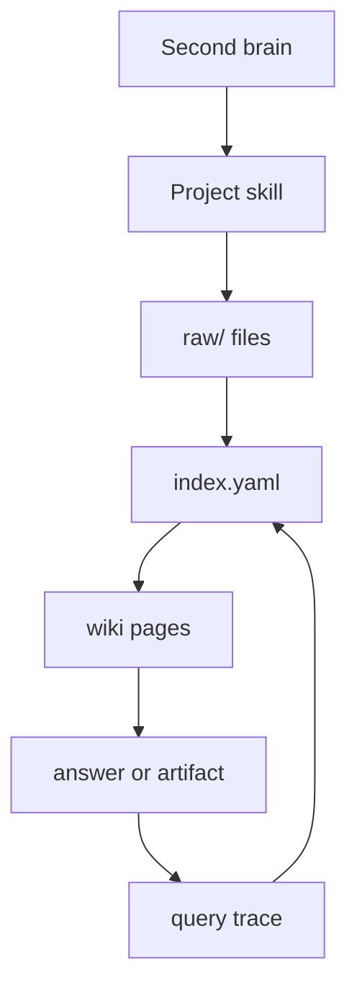
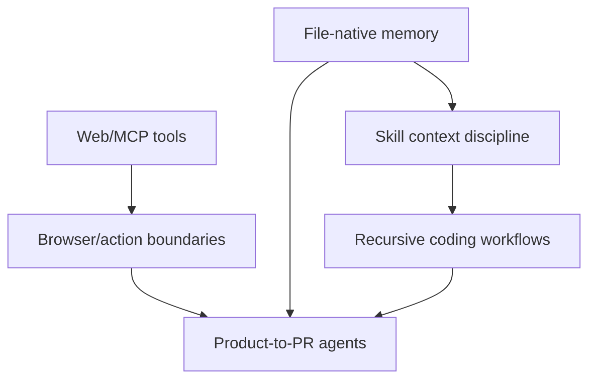

# Cover and Stats

Date window: 2026-06-10 through 2026-07-01.

Deep target: `youtube_video` - "Turn 10,994 Notes Into Memory - Paul Iusztin, Decoding AI & Louis-François Bouchard" [1](#source-1).

Skim cards: 6.

Source counts by class:

| Class | Count |
| --- | ---: |
| AI Engineer YouTube watch-page candidates | 46 |
| Eligible videos above 5K views | 13 |
| Selected video sources | 7 |
| Supporting technical docs | 3 |
| Repo diffs/checkouts | 0 |
| Degraded selected sources | 0 |

Research coverage: 46 screened candidates, 183 manifest artifact records, 7 selected-source artifact sets, 0 repo diffs/checkouts, 0 degraded selected sources.

Estimated reading time: 55 minutes.

Safety note: generated inside a Codex session; the legacy Anthropic-backed DeepBrief engine was not invoked.

$U = 0.55R + 0.25G + 0.20D$

# Today's Deep Dive

# Turn 10,994 Notes Into Memory - Paul Iusztin, Decoding AI & Louis-François Bouchard

## TL;DR

- The useful idea is not "put more notes into context"; it is a file-native memory compiler for agent projects.
- Raw personal sources remain immutable, while `index.yaml` and generated wiki pages become the agent-facing navigation layer.
- The retrieval ladder is deliberately cheap: read the index, then source summaries, then concept/entity/comparison derivatives, then raw files only when needed.
- The system is strongest for repeated research-to-work loops: courses, videos, repo architecture studies, books, and codebase investigations.
- The open risks are exactly the ones that matter for production memory: source provenance, stale derivatives, compaction, connector coverage, and builder-only UX.

## Mental model

Think of the system as a project-local memory filesystem. Your global second brain stays outside the blast radius. A project pulls in relevant sources, saves immutable raw artifacts, builds an index, then lets agents navigate generated wiki derivatives before opening raw files. The value is not a smarter vector lookup; it is a legible chain from source to summary to concept to answer [1](#source-1).

## Why this matters now

The transcript starts from a current agent problem: one session's context window often becomes the database, filesystem, memory, and reasoning space, then vanishes when the conversation ends [1](#source-1). That is painful for applied AI engineers because most useful work is cumulative: a new video, repo migration, course lesson, or feature spec depends on what you learned last week, not only on what you pasted today.

The presenters position AI Research OS between ephemeral agents and heavyweight RAG. They reject NotebookLM as the full answer because they want ownership, personalization, agent-native use, and coding-task leverage [1](#source-1). They also reject vector databases as the first personal-memory substrate because infra-heavy RAG is harder to inspect and edit by hand [1](#source-1). For a DeepBrief reader, that middle ground is the point: files are not a fallback; they are the audit surface.

This also matches the way Codex skills want to work. Codex skills load progressively, starting from name, description, and path, then reading the full `SKILL.md` only when selected [9](#source-9). A file-native research memory layer can use the same design instinct: keep the default context small, point to richer references, and force the agent to earn each expansion.

## Mechanism trace



The first version is conventional deep research. A topic and manually chosen "golden links" seed an orchestrator. The orchestrator generates questions, per-question agents search, summaries return to the orchestrator, noisy links are ranked, and only the top-K are fully scraped before a static `research.md` is compiled [1](#source-1).

The second version aims the same loop at the user's second brain. Instead of manually collecting golden links, the system treats previously saved notes and resources as already-filtered context. The source set can include Obsidian, Readwise, NotebookLM, GitHub, YouTube, Google Drive, Notion, and public web links [1](#source-1).

The third version is the actual architecture: raw files plus index plus wiki. Raw files are immutable source copies. `index.yaml` is a catalog of source paths, summaries, metadata, wiki derivatives, and raw references. The wiki layer contains LLM-generated source summaries, concepts, entities, comparisons, notes, repository analyses, and open questions [1](#source-1).

The query path is a ladder, not a dump. An agent reads `index.yaml`, inspects the source wiki page, follows derivative pages such as concepts or comparisons, and only opens the raw source when those layers are insufficient [1](#source-1). Usage also mutates the project wiki: questions can create new notes, comparisons, concepts, and query-log traces [1](#source-1).



## Evidence map

| Claim | Evidence |
| --- | --- |
| The bottleneck is future leverage of context, not context volume alone. | Source 1 transcript describes session context as database/filesystem/memory/reasoning space that is lost after the conversation [1](#source-1). |
| The architecture is file-native: raw files, index, and wiki derivatives. | Source 1 describes raw files, `index.yaml`, wiki derivatives, and no database as the core design [1](#source-1). |
| The lookup path is progressive: index -> wiki summaries -> derivatives -> raw. | Source 1 explains the query ladder and token-efficiency goal [1](#source-1). |
| The system preserves an immutable personal-note boundary. | Source 1 says the LLM should not touch manually written Obsidian notes; project wikis scope down from that snapshot [1](#source-1). |
| Codex skills align with progressive context loading. | OpenAI Codex skills docs describe progressive disclosure and `SKILL.md` loading only after selection [9](#source-9). |

## Walkthrough

Start with the personal source pile. In the talk, the motivating corpus is more than 5,000 Obsidian notes, more than 5,000 Readwise notes, and scattered Notion/Google Drive material that keeps growing [1](#source-1). The user does not want a chatbot to own that pile. The user wants to pull high-signal notes into a specific project: an article, a codebase, a feature, a video, a course, or a repo study.

Next, scope a project. The presenters explicitly say the wiki does not sit over the entire second brain. The global note store is an immutable snapshot; each project references it through a deep-research loop or targeted ingestion [1](#source-1). This is the critical safety boundary. Generated wiki pages can be wrong, stale, or duplicated, but they are derivatives; the raw notes remain intact.

Then build the three layers. `raw/` keeps source copies. `index.yaml` points to source records and derivatives. `wiki/` holds source pages, concepts, entities, comparisons, notes, and open questions [1](#source-1). The transcript's repository demo is the clearest AI-engineering use case: ingest repos, ask for architecture, agent architecture, subagents, memory system, and permission flow, then generate per-repo notes and cross-repo comparisons [1](#source-1).

Finally, query through the layers. The agent should not open every raw file by default. It reads `index.yaml`, checks source summaries, follows concept or comparison pages, and escalates to raw source only when needed [1](#source-1). That is exactly the sort of context discipline an applied engineer wants: inspectable, cheap first, with a path back to primary evidence.

## Implementation notes

The implementation lesson is to separate source facts from generated working memory: raw artifacts remain source facts, while wiki pages are generated derivatives that route the agent back to those facts [1](#source-1). A minimal project layout implied by the transcript is:

```text
project-memory/
  raw/          # immutable source copies
  wiki/         # generated source summaries, concepts, comparisons, notes
  index.yaml    # catalog, metadata, summaries, and paths
  questions.log # interaction trace / update queue
```

The practical design choice is to treat `index.yaml` as a routing table, not a knowledge base [1](#source-1). It should contain enough metadata and summaries to decide where to look next, while preserving local paths to raw sources and generated derivatives. For Codex-style workflows, this suggests a skill layout where the `SKILL.md` contains only the procedure and branch pointers, while long project-specific references live outside the main skill body [2](#source-2) [9](#source-9).

## Try it yourself

In 45 minutes, create a toy version for one active project. Put three raw sources in `raw/`: one transcript, one repo README, and one design note. Write an `index.yaml` with title, origin, date, summary, and paths. Create two wiki pages manually: one concept and one comparison. Then ask an agent a question and require it to answer by opening `index.yaml` first, a wiki page second, and raw files only for claims that need exact support. The exercise is not to build a product; it is to feel whether the lookup ladder reduces context thrash without hiding evidence.

## Open questions

The biggest missing verification is the public repository itself. The transcript says the repo contains Cloud Code/Codex skills and demos, but this DeepBrief did not inspect the repo source [1](#source-1). The exact `index.yaml` schema, regeneration strategy, and provenance model therefore remain open.

The second risk is derivative rot. Generated wiki pages can become stale, over-compressed, or wrong. The presenters list stronger linting, better memory compaction, and better source provenance as future work [1](#source-1). Until those are solved, this pattern is strongest as a builder workflow with audit discipline, not as an autonomous enterprise memory layer.

## Sources & citations

- [1](#source-1) Turn 10,994 Notes Into Memory - AI Engineer YouTube transcript and watch page.
- [2](#source-2) Building Great Agent Skills: The Missing Manual.
- [8](#source-8) Model Context Protocol introduction.
- [9](#source-9) OpenAI Codex Agent Skills documentation.
- [10](#source-10) OpenAI Apps SDK reference for tool/UI metadata context.

# Skim Cards

## Building Great Agent Skills: The Missing Manual

What changed: this talk turns "skills" from prompt snippets into inspectable runtime components. The checklist is trigger, structure, steering, and pruning: decide user- versus model-invoked skill triggers; separate steps from references; steer with compact leading words; and delete duplicated, stale, or no-op instructions [2](#source-2).

Why it matters: for Codex-style workflows, the most actionable part is the context-load tradeoff. Model-invoked skills are discoverable, but every description becomes another context pointer the agent may or may not follow; user-invoked skills shift load to the operator but reduce automatic-invocation uncertainty [2](#source-2). Read this if you maintain local skills. Skip only if you need measured eval results; this is a practitioner rubric, not a benchmark.

Item ID: `yt_UNzCG3lw6O0`. Source URL: https://www.youtube.com/watch?v=UNzCG3lw6O0

## Why MCP and ChatGPT Apps Use Double Iframes

What changed: the talk explains MCP/ChatGPT app UI isolation by walking through failed iframe designs. Direct `srcdoc` shares the host origin and CSP; relaxed CSP creates parent storage/cookie risk; sandboxing breaks origin-indexed storage; plain remote iframes do not scale across arbitrary app domains [3](#source-3).

Why it matters: the double iframe is not decorative complexity. It lets a trusted outer loader run on a dedicated domain, then initialize an inner app frame with per-app CSP and storage isolation [3](#source-3). OpenAI's Apps SDK reference exposes related resource metadata such as `_meta.ui.csp`, `_meta.ui.domain`, and widget CSP compatibility fields [10](#source-10). Read if you build MCP Apps or review embedded agent UI security.

Item ID: `yt_c-2eEv2ou7Y`. Source URL: https://www.youtube.com/watch?v=c-2eEv2ou7Y

## The Agent-Ready Web: Simplify User Actions with WebMCP

What changed: WebMCP proposes page-declared client-side tools for browser agents. Instead of forcing an agent to parse the DOM, inspect screenshots, infer click coordinates, and hope the page does not shift, a site can expose typed capabilities that the in-browser agent can call [4](#source-4).

Why it matters: this is the browser version of the same boundary pattern as MCP. The page tells the agent what actions exist. Declarative form attributes can generate schema for standard forms; imperative JavaScript tools can handle richer flows [4](#source-4). The caveat is maturity: the talk frames WebMCP as early preview, Chrome-gated, and still unresolved on permissions, consent, and cross-browser standardization [4](#source-4).

Item ID: `yt_ghJmWQCIHRM`. Source URL: https://www.youtube.com/watch?v=ghJmWQCIHRM

## Recursive Coding Agents

What changed: this talk maps recursive language model ideas onto coding agents. The useful rubric is concrete: executable environment, externalized prompt/context, code that calls the model, model-chosen decomposition into subcalls/subagents, and symbolic state retention [5](#source-5).

Why it matters: the idea is less "spawn more agents" and more "make decomposition, dependencies, and verification explicit." OpenProse is presented as declarative logical-English Markdown that can specify subagent work, required skills/tools, and parent-session verification [5](#source-5). Read for architecture vocabulary; treat benchmark and leaderboard claims as unverified from this transcript alone.

Item ID: `yt_3hXJI2q0Jz8`. Source URL: https://www.youtube.com/watch?v=3hXJI2q0Jz8

## Your Agent's Biggest Lie: "I Searched the Web"

What changed: the talk names a common failure mode: agents say they searched or fetched the web when they actually hit CAPTCHAs, bot blocks, empty pages, stale memory, or misleading bot-targeted content, then answer confidently anyway [6](#source-6).

Why it matters: the practical remedy is explicit tooling. Bright Data's MCP is presented as search, scrape-to-markdown, batch search, discovery APIs, and remote browser infrastructure with CAPTCHA handling and parallel sessions [6](#source-6). The strongest builder pattern is to make retrieval an auditable tool call and, for large scraping jobs, have the LLM write a parser that code executes instead of spending context on raw HTML [6](#source-6). Caveat: the demo was URL-loading, not full search [6](#source-6).

Item ID: `yt_btxGmN8RvNU`. Source URL: https://www.youtube.com/watch?v=btxGmN8RvNU

## Self Driving Products: Product Signals to Pull Requests

What changed: PostHog's talk reframes observability as an agent work queue. Product signals from analytics, session replay, errors, logs, experiments, and user reports are normalized, safety-filtered, grouped, researched, classified for actionability, and routed toward a sandboxed PR workflow [7](#source-7).

Why it matters: the best mechanism is cross-source grouping. Raw heterogeneous embeddings grouped by structure, so PostHog used LLM-generated search queries to cluster signals semantically across source types [7](#source-7). Actionable reports go to a sandbox that clones the repo, runs Claude Agent SDK, opens a PR, snapshots the sandbox, and reruns on CI or review comments [7](#source-7). Read as an alpha-stage product-agent design pattern, not as proven autonomous maintenance.

Item ID: `yt_zMiSRliEzv4`. Source URL: https://www.youtube.com/watch?v=zMiSRliEzv4

# Foundations & Connections

## Concepts

- File-native memory: keep raw source artifacts as files, then let agents navigate indexes and derivatives before opening primary evidence [1](#source-1).
- Progressive disclosure: make the default context small and defer full instructions or raw artifacts until the task actually needs them [9](#source-9).
- Agent UI isolation: embedded app surfaces need explicit origin, CSP, and storage boundaries, not only a nice component API [3](#source-3) [10](#source-10).
- Page-declared tools: browser agents become more reliable when pages expose typed actions rather than forcing screenshot/DOM inference [4](#source-4).
- Explicit web retrieval: live-web claims should come from auditable tool calls, not from model confidence [6](#source-6).
- Product signal loop: observability becomes more useful when signals can be clustered, researched, and routed into code changes with safety gates [7](#source-7).



The connection to prior foundations is clear: today's videos are less about larger models and more about explicit state. Memory systems externalize source state; skills externalize workflow state; MCP/WebMCP externalize tool and UI boundaries; product agents externalize the path from observation to patch.

# Concept Graph Delta

| New node | Prior concept | Delta |
| --- | --- | --- |
| `index.yaml` as routing table | Context compaction | Compaction should preserve paths back to raw evidence, not only summaries. |
| Double iframe | Sandbox/origin isolation | Agent app UI needs browser-security architecture, not just React components. |
| WebMCP page tools | Tool schemas | Websites can expose tool schemas directly to in-browser agents. |
| Query-generated signal clustering | Embedding retrieval | LLM-generated queries can normalize heterogeneous product signals before embedding. |
| Parent-verified recursion | Subagents | Recursive agent work needs parent-session verification to avoid amplified bad decompositions. |

# Pipeline Report

## Research Coverage

| Gate | Result |
| --- | --- |
| Scoped candidate universe | Passed by user override |
| Screened candidates | 46 |
| Eligible videos above 5K views | 13 |
| Manifest artifact records | 183 |
| Selected-source artifact sets | 7 of 7 |
| Discovery fanout reports | 3 |
| Selected-source read reports | 7 |
| Evidence matrix | Present |
| Legacy engine | Not invoked |

Candidate log: `sources/candidates.jsonl`.

Manifest: `sources/manifest.jsonl`.

Fanout report: `reviews/fanout-report.md`.

Evidence matrix: `verification/evidence-matrix.md`.

Read reports: `reviews/subagents/read-*.md`.

## Source log

- Verified: all selected videos have watch-page metadata, caption JSON3, plain transcript, and timestamped transcript.
- Substituted: no selected source was substituted.
- Degraded: no selected source is degraded.
- Skipped: videos below or equal to 5K views were excluded from selection even when relevant.
- Blocked: `yt_LrGCT7G_rU8` had no transcript and was not selected.

## Ranking rationale

| Rank | Item | Why |
| --- | --- | --- |
| 1 | `yt_ZRM_TfEZcIo` | Best architecture depth for agent memory, context management, and file-grounded workflow. |
| 2 | `yt_UNzCG3lw6O0` | Best direct skill-design rubric and Codex relevance. |
| 3 | `yt_c-2eEv2ou7Y` | Strongest browser-origin/CSP mechanism. |
| 4 | `yt_ghJmWQCIHRM` | Best page-declared tool surface for browser agents. |
| 5 | `yt_3hXJI2q0Jz8` | Strong coding-agent recursion vocabulary; claims need more verification. |
| 6 | `yt_btxGmN8RvNU` | Strong live-web failure mode and explicit-tooling pattern. |
| 7 | `yt_zMiSRliEzv4` | Strongest product-signal-to-code loop above 5K views. |

## Verification results

The draft was checked against local transcript evidence and source-specific read reports. Material claims in the PDF map to local evidence in `verification/evidence-matrix.md`. The PDF uses public citation links only; local paths are reserved for audit artifacts.

## Feedback applied today

Profile and preferences favored mechanism-first, primary-source-grounded, implementation-oriented sources. Thin model-release hype and broad strategy talks were downranked.

## Cost note

Codex-session generation; no Anthropic engine call from local scripts.

# Tomorrow's Queue

- Inspect the AI Research OS repository if a public URL can be resolved from the talk or speaker materials; today's deep dive is transcript-verified but not repo-verified.
- Follow up on production-agent replay talks that fell outside the `>5K views` selection, especially the Microsoft reproducibility talk.
- Pull primary docs/specs for WebMCP once public documentation stabilizes; today treats it as an experimental transcript-backed proposal.
- Compare PostHog's product-to-PR loop with any public code, blog post, or alpha docs if they become available.

# Errata

- Candidate count is 46, below the default DeepBrief 100-candidate gate, because the user explicitly approved the scoped AI Engineer channel universe even if below the default gate.
- One in-window candidate, `yt_LrGCT7G_rU8`, had no transcript and was not selected.
- The deep-dive source mentions a companion repository, but this run did not verify the repository source code.
- YouTube auto-captions contain occasional transcription artifacts; final prose avoids fragile exact wording.
- The visual asset is an original diagram derived from transcript evidence, not a source slide or paper figure.

# Citation Appendix

## Source 1: Turn 10,994 Notes Into Memory - Paul Iusztin, Decoding AI & Louis-François Bouchard {#source-1}

- URL: https://www.youtube.com/watch?v=ZRM_TfEZcIo
- Type: youtube_video

## Source 2: Building Great Agent Skills: The Missing Manual {#source-2}

- URL: https://www.youtube.com/watch?v=UNzCG3lw6O0
- Type: youtube_video

## Source 3: Why MCP and ChatGPT Apps Use Double Iframes - Frédéric Barthelet {#source-3}

- URL: https://www.youtube.com/watch?v=c-2eEv2ou7Y
- Type: youtube_video

## Source 4: The agent-ready web: Simplify user actions with WebMCP - Tara Agyemang {#source-4}

- URL: https://www.youtube.com/watch?v=ghJmWQCIHRM
- Type: youtube_video

## Source 5: Recursive Coding Agents - Raymond Weitekamp {#source-5}

- URL: https://www.youtube.com/watch?v=3hXJI2q0Jz8
- Type: youtube_video

## Source 6: Your Agent's Biggest Lie: I Searched the Web - Rafael Levi {#source-6}

- URL: https://www.youtube.com/watch?v=btxGmN8RvNU
- Type: youtube_video

## Source 7: Self Driving Products: Product Signals to Pull Requests - Joshua Snyder {#source-7}

- URL: https://www.youtube.com/watch?v=zMiSRliEzv4
- Type: youtube_video

## Source 8: What is the Model Context Protocol? {#source-8}

- URL: https://modelcontextprotocol.io/docs/getting-started/intro
- Type: technical_doc

## Source 9: Agent Skills - Codex {#source-9}

- URL: https://developers.openai.com/codex/skills/
- Type: technical_doc

## Source 10: Apps SDK Reference {#source-10}

- URL: https://developers.openai.com/apps-sdk/reference/
- Type: technical_doc
