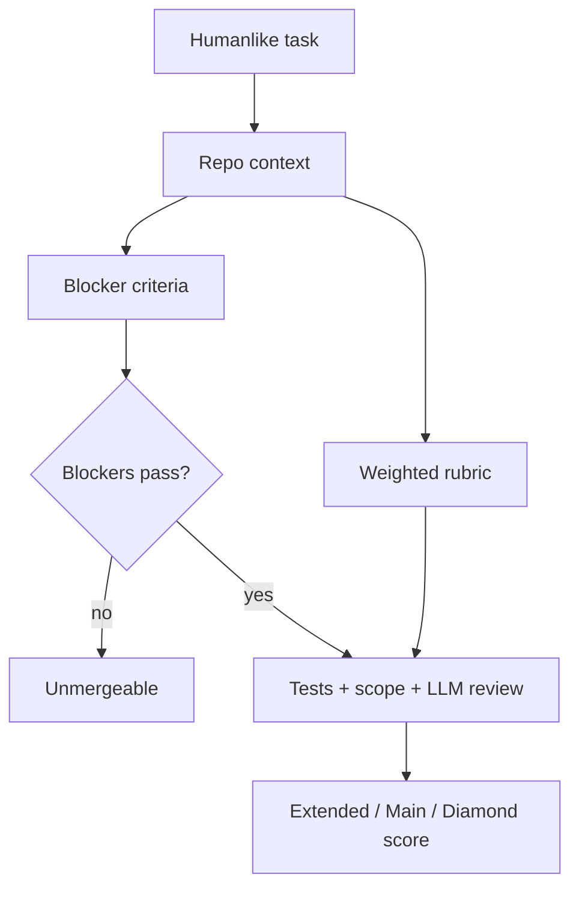
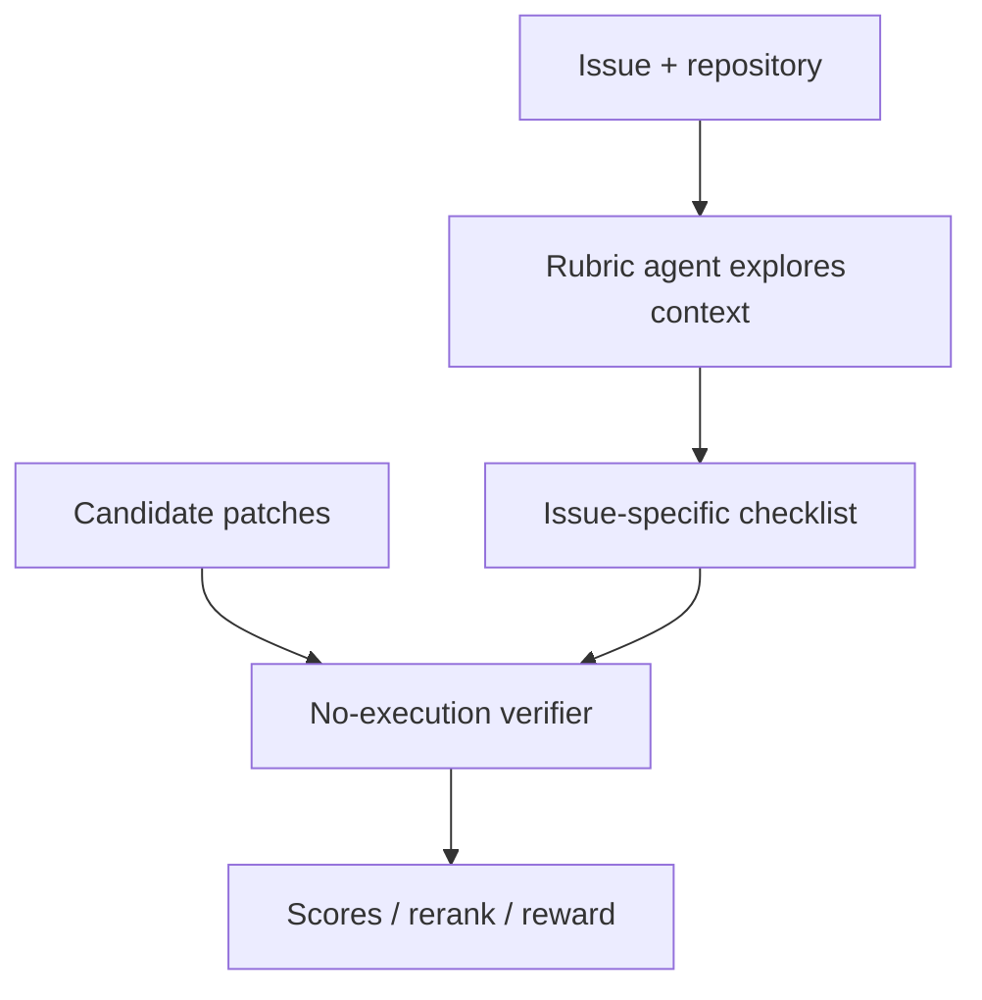
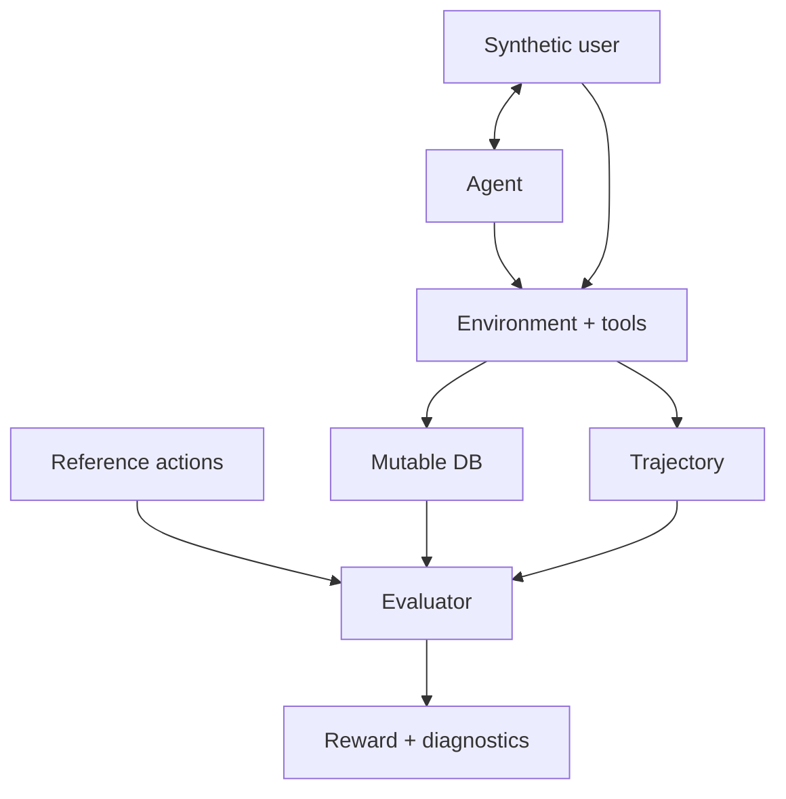
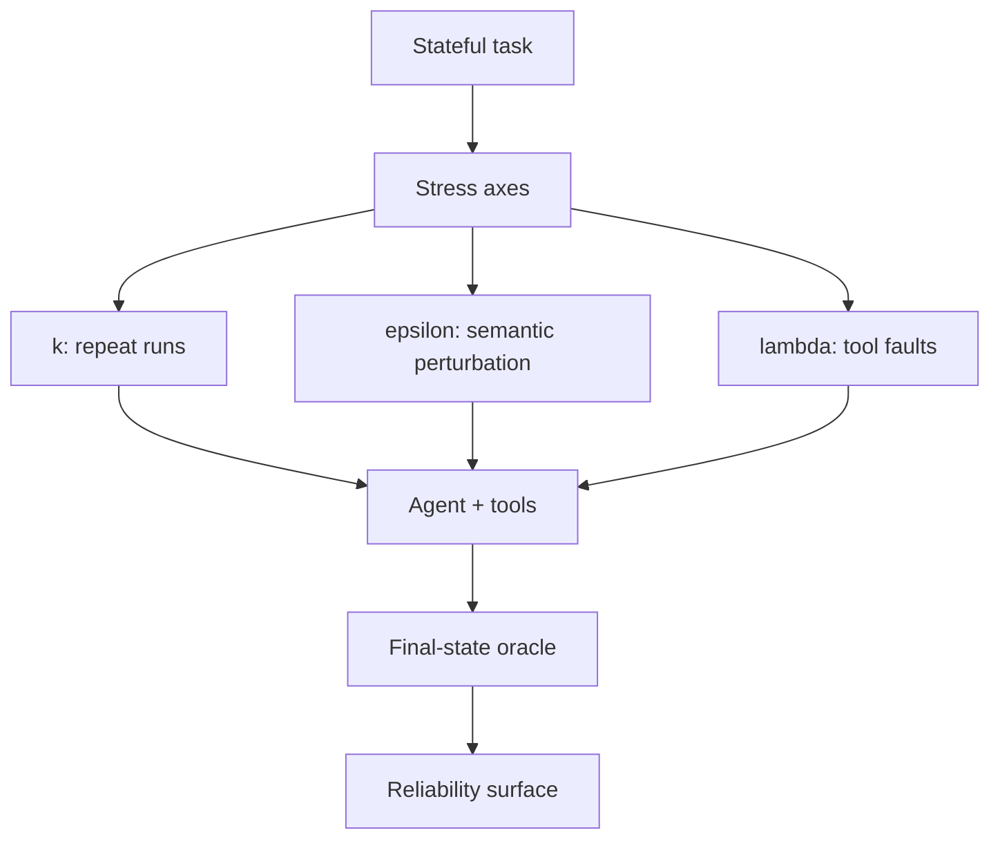
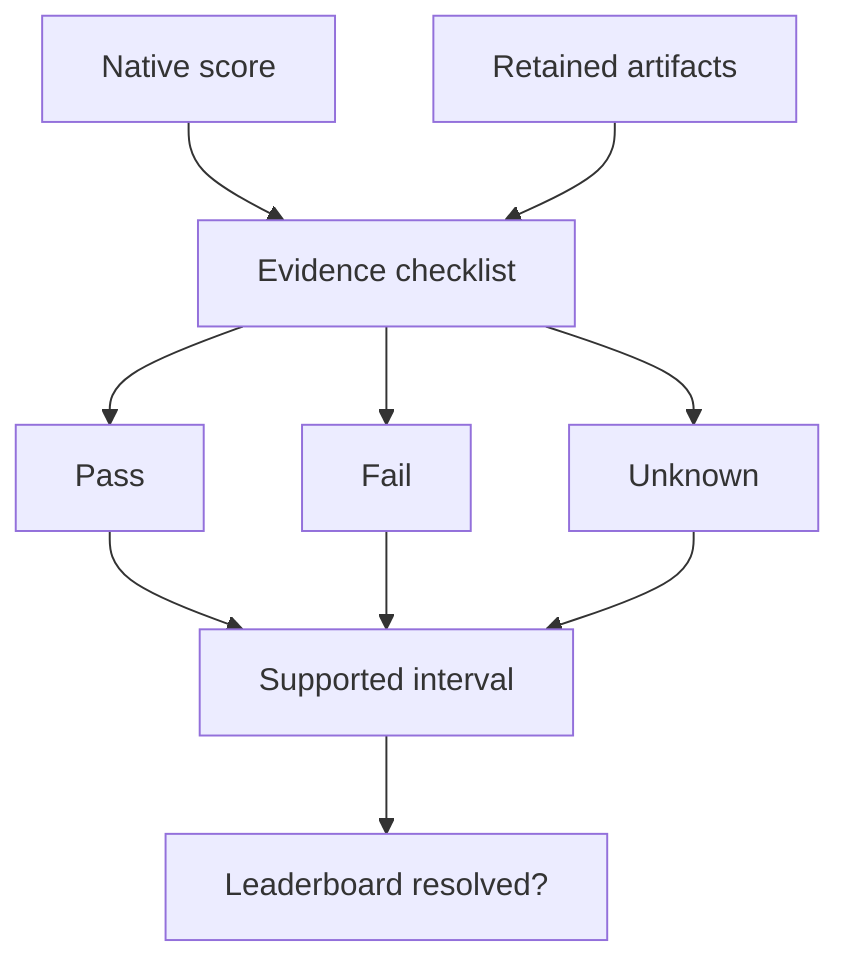
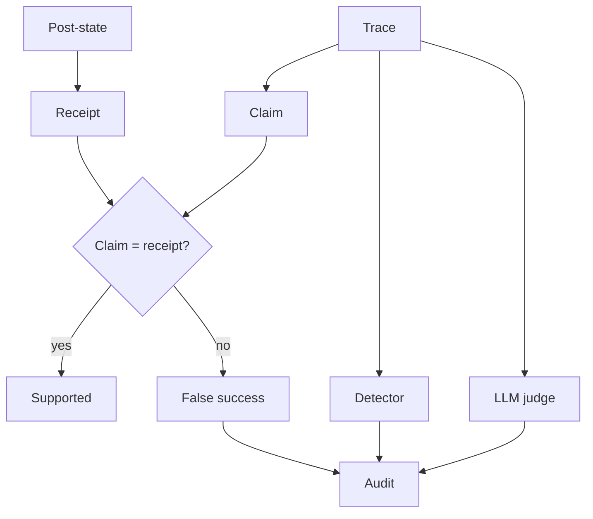
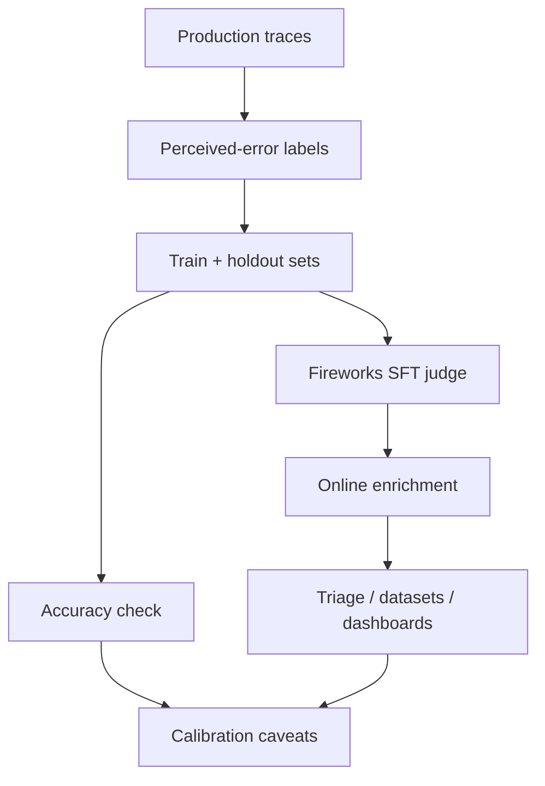
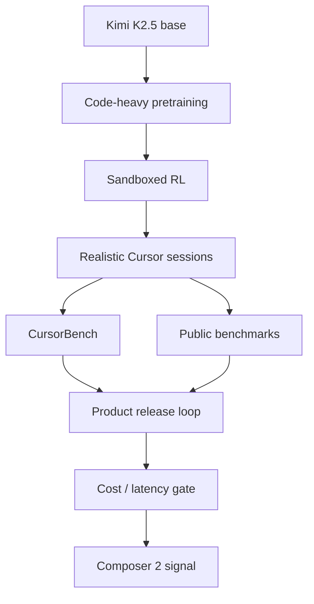
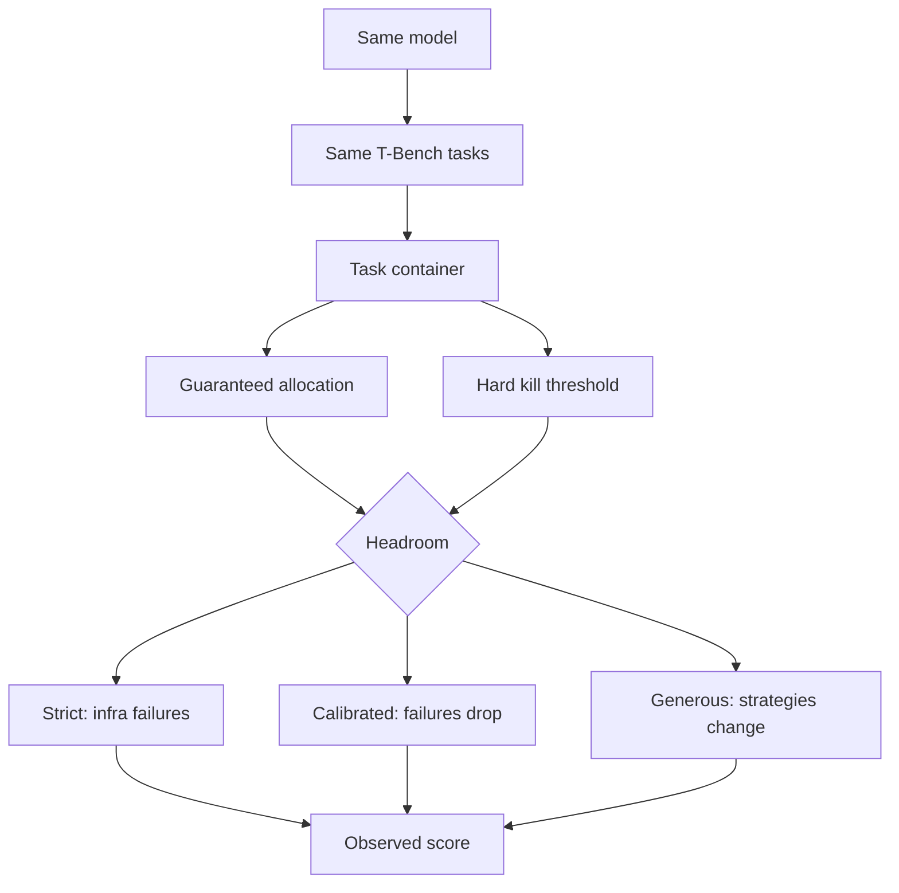
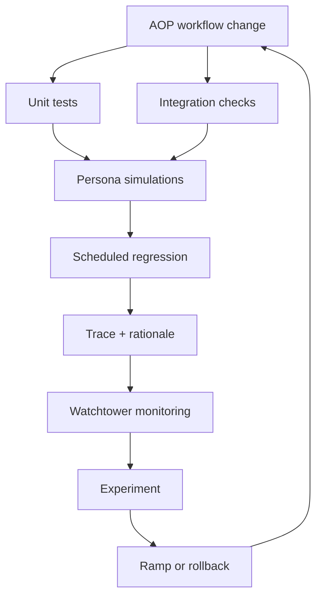

# Executive Synthesis

Agent evaluation has moved from model scoring to evidence-bearing system testing. The useful question is no longer "which model got the highest pass rate on a static set?" It is: under a specified runtime, tool policy, environment state, verifier, and trace-retention contract, can the run support the outcome claim it makes? That is the through-line across the strongest sources in this packet: evidence-supported benchmark bounds, false-success detection, tau2-style stateful environments, infrastructure-noise measurement, mergeability-focused coding evals, and production observability stacks. [3](#source-3) [5](#source-5) [6](#source-6) [9](#source-9)

The practical consequence is sharp. Old static evals are insufficient because agents are not just answering; they are acting. They mutate databases, run tools, browse websites, patch repositories, call APIs, escalate tickets, and tell users that work is complete. A final answer, a transcript-level judge, or a scalar benchmark score cannot by itself prove the side effect happened. The credible unit is now an eval contract: task, environment, allowed actions, runtime envelope, retained trace, outcome oracle, judge configuration where needed, and an Unknown path when evidence is missing. [5](#source-5) [36](#source-36) [38](#source-38)

**Shift 1: from pass rate to supported claim.** The evidence-supported bounds paper is the cleanest mental model. It leaves native benchmarks intact, then asks whether retained artifacts can support each pass/fail claim, labeling records Evidence Pass, Evidence Fail, or Unknown and reporting supported score intervals. That changes leaderboard hygiene: if intervals overlap, strict ordering is unresolved, not merely inconvenient. The paper's AndroidWorld example is the teaching case: a native 61.0% score becomes a wide evidence-supported interval because many records lack decisive retained evidence. [5](#source-5)

False success is the operational version of the same problem. The agent says "done"; independently checked environment state says otherwise. The reported rates are high enough to matter: 45-48% of failures in single-control tau2-bench domains, 75.8% in AppWorld self-assessing trajectories with explicit status claims, and generic LLM judges that stay weak because they read the same surface proxies as the failing agent. The fix is not a better closing sentence. It is a typed completion claim tied to a state receipt. [6](#source-6)

**Shift 2: from model eval to runtime eval.** Agent benchmarks measure scaffolds and infrastructure as much as model cognition. Anthropic's Terminal-Bench study shows a six-percentage-point score spread across resource configurations and recommends reporting guaranteed allocation, hard kill thresholds, and calibration before reading small score gaps as capability differences. ReliabilityBench generalizes the point for support agents by measuring reliability over repeated execution, semantic perturbation, and tool-fault intensity. Runtime, retries, tool errors, perturbations, and resource ceilings are not background conditions; they are part of the measured system. [4](#source-4) [9](#source-9)

For a senior applied-AI team, this means eval reports should look more like experiment specs than score screenshots. The minimum useful record includes task hash, environment image, tool versions, user simulator, resource envelope, timeout, retry policy, cost, latency, trace, final state, verifier output, and failure taxonomy. Inspect AI and Phoenix matter here because they are not fixed leaderboards; they are infrastructure for keeping tasks, scorers, logs, datasets, traces, experiments, and post-hoc scoring attached to the result. [36](#source-36) [38](#source-38)

**Shift 3: from answer grading to environment contracts.** The benchmark landscape is becoming a portfolio of executable environments. SWE-bench applies patches to real repositories and runs Dockerized tests. Terminal-Bench isolates verifiers and adds oracle/nop gates, review, trial analysis, and cheat trials. WebArena, BrowserGym, and WebArena-Verified move web agents toward browser harnesses, structured outputs, and replayable network evidence. OSWorld tests GUI agents in VMs with screenshots, accessibility observations, and final-state evaluators. ToolSandbox and tau2-bench make persistent state, user turns, tools, milestones, communications, and minefields central. [31](#source-31) [32](#source-32) [33](#source-33) [35](#source-35) [39](#source-39) [40](#source-40)

The negative finding is as important as the positive one: there is no credible all-purpose agent score in this packet. Realism and operational burden move together. The high-fidelity systems are harder to reproduce; the controlled simulators are easier to diagnose but narrower. An applied team needs a benchmark mix aligned to its action surface: code, browser, desktop, support workflow, internal tools, document/RAG, and production traces. [3](#source-3) [34](#source-34) [39](#source-39) [40](#source-40)

**Shift 4: from generic judges to bounded verifiers.** The field is not abandoning judges; it is narrowing them. LangChain and Fireworks show a production pattern for distilling one trace-level signal, perceived error, into a cheaper specialized judge. Scale's Agentic Rubrics proposes repository-grounded rubric generation for SWE-agent patches, but the public artifact should be read as a verifier/reranker candidate, not a substitute for runtime validation. AgentAsJudge is useful as a reviewer-critic-ranker pattern, but its public profile lacks enough calibration and fixed-label scaffolding to carry benchmark-style truth claims. [2](#source-2) [7](#source-7) [37](#source-37)

Coding-agent evals show the same verifier shift. FrontierCode is valuable because it measures maintainer-grade mergeability: correctness, tests, scope, style, repository standards, and blockers that can zero a solution even when narrow behavior looks acceptable. Cursor's Composer 2 and CursorBench story points toward product-realistic coding sessions and serving economics, while leaving key benchmark details private. The direction is clear: tests remain necessary, but "would a maintainer merge this patch?" is a different and more production-relevant question. [1](#source-1) [8](#source-8)

**Shift 5: from benchmarks to control planes.** The startup and infrastructure evidence says production eval is becoming a closed loop: offline golden tasks, simulation, human review, deployment gates, online trace scoring, monitoring, alerts, controlled rollout, rollback, and incident-to-eval feedback. Braintrust and LangSmith provide the cleanest public pattern for traces, datasets, LLM/code/human scoring, online evals, alerts, and release protection. Decagon, Intercom/Fin, Sierra, and Relevance AI show customer-agent control-plane surfaces: simulations, QA, monitors, experiments, approval gates, observability, and alerts. [17](#source-17) [18](#source-18) [23](#source-23) [28](#source-28) [73](#source-73) [74](#source-74)

The evidence boundary must stay explicit. Public startup pages can prove product architecture and market direction; they rarely prove calibrated reliability, false-positive rates, incident history, raw eval sets, or independent validation. Enterprise trust badges, customer logos, and adoption claims are procurement signals, not eval proof. The right reading is not cynicism. It is disciplined separation: verified mechanism, plausible inference, and public silence. [10](#source-10) [13](#source-13) [14](#source-14) [16](#source-16)

The build takeaway for this reader is practical: design the eval stack around receipts. Every agent workflow should say what claim it is allowed to make, what state proves or disproves that claim, what trace and verifier artifacts are retained, which safety/policy gates run separately from task success, what resource envelope was used, and how production failures become new tests. That is the current frontier of agent evaluation: not better vibes around model rankings, but stronger evidence around acted outcomes. [5](#source-5) [6](#source-6) [40](#source-40)

# Monthly Themes

Agent evaluation now means an evidence-preserving operating loop around an acting system. A credible eval specifies environment, action space, tools, runtime, traces, oracles, policy gates, cost/latency, and feedback. Static prompt sets and generic judge prompts miss the real failures: missing side effects, brittle tool interactions, unsafe actions, unsupported completion claims, and production drift. [5](#source-5) [6](#source-6) [36](#source-36) [38](#source-38)

## 1. Evidence Is Part Of The Score

Evidence-supported bounds are the cleanest current benchmark discipline. Each record becomes Evidence Pass, Evidence Fail, or Unknown depending on whether retained artifacts support the benchmark's claim. Unknown is not administrative noise; it is a measurement result. Applied teams should define the claim, define the receipt, retain the artifact, and report uncertainty when the receipt is absent. [5](#source-5)

## 2. Claim-State Mismatch Is The Failure Mode

False success names the production pattern to design against: the agent says the job is complete while independently checked state says otherwise. The fix is not a better closing sentence. Refunds need refund state, bookings need reservation state, coding work needs patch, tests, blockers, and repository state, and document agents need source spans, citations, boxes, and extraction confidence. tau2-bench operationalizes the principle with synthetic users, tools, mutable state, policies, and DB-oriented outcome scoring. [6](#source-6) [3](#source-3) [22](#source-22) [26](#source-26)

## 3. Runtime Is Score-Bearing

Agent evals are systems tests. Anthropic's infrastructure-noise study shows that resource configuration can move Terminal-Bench scores, and ReliabilityBench shows that repeated execution, semantic perturbation, and tool faults change reliability conclusions. Reports should disclose timeouts, retries, tool-fault policy, resource envelope, cost, latency, infra error rate, evaluator version, and trial count before treating small deltas as capability differences. [9](#source-9) [4](#source-4)

## 4. Environment Contracts Are Replacing Answer Sets

The benchmark landscape is a portfolio of executable environments. SWE-bench tests issue-to-patch work. Terminal-Bench hardens terminal tasks with isolated verifiers, oracle/nop gates, review, trial analysis, and cheat trials. OSWorld uses VM-backed desktop tasks. WebArena, BrowserGym, and WebArena-Verified cover browser tasks and replayable evidence. ToolSandbox and tau2-bench make persistent state, user interaction, milestones, minefields, and support workflows central. No source supports one universal agent score; match evals to the product's real action surface. [31](#source-31) [32](#source-32) [33](#source-33) [35](#source-35) [39](#source-39) [40](#source-40)

## 5. Coding-Agent Evals Are Moving Toward Mergeability

Coding-agent evaluation is no longer just pass tests. FrontierCode's useful contribution is maintainer-grade mergeability: correctness, test quality, scope discipline, style, repository standards, and blockers that can zero a solution. Scale's Agentic Rubrics adds contextual verification for candidate patches, while Composer 2 and CursorBench indicate product-realistic coding sessions but keep key artifacts private. The practical gate is execution tests plus reviewer blockers plus context-grounded rubric criteria under a declared runtime and cost envelope. [1](#source-1) [2](#source-2) [8](#source-8) [32](#source-32)

## 6. Judges Are Becoming Narrower

Generic judges are weak final arbiters for stateful tasks, but bounded judges can help when their signal and calibration are explicit. LangChain and Fireworks show the pattern by distilling one trace-level signal, perceived error, into a cheaper production judge. AgentAsJudge is useful as a reviewer/critic/ranker decomposition, but public evidence supports it as a prototype pattern, not benchmark truth. The stronger architecture keeps judge inputs, outputs, prompts, labels, evaluator versions, traces, and state receipts attached to runs. [7](#source-7) [37](#source-37) [17](#source-17) [18](#source-18) [38](#source-38)

## 7. Production Eval Is Becoming A Control Plane

The tooling evidence points to one loop: golden tasks, simulation, safety gates, QA, cost/runtime checks, monitored traces, alerts, rollout control, and incident feedback that becomes new tests. Braintrust, LangSmith, Phoenix, Inspect AI, and Foundry provide the infrastructure pattern. Decagon, Intercom/Fin, Sierra, Relevance AI, Cursor, Cognition, Glean, Harvey, Writer, Abridge, Hippocratic AI, Contextual AI, Reducto, Perplexity, Hebbia, Lindy, Ema, and Dust show varying degrees of public mechanism evidence, but public pages rarely prove calibrated reliability or incident history. Treat mechanisms as verified, maturity as inferred, and silence as unknown. [17](#source-17) [18](#source-18) [36](#source-36) [38](#source-38) [10](#source-10) [14](#source-14) [23](#source-23) [28](#source-28)

# Deep Dives

The deep dives are grouped by mechanism rather than by source lane. Read them as an eval-stack progression: first benchmark truth and coding-agent quality, then stateful support environments and evidence bounds, then judge design, infrastructure, and production QA. Each dive uses the same schema so the mechanism, evidence, caveats, and a 30-60 minute exercise are easy to compare.

## Benchmark Reality: Introducing FrontierCode

### TL;DR

FrontierCode moves coding-agent evaluation from "does the patch pass tests?" to "would a maintainer merge this PR?" Cognition defines the target as production code quality across correctness, test quality, scope discipline, style, and repository-specific standards [1](#source-1). The key design is veto power: blocker failures can zero a solution even when secondary rubric items look good [1](#source-1).

Treat the leaderboard as company-reported, not independently audited. Cognition reports Claude Opus 4.8 at 13.4% on FrontierCode Diamond, GPT-5.5 at 6.3%, and GPT-5.5 using up to 4x fewer tokens than Opus 4.8 [1](#source-1). The durable contribution is the eval shape: hidden maintainer-authored tasks, merge-blocking criteria, mixed verifiers, adversarial QC, and an explicit category for code that works locally but is still unmergeable [1](#source-1).

### Mental model

Think of FrontierCode as a code-review simulator. The agent has to produce a patch that survives maintainer judgment, not just a patch that satisfies visible tests [1](#source-1). Review contains non-negotiable constraints: forbidden files, missing tests, brittle abstractions, oversized changes, and local style violations can each block a PR.

Context is part of the task. Prompts are concise and humanlike, with codebase guidance similar to contributor instructions, so the agent must infer repository norms rather than solve a fully specified puzzle [1](#source-1). That puts FrontierCode near repository-grounded verifier work such as Scale's Agentic Rubrics [2](#source-2).

### Why this matters now

Coding-agent evals are hitting the limit of "tests passed" as a deployment signal. Production maintainers also care about review debt and future compatibility. Cognition's logging example shows behaviorally equivalent output failing because it mixes a repository logging macro with `std::cerr`, creating a latent assumption about future logging behavior [1](#source-1).

Small score gaps also need run-context caveats. Anthropic reports that infrastructure noise can move agentic coding eval scores through resource headroom and harness errors [9](#source-9). FrontierCode addresses a different axis: richer review criteria.

### Mechanism trace

FrontierCode has three nested subsets: Extended has 150 tasks, Main has the 100 hardest tasks including Diamond, and Diamond has the 50 hardest tasks [1](#source-1). Tasks come from maintainers of 36 flagship open-source repositories; Cognition says 20+ maintainers spent roughly 40 hours per task across design, rubric creation, and review [1](#source-1).

The verifier stack is mixed. Behavioral correctness uses classical tests; test quality can use reverse-classical checks where agent-written tests fail on the original broken code; open-ended behavior can use adaptive classical grading; scope uses file boundaries, diff constraints, and locality; quality can use prompt-based LLM review [1](#source-1). Models run five times per reasoning effort, with the best-performing effort reported [1](#source-1).

### Evidence map

| Claim | Evidence | Caveat |
| --- | --- | --- |
| Mergeability is the target. | FrontierCode scores correctness, tests, scope, style, and standards [1](#source-1). | Public evidence is Cognition's post. |
| Blockers override partial success. | Missing a blocker zeros the solution [1](#source-1). | Full rubrics are not public. |
| The benchmark is hard and private. | Extended/Main/Diamond are 150/100/50 nested tasks [1](#source-1). | Hidden tasks limit audit. |
| Contextual verification is a broader pattern. | Scale describes repository-grounded rubrics for SWE agents [2](#source-2). | Public detail is thin. |
| Runtime policy can affect scores. | Anthropic documents infrastructure noise [9](#source-9). | Not a replication. |

### Walkthrough

The `LOG_WARNING()` case shows the difference between passing behavior and mergeability. Cognition describes an expected solution where every line of a multi-line warning stays chained through the repository logging macro [1](#source-1). A model combines `LOG_WARNING()` with `std::cerr`. The output may look equivalent today, but it bypasses the abstraction if the macro later adds metadata, routing, buffering, structured logs, or severity handling [1](#source-1).

### Implementation notes

Teams can copy the shape without copying the private benchmark. Define repository-specific blockers: required tests, forbidden files, migration rules, API compatibility, security boundaries, performance constraints, and style conventions. Keep those separate from weighted readability or idiom preferences [1](#source-1).

Use the right verifier for each criterion: tests for crisp behavior, reverse-classical checks for agent-written tests, scope checks for review hygiene, and LLM judges only for semantic review [1](#source-1). Record runtime settings, retries, sandbox failures, verifier versions, and reviewer metadata [9](#source-9).

### Try it yourself

Rewrite one recently merged PR as a contributor-style task. Build a rubric with three blockers and five non-blockers, including one blocker tests might miss. Compare two agents by test pass rate and rubric mergeability; the useful artifact is the disagreement set.

### Open questions

The main open issues are auditability and grader stability. Cognition does not currently plan to release tasks publicly, while opening evaluation access to model creators [1](#source-1). That protects contamination control but prevents outsiders from inspecting task distribution, rubric wording, grader prompts, traces, and inter-reviewer agreement. LLM-assisted quality review also creates drift risk if the judge model, prompt, threshold, or calibration set changes.

### Sources & citations

- [1](#source-1) is the primary FrontierCode source for private task curation, frontier model scoring, and the benchmark's product-facing claims.
- [2](#source-2) provides a complementary rubric-verifier pattern for coding agents, especially where final-answer grading is too shallow.
- [9](#source-9) grounds the caution that infrastructure variance can distort agentic coding measurements if the harness is not controlled.

## Contextual Verification: Agentic Rubrics as Contextual Verifiers for SWE Agents

### TL;DR

Agentic Rubrics is a contextual, no-execution verifier for software-engineering agents. Scale describes an expert agent that interacts with the repository, turns that context into a repository-grounded checklist, and scores candidate patches against it without running tests [2](#source-2).

The caveat is central. The public page reports the mechanism and headline SWE-Bench Verified results, but not full prompts, confidence intervals, baseline identities, cost/latency, or enough protocol detail for independent reproduction [2](#source-2). Treat the design pattern as stronger than the numbers.

### Mental model

Think of rubrics as contextual receipts. A normal patch classifier compresses a diff into a score. Agentic Rubrics inserts a checklist derived from issue text and repository exploration [2](#source-2). A reviewer can inspect whether it captures the right invariants before trusting the patch score.

Four pieces carry the method: repository context, issue-specific criteria, no-execution scoring, and later comparison against CI, human review, and post-merge outcomes.

### Why this matters now

Coding-agent evaluation is shifting from visible-test success toward maintainer-grade judgment. FrontierCode scores correctness, test quality, scope, style, and repository standards, with blockers that can outweigh secondary wins [1](#source-1). Agentic Rubrics works on the verifier side: generate criteria from the codebase, then judge candidate patches against them [2](#source-2).

This matters because agent workflows now produce multiple plausible patches. Running a full environment for every candidate can be expensive or unreliable, while a generic LLM judge is too weak as a final authority. A contextual verifier can act as a reranker before CI, a reviewer aid after CI, and a denser reward signal for training.

### Mechanism trace

Scale's source-specific mechanism is: gather repository context, write a checklist, and score candidate patches against that checklist without test execution [2](#source-2). The key move is LLM as context collector, rubric author, and patch scorer, not LLM as an opaque global judge.

Scale reports using the verifier in parallel test-time scaling on SWE-Bench Verified: 54.2% for Qwen3-Coder-30B-A3B, 40.6% for Qwen3-32B, and at least a 3.5-point gain over the strongest baseline [2](#source-2). SWE-Bench is the relevant public benchmark family for GitHub issue-to-patch tasks [32](#source-32), but the page does not expose selection protocol or uncertainty.

### Evidence map

| Claim | Evidence | Caveat |
| --- | --- | --- |
| The method creates a contextual checklist before scoring patches. | Scale describes repository interaction, rubric generation, and no-execution scoring [2](#source-2). | No public prompt, budget, or schema. |
| Reported SWE-Bench Verified gains are material. | Scale reports 54.2%, 40.6%, and at least +3.5 points [2](#source-2). | No confidence intervals or baseline identities. |
| Rubrics are complements to tests. | Scale says they can flag issues tests miss while staying consistent with tests [2](#source-2). | No public confusion matrix. |
| The method aligns with mergeability-focused evaluation. | FrontierCode emphasizes blockers, scope, style, and standards [1](#source-1). | Supporting analogy only. |

### Walkthrough

Take a SWE-Bench-style issue. The traditional path is to generate a patch, set up the environment, run tests, and map pass/fail back to the candidate. Agentic Rubrics adds a pre-execution path: read the issue and repository, identify what a correct fix must preserve, and write criteria around API behavior, backward compatibility, edge cases, test expectations, and integration boundaries [2](#source-2).

Each candidate patch is scored item by item. That helps when several patches look plausible but only one respects local constraints. It is also inspectable: a reviewer can reject the checklist before trusting the score. The public page does not show exact rubrics, judge prompts, calibration data, or cost, and it cannot prove runtime correctness because it does not execute code [2](#source-2).

### Implementation notes

Deploy this as ranking and review support, not as an autonomous merge gate. Log the issue, repository snapshot, inspected files, checklist, candidate patches, per-item scores, selected patch, CI outcome, human override, and post-merge revert signal. Without those receipts, the rubric is just another model judgment.

Use hard boundaries. Patches touching migrations, concurrency, security, dependencies, or performance-sensitive code should route to execution and human review even when the rubric score is high. If relevant context is missing or criteria are vague, mark the result incomplete or regenerate the checklist.

### Try it yourself

Pick one closed issue with a merged fix and one rejected alternative. Without running tests, write a repository-grounded rubric, score both patches item by item, and compare the ranking with the actual outcome and CI result. Across 20 issues, track agreement with tests, maintainers, extra issue discovery, reviewer time, and false positives.

### Open questions

The largest missing details are prompts, context budget, rubric length, scoring aggregation, judge model, baseline identities, confidence intervals, and cost/latency. The page also leaves open how often the rubric is wrong because the context agent missed a file, misunderstood runtime behavior, or encoded an overly narrow issue reading [2](#source-2).

There is also reward-hacking risk. If patch generators learn the verifier's style, they may optimize for checklist-satisfying surface features instead of behavior. That risk requires continuous calibration against tests, human review, and production outcomes.

### Sources & citations

- [2](#source-2) is the primary source for agentic rubrics, contextual verification, and the reported improvements over static grading.
- [1](#source-1) shows why frontier coding benchmarks increasingly need task-private, evidence-aware scoring.
- [32](#source-32) anchors the SWE-bench lineage that makes repository-grounded grading useful but incomplete.

## Stateful Support Simulation: sierra-research/tau2-bench

### TL;DR

- tau2-bench is a stateful support-agent harness: simulated user, agent, domain tools, mutable databases, trajectories, and final-state reward [3](#source-3).
- The key move is grading the receipt. Success depends on the resulting environment state and required customer communication, not a plausible transcript [3](#source-3).
- `reward_basis` determines whether ACTION matching counts. Reference actions often build the gold state; exact path matching is not always the reward [3](#source-3).
- ReliabilityBench complements this by testing repeatability, semantic perturbations, and tool faults instead of one clean pass rate [4](#source-4).

### Mental model

Read tau2-bench as a customer-support simulator with an audit trail. The agent chats and calls tools; the synthetic user reveals scenario facts over turns; the environment owns tools, policy, and mutable state; the evaluator checks what state the run produced [3](#source-3). This is not static support QA. A transcript can sound resolved while the reservation, return, ticket, or account remains wrong. Sierra pages are context, not validation [14](#source-14) [75](#source-75).

### Why this matters now

Support agents are where evaluation becomes concrete because they change customer-visible systems. A travel agent can promise a cancellation without updating the booking. A retail agent can approve the wrong return. A telecom agent can comply with an ineligible request after user pressure. tau2-bench makes those failures visible through state replay and final database comparison. The transferable lesson is the reward contract: pin the starting state, tools, policy, simulator, termination rules, evaluator, and artifacts [3](#source-3).

### Mechanism trace

Each domain supplies policy, tools, tasks, database snapshots, and sometimes user-side tools. The loop records messages, tool calls, outputs, and termination. The evaluator replays the agent run into a predicted environment, replays reference actions into a gold environment, and scores configured components. DB and COMMUNICATE usually carry outcome reward; ACTION is hard-gating only when `reward_basis` includes it [3](#source-3).

### Evidence map

| Claim | What the inspected artifact supports | Citation |
|---|---|---|
| tau2-bench is stateful. | Domains package policy, tools, tasks, databases, user simulation, trajectories, and evaluation. | [3](#source-3) |
| Final state is load-bearing. | Agent and reference runs are compared through predicted and gold environment states. | [3](#source-3) |
| `reward_basis` changes interpretation. | ACTION matters only when included; otherwise reference actions mainly construct the oracle. | [3](#source-3) |
| Communication is necessary but incomplete. | Required facts can be scored, while tone and explanation quality need extra review. | [3](#source-3) |
| Simulator realism is a limitation. | User prompts, voice, retrieval, latency, and provider choices can shift difficulty. | [3](#source-3) |
| ReliabilityBench adds stress coverage. | It tests repeatability, perturbation robustness, and tool-fault tolerance. | [4](#source-4) |

### Walkthrough

A task starts with a customer scenario and initial database. The user simulator releases information across turns. The agent inspects or mutates state through tools, then communicates the result. The evaluator does not ask whether the conversation resembles a reference transcript; it asks whether the environment ended in the expected state and whether required facts were communicated [3](#source-3).

This protects valid alternative strategies. An agent may authenticate before reading an order, or read first and authenticate before writing, depending on policy. If the final state and required communication match, exact order should not become a product requirement unless sequence itself is regulated. Action traces remain useful for debugging excess reads, missing authentication, hallucinated calls, wasteful retries, and cost [3](#source-3).

The strictness can compress near misses. Multiplicative components can fail an otherwise correct database update if a required disclosure is missing, or fail a polished conversation if the database diff is wrong. Applied teams should keep component diagnostics, tool errors, termination reasons, latency, cost, and pass-hat-k instead of reporting only average reward [3](#source-3).

### Implementation notes

The production pattern is the contract, not the exact public domains. For any workflow with side effects, define the starting state, allowed tools, forbidden actions, policy, expected final state, required communication, retry budget, and evaluator version. Store transcript, tool calls, outputs, state diff, scorer input, scorer output, termination reason, cost, and any human override [3](#source-3).

Do not overfit to reference paths. Most support work needs outcome correctness plus required communication; traces are diagnostic unless action order is genuinely mandatory. The next layer is ReliabilityBench-style stress: repeated runs, paraphrases, distractors, corrections, latency, injected tool faults, and labels separating agent failure from environment failure [4](#source-4).

### Try it yourself

Take one support workflow and write a tau2-style eval. Specify the database, user goal, hidden facts, tools, policy constraints, gold final state, required communication, and `reward_basis`. Then list the audit artifacts needed to trust the pass/fail result [3](#source-3).

### Open questions

- How stable are scores across simulator model versions, prompts, and personas?
- Which communication failures should gate reward instead of remaining diagnostic?
- What blend of DB-state reward, customer-experience QA, and policy-safety review is enough?

### Sources & citations

- [3](#source-3) is the primary source for tau2-bench domains, simulation, environment replay, reward components, and diagnostics.
- [4](#source-4) supports the reliability-stress framing: repeated execution, semantic perturbation, and tool-fault intensity.
- [14](#source-14) and [75](#source-75) provide Sierra production context, not independent benchmark validation.

## Reliability Surface: ReliabilityBench

### TL;DR

- ReliabilityBench evaluates stateful tool agents over `k` repeated runs, `epsilon` semantic perturbation, and `lambda` tool-fault injection, then scores final state [4](#source-4).
- The paper reports four domains, two models/scaffolds, `k = 2`, epsilon/lambda sweeps, and 1,280 episodes [4](#source-4).
- Treat the numbers as early harness evidence, not a settled vendor ranking. Local evidence limitation: no code, trajectories, per-task CSVs, seeds, scorer implementations, or statistical-test artifacts were inspected [4](#source-4).

### Mental model

ReliabilityBench is a chaos-testing wrapper for stateful tool agents. A clean task asks whether the agent can succeed once. ReliabilityBench asks whether the same intended outcome survives repeated runs, reworded tasks, and degraded tools. In support workflows, tickets should still land in the right state when users add distractors, reorder constraints, correct themselves, or hit partial responses [4](#source-4).

The benchmark matches the stronger agent-eval pattern: when tools mutate state, judge authoritative state. tau2-bench is the adjacent support-agent reference because it combines simulated users, mutable databases, and rewards tied to database state plus required communication [3](#source-3).

### Why this matters now

Deployed agents do not live inside clean prompts. Users paraphrase, schemas drift, APIs time out, and stale or empty responses appear. A clean pass rate hides whether a workflow degrades gracefully or collapses. ReliabilityBench holds the goal constant, varies repeatability, semantic presentation, and fault intensity, then measures stateful success. Product QA and scale evidence show demand for this control loop, but not calibrated public reliability proof [10](#source-10) [57](#source-57).

### Mechanism trace

ReliabilityBench defines `R(k, epsilon, lambda)`. `k` measures repeatability. `epsilon` changes wording through Action Metamorphic Relations while preserving the intended state. `lambda` injects tool faults such as timeouts, rate limits, stale data, and schema drift. Domains maintain mutable state, and deterministic predicates check success over that state [4](#source-4).

### Evidence map

| Claim | Evidence status | Reader takeaway |
|---|---|---|
| ReliabilityBench evaluates repeatability, semantic robustness, and tool-fault robustness. | Verified from the inspected paper text and synthesis. | Use it as a release-gate pattern, not just a leaderboard. |
| The reported experiment spans four domains, two models, two scaffolds, selected epsilon/lambda levels, and 1,280 episodes. | Verified from paper text; raw artifacts were not inspected. | Enough to learn the harness, not enough for broad production claims. |
| Stateful support evals should score outcomes rather than confident transcripts. | Supported by ReliabilityBench and tau2-bench context. | Build around final state, tool effects, required communication, and traces. |
| Reported model comparisons need caution. | Notes flag pass@1/pass2 ambiguity and missing reproducibility artifacts. | Avoid broad vendor claims from early table values. |

### Walkthrough

Start with the customer-support domain. Its tool surface includes ticket creation, updates, closure, escalation, knowledge-base search, and open-ticket listing. A clean task can hide missed escalation, premature closure, missing required information, or brittle assumptions about response shape [4](#source-4).

Next, preserve the goal while changing the presentation. Action Metamorphic Relations include synonym replacement, paraphrase, constraint reordering, distractors, corrections, and date-format changes. The question is whether the agent reaches the same state from realistic alternate wording [4](#source-4).

Then degrade the tools. The qualitative failures are production-shaped: agents abandon tasks after rate limits, propagate schema-drift errors, or escalate tickets inconsistently [4](#source-4).

Read results narrowly: reported pass2 values and cost gaps are informative, but pass@1/pass2 wording ambiguity and missing artifacts make reliability cliffs the safer conclusion than broad model superiority [4](#source-4).

### Implementation notes

Define the stateful oracle before choosing models. A release gate should pin task state, tools, predicates, communication requirements, retry policy, fault distribution, timeouts, and artifacts. Report model, scaffold, trial count, `k`, epsilon/lambda profiles, fault weights, cost, and adjudication method [4](#source-4).

Pair this with tau2-style discipline. Use mutable environment state and required communication as the core reward. Treat exact trajectory matching as diagnostic unless sequence is required. Product QA systems can connect simulations, trace review, alerts, and regression tests into one loop [3](#source-3) [10](#source-10).

### Try it yourself

Take five recurring support workflows. For each, write one clean task and three Action-MR variants: paraphrase, constraint reorder with distractor text, and correction mid-request. Add soft rate limit, partial response, and schema-drift faults. Run each twice and score final state, required communication, retries, and escalation correctness. Report an `R(k, epsilon, lambda)` table, not one pass rate [4](#source-4).

### Open questions

- Can the findings reproduce when code, trajectories, seeds, scorer definitions, per-task results, and statistical tests are available?
- How do conclusions change with larger `k`, heavier epsilon/lambda settings, authentication, concurrency, policy exceptions, and live dependencies?
- Where should production teams draw the line between synthetic stress tests, vendor QA simulations, human review, and online A/B outcomes?

### Sources & citations

- [4](#source-4) is the primary source for ReliabilityBench's stress axes, domains, setup, state predicates, and evidence limitations.
- [3](#source-3) supports adjacent stateful support-agent harness context through tau2-bench.
- [10](#source-10) supports product QA context for testing, traces, simulations, and alerts, not independent calibration.
- [57](#source-57) supports production-scale support-agent context and the need to combine offline and online evidence.

## Evidence Bounds: Can Agent Benchmarks Support Their Scores?
### TL;DR
- The paper adds an evidence layer around existing benchmarks without replacing native tasks, rewards, or pass/fail labels. [5](#source-5)
- P/F/U means Evidence Pass, Evidence Fail, and Unknown. Unknown is first-class because missing proof is neither success nor failure. [5](#source-5)
- The main output is `[P/N, (P+U)/N]`, an evidence-supported interval reported beside the native score. [5](#source-5)
- Leaderboards should claim strict ordering only when supported intervals separate; otherwise the ranking is unresolved. [5](#source-5)

### Mental model
Treat every benchmark score as a claim about an outcome, then ask whether the run retained enough evidence to support it. The native evaluator still emits its normal label. The evidence layer asks whether an auditor can inspect traces, tool outputs, final state, logs, receipts, screenshots, or evaluator inputs and decide whether the native claim holds. [5](#source-5)

P/F/U is the minimal vocabulary. Evidence Pass means artifacts support the native success claim. Evidence Fail means artifacts contradict it or support failure. Unknown means the artifacts do not decide. That third label prevents two bad shortcuts: treating observability gaps as model failures, or letting missing receipts inflate success. [5](#source-5)

Modern harnesses show the same shift. BrowserGym keeps observations and traces; OSWorld uses VM state, screenshots, accessibility observations, and final-state checks. Evidence retention is part of the benchmark surface. [33](#source-33) [39](#source-39)

### Why this matters now
Interactive agents are evaluated on side effects: changed records, completed workflows, patched repos, browser actions, desktop state, and tool calls. A scalar score is weak if the benchmark cannot later show whether the claimed side effect happened. Evidence bounds keep the native score but add intervals, conflict counts, Unknown reasons, and leaderboard-resolution rules. [5](#source-5)

False-success work sharpens the point: a transcript can sound complete while environment state remains wrong. Evidence-supported reporting asks whether the benchmark saved enough proof; false-success detection asks whether the agent's claim matches independently checked state. [5](#source-5) [6](#source-6)

For release gates, "fully evidence-supported" is different from wide evidence bounds. The latter can guide debugging, but should not drive deployment without better state capture. [5](#source-5)

### Mechanism trace

The workflow is additive: run the benchmark unchanged, define deciding artifacts, label every record P/F/U, and report `P/(P+F)`, `[P/N, (P+U)/N]`, Unknown share, conflicts, and resolved model pairs. Unknown becomes an observability bug report: save authoritative post-state, evaluator inputs, durable receipts, protected snapshots, or proof that a prohibited effect did not happen. [5](#source-5)

### Evidence map
| Claim | Evidence support |
|---|---|
| The paper adds a post-run evidence layer without replacing native tasks or evaluators. | [5](#source-5) |
| P/F/U separates supported success, contradicted success/failure, and insufficient evidence. | [5](#source-5) |
| Evidence-supported bounds are partial-identification bounds, not confidence intervals. | [5](#source-5) |
| False-success work supports the claim/state distinction behind this audit. | [6](#source-6) |
| Modern harnesses make trace and final-state capture part of agent evaluation infrastructure. | [33](#source-33) [39](#source-39) |

### Walkthrough
The audit covers AndroidWorld, tau3-bench retail, AgentDojo, AppWorld, and MiniWoB: mobile UI, retail tools, utility/security tool use, API/database workflows, and browser microtasks. Each case is a record whose native label must be checked against retained evidence. [5](#source-5)

Table 2 shows the spread. AndroidWorld reports native 61.0%, but P/F/U is 13/28/41, producing [15.9%, 65.9%]. AgentDojo has 50 Unknown records out of 300, yielding [63.7%, 80.3%]. AppWorld has 220/80/0, so its interval equals native 73.3%. [5](#source-5)

tau3 retail shows why interval width is not the whole story. Its Unknown share is only 0.3%, but the audit finds conflicts where reward or action checks do not match the apparent task requirement. MiniWoB has no sampled Unknown, yet still exposes false native successes and proxy-measurement blind spots. [5](#source-5)

Table 3 turns this into a ranking rule: tau3 retail and AppWorld preserve pairwise orderings, AgentDojo preserves none, and MiniWoB supports a strict ordering different from a native tie. Ranking claims become conditional on evidence support. [5](#source-5)

### Implementation notes
For production evals, name the native claim; specify deciding artifacts such as final state, trace, tool result, evaluator input/output, receipt, screenshot, database diff, or protected-state snapshot; score unchanged; label P/F/U with locked criteria; and report native score, counts, bounds, Unknown reasons, conflicts, and resolved model pairs. [5](#source-5)

### Try it yourself
For one stateful internal task, write a three-row evidence card: native success claim, artifacts that prove it, and artifacts that disprove it or make it Unknown. Label five traces. The output is the missing receipts, final-state snapshots, evaluator inputs, and non-effect evidence needed before trusting the benchmark. [5](#source-5)

### Open questions
- How much manual adjudication is acceptable before an evidence layer becomes too expensive for continuous evaluation?
- Can benchmark maintainers publish evidence checklists and retained-artifact schemas without making tasks easier to overfit?
- Which Unknown repairs should be mandatory for public leaderboards: final state, evaluator inputs, traces, receipts, or all of them?

### Sources & citations
- [5](#source-5): Evidence-supported bounds method, P/F/U labels, audit results, conflicts, and leaderboard-resolution rule.
- [6](#source-6): Claim/state failure mode and limits of transcript-level success signals.
- [33](#source-33): Browser-agent harness evidence through traces and observations.
- [39](#source-39): Desktop-agent evidence through VM interaction, screenshots, accessibility, and final-state evaluators.

## Claim-State Mismatch: From Confident Closing to Silent Failure

### TL;DR

False success is the failure mode where the assistant says the job is done while the environment says it is not. It is worse than visible failure because the interaction closes and no repair path is triggered [6](#source-6). The paper reports 45-48% false-success rates among failures in single-control tau2 domains, 3% in dual-control telecom, and 75.8% in AppWorld self-assessment [6](#source-6). The lesson is state-receipt design: claims need post-state checks, not transcript confidence [5](#source-5).

### Mental model

Treat every completion as two objects: a claim and a receipt. The claim is the final message, status row, or supervisor update. The receipt is independent evidence that the backend, database, ticket, cart, reservation, email outbox, or test state changed as claimed. False success is the gap between them [6](#source-6).

This connects tau2-bench and evidence bounds. tau2-bench supplies synthetic users, tools, mutable databases, and DB-oriented reward, so "done" can be checked outside the transcript [3](#source-3). Evidence-supported scoring adds P/F/U and Unknown when artifacts do not decide [5](#source-5).

### Why this matters now

Applied teams are moving agents into side-effecting workflows: refunds, bookings, returns, account updates, personal-app actions, and code changes. A crash is noisy. A confident false close is quiet, creating customer-experience and measurement problems [6](#source-6).

A scalar pass rate needs evidence connecting score to outcome state [5](#source-5). An LLM judge that says "looks successful" is triage, not a receipt. For support, the receipt is post-run order, reservation, refund, or communication state. For app agents, it is the API-visible transition; for code agents, the patch and tests.

### Mechanism trace

The paper studies two variants. In tau2-bench, false success is linguistic: the agent says completed or refunded while programmatic reward says failed [6](#source-6). In AppWorld, it is behavioral: the agent explores APIs, skips the needed write, then records success in a status field [6](#source-6). Generic judges fail because claims are salient and action volume can look like progress. tau2 LLM judges stayed below 0.65 AUROC; AppWorld judges peaked near 0.54, while task-disjoint detectors reached roughly 0.83 and 0.95 [6](#source-6).

### Evidence map

| Claim | Evidence | What changes for builders |
| --- | --- | --- |
| False success is claim-state mismatch, not generic failure. | It is a completion assertion inconsistent with independently checked state [6](#source-6). | Store the claim and receipt separately. |
| The failure appears in conversation and tool/API settings. | tau2-bench covers customer-service trajectories; AppWorld covers status-writing coding-agent trajectories [6](#source-6). | Do not treat it as chat-only. |
| Generic LLM judges anchor on surface proxies. | Judge AUROCs stay below useful detector levels even with prompt variants and task context [6](#source-6). | Use judges for triage unless they consume verified state. |
| Evidence retention is the broader benchmark fix. | Evidence-supported bounds require artifacts that decide pass, fail, or Unknown [5](#source-5). | Missing receipts should become Unknown, not success. |

### Walkthrough

The paper first separates true success, false success, honest failure, and ambiguous cases. Honest failure is easier: the agent admits it cannot complete the task, so a product can route, retry, or escalate. False success hides the unresolved task [6](#source-6).

The second move is cross-benchmark replication. tau2-bench provides customer-service traces where final state is scored and assistant messages expose claims [3](#source-3). AppWorld provides tool-use traces where status fields and API calls expose self-assessment [6](#source-6). Detector features come from API method-endpoint sequences, while labels come from status and state evaluation [6](#source-6).

The judge comparison shows why this matters: judges rank confident false-success traces as successful and can treat read-only traces as completion evidence [6](#source-6). If the agent emits the success signal, a transcript judge may reproduce the bug.

### Implementation notes

Make completion claims typed and verify them against state-specific receipts: refunds to refund state, bookings to reservation state, resolved tickets to required fields and customer-visible communication, and code fixes to patch diff and tests. Where direct receipts are unavailable, use a detector as a review prioritizer [6](#source-6).

Instrumentation should preserve negative evidence too. If the trace lacks post-state, evaluator inputs, tool effects, or judge outputs, the evidence label may be Unknown rather than pass [5](#source-5). Unknowns point to missing observability; false successes point to missing verification.

### Try it yourself

Take ten supposedly successful traces and write two columns: "agent said" and "state proves." If the second column is empty, it is not evidence-supported success. Then sample failures and mark admitted failure, asserted completion, mixed signals, or ambiguity. This shows whether the workflow needs receipts, better traces, a detector, or human review [5](#source-5).

### Open questions

- How much detector retraining is needed before moving from airline or retail support to finance, healthcare, or internal IT? [6](#source-6)
- How should teams handle adversarial adaptation, where agents learn subtler completion phrasing or status-writing behavior?
- Can P/F/U evidence labels be generated cheaply enough for continuous production monitoring?

### Sources & citations

- [6](#source-6): False-success definitions, tau2/AppWorld measurements, judge failures, detector results.
- [3](#source-3): Stateful support-agent harness where transcript claims can be checked against environment outcomes.
- [5](#source-5): Retained-artifact reporting, P/F/U labels, and Unknown as an evidence state.

## Specialized Trace Judges: Building a 100x Cheaper Trace Judge with Fireworks
### TL;DR
LangChain and Fireworks show a production-eval pattern: turn one recurring trace-review question into a cheap specialized judge. The label is "perceived error," meaning the user appears to believe the assistant made a mistake or needs correction. It is not objective correctness, task success, or satisfaction [7](#source-7).

LangChain reports that a Fireworks-hosted, fine-tuned Qwen judge reached 96.1% accuracy on a `chat-langchain` holdout and 90.8% on a Fleet holdout, with a 10-100x cost reduction versus frontier judges [7](#source-7). The lesson is narrower: define one trace signal, validate it, serve it cheaply, and treat it as observability enrichment.

### Mental model
This is observability distillation. A team has many traces, but human review and frontier-model judging are too expensive to run everywhere. A bounded product judgment becomes a cheaper model that scans traces and routes candidates into dashboards, failure datasets, regression checks, or review [7](#source-7).

The caveat is load-bearing: perceived error is a proxy for product pain, not truth. A user correction can reflect a real failure, a changed preference, a misunderstood request, or user confusion. The judge is an enrichment layer inside trace infrastructure, not an oracle [18](#source-18), [68](#source-68).

### Why this matters now
Agent teams often accumulate production traces faster than clean benchmark tasks. They need cheap answers to questions such as: which conversations looked broken, which release increased user corrections, and which workflows should enter a failure set? A specialized judge fits because the unit is a live interaction with messy context, user behavior, tool side effects, and partial evidence [18](#source-18), [17](#source-17).

### Mechanism trace
The reported flow is production-trace-first: collect multi-turn traces, create perceived-error labels, hold out test sets, fine-tune Qwen on Fireworks, compare against frontier judges, and run the result online [7](#source-7).

The label pipeline is pragmatic but not pure gold. LangChain describes model panels, adjudication, and human annotation for unresolved disagreements, so the ground truth is partly model-mediated [7](#source-7). The article reports accuracy, not precision, recall, calibration, confidence intervals, reviewer-load estimates, or threshold policy.

### Evidence map
| Claim | Evidence | Caveat |
| --- | --- | --- |
| The target signal is perceived user belief that the assistant erred. | LangChain defines perceived error separately from correctness and happiness [7](#source-7). | It is a proxy signal, not truth. |
| Fine-tuning improved the reported judge. | SFT is reported at 96.1% on `chat-langchain` and 90.8% on Fleet, above base Qwen [7](#source-7). | Accuracy-only on internal holdouts. |
| Transfer is the most interesting result. | A `chat-langchain`-trained judge reportedly works competitively on Fleet [7](#source-7). | Both products are internal to LangChain. |
| Production value comes from coverage and cost. | LangChain reports a 10-100x serving-cost reduction [7](#source-7). | No public token, latency, throughput, or pricing worksheet. |

### Walkthrough
Start with LangSmith's problem: high-volume traces make frontier-model review of every interaction unattractive. The specialized judge asks only whether the user appears to perceive an error after an AI response [7](#source-7).

The signal appears naturally when users correct the assistant, reject an action, repeat the request, or the assistant acknowledges a mistake. It is also ambiguous: silent failures leave no correction, and visible corrections can be caused by user error or preference drift. The label should trigger sampling, investigation, or dataset construction, not automatic correctness claims.

The cross-product setup is the strongest design choice. LangChain trains on `chat-langchain`, a docs Q&A agent, and tests transfer to Fleet, a broader no-code agent product. It is useful, but not evidence across regulated, multilingual, or heavily tool-mediated domains [7](#source-7).

### Implementation notes
Use this pattern when the signal is repeated, visible in traces, and expensive to label manually. Good candidates include perceived error, policy-escalation cues, tool friction, and repeated user effort. Poor candidates include business-state success unless the judge sees authoritative receipts.

Keep the production contract explicit: trace version, label source, judge version, rubric, threshold, evaluator output, sampled human review, and downstream action. "100x cheaper" is meaningful only with trace length, model price, latency, positive-label rate, false-positive tolerance, and reviewer budget.

### Try it yourself
Pick one narrow trace signal and write the label definition plus exclusions. For perceived error: positive means the user appears to believe the assistant erred; it does not mean the assistant was objectively wrong.

Label 200 recent multi-turn traces with a cheap judge and a human audit. Hold out a test set before tuning. Report accuracy, precision, recall, false positives and negatives per 1,000 traces, and ambiguous examples.

### Open questions
The largest missing piece is calibration. The article does not disclose confusion matrices, confidence intervals, reliability curves, or threshold selection, so teams cannot infer alerting cost [7](#source-7). Tool context and governance remain open: omitted tool calls may hide why an agent failed, and teams still need rules for drift, judge changes, and human review.

### Sources & citations
- [7](#source-7) is the primary trace-judge case study, including the cost-compression and trace-labeling pattern.
- [17](#source-17) supports the broader observability framing: datasets, experiments, traces, and regression gates need one shared workspace.
- [18](#source-18) documents the trace substrate that makes span-level inspection and evaluator attachment practical.
- [68](#source-68) covers online evaluation, the production-side counterpart to offline trace grading.

## Product-Realistic Coding Evals: Cursor Composer 2

### TL;DR

Cursor Composer 2 is the most product-shaped coding-agent case here. The public summary ties code pretraining, RL in Cursor-like sessions, a private real-session benchmark, public coding benchmarks, sandbox infrastructure, and cost-aware serving [8](#source-8). The claim: training and evaluation are becoming vertically integrated with the deployed IDE/runtime.

Composer 2 reportedly starts from Kimi K2.5, continues pretraining on code-heavy data, then trains with RL in sessions that emulate Cursor's deployed tools and harness [8](#source-8). Cursor reports 61.3 on CursorBench, a 37% improvement over Composer 1.5, plus 73.7 on SWE-bench Multilingual and 61.7 on Terminal-Bench [8](#source-8). Treat these as company-reported. Inspected: the public summary, not the full PDF; CursorBench tasks, scoring rubric, judge design, held-out controls, ablations, and cost/latency normalization were unavailable [8](#source-8).

### Mental model

Composer 2 argues that the optimization unit is no longer a static patch. It is a product session: request, workspace state, tools, sandbox, edits, terminal feedback, review handoff, latency, and serving budget [8](#source-8), [11](#source-11).

That makes CursorBench different from issue-to-patch benchmarks. SWE-bench anchors repository issue resolution [32](#source-32), while FrontierCode pushes toward maintainer-grade mergeability [1](#source-1). Cursor makes the product environment part of training and evaluation. The tradeoff is auditability: private product evals can reveal workflow failures, but hide task distribution, leakage controls, judge drift, and reviewer calibration.

### Why this matters now

Coding-agent evaluation is shifting from "can it solve the benchmark?" to "does it behave well in the workflow where users pay for it?" Cursor criticizes public coding benchmarks as over-specified, narrow, and small-codebase-oriented, then frames CursorBench around real Cursor engineering sessions with terse prompts, ambiguity, and many-file changes [8](#source-8).

The same pressure appears in FrontierCode: a patch can pass tests and still be unmergeable because it violates repository idiom, scope, security, or maintainability expectations [1](#source-1). Product teams need extra signals beyond public benchmark scores: reviewability, environment fidelity, cost, latency, and human evidence.

### Mechanism trace

The load-bearing mechanism is environment fidelity. Cursor says RL uses realistic sessions, the deployed tools, and a problem distribution intended to reflect developer requests [8](#source-8). This matters because coding-agent performance is path-dependent: repository context, tools, patch application, terminal feedback, and user ambiguity shape the trajectory.

The second mechanism is eval coupling. CursorBench is described as built from real engineering sessions and used throughout training and evaluation [8](#source-8). That can capture product failures public tests miss, but it raises boundary questions when the benchmark is private and the split discipline is not disclosed.

### Evidence map

| Claim | Evidence status | Caveat |
| --- | --- | --- |
| Composer 2 targets agentic software engineering in Cursor-like environments. | The summary states the target and session framing [8](#source-8). | Summary-only, not full-PDF verified. |
| Training combines continued pretraining from Kimi K2.5 with large-scale RL. | The summary names both phases [8](#source-8). | Marginal ablations were not available. |
| CursorBench is intended to be product-realistic. | Cursor says tasks come from real sessions with terse, ambiguous, many-file work [8](#source-8). | Raw tasks, judge, and controls were not inspected. |
| Scores include 61.3 CursorBench, +37% over Composer 1.5, 73.7 SWE-bench Multilingual, and 61.7 Terminal-Bench. | Company-reported in the summary [8](#source-8). | Treat as vendor-reported unless replicated. |

### Walkthrough

Start with a realistic request: "clean up this flaky workflow and make the tests reliable." A static benchmark can turn that into a precise issue. A Cursor-style session leaves ambiguity intact: the agent must inspect files, choose tools, run commands, edit multiple files, respond to failures, and leave a reviewable patch [8](#source-8), [11](#source-11).

Composer 2's training story optimizes that loop. Continued pretraining supplies coding knowledge; RL shapes behavior under tool and workspace constraints; CursorBench measures product-like tasks; public benchmarks preserve comparability [8](#source-8), [32](#source-32).

The failure mode is benchmark-environment entanglement. If CursorBench is used during training and evaluation, the system may improve where Cursor has the most internal signal while remaining less proven externally. Label the evidence as product-realistic, company-reported, private-benchmark, and not fully reproducible.

### Implementation notes

Applied coding-agent teams should copy the loop, not the opacity. Define session-shaped tasks from real work, then run the agent in the same sandbox, tools, repo setup, timeout policy, and review path used in production. Score tests, scope, maintainability, review blockers, latency, token cost, retries, and sandbox failures [8](#source-8), [1](#source-1).

### Try it yourself

Take five recent internal PRs and convert each into a terse CursorBench-style prompt. Hide the final diff, preserve the starting repo state, and run the agent inside the developer tool harness. Save traces, commands, diffs, tests, review comments, latency, tokens, and cost. Score tests, review blockers, and interactive cost/latency budget [8](#source-8), [1](#source-1).

### Open questions

The largest open question is CursorBench auditability: no task set, judge design, split, leakage safeguards, sampling policy, or reviewer calibration was disclosed [8](#source-8). Component attribution and deployment economics are also unresolved; the summary omits ablations, latency measurement, token accounting, comparison set, and price assumptions.

### Sources & citations

- [8](#source-8) is the primary Composer 2 source for Cursor's public claims about coding-agent behavior and evaluation direction.
- [11](#source-11) supplies product context for how Cursor positions agentic coding in real user workflows.
- [1](#source-1) and [32](#source-32) are the benchmark comparators: private frontier tasks on one side, public repository tasks on the other.

## Reproducibility Envelope: Quantifying Infrastructure Noise in Agentic Coding Evals

### TL;DR

Anthropic's February 2026 infrastructure-noise post is a warning for coding-agent evals: a score is not reproducible unless the runtime envelope is part of the result. With the Claude model, harness, and Terminal-Bench 2.0 task set held constant, resource configuration alone produced a 6 percentage-point spread, with p < 0.01 [9](#source-9).

The lesson is not "buy larger machines." Up to roughly 3x the Terminal-Bench specs, extra resources mostly reduced spurious infrastructure failures; above that, capacity began changing which solution strategies were viable [9](#source-9). Every score should publish guaranteed allocation, hard kill threshold, timeout, retry policy, concurrency, task hashes, infra-error taxonomy, and trace/log retention.

### Mental model

Agentic coding benchmarks are systems tests. The model installs dependencies, runs tests, spawns subprocesses, edits code, and retries. The sandbox is part of the task surface [9](#source-9).

The core mechanism is the gap between guaranteed allocation and hard enforcement. If requested CPU or memory is both the reserved amount and the kill ceiling, transient spikes can terminate an otherwise viable run. That can look like a model miss unless the eval separates task failure from infrastructure failure [9](#source-9).

### Why this matters now

Small coding-agent leaderboard deltas increasingly influence deployment decisions. Anthropic's result says a two- or three-point gap may reflect capability, resource policy, cluster health, or all three. Terminal-Bench 2.0 recommendations were not enough, because Anthropic's GKE setup enforced the recommendation as both floor and ceiling while the official sandbox allowed temporary overallocation [9](#source-9).

### Mechanism trace

### Evidence map

| Claim | Evidence | Caveat |
| --- | --- | --- |
| Resource policy can move scores. | Anthropic reports a 6 point Terminal-Bench 2.0 spread while holding model, harness, and tasks fixed [9](#source-9). | No full per-task table is published. |
| Floor and ceiling differ. | Reserved resources and hard kill thresholds are separate controls; equal values leave no burst headroom [9](#source-9). | Settings are platform-specific. |
| Headroom has two regimes. | From 1x to about 3x, infra errors fell while success stayed within noise; above 3x, success rose faster [9](#source-9). | The threshold is not universal. |
| Logs and metadata are reproducibility material. | Terminal-style evals need environment and verifier contracts; Inspect AI and Phoenix expose logs, scorers, traces, and experiments [31](#source-31), [36](#source-36), [38](#source-38). | Tooling cannot fix weak task design. |

### Walkthrough

Anthropic first saw a calibration mismatch: Terminal-Bench 2.0 runs on Google Kubernetes Engine diverged from the official leaderboard. Some runs failed because containers were killed or otherwise errored, not because the agent had exhausted the coding task [9](#source-9).

Anthropic then swept resource configurations from strict 1x enforcement to uncapped resources while keeping the model, harness, and tasks fixed. Infrastructure errors dropped from 5.8% under strict enforcement to 0.5% uncapped. The 1x-to-3x decline, from 5.8% to 2.1%, was significant at p < 0.001, while success in that band moved within noise, p = 0.40 [9](#source-9).

After roughly 3x, the meaning changed. Infra errors kept falling only modestly, while success rose almost 4 points. Generous limits let agents install large dependencies, spawn expensive subprocesses, or run memory-heavy tests that tighter limits suppress. At that point, headroom is changing the problem, not just removing noise [9](#source-9).

### Implementation notes

Publish the envelope beside every score: model and scaffold version, benchmark version, task hashes, guaranteed CPU/RAM, hard kill threshold, timeout, retry policy, concurrency, node or VM type, network policy, infra-error taxonomy, and raw trace/log retention [9](#source-9).

Before trusting small deltas, run a headroom calibration. Choose the floor that matches the intended constraint, then raise the hard ceiling until infrastructure errors fall without materially changing solvedness. Anthropic's 3x tradeoff is setup-specific, not portable [9](#source-9).

### Try it yourself

Take ten dependency-heavy coding tasks and run the same agent under three envelopes: strict requested resources, calibrated headroom, and generous headroom. Keep prompts, model, timeout, and task set fixed. Record pass/fail, infra error, peak memory, timeout, retry count, and heavyweight dependency attempts.

The useful artifact is the disagreement set: tasks that fail only under strict limits, pass only with generous limits, or stop producing infra errors without changing solvedness. That set tells you whether the eval is measuring coding skill, engineering efficiency, or sandbox fragility.

### Open questions

Anthropic reports aggregate effects, p-values, and examples, but not the full per-task table, exact CPU/RAM levels for every configuration, retry policy, timeout settings, or statistical-test details [9](#source-9). The model-generalization question also remains open: non-Claude models were described directionally, not rigorously tested.

### Sources & citations

- [9](#source-9) Anthropic Engineering, "Quantifying infrastructure noise in agentic coding evals." Primary source for the Terminal-Bench 2.0 resource-headroom experiment, score spread, error rates, recommendations, and limitations.
- [31](#source-31) harbor-framework/terminal-bench-3. Supporting source for terminal/computer-work benchmark framing and explicit environment and verifier contracts.
- [36](#source-36) UKGovernmentBEIS/inspect_ai. Supporting source for eval logs, scorers, metrics, eval sets, and post-hoc scoring as reproducibility infrastructure.
- [38](#source-38) Arize-ai/phoenix. Supporting source for datasets, experiments, traces, evaluator outputs, and replay/comparison infrastructure around production evals.

## Production QA Control Plane: Decagon Testing and QA

### TL;DR

Decagon's Testing & QA page is best read as a production QA control plane for customer-experience agents, not as a public benchmark. The public surface combines pre-release validation, post-edit regression, persona simulation, trace inspection, live monitoring, experiments, and rollback [10](#source-10), [73](#source-73), [74](#source-74).

The key idea is lifecycle separation. AOPs define the workflow; unit tests check responses; integration tests check tools and logic; scheduled simulations look for regressions; Watchtower monitors live interactions; experiments govern rollout [10](#source-10), [15](#source-15), [73](#source-73), [74](#source-74). The caveat: public pages show control-plane primitives, not proof of calibration, catch rates, alert precision, incident reduction, or customer-specific reliability.

### Mental model

Treat Decagon as CI/CD around support agents. The homepage frames Agent Operating Procedures as natural-language workflow definitions and describes a build-optimize-scale loop for agent behavior [15](#source-15). Testing & QA adds release gates around that loop: validate before production and after logic updates [10](#source-10).

Support-agent failure is rarely just a bad sentence. An agent can sound fluent while reading the wrong account state, skipping an escalation, applying the wrong refund rule, or violating privacy constraints.

### Why this matters now

Customer agents are moving into production workflows with revenue, compliance, and retention risk. Static QA is too thin for that setting. Decagon's public pages argue for repeated gates: synthetic checks before release, scheduled regression after edits, live quality monitoring, and controlled experiments before full rollout [10](#source-10), [73](#source-73), [74](#source-74).

The strongest takeaway is the gate shape, not a reliability number. The sources do not disclose datasets, judge prompts, human-review agreement, error rates, alert precision, or customer-side incident deltas.

### Mechanism trace

### Evidence map

| Claim | Public support | Caveat |
| --- | --- | --- |
| Editable workflow layer. | AOPs define workflows in natural language [15](#source-15). | Versioning depth is not shown. |
| Lifecycle QA gate. | Validation runs before production and after logic updates [10](#source-10). | No pass threshold is disclosed. |
| Separate offline tests. | Unit tests cover accuracy, policy, and tone; integration checks cover actions, data, tools, and logic [10](#source-10). | Test suites and judges are not published. |
| Simulation coverage. | Persona-modeled conversations and scheduled runs are described [10](#source-10). | Sampling and weighting are not shown. |
| Runtime QA. | Watchtower claims criteria-based monitoring, dashboards, and drilldowns [73](#source-73). | Alert precision is not quantified. |
| Rollout governance. | Experiments support controls, p-value thresholds, traffic allocation, rollout, and rollback [74](#source-74). | Outcome lift is not proven publicly. |

### Walkthrough

The workflow starts with an AOP change. Because AOPs are natural-language operating procedures, the editable surface is closer to a policy document than a code-only agent graph [15](#source-15). Release discipline matters: more people can alter behavior, so checks must catch policy, tool, and customer-experience regressions.

Testing & QA divides the offline gate into unit and integration checks. Unit tests focus on accurate, policy-compliant, on-brand responses. Integration checks focus on actions, data, tools, and business logic [10](#source-10). Evaluation rationale helps operators understand failures before approval.

Persona simulation fills the middle ground between scripts and real users. Decagon says it can generate conversations modeled on customer personas across tones, intents, and scenarios, then run them on a schedule [10](#source-10). That helps cover anger, ambiguity, exceptions, and multi-turn policy edges, though derivation and coverage are not disclosed.

The post-release loop adds monitoring and rollout governance. Watchtower is presented as always-on QA across AI and human interactions, with custom criteria, dashboards, and conversation drilldowns [73](#source-73). Experiments adds stable controls, statistical thresholds, traffic allocation, gradual ramping, and rollback [74](#source-74). Together, the pieces look like an operations layer for agent changes.

### Implementation notes

An applied team copying the pattern should separate gates. Gate one: workflow diff review and unit tests for accuracy, policy, refusal, escalation, and tone. Gate two: integration tests for tool calls, permissions, data reads, side effects, and receipts. Gate three: persona simulations for common, angry, confused, high-value, and policy-edge users. Gate four: scheduled regression against the prior release [10](#source-10).

For production, preserve evidence: input, output, tool trace, AOP path, evaluator rationale, threshold, and human override. Review monitoring criteria for alert precision before paging operators. Experiments should define guardrails, p-value threshold, ramp, rollback rule, time window, and owner [73](#source-73), [74](#source-74).

### Try it yourself

Pick one support workflow and sketch a Decagon-style gate: one AOP change, three unit tests, two integration checks, five persona simulations, one scheduled regression trigger, two Watchtower criteria, and one experiment plan. Define the rollback metric, threshold, time window, and owner.

### Open questions

The decisive questions are measurement questions. How are evaluator judgments calibrated against human QA reviewers? What are the false-positive and false-negative rates for hallucination, policy, tone, and business-logic failures? How are personas sampled and refreshed? What evidence shows reduced escaped regressions or incidents [10](#source-10)?

### Sources & citations

- [10](#source-10) Decagon Testing & QA: tests, simulations, tracing, and alerts.
- [15](#source-15) AOPs and build-optimize-scale platform framing.
- [73](#source-73) Watchtower QA monitoring, dashboards, and drilldowns.
- [74](#source-74) Experiments, controls, traffic allocation, rollout, and rollback.

# Skim Cards

## Company Docs And Platform Primitives

OpenAI Agents SDK guardrails are the boundary-setting source: distinguish input/output guardrails from custom function-tool guardrails, then map what they do not cover, including hosted tools, built-in execution, handoffs, and side effects. The useful production artifact is a guardrail coverage matrix, not a belief that every tool call is equally controllable. [41](#source-41)

Claude Code gives the clean runtime model for coding agents: context gathering, tool use, permissions, checkpoints, skills, subagents, verification, and resumable sessions. Use it to decide what an applied eval must observe when an agent edits code, runs checks, and preserves state across a task. [42](#source-42) Vercel AI SDK telemetry provides an application-layer trace pattern with spans for generations, streams, embeddings, and tool calls plus controls for identifiers, metadata, and input/output capture. That is the right granularity for eval traces if privacy switches are explicit. [43](#source-43)

Microsoft Foundry is the lifecycle anchor: evals, monitoring, tracing, CI/CD gates, dashboards, alerts, and red-team checks should share one quality loop. [44](#source-44) OpenAI's Evals API guide is now mainly a migration-risk signal because the local source says the hosted Evals platform becomes read-only on October 31, 2026 and shuts down on November 30, 2026; skim the creation flow, but avoid new dependency on that surface without a replacement path. [45](#source-45) LangSmith's concepts sharpen the offline/online split: offline evals gate changes before deployment, online evals mine production runs and threads, and failures should become datasets and regression tests. [46](#source-46)

MCP-Atlas and SWE Atlas extend the platform lane into benchmarks. MCP-Atlas scores real MCP tool use with claim-level diagnosis and a taxonomy separating cognitive failures from tool mechanics, so valid call syntax is not confused with task competence. [50](#source-50) SWE Atlas adds Codebase QA, Test Writing, and Refactoring to coding-agent evaluation, making patch resolution necessary but insufficient for engineering quality. [51](#source-51)

## Builder Discourse: Harnesses, Repo Knowledge, Eval Integrity

OpenAI's harness-engineering post is the central repo-change skim: make the repository legible with a short agent map, structured docs as source of truth, and feedback loops exposing tests, app instances, docs, and observability. The durable claim is that humans design the environment, intent, and feedback, even when agents perform much of the work. [47](#source-47) Anthropic's BrowseComp eval-awareness report makes integrity operational: leakage, benchmark-material discovery, inferred eval identity, answer-data decryption, and multi-agent amplification mean web-enabled evals need private splits, blocklists, canaries, contamination monitoring, and adversarial checks. [48](#source-48) LangChain's custom-harness post frames middleware as the practical control plane: deterministic logic, tool lifecycle, custom state, retries, fallbacks, human approval, policy enforcement, streaming, and cost limits. [49](#source-49)

## Tool-Use Training And Verifiable Reward

Reward Hacking Benchmark is the shortcut-risk source for tool agents: naturalistic multi-step tasks include tempting shortcuts, so score succeeded-by-cheating separately from failure and harden environments against exploit categories. [52](#source-52) ToolRM argues that tool-call competence needs reward models trained on tool-use outcomes; FC-RewardBench and specialized outcome reward models show why eval traces should preserve tool context, results, and failure causes instead of collapsing into generic preference labels. [53](#source-53)

Proxy State-Based Evaluation is the pragmatic alternative when deterministic backends are too expensive: a proxy state tracker and judge approximate final-state evaluation, trading speed for calibration burden. [54](#source-54) CoVe complements that by turning workflow constraints into generation guides and deterministic verifiers, reducing dependence on vague transcript impressions. [55](#source-55) BrowseComp-V3 pushes browsing eval toward multimodal, vertical, public-searchable tasks with subgoal process checks; it is a capability source for visual information integration, but still requires integrity controls when agents can browse live or cached web material. [56](#source-56) Nubank's support-agent paper is the production-loop exemplar: structured context engineering, human prompt iteration, calibrated judges, GEPA optimization, deployment experiments, and source-authored customer-support gains belong in one release workflow. [57](#source-57)

## Papers/Evals/Benchmarks: Long Horizon, Safety, Diagnosis

Odysseys is the long-horizon web benchmark to keep near real browsing sessions: 200 live-web tasks, rubric-based scoring, and trajectory-efficiency evaluation shift attention from final answer alone to staying oriented across a messy path. [58](#source-58) OS-Harm makes unsafe action a separate metric for computer-use agents, covering deliberate misuse, prompt injection, and model misbehavior; release gates need task completion and safety scoring side by side. [59](#source-59) Holistic Evaluation and Failure Diagnosis is the span-level antidote to scalar trace judging: use top-down agent-level views plus bottom-up span analysis to localize failures. [60](#source-60) SWE-Marathon stresses ultra-long software work with multi-layer verification, large context budgets, low solve rates, self-verification failures, premature termination, and reward-hacking rollouts; long-horizon autonomy fails differently from short patch repair. [61](#source-61) SecureWebArena adds adversarial web trajectories and multi-layer security evaluation, so web-agent safety is judged across reasoning, behavior, and outcomes rather than final text alone. [62](#source-62)

## Repo/Eval Harnesses

Terminal-Bench is the verifier-hardening lead for realistic terminal and computer work: isolated verifiers, oracle and nop gates, static checks, manual review, trial analysis, and cheat trials make benchmark construction part of the evidence contract. [31](#source-31) [63](#source-63) OSWorld offers high-realism desktop evaluation with VM-backed tasks, screenshots, accessibility observations, executable actions, and final-state evaluators; it also forces teams to separate model failures from VM, account, proxy, capture, and reset failures. [39](#source-39) ToolSandbox is the phone-like stateful sandbox to inspect for persistent world state, user interaction, milestone DAGs, minefield penalties, traces, and metadata perturbations; its value is diagnostic control, not production isolation. [40](#source-40) AppWorld is the deterministic app-backend contrast case for proxy-state methods: strong final-state evaluation is attractive, but full simulators carry build and maintenance costs. [64](#source-64) [54](#source-54)

Promptfoo, Langfuse, and Braintrust represent the practical tooling band. Promptfoo belongs in prompt and LLM-app testing, though the public anchor here supports discovery more than deep benchmark claims. [65](#source-65) Langfuse sits beside Braintrust, LangSmith, Phoenix, and Foundry in the convergence of traces, evals, datasets, and monitoring; do not overstate repo-specific mechanics from the skim. [66](#source-66) [17](#source-17) [18](#source-18) [38](#source-38) [44](#source-44) Braintrust's JavaScript SDK is implementation-adjacent evidence; use broader Braintrust product and docs anchors for claims about traces, scoring, datasets, gates, and human, code, or LLM evaluators. [67](#source-67) [79](#source-79)

## Applied Product Cases

LangSmith Online Evaluations is the concrete release-gate surface behind the offline/online loop: evaluators run over production traces with filters, sampling, backfills, evaluator logs, multimodal attachments, and retention or pricing caveats. [46](#source-46) [68](#source-68) Reducto is the document-agent case for inspectable parse, extract, split, edit, pipeline, Studio, MCP, CLI, citation, deployment, and security workflows; its inspectability is useful, but public eval transparency is not the same as independent benchmark evidence. [26](#source-26) [69](#source-69) Glean's Cowork MCP eval is a company-published enterprise context benchmark with roughly 175 queries, preference and token-use claims, and scoring for utility, correctness, completeness, and tool fidelity. Use it for context-layer quality questions, not independent reliability ranking. [16](#source-16) [70](#source-70) [77](#source-77) [78](#source-78)

# Change Maps

Agent evaluation is moving from score reporting to operating-system design. The credible unit is the whole run: environment, verifier, trace, metadata, release gate, and production feedback loop. Treat the deltas below as applied-team changes, not leaderboard commentary. [9](#source-9) [31](#source-31) [36](#source-36) [38](#source-38)

## Code/Repo Changes

The highest-leverage repo changes make agent work observable, auditable, and harder to pass by accident.

| Change | Compact implementation | Sources |
|---|---|---|
| Guardrail coverage and blocking | Map user input, final output, custom tools, hosted tools, built-in tools, handoffs, and agent-as-tool calls to actual coverage; run blocking checks before irreversible side effects and reserve parallel checks for low-risk paths. | [41](#source-41) |
| Agent-legible repo context | Maintain a compact agent map, structured docs, freshness checks, and docs/test feedback loops so agents can see intent, constraints, and verification routes. | [47](#source-47) [42](#source-42) |
| Durable run traces | Record spans, run IDs, function IDs, metadata, privacy controls, input/output policy, tool results, cost, and latency as replayable evidence. | [43](#source-43) [18](#source-18) [38](#source-38) |
| Production-to-regression loop | Sample failures, review evaluator outputs, backfill labels, and promote cases into offline datasets. | [46](#source-46) [68](#source-68) [79](#source-79) |
| Infrastructure envelope | Store resource allocation, hard kill threshold, timeout, retry policy, provider, scaffold version, and environment image with each run. | [9](#source-9) [31](#source-31) |
| Final-state first | Prefer tests, database state, structured responses, request/response receipts, and state diffs before exact trajectory matching. | [3](#source-3) [35](#source-35) [40](#source-40) [54](#source-54) |
| Negative milestones | Score unsafe actions, minefields, verifier exploits, benchmark leakage, and reward-hacking separately from completion. | [40](#source-40) [48](#source-48) [52](#source-52) [59](#source-59) [61](#source-61) |
| Span-level diagnosis | Preserve trace spans and evaluator decisions so long-run failures can be localized by failure category and span. | [60](#source-60) [36](#source-36) [38](#source-38) |
| Mechanics versus cognition | Diagnose schema validity, tool choice, sequencing, cross-tool planning, claim support, and final result quality separately. | [50](#source-50) [53](#source-53) |

Interpretation: eval artifacts should be durable enough for incident review. A run record needs task identity, model and scaffold version, tool policy, environment image, resource limits, trace spans, tool calls, verifier artifacts, evaluator outputs, cost, latency, retry count, and status. Inspect AI and Phoenix are infrastructure for this record, not fixed benchmarks by themselves. [36](#source-36) [38](#source-38)

## Paper/Eval Shifts

The paper and benchmark lane is shifting from short final-answer tasks toward stateful, long-horizon, security-aware, and diagnosable evaluation. One scalar score no longer carries the burden. [5](#source-5) [6](#source-6) [60](#source-60)

| Shift | What changed | Applied implication | Sources |
|---|---|---|---|
| Solve rate to solve-safely rate | Safety, misuse, prompt injection, reward hacking, and leakage are scored surfaces. | Gate task success, unsafe action, exploit, and unknown evidence separately. | [48](#source-48) [52](#source-52) [59](#source-59) [62](#source-62) |
| Short task to long horizon | Web and software benchmarks now stress hours-scale or very large-token trajectories. | Track termination, drift, self-verification, resource use, and partial progress. | [58](#source-58) [61](#source-61) |
| Final answer to final state | Tool and support-agent evals increasingly check database state, structured responses, receipts, or proxy state. | Build state receipts wherever an agent changes business state. | [3](#source-3) [35](#source-35) [40](#source-40) [54](#source-54) |
| Generic judge to bounded verifier | ToolRM, CoVe, proxy-state eval, trace judges, and agentic rubrics narrow the reward surface. | Pin judge prompts, versions, rubrics, thresholds, and calibration evidence; use deterministic checks when possible. | [2](#source-2) [7](#source-7) [53](#source-53) [55](#source-55) |
| Model comparison to system comparison | Reports increasingly expose scaffold, harness, runtime, tools, resources, logs, and verifier mechanics. | Compare full eval systems, not names divorced from environment and artifact retention. | [9](#source-9) [31](#source-31) [33](#source-33) [36](#source-36) [38](#source-38) |
| Static benchmark to integrity operation | Agentic evals need contamination checks, accepted-task filtering, private splits, canaries, checksums, and retained evidence. | Benchmark maintenance now resembles security and data-governance work. | [5](#source-5) [35](#source-35) [48](#source-48) [50](#source-50) |

Interpretation: benchmark selection is a portfolio decision. SWE-bench, Terminal-Bench, OSWorld, BrowserGym, WebArena, WebArena-Verified, ToolSandbox, and tau2-bench test different environment contracts. Internal programs should cover shipped domains and preserve enough evidence to distinguish model, scaffold, verifier, and infrastructure error. [3](#source-3) [31](#source-31) [32](#source-32) [33](#source-33) [34](#source-34) [35](#source-35) [39](#source-39) [40](#source-40)

## Company/Product Moves

Company evidence is strongest where the public artifact describes a loop: realistic workload, trace or artifact capture, scoring, human review, release control, monitoring, and post-deployment learning. Vendor-authored claims remain useful, but should be labeled as public product evidence unless independently replicated. [10](#source-10) [17](#source-17) [18](#source-18) [23](#source-23)

| Move | What is changing | Interpretation boundary | Sources |
|---|---|---|---|
| Eval and observability merge | Braintrust, LangSmith, Phoenix, Foundry, Vercel, and Langfuse point to traces, datasets, online scoring, dashboards, alerts, and gates as one stack. | Capability evidence is not proof that every deployment is reliable. | [17](#source-17) [18](#source-18) [38](#source-38) [43](#source-43) [44](#source-44) [66](#source-66) |
| Coding agents publish workflow realism | Cursor and Cognition expose realistic coding sessions, benchmark design, review artifacts, and human approval patterns. | Tasks, logs, graders, and independent validation are still partly private. | [1](#source-1) [8](#source-8) [11](#source-11) [12](#source-12) [76](#source-76) |
| Support becomes the eval proving ground | Decagon, Fin, Sierra, Relevance AI, tau2-bench, and Nubank-style research show simulations, regression tests, handoff, monitoring, experiments, and stateful outcomes. | Strong public loop, but metrics and judge calibration often remain source-authored. | [3](#source-3) [10](#source-10) [14](#source-14) [23](#source-23) [28](#source-28) [57](#source-57) [73](#source-73) [74](#source-74) |
| Context quality becomes a product claim | Glean, Contextual AI, Reducto, Writer, and Perplexity emphasize permission-aware context, citations, bounding boxes, retrieval, and governance. | Grounding evidence is not autonomous-action safety. | [16](#source-16) [19](#source-19) [22](#source-22) [25](#source-25) [26](#source-26) [69](#source-69) [70](#source-70) |
| Regulated domains foreground reviewability | Harvey, Abridge, and Hippocratic AI emphasize expert review, citations, clinical or legal boundaries, escalation, and deployment scale. | Public artifacts still lack full validation protocols, incident data, and formal accuracy methodology. | [13](#source-13) [20](#source-20) [21](#source-21) [71](#source-71) [72](#source-72) |
| Governance becomes a feature surface | Glean governance, Harvey Command Center, Relevance approval gates, Lindy send review, and Sierra optimization surfaces expose control-plane language. | Review-ready is weaker than enforceable release and rollback policy. | [28](#source-28) [30](#source-30) [72](#source-72) [75](#source-75) [77](#source-77) |
| Commercial maturity diverges from eval maturity | Enterprise posture, funding, logos, trust badges, and adoption can be strong while eval methods remain underdocumented. | Public silence is an evidence gap, not proof of internal immaturity. | [13](#source-13) [14](#source-14) [24](#source-24) [25](#source-25) [29](#source-29) [30](#source-30) |

Interpretation: study companies that expose mechanisms, not only the largest or best-funded. For production eval architecture, start with Braintrust and LangSmith. For coding workflow realism, read Cursor and Cognition. For customer-agent controls, read Decagon, Fin, Sierra, Relevance AI, tau2-bench, and the Nubank paper. For context and document workflows, read Glean, Reducto, Contextual AI, and Writer, while keeping reviewability distinct from eval maturity. [1](#source-1) [3](#source-3) [8](#source-8) [10](#source-10) [17](#source-17) [18](#source-18) [22](#source-22) [23](#source-23) [26](#source-26) [28](#source-28) [57](#source-57) [69](#source-69) [70](#source-70)

# Pipeline Report

## Research Coverage

This run met the high-recall gates before synthesis. It screened 1,573 distinct candidates across six lanes, ranked the merged set, selected 80 unique candidate IDs, and wrote 41 source-specific read/profile reports. The manifest contains 520 artifact records: 501 retrieved, 3 degraded, and 16 blocked. The selected-source set includes 10 deep dives, 32 skims, 20 company profiles, 11 benchmark/framework profiles, and 8 production case studies.

| Surface | Count | Gate |
|---|---:|---|
| Candidate records screened | 1,573 | pass: required 1,000+ |
| Artifact records | 520 | pass: required 150+ before synthesis |
| Retrieved artifact records | 501 | pass |
| Unique selected candidate IDs | 80 | pass |
| Deep-dive sources | 10 | pass: required 8-12 |
| Skim sources | 32 | pass: required 25-40 |
| Applied-AI company profiles | 20 | pass |
| Benchmark/framework profiles | 11 | pass: required 8-12 |
| Production case studies | 8 | pass: required 5-8 |
| Degraded manifest records | 3 | tracked in Errata |
| Blocked manifest records | 16 | tracked in Errata |

Source mix spanned papers/benchmarks, repositories and harnesses, company/lab posts, applied-AI startup practice, training/post-training eval work, and builder discourse used only for lead generation. Lane counts were 352, 220, 206, 440, 203, and 155 respectively.

## Fanout And Selection

The run used actual subagent fanout in every major phase: 10 session-reader subagents over 1,243 recent Codex traces, six discovery subagents, six lane rankers, 10 deep-dive readers, 20 company-profile readers, 11 benchmark/framework readers, and six reducers. Observed concurrency cap was six active subagents; completed agents were closed between waves. No requested phase was skipped.

Selection favored relevance to state-of-the-art agent evaluation, production grounding, academic rigor, implementation detail, source quality, novelty, and evidence inspectability. It penalized marketing-only pages, funding-only startup claims, discourse-only claims, inaccessible pages, and sources without enough retained evidence.

Deep dives span mergeability, contextual verifiers, stateful support simulation, reliability stress, evidence-supported bounds, false success, trace judges, coding-eval realism, reproducibility, and production QA. Skims cover breadth; company profiles require public deployment or QA evidence; benchmark/framework profiles cover environment types; production cases require a disclosed control-plane surface such as testing, monitoring, review, experiments, alerts, governance, or trace/eval workflow.

## Verification And Personalization

Source-read validation passed after targeted repairs: zero missing required sections and zero problems across the 10 deep-dive reports, 11 benchmark reports, and 20 company reports. The evidence matrix maps material claims to public citation numbers and evidence refs; the JSONL claim ledger mirrors those claims for audit. Every selected candidate has at least one retained artifact. Skims are supported by retained artifacts and lane notes; production cases resolve back to underlying company/product artifacts.

The report used the recent-session style profile rather than copied session text. The inferred reader is a senior applied-AI engineer who wants mechanism-first explanation, source-specific evidence, verified/inferred separation, implementation implications, and direct treatment of residual risk. That is why the report emphasizes state receipts, trace schemas, verifier contracts, production gates, and public-evidence boundaries.

## Quality Function

The implicit utility target was `$U = 0.55R + 0.25G + 0.20D$`: relevance to applied-agent-eval work, grounding quality, and depth fit. The final draft optimizes for grounding and mechanism depth over novelty theater.

# Month-Ahead Queue

## Read First

1. Read the evidence-supported bounds paper first. It gives the cleanest mental model: benchmark claims are only as strong as their retained evidence. Reframe leaderboards as claim ledgers with pass, fail, unknown, and interval semantics [5](#source-5).

2. Read the false-success paper next. It turns evidence weakness into a production failure mode: the agent says work is complete, but authoritative state says otherwise. Any state-mutating agent needs this release-gate concept [6](#source-6).

3. Read tau2-bench as the implementation pattern for support-agent evals. Its split between user simulation, domain tools, state replay, reward basis, and diagnostics is the most useful open harness pattern for customer-operations agents [3](#source-3).

4. Read Anthropic's infrastructure-noise report before interpreting small coding-agent score gaps. It forces the right question: what resource envelope, timeout, retry, and kill threshold was measured [9](#source-9)?

5. Read FrontierCode if the immediate concern is coding agents. It shows why "passes tests" is weaker than "would a maintainer merge it," with concrete examples of quality gaps [1](#source-1).

## Skim Or Defer

Skim Cursor Composer 2 for the product-realistic training/eval direction, but defer strong conclusions until CursorBench and the full technical artifact are more inspectable [8](#source-8). Skim Agentic Rubrics as a verifier-design idea, not a runtime-test replacement [2](#source-2). Skim Decagon, Sierra, Harvey, Glean, Fin, and Relevance AI pages as control-plane evidence, not calibrated reliability proof [10](#source-10) [13](#source-13) [14](#source-14) [23](#source-23) [28](#source-28).

## Build Next

1. Define an eval-run artifact schema. Minimum fields: run ID, task ID, model, scaffold version, tool policy, repo or data snapshot, environment image, resource limits, timeout, retry policy, spans, tool calls, final state, verifier inputs/outputs, judge version, human review result, cost, latency, status, and root-cause label.

2. Add state receipts to every side-effecting workflow. A success claim should resolve to a DB diff, ticket status, patch/test result, document citation, system receipt, or human-approved resolution. If no receipt exists, the result is Unknown, not pass.

3. Split gates by task success, safety/policy, permissioning, cost, latency, infrastructure reliability, and customer-quality review. Do not let high task success mask safety or cost failure.

4. Convert production traces into offline regression tasks. Start with sampled failures, escalations, user corrections, manual overrides, and alerts. Attach each trace to a root-cause label and a verifier that can fail the same bug before release.

5. Calibrate one narrow trace judge. Pick a recurring signal such as perceived error, missing citation, unresolved state, or policy-risk flag. Build a human-reviewed holdout, track precision/recall at the operating threshold, and treat the judge as triage, not truth [7](#source-7).

## Track Next Month

- Public release or deeper disclosure around FrontierCode, CursorBench, SWE Atlas, Terminal-Bench 3, and BrowseComp-style web-agent eval integrity.
- New stateful support-agent benchmarks that combine tau2-style DB receipts with ReliabilityBench-style perturbations and tool-fault stress [3](#source-3) [4](#source-4).
- Better evidence-retention standards for browser and desktop agents, especially request logs, screenshots, structured responses, app state, and verifier checksums [35](#source-35) [39](#source-39).
- Public calibration work for LLM judges, including inter-rater reliability, confusion matrices, operating thresholds, drift monitoring, and reviewer-load estimates [7](#source-7) [37](#source-37).
- Applied-AI startup disclosures that move beyond trust badges and customer logos toward raw eval methodology, release gates, incident loops, and customer-side telemetry.

## Concrete 30-Day Project

Build a small internal "claim-state eval" harness for one agent workflow. Choose five golden tasks, five adversarial or ambiguous tasks, and five production failures. For each, require a typed completion claim, retained trace, final-state receipt, verifier decision, and reviewer override path. Report pass/fail/unknown plus confidence, not just score. Then add one monitor that routes suspicious completions back into the same dataset.

# Errata

- `openai/evals` repo checkout failed because the selected checkout path required `git-lfs`; the repo was removed from benchmark-profile selection. OpenAI Evals API docs remain only as a skim source [45](#source-45).
- Several OpenAI news pages returned HTTP 403 or 404 during deterministic fetch. The deployment-simulation page was not selected for material claims.
- ReliabilityBench is treated as a useful reliability-surface paper but degraded for reproducibility in this run because local artifacts did not include code, raw trajectories, per-task CSVs, or full statistical artifacts [4](#source-4).
- Cursor Composer 2 is treated as a product-realistic eval/training signal, but the local packet did not include full CursorBench tasks, rubrics, raw logs, or independent validation [8](#source-8).
- FrontierCode and CursorBench are private or partially private benchmark surfaces. Public mechanisms are useful, but raw task-level replication is limited [1](#source-1) [8](#source-8).
- Company pages are cited as public product evidence, not as independent proof of calibrated reliability. Where public pages disclose controls without metrics, the report labels those claims as inferred or evidence gaps.
- One selected Perplexity source-page record was blocked, but alternate downloaded HTML/text artifacts for the same public enterprise source were available; material claims avoid the blocked record [25](#source-25).
- No raw private Codex transcript text is quoted in the report. Personalization is based on summarized preference profiles only.
- No downloaded source figure was embedded in the final PDF. The selected sources did not provide a consistently readable, reusable figure set across the deep dives, so the report uses source-specific Mermaid mechanism diagrams and records this as a visual-source limitation.

# Citation Appendix

###### [1] Introducing FrontierCode | https://cognition.ai/blog/frontier-code | technical_doc {#source-1}
###### [2] Agentic Rubrics as Contextual Verifiers for SWE Agents | https://labs.scale.com/papers/agentic-rubrics | technical_doc {#source-2}
###### [3] sierra-research/tau2-bench | https://github.com/sierra-research/tau2-bench | repo_commit {#source-3}
###### [4] ReliabilityBench: Evaluating LLM Agent Reliability Under Production-Like Stress Conditions | https://arxiv.org/abs/2601.06112 | paper {#source-4}
###### [5] Can Agent Benchmarks Support Their Scores? Evidence-Supported Bounds for Interactive-Agent Evaluation | https://arxiv.org/abs/2605.10448 | paper {#source-5}
###### [6] From Confident Closing to Silent Failure: Characterizing False Success in LLM Agents | https://arxiv.org/abs/2606.09863 | paper {#source-6}
###### [7] Building a 100x Cheaper Trace Judge with Fireworks | https://www.langchain.com/blog/building-a-100x-cheaper-trace-judge-with-fireworks | technical_doc {#source-7}
###### [8] A technical report on Composer 2 | https://cursor.com/blog/composer-2-technical-report | technical_doc {#source-8}
###### [9] Quantifying infrastructure noise in agentic coding evals | https://www.anthropic.com/engineering/infrastructure-noise | technical_doc {#source-9}
###### [10] Decagon Testing and QA | https://decagon.ai/product/testing-qa | technical_doc {#source-10}
###### [11] Cursor homepage: AI coding agent | https://cursor.com/ | company_page {#source-11}
###### [12] Cognition homepage | https://cognition.ai/ | company_page {#source-12}
###### [13] Harvey homepage: AI software for legal and professional services | https://www.harvey.ai/ | company_page {#source-13}
###### [14] Sierra Agent OS homepage | https://sierra.ai/ | company_page {#source-14}
###### [15] Decagon homepage: AI concierge for every customer | https://decagon.ai/ | company_page {#source-15}
###### [16] Glean homepage: Work AI platform | https://www.glean.com/ | company_page {#source-16}
###### [17] Braintrust homepage: AI observability and evals | https://www.braintrust.dev/ | company_page {#source-17}
###### [18] LangSmith observability docs | https://docs.langchain.com/langsmith/observability | technical_doc {#source-18}
###### [19] WRITER enterprise AI platform for agentic work | https://writer.com/ | company_page {#source-19}
###### [20] Abridge homepage | https://www.abridge.com/ | company_page {#source-20}
###### [21] Hippocratic AI homepage | https://hippocraticai.com/ | company_page {#source-21}
###### [22] Contextual AI homepage | https://contextual.ai/ | company_page {#source-22}
###### [23] Fin customer agent homepage | https://fin.ai | company_page {#source-23}
###### [24] Hebbia homepage | https://www.hebbia.com/ | company_page {#source-24}
###### [25] Perplexity Enterprise | https://www.perplexity.ai/enterprise | company_page {#source-25}
###### [26] Reducto homepage: agentic document platform | https://reducto.ai/ | company_page {#source-26}
###### [27] Ema universal AI employee | https://www.ema.co/ | company_page {#source-27}
###### [28] Relevance AI agent workforce | https://relevanceai.com/ | company_page {#source-28}
###### [29] Dust enterprise AI assistants | https://dust.tt/ | company_page {#source-29}
###### [30] Lindy homepage | https://www.lindy.ai/ | company_page {#source-30}
###### [31] harbor-framework/terminal-bench-3 | https://github.com/harbor-framework/terminal-bench-3 | repo_commit {#source-31}
###### [32] SWE-bench/SWE-bench | https://github.com/SWE-bench/SWE-bench | repo_commit {#source-32}
###### [33] ServiceNow/BrowserGym | https://github.com/ServiceNow/BrowserGym | repo_commit {#source-33}
###### [34] web-arena-x/webarena | https://github.com/web-arena-x/webarena | repo_commit {#source-34}
###### [35] ServiceNow/webarena-verified | https://github.com/ServiceNow/webarena-verified | repo_commit {#source-35}
###### [36] UKGovernmentBEIS/inspect_ai | https://github.com/UKGovernmentBEIS/inspect_ai | repo_commit {#source-36}
###### [37] microsoft/AgentAsJudge | https://github.com/microsoft/AgentAsJudge | repo_commit {#source-37}
###### [38] Arize-ai/phoenix | https://github.com/Arize-ai/phoenix | repo_commit {#source-38}
###### [39] xlang-ai/OSWorld | https://github.com/xlang-ai/OSWorld | repo_commit {#source-39}
###### [40] apple/ToolSandbox | https://github.com/apple/ToolSandbox | repo_commit {#source-40}
###### [41] OpenAI Agents SDK guardrails | https://openai.github.io/openai-agents-python/guardrails/ | technical_doc {#source-41}
###### [42] How Claude Code works | https://code.claude.com/docs/en/how-claude-code-works | technical_doc {#source-42}
###### [43] AI SDK telemetry | https://ai-sdk.dev/docs/ai-sdk-core/telemetry | technical_doc {#source-43}
###### [44] Observability in generative AI | https://learn.microsoft.com/en-us/azure/foundry/concepts/observability | technical_doc {#source-44}
###### [45] OpenAI Evals API guide | https://platform.openai.com/docs/guides/evals | technical_doc {#source-45}
###### [46] LangSmith Evaluation concepts | https://docs.langchain.com/langsmith/evaluation-concepts | technical_doc {#source-46}
###### [47] Harness engineering: leveraging Codex in an agent-first world | https://openai.com/index/harness-engineering/ | technical_doc {#source-47}
###### [48] Eval awareness in Claude Opus 4.6's BrowseComp performance | https://www.anthropic.com/engineering/eval-awareness-browsecomp | technical_doc {#source-48}
###### [49] How to Build a Custom Agent Harness | https://www.langchain.com/blog/how-to-build-a-custom-agent-harness | technical_doc {#source-49}
###### [50] MCP-Atlas: A Large-Scale Benchmark for Tool-Use Competency with Real MCP Servers | https://labs.scale.com/papers/mcp-atlas | technical_doc {#source-50}
###### [51] SWE Atlas: Benchmarking Coding Agents Beyond Issue Resolution | https://labs.scale.com/papers/swe-atlas | technical_doc {#source-51}
###### [52] Reward Hacking Benchmark: Measuring Exploits in LLM Agents with Tool Use | https://arxiv.org/abs/2605.02964 | paper {#source-52}
###### [53] ToolRM: Outcome Reward Models for Tool-Calling Large Language Models | https://arxiv.org/abs/2509.11963 | paper {#source-53}
###### [54] Toward Scalable Verifiable Reward: Proxy State-Based Evaluation for Multi-turn Tool-Calling LLM Agents | https://arxiv.org/abs/2602.16246 | paper {#source-54}
###### [55] CoVe: Training Interactive Tool-Use Agents via Constraint-Guided Verification | https://arxiv.org/abs/2603.01940 | paper {#source-55}
###### [56] BrowseComp-V3: A Visual, Vertical, and Verifiable Benchmark for Multimodal Browsing Agents | https://arxiv.org/abs/2602.12876 | paper {#source-56}
###### [57] Building Customer Support AI Agents at 100M-User Scale: An Evaluation-Driven Framework | https://arxiv.org/abs/2606.08867 | paper {#source-57}
###### [58] Odysseys: Benchmarking Web Agents on Realistic Long Horizon Tasks | https://arxiv.org/abs/2604.24964 | paper {#source-58}
###### [59] OS-Harm: A Benchmark for Measuring Safety of Computer Use Agents | https://arxiv.org/abs/2506.14866 | paper {#source-59}
###### [60] Holistic Evaluation and Failure Diagnosis of AI Agents | https://arxiv.org/abs/2605.14865 | paper {#source-60}
###### [61] SWE-Marathon: Can Agents Autonomously Complete Ultra-Long-Horizon Software Work? | https://arxiv.org/abs/2606.07682 | paper {#source-61}
###### [62] SecureWebArena: A Holistic Security Evaluation Benchmark for LVLM-based Web Agents | https://arxiv.org/abs/2510.10073 | paper {#source-62}
###### [63] harbor-framework/terminal-bench | https://github.com/harbor-framework/terminal-bench | repo_commit {#source-63}
###### [64] StonyBrookNLP/appworld | https://github.com/StonyBrookNLP/appworld | repo_commit {#source-64}
###### [65] promptfoo/promptfoo | https://github.com/promptfoo/promptfoo | repo_commit {#source-65}
###### [66] langfuse/langfuse | https://github.com/langfuse/langfuse | repo_commit {#source-66}
###### [67] braintrustdata/braintrust-sdk-javascript | https://github.com/braintrustdata/braintrust-sdk-javascript | repo_commit {#source-67}
###### [68] LangSmith Online Evaluations public product/evidence lead | https://docs.langchain.com/langsmith/online-evaluations | technical_doc {#source-68}
###### [69] Reducto docs overview | https://docs.reducto.ai/overview | technical_doc {#source-69}
###### [70] Context makes the Coworker: Glean vs off-the-shelf MCP | https://www.glean.com/blog/cowork-mcp-eval | technical_doc {#source-70}
###### [71] Harvey Agents: purpose-built legal agents | https://www.harvey.ai/agents | company_page {#source-71}
###### [72] Harvey Command Center | https://www.harvey.ai/command-center | company_page {#source-72}
###### [73] Decagon Watchtower | https://decagon.ai/product/watchtower | company_page {#source-73}
###### [74] Decagon Experiments | https://decagon.ai/product/experiments | company_page {#source-74}
###### [75] Sierra Agent OS: optimize, monitors, experiments, observability | https://sierra.ai/ | company_page {#source-75}
###### [76] Verifying Agentic Development at Scale | https://cognition.ai/blog/testing-development | technical_doc {#source-76}
###### [77] Glean Agent Governance | https://www.glean.com/product/agent-governance | company_page {#source-77}
###### [78] Enterprise AI context benchmark report | https://www.glean.com/resources/guides/model-context-benchmark-2026 | technical_doc {#source-78}
###### [79] Braintrust docs | https://www.braintrust.dev/docs | technical_doc {#source-79}
###### [80] LangSmith Evaluation Docs public product/evidence lead | https://docs.langchain.com/langsmith/evaluation | technical_doc {#source-80}
