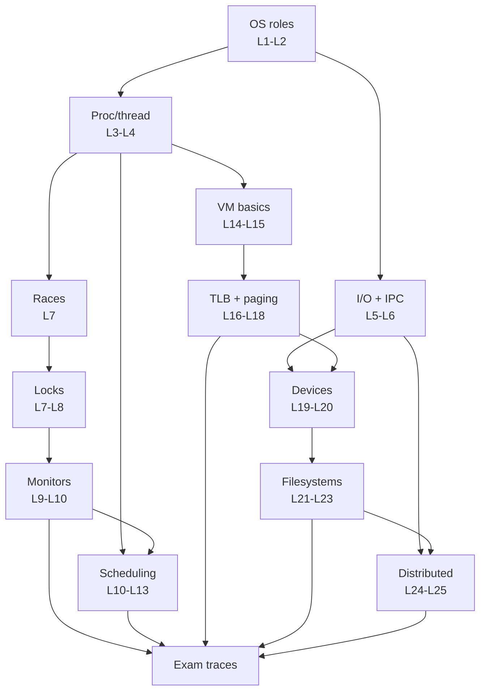
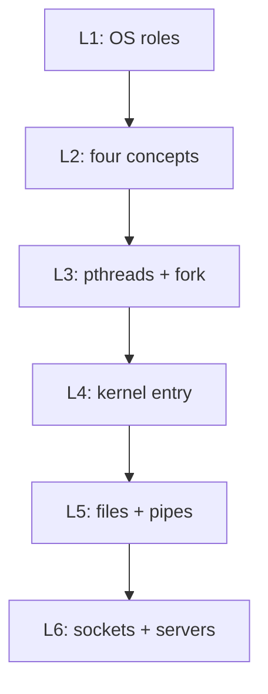
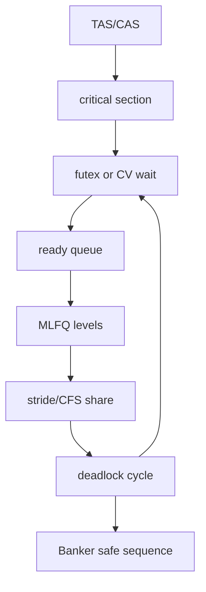
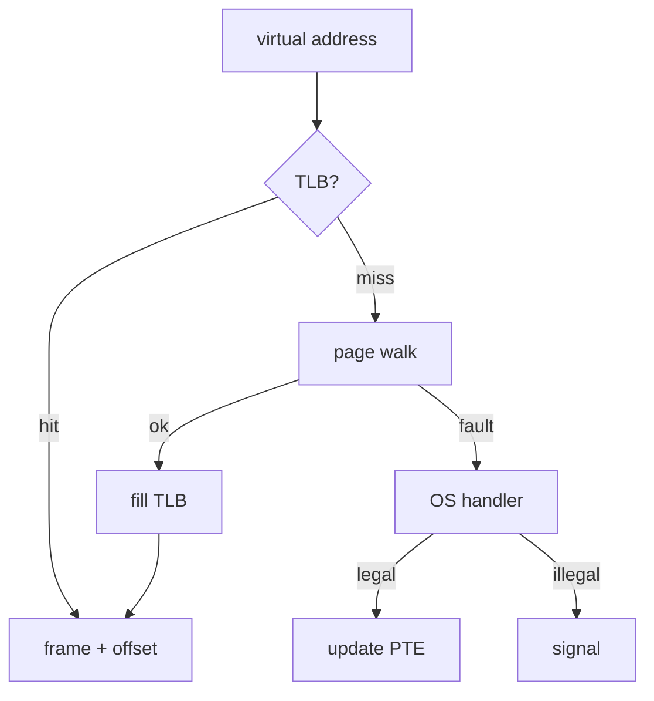
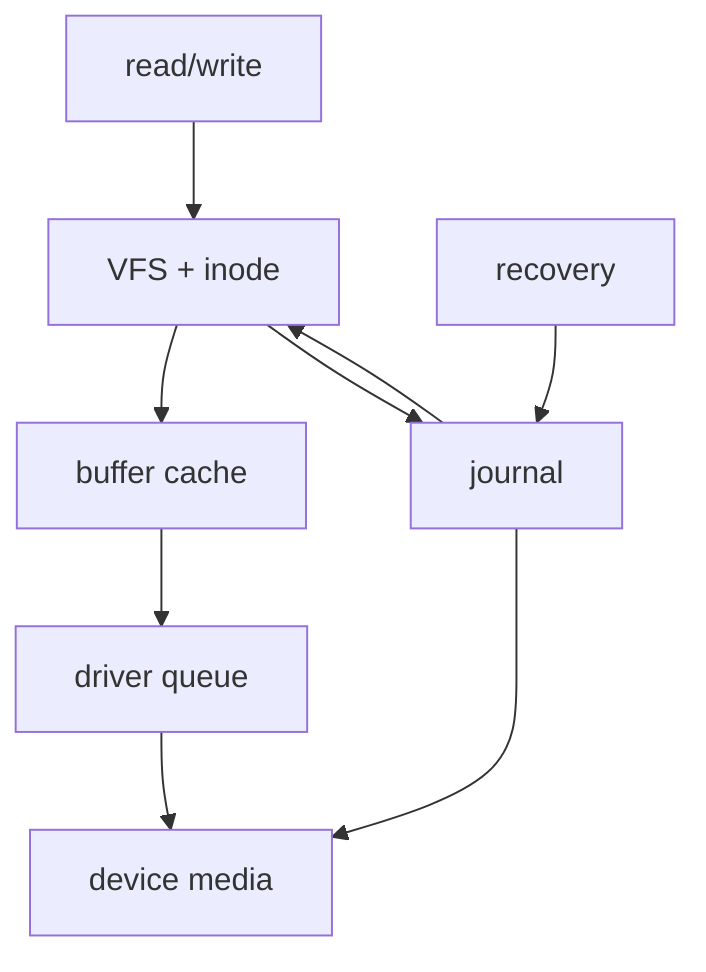
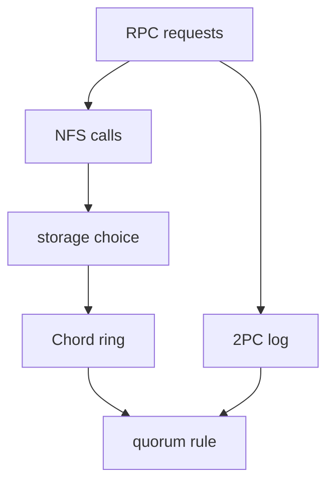

# How to Use This Book

This book is organized as a working companion to CS162, not as a replacement for lecture, section, projects, or official announcements. The public course site is the authority for the semester's schedule and released material [1](#source-1). The lecture notes and discussion worksheets are the primary public sources for the explanations, examples, and practice patterns used here [2](#source-2) [29](#source-29).

Use the book in three passes.

First, read each unit for structure. The operating systems course builds a small number of durable ideas: isolation, controlled sharing, naming, scheduling, caching, persistence, and fault tolerance. The early lectures introduce the operating system as the layer that turns hardware into usable abstractions [2](#source-2), then the course develops those abstractions through processes, threads, address spaces, files, sockets, and interprocess communication [3](#source-3) [4](#source-4) [5](#source-5) [6](#source-6) [7](#source-7).

Second, work the examples by hand. CS162 exam questions often ask for a trace, an invariant, a race, a state transition, or a performance comparison. Reading a solution is less useful than producing the table yourself: thread states, ready queues, page-table walks, buffer-cache contents, disk requests, or distributed-message timelines. Discussion worksheets are especially good for this style of rehearsal because they compress each topic into concrete prompts [29](#source-29) [30](#source-30) [31](#source-31).

Third, connect the abstractions to implementation constraints. The same idea usually appears twice: once as a clean interface, then again as a messy implementation. A lock looks simple until atomic instructions, waiting, fairness, and wakeups enter the picture [8](#source-8) [9](#source-9). Virtual memory looks like a private array of bytes until page tables, TLBs, replacement policy, and faults determine its real cost [15](#source-15) [16](#source-16) [17](#source-17) [18](#source-18) [19](#source-19). File systems look like names and bytes until layout, caching, crash recovery, and transactions determine what survives failures [22](#source-22) [23](#source-23) [24](#source-24).

## What Each Support Section Is For

The course map gives the dependency graph. Use it before starting a unit, after missing a lecture, or when an exam question seems to mix topics from different weeks [1](#source-1) [2](#source-2) [27](#source-27).

The prerequisite crash course reviews the background the book assumes. It is not a full systems programming text; it is a compact bridge from C, hardware, and concurrency vocabulary into the OS material [1](#source-1) [3](#source-3) [8](#source-8).

The cheat sheets collect definitions, formulas, and comparison points that are easy to forget under time pressure. They are intentionally terse. If a line feels unfamiliar, return to the relevant unit instead of memorizing the table [2](#source-2) [27](#source-27).

The glossary gives consistent language. Many CS162 bugs are really vocabulary bugs: confusing a process with a thread, a virtual address with a physical address, a file descriptor with an open file description, or safety with liveness [4](#source-4) [6](#source-6) [15](#source-15) [16](#source-16) [14](#source-14).

The exam-style review shows how to turn the course material into answerable prompts. Use it to practice explaining tradeoffs, not just selecting keywords [29](#source-29) [39](#source-39).

## A Practical Reading Loop

For each topic, do the following.

1. Read the unit introduction and identify the abstraction being provided.
2. Write down the state the kernel must maintain to implement that abstraction.
3. Find the operations that can change that state.
4. Ask what can go wrong: race, deadlock, starvation, invalid pointer, lost wakeup, stale cache entry, crash window, timeout, or inconsistent replica.
5. Work one lecture example and one discussion-style example without looking at the answer.
6. Revisit the cheat sheet only after the worked example exposes what you forgot.

This loop fits the course because the sequence repeatedly moves from interface to mechanism: process management after thread and process abstractions [4](#source-4) [5](#source-5), synchronization after concurrency hazards [8](#source-8) [10](#source-10), scheduling after runnable work exists [11](#source-11) [12](#source-12) [13](#source-13), memory after address spaces exist [15](#source-15) [16](#source-16), storage after I/O devices enter the model [20](#source-20) [21](#source-21), and distributed systems after single-machine naming and persistence are established [25](#source-25) [26](#source-26).

## How to Study With Citations

Inline citations point to the public source registry. Lecture citations use source numbers [2](#source-2) through [27](#source-27). The public playlist is [28](#source-28). Discussion worksheets use [29](#source-29) through [39](#source-39). A citation does not mean that every sentence nearby is a quotation; it marks the public course artifact that anchors the topic.

When the book and lecture differ in emphasis, prefer the official course material. When an example in this book feels underspecified, return to the cited lecture or discussion and reconstruct the missing state. Operating systems questions reward explicit state [1](#source-1) [2](#source-2) [39](#source-39).

## How to Use the Playlist

The public playlist is useful for repairing gaps after reading [28](#source-28). Watch with a narrow purpose: pause when a new mechanism is introduced, write the state variables, then resume. For synchronization, scheduling, paging, and crash recovery, the important step is not hearing the name of the policy; it is being able to simulate one transition at a time [8](#source-8) [12](#source-12) [18](#source-18) [24](#source-24) [28](#source-28).

## What Not to Do

Do not treat the book as a pile of definitions. The course is cumulative. If you memorize "mutex" without understanding the race it prevents, the later monitor and condition-variable material will blur [8](#source-8) [10](#source-10). If you memorize "TLB" without tracing translation, demand paging will feel arbitrary [17](#source-17) [18](#source-18). If you memorize "two-phase commit" without the failure states, distributed transactions will look cleaner than they are [25](#source-25).

Do not skip the discussion problems. They are the bridge between lecture-level concepts and exam-level manipulation [30](#source-30) [31](#source-31) [32](#source-32) [33](#source-33) [34](#source-34) [35](#source-35) [36](#source-36) [37](#source-37) [38](#source-38) [39](#source-39).

Do not study performance topics as isolated formulas. Queueing, caching, replacement, disk scheduling, and distributed latency are all versions of the same question: where is the bottleneck, what state is being reused, and what happens when demand exceeds service capacity [20](#source-20) [21](#source-21) [22](#source-22).

# Course Map

CS162 is best read as a sequence of abstractions and implementation pressures. The public course sequence starts with the role of an operating system, then introduces the four fundamental concepts that recur throughout the term [2](#source-2) [3](#source-3). From there, the course moves through processes and threads, files and IPC, synchronization, scheduling, memory, I/O, file systems, and distributed systems [4](#source-4) [5](#source-5) [6](#source-6) [7](#source-7) [8](#source-8) [12](#source-12) [15](#source-15) [20](#source-20) [22](#source-22) [25](#source-25).

## Unit 1: Foundations and OS Abstractions

The opening lectures ask what the operating system does and why it is structured around protection, multiplexing, and abstraction [2](#source-2) [3](#source-3). Processes and threads make that concrete: a process owns an address space and resource context, while threads represent schedulable execution within that context [4](#source-4) [5](#source-5). Files, sockets, and IPC extend the same abstraction pattern to persistent bytes and communication endpoints [6](#source-6) [7](#source-7).

Study target: be able to draw the boundary between user mode and kernel mode, explain why an abstraction exists, and identify the kernel state needed to support it [2](#source-2) [3](#source-3) [4](#source-4).

Representative sources: Lectures 1 through 6 and Discussions 0 through 2 [2](#source-2) [3](#source-3) [4](#source-4) [5](#source-5) [6](#source-6) [7](#source-7) [29](#source-29) [30](#source-30) [31](#source-31).

## Unit 2: Synchronization and Scheduling

The synchronization arc begins with concurrency bugs, then moves into mutual exclusion, atomic instructions, futex-style waiting, semaphores, monitors, and readers-writers patterns [8](#source-8) [9](#source-9) [10](#source-10) [11](#source-11). Scheduling follows naturally: once there are many runnable threads, the OS must choose who runs, when preemption occurs, and how to reason about turnaround time, response time, fairness, starvation, and priority inversion [11](#source-11) [12](#source-12) [13](#source-13) [14](#source-14).

Study target: be able to state the shared invariant, choose the synchronization primitive that protects it, and simulate a scheduler's decision sequence [8](#source-8) [10](#source-10) [12](#source-12).

Representative sources: Lectures 7 through 13 and Discussions 3 through 5 [8](#source-8) [9](#source-9) [10](#source-10) [11](#source-11) [12](#source-12) [13](#source-13) [14](#source-14) [32](#source-32) [33](#source-33) [34](#source-34) [35](#source-35).

## Unit 3: Memory

The memory unit turns the address space abstraction into machinery. Address translation, segmentation, page tables, multi-level page tables, TLBs, caching, and demand paging are all ways to give each process a usable virtual address space while sharing limited physical memory [15](#source-15) [16](#source-16) [17](#source-17) [18](#source-18) [19](#source-19).

Study target: be able to translate an address, count memory references, explain where a fault occurs, and compare replacement policies by their state and miss behavior [15](#source-15) [16](#source-16) [18](#source-18) [19](#source-19).

Representative sources: Lectures 14 through 18 and memory-oriented discussion practice [15](#source-15) [16](#source-16) [17](#source-17) [18](#source-18) [19](#source-19) [36](#source-36).

## Unit 4: I/O and File Systems

The I/O sequence introduces devices, drivers, performance limits, storage media, queueing, and the file-system structures that turn blocks into files and directories [20](#source-20) [21](#source-21) [22](#source-22) [23](#source-23). Reliability and transactions then force the same state-machine discipline used earlier for synchronization: define the invariant, enumerate failure windows, and make recovery deterministic [24](#source-24).

Study target: be able to connect an application-level operation to device requests, cache behavior, metadata updates, and crash-consistency obligations [20](#source-20) [21](#source-21) [22](#source-22) [24](#source-24).

Representative sources: Lectures 19 through 23 and file-system discussion practice [20](#source-20) [21](#source-21) [22](#source-22) [23](#source-23) [24](#source-24) [37](#source-37) [38](#source-38).

## Unit 5: Distributed Systems

The distributed lectures revisit core OS themes when the boundary is no longer one machine. End-to-end arguments, distributed decision making, two-phase commit, RPC, NFS, AFS, VFS, and distributed storage all ask what the system can promise when messages can be delayed, machines can fail, and replicas may disagree [25](#source-25) [26](#source-26). The final listed lecture slot is marked as a possible special topics lecture in the public materials [27](#source-27).

Study target: be able to separate local failure from remote failure, explain the state each participant stores, and identify which guarantees are weakened by partitions, crashes, or retries [25](#source-25) [26](#source-26).

Representative sources: Lectures 24 through 26 and the later discussion sets [25](#source-25) [26](#source-26) [27](#source-27) [38](#source-38) [39](#source-39).

## Cross-Cutting Questions

For every unit, keep these questions active [2](#source-2) [27](#source-27).

1. What abstraction is the OS exposing?
2. What hardware or lower-level mechanism makes the abstraction possible?
3. What state must be protected?
4. Which operations can interleave?
5. What is the failure model?
6. What does the policy optimize, and what does it sacrifice?
7. How would the answer change under a different workload?

Those questions are deliberately reusable. A monitor protects shared state [10](#source-10); a page table protects address translation state [16](#source-16); a buffer cache protects recently used storage state [24](#source-24); a distributed protocol protects agreement state across machines [25](#source-25). The syntax changes, but the reasoning pattern remains stable.

# Prerequisite Crash Course

This section reviews the background assumed by the course-book chapters. It is intentionally compact. Use it to refresh the concepts needed to read CS162 material about processes, synchronization, memory, storage, and distributed systems [1](#source-1).

## Systems View

A computer system can be read as layers of contracts [2](#source-2) [3](#source-3).

Hardware provides CPUs, memory, interrupts, timers, device interfaces, and privileged instructions. The operating system uses those mechanisms to implement protection, multiplexing, communication, persistence, and controlled sharing [2](#source-2) [3](#source-3). User programs run against abstractions such as processes, threads, virtual addresses, file descriptors, sockets, and system calls [4](#source-4) [6](#source-6).

When a problem asks "what happens next," answer at the right layer. A C assignment changes memory. A system call crosses into the kernel. A context switch changes the running thread. A page fault changes the memory-management path. A disk write may only update a cache until a later flush. A distributed RPC may have completed locally even when the remote effect is uncertain [18](#source-18) [20](#source-20) [25](#source-25).

## C and Memory Model Basics

CS162 reasoning often assumes comfort with C-like memory [1](#source-1) [3](#source-3) [15](#source-15).

An object has storage, type, lifetime, and an address. A pointer value names an address; it does not prove that the address is valid. Pointer arithmetic moves by element size, not by raw bytes unless the pointer is byte-oriented. A stack allocation lives only for the dynamic extent of the call. A heap allocation lives until it is freed. A global or static allocation lives for the program duration [3](#source-3) [15](#source-15).

Common failure modes [3](#source-3) [8](#source-8) [15](#source-15):

- Dangling pointer: the pointer still contains an address after the object lifetime ended.
- Double free: the allocator is asked to release the same allocation twice.
- Use after free: code reads or writes an allocation after release.
- Buffer overflow: code accesses beyond the object's valid range.
- Data race: two threads access the same memory concurrently, at least one write occurs, and there is no synchronization protecting the access [8](#source-8).

When a kernel validates a user pointer, it is not checking style. It is defending the kernel from untrusted addresses supplied by a process. That connects directly to protection and address-space isolation [3](#source-3) [15](#source-15).

## Bits, Addresses, and Alignment

Addresses are numbers interpreted by the memory system. A byte address identifies a byte. A word address is usually aligned to the word size. Alignment matters because hardware and memory systems are optimized around fixed-size chunks [15](#source-15) [16](#source-16).

For address-translation problems, split the virtual address into fields [15](#source-15) [16](#source-16) [17](#source-17):

- Virtual page number: selects the virtual page.
- Offset: selects a byte within the page.
- Page-table index fields: select entries at one or more levels.
- Physical frame number: identifies the physical page frame after translation.

The page offset is unchanged by translation because virtual and physical pages have the same size. Multi-level page tables reduce memory overhead by allocating lower-level tables only for regions that need mappings [16](#source-16). TLBs cache recent translations, so the cost of memory access depends on whether translation hits in the TLB, misses in the TLB, or faults because the page is not resident [17](#source-17) [18](#source-18).

## CPU Execution and Traps

A CPU executes instructions in a current privilege mode. User mode is restricted. Kernel mode can execute privileged operations. A trap, fault, interrupt, or system call transfers control to the kernel through a controlled entry path [3](#source-3).

Useful distinctions [3](#source-3) [4](#source-4) [20](#source-20):

- System call: intentional request from user code to the kernel.
- Exception or fault: synchronous event caused by the current instruction, such as a page fault.
- Interrupt: asynchronous event, often from a timer or device.
- Context switch: change from one runnable execution context to another.
- Mode switch: change between user and kernel privilege mode.

A mode switch is not necessarily a context switch. A process can enter the kernel for a system call and return to the same thread. A context switch is about which thread or process is running, and it requires saving and restoring execution state [4](#source-4) [5](#source-5).

## Processes, Threads, and Shared State

A process is a resource and protection container. It has an address space, open files, and other kernel-managed resources. A thread is an execution stream with registers and a stack. Threads in the same process share the process address space, which makes communication cheap and synchronization necessary [4](#source-4) [5](#source-5).

Ask these questions for every concurrency problem [8](#source-8) [10](#source-10):

1. What state is shared?
2. Which operations read it?
3. Which operations write it?
4. What invariant must always hold?
5. What interleaving violates the invariant?
6. What synchronization primitive prevents that interleaving?

This is the bridge from the thread abstraction to locks, atomics, semaphores, monitors, condition variables, and readers-writers designs [8](#source-8) [9](#source-9) [10](#source-10).

## Synchronization Vocabulary

Mutual exclusion means at most one thread executes a critical section at a time. Atomicity means an operation appears indivisible with respect to other threads. Blocking means a thread stops running until some condition changes. Spinning means a thread repeatedly checks until progress becomes possible. A lost wakeup occurs when a notification happens before the waiter is actually waiting.

Safety asks whether bad things never happen. Liveness asks whether good things eventually happen. A lock can preserve safety while still permitting deadlock or starvation if the design is wrong [13](#source-13) [14](#source-14).

Condition variables should be paired with a predicate over shared state. The waiting thread checks the predicate while holding the lock, sleeps if the predicate is false, and checks again after waking. The loop matters because wakeups can be stale, spurious, or consumed by another thread [10](#source-10).

## Scheduling Math

Scheduling questions usually define arrival times, service times, priorities, quanta, or weights. Draw a timeline before computing metrics [11](#source-11) [12](#source-12) [13](#source-13) [14](#source-14).

Common quantities [11](#source-11) [12](#source-12):

- Completion time: when a job finishes.
- Turnaround time: completion time minus arrival time.
- Response time: first run time minus arrival time.
- Waiting time: time spent ready but not running.
- Throughput: completed work per unit time.
- Fairness: how evenly resources are allocated under the policy's definition.

First-come first-served, shortest job first, shortest remaining time first, round-robin, priority scheduling, lottery scheduling, and stride scheduling differ in the state they track and the workload they favor [11](#source-11) [12](#source-12) [13](#source-13) [14](#source-14).

## Storage and Caching

Storage systems translate names and offsets into blocks. A file system maintains metadata that maps file names to inodes or similar objects, then maps file offsets to disk blocks. Caches exploit locality by keeping recently or frequently used data close to the CPU or kernel [21](#source-21) [22](#source-22) [23](#source-23).

Always separate these layers [20](#source-20) [21](#source-21) [24](#source-24):

- Application buffer: memory owned by the user process.
- Kernel buffer or page cache: memory managed by the OS.
- Device queue: pending operations for hardware.
- Persistent medium: the storage device's durable state.

Crash consistency is about which of these states survive failure and how recovery restores invariants. A file-system operation that looks like one action at the API may require several metadata and data writes underneath [24](#source-24).

## Networks and Distributed Systems

A local function call has one failure domain. A remote call has several: caller, network, callee, and reply path. If the caller times out, it may not know whether the callee executed the operation. This uncertainty is the heart of retry, idempotence, distributed storage, RPC, and commit protocols [25](#source-25) [26](#source-26).

Before reasoning about a distributed protocol, write down [25](#source-25) [26](#source-26):

- Participants.
- Local state at each participant.
- Messages.
- Stable storage requirements.
- Timeout behavior.
- Failure cases.
- The guarantee being claimed.

The result should look like a state machine, not a slogan [25](#source-25) [26](#source-26).

## Minimal Working Toolkit

You should be comfortable with a command line, compiling and running C or systems code, reading compiler errors, using a debugger, and interpreting tests. The course's public material includes lectures, discussions, and project-related pages from the course site [1](#source-1). For this book, the important habit is to translate tool output into system state: process exited, thread blocked, pointer invalid, page unmapped, file descriptor closed, request timed out.

## A Quick Self-Check

Before moving into the main chapters, make sure you can answer these without notes [1](#source-1) [2](#source-2) [27](#source-27).

1. Why does an OS need privileged mode?
2. What state is private to a thread, and what state is shared by threads in one process?
3. Why does disabling interrupts not solve synchronization for all machines?
4. Why must a condition-variable wait recheck the predicate?
5. What fields change when translating a virtual address to a physical address?
6. Why can a cache improve average performance while making correctness harder?
7. Why is "the RPC timed out" not the same as "the remote operation did not happen"?

Each question maps to a recurring course pattern. If one feels weak, start with the cited lecture sequence before reading the corresponding unit [3](#source-3) [4](#source-4) [8](#source-8) [10](#source-10) [16](#source-16) [24](#source-24) [25](#source-25).

# Unit 1: Foundations and OS Abstractions

Operating systems are easiest to understand if you start from the problem they solve: useful programs want hardware, but raw hardware is too detailed, dangerous, and shared for each program to control directly. A modern machine contains processors, caches, memory, storage devices, displays, network cards, timers, interrupt controllers, and firmware. A modern computing environment contains many such machines connected through networks and services. If every program had to know every device register, schedule itself around every other program, and defend its memory from every bug, most software would be impossible to build reliably. The operating system is the software layer that turns that hostile setting into a set of contracts programmers can use [2](#source-2) [28](#source-28).

The first contract is abstraction. A thread gives code the illusion of its own CPU stream. An address space gives a process the illusion of private memory. A file gives byte-oriented access to persistent storage and device-like objects. A socket gives byte-oriented communication across a network. These are not merely vocabulary words. They are promises about what operations exist, which errors can occur, and what state the OS preserves on behalf of a program. Unit 1 introduces these promises in the same order students will use them in code: processes and threads first, then system calls and process management, then Unix I/O, pipes, sockets, and server concurrency [3](#source-3) [6](#source-6) [7](#source-7) [28](#source-28).

The second contract is protection. Programs should not be able to overwrite the kernel, steal another process's memory, disable timer interrupts, or change the page-table pointer just because they have a bad pointer or a malicious goal. The OS enforces boundaries with hardware support: user mode, kernel mode, address translation, interrupt and exception paths, and controlled system-call entry points. Protection is not only about attackers. It is also how a machine keeps one ordinary program's bug from corrupting every other program [3](#source-3) [5](#source-5).

The third contract is controlled sharing. A system is valuable because programs can share processors, files, terminals, devices, and networks. The OS therefore acts as referee, deciding who may use which resource and when. It also acts as glue, providing common services so programs can be composed. Shells, pipelines, file descriptors, inherited standard output, pipes, and sockets all depend on the same idea: communication should happen through explicit OS-managed channels, not accidental memory corruption [2](#source-2) [6](#source-6) [7](#source-7).

The unit also introduces a systems habit of mind. When an abstraction is simple, ask what hidden state makes it work. When a result is nondeterministic, ask which scheduler interleavings are legal. When a resource is copied, ask whether the copy is a private memory object or another reference to a kernel object. When an API looks like a function call, ask whether it crosses into the kernel. The public lecture sequence and playlist support this unit's arc from "what is an OS?" to process, thread, file, pipe, socket, and server abstractions [28](#source-28).

## Lecture 1: What is an operating system?

### Learning goals

By the end of this lecture, you should be able to define an operating system as a software layer that gives applications controlled access to hardware; explain the OS roles of illusionist, referee, and glue; distinguish a broad vendor operating system from the narrower kernel; define a process as a protected execution environment; and explain why context switching and hardware protection are foundational. You should also be able to connect the opening abstraction vocabulary to later course objects: threads, address spaces, files, sockets, system calls, and scheduling [2](#source-2).

### Key terms

Operating system, kernel, abstraction, process, address space, thread, context switch, user mode, kernel mode, virtual memory, system call, interrupt, exception, isolation, protection, resource sharing, scheduler, fault containment.

### Full explanation

An operating system is not best learned as a brand name or a folder of programs. Lecture 1 frames it functionally: it is the layer that gives programs controlled access to hardware resources. There are several boundaries one might draw. A vendor may ship a graphical desktop, browser, media framework, shell, utilities, and libraries as part of an "operating system." For technical work, the anchor is the kernel: the privileged core that is always present to mediate access to processors, memory, devices, storage, and the network [2](#source-2).

The OS exists because real machines are not clean programming interfaces. Raw hardware exposes registers, interrupts, controllers, storage blocks, network packets, and timing behavior. A useful application wants simpler objects: a place to run code, a private memory view, named files, reliable I/O calls, and communication channels. The OS acts as an illusionist by presenting those simpler objects. A process can feel like a private machine even though it is time-sharing one CPU with many other processes. A file can feel like a byte sequence even though the implementation may involve metadata, block allocation, caching, and device scheduling. A socket can feel like a stream even though the implementation involves network packets, retransmission, buffering, and routing [2](#source-2).

The OS also acts as a referee. Multiple programs compete for processors, memory, storage bandwidth, terminals, and network access. If every program could write any physical address or issue any device command, a single bug could destroy the whole system. The OS therefore controls who may access what, when, and how. The course's first concrete example is the process: a running program environment with restricted rights. A process contains an address space, one or more threads, and OS-managed state such as open files and sockets. The address space defines which memory addresses the process can use; the threads are the execution streams running in that memory; the OS state records external resources the process has been granted [2](#source-2).

The process abstraction also explains the distinction between a program and a process. A program is passive code and data, often stored in a file. A process is an instance of execution with memory mappings, saved registers, scheduler state, resource handles, and protection rights. When the OS loads a program, it creates the runtime environment: code and data mappings, stack and heap regions, a thread to start execution, and kernel records so the scheduler can stop and resume it. That running instance is the process [2](#source-2).

On one CPU core, only one instruction stream executes at a time. The illusion of many active programs comes from context switching. A timer or other event transfers control to the kernel. The kernel saves the current thread's register state, program counter, stack pointer, and address-space identity into protected kernel data structures. It then chooses another runnable thread or process, restores that saved state, installs the right memory-translation context, and returns to user execution. Each process sees its own code continue; the system as a whole is sharing the CPU in time [2](#source-2).

Protection requires hardware participation. The OS can have a policy such as "user programs may not write kernel memory," but a policy is useless unless the CPU and memory-management hardware enforce it. Dual-mode operation gives ordinary applications user mode and reserves privileged operations for kernel mode. Address translation and virtual memory prevent one process's ordinary load or store from reaching another process's private memory. Controlled transitions such as system calls, interrupts, and exceptions are the legitimate ways into the kernel. Without those mechanisms, the kernel would be just another library, and a malicious or broken program could bypass it [2](#source-2).

Finally, the OS acts as glue. It supplies common services that programs can compose: files, standard input and output, networking, authentication, device-independent I/O, and shared conventions. This role matters because systems are large. A stable abstraction boundary lets many programs use a resource without embedding the entire implementation. The price is that the boundary must be precise. Much of CS162 is learning what each boundary promises, what it does not promise, and what invariants the OS must preserve underneath [2](#source-2).

### Worked examples

First, consider two processes on one core. Process A is a browser tab; Process B is an editor. A is running with its registers in the CPU. A timer interrupt fires after a short time slice. Hardware enters the kernel, the kernel saves A's registers and memory-context pointer, marks A ready, chooses B, restores B's saved registers and address-space pointer, and returns to user mode. B now runs as if it had a CPU. A later resumes from the exact instruction where it was interrupted. Nothing in this story requires two physical cores. It requires saved state, a scheduler, and controlled transitions [2](#source-2).

Second, consider a bad pointer. Process Green tries to load from an address that is not mapped in its own address space. The hardware checks the translation and permissions before the memory access completes. Because the address is invalid, it raises an exception. The kernel handles the fault and may terminate Green with a segmentation fault. Process Brown and the kernel keep running. The important point is containment: the violation harms the offending process, not the whole machine [2](#source-2).

Third, consider a web search from a phone. The application uses names, sockets, files, memory buffers, and threads. It does not manually program the network card or schedule every interrupt. Local and remote operating systems provide the abstractions that make the request look like ordinary communication, even though many devices and services participate under the surface [2](#source-2).

### Common mistakes

A common mistake is saying "the OS is everything installed on the computer." That is sometimes a product-level meaning, but the technical core is the kernel and the protected services around it. Another mistake is treating a program and a process as the same object. A program can exist on disk without running; a process is a live protected execution environment. Students also overstate the illusion of parallelism: two processes can make progress concurrently on one core through time slicing, but they are not literally executing simultaneously unless separate hardware execution resources are involved [2](#source-2).

Another recurring error is describing protection as a matter of convention. Protection is not "applications promise not to write bad addresses." It is enforced by address translation, privilege levels, and controlled kernel entry paths. Finally, students sometimes treat abstractions as fake. A file or process is not fake to the programmer; it is the contract the OS provides. The hidden implementation is complex, but the abstraction is the stable interface [2](#source-2).

### Self-check questions with answers

1. What is the difference between a kernel and a broad operating-system distribution?

Answer: The kernel is the privileged core that mediates hardware and protected resources. A broad distribution may include libraries, graphical services, tools, shells, and applications around that core [2](#source-2).

2. Why does a process need both an address space and a thread?

Answer: The address space defines the protected memory environment. A thread is the execution stream that runs code in that environment. Memory without execution cannot run; execution without a protected memory context cannot be isolated [2](#source-2).

3. How can two processes appear active on one single-core CPU?

Answer: The OS saves one process or thread's state, restores another's, and repeats this quickly. Each process observes its own resumed execution, while the CPU is actually time-shared [2](#source-2).

4. What should happen if a user process tries to write kernel memory?

Answer: Hardware should prevent the access and transfer control to the kernel through a fault. The kernel handles the violation, commonly by terminating or signaling the process [2](#source-2).

5. Why is testing alone not enough for operating systems?

Answer: OS code runs with many hardware devices, programs, timing interleavings, failures, and attacks. Clean interfaces, isolation, and recovery are needed because exhaustive testing of all combinations is infeasible [2](#source-2).

### Sources

Primary public source: [2](#source-2).

## Lecture 2: Four Fundamental OS Concepts

### Learning goals

This lecture turns the opening OS story into four concrete abstractions: thread, address space, process, and dual mode. You should be able to define each one, explain how it relates to raw hardware, and trace a context switch at the level of saved registers and memory-protection state. You should also be able to compare base-and-bound protection with paging at a high level, and explain why address translation must be combined with privilege separation [3](#source-3).

### Key terms

Thread, virtual CPU, program counter, stack pointer, register file, Thread Control Block, address space, virtual address, physical address, base and bound, page table, process, Process Control Block, user mode, kernel mode, syscall, interrupt, exception, scheduler.

### Full explanation

Lecture 2 names the four ideas that will recur for the rest of the course. A thread is a virtualized execution context. It is the part of a program that has a program counter, stack pointer, registers, flags, and a call stack. When a thread is running, that root state lives in the physical CPU registers. When it is not running, the OS saves enough of that state in memory so the thread can continue later. The Thread Control Block is the conceptual record that preserves the saved execution state and scheduling metadata [3](#source-3).

This model explains context switching more precisely. Suppose a core is running Thread A. A timer interrupt or syscall enters the kernel. The kernel saves A's register-rooted state into A's TCB, places A in a ready or blocked state depending on why it stopped, chooses Thread B, loads B's saved registers, and returns to user mode. If B belongs to a different process, the kernel must also install B's process memory context. The key invariant is resumability: a suspended thread must have enough saved state to continue as if it had merely paused [3](#source-3).

An address space is the set of addresses a program can use, together with the behavior associated with reading, writing, or executing those addresses. That definition is broader than "a region of DRAM." Some addresses map to ordinary memory. Some may be invalid and fault. Some may correspond to memory-mapped device behavior. Some may be shared deliberately. The abstraction lets a program issue virtual addresses while hardware and the OS decide what those addresses mean [3](#source-3).

Base and bound is the simplest protection model. The OS loads a program into a contiguous region and configures privileged registers describing the legal range. In one variant, hardware checks every address to ensure it lies between the base and bound. In another, the program uses addresses starting at zero, and hardware adds the base to form a physical address while checking that the offset is below the bound. This gives a clear containment rule, but it is rigid: each process needs a contiguous physical region, and growing or moving it can require copying [3](#source-3).

Paging is more flexible. The virtual address space is split into pages, physical memory is split into frames, and a page table maps virtual pages to physical frames with permissions. The process can see a contiguous virtual address range even when its physical frames are scattered. If a page is absent or lacks permission, the access faults. Lecture 2 introduces this only at a high level, but the core idea is already visible: every user memory access is mediated by translation and permission checks [3](#source-3).

A process combines the passive protection environment with active execution. It is a protected address space plus one or more threads and OS-managed resources such as file descriptors, filesystem context, credentials, and other metadata. Threads in the same process share an address space, which makes communication cheap but exposes them to shared-memory races. Threads in different processes are isolated by default, so they need explicit communication mechanisms [3](#source-3).

Dual mode is the fourth concept because translation alone is insufficient. If user code could change the page-table pointer, disable interrupts, or issue device commands, it could escape whatever address space the OS assigned. Hardware therefore distinguishes user mode from kernel mode. Ordinary application code runs in user mode and cannot perform privileged operations. Kernel code runs in privileged mode and can configure protection state. User programs request privileged services through system calls. External events arrive as interrupts. Synchronous faults such as illegal memory access arrive as exceptions or traps. All three paths enter the kernel through controlled entry points [3](#source-3).

The four concepts fit together. Threads virtualize processors. Address spaces virtualize memory. Processes combine threads and address spaces into protected execution containers. Dual mode enforces the boundary between untrusted user code and trusted kernel mechanisms. Once those pieces exist, the OS can multiplex one machine among many programs without making every program trust every other program [3](#source-3).

### Worked examples

Base-and-bound check: suppose a process has base `0x1000` and a length bound of `0x100`. A virtual address `0x0024` translates to physical `0x1024` and is legal because the offset is below `0x100`. A virtual address `0x0100` is not legal if the bound is exclusive. The hardware should raise a fault rather than allow an access to `0x1100` [3](#source-3).

Paged translation: suppose virtual page 5 maps to physical frame 17 with read/write permission, while virtual page 6 is not present. A load from an address on page 5 can proceed after translation. A load from page 6 faults. The program used virtual addresses in both cases; the difference is the page-table entry and permission state [3](#source-3).

Thread switch: Thread X is running with `PC = 0x8048120` and `SP = 0xbffff000`. A timer interrupt enters the kernel. The kernel saves those values and general registers in X's TCB. It chooses Thread Y, whose TCB records `PC = 0x8049000` and `SP = 0xbfffe000`, restores them, and returns to user mode. X did not call a function and does not need to know it was interrupted [3](#source-3).

### Common mistakes

Students often say a thread "is a process." A thread is execution state; a process is the protected resource container. A single process may contain many threads. Another mistake is equating an address space with installed physical memory. A process can have a large virtual address space without every virtual address being backed by DRAM [3](#source-3).

A subtle mistake is thinking address translation alone enforces protection. Translation structures themselves must be protected. If a user process could rewrite its page table or change the page-table base register, it could map forbidden memory. That is why dual mode is part of the fundamental set. Students also confuse syscall, interrupt, and exception. A syscall is requested by the running program; an interrupt is asynchronous; an exception is caused synchronously by the current instruction [3](#source-3).

### Self-check questions with answers

1. Where is a thread's state when it is running, and where is it when it is suspended?

Answer: When running, its root state is in CPU registers. When suspended, the OS stores enough state in a TCB or related kernel record to resume it later [3](#source-3).

2. What is the difference between a virtual address and a physical address?

Answer: A virtual address is the address generated by the program. Hardware and OS-managed translation map it to a physical address or reject it with a fault [3](#source-3).

3. Why is base and bound simpler but less flexible than paging?

Answer: Base and bound protects one contiguous range. Paging maps fixed-size virtual pages to arbitrary physical frames, which avoids requiring one contiguous physical region [3](#source-3).

4. Why must changing the page-table pointer be privileged?

Answer: If user code could change it, the process could install translations to other processes or kernel memory and bypass isolation [3](#source-3).

5. What is the role of the PCB compared with the TCB?

Answer: A PCB records process-level state such as PID, address-space metadata, status, and resources. A TCB records per-thread execution state such as saved registers and stack pointer [3](#source-3).

### Sources

Primary public source: [3](#source-3).

## Lecture 3: Abstractions 1: Threads and Processes

### Learning goals

This lecture moves from OS concepts to programmer-facing concurrency and process APIs. You should be able to describe a thread as a schedulable virtual core, distinguish concurrency from parallelism, identify shared and per-thread state, use the contracts of `pthread_create`, `pthread_exit`, `pthread_join`, and mutexes, and reason about simple race conditions. You should also be able to trace the first process-management operations: `exit`, `fork`, and the bridge toward `exec` [4](#source-4).

### Key terms

Pthread, start routine, join, exit, yield, running, ready, blocked, concurrency, parallelism, shared address space, stack, global variable, heap, race condition, synchronization, mutual exclusion, critical section, mutex, fork, parent process, child process.

### Full explanation

Lecture 3 begins with the thread as a programmer-visible abstraction. A thread is a single flow of control inside a process. It has its own program counter, registers, stack pointer, and stack. The scheduler may run it, pause it, and resume it. From the programmer's view, a thread feels like a virtual CPU: code in that thread proceeds through instructions and function calls. From the OS view, a thread is an object with saved state when it is not on a core [4](#source-4).

The process remains the protection container. A process owns an address space and kernel resources such as file descriptors and network connections. Threads inside the same process share code, globals, heap objects, and those process resources. They do not share register state or stack frames as one execution. This split is essential. Sharing one address space makes communication cheap because one thread can write a heap object and another can read it. The same sharing also makes bugs dangerous because one thread can corrupt data another thread assumes is stable [4](#source-4).

Concurrency and parallelism are different. Concurrency means a program has multiple tasks in progress whose steps may be interleaved. Parallelism means multiple tasks execute at the same instant on distinct hardware resources. A single-core machine can run concurrent threads by switching among them. A multi-core machine can run threads in parallel, but only if the program exposes multiple schedulable execution streams. A one-thread program cannot use eight cores just because they exist [4](#source-4).

Threads are especially useful for latency and responsiveness. If one thread blocks waiting for disk or network I/O, another thread in the same process can keep working. A user interface can remain responsive while a file read waits. A server can continue accepting or handling other clients while one client waits. The scheduler classifies threads by state: running on a core, ready to run, or blocked waiting for an event. When the event completes, the OS can move the blocked thread back to ready [4](#source-4).

The POSIX thread API gives C programs a concrete thread lifecycle. `pthread_create` starts a new thread at a start routine with one argument. `pthread_exit` ends the calling thread and can provide a value. Returning from the start routine is equivalent to exiting that thread. `pthread_join` waits until a target thread terminates and can collect its result. The key ordering guarantee is join: if Thread A joins Thread B and the join returns, then B has finished. Creation order and completion order are not the same; the scheduler can run workers in many orders [4](#source-4).

Shared memory requires synchronization. A race condition occurs when the correctness of a program depends on timing among unsynchronized operations. In the classic example, Thread A executes `x = y + 1` while Thread B executes `y = 2; y = y * 2`, starting from `x = 0` and `y = 0`. If A reads before B writes, `x` becomes 1. If A reads after the first B write, `x` becomes 3. If A reads after both B statements, `x` becomes 5. The program has several legal outcomes because no synchronization constrains the interleaving [4](#source-4).

Locks introduce mutual exclusion. A critical section is a region of code that must be executed by at most one thread at a time because it observes or mutates shared state. A mutex has acquire and release operations. If every thread that touches a shared invariant acquires the same mutex before entering the critical section and releases it afterward, then those operations become serialized with respect to each other. The lock does not protect data by existing; it protects data only when all relevant code follows the discipline [4](#source-4).

The lecture also reintroduces process APIs. `exit` terminates the current process and reports a status. `fork` creates a new child process by duplicating the current process state. On success, the parent sees a positive child PID and the child sees zero. After the fork, parent and child continue from the same program point, but they have separate address spaces. This is different from threads: ordinary variables are copied rather than shared, though file descriptors can refer to the same kernel objects. To run a different program, the child can later use `exec`, which replaces its program image [4](#source-4).

### Worked examples

Pthread join example: a main thread creates four worker threads and then joins them in index order. Worker 2 might finish first, worker 0 second, worker 3 third, and worker 1 last. The main thread's join calls still occur in the order 0, 1, 2, 3. A join on a worker that has already finished returns quickly; a join on a still-running worker blocks. Join orders the main thread with each worker's termination, not the workers with each other [4](#source-4).

Race example: with `x = 0` and `y = 0`, Thread A runs `x = y + 1`; Thread B runs `y = 2; y = y * 2`. Legal final values of `x` are 1, 3, and 5. To reason correctly, list the possible moments when A reads `y`. The exact processor speed is irrelevant; the legal scheduler interleavings are what matter [4](#source-4).

Fork example: a process with local `i = 0` calls `fork`. The parent receives a positive child PID; the child receives zero. If both increment or decrement their local `i`, they do not race on one memory cell because they are in separate address spaces. Their terminal output may still interleave because both can write to inherited standard output [4](#source-4).

### Common mistakes

One common mistake is to say "threads share everything." They share process memory and resources, but each thread has its own registers and stack. Another is to say "thread stacks are inaccessible to other threads." A thread's stack is separate execution storage, but its addresses are still in the same process address space; another thread can access them if given a pointer, which can be useful or dangerous [4](#source-4).

Students also treat `pthread_join` as if it determines worker completion order. It determines when the joining thread proceeds. Worker completion is still scheduler-dependent. Another common error is relying on sleep or yield for correctness. Delays can change timing, but they do not create a correctness guarantee. Finally, students confuse `fork` with creating another thread. `fork` creates another process with a separate address space; `pthread_create` creates another thread in the same process [4](#source-4).

### Self-check questions with answers

1. Can two threads on one single-core CPU be concurrent?

Answer: Yes. They can be interleaved by the scheduler. They are not parallel unless they execute simultaneously on different hardware resources [4](#source-4).

2. Which state is shared by threads in one process?

Answer: Code, globals, heap objects, and process resources such as file descriptors are shared. Registers and stacks are per-thread [4](#source-4).

3. Why does each thread need its own stack?

Answer: The stack records that thread's active calls, locals, return addresses, and temporary execution state. Two independent execution streams cannot safely use one call stack [4](#source-4).

4. What does `pthread_join` guarantee?

Answer: It blocks the caller until the target thread terminates and can collect the target's exit value [4](#source-4).

5. Why does `fork` not create a race on ordinary local variables?

Answer: After `fork`, parent and child have separate address spaces. Their ordinary variables start with copied values but are not one shared memory object [4](#source-4).

### Sources

Primary public source: [4](#source-4).

## Lecture 4: Abstractions 2: Threads (Con't), Process Management

### Learning goals

Lecture 4 sharpens thread correctness, safe kernel entry, and Unix process management. You should be able to identify data races, place a lock around a real critical section, explain why system calls and interrupts enter only through controlled kernel tables, describe why the kernel uses its own stack, and trace `fork`, `exec`, `wait`, `kill`, and `sigaction` in small programs [5](#source-5).

### Key terms

Independent thread, cooperating thread, nondeterminism, lock, mutex, critical section, acquire, release, syscall table, interrupt vector, kernel stack, user stack, user pointer validation, fork, exec, wait, signal, signal handler, SIGINT, SIGTERM, SIGKILL, SIGSTOP.

### Full explanation

Lecture 4 begins by returning to a principle that is easy to underestimate: a concurrent program must be correct for any legal scheduler interleaving. Testing one run proves only that one timing happened not to fail. If threads share no relevant state, their relative order may not affect the answer. If they cooperate through shared variables or data structures, timing can become part of the program's behavior unless synchronization removes that dependence [5](#source-5).

The memory picture is the same as Lecture 3 but now more operational. Two threads in one process have separate CPU register state and separate stacks. They share code, global variables, heap objects, and file descriptors. A data structure such as a tree may have internal invariants: a parent pointer must match a child pointer, a node must be linked exactly once, a size field must match reachable nodes. During an insertion, the structure may temporarily violate those invariants. If another thread reads or mutates the tree in that window, the program can corrupt the structure or return an impossible answer [5](#source-5).

The lock pattern is a way to protect such an invariant. Acquire the lock before entering the critical section, perform the updates or reads that require exclusive access, restore the invariant, then release the lock. The critical section should be defined by the shared state, not by the programmer's desire to make a large region "feel safe." Too small a critical section leaves races. Too large a critical section can destroy concurrency and introduce deadlock risk later in the course. At this point, the main rule is simpler: all paths touching the protected invariant must use the same lock [5](#source-5).

The lecture then descends into safe user-to-kernel transfers. User code enters the kernel through three families of events. A system call is a deliberate request for service, such as exit, file I/O, or process creation. An interrupt is an external asynchronous event, such as a timer or device signal. A trap or exception is synchronous with the current instruction, such as a divide-by-zero or protection fault. From the user's instruction stream, all are control transfers away from ordinary execution [5](#source-5).

The kernel cannot allow arbitrary entry. If user code could jump into the middle of a privileged routine, it could bypass argument checks or execute with inconsistent kernel state. Hardware and the OS therefore use controlled entry tables: a syscall number maps to a syscall handler, an interrupt vector maps to an interrupt handler, and exceptions enter defined fault handlers. The kernel also cannot trust the user stack. A malicious or buggy process could set its stack pointer to invalid memory or to memory that another user thread changes. Kernel handlers therefore use kernel stacks in protected memory [5](#source-5).

Crossing the boundary also requires argument discipline. A syscall may receive pointers to user buffers. The kernel must validate that the pointers refer to user memory the process is allowed to read or write, copy arguments into kernel memory when needed, perform the operation, and copy results back deliberately. This is not bureaucracy. It is how the OS prevents a user process from tricking the kernel into reading or writing arbitrary addresses [5](#source-5).

Process management then returns as a user-visible API. `exit(status)` terminates the current process. `fork()` duplicates the current process and creates a child. The child has a new PID, a single thread, copied address space state, and copied file descriptors. The return value splits the control flow: positive child PID in the parent, zero in the child, negative on failure. This split is why `fork` examples nearly always branch immediately [5](#source-5).

`exec` changes what program a process is running. A child after `fork` may not want to keep executing the parent's code; it may want to become `/bin/ls` or another command. A successful `exec` replaces the current program image and does not return to the old code. Lines after `exec` are error handling. `wait` lets a parent wait for a child to finish and collect status. Together, `fork`, `exec`, and `wait` form the foreground shell pattern: the shell forks, the child execs the command, and the parent waits before printing the next prompt [5](#source-5).

Signals provide process-level asynchronous notifications. A signal such as `SIGINT` can be generated by terminal input, and `kill` can send signals to processes. A process may install handlers for many signals with `sigaction`, but not all. `SIGKILL` and `SIGSTOP` are intentionally non-overridable so the OS and users retain a way to terminate or stop a process that refuses to cooperate [5](#source-5).

### Worked examples

Lock placement: suppose two threads call `Insert` on a shared tree. If insertion changes several pointers, the critical section must cover the pointer updates that make the tree temporarily inconsistent. Locking only a single assignment may still let another thread observe a half-linked node. Locking the entire operation with the same mutex used by lookup and other insert operations serializes access to the tree invariant [5](#source-5).

Safe syscall entry: a user program calls `write(fd, user_buf, n)`. The library places the syscall number and arguments where the kernel ABI expects them and executes the syscall instruction. The kernel enters through the syscall table, switches to a kernel stack, validates `fd`, checks that `user_buf` is a readable user buffer of length `n`, copies or streams the bytes safely, updates kernel state, places a return value, and returns to user mode [5](#source-5).

Shell pattern: the shell has PID 5000 and the user types `ls -l`. The shell calls `fork`. The parent receives child PID 5001 and calls `wait`. The child receives zero and calls `exec` with the `ls` program and arguments. If `exec` succeeds, PID 5001 now runs `ls`. When it exits, the kernel wakes the waiting shell, which prints the next prompt [5](#source-5).

### Common mistakes

Students often say that adding a lock variable fixes a race. It fixes nothing unless every relevant code path uses that lock consistently. Another mistake is using sleep or yield as a substitute for synchronization. Timing hints do not create mutual exclusion or ordering guarantees [5](#source-5).

For kernel entry, a common mistake is describing a syscall as a normal function call. It may look function-like at the library boundary, but it crosses privilege modes through a controlled instruction and handler table. Another mistake is forgetting the kernel stack and pointer validation. User memory is untrusted, even when the process is asking for a legitimate service [5](#source-5).

For process APIs, students often expect `exec` to return on success. It does not. They also sometimes put `wait` in the wrong process. In the shell pattern, the parent waits; the child execs. Finally, students try to catch `SIGKILL` or `SIGSTOP`. Those signals are deliberately reserved from user replacement [5](#source-5).

### Self-check questions with answers

1. What makes a region of code a critical section?

Answer: It accesses shared state whose invariant could be broken or observed inconsistently if another thread entered the same region concurrently [5](#source-5).

2. Why does the kernel use a kernel stack during a syscall?

Answer: The user stack is untrusted and may be invalid or modified by user code. A kernel stack gives protected workspace for privileged execution [5](#source-5).

3. What are the three main user-to-kernel transfer categories?

Answer: System calls requested by the program, interrupts from external events, and traps or exceptions caused by the current instruction [5](#source-5).

4. What are the three possible `fork` return cases?

Answer: Positive child PID in the parent, zero in the child, and negative on failure in the original process [5](#source-5).

5. What should a program assume if `exec` returns?

Answer: It should assume the `exec` failed, because a successful `exec` replaces the current program image and does not return to old code [5](#source-5).

### Sources

Primary public source: [5](#source-5).

## Lecture 5: Abstractions 3: Files and I/O, Sockets, and IPC

### Learning goals

Lecture 5 introduces the Unix I/O design: many resources are manipulated through file-like byte-stream operations. You should be able to distinguish file descriptors from `FILE *` streams and kernel open file descriptions, explain descriptor inheritance across `fork`, reason about `read`, `write`, `close`, `lseek`, `dup`, and `pipe`, and describe why pipes and sockets need protocol discipline beyond a sequence of bytes [6](#source-6).

### Key terms

File descriptor, open file description, `FILE *`, standard input, standard output, standard error, open, read, write, close, lseek, errno, buffering, fdopen, fileno, dup, dup2, pipe, EOF, SIGPIPE, socket, port, TCP, protocol, framing, listening socket, connected socket.

### Full explanation

Unix I/O is powerful because it is narrow. A program opens or creates an object and receives a small integer file descriptor. It then uses operations such as `read`, `write`, and `close` on that descriptor. The object behind the descriptor might be a regular file, terminal, device, pipe, or socket. The common interface lets programs compose without learning a different API for every backing object [6](#source-6).

A regular file is a named byte sequence plus metadata such as size, ownership, permissions, and timestamps. A directory system gives names and paths. A process has a current working directory, so relative paths are interpreted relative to that process state. Opening a file performs name lookup, permission checks, and setup. If `open` succeeds, the returned descriptor is meaningful in that process. If it fails, it returns an error indication and sets error state for inspection [6](#source-6).

The descriptor is not the file itself. It is an index in a per-process descriptor table. That table points to kernel objects often described as open file descriptions. The kernel object can record the current file offset, status flags, and a path to the underlying implementation. This indirection matters after `fork` and `dup`. The parent and child can have descriptor entries that refer to the same open file description, so they may share an offset or refer to the same pipe or terminal [6](#source-6).

High-level C streams add another layer. `fopen` returns a `FILE *`, a user-space stream object that usually contains a buffer and an underlying descriptor. Functions such as `fread`, `fwrite`, `fprintf`, and `fscanf` offer convenience and buffering. A low-level `read(fd, buf, 4)` crosses into the kernel for that call. A high-level `fread` may fill a larger user-space buffer with one kernel read and satisfy later small reads without another syscall. This improves performance but means stream buffering can affect when data becomes visible, especially around `printf`, `fflush`, and descriptor redirection [6](#source-6).

The low-level byte-stream contract is intentionally modest. `read(fd, buf, max)` reads up to `max` bytes and returns the number actually read, zero at end-of-file for files and closed streams, or negative on error. It is not guaranteed to fill the buffer. `write(fd, buf, n)` returns the number of bytes actually written or an error. It is not guaranteed to transfer all `n` bytes in one call. Correct code checks return values and loops when an exact byte count matters [6](#source-6).

`lseek` changes the offset for seekable objects such as regular files. It does not make sense for pipes or sockets because they are streams. Seeking past the end of a file and writing can create a hole: unwritten bytes read back as zero bytes, not as the printable character `0`. This reinforces the distinction between the abstract byte sequence and physical storage allocation underneath [6](#source-6).

Pipes apply the file-like interface to local interprocess communication. `pipe(fds)` returns two descriptors: one read end and one write end. The pipe is a kernel-managed finite byte queue. A write appends bytes if space is available or blocks if the buffer is full. A read removes bytes if data is available or blocks if the buffer is empty. After `fork`, both parent and child inherit both ends unless they close the ends they do not need. EOF on a pipe appears to the reader only after all write descriptors for that pipe have been closed. Forgotten descriptor closes are a common reason pipeline code blocks forever [6](#source-6).

Sockets extend byte-stream communication to networked processes. A socket endpoint is represented by a descriptor, and a TCP connection provides a bidirectional byte stream: one direction for bytes from A to B and another for B to A. TCP provides reliability and order at the byte level, but it does not preserve application message boundaries. If one side writes 100 bytes and then 50 bytes, the other side may read 80 bytes and then 70 bytes. Applications therefore need protocols: length prefixes, delimiters, fixed-size records, request-response formats, or higher-level RPC framing [6](#source-6).

Server socket setup adds naming and connection management. A server creates a socket, binds it to an address and port, listens, and accepts connections. The listening socket is not the socket used for client data. Each `accept` returns a new connected socket for one client. Connections are identified by source IP, destination IP, source port, destination port, and protocol, which is why many clients can connect to one server port at the same time [6](#source-6).

### Worked examples

Short read loop: a program asks `read(fd, buf, 100)` and receives 37. That is not automatically an error. It means 37 bytes were read. If the protocol requires 100 bytes, the program must call again for the remaining 63, unless it reaches EOF or error [6](#source-6).

Pipe inheritance: a parent calls `pipe`, receives descriptors 3 and 4, and then forks. Both processes initially have descriptors 3 and 4. For parent-to-child communication, the parent closes descriptor 3 and writes to 4. The child closes descriptor 4 and reads from 3. If the child waits for EOF and the parent forgets to close 4 after writing, the child may block because the kernel still sees an open write end [6](#source-6).

Descriptor redirection: a shell can connect a program's standard output to a file by opening the file and calling `dup2(file_fd, 1)`. After that, descriptor 1 refers to the file's open file description. Library buffering can still matter; data already buffered in `stdout` may be flushed later through the new descriptor unless it was flushed before redirection [6](#source-6).

TCP framing: a client sends a four-byte length `N` followed by `N` payload bytes. The server first loops until it has four bytes, decodes `N`, then loops until it has exactly `N` payload bytes. This is necessary because socket reads can split or merge the sender's writes [6](#source-6).

### Common mistakes

A file descriptor is not a `FILE *`. The descriptor is a low-level integer handle; `FILE *` is a user-space stream object with buffering. A descriptor is also not the open file description itself; it is an index that points toward kernel state. Another mistake is assuming descriptor numbers are globally meaningful. Descriptor 3 in one process and descriptor 3 in another unrelated process need not name the same object [6](#source-6).

Students also assume one `write` equals one message. Pipes and TCP sockets are byte streams. Message boundaries belong to the application protocol. Another common error is forgetting that a pipe is one-way. Bidirectional communication requires two pipes or a bidirectional abstraction such as a socket. Finally, students overuse `lseek`; it is meaningful for seekable files, not for streams such as pipes and sockets [6](#source-6).

### Self-check questions with answers

1. What is the difference between `open` and `fopen`?

Answer: `open` returns a low-level integer file descriptor. `fopen` returns a high-level `FILE *` stream with user-space buffering and convenience operations [6](#source-6).

2. If `read(fd, buf, 100)` returns 0, what does that usually mean for a regular file?

Answer: End-of-file. No bytes were read because the file offset is at or beyond the file's end [6](#source-6).

3. Why can a pipe reader block forever even after the writer sent all expected data?

Answer: Some process may still have a write descriptor open. Pipe EOF occurs only after all write ends are closed [6](#source-6).

4. Why does TCP need message framing?

Answer: TCP is an ordered byte stream, not a message transport. The receiver needs an application rule to know where each message ends [6](#source-6).

5. What does `accept` return?

Answer: A new connected socket for a particular client connection. The listening socket remains available to accept more clients [6](#source-6).

### Sources

Primary public source: [6](#source-6).

## Lecture 6: Sockets and IPC (Finished)

### Learning goals

Lecture 6 completes the I/O and IPC picture by tracing the path from a simple `read` call down through kernel layers and back up into server design. You should be able to explain high-level buffering, file descriptor tables, open file descriptions, VFS dispatch, driver top and bottom halves, pipe and socket queues, TCP 5-tuples, and the design tradeoffs among sequential, process-per-connection, thread-per-connection, and thread-pool servers [7](#source-7).

### Key terms

VFS, syscall trap, descriptor table, open file description, file operations table, user buffer validation, device driver, top half, bottom half, interrupt handler, IPC, pipe queue, socket endpoint, TCP 5-tuple, `getaddrinfo`, `socket`, `bind`, `listen`, `accept`, `connect`, sequential server, process-per-connection, thread-per-connection, thread pool.

### Full explanation

Lecture 6 starts by showing how much machinery sits behind a simple call such as `read(fd, buf, count)`. At the user level, `read` is a low-level operation on a file descriptor. At the library and hardware boundary, it becomes a syscall trap with arguments placed according to an ABI. In the kernel, the descriptor number indexes the current process's descriptor table. That entry points to an open file description, which records kernel state such as the current file position and the operations available for the underlying object [7](#source-7).

The Virtual File System layer gives many backing objects a common internal shape. A generic `read` path checks that the object was opened for reading, that a read operation exists, that the user buffer is a valid destination, and that the requested range is acceptable. It then dispatches through a file-operations table to the implementation for that object. The backing object might be a regular file, a device, a pipe, or a socket. This is the kernel version of "everything looks like a file": the top-level interface is common, but the method underneath can be object-specific [7](#source-7).

Device drivers explain why I/O can block. A driver is kernel code that knows how to interact with a hardware device while fitting the OS's internal interface. The top half runs in the syscall path; it may start an operation and put the calling thread to sleep. The bottom half runs in response to a hardware interrupt; it notices that the device completed work, transfers or records data, and wakes sleeping threads. From the application, this might have looked like one `read`; inside the OS, it involved a controlled syscall, internal dispatch, hardware work, interrupt handling, and scheduler decisions [7](#source-7).

High-level streams remain above this path. A `FILE *` stream can buffer data in user space. If a program reads four bytes at a time from a stream, the first `fread` may cause a larger low-level `read`, and later `fread` calls may simply copy from the stream buffer. This is useful for performance but can make stream state diverge from the kernel file offset visible through the descriptor. Mixing high-level and low-level operations on the same underlying file requires care [7](#source-7).

The lecture then returns to IPC from the perspective of isolation. A process is a protected address space, so data does not flow into or out of it by accident. IPC is an explicit opening: the OS creates a channel, enforces access to it, and manages blocking, buffering, and wakeups. A file can be used as a crude communication channel, but producer-consumer patterns are often better modeled as queues. Pipes and sockets are queue-like abstractions with file-descriptor interfaces [7](#source-7).

A pipe is local and one-way. It is typically created by a process and inherited across `fork`. It holds bytes in a finite kernel queue. Writers may sleep when the queue is full; readers may sleep when it is empty. The OS wakes the right side when the queue state changes. Because the pipe is kernel state, not shared user memory, the OS can enforce the channel and preserve process isolation [7](#source-7).

A socket is a communication endpoint. A TCP connection connects endpoints with two ordered byte streams, one in each direction. Sockets still use descriptors and support `read` and `write`, but not every file operation applies; seeking has no meaning on a stream. TCP gives reliable in-order bytes, not application messages. If a web request, echo message, or RPC call has a boundary, the application protocol must encode it [7](#source-7).

Naming distinguishes pipes from sockets. A pipe can be unnamed because related processes inherit its descriptors. Network sockets need a way for unrelated processes, often on different machines, to find each other. Servers bind to ports and addresses; clients connect to those ports. TCP identifies a connection with a 5-tuple: source IP, destination IP, source port, destination port, and protocol. Two browser tabs on one machine can connect to the same web server port because their ephemeral source ports differ [7](#source-7).

The server designs at the end of the lecture show how OS abstractions become architecture choices. A sequential server loops: accept one connection, serve it, close it, then accept the next. It is simple but one slow client delays everyone. A process-per-connection server forks after accept. The child serves the client and exits; the parent closes its copy of the connection socket. If the parent waits immediately, the design remains sequential despite using processes. If the parent returns to accept without waiting, clients can overlap and process isolation protects handlers from each other [7](#source-7).

A thread-per-connection server creates a thread after each accept. Threads are cheaper than processes and share memory easily, but a buggy handler can corrupt shared server state. Unbounded thread creation can also exhaust resources. A thread pool bounds concurrency: a fixed set of workers takes accepted connections from a queue. That design trades some queuing delay for resource control and predictable limits [7](#source-7).

### Worked examples

I/O path: an application calls `read(5, buf, 4096)`. The syscall enters the kernel. The kernel looks up descriptor 5 in the process descriptor table, finds the open file description, verifies that it supports reading, checks that `buf` is writable user memory for 4096 bytes, dispatches to the object's read method, and either copies available data or blocks the thread until data arrives [7](#source-7).

Pipe blocking: a pipe can hold 16 bytes. It is empty. Process A writes 12 bytes; occupancy becomes 12. Process B reads 4; occupancy becomes 8. A writes 8; occupancy becomes 16. A tries to write one more byte and sleeps because the queue is full. When B reads 5 bytes, the queue has room, and the kernel can wake A [7](#source-7).

TCP 5-tuple: a client at `192.0.2.10` opens two connections to server `203.0.113.20` port 80. One uses source port 51544 and the other uses 51545. The destination IP, destination port, and protocol match, but the source port differs, so the two streams are distinct [7](#source-7).

Server comparison: three clients arrive. Client A is quick, Client B waits on disk for a long time, and Client C is quick. A sequential server makes C wait behind B. A concurrent process server can let B wait in one child while the parent accepts C. A thread pool of size two can run A and B immediately, queue C, and run C when a worker frees [7](#source-7).

### Common mistakes

Students often stop the I/O path at "the kernel reads the file." The point of the lecture is that the kernel performs descriptor lookup, open-file state management, validation, generic VFS checks, object-specific dispatch, and often driver or interrupt work. Another mistake is treating `FILE *` and descriptor state as always synchronized. User-space buffering can hide data from the kernel path or delay output [7](#source-7).

For sockets, students confuse the listening socket with the accepted socket. The listening socket receives connection requests; the accepted socket carries a client's data. Students also assume a process-per-connection server is automatically concurrent. If the parent waits immediately after each fork, it serializes service. Finally, students equate "more threads" with "better throughput." Threads consume memory and scheduling resources, and shared-state bugs become easier to trigger. A bounded pool is often the more disciplined design [7](#source-7).

### Self-check questions with answers

1. Why can repeated small `fread` calls be cheaper than repeated small `read` calls?

Answer: `fread` can use a user-space stream buffer filled by a larger kernel read, avoiding a syscall for every small request [7](#source-7).

2. What does the VFS layer contribute?

Answer: It provides common kernel checks and dispatches generic file operations to object-specific implementations through operation tables [7](#source-7).

3. Why does IPC need explicit OS channels?

Answer: Process isolation prevents ordinary direct memory sharing. Channels such as pipes and sockets provide controlled communication [7](#source-7).

4. What makes two TCP connections to the same server port distinct?

Answer: The full 5-tuple. If source ports or source IPs differ, the connections are distinct even with the same server IP, server port, and protocol [7](#source-7).

5. Why does a thread pool bound server load?

Answer: It limits the number of handler threads. Extra connections wait in a queue rather than creating unbounded execution contexts [7](#source-7).

### Sources

Primary public source: [7](#source-7).

## Discussion 0

### Concept bridge

Discussion 0 connects C, x86, and OS abstractions. The operating system ultimately manipulates concrete machine state: bytes in memory, register values, stack frames, and calling-convention promises. C source code hides some of that state, but not enough for systems programming. A pointer is an address-sized value. An array is contiguous storage. A struct is a layout contract with padding and alignment. A stack frame is not a metaphor; it is memory organized so calls can pass arguments, save return addresses, preserve registers, and resume correctly [29](#source-29).

### Guided solution

Start with the C concept checks. `sizeof(*dbl_char)` is answered from the expression type, not by reading through the pointer. If `dbl_char` has type `char **`, then `*dbl_char` has type `char *`; on the worksheet's 32-bit target, that size is four bytes. A string literal pointer and a local character array also differ even if they print the same text: `char *a = "..."` points at literal storage, while `char b[] = "..."` allocates array bytes and copies the characters plus the null terminator [29](#source-29).

For structs, `struct point p;` allocates a real struct object, so `p.x = 1` writes a valid field. `struct point *p;` allocates only a pointer variable. Until it points to a valid struct object, `p->x = 1` writes through an indeterminate address. The headers exercise generalizes this to translation units: if one file compiles a conditional struct layout with an extra field and another compiles without it, they can link while disagreeing about offsets. The bug is undefined behavior because one file writes one layout and the other reads another [29](#source-29).

For x86, remember AT&T syntax: source before destination. `lea` computes an address expression; it does not load from memory. Calling conventions assign responsibilities: some registers are caller-saved and may be clobbered by a call; others are callee-saved and must be restored by a function that modifies them. In the stack-frame exercise, saving `%ebx` is required when the function uses it across a call, while `%edx` need not be saved if its value is no longer needed [29](#source-29).

### Practice variant

Suppose a header defines a struct with an optional leading `int tag`, followed by `char *payload` and `short len`, and only one translation unit is compiled with the macro that enables `tag`. On a 64-bit target, the version with the leading field will likely insert padding before the pointer and shift the offsets of later fields. The linker may still accept the object files. The correct systems question is whether every file agreed on the same binary layout, not whether the program built [29](#source-29).

### Common mistakes

Do not treat `sizeof` as an ordinary dereference in these prompts. Do not assume `char *` and `char []` allocate the same storage. Do not write through an uninitialized pointer. Do not ignore padding when computing struct size. Do not read AT&T assembly in Intel operand order. Do not think `lea` means "load the memory at this address." And do not save every register by habit; save according to the calling convention and the value's lifetime [29](#source-29).

### Sources

Primary public source: [29](#source-29).

## Discussion 1

### Concept bridge

Discussion 1 turns the operating-system abstractions into trace problems. The OS as referee becomes virtual memory isolation, user/kernel privilege, and signal rules. The OS as illusionist becomes identical-looking virtual addresses that can refer to separate physical state after `fork`. The OS as glue becomes copied file descriptors, inherited standard output, and the process API. The worksheet's core lesson is to ask what was copied as private memory and what remains a reference to kernel-managed state [30](#source-30).

### Guided solution

For the fundamentals, protection comes from virtual memory plus privilege enforcement. User attempts to perform privileged operations trap into the kernel rather than taking effect. Resuming after a syscall or interrupt requires saved processor state so the kernel can restore registers and return to the right instruction [30](#source-30).

For `fork` tracing, draw timelines. After a successful `fork`, both parent and child continue after the call. The parent sees a positive child PID; the child sees zero. If both print a local variable's address, the virtual address can match because the address-space layout was copied. That does not mean they share one writable variable. Ordinary stack and heap memory are private after the fork. By contrast, file descriptors are copied references to kernel-managed objects, so both processes can write to the same terminal [30](#source-30).

For repeated forks, count processes, not calls in the original process only. Three unconditional successful forks double the live process count three times, giving eight total processes and seven new ones. For `wait`, identify the parent path. If the parent waits before printing, the child output is forced before the parent output. For `exec`, remember replacement semantics: if a process calls `exec` successfully inside a loop, the old loop is gone. The usual fix is to fork at the exec point and have only the child exec, allowing the parent to continue [30](#source-30).

Signals add another boundary. Many signal handlers can be replaced with `sigaction`, but `SIGKILL` and `SIGSTOP` cannot be caught or ignored. The OS reserves them so a process cannot make itself impossible to stop [30](#source-30).

### Practice variant

Consider `int x = 10; pid_t r = fork(); if (r == 0) x = 20; printf("%d\n", x);`. If `fork` succeeds, the parent prints `10` and the child prints `20`, in either order. The child changed its private copy. Now add `wait(NULL)` in the parent before the parent prints; the values remain the same, but the child line is forced before the parent line [30](#source-30).

### Common mistakes

Do not treat same virtual address as same physical storage. Do not forget that the child continues after `fork` rather than restarting at `main`. Do not assume heap writes after `fork` are shared. Do not count only the original process in a fork loop. Do not expect deterministic output without `wait` or another ordering mechanism. Do not expect `exec` to return on success. Do not try to override `SIGKILL` or `SIGSTOP` [30](#source-30).

### Sources

Primary public source: [30](#source-30).

## Discussion 2

### Concept bridge

Discussion 2 ties threads and I/O together through the echo-server pattern. A thread is an execution context with its own registers and stack, but threads in one process share the address space and descriptor table. A file descriptor is a process-local handle to a kernel I/O object. A threaded server combines both ideas: the main thread accepts a connection and creates a handler thread, while the handler uses the accepted client socket descriptor to read and write bytes [31](#source-31).

### Guided solution

For `pthread_order`, list all legal outputs, not the one you expect from a run. `sched_yield` does not force the helper to run to completion. The main thread may print first, the helper may print first, or main may return before the helper prints, causing the process to exit. The ordering fix is `pthread_join` before printing when the goal is helper-before-main [31](#source-31).

For stack pointers, distinguish shared addressability from lifetime. Passing `&i` from `main` to a helper can work if `main` joins before `i` goes out of scope and before printing the result. Passing a pointer to a local variable in a helper-spawning function that returns immediately is unsafe; the helper may see the old value, garbage, or no output if the process exits first [31](#source-31).

For I/O, track offsets and descriptors. A seek past end-of-file followed by a write can create a hole filled logically with zero bytes. A low-level copy routine must loop because `read` and `write` can transfer fewer bytes than requested. `dup2(fd, 1)` changes standard output's descriptor entry; if `stdout` was flushed before the call, previous output stays on the terminal and later `printf` output goes to the file [31](#source-31).

For the echo server, the setup sequence is `socket`, `bind`, `listen`, and repeated `accept`. Each accepted client socket is passed to a handler thread running `serve_client`. The handler reads, writes the echo response, closes the client socket, and exits or returns. Detaching the thread avoids requiring the accept loop to join each handler, which would serialize the server [31](#source-31).

### Practice variant

If a server creates a handler thread and immediately calls `pthread_join` inside the accept loop, it has not gained useful concurrency. The main thread waits for the handler to finish before accepting the next client. Replacing that join with detach or a worker-pool handoff lets the main thread continue accepting connections while handlers run [31](#source-31).

### Common mistakes

Do not treat `sched_yield` as synchronization. Do not forget that returning from `main` exits the whole process. Do not say thread stacks are private in the sense that other threads cannot address them; they are separate stacks inside one address space. Do not pass pointers to dead stack frames. Do not assume `read` and `write` always transfer the full count. Do not confuse zero bytes in a file hole with the character `'0'`. Do not close the listening socket when a handler should close the accepted client socket [31](#source-31).

### Sources

Primary public source: [31](#source-31).

# Unit 2: Synchronization, Scheduling, and Deadlock

Unit 2 is where operating systems stop looking like a clean set of isolated abstractions and start looking like a shared machine. Threads share memory, CPUs are time-sliced, locks can protect invariants or create new liveness failures, and a scheduler's local choice can change the behavior of the whole system. The unit begins with the basic concurrency problem: a program can be wrong even when each individual instruction behaves correctly, because the scheduler may interleave those instructions in an order the programmer did not intend. The canonical bank-account race is small, but it stands for a much larger class of bugs in kernels, servers, and course projects: any shared invariant can be broken if the check, update, and publish steps are not protected as one logical operation [8](#source-8).

The synchronization lectures build upward from that problem. Lecture 7 introduces concurrency, critical sections, locks, and atomicity. Lecture 8 asks how a lock can be implemented at all: interrupt disabling can protect short kernel metadata paths on one processor, atomic read-modify-write instructions such as test-and-set and compare-and-swap close the check-then-set race on multiprocessors, and futexes combine user-space fast paths with kernel sleep/wake support [9](#source-9). Lectures 9 and 10 move from raw locks to higher-level synchronization patterns: semaphores, monitors, condition variables, Mesa semantics, readers/writers admission control, and the Pintos context-switch path that connects synchronization to scheduling [10](#source-10) [11](#source-11). In the discussion material, monitor practice belongs with Discussions 3 and 3.5, while Discussion 4 is scheduling, starvation, deadlock, and Banker's Algorithm practice [32](#source-32) [33](#source-33) [34](#source-34).

The scheduling half asks a different but related question: once many threads are ready, which one should run? First-come, first-served, round robin, priority scheduling, shortest-remaining-time-first, MLFQ, lottery, stride, CFS, RMS, and EDF all optimize different goals or make different assumptions. A scheduler is not "fair" in the abstract; it is fair with respect to a definition such as equal turns, proportional shares, low response time, bounded wait, or deadline feasibility. Lecture 12's MLFQ mechanics matter because they approximate short-job-first without knowing the future: use a full quantum and move down; block early and stay high or move up [13](#source-13). Lecture 13 is the right boundary for stride scheduling and Linux CFS, which track proportional service rather than absolute priority [14](#source-14).

The unit ends with liveness. Starvation, priority inversion, and deadlock are not the same failure. Starvation is indefinite lack of progress. Priority inversion is a scheduler/lock interaction where medium-priority work prevents a low-priority lock holder from unblocking a high-priority waiter. Deadlock is a circular wait that cannot resolve without external action. The deadlock tools are correspondingly precise: Coffman conditions explain when deadlock can exist, and resource-allocation graphs plus vector detection find deadlocked sets in the Lecture 13 core. Banker's Algorithm is the avoidance tool practiced in Discussion 4 and reinforced in Discussion 5: before committing a grant, check whether a safe completion sequence remains [14](#source-14) [34](#source-34) [35](#source-35).

## Lecture 7: Synchronization 1: Concurrency, Mutual Exclusion, Lock Implementation, Atomic Instructions

### Learning goals

After this lecture, you should be able to distinguish concurrency from parallelism, identify shared state and critical sections, explain why ordinary source-level updates are not necessarily atomic, and describe what a lock must guarantee. You should also be able to trace how the operating system creates interleavings through voluntary yields, blocking operations, and timer interrupts. The important lock-implementation goal here is conceptual: understand why a real lock needs an indivisible claim operation. The detailed test-and-set, compare-and-swap, and futex implementations belong to Lecture 8 [8](#source-8).

### Key terms

Concurrency; parallelism; thread control block; process control block; ready queue; blocked queue; context switch; timer interrupt; shared state; invariant; race condition; critical section; mutual exclusion; lock; acquire; release; atomic operation; read-modify-write; lost update [8](#source-8).

### Full explanation

Concurrency means multiple flows of control can be interleaved. Parallelism means multiple flows run at the same physical time on different cores or hardware contexts. Parallel executions are concurrent, but a single-core machine can still be concurrent because a timer interrupt or blocking call can stop one thread between two machine instructions and run another. That distinction is the first mental correction of the unit: "only one core" is not a proof of race freedom [8](#source-8).

The operating system produces these interleavings through scheduling. To run a thread, the kernel must restore the thread's register state, stack pointer, program counter, and address-space context. To stop it, the kernel saves enough state into a thread control block so the thread can later resume as if time had merely passed. The kernel regains control either because the running thread cooperates, as with `yield()` or blocking I/O, or because hardware interrupts the CPU, as with a periodic timer interrupt. Without timer interrupts, CPU-bound code that never blocks could monopolize the processor [8](#source-8).

The server examples give the first design pressure. A process-per-connection server isolates clients in separate address spaces, which reduces accidental memory sharing but pays process creation and switch costs. A thread-per-connection server is cheaper and shares in-process data structures naturally, but now every shared cache, queue, counter, and connection table needs a synchronization story. Thread pools add another layer: the queue between acceptor and workers is itself shared state, so the performance optimization creates exactly the kind of invariant that locks must protect [8](#source-8).

Threads are attractive because switching among threads in one address space is cheaper than switching among protected processes, and shared memory is much easier to use than explicit interprocess communication. That same convenience creates races. If two request handlers in one server process share a cache, account table, or queue, they can update the same object at the same time in the concurrency sense. The bug does not require two stores to tear a word in half. The usual bug is subtler: one thread reads an old value, another thread writes a new value, and the first thread later stores a result computed from the stale value [8](#source-8).

The bank-account example captures this pattern. A source statement such as `balance += amount` looks like one action, but the machine may implement it as load, add, and store. If one thread deposits 10 and another deposits 100 into an account holding 100, both can load 100, compute different results, and store in an order that leaves the final balance as 110 or 200 instead of 210. The account invariant says the stored balance should reflect all completed deposits and withdrawals. During the update, that invariant is temporarily in flight; the critical section is the code region that must not overlap with another conflicting operation [8](#source-8).

A lock is the programmer-facing way to enforce mutual exclusion around that critical section. A thread calls `acquire(lock)`, runs the protected operation, and calls `release(lock)`. The correctness property is "at most one thread using this lock is in the protected section." The phrase "using this lock" matters. If deposit uses one lock, withdraw uses another, and balance inquiry uses no lock, the operations do not meet at the same gate. For any shared invariant, all code that can violate or observe the invariant while it is unstable must follow the same locking discipline [8](#source-8).

Atomicity is the foundation under the lock abstraction. An atomic operation completes as one indivisible step with respect to competing threads: nobody sees it halfway done. Aligned word loads and stores are often atomic, but that is not enough for lock acquisition. A broken lock implementation might read `locked == false`, get preempted, then store `locked = true` after another thread has made the same observation. Both threads enter. The missing atomic operation is not a larger store; it is the combined transition "if free, mark held" as one indivisible action [8](#source-8).

### Worked examples

First, trace a lost update. Start with `balance = 100`. Thread A executes `load balance` and gets 100. The scheduler switches. Thread B loads 100, adds 100, and stores 200. Thread A resumes, adds 10 to its old register value, and stores 110. Both deposits returned, but one update was overwritten. The possible final values depend on interleaving, not on either thread's local source code [8](#source-8).

Second, add one account lock. Thread A acquires the account lock, loads 100, stores 110, and releases. Thread B may run during this time, but if it tries to acquire the same lock it waits. After A releases, B acquires, loads 110, stores 210, and releases. The protected sequence still has multiple instructions, but no other thread using the same lock can interleave inside it [8](#source-8).

Third, test a naive lock. Let `L.held = false`. Thread A reads false and is preempted before storing true. Thread B reads false, stores true, and enters. Thread A resumes, stores true, and enters. The individual read and write can be perfectly atomic and the implementation is still wrong because the read-then-write transition was not atomic [8](#source-8).

### Common mistakes

Do not say a race requires simultaneous execution on two cores. A single-core preemptive scheduler can expose the same bug. Do not treat one C statement as one machine instruction. `x++`, `balance += amount`, and reference-count decrements are read-modify-write sequences unless an atomic primitive or lock says otherwise. Do not protect only writers if readers can observe inconsistent intermediate state. Do not use different locks for the same invariant. Finally, do not over-attribute the concrete lock algorithms to Lecture 7: this lecture motivates why a lock needs atomic support, while Lecture 8 develops the implementation mechanisms [8](#source-8).

### Self-check questions with answers

Q: Can a one-core machine have a race condition?  
A: Yes. The scheduler can interleave Thread A and Thread B at instruction boundaries even if only one runs at a physical instant [8](#source-8).

Q: Why is `balance += amount` unsafe without synchronization?  
A: It normally decomposes into load, arithmetic, and store. Another thread can update the same value between those steps [8](#source-8).

Q: What must a lock guarantee?  
A: Mutual exclusion: at most one thread that follows that lock discipline can be inside the protected critical section at a time [8](#source-8).

Q: Why is an atomic load plus an atomic store not enough to claim a lock?  
A: Another thread can run between the load and store. The claim needs one indivisible check-and-change transition [8](#source-8).

Q: What is the difference between concurrency and parallelism?  
A: Concurrency is about possible interleavings. Parallelism is simultaneous execution. Parallelism implies concurrency, but concurrency does not require parallelism [8](#source-8).

### Sources

Lecture source: [8](#source-8). Playlist context: [28](#source-28).

## Lecture 8: Synchronization 2: Lock Implementation, Atomic Instructions, Futex

### Learning goals

After this lecture, you should be able to explain why locks cannot be built from ordinary loads and stores alone in a practical system, compare interrupt-disabled kernel locks with atomic-instruction locks, implement a test-and-set spin lock, explain compare-and-swap as a conditional state transition, identify the lost-wakeup race in blocking locks, and describe the futex fast path and contended sleep path. This is the lecture that owns test-and-set, CAS, and futex lock implementation in the unit [9](#source-9).

### Key terms

Atomic read-modify-write; test-and-set; test-and-test-and-set; swap; compare-and-swap; load-linked/store-conditional; spin lock; busy waiting; cache-line ping-pong; interrupt disabling; wait queue; sleep/wakeup race; lost wakeup; guard lock; futex; `FUTEX_WAIT`; `FUTEX_WAKE`; uncontended path; contested lock state [9](#source-9).

### Full explanation

Lecture 8 begins from the uncomfortable question Lecture 7 left open: if locks protect critical sections, what protects the lock itself? The lock's metadata is also shared state. If two contenders both see the lock as free and both mark it busy, mutual exclusion fails. The implementation therefore needs a smaller primitive whose atomicity the hardware or kernel already guarantees [9](#source-9).

One possible primitive in a uniprocessor kernel is interrupt disabling. If kernel code disables interrupts, a timer interrupt cannot preempt that CPU in the middle of the lock metadata update. The naive version disables interrupts for the whole user critical section, but that is not acceptable. It gives user code a privileged power, delays device interrupts for arbitrary time, and does not stop another processor in a multiprocessor system. The useful version is narrower: the kernel disables interrupts only while it checks or updates the lock word and wait queue. The user critical section can be long; the kernel's internal critical section must stay short [9](#source-9).

Blocking locks introduce the central sleep/wakeup hazard. Suppose a thread attempts to acquire a busy lock. It must place itself on the lock's wait queue and stop running. If it reenables interrupts before queueing, the releaser might run, see no waiter, release the lock, and never wake the soon-to-sleep thread. If it queues itself but reenables interrupts before actually sleeping, the releaser might wake it while it is not yet asleep; then the thread continues into the stale sleep path and loses the wakeup. Correct blocking synchronization must make "I observed the condition is false, I am on the wait queue, and I am asleep" atomic with respect to the release path [9](#source-9).

On multiprocessors and in user space, the standard solution is hardware read-modify-write. `test_and_set(addr)` atomically reads the old value and stores 1. A simple spin lock uses `while (test_and_set(&lock)) {}` to acquire and stores 0 to release. If the old value was 0, the caller changed it to 1 and enters. If the old value was 1, the caller keeps looping. This is correct mutual exclusion, but it is not a good long-wait implementation. A spinning waiter consumes CPU and can repeatedly write the same cache line, forcing cache coherence traffic across cores [9](#source-9).

`test_and_test_and_set` improves the cache behavior, not the waiting model. The waiting thread first reads the lock in a loop while it appears busy. Ordinary reads can be shared in cache. Only when the lock looks free does the thread issue the write-producing `test_and_set`. This reduces cache-line ping-pong, but it still spins. Spin locks are best for very short waits where sleeping would cost more than waiting; they are wrong as a general replacement for blocking synchronization [9](#source-9).

Compare-and-swap is more general. `CAS(addr, expected, new)` checks whether memory still equals `expected`; if so, it stores `new` and reports success. Otherwise it leaves memory unchanged and reports failure. CAS turns the broken pattern "check this value, then write a new one" into a single conditional state transition. A lock can use CAS to change `UNLOCKED` to `LOCKED`. A lock-free data structure can use CAS to publish a new pointer only if the old pointer is still the one it observed. The repeated pattern is optimistic: compute based on a snapshot, then commit only if the snapshot is still valid [9](#source-9).

Futexes solve the common-case performance problem for blocking locks. A futex is a user-space word plus kernel operations that sleep or wake threads associated with that word. The uncontended acquire path stays in user space, often as a CAS from `UNLOCKED` to `LOCKED`. If contention appears, the lock records a contested state and calls `FUTEX_WAIT`, which sleeps only if the user-space word still has the expected value when the kernel checks it. Release uses an atomic operation to set the word back to unlocked and calls `FUTEX_WAKE` only when contention was recorded. The result is a design with no syscall on uncontended acquire and safe kernel blocking on contended acquire [9](#source-9).

The three-state futex lock is the clean model: `UNLOCKED`, `LOCKED`, and `CONTESTED`. `LOCKED` says one thread owns the lock and no sleeper is known. `CONTESTED` says the lock is owned or being transferred and waiters may exist. Release can then distinguish the cheap case from the wakeup case. This distinction is what lets a futex-backed mutex be fast when uncontended and still avoid lost wakeups when contended [9](#source-9).

### Worked examples

For a test-and-set spin lock, start with `lock = 0`. Thread A calls `test_and_set`, which reads 0, writes 1, returns 0, and enters. Thread B calls `test_and_set`, reads 1, writes 1, returns 1, and loops. A releases by storing 0. B's next atomic instruction reads 0, writes 1, and enters. Mutual exclusion holds, but B burned CPU the whole time [9](#source-9).

For a CAS lock, Thread A runs `CAS(&lock, UNLOCKED, LOCKED)` and succeeds. Thread B runs the same CAS and fails because memory now equals `LOCKED`. If B merely slept without recording contention, A might release without waking it. A futex design has B change or observe the contested state, then call conditional wait. A's release sees the contested old state and wakes one waiter [9](#source-9).

For a lost wakeup, imagine B sees `lock = BUSY`, then reenables interrupts before queueing itself. A releases, sees an empty wait queue, and sets the lock free. B resumes, queues itself, and sleeps. No future release is guaranteed. The lock is free, but B is asleep forever. The implementation bug is not the wait queue itself; it is the non-atomic transition into the wait queue [9](#source-9).

### Common mistakes

Do not equate interrupt disabling with a general-purpose lock. It is a privileged, short kernel mechanism and does not by itself stop other cores. Do not treat a spin lock as a harmless wait; spinning consumes CPU and can hurt the lock holder. Do not think test-and-test-and-set eliminates busy waiting; it only reduces write traffic. Do not confuse CAS and test-and-set: CAS writes only when memory equals the expected value, while test-and-set always writes the busy value. Do not implement futex wait as an unconditional sleep; the kernel-side value check is what prevents missed wakeups [9](#source-9).

### Self-check questions with answers

Q: Why is a naive `while (lock) ; lock = 1;` acquire broken?  
A: Two threads can both observe `lock == 0` before either stores 1 [9](#source-9).

Q: What does `test_and_set` return in a spin lock?  
A: It returns the old lock value while atomically storing the busy value [9](#source-9).

Q: Why is CAS more expressive than test-and-set?  
A: CAS performs a conditional write only if the current value still equals an expected value, so it supports multi-state protocols and stale-snapshot retries [9](#source-9).

Q: What race does conditional `FUTEX_WAIT` close?  
A: It prevents a thread from sleeping after the futex word has already changed and a wakeup has already occurred [9](#source-9).

Q: Why use three futex lock states?  
A: They preserve a cheap uncontended path while recording whether release must wake a possible waiter [9](#source-9).

### Sources

Lecture source: [9](#source-9). Playlist context: [28](#source-28).

## Lecture 9: Synchronization 3: Semaphores, Monitors, and Readers/Writers

### Learning goals

After this lecture, you should be able to use semaphores as mutexes, resource counters, and event-ordering tools; solve bounded-buffer problems with separate semaphores for separate constraints; explain monitors as locks plus condition variables; justify Mesa-style `while` loops around condition-variable waits; and reason about readers/writers admission control. The discussion sections also practice monitors, but the lecture source introduces the formal semaphore and monitor abstractions used by those exercises [10](#source-10).

### Key terms

Semaphore; `P`/Down; `V`/Up; binary semaphore; counting semaphore; scheduling constraint; bounded buffer; monitor; condition variable; wait; signal; broadcast; Mesa semantics; Hoare semantics; predicate; readers/writers; active readers; waiting readers; active writers; waiting writers; writer priority [10](#source-10).

### Full explanation

Semaphores package a nonnegative integer with atomic sleep/wakeup behavior. `P` waits until the value is positive and then decrements it. `V` increments the value and wakes a blocked `P` if one exists. The course model is intentionally restrictive: after initialization, user code should not read or assign the semaphore value directly. The semaphore is not just an integer; it is an integer plus an atomic protocol [10](#source-10).

The initial value determines the role. A semaphore initialized to 1 can act as a mutex: one thread consumes the single unit to enter, and later returns it. A semaphore initialized to 0 can act as an event dependency: a waiter blocks until another thread performs `V`. A semaphore initialized to `N` can represent `N` identical resources, such as buffer slots or server connection slots. The tricky part is not memorizing these roles; it is assigning one semaphore to one logical constraint [10](#source-10).

The bounded buffer shows why this separation matters. Producers need empty slots before they enqueue. Consumers need full slots before they dequeue. Both producers and consumers need mutual exclusion while manipulating the queue representation. A correct semaphore solution therefore uses `emptySlots`, `fullSlots`, and `mutex`. A producer performs `P(emptySlots)`, then `P(mutex)`, enqueues, `V(mutex)`, and `V(fullSlots)`. A consumer performs `P(fullSlots)`, then `P(mutex)`, dequeues, `V(mutex)`, and `V(emptySlots)`. If a producer grabs `mutex` before waiting for an empty slot, it can sleep while holding the queue lock; consumers then cannot dequeue to create space, so the program deadlocks [10](#source-10).

Monitors make synchronization policy more explicit. A monitor consists of a lock protecting shared state plus condition variables that name reasons a thread may need to sleep. The lock provides mutual exclusion for checking and updating the monitor's variables. A condition variable is a wait queue associated with a predicate over those variables. It is not itself the predicate and it does not remember signals as a semaphore count would [10](#source-10).

`cond_wait(cv, lock)` is the special operation that makes monitor waiting safe. The caller holds the lock, observes that its predicate is false, and waits. The wait operation atomically releases the lock and sleeps, then reacquires the lock before returning. Without that atomic release-and-sleep, a thread would either sleep while holding the lock, blocking the thread that could make progress, or release the lock and risk a wakeup racing past before it actually sleeps [10](#source-10).

Mesa semantics are the operating-system default in this unit. Under Mesa semantics, `signal` makes a waiting thread runnable, but the signaler keeps running until it releases the lock or blocks. By the time the waiter reacquires the lock, some other thread may have changed the shared state. Therefore waits must use `while (predicate_is_false) cond_wait(...)`, not `if`. A Hoare monitor, by contrast, immediately transfers control and the lock to the waiter; that model is easier to reason about but more expensive and less common in the systems APIs emphasized here [10](#source-10).

Readers/writers is the main policy example. The resource is a database. Multiple readers may access it together because they do not modify it. A writer must be alone. A single database lock is safe but needlessly serializes readers. The monitor solution protects only the admission counters: active readers, waiting readers, active writers, and waiting writers. A reader checks in under the monitor lock, increments active readers, releases the monitor lock, reads the database, and later checks out. A writer similarly checks admission but proceeds only when no reader or writer is active [10](#source-10).

Writer priority is one common policy. A reader waits not only when a writer is active, but also when a writer is waiting. That prevents a stream of arriving readers from indefinitely bypassing a queued writer. The tradeoff is that readers can starve if writers keep arriving. This is a useful lesson: mutual exclusion safety and fairness are separate properties. A monitor can be safe, elegant, and still encode a starvation-prone policy [10](#source-10).

### Worked examples

For a capacity-2 bounded buffer, initialize `emptySlots = 2`, `fullSlots = 0`, and `mutex = 1`. A consumer that runs first blocks on `P(fullSlots)`. A producer runs, consumes one empty slot, enters the mutex, enqueues item A, releases the mutex, and posts `fullSlots`. The consumer wakes, enters the mutex, dequeues A, releases the mutex, and posts `emptySlots`. The slot counts describe capacity; the mutex protects representation [10](#source-10).

For Mesa wait, suppose two consumers wait on an empty queue. A producer enqueues one item and signals. The signal wakes one consumer, but it does not immediately run. Another thread may acquire the lock first and remove the item. When the signaled consumer finally returns from `cond_wait`, it must recheck the queue-empty predicate. With `if`, it would dequeue from an empty queue. With `while`, it sleeps again [10](#source-10).

For readers/writers, consider arrivals `R1, R2, W1, R3`. R1 and R2 enter together, so active readers becomes 2. W1 arrives and waits because active readers is nonzero. R3 arrives and waits too, not because readers are incompatible, but because waiting writers have priority. When the last active reader exits, it signals the writer. After the writer exits, if no other writers wait, it broadcasts to readers [10](#source-10).

### Common mistakes

Do not use one semaphore to represent unrelated constraints. Capacity, mutual exclusion, and event ordering are different reasons to wait. Do not grab the mutex before a bounded-buffer capacity wait if the wait can sleep. Do not treat condition variables as counters; a signal with no waiter is lost. Do not use `if` around a Mesa condition wait. Do not hold the monitor lock during a long readers/writers database read if the lock is meant only to protect admission counters. Do not forget that writer priority improves writer progress by explicitly making new readers wait behind waiting writers [10](#source-10).

### Self-check questions with answers

Q: Why is a semaphore initialized to 1 mutex-like?  
A: Only one thread can decrement it from 1 to 0 and enter; others wait until a `V` restores the unit [10](#source-10).

Q: Why does bounded buffer need both `emptySlots` and `fullSlots`?  
A: Producers wait for capacity, consumers wait for items, and these are opposite constraints [10](#source-10).

Q: Why must `cond_wait` release the lock while sleeping?  
A: Otherwise the thread that could change the predicate would be blocked from acquiring the lock [10](#source-10).

Q: Why must Mesa waits use `while`?  
A: A signal only says the predicate may have changed; the awakened thread must recheck after reacquiring the lock [10](#source-10).

Q: What does writer priority change in readers/writers?  
A: New readers wait when a writer is waiting, so existing readers drain and the writer can run [10](#source-10).

### Sources

Lecture source: [10](#source-10). Playlist context: [28](#source-28).

## Lecture 10: Synchronization 4: Readers/Writers, Scheduling Intro: Pintos Concurrency, FCFS

### Learning goals

After this lecture, you should be able to trace the readers/writers monitor with `AR`, `WR`, `AW`, and `WW`; explain when `signal` versus `broadcast` is appropriate; distinguish condition variables from semaphores; describe how language support such as RAII or `with` reduces forgotten-release bugs; and explain the Pintos timer-interrupt-to-context-switch path. You should also understand how Lecture 10 creates the scheduling insertion point: a ready list and a `selectThread` policy hook that later policies refine [11](#source-11).

### Key terms

Monitor lock; condition variable; Mesa semantics; signal; broadcast; active readers; waiting readers; active writers; waiting writers; writer priority; starvation; semaphore history; RAII; Pintos; thread control block; kernel stack; interrupt frame; timer interrupt; ready list; `thread_tick`; `thread_yield`; `schedule`; `switch_threads`; `iret`; FCFS setup [11](#source-11).

### Full explanation

Lecture 10 deepens readers/writers by making students simulate the monitor rather than merely state the rule. The monitor protects four counters: `AR` for active readers, `WR` for waiting readers, `AW` for active writers, and `WW` for waiting writers. A reader enters only when no writer is active and no writer is waiting. A writer enters only when no reader or writer is active. These counters are monitor state, so every check, increment, decrement, wait, signal, and broadcast happens while holding the monitor lock [11](#source-11).

The reader entry path shows the policy in code form. The reader acquires the monitor lock and waits while `AW + WW > 0`. If it waits, it increments `WR` before sleeping and decrements `WR` after waking. When the predicate becomes false, it increments `AR`, releases the monitor lock, and reads the database outside the monitor. On exit, it reacquires the monitor lock, decrements `AR`, and if it was the last reader and writers are waiting, signals one writer. The monitor lock protects the admission decision, not the whole database read [11](#source-11).

The writer path is symmetric but exclusive. A writer waits while `AW + AR > 0`, tracking itself in `WW` while asleep. When admitted, it increments `AW`, releases the monitor lock, and writes the database. On exit, it decrements `AW`. If another writer waits, it signals one writer; otherwise, if readers wait, it broadcasts to readers. Waking one writer is enough because only one writer may proceed. Broadcasting to readers is appropriate because many readers may all satisfy the predicate once no writer is active or waiting [11](#source-11).

The sequence `R1, R2, W1, R3` exposes the writer-priority choice. R1 and R2 can both enter, so `AR = 2`. W1 arrives and waits, so `WW = 1`. R3 arrives while the active users are readers, but its predicate includes `WW`, so it waits. When R1 and R2 finish, the last reader signals W1. After W1 exits, if no writer waits, it broadcasts to waiting readers. This protects writers from reader streams, but it can starve readers under a writer stream. A monitor solution is therefore not complete unless you know which fairness policy it encodes [11](#source-11).

Lecture 10 also clarifies why condition variables are not semaphores. A semaphore `V` has history: if no one waits, the count can increase and a later `P` can pass. A condition-variable `signal` has no such memory. If nobody waits, the signal is a no-op; a later waiter still sleeps until the predicate changes again. This is why condition variables are paired with explicit predicates in protected state. The predicate remembers truth; the condition variable only manages waiters [11](#source-11).

Language support appears because synchronization bugs are often exit-path bugs. In C, every return, error branch, or nonlocal exit must release the lock manually. C++ RAII, such as scoped lock guards, ties release to object lifetime. Python's `with lock:` and Java's `synchronized` blocks similarly reduce the chance that an exception or early return skips release. These features do not prove the monitor policy correct, but they remove a common mechanical failure [11](#source-11).

The second half of the lecture connects synchronization to Pintos scheduling. Pintos stores each kernel thread's control block and small kernel stack together in a page. When user code takes a syscall, trap, or interrupt, the CPU enters kernel mode on that thread's kernel stack and saves an interrupt frame. A timer interrupt enters through an interrupt vector, reaches timer handling, increments ticks, and calls `thread_tick`. If the time slice is exhausted, Pintos arranges a yield on the interrupt return path [11](#source-11).

The scheduling mechanism is then: `thread_yield` marks the current thread ready and puts it on the ready list; `schedule` chooses the next thread; `switch_threads` saves callee-saved state on the current kernel stack and switches the stack pointer to the next thread's kernel stack; the eventual return-from-interrupt restores user state from whichever thread is now selected. That is how a timer interrupt that entered while Thread A was running can return to user mode as Thread B. FCFS is not fully analyzed in this lecture, but the ready-list and `selectThread` hook are the mechanism into which FCFS or any later policy fits [11](#source-11).

### Worked examples

For readers/writers, start with all counters at zero. R1 enters: `AR = 1`. R2 enters: `AR = 2`. W1 arrives, increments `WW`, and waits. R3 arrives, sees `WW > 0`, increments `WR`, and waits. R2 exits first: `AR = 1`, so no signal. R1 exits: `AR = 0`, so it signals `okToWrite`. W1 wakes, decrements `WW`, increments `AW`, writes, then exits. With no waiting writers, it broadcasts to readers, letting R3 recheck and enter [11](#source-11).

For one condition variable instead of two, suppose a reader and writer both wait on `okContinue`. If the last active reader signals one arbitrary waiter, it might wake another reader. Under writer priority that reader rechecks, sees a waiting writer, and sleeps again. If no one wakes the writer, progress can be lost. Broadcasting avoids this by waking all waiters so the eligible class can proceed, though it is less efficient than using separate condition variables [11](#source-11).

For Pintos, Thread A is in user mode when timer interrupt `0x20` fires. The CPU enters the kernel on A's kernel stack and saves A's user state. Timer code decides A's quantum expired. A is placed back on the ready list. `schedule` chooses B. `switch_threads` changes to B's kernel stack. The interrupt return path restores B's saved user registers and returns with `iret`, so user-mode execution resumes in B [11](#source-11).

### Common mistakes

Do not hold the readers/writers monitor lock during the database access; that would serialize readers. Do not forget that `WR` and `WW` count threads actually waiting, so update them around the wait. Do not assume `signal` transfers the lock in Mesa semantics. Do not use a condition variable as a semaphore or rely on a signal being remembered. Do not infer full FCFS policy analysis from Lecture 10; it introduces the ready-list mechanism and scheduling goals, while classic policy comparison belongs to Lecture 11 [11](#source-11).

### Self-check questions with answers

Q: Why does a reader wait when `WW > 0`?  
A: This monitor implements writer priority; new readers stop entering once a writer is queued [11](#source-11).

Q: Why signal one writer but broadcast to readers?  
A: Only one writer can safely proceed, while many readers can proceed together [11](#source-11).

Q: Why are condition-variable signals not remembered?  
A: A condition variable is a wait queue, not a counter. The remembered truth is in the protected predicate [11](#source-11).

Q: In Pintos, why does scheduling happen on a kernel stack?  
A: Interrupts and syscalls enter kernel mode on the current thread's kernel stack, where the kernel can save state and switch stacks [11](#source-11).

Q: How can a timer interrupt return into a different thread?  
A: The interrupt path can call the scheduler, switch to another kernel stack, and then restore that thread's saved user interrupt frame [11](#source-11).

### Sources

Lecture source: [11](#source-11). Playlist context: [28](#source-28).

## Lecture 11: Scheduling 1: Core Concepts and Classic Policies

### Learning goals

After this lecture, you should be able to define scheduling as resource allocation over time, distinguish response time, waiting time, completion time, throughput, fairness, and predictability, and simulate FCFS, round robin, strict priority, SJF, and SRTF. You should also be able to explain convoy effects, quantum tradeoffs, priority inversion, starvation, and burst prediction. MLFQ is not the main Lecture 11 topic; it is developed in Lecture 12 [12](#source-12).

### Key terms

Scheduling; ready queue; CPU burst; I/O burst; response time; waiting time; completion time; throughput; fairness; predictability; FCFS; FIFO; convoy effect; round robin; time quantum; preemption; context-switch overhead; strict priority; starvation; priority inversion; priority donation; SJF; STCF; SRTF; burst prediction; exponential averaging [12](#source-12).

### Full explanation

Scheduling is the operating system's policy for deciding which ready thread gets a resource next. CPU time is the central example, but the same queueing problem appears for disks, networks, and other shared resources. The mechanism from earlier lectures says how a thread moves among running, ready, and blocked. The scheduler's policy says which ready thread wins when more than one could run [12](#source-12).

The metrics conflict. Response time is how long a user waits for visible progress. Throughput is completed jobs or operations per unit time. Waiting time is time spent ready but not running. Completion time is the time a job finishes. Fairness can mean equal CPU per process, equal CPU per user, proportional service by priority, or bounded waiting. Predictability matters for real-time and interactive systems, where worst-case delay can matter more than average delay. A scheduler optimizes a chosen goal; it does not discover a universally correct order [12](#source-12).

The workload model alternates CPU bursts and I/O waits. Interactive and I/O-bound tasks often run briefly, block for input or disk, then wake again. CPU-bound tasks can run for long bursts. This distribution makes short-burst service important: if a thread needs 1 ms of CPU to issue a 9 ms disk request, delaying that 1 ms can leave the disk idle and the user waiting, even while long CPU jobs would barely notice the delay [12](#source-12).

FCFS, or FIFO, runs jobs in arrival order until they block or finish their current burst. It is simple and has low scheduling overhead, but it suffers from convoy effects. If a long CPU burst arrives before several short bursts, the short jobs wait behind it even though they could have completed quickly. With bursts 24, 3, and 3 arriving together, FCFS average waiting time is 17 if the 24-unit job is first; if the two short jobs come first, average waiting time falls to 3. The work is identical; the order changed everything [12](#source-12).

Round robin adds preemption to a FIFO ready queue. Each runnable process gets up to one quantum. If it remains runnable when the quantum expires, a timer interrupt causes it to move to the back of the queue. With `n` runnable jobs and quantum `q`, a simple model bounds time-to-next-run by roughly `(n - 1)q`. This improves sharing and interactive responsiveness without predicting burst lengths. The cost is overhead: a huge quantum degenerates toward FCFS, while a tiny quantum spends too much time switching contexts and disrupting cache locality [12](#source-12).

Strict priority scheduling runs the highest-priority ready work first, often using round robin among equal priorities. This handles importance directly, but it creates starvation: lower-priority work may never run if higher-priority work keeps arriving. It also creates priority inversion through locks. A high-priority thread can block on a lock held by a low-priority thread. If a medium-priority thread is runnable, strict priority runs the medium thread instead of the low-priority lock holder, so the high-priority thread waits indirectly behind medium-priority work. Priority donation is the local fix: temporarily boost the lock holder so it can release the resource [12](#source-12).

SJF, or shortest job first, chooses the job with the least total computation. SRTF, shortest remaining time first, is the preemptive version: a new arrival with less remaining work can preempt the current job. Under the ideal assumption that the scheduler knows future CPU bursts, SJF is optimal among nonpreemptive policies for average response time, and SRTF is optimal among preemptive policies. That optimality is narrow. It can starve long jobs, and real operating systems do not know the future [12](#source-12).

The practical response is prediction. A scheduler can estimate a thread's next CPU burst from past bursts, commonly using exponential averaging: the new estimate is a weighted mix of the last measured burst and the previous estimate. A high weight on the most recent burst adapts quickly but is noisy; a low weight smooths history but reacts slowly. This prediction idea prepares students for MLFQ in Lecture 12, where the scheduler infers interactivity from whether a thread uses its whole quantum or blocks early [12](#source-12).

### Worked examples

For FCFS, all jobs arrive at time 0 with bursts `P1 = 24`, `P2 = 3`, and `P3 = 3`. If order is P1, P2, P3, waiting times are 0, 24, and 27, averaging 17. If order is P2, P3, P1, waiting times are 0, 3, and 6, averaging 3. The long job's wait increases by only 6, while the short jobs improve dramatically [12](#source-12).

For round robin, let `q = 20` and bursts be P1 = 53, P2 = 8, P3 = 68, P4 = 24. P2 finishes during its first slice, so it completes early instead of waiting behind all of P1. P1, P3, and P4 rotate through later slices. The example shows RR's strength and weakness together: short jobs improve, but long jobs finish later than they might under a lucky FCFS ordering [12](#source-12).

For SRTF, imagine two week-long CPU jobs and one job that repeatedly needs 1 ms CPU then 9 ms I/O. SRTF runs the 1 ms burst whenever the I/O-bound job wakes, keeping the disk busy, then returns CPU time to long jobs while the short-burst job sleeps. The policy improves system throughput because it overlaps CPU-bound and I/O-bound work [12](#source-12).

### Common mistakes

Do not equate response time, waiting time, and completion time. Do not call FCFS fair just because it respects arrival order; convoy effects can be severe. Do not assume RR always improves average completion time; equal long jobs can finish much later under RR. Do not shrink the quantum without accounting for context-switch and cache overhead. Do not treat priority scheduling as a complete solution, because strict priority can starve and invert through locks. Do not claim SRTF is practical without discussing prediction and starvation [12](#source-12).

### Self-check questions with answers

Q: Why do CPU bursts matter for scheduling?  
A: Short CPU bursts often correspond to interactive or I/O-bound work, so serving them quickly can improve response and device utilization [12](#source-12).

Q: What is the FCFS convoy effect?  
A: Short jobs pile up behind a long job and suffer large waiting times [12](#source-12).

Q: What happens when RR's quantum is too large?  
A: It behaves like FCFS because preemption rarely occurs [12](#source-12).

Q: What happens when RR's quantum is too small?  
A: Context-switch overhead and cache disruption consume too much time [12](#source-12).

Q: Why is SRTF an ideal benchmark rather than a complete practical scheduler?  
A: It requires knowing or accurately predicting remaining CPU time and can starve long jobs [12](#source-12).

### Sources

Lecture source: [12](#source-12). Playlist context: [28](#source-28).

## Lecture 12: Scheduling 2: Classic Policies (Con't), Case Studies, Starvation, Priority Inversion

### Learning goals

After this lecture, you should be able to compute round-robin waiting and completion times, explain SJF/SRTF and burst prediction, teach MLFQ mechanics precisely, describe the Linux O(1) scheduler case study, distinguish process, thread, and multicore scheduling costs, and analyze starvation, work conservation, priority inversion, priority donation, and the Pathfinder case. MLFQ belongs here, while stride and CFS belong to Lecture 13 [13](#source-13).

### Key terms

SJF; SRTF; exponential averaging; MLFQ; feedback scheduling; foreground queue; background queue; quantum; promotion; demotion; gaming; Linux O(1) scheduler; active queue; expired queue; bitmap; nice; real-time class; affinity scheduling; spinlock; gang scheduling; forward progress; work-conserving scheduler; starvation; priority inversion; priority donation; priority inheritance; watchdog [13](#source-13).

### Full explanation

Lecture 12 starts by reviewing classic policies and then asks how real systems approximate the policies whose assumptions are too clean. SRTF is optimal for average response time if remaining CPU time is known, but the scheduler has to infer future behavior from past behavior. Exponential averaging is one direct estimator: combine the previous estimate with the most recent burst. That idea leads naturally to feedback scheduling, where the scheduler changes a thread's priority based on how it has behaved [13](#source-13).

MLFQ, multi-level feedback queue scheduling, is the main mechanism. The scheduler maintains several ready queues with different priorities. New or recently interactive jobs start high. High queues often use short round-robin quanta to improve responsiveness. Lower queues use longer quanta, and the lowest queue may be background-like. The scheduler chooses from higher queues before lower queues, or gives queues fixed CPU fractions depending on the fairness design [13](#source-13).

The feedback rules are the heart of MLFQ. If a thread uses its whole quantum, the scheduler treats it as CPU-bound and demotes it to a lower-priority queue. If a thread blocks early for I/O, sleeps, or yields before consuming the quantum, the scheduler treats it as interactive or I/O-bound and keeps it high or promotes it. Over time, short-burst jobs remain near the top and long CPU-bound jobs drift down. This approximates SRTF without knowing the future: the policy assumes recent short bursts predict future short bursts [13](#source-13).

MLFQ has two classic problems. First, strict priority between queues can starve low queues if high-priority work never drains. Designers can fix this with aging, periodic priority boosts, or CPU fractions per queue, but those changes reduce the pure short-job preference. Second, users can game the scheduler. If a CPU-bound program deliberately performs meaningless I/O or yields just before its quantum expires, it may look interactive and avoid demotion. The scheduler is making an inference from behavior, and adversarial behavior can corrupt the signal [13](#source-13).

The Linux O(1) scheduler is a case study in policy plus engineering. It used priority arrays, active and expired queues, and bitmaps to select the next runnable task in constant time. A task ran for a priority-dependent timeslice and then moved to the expired array; when active emptied, active and expired swapped. That mechanism is clean. The difficult part was policy: interactivity heuristics, sleep averages, boosts, starvation handling, and real-time classes. Constant-time selection did not mean simple behavior [13](#source-13).

Scheduling also depends on what is being scheduled. Switching between threads in one address space avoids some address-space costs, while switching between processes may require changing page-table state and disrupt more cache locality. On multicore systems, the scheduler must balance load against affinity. Running a thread on the same core can preserve cache and branch-predictor state, but an idle core should not stay idle while work piles up elsewhere. Spinlocks complicate the definition of useful work: a thread can be running yet making no progress because it is spinning for a lock. Gang scheduling addresses parallel programs whose threads should run together, especially when they synchronize at barriers [13](#source-13).

The second half of the lecture is about forward progress. A work-conserving scheduler does not leave the CPU idle when runnable work exists. Work conservation is not enough to prevent starvation. LCFS can bury old work under new arrivals. Nonpreemptive FCFS can starve everyone behind a task that never yields. Strict priority can starve low-priority tasks. SRTF and MLFQ can starve long tasks if short or short-looking tasks keep arriving. RR gives a bounded wait-to-run guarantee for a finite runnable set, but that guarantee is not the same as equal useful progress [13](#source-13).

Priority inversion is a particularly important progress failure. Let low-priority L hold a lock. High-priority H wakes and blocks on that lock. Medium-priority M is runnable and does not need the lock. Strict priority runs M before L, so L cannot release the lock, and H waits behind M indirectly. Priority donation, or priority inheritance, temporarily raises L's effective priority to H's priority while H is blocked on L's lock. L then runs, releases the lock, loses the donation, and H proceeds [13](#source-13).

The Mars Pathfinder incident illustrates the cost of getting this wrong. A high-priority task needed a lock held by a low-priority task, while medium-priority work could run. A watchdog observed lack of forward progress and reset the system. The fix was enabling priority inheritance. The story matters because priority donation is not cosmetic: real-time systems can fail when the scheduler and synchronization primitives do not cooperate [13](#source-13).

### Worked examples

For MLFQ, use three queues. Q0 has quantum 5 ms, Q1 has quantum 10 ms, and Q2 has quantum 20 ms. A new interactive editor thread starts in Q0, runs 2 ms, then blocks for keyboard input. It returns to Q0 because it did not use its whole quantum. A compute thread starts in Q0, uses all 5 ms, and is demoted to Q1. It later uses all 10 ms and is demoted to Q2. The scheduler has inferred that the editor has short bursts and the compute thread has long bursts [13](#source-13).

For gaming, suppose a miner in Q1 has a 10 ms quantum and voluntarily yields at 9.9 ms every time. If the scheduler treats any early yield as interactivity, the miner can avoid demotion while consuming nearly a full quantum repeatedly. Robust MLFQ designs add accounting rules to charge cumulative CPU use or periodically reset priorities so one yield does not erase history [13](#source-13).

For priority donation, L has priority 1 and holds lock `A`. H has priority 10 and blocks on `A`. M has priority 5 and is CPU-bound. Without donation, M runs while H waits. With donation, L's effective priority becomes 10, so L runs before M, releases `A`, and H wakes. L then returns to priority 1 [13](#source-13).

### Common mistakes

Do not say MLFQ knows a job is interactive; it guesses from burst and blocking behavior. Do not forget both sides of the feedback rule: full-quantum use demotes; early blocking or yielding tends to preserve or raise priority. Do not ignore starvation; strict priority among queues needs aging, boosts, or shares. Do not confuse Linux O(1)'s constant-time data structure with predictable policy. Do not call real-time "just higher priority"; deadlines and watchdogs require predictable progress. Do not treat priority donation as permanently changing a thread's base priority; it is tied to a blocking dependency [13](#source-13).

### Self-check questions with answers

Q: How does MLFQ approximate SRTF?  
A: Threads with short CPU bursts stay high, while full-quantum CPU-bound threads move down, so short-burst work tends to run first [13](#source-13).

Q: Why can MLFQ starve low queues?  
A: If high-priority queues are always nonempty and strict priority is used, lower queues may never be selected [13](#source-13).

Q: How can a program game MLFQ?  
A: It can voluntarily yield or perform fake I/O before using a full quantum to avoid demotion [13](#source-13).

Q: What did Linux O(1)'s active/expired arrays accomplish?  
A: They made runnable selection and timeslice rotation efficient, with bitmaps identifying nonempty priorities [13](#source-13).

Q: What does priority donation change?  
A: It raises the effective priority of the lock holder so it can run and release the lock needed by a higher-priority waiter [13](#source-13).

### Sources

Lecture source: [13](#source-13). Playlist context: [28](#source-28).

## Lecture 13: Scheduling 3: Proportional Share Scheduling, Deadlock

### Learning goals

After this lecture, you should be able to compute lottery shares, run stride scheduling with pass counters, explain Linux CFS with virtual runtime, distinguish proportional share from real-time deadline scheduling, apply RMS and EDF utilization tests, identify deadlock and the Coffman conditions, interpret resource-allocation graphs, and run deadlock detection. Stride and CFS belong here, not in Lecture 11 or Lecture 12. Banker's Algorithm appears as transcript-supported follow-on material and is practiced concretely in Discussion 4 and Discussion 5 [14](#source-14) [34](#source-34) [35](#source-35).

### Key terms

Proportional share; lottery scheduling; ticket; stride scheduling; pass counter; Linux CFS; ideal multitasking CPU; target latency; minimum granularity; nice value; weight; virtual runtime; red-black tree; real-time scheduling; RMS; EDF; utilization; starvation; deadlock; Coffman conditions; resource-allocation graph; request edge; assignment edge; detection; safe state; Banker's Algorithm [14](#source-14) [34](#source-34) [35](#source-35).

### Full explanation

Proportional-share scheduling changes the promise from "higher priority runs first" to "each runnable job receives CPU in proportion to its weight." This matters because strict priority can starve lower-priority work, while proportional share gives every positive-share task progress over time. A task with more tickets or higher weight receives more CPU, but a task with a smaller positive share is not supposed to disappear [14](#source-14).

Lottery scheduling is the simplest expression of the idea. Give each job tickets. On each scheduling decision, draw a random winning ticket from all runnable tickets and run the job that owns it. Expected CPU share equals ticket share. If A has 20 tickets, B has 30, and C has 50, their expected shares are 20 percent, 30 percent, and 50 percent. The weakness is variance: short runs can be unfair by chance. Also, a job with zero tickets can starve, so starvation freedom requires a positive ticket count [14](#source-14).

Stride scheduling makes proportional share deterministic. Choose a large constant `W`. A job with `tickets` receives `stride = W / tickets`. Each job has a pass counter. The scheduler runs the job with the smallest pass, then adds that job's stride to its pass. More tickets mean smaller stride, so the pass grows more slowly and the job is selected more often. Ties require a rule, and real implementations must handle wraparound and arrivals, but the core accounting is small [14](#source-14).

Linux CFS is the production proportional-share case study. Its ideal is a perfectly subdivided CPU where all runnable tasks execute simultaneously, each receiving an appropriate weighted fraction. Real hardware cannot do that, so CFS tracks service received and runs the task furthest behind. Equal-weight CFS can be understood as choosing the runnable task with the least accumulated CPU time. Weighted CFS uses virtual runtime: a high-weight task accumulates virtual runtime more slowly, so it can receive more real CPU while staying fair in virtual time [14](#source-14).

CFS uses two practical knobs. Target latency is the window over which every runnable task should receive service. With a 20 ms target latency and four equal tasks, each ideal slice is 5 ms. Minimum granularity prevents slices from becoming too tiny when there are many runnable tasks; without it, context-switch overhead would dominate. Runnable tasks are kept in a red-black tree ordered by virtual runtime, and the leftmost task is the next one to run. `nice` values affect weights, not strict exclusion among normal tasks [14](#source-14).

Real-time scheduling is a different problem. CFS tries to provide fair service rates; real-time schedulers reason about deadlines and worst-case behavior. In the periodic model, each task has period `P`, computation time `C`, and deadline equal to period. RMS assigns fixed priority by rate: shorter period means higher priority. It has a sufficient utilization bound `sum(C/P) <= n(2^(1/n) - 1)`. EDF runs the active job with the earliest absolute deadline and, under the lecture's assumptions, can schedule exactly when total utilization is at most 1. The RMS bound is sufficient, not exact; EDF's bound is exact only for that model [14](#source-14).

The deadlock half starts by separating starvation from deadlock. Starvation is indefinite lack of progress. Deadlock is a circular wait over resources such that none of the participants can proceed without outside intervention. A car bridge, two locks acquired in opposite orders, memory allocation, and dining-style examples all share the same shape: each participant holds something while waiting for something held by another participant [14](#source-14).

The four Coffman conditions are necessary for deadlock: mutual exclusion, hold-and-wait, no preemption, and circular wait. Break any one and deadlock cannot occur. Mutual exclusion means some resources cannot be shared simultaneously. Hold-and-wait means a thread can hold one resource while requesting another. No preemption means the system cannot safely take resources away. Circular wait means the wait dependencies form a cycle. These conditions explain prevention strategies such as lock ordering, all-at-once acquisition, retry instead of wait, or making resources preemptible where possible [14](#source-14).

Resource-allocation graphs make the dependencies visible. A request edge goes from thread to resource type. An assignment edge goes from resource type to thread. With one instance per resource type, a cycle is enough to identify deadlock. With multiple instances, a cycle is necessary but not sufficient: another holder outside the cycle may finish and release an instance that lets the cycle drain. The vector deadlock-detection algorithm handles multiple instances by simulating completion. Start with available resources. Repeatedly find an unfinished thread whose current request is no more than available, pretend it completes, and add its allocation back. If a pass finds no such thread, the remaining unfinished threads are deadlocked [14](#source-14).

Lecture 13 previews avoidance after the detection material; the detailed Banker's Algorithm mechanics are transcript-supported follow-on material and are practiced directly in Discussion 4 and Discussion 5. Banker uses a similar simulation for avoidance, but it assumes each thread declares a maximum claim. On a request, the system pretends to grant it, computes each thread's remaining need as `max - allocation`, and asks whether some completion sequence still exists. If yes, the state is safe and the request can be granted. If no, the request is delayed even if resources are currently available. Banker is conservative: it avoids unsafe states, not just currently deadlocked states [14](#source-14) [34](#source-34) [35](#source-35).

### Worked examples

For stride, let `W = 10000`. A has 100 tickets, so stride 100. B has 50 tickets, so stride 200. C has 250 tickets, so stride 40. Starting with equal pass values, C's pass grows slowly and it runs most often; B's grows fastest and it runs least often. Over time the run ratios approach the ticket ratios [14](#source-14).

For CFS, target latency is 24 ms and weights are 1, 2, and 3. Total weight is 6, so ideal slices are 4 ms, 8 ms, and 12 ms. If each task runs for its slice, simplified virtual-runtime increments are `4/1`, `8/2`, and `12/3`, all equal to 4. The higher-weight tasks received more real CPU but equal virtual progress [14](#source-14).

For Banker's Algorithm, use the Discussion 4 and Discussion 5 table rather than treating it as a detailed slide example. Suppose total resources are `(7, 8, 9)`, current allocations sum to `(6, 7, 8)`, and available is `(1, 1, 1)`. Needs are T1 `(4, 1, 1)`, T2 `(1, 4, 8)`, T3 `(0, 1, 1)`, and T4 `(2, 0, 3)`. Only T3 fits first. After T3 releases its allocation, available grows enough for T1 or T4. A safe sequence such as `T3 -> T1 -> T4 -> T2` proves the state safe. If available had no `C` and every thread needed at least one `C`, no first finisher would exist and the state would be unsafe [34](#source-34) [35](#source-35).

### Common mistakes

Do not confuse proportional share with strict priority. Do not judge lottery from a tiny sample; it is fair in expectation, while stride is deterministic. Do not put stride or CFS in Lecture 12; this lecture owns them. Do not call CFS a deadline scheduler. Do not treat the RMS utilization bound as exact. Do not say every resource-allocation graph cycle proves deadlock when resources have multiple instances. Do not confuse detection with Banker: detection asks whether the current requests can drain; Banker asks whether a hypothetical grant preserves a safe path using maximum remaining needs. Use Lecture 13 for the detection boundary and Discussions 4/5 for the concrete Banker table practice [14](#source-14) [34](#source-34) [35](#source-35).

### Self-check questions with answers

Q: If A, B, and C have 20, 30, and 50 lottery tickets, what are expected shares?  
A: 20 percent, 30 percent, and 50 percent [14](#source-14).

Q: In stride scheduling, does a smaller stride run more or less often?  
A: More often, because its pass counter grows more slowly [14](#source-14).

Q: Why does CFS use virtual runtime?  
A: It lets tasks with different weights be compared in one ordered structure while giving high-weight tasks more real CPU per unit virtual time [14](#source-14).

Q: What are the Coffman conditions?  
A: Mutual exclusion, hold-and-wait, no preemption, and circular wait [14](#source-14).

Q: What does Banker's Algorithm require before granting a request?  
A: After pretending to grant, there must still be some safe completion sequence for all threads [34](#source-34) [35](#source-35).

### Sources

Lecture source: [14](#source-14). Playlist context: [28](#source-28).

## Discussion 3

### Concept bridge

Discussion 3 turns the first synchronization lectures into code-level habits. The central bridge is from "there is shared state" to "there is a protected transaction." In the transfer example, the account check and both balance updates must be treated as one critical section; locking only the arithmetic assignments is not enough. The discussion also separates semaphore roles: initial value 1 for mutual exclusion, 0 for event ordering, and `N` for `N` identical resource slots [32](#source-32).

### Guided solution

For the transfer race, protect the whole transfer with one lock or use a careful per-account locking discipline with a fixed order. The insufficient-funds check belongs inside the critical section because a second transfer can change the donor after the check. For a 1000-player server, initialize a counting semaphore to 1000, wait before `connect`, and post after `disconnect`. Posting before disconnect hands out a slot too early. For a CAS-based shared sum, repeatedly read the old sum, compute the new sum, and attempt CAS; on failure, another thread changed the sum and the computation must restart from the new value. For the shared-data handoff, a zero-valued semaphore orders the write before the read, while a mutex protects the reference count so the allocation is freed exactly once [32](#source-32).

### Practice variant

Design a monitor for a lab room with instructors, mentors, and students. Instructors require solitude. Mentors can share with students, but at most four mentors may be active. If any instructor is waiting, new mentors and students wait. The solution needs counters for active and waiting members of each group, one lock, and condition variables for the groups. The key is to write predicates over counters, not over whether a condition variable was signaled [32](#source-32).

### Common mistakes

Do not treat `balance -= amount` or `--ref_cnt` as atomic. Do not put semaphore waits after the resource has already been consumed. Do not manually inspect a semaphore value as if it were an ordinary integer. Do not call condition-variable operations without the associated lock. Do not use `if` instead of `while` under Mesa semantics. Do not broadcast to students or TAs when a professor is waiting in the office-hours monitor [32](#source-32).

### Sources

Discussion source: [32](#source-32).

## Discussion 3.5

### Concept bridge

Discussion 3.5 continues monitor practice and adds futex/barrier mechanics. The monitor rule stays the same: a lock protects the predicate variables, and condition variables provide sleep queues for threads whose predicates are false. Mesa semantics require waiting in loops. The futex section lowers the same idea to the implementation level: a thread must not observe a state, decide to sleep, and then miss the wakeup that changes the state [33](#source-33).

### Guided solution

For the condition-variable examples, initialize the mutex and condition variable, hold the lock while reading or writing the predicate, signal after making the predicate true, and wait in a `while` loop. For office hours, students and TAs wait when a professor is active or waiting; TAs also wait at the TA limit; professors wait until the room is empty. Exit paths signal professors first when they have priority and broadcast to compatible non-professors when no professor is waiting. For the reusable futex barrier, CAS increments the arrival count, the last arrival resets the count, flips a generation marker, and wakes the other threads. For Pintoast, customers wait for capacity, enqueue orders, and wait for their own order to be cooked; chefs remove work FIFO, release the lock while baking, then reacquire the lock to mark completion and wake customers [33](#source-33).

### Practice variant

Replace the barrier's Boolean generation marker with an integer generation count. Each arriving thread records the current generation, increments the waiting count with CAS, and sleeps while the generation is unchanged. The last arrival resets the count, increments the generation, and wakes all sleepers. This tests the same invariant as the worksheet: barrier releases from one round must not be confused with a later round [33](#source-33).

### Common mistakes

Do not treat a condition variable as the protected state. Do not call `wait` or `signal` without the lock. Do not omit `waiting_profs` from the student and TA predicates. Do not implement a reusable barrier with only a count and no generation marker. Do not hold a monitor lock during long work such as baking. Do not signal one arbitrary customer when many wait on a shared completion condition but only one order became ready [33](#source-33).

### Sources

Discussion source: [33](#source-33).

## Discussion 4

### Concept bridge

Discussion 4 is scheduling, starvation, deadlock, and Banker's Algorithm material, not monitors. It asks students to simulate policies and then connect scheduling fairness to liveness. Round robin, SRTF, preemptive priority, MLFQ gaming, lottery, stride, CFS, priority inversion, deadlock, and Banker all appear as practice topics. The important boundary is that monitors belong to Discussions 3 and 3.5; Discussion 4 should be used for scheduling and resource-safety practice [34](#source-34).

### Guided solution

For round robin true/false, reject claims that RR always improves average waiting time or cache behavior; small quanta can increase waiting and context-switch overhead. In the "Life Ain't Fair" schedule, apply arrivals before dispatching each tick and respect the worksheet's priority direction. Under SRTF, equal-length jobs do not preempt the current equal-remaining job, so the schedule behaves like FIFO by arrival. For the MLFQ mining problem, the miner wants to use enough CPU to move from a middle queue down, then voluntarily yield from a lower queue to move back up, exploiting the scheduler's inference. For SPS, insert the unblocked thread at the front or back of the ready list based on that thread's priority. For Banker, compute available, compute need as max minus current allocation, and search for a safe sequence [34](#source-34).

### Practice variant

Take the Banker's table and add one more unit of resource `C`. The available vector improves, but the correct process is unchanged: compute current allocations, derive needs, choose only threads whose need fits available, release their allocations, and continue. A second variant flips the priority ordering in the scheduling table; this tests whether the student is following the policy stated in the problem rather than assuming a universal priority convention [34](#source-34).

### Common mistakes

Do not schedule before processing arrivals at that tick. Do not assume smaller numeric priority always wins; read the problem. Do not say RR is always better than FCFS. Do not invent SRTF preemptions when the new job is not shorter than the current remaining time. Do not compare maximum claim directly to available in Banker's Algorithm; compare remaining need. Do not add maximum claim back when a process finishes; only allocated resources are released [34](#source-34).

### Sources

Discussion source: [34](#source-34).

## Discussion 5

### Concept bridge

Discussion 5 bridges the liveness material into the next memory unit. Its first half reinforces starvation, priority inversion, proportional share, SPS ready-list insertion, and Banker's Algorithm. Its second half begins paging: page-table base pointers, page faults, page-size tradeoffs, address translation, TLB reach, working sets, and thrashing. For Unit 2, the relevant part is the scheduler/deadlock reinforcement and the clean Banker trace; the paging section previews Unit 3 [35](#source-35).

### Guided solution

For SPS, `thread_unblock(struct thread *t)` should inspect the unblocked thread `t`, not the current thread. A high-priority `t` goes to the front of the ready list; a low-priority `t` goes to the back. A feedback variant can demote a thread after it uses its quantum and promote it when it blocks or yields. For the canonical Banker table, total resources are `(7, 8, 9)`, current allocations sum to `(6, 7, 8)`, and available is `(1, 1, 1)`. Needs are T1 `(4, 1, 1)`, T2 `(1, 4, 8)`, T3 `(0, 1, 1)`, and T4 `(2, 0, 3)`. T3 is the only first finisher; after it releases resources, a safe sequence such as `T3 -> T1 -> T4 -> T2` exists. If total `C` is reduced so available `C` is zero and every thread needs `C`, no first finisher exists [35](#source-35).

### Practice variant

Use resources `(6, 5, 7)` with four processes whose current allocations sum to `(4, 4, 5)`, leaving available `(2, 1, 2)`. If needs are P1 `(2, 1, 1)`, P2 `(0, 2, 3)`, P3 `(2, 0, 1)`, and P4 `(1, 0, 2)`, then P1, P3, or P4 can finish first. One safe sequence is `P4 -> P1 -> P2 -> P3`. The point is to practice componentwise need comparisons and resource release, not to guess from totals alone [35](#source-35).

### Common mistakes

Do not call strict priority starvation-free because equal-priority tasks can round-robin. Do not reverse stride intuition: smaller stride means more frequent selection. Do not give zero tickets to a job that should make progress. Do not inspect the current thread in `thread_unblock`; enqueue the thread argument. In Banker, do not add unallocated maximum resources back to available. In the paging preview, do not ignore valid bits or confuse TLB reach with physical-memory capacity [35](#source-35).

### Sources

Discussion source: [35](#source-35).

## Source Index

[8] [Lecture 7: Synchronization 1: Concurrency, Mutual Exclusion, Lock Implementation, Atomic Instructions](https://cs162.org/static/lectures/7.pdf)

[9] [Lecture 8: Synchronization 2: Lock Implementation, Atomic Instructions, Futex](https://cs162.org/static/lectures/8.pdf)

[10] [Lecture 9: Synchronization 3: Semaphores, Monitors, and Readers/Writers](https://cs162.org/static/lectures/9.pdf)

[11] [Lecture 10: Synchronization 4: Readers/Writers, Scheduling Intro: Pintos Concurrency, FCFS](https://cs162.org/static/lectures/10.pdf)

[12] [Lecture 11: Scheduling 1: Core Concepts and Classic Policies](https://cs162.org/static/lectures/11.pdf)

[13] [Lecture 12: Scheduling 2: Classic Policies (Con't), Case Studies, Starvation, Priority Inversion](https://cs162.org/static/lectures/12.pdf)

[14] [Lecture 13: Scheduling 3: Proportional Share Scheduling, Deadlock](https://cs162.org/static/lectures/13.pdf)

[28] [CS162 Spring 2026 public YouTube playlist](https://www.youtube.com/playlist?list=PLF2K2xZjNEf97A_uBCwEl61sdxWVP7VWC)

[32] [Discussion 3 worksheet](https://cs162.org/static/dis/3.pdf)

[33] [Discussion 3.5 worksheet](https://cs162.org/static/dis/3_5.pdf)

[34] [Discussion 4 worksheet](https://cs162.org/static/dis/4.pdf)

[35] [Discussion 5 worksheet](https://cs162.org/static/dis/5.pdf)

# Unit 3: Virtual Memory and Address Translation

Virtual memory is the operating system's answer to a deceptively simple problem: every program wants memory to feel private, contiguous, fast, and large, while the machine has one finite collection of physical memory chips shared by many programs, devices, and the kernel. The unit starts from that tension. If ordinary user code could name physical addresses directly, one buggy store could corrupt another process or the kernel. If the OS inspected every load, store, and instruction fetch in software, the machine would spend all of its time trapping. The practical design is a division of labor: hardware performs fast checks and translations on the common path, and the OS handles the uncommon path when a translation is missing, disallowed, or intentionally deferred [15](#source-15).

The central abstraction is the address space. A process issues virtual addresses. The memory-management unit translates those virtual addresses into physical addresses by consulting privileged metadata installed by the kernel. That metadata can implement relocation, protection, sharing, laziness, and recovery. Early mechanisms such as base and bound show the core idea with one range check and one addition. Segmentation adds multiple logical regions. Paging changes the granularity to fixed-size pages so that physical allocation no longer requires one contiguous chunk. Multi-level page tables then make paging practical for sparse address spaces by allocating translation structures only where mappings exist [16](#source-16).

Once the mechanism works, performance becomes the next obstacle. A page-table walk can require several memory references before the original memory reference happens. A translation lookaside buffer, or TLB, caches recent page-table results so that repeated accesses to the same virtual pages do not repeatedly walk the tree. Caches and TLBs introduce another distinction students must keep sharp: a cache miss, a TLB miss, and a page fault are different events at different layers. A TLB miss may be resolved entirely by a page-table walk. A page fault means the current translation cannot authorize the access without OS handling [17](#source-17).

The final part of the unit turns virtual memory into a storage-backed illusion. Demand paging treats DRAM as a cache for pages whose full contents may live in files, swap, or zero-fill rules. A page fault can become useful: it lets the OS bring in a page only when the program actually touches it, create a zeroed page lazily, or copy a shared page only when someone writes it. This power is expensive. Disk-scale fault penalties mean a tiny fault probability can dominate effective access time, so replacement, allocation, working sets, and thrashing become system-level concerns rather than minor policy details [18](#source-18).

Read this unit with one recurring path in mind: virtual address, TLB, page table, possible fault, repaired mapping, restarted instruction. Nearly every topic is a refinement of that path. The lecture decks and public playlist provide the official sequence and viewing support for the same concepts [28](#source-28).

## Lecture 14: Memory 1: Address Translation, Virtual Memory

### Learning goals

- Explain why memory multiplexing needs protection, translation, and controlled sharing.
- Distinguish virtual addresses, physical addresses, address spaces, pages, and page frames.
- Translate addresses with base and bound, segmented address spaces, and simple page tables.
- Explain why hardware handles the common translation path while faults enter the OS.
- Identify why flat simple page tables are too large for sparse address spaces.

### Key terms

Address space, virtual address, physical address, MMU, base, bound, relocation, segmentation, segment table, segment base, segment limit, valid bit, permission bit, page, page frame, virtual page number, physical frame number, page-table entry, page fault, sharing.

### Full explanation

The memory unit begins by extending the process abstraction. Earlier units gave each process a protected execution context. Now the OS must give each process a protected memory context. The goal is not only to prevent one process from overwriting another. The OS also wants each process to see a convenient layout, such as code and data near low addresses, heap growing upward, stack growing downward, and shared libraries mapped where the loader expects them. The physical machine rarely matches that layout. Virtual memory separates what the process names from where bytes reside in DRAM [15](#source-15).

Three goals organize the design. Protection means a process cannot read or write memory it is not allowed to access, including kernel memory. Translation means the address used by the program can differ from the address sent to physical memory. Controlled overlap means the OS can deliberately map the same physical memory into more than one address space, for example shared libraries, shared code pages, shared memory regions, or kernel mappings. The mechanism must run on every instruction fetch, load, and store, so hardware must implement the fast path. The OS sets the translation metadata and receives traps when the hardware cannot complete the access [15](#source-15).

Base and bound is the first mechanism. The process generates an address that is interpreted as an offset within its own region. The MMU checks that the address is less than the bound, then adds the base to produce a physical address. This gives relocation and protection with very little hardware. It also shows the central pattern: the process cannot choose arbitrary physical addresses because the hardware interprets its addresses through privileged registers installed by the OS. Context switches must change those registers so the next process receives its own view [15](#source-15).

The weakness is contiguity. Base and bound requires one contiguous physical allocation for the process. Over time, variable-size allocations leave holes. A new process may need less total memory than is free, but still fail because no single hole is large enough. Base and bound also wastes space for sparse layouts: a process may have a stack near the top of its address space and code near the bottom, with a large unused gap in between. One range cannot describe that situation cleanly [15](#source-15).

Segmentation generalizes base and bound by giving each process several regions. A virtual address contains a segment number and an offset. The segment number selects a segment-table entry; the entry contains a base, a limit, a valid bit, and permission bits. If the entry is valid, the offset is within the limit, and the requested access is allowed, the physical address is the segment base plus the offset. This matches program structure better: code can be read-only, data read-write, stack growable, and missing regions invalid. Sharing is also more natural because two address spaces can include segment entries that point to the same physical region [15](#source-15).

Segmentation still allocates variable-size chunks, so it inherits external fragmentation and coarse swapping. A large segment may contain hot and cold data mixed together, but the system must move the whole segment as a unit. Paging changes the granularity. Virtual memory is divided into fixed-size virtual pages, and physical memory into equal-size page frames. A virtual address splits into a virtual page number and a page offset. The page table maps the virtual page number to a physical frame number; the offset is copied unchanged. Now any free frame can hold any virtual page [15](#source-15).

Simple paging solves physical contiguity, but it introduces page-table overhead. A flat page table has one entry per virtual page, even for holes. With 4 KiB pages in a 32-bit address space, there are 2^20 virtual pages. At four bytes per entry, that is 4 MiB per process for one flat table. The lecture closes by making this problem visible: page tables need their own memory-efficient structure, which motivates multi-level page tables in the next lecture [15](#source-15).

### Worked examples

Base and bound: suppose a process has base `0x20000` and bound `0x30000`. A load from virtual address `0x01234` passes the bound check and reaches physical address `0x21234`. A load from `0x31000` fails because it is outside the process's range. The important point is that the program's number is not trusted as a physical address; it is checked and translated [15](#source-15).

Segmentation: suppose the top two bits select a segment. Segment 0 has base `0x4000` and limit `0x0800`; segment 1 has base `0x4800` and limit `0x1400`. Virtual address `0x0240` selects segment 0 with offset `0x240`, so the physical address is `0x4240`. Virtual address `0x4050` selects segment 1 with offset `0x050`, so the physical address is `0x4850`. If an instruction merely loads the value `0x4050` into a register, no translation happens yet; translation happens when that value is dereferenced by a load or store [15](#source-15).

Paging: with 4-byte pages, the low two bits are the offset. Virtual address `0x06` has virtual page number 1 and offset 2. If page-table entry 1 maps to physical frame 3, the physical address is `3 * 4 + 2 = 0x0E`. The offset did not change. The page table changed only the page number [15](#source-15).

### Common mistakes

- Treating a virtual address as if it names DRAM directly. It names an address in one address space [15](#source-15).
- Translating a pointer when it is copied into a register. Translation occurs on instruction fetch, load, or store [15](#source-15).
- Assuming faults always kill the process. Some faults are legal requests for stack growth or lazy allocation [15](#source-15).
- Thinking paging requires adjacent virtual pages to be adjacent in physical memory. Paging exists partly to remove that requirement [15](#source-15).
- Forgetting that sharing is still protected. The OS chooses which physical pages overlap and with which permissions [15](#source-15).

### Self-check questions with answers

1. Why can't the OS trap on every memory access?

Answer: Memory references are too frequent. The MMU handles ordinary checks and translations in hardware; only exceptional cases trap to the OS [15](#source-15).

2. What does base and bound check before forming a physical address?

Answer: It checks that the virtual offset is within the allowed range, usually `0 <= address < bound`, then forms `base + address` [15](#source-15).

3. What part of a paged virtual address is copied unchanged?

Answer: The page offset. The virtual page number is translated to a physical frame number; the offset is appended unchanged [15](#source-15).

4. Why does simple paging still have a space problem?

Answer: A flat table has entries for virtual pages across the address space, including holes. Sparse address spaces waste many invalid entries [15](#source-15).

### Sources

This section uses the public Lecture 14 deck [15](#source-15) and the public course playlist for viewing support [28](#source-28).

## Lecture 15: Memory 2: Segments, Page Tables, Multi-Level Page Tables

### Learning goals

- Compare segmentation and paging as solutions to sparse address spaces.
- Compute page offset bits, virtual page numbers, physical frame numbers, and flat page-table sizes.
- Explain why multi-level page tables save memory for sparse processes.
- Trace a classic two-level page-table walk.
- Interpret page-table-entry bits as the boundary between hardware checks and OS policy.

### Key terms

Segment descriptor, segment selector, page-table pointer, page directory, page-table page, PTE, present bit, writable bit, user bit, accessed bit, dirty bit, OS-defined bits, two-level page table, sparse address space, copy-on-write, zero-fill-on-demand, demand paging.

### Full explanation

Lecture 15 revisits segmentation briefly, then moves into the core question that simple paging leaves open: how can an OS represent a huge, sparse virtual address space without allocating a huge, mostly empty translation array? The starting point is the same translation contract. The CPU issues virtual addresses. The MMU checks the current process's protected metadata. If the access is legal and resident, the MMU produces a physical address. If not, the CPU traps to the kernel [16](#source-16).

Segmentation helps explain what paging improves. Segments map logical regions, such as code, data, stack, or shared memory, through base and limit metadata. This is useful when a program naturally has a few chunks and holes. It also supports permissions per region. But physical memory allocation still deals with variable-size chunks. A segment can be too large for any available hole, and moving or swapping a segment is expensive. Paging takes the opposite approach: it discards variable-size allocation and makes every unit the same size [16](#source-16).

In simple paging, a virtual address is split into a virtual page number and an offset. Page size determines the offset width. A 1 KiB page needs 10 offset bits; a 4 KiB page needs 12. The virtual page number indexes a page table. The selected PTE contains the physical frame number plus validity and permission bits. The physical address is the physical frame number plus the original offset. Fixed-size frames mean any free frame can hold any virtual page, so physical allocation can use a bitmap or free list instead of searching for variable-size holes [16](#source-16).

The page-table-size calculation is the pressure point. With 32-bit virtual addresses and 4 KiB pages, 12 bits are offset and 20 bits are virtual page number. A flat table therefore has 2^20 entries. With four-byte entries, that is 4 MiB per process. That may sound tolerable until many processes exist, and it becomes absurd for wider addresses. With 64-bit virtual addresses and 4 KiB pages, a flat table would need 2^52 entries. At eight bytes each, that is `2^55` bytes, about 36 petabytes decimal, or 32 PiB, for one address space. The virtual space is large so programs can be sparse; a flat table pays as if it were dense [16](#source-16).

Multi-level page tables turn the flat array into a tree of page-sized tables. A classic 32-bit x86 layout uses 10 bits for a page-directory index, 10 bits for a second-level page-table index, and 12 bits for offset. Each table has 1024 four-byte entries, so each table fits in exactly one 4 KiB page. The top-level page directory always exists for the address space. A second-level page table exists only for a virtual region that actually contains mappings. An invalid top-level entry can represent a whole missing 4 MiB region without allocating the lower table [16](#source-16).

The PTE itself is a compact hardware and OS contract. Hardware reads bits such as present, writable, user-accessible, accessed, dirty, and cache-control bits. The OS uses those bits to enforce protection and to observe reference and modification history. If the present bit is clear, the remaining bits may no longer be a physical address; they can encode OS information such as where the page is on disk, whether the page is copy-on-write, or whether the page should be zero-filled on first touch. This is why invalid does not automatically mean "bad pointer." It means hardware cannot complete the access without the OS interpreting the entry [16](#source-16).

Sharing also becomes finer-grained. Two processes can point their PTEs at the same physical frame. Read-only sharing works well for code and libraries. Writable sharing supports communication, but pointer-containing data structures need care: a pointer stored in a shared page is a virtual address. If two processes map the same physical page at different virtual addresses, the pointer may be meaningful in one process and wrong in the other. Either map the shared region at the same virtual address or store offsets instead of absolute pointers [16](#source-16).

Lecture 15 leaves students with two linked conclusions. First, paging gives flexible physical placement and page-level protection. Second, the page-table structure itself must be designed for sparsity, and even multi-level tables are still too slow to walk on every access without caching. That sets up TLBs [16](#source-16).

### Worked examples

Flat page-table size: with 32-bit virtual addresses and 4 KiB pages, the offset uses 12 bits. The virtual page number has 20 bits. A flat table needs `2^20` entries. At four bytes per PTE, the table is `2^22` bytes, or 4 MiB [16](#source-16).

Two-level walk: take virtual address `0xCAFEBABE` in a 10-10-12 design. The low 12 bits, `0xABE`, are the offset. The top 10 bits index the page directory; the next 10 index the second-level table. If both entries are present and the final PTE contains physical frame `0x0009D`, the physical address is `0x0009DABE`. If either entry is not present, the processor cannot produce a final physical address and must fault or enter the miss handler [16](#source-16).

Sparse-process savings: a process that touches code near zero, a heap region, and a stack near the top may need one page directory plus three second-level tables. That is `4 KiB + 3 * 4 KiB = 16 KiB` of page-table pages, not the 4 MiB required by a flat 32-bit table [16](#source-16).

### Common mistakes

- Confusing page size with page-table size. Page size determines offset bits; table size depends on virtual pages, PTE size, and table structure [16](#source-16).
- Thinking the offset is translated. It is copied unchanged [16](#source-16).
- Treating an invalid PTE as always fatal. It may represent demand paging, copy-on-write, or zero-fill-on-demand [16](#source-16).
- Forgetting that user code must not modify page tables or the page-table root [16](#source-16).
- Assuming multi-level tables make translation free. They save memory but add lookup depth before TLB caching [16](#source-16).

### Self-check questions with answers

1. Why does 4 KiB imply 12 offset bits?

Answer: 4 KiB is 4096 bytes, which is `2^12`. The offset selects one byte within the page [16](#source-16).

2. What is the main space advantage of a multi-level page table?

Answer: Missing upper-level entries can omit entire lower-level tables for unmapped virtual regions [16](#source-16).

3. What does the dirty bit record?

Answer: It records that the page has been written since the bit was cleared or since the backing copy was current [16](#source-16).

4. Why is same-virtual-address placement useful for shared memory with pointers?

Answer: Pointer values are virtual addresses. The same value must name the same object in each process, or the shared structure breaks [16](#source-16).

### Sources

This section uses the public Lecture 15 deck [16](#source-16) and the public course playlist for viewing support [28](#source-28).

## Lecture 16: Memory 3: Multi-Level Page Tables (Con't), Caching and TLBs

### Learning goals

- Explain why multi-level page-table walks are too expensive on the ordinary memory path.
- Use AMAT-style reasoning for cache and translation performance.
- Distinguish direct-mapped, set-associative, and fully associative lookup tradeoffs.
- Explain what a TLB caches and how TLB misses differ from page faults.
- Describe physically indexed cache timing and why page-offset bits allow overlap with translation.

### Key terms

TLB, TLB reach, TLB hit, TLB miss, page fault, hardware page-table walk, software TLB handler, AMAT, hit time, miss penalty, associativity, physically indexed cache, virtually indexed cache, synonym, ASID, precise exception, restartable fault.

### Full explanation

Lecture 16 begins with the remaining cost of multi-level page tables. A two-level table saves memory for sparse address spaces, but a translation can require reading a directory entry, then a page-table entry, then finally accessing the requested instruction or data. A four-level table can require even more dependent memory references. Since translation is needed for instruction fetches, loads, and stores, walking the page table every time would multiply the cost of ordinary execution [17](#source-17).

Caching is the general solution. The lecture reviews average memory access time to show why hit rates dominate performance. If a hit takes 1 ns and a miss adds 100 ns, moving from a 90 percent hit rate to a 99 percent hit rate changes the average from about 11 ns to about 2 ns. The small miss fraction matters because misses are so much more expensive than hits. The same reasoning applies to address translation. A page-table walk may be much more expensive than a TLB lookup, and a true page fault is orders of magnitude more expensive again [17](#source-17).

A TLB is a cache of completed translations. It maps virtual page numbers, usually tagged with address-space information, to physical frame numbers and permissions. On a TLB hit, the hardware combines the physical frame number with the unchanged page offset and proceeds. On a TLB miss, the system consults the page table. If the PTE is present and permissions allow the access, the translation can be inserted into the TLB and retried or continued. If the PTE is absent or permissions fail, the event becomes a page fault or protection fault [17](#source-17).

This distinction is one of the most important in the unit. A TLB miss means "the translation is not in the small hardware cache." It is often repaired by a page-table walk. A page fault means "the page-table state does not currently permit the attempted access." The OS may still repair that fault by loading from disk, zero-filling a page, or handling copy-on-write. But it is a kernel exception, not a simple translation-cache miss [17](#source-17).

TLB organization borrows from cache organization. A direct-mapped structure is fast but can suffer conflicts. A fully associative structure can place an entry anywhere and reduce conflicts, but it costs more area and lookup time. TLBs are often small and highly associative because a TLB miss can require a costly page-table walk. TLB reach is the amount of virtual memory covered by the TLB: entries times page size. A 512-entry TLB with 4 KiB pages reaches 2 MiB; the same number of entries with 2 MiB pages reaches 1 GiB. Larger pages can reduce TLB misses but may waste memory through internal fragmentation [17](#source-17).

The lecture also connects translation to data caches. A physically indexed, physically tagged cache avoids many aliasing problems because each physical address has one cache identity. It also makes ordinary context switches simpler for the data cache. The cost is that the virtual address must be translated before the cache access can complete. To avoid putting the entire TLB lookup serially before the cache, machines overlap work when the cache index uses only page-offset bits. Since the offset is unchanged by translation, the cache can begin selecting a set while the TLB translates the virtual page number [17](#source-17).

Virtual caches flip the tradeoff. A virtually indexed or virtually tagged cache can begin before translation, but synonyms and process-specific aliases become correctness problems. The same physical memory may appear at different virtual addresses, and different processes may use the same virtual address for different physical frames. Hardware and operating systems use tools such as ASIDs, flushing, synonym handling, and hybrid indexing/tagging designs, but the basic lesson is that moving translation off the critical path creates consistency work elsewhere [17](#source-17).

The final bridge is fault restart. Demand paging works only if a faulting instruction can be resumed after the OS repairs the mapping. Hardware must report the fault precisely enough that the OS can restart as if all earlier instructions completed and the faulting instruction had not. This is straightforward for simple loads but subtle for instructions with side effects, string operations, delayed branches, or out-of-order execution. Precise exceptions are the architectural contract that makes transparent paging possible [17](#source-17).

### Worked examples

TLB reach: a 128-entry TLB with 4 KiB pages covers `128 * 4 KiB = 512 KiB` of translations. A 512-entry TLB covers `512 * 4 KiB = 2 MiB`. If a program's active working set is much larger than the TLB reach and lacks locality, TLB misses can be frequent even when all pages are resident [17](#source-17).

Effective access time: suppose a TLB hit plus data-cache hit costs 2 ns. A TLB miss that walks a two-level page table costs two 100 ns memory reads plus the final 2 ns access, or about 202 ns. At a 99 percent TLB hit rate, average time is `0.99 * 2 + 0.01 * 202 = 4 ns`. At 99.9 percent, it is `0.999 * 2 + 0.001 * 202 = 2.2 ns`. Page faults are not included; this is only translation-cache behavior [17](#source-17).

TLB miss versus page fault: virtual page `0x40` is absent from the TLB. If the page table says it is present in frame `0x10`, the system fills the TLB and accesses frame `0x10`. If the PTE is not present but records a disk location, the TLB miss becomes a page fault. If the PTE is present but read-only and the instruction is a write, the result is a protection fault or copy-on-write fault depending on OS metadata [17](#source-17).

### Common mistakes

- Saying every TLB miss is a page fault. A valid PTE can repair a TLB miss without demand paging [17](#source-17).
- Saying the TLB replaces the page table. The page table is authoritative; the TLB is a cache [17](#source-17).
- Ignoring stale TLB entries after PTE changes. The OS must invalidate affected cached translations [17](#source-17).
- Assuming higher associativity is always faster. It reduces conflicts but can increase hit time and hardware cost [17](#source-17).
- Treating virtual caches as a free speedup. They introduce synonym, aliasing, and context-switch problems [17](#source-17).

### Self-check questions with answers

1. Why does a multi-level page table need a TLB?

Answer: A page-table walk can require several memory references before the real access. The TLB caches completed translations so most accesses avoid the walk [17](#source-17).

2. What information must a TLB entry contain besides the physical frame?

Answer: It needs a virtual-page tag, often an ASID or process tag, and permission/status bits sufficient to check the cached access [17](#source-17).

3. Why can cache indexing overlap with TLB lookup?

Answer: If the cache index uses only page-offset bits, those bits are the same before and after translation [17](#source-17).

4. Why do precise exceptions matter?

Answer: A recoverable page fault must restart the original instruction after the OS fixes the mapping. Precise state makes that restart correct [17](#source-17).

### Sources

This section uses the public Lecture 16 deck [17](#source-17) and the public course playlist for viewing support [28](#source-28).

## Lecture 17: Memory 4: TLBs and Demand Paging Policies

### Learning goals

- Trace the complete path from TLB miss to page-table walk to page fault.
- Explain demand paging as DRAM caching disk-backed or lazily created pages.
- Use present, valid, dirty, accessed, and permission bits to reason about OS actions.
- Compute why page-fault probability must be extremely low.
- Compare FIFO, MIN, LRU, and Clock as replacement-policy ideas.

### Key terms

Demand paging, backing store, resident page, nonresident page, present bit, valid bit, dirty bit, accessed bit, reference bit, use bit, page-fault handler, free frame, victim page, write-back, working set, thrashing, FIFO, MIN, LRU, Clock, page-fault frequency.

### Full explanation

Lecture 17 connects the translation fast path to the slower page-fault path. A memory access begins with a virtual address. The TLB is checked first. If it hits and permissions allow the access, the CPU forms the physical address. If it misses, hardware or software walks the page table. A present, permitted PTE lets the system fill the TLB. A not-present, missing, or permission-failing PTE traps to the OS. The same visible symptom, a fault, can have several meanings: illegal address, protection violation, stack growth, zero-fill-on-demand, copy-on-write, or demand paging from disk [18](#source-18).

Demand paging treats DRAM as a cache for virtual pages. The program can have a large address space, but only the currently useful pages need physical frames. A page not in memory has a PTE that prevents hardware from completing the access and leaves enough metadata for the OS to locate or create the contents. When the program touches the page, the page-fault handler runs. If the access is legal, the handler obtains a frame, reads or creates the page, updates the PTE, invalidates stale TLB state, and restarts the faulting instruction [18](#source-18).

The present or valid bit is central but easy to misread. In this demand-paging context, present means the page is resident in physical memory and the PTE can be used by hardware. Not present does not necessarily mean the virtual address is invalid. It may mean the page is on disk, should be zero-filled, or is a copy-on-write page waiting for the first writer. The OS interprets the not-present condition using its own metadata. A genuine protection violation, such as writing a non-writable code page, may instead terminate the process or deliver a signal [18](#source-18).

Dirty and accessed bits make policy possible. A dirty page has been written since the backing copy was current; evicting it requires write-back. A clean page can often be discarded and reloaded later from its file or swap source. An accessed, reference, or use bit records that the page has been touched recently. Hardware typically sets these bits, while the OS clears them to observe whether the page is used again. If hardware lacks a bit, the OS can emulate it by changing permissions to force a fault on first read or write, then recording the event in software [18](#source-18).

The page-fault path is a coordination point across memory, storage, and scheduling. The handler classifies the fault. If recoverable, it finds the backing object or lazy-allocation rule. It obtains a clean free frame if one is available. If not, it chooses a victim. A dirty victim must be written back before reuse. The old PTEs and stale TLB entries that point at the victim frame must be invalidated. Then the demanded page is placed in the frame, the faulting PTE is updated, and the original instruction is restarted. While disk I/O is pending, the blocked process can sleep and the scheduler can run another ready process [18](#source-18).

The cost model explains why replacement policy matters. A representative formula is `EAT = 200 ns + p * 8 ms`, where `p` is the page-fault probability. If `p = 1/1000`, the effective time becomes about 8.2 microseconds, roughly 40 times slower than 200 ns. To stay within a 10 percent slowdown, the system needs roughly fewer than one fault per 400,000 memory references. Even rare disk-backed faults dominate execution, so the OS must keep active pages resident [18](#source-18).

Working sets give the policy target. A process does not usually touch its entire address space at once. It moves through phases, each with an active set of pages. If the process's current working set fits in its allocated frames, it makes progress with few faults. If the set does not fit, it faults repeatedly. At the system level, if the sum of runnable processes' working sets exceeds physical memory, processes can evict one another's needed pages and the machine thrashes: it spends most of its time paging and little time computing [18](#source-18).

Replacement policies choose victims. FIFO evicts the page that has been resident longest, which is simple but blind to reuse. MIN evicts the page whose next use is farthest in the future, which is optimal but impossible online. LRU evicts the page used farthest in the past, using locality as a prediction of the future, but exact LRU is too expensive because every memory reference would need metadata updates. Clock approximates LRU by scanning frames with a hand and a use bit. Pages with use bit 1 get a second chance; pages whose use bit stays 0 are candidates [18](#source-18).

### Worked examples

Dirty victim fault: a process faults on page `D`. The OS finds `D` on disk but has no clean free frame. It selects frame 7, currently holding page `A`, and `A` is dirty. The OS writes `A` back, invalidates all PTEs and TLB entries for `A`, reads `D` into frame 7, marks `D` present, and restarts the original instruction [18](#source-18).

EAT: with 200 ns memory and 8 ms fault service, convert 8 ms to 8,000,000 ns. If `p = 0.001`, `EAT = 200 + 0.001 * 8,000,000 = 8,200 ns`. For under 10 percent slowdown, EAT must stay below 220 ns, so `p * 8,000,000 < 20`, or `p < 2.5 * 10^-6` [18](#source-18).

Policy trace intuition: on reference string `A B C A B D A D B C B` with three frames, FIFO can evict `A` when `D` arrives because `A` was loaded first, even though `A` is used immediately next. MIN evicts `C` because it looks into the future. LRU also evicts `C` at that point because `C` is least recently used. This illustrates why FIFO's age measure is weak [18](#source-18).

### Common mistakes

- Interpreting not-present as always illegal [18](#source-18).
- Forgetting to invalidate stale TLB entries after paging a frame out or changing permissions [18](#source-18).
- Treating the dirty bit as a content comparison. It records writes, even if the value written matches the old bytes [18](#source-18).
- Saying exact LRU is easy because a list can store pages. Updating the list on every memory reference is the expensive part [18](#source-18).
- Believing Clock finds the oldest page. It finds a page not referenced since its use bit was cleared [18](#source-18).

### Self-check questions with answers

1. What is the difference between a TLB miss and a page fault?

Answer: A TLB miss means the translation is absent from the translation cache. A page fault means the page-table state cannot currently authorize the access without OS handling [18](#source-18).

2. Why must dirty victims be written back?

Answer: They contain changes not reflected in the backing store. Reusing the frame without write-back would lose data [18](#source-18).

3. Why can a page fault be recoverable?

Answer: The OS may be able to load the page from disk, allocate a zero page, grow a stack, or perform copy-on-write, then restart the instruction [18](#source-18).

4. What does Clock approximate?

Answer: Clock approximates LRU using a hardware-set use bit and an OS-controlled scan [18](#source-18).

### Sources

This section uses the public Lecture 17 deck [18](#source-18) and the public course playlist for viewing support [28](#source-28).

## Lecture 18: Memory 5: Demand Paging Policies (Con't)

### Learning goals

- Simulate FIFO, RANDOM, MIN, LRU, Clock, and Nth-chance Clock at a high level.
- Explain Belady's anomaly and the stack property.
- Describe second-chance lists, free lists, reverse mappings, and pageout background work.
- Compare global, local, equal, proportional, priority, and page-fault-frequency allocation.
- Use working-set demand to diagnose thrashing and justify swapping out processes.

### Key terms

Replacement policy, policy miss, capacity miss, compulsory miss, conflict miss, Belady's anomaly, stack property, Nth-chance Clock, second-chance list, free list, pageout daemon, reverse mapping, global replacement, local replacement, proportional allocation, priority allocation, page-fault frequency, working-set window, thrashing, clustering.

### Full explanation

Lecture 18 finishes demand paging by focusing on policy. The mechanism says how a fault is detected and repaired. The policy decides which page to evict, how many frames each process should receive, when to clean pages in the background, and when the system should reduce the number of active processes. The starting cost model is severe: a page fault that reaches disk is so expensive that replacement mistakes dominate performance even when they are rare [19](#source-19).

The lecture classifies misses. A compulsory miss happens the first time a page is needed, or when a swapped-out process returns and must reload pages. A capacity miss happens because the active demand is larger than available memory. A conflict miss is common in hardware caches with restricted placement, but virtual memory is effectively fully associative: any virtual page can go in any physical frame. Policy misses happen when the replacement algorithm evicts a page that will be needed soon even though a better victim existed [19](#source-19).

FIFO is the easiest replacement policy. It evicts the oldest resident page. Its flaw is that residence time is not the same as coldness; an old page may be heavily used. RANDOM is simple and sometimes useful for small hardware structures, but it gives no locality guarantee. MIN is the theoretical optimum: evict the page whose next use is farthest away. Since real systems cannot know future references, MIN is a benchmark for evaluating other policies. LRU uses the past as a predictor: the page unused for the longest time is assumed least likely to be needed soon [19](#source-19).

LRU has a useful stack property. With one more frame, the set of pages held by LRU includes the set it would hold with fewer frames, so adding memory cannot increase misses. MIN has the same property. FIFO does not. Belady's anomaly is the counterintuitive result that FIFO can fault more often with more frames because the queue evolves differently. The lesson is not merely that FIFO is bad; it is that replacement policies have structural properties, and more memory cannot repair every bad policy interaction [19](#source-19).

Exact LRU is too expensive for general paging because every memory reference would need to update a timestamp or ordered list. Clock is the standard approximation. The OS arranges frames in a circular list. A hardware use bit is set when the page is referenced. On replacement, the clock hand checks frames. If use is 1, the OS clears it and moves on. If use is 0, the page has not been observed since its last chance and can be evicted. A fast-moving hand signals memory pressure, because the system is scanning many recently used pages or serving frequent faults [19](#source-19).

Nth-chance Clock extends the idea. Instead of evicting the first frame with use bit 0, it counts how many sweeps the page has survived without being used. A page is evicted after N chances. Larger N approximates LRU more closely but scans longer. Dirty pages complicate the choice: a clean old page can be reused immediately, while a dirty old page needs write-back. A practical policy may schedule dirty write-back and give the page another chance, preferring a clean victim if one appears [19](#source-19).

Second-chance lists and free lists are implementation refinements. A second-chance list can keep pages resident in memory while marking them invalid in the page table. If the program touches such a page, it faults, but the OS can restore it without disk I/O because the contents are still in DRAM. A free list prepares clean reusable frames before a foreground page fault needs them. A pageout daemon can run replacement and dirty write-back in the background so the page-fault handler can quickly allocate a clean frame [19](#source-19).

Reverse mapping solves a bookkeeping problem created by sharing. A normal page table maps virtual page to physical frame. Eviction starts from the physical frame and must find every PTE that points to it, especially after fork, shared libraries, or shared memory. The OS must invalidate all those mappings and any stale TLB entries before the frame can be reused. Maintaining this reverse information exactly can be expensive, so real kernels use data structures that balance lookup cost against update cost [19](#source-19).

Allocation policy asks how many frames each process gets. Global replacement chooses victims from the whole machine, so one process can take frames from another. Local replacement confines a process to its own allocation. Equal allocation is simple but ignores need. Proportional allocation gives more frames to larger processes, but process size is not the same as active working set. Priority allocation favors important processes. Page-fault-frequency allocation adapts: if a process faults above an upper bound, give it more frames; if it faults below a lower bound, take some back [19](#source-19).

Thrashing is the system-level failure mode. If runnable processes collectively need more active pages than memory can hold, replacement cannot make everyone progress. Let `WS_i` be the pages process `i` used in a recent window, and let `D = sum(|WS_i|)`. If `D` exceeds available frames `m`, the OS should reduce the active process set, often by suspending or swapping out whole processes until the remaining working sets fit. Counterintuitively, running fewer processes can improve total throughput because the remaining ones stop spending nearly all their time faulting [19](#source-19).

### Worked examples

FIFO versus MIN/LRU: with three frames and references `A B C A B D A D B C B`, FIFO loads `A`, `B`, `C`, hits on `A` and `B`, then evicts `A` when `D` arrives. That creates an immediate fault on the next `A`. MIN evicts `C` at `D` because `C` is used later than `A` or `B`; LRU makes the same choice for this stream. FIFO gets more misses because it confuses old with unused [19](#source-19).

Working-set test: suppose `WS_1` has 5 pages, `WS_2` has 2, and `WS_3` has 4. Then total demand `D = 11`. If only 10 frames are available, the active set is overcommitted. Suspending process 2 reduces demand to 9, allowing processes 1 and 3 to run with fewer faults. This may improve throughput even though one process waits [19](#source-19).

Page-fault frequency: if the acceptable band is 1 to 5 faults per million references, a process at 9 needs more frames, a process at 0.2 can give frames back, and a process at 3 is fine. If every process is above 5 and no process can give frames back, the OS should reduce multiprogramming rather than merely reshuffle frames [19](#source-19).

### Common mistakes

- Defining the working set as the entire program instead of recent active pages [19](#source-19).
- Assuming more frames always improves FIFO. FIFO can show Belady's anomaly [19](#source-19).
- Saying virtual memory has ordinary conflict misses. Physical frames are fully associative for pages [19](#source-19).
- Treating a second-chance-list fault as disk I/O. The page may still be resident [19](#source-19).
- Forgetting reverse mappings when evicting a shared physical frame [19](#source-19).
- Using total address-space size as proportional allocation's only signal. Active working set matters more [19](#source-19).

### Self-check questions with answers

1. Why is MIN useful if it cannot be implemented online?

Answer: It is the optimal benchmark for a known reference string, so it shows how much avoidable miss behavior other policies have [19](#source-19).

2. What is Belady's anomaly?

Answer: Some policies, especially FIFO, can have more faults after adding frames because they lack the stack property [19](#source-19).

3. Why do free lists reduce page-fault latency?

Answer: They let the page-fault handler consume a prepared clean frame instead of first finding a victim and waiting for write-back [19](#source-19).

4. What does `D > m` mean in working-set tracking?

Answer: Total active working-set demand exceeds available frames, so the system risks thrashing and should reduce active load [19](#source-19).

### Sources

This section uses the public Lecture 18 deck [19](#source-19) and the public course playlist for viewing support [28](#source-28).

## Discussion 6

### Concept bridge

Discussion 6 turns the unit's mechanisms into short calculations and traces. It connects two caches: the TLB caches translations, while the data cache caches memory contents. A TLB miss can be resolved by a page-table walk, and a data-cache miss can be resolved by lower memory; neither automatically implies disk I/O. A page fault is the event that requires OS intervention because the PTE cannot currently authorize the access. The worksheet also ties working sets to symptoms: high paging-disk utilization with low CPU utilization usually means active pages do not fit in physical memory, not that the program needs a larger TLB or a larger swap partition [36](#source-36).

### Guided solution

For the demand-paging warmup, a 256 KiB working set with 4 KiB pages contains `256 / 4 = 64` pages, so one process needs at least 64 useful TLB entries to cover that stable working set. Four such processes have an aggregate working set of 1 MiB. If physical memory is below that size, the likely diagnosis is thrashing. Adding memory attacks the root cause because it lets active pages stay resident [36](#source-36).

For page-table sizing, an 8 KiB page has 13 offset bits. A 46-bit virtual address leaves 33 VPN bits. If a page-table page holds 8 KiB / 4 bytes = 2048 = `2^11` entries, each level resolves 11 VPN bits, so three levels cover 33 bits exactly. With 8 GiB of physical memory and 8 KiB frames, there are `2^33 / 2^13 = 2^20` frames. A 32-bit PTE needs 20 physical-frame bits, leaving 12 metadata bits [36](#source-36).

For memory-operation counts, no cache and no TLB means a three-level page-table walk plus the data access, so four memory operations. With a TLB hit, the best case is one memory operation for the data access. With a TLB miss and a valid resident PTE, the worst case returns to four: three PTE reads plus the data access. The TLB lookup itself is not counted as a memory operation in that worksheet model [36](#source-36).

For AMAT, name the event tree before doing algebra. With a 10 ns TLB lookup and 50 ns memory, a TLB hit costs 60 ns. A miss through a single-level page table costs 110 ns. Solving `60x + 110(1 - x) = 61` gives a 98 percent required hit rate. With a 50 percent hit rate, the average is 85 ns, which is still better than 100 ns without a TLB under the worksheet assumptions [36](#source-36).

For replacement roulette, simulate state rather than relying on slogans. On `A B C D A B D C B A` with three frames, FIFO has 7 misses, LRU has 8, and MIN has 5. LRU can lose to FIFO on a particular trace because recency is a heuristic, not future knowledge. MIN wins because it evicts the page whose next use is farthest away [36](#source-36).

For Clock, remember that the hand advances during page-fault handling in the worksheet model. Hits set use bits; replacement scans, clears use bits, and evicts a page whose use bit remains clear. The final trace shows why Clock is approximate: it can clear a recently used page during a sweep and later evict it after the hand wraps around [36](#source-36).

### Practice variant

Suppose a system has 32-bit virtual addresses, 16 KiB pages, and three active processes, each with a 512 KiB working set. One TLB entry maps one page. A single process needs `512 / 16 = 32` TLB entries to cover its current working set. All three processes need `3 * 512 KiB = 1536 KiB` of physical memory to keep their active pages resident. If CPU utilization is low while paging I/O is saturated and memory is below 1.5 MiB for these processes, the best diagnosis is thrashing, and the direct fix is more physical memory or fewer active processes [36](#source-36).

For a cache companion, use a 16 KiB, 4-way set-associative cache with 64-byte blocks. Offset bits are `log2(64) = 6`. The cache has `16 KiB / 64 = 256` blocks and `256 / 4 = 64` sets, so the index is 6 bits. In a 32-bit address, the tag is `32 - 6 - 6 = 20` bits. The habit is the same as page-table arithmetic: compute offset first, compute the count of selectable entries next, then assign the remaining high bits to the tag [36](#source-36).

### Common mistakes

- Dividing resident set size by page size when the question asks for working-set TLB coverage [36](#source-36).
- Diagnosing high paging-disk utilization as a disk-size problem instead of an active-memory problem [36](#source-36).
- Calling every TLB miss a page fault [36](#source-36).
- Forgetting one level of a multi-level page-table walk in memory-operation counts [36](#source-36).
- Omitting TLB lookup time from AMAT formulas [36](#source-36).
- Using total cache blocks instead of sets for set-associative index bits [36](#source-36).
- Assuming fully associative LRU always dominates direct-mapped caching [36](#source-36).
- Advancing the Clock hand on every hit rather than during replacement in the worksheet's model [36](#source-36).

### Sources

This discussion section uses the public Discussion 6 worksheet [36](#source-36).

## Source Index

[15] [Lecture 14: Memory 1: Address Translation, Virtual Memory](https://cs162.org/static/lectures/14.pdf)

[16] [Lecture 15: Memory 2: Segments, Page Tables, Multi-Level Page Tables](https://cs162.org/static/lectures/15.pdf)

[17] [Lecture 16: Memory 3: Multi-Level Page Tables (Con't), Caching and TLBs](https://cs162.org/static/lectures/16.pdf)

[18] [Lecture 17: Memory 4: TLBs and Demand Paging Policies](https://cs162.org/static/lectures/17.pdf)

[19] [Lecture 18: Memory 5: Demand Paging Policies (Con't)](https://cs162.org/static/lectures/18.pdf)

[28] [CS162 Spring 2026 public YouTube playlist](https://www.youtube.com/playlist?list=PLF2K2xZjNEf97A_uBCwEl61sdxWVP7VWC)

[36] [Discussion 6 worksheet](https://cs162.org/static/dis/6.pdf)

# Unit 4: I/O, Storage, Filesystems, and Reliability

The first three units built the operating-system substrate: processes and threads create controlled execution contexts, synchronization makes shared state survivable, scheduling multiplexes processors, and virtual memory gives each process a protected address space. Unit 4 connects that substrate to the outside world. A computer that cannot read input, write output, store data, or recover after failure is just a fast calculator with amnesia. I/O and filesystems are the machinery that turn processors and memory into useful, persistent systems [20](#source-20) [22](#source-22).

The unit starts with the hardware boundary. Devices are not uniform. A keyboard produces small events, a network interface receives packets without waiting for a particular process, a hard disk moves mechanical parts, an SSD remaps flash pages behind the scenes, and a display or controller may expose registers through memory-mapped addresses. The operating system cannot make those differences disappear, but it can isolate them. User programs see stable calls such as `read`, `write`, `open`, `close`, `ioctl`, sockets, and asynchronous completion mechanisms. Kernel drivers translate those requests into controller commands, DMA descriptors, interrupt handlers, and polling loops [20](#source-20) [21](#source-21).

The next layer is performance. Device speed is not one number. A disk with high sequential bandwidth can be painfully slow for small random reads because each request pays seek and rotational delay. An SSD removes the moving parts but introduces flash write asymmetry, erase blocks, garbage collection, and wear leveling. Even when service time is small, queueing can dominate response time as utilization approaches saturation. The same request can be fast or slow depending on size, locality, batching, queue depth, and device scheduling [21](#source-21) [22](#source-22).

Filesystems then turn raw blocks into names, directories, metadata, permissions, and byte-oriented files. A pathname is not the file itself. It is a sequence of directory lookups that eventually reaches a file identifier, such as an inode number or an NTFS Master File Table entry. The file header maps logical file offsets to storage blocks or extents, while a free-space structure decides where new blocks can be allocated. This unit compares simple linked allocation, Unix-style indexed inodes, locality-aware FFS block groups, Ext-family descendants, and NTFS-style resident data and extents [22](#source-22) [23](#source-23).

The last lecture adds the hard part: reliability. Performance mechanisms such as caching and delayed writes intentionally let `write` return before the device has persisted the data. That is efficient, but it means a crash can expose half of a multi-block update. File systems therefore need recovery rules. Careful ordering plus repair tools, copy-on-write trees, and journaled transactions all try to preserve the same invariant: after recovery, persistent storage should describe either the old consistent state or the new consistent state, not an arbitrary prefix of writes [24](#source-24).

## Lecture 19: General I/O

### Learning goals

- Explain why the OS needs uniform I/O abstractions even though devices differ in speed, access pattern, failure behavior, and notification style.
- Distinguish a physical device, device controller, bus, interrupt controller, and device driver.
- Compare port-mapped I/O, memory-mapped I/O, programmed I/O, DMA, interrupts, and polling.
- Trace a blocking I/O request through a driver top half, hardware command, completion path, bottom half, wakeup, and return.
- Separate block, character, and network devices, and separate blocking, non-blocking, and asynchronous I/O.

### Key terms

Device controller; device driver; bus; PCI; PCIe; port-mapped I/O; memory-mapped I/O; programmed I/O; DMA; interrupt; polling; driver top half; driver bottom half; wait queue; block device; character device; network device; blocking I/O; non-blocking I/O; asynchronous I/O.

### Full explanation

General I/O begins from an abstraction problem. Applications want simple operations: read bytes, write bytes, send packets, receive packets, draw to a display, or wait for an event. Hardware offers a much less uniform world. Controllers expose registers, status bits, descriptor queues, buffers, and error codes. Some devices are slow and mechanical, some are fast and bursty, some deliver unsolicited events, and some require large transfers to be efficient. The operating system sits between those shapes and provides interfaces that ordinary code can use without knowing every controller's command set [20](#source-20).

A physical device is usually not manipulated directly by the CPU. The CPU talks to a device controller. The controller is hardware attached to the device and to a bus such as PCI, PCIe, or USB. It contains control registers, status registers, memory, and sometimes command queues. A device driver is kernel software that knows how to program that controller. Confusing these layers leads to bad reasoning: the driver is not the hardware, and the controller is not the system-call interface [20](#source-20).

Buses matter because they are shared communication systems, not just wires. A bus or interconnect defines how addresses, data, and control signals move between CPUs, memory, and devices. Older parallel buses had shared electrical limits and arbitration costs; PCIe moved toward fast point-to-point serial lanes while keeping software-visible compatibility. This is a recurring OS theme: a good abstraction lets the hardware interconnect evolve without forcing every application to learn the new physical protocol [20](#source-20).

The CPU can reach controller state in two main ways. Port-mapped I/O uses a separate I/O address space and special instructions such as x86 `in` and `out`. Memory-mapped I/O maps controller registers or device memory into physical address space, so ordinary loads and stores can reach them. MMIO fits naturally with virtual-memory protection because page tables can decide which virtual addresses, usually kernel addresses, can reach those physical device ranges. MMIO is not ordinary RAM: reading or writing those addresses can have device side effects [20](#source-20).

Data movement is a different question from register access. Programmed I/O means the CPU moves each byte or word, often by repeated loads, stores, or port instructions. That is simple and can be fine for small control operations. Direct Memory Access, or DMA, lets a controller transfer bulk data directly to or from main memory after the driver has set up addresses, lengths, permissions, and commands. DMA reduces CPU copying cost but creates a memory-coherence obligation: the CPU and device must not disagree about what is in a shared buffer [20](#source-20).

Completion can be reported through interrupts or polling. An interrupt lets a device ask for CPU attention when an event occurs. This is useful when events are rare or unpredictable, but each interrupt has overhead: the processor enters the kernel, dispatches a handler, and saves and restores state. Polling means software checks a status register or completion queue. Polling wastes cycles if the device is usually idle, but it can be efficient when the device is already known to be active. High-rate network drivers often combine the two: take one interrupt for a burst, disable further receive interrupts, poll the ring until empty, then re-enable interrupts [20](#source-20).

The driver structure mirrors the request and completion paths. The top half runs in the system-call or kernel request path. It implements operations such as `open`, `read`, `write`, `ioctl`, or a block-device strategy routine, starts I/O, and may put the caller to sleep. The bottom half runs from interrupt or deferred completion handling. It reads completion status, acknowledges the device, starts any next transfer, updates kernel state, and wakes waiters. A blocking user call therefore does not mean the CPU is idle. The thread sleeps on a wait queue while the scheduler runs another ready thread [20](#source-20).

Device classes describe the interface shape. Block devices, such as disks, transfer addressable blocks and support seeks. Character devices, such as keyboards or serial ports, produce streams or events. Network devices do not fit cleanly as either: packets arrive asynchronously and must be demultiplexed through protocol stacks and sockets. Timing contracts form another axis. Blocking I/O waits for completion. Non-blocking I/O returns quickly with partial progress, no progress, or an error indication. Asynchronous I/O starts work and reports completion later. Non-blocking and asynchronous I/O are related in motivation, but they are not the same interface [20](#source-20).

### Worked examples

For a blocking disk read, a user thread calls `read(fd, buf, 4096)`. The kernel checks whether the needed file block is already cached. On a miss, the filesystem asks the block driver to read the device block. The driver top half prepares a DMA buffer, places a command in the controller queue, writes the controller doorbell register through MMIO, and blocks the thread. Later the controller DMAs the data into memory and raises an interrupt. The bottom half checks completion, marks the buffer valid, wakes the thread, and the system call returns the requested bytes [20](#source-20).

For a bursty network receive path, the first packet raises an interrupt. The handler masks further receive interrupts and polls the receive descriptor ring. If packets keep arriving, polling does useful work because the ring is nonempty. When the ring is drained, the driver unmasks interrupts. One interrupt can therefore cover many packets [20](#source-20).

### Common mistakes

- Treating port-mapped I/O and programmed I/O as synonyms. One is an addressing mechanism; the other is a CPU-driven transfer style [20](#source-20).
- Saying DMA means the CPU is uninvolved. The CPU still configures buffers, descriptors, permissions, and completion handling [20](#source-20).
- Assuming interrupts are always better than polling. Event rate and handler overhead determine the right mix [20](#source-20).
- Calling the driver bottom half "hardware." It is kernel software that responds to hardware events [20](#source-20).
- Treating non-blocking I/O and asynchronous I/O as the same thing [20](#source-20).

### Self-check questions with answers

1. Why does MMIO interact with virtual-memory protection?

   MMIO places device registers or memory into physical address space. Page tables can map or withhold those physical ranges, so the kernel can protect device control from ordinary processes [20](#source-20).

2. When is DMA preferable to programmed I/O?

   DMA is preferable for bulk transfers because the controller moves data directly to or from memory while the CPU handles setup and completion instead of copying every byte [20](#source-20).

3. Why might a driver poll after receiving an interrupt?

   The first interrupt proves the device has work. Polling then drains the active queue without taking a separate interrupt for every completion or packet [20](#source-20).

4. What does a blocking `read` do to the calling thread?

   If the data is not immediately available, the kernel can put the thread on a wait queue and run another thread until device completion wakes the original caller [20](#source-20).

### Sources

Lecture 19 slides [20](#source-20). Public playlist support for lecture recordings [28](#source-28).

## Lecture 20: Device Drivers, Storage Devices, Performance

### Learning goals

- Review the driver top-half and bottom-half structure as the bridge between uniform OS interfaces and device-specific hardware.
- Decompose hard-disk latency into queueing, controller time, seek time, rotational latency, and transfer time.
- Explain why disk scheduling policies such as FIFO, SSTF, SCAN, and C-SCAN affect performance and fairness.
- Compare magnetic disks with SSDs, including flash pages, erase blocks, the flash translation layer, garbage collection, and wear leveling.
- Distinguish latency, response time, throughput, startup overhead, utilization, and effective bandwidth.

### Key terms

Sector; track; cylinder; seek time; rotational latency; transfer time; shingled magnetic recording; sector sparing; track skewing; FIFO; SSTF; SCAN; C-SCAN; SSD; NAND flash; NOR flash; page; erase block; flash translation layer; copy-on-write; garbage collection; wear leveling; throughput; effective bandwidth; utilization.

### Full explanation

Lecture 20 continues from the general I/O interface into the storage devices that make file systems concrete. The driver still provides the uniform kernel-facing interface, but performance depends on what sits behind the controller. A disk, SSD, network interface, or display can all be reached through a driver, yet their service times and internal constraints are different enough that the OS must choose different scheduling and batching policies [21](#source-21).

A magnetic hard disk stores sectors on tracks on rotating platters. A sector is a physical transfer unit, often 512 bytes or 4096 bytes. Tracks at the same radius across platters form a cylinder, and the disk head must be positioned over the right track before data can be read or written. The time for a hard-disk request is usually modeled as queueing time plus controller time plus access time. For magnetic media, access time is seek time, rotational latency, and transfer time. Seek moves the head. Rotation waits for the target sector to pass under the head. Transfer moves the bits once the head is in the right place [21](#source-21).

That decomposition explains why small random disk I/O is slow. Suppose a 4 KiB read pays several milliseconds of seek, several milliseconds of average rotational latency, and only a tiny fraction of a millisecond for transfer. The transfer bandwidth may look large, but the effective bandwidth of that one small random request is dominated by mechanical delay. Sequential access avoids much of that cost because the next block is near the previous one and can be transferred with little or no additional seek [21](#source-21).

Disk scheduling exists because request order changes mechanical work. FIFO is simple and fair by arrival order, but it can bounce the head across the disk. Shortest Seek Time First chooses a request near the current head position and can reduce movement, but it can starve far-away requests. SCAN, the elevator algorithm, services requests while moving in one direction and then reverses. C-SCAN services in one direction and treats the return as a reset, reducing middle-track bias. Modern disks complicate host-side scheduling because controllers may remap sectors, buffer tracks, perform error correction, and reorder internal requests. Still, the scheduling lesson remains: layout and order affect observed latency [21](#source-21).

Controller intelligence also changes where responsibility lives. A drive can hide bad sectors through spare-sector remapping, use track skewing so sequential reads stay aligned after a head switch, and keep internal buffers that make some reads or writes complete quickly from the host's point of view. These features preserve a simple logical-block interface, but they also mean the OS often sees an approximation of physical reality. The safest performance reasoning combines host-level scheduling with humility about what the device may reorder internally [21](#source-21).

SSDs remove seek and rotational latency, but they do not make storage trivial. NAND flash reads and writes pages, but erases larger blocks. A page cannot simply be overwritten in place; the device typically writes the new version to a free physical page, updates a mapping, marks the old page stale, and later erases a whole block through garbage collection. The flash translation layer, or FTL, maps logical block numbers from the OS to physical flash pages. It also manages bad blocks, wear leveling, page allocation, and internal parallelism. Reads are usually much faster than writes, and erases are slower still [21](#source-21).

Performance language needs precision. Latency is time to complete an operation. Response time is the time from initiating a request until the caller receives the result. Throughput or bandwidth is work per unit time. Startup overhead is fixed cost paid before transfer. Effective bandwidth for `n` bytes with startup `S` and raw bandwidth `B` is `n / (S + n/B)`. Small requests can have terrible effective bandwidth even on a fast device because startup dominates. Large requests amortize startup and approach raw bandwidth [21](#source-21).

Utilization is useful but dangerous. A device with high utilization is doing useful work, but as utilization approaches 100 percent, random arrivals build queues and response time can grow sharply. The course's storage model is therefore not just "make the device busy." It is "keep the device busy enough for throughput, but not so saturated that queueing dominates latency" [21](#source-21).

### Worked examples

For an HDD random 4 KiB read, assume 5 ms average seek, a 7200 RPM disk with about 8.33 ms per rotation, average rotational latency of about 4.17 ms, and 50 MB/s transfer bandwidth. Transfer time for 4 KiB is roughly 0.08 ms. Total access time is about 9.25 ms if using 5 ms seek, or over 12 ms with an 8 ms seek. The exact constants matter less than the conclusion: transfer time is tiny compared with mechanical delay [21](#source-21).

For the next sequential block, seek may be zero and rotational wait may be near zero. The same device can then approach transfer bandwidth. This is why file systems try to allocate related blocks near one another and why read-ahead can help sequential workloads [21](#source-21).

For an SSD overwrite, the host writes logical page `L`. The FTL chooses a free physical page `P2`, writes the new data there, updates the mapping from `L` to `P2`, and marks the old page stale. Later, garbage collection copies any still-live pages out of an erase block, erases that block, and returns its pages to the free pool [21](#source-21).

### Common mistakes

- Using raw bandwidth as the answer for every disk request. Random small I/O is usually dominated by seek and rotation [21](#source-21).
- Forgetting average rotational latency is half a rotation under a uniform-arrival assumption [21](#source-21).
- Assuming SSD random writes are as simple as SSD reads. Flash erase and remapping make writes more complex [21](#source-21).
- Treating high utilization as automatically good. Queueing delay can dominate before the device is overloaded [21](#source-21).
- Assuming the OS knows exact physical placement on modern drives. Controllers often virtualize or remap layout [21](#source-21).

### Self-check questions with answers

1. Why does sequential disk access outperform random disk access?

   Sequential access amortizes or avoids seek and rotational delay. Random access often pays those mechanical costs for each small request [21](#source-21).

2. What problem does SSTF solve, and what problem can it create?

   SSTF reduces head movement by serving nearby requests first, but it can starve requests far from the current head position [21](#source-21).

3. Why does an SSD need an FTL?

   The FTL maps logical blocks to physical pages so the SSD can write new versions to free pages, garbage-collect stale pages, manage bad blocks, and spread wear [21](#source-21).

4. What does effective bandwidth include that raw bandwidth does not?

   Effective bandwidth includes startup and response-time overhead, so it reflects the cost of the whole operation rather than only the transfer rate [21](#source-21).

### Sources

Lecture 20 slides [21](#source-21). Public playlist support for lecture recordings [28](#source-28).

## Lecture 21: Filesystems 1: Performance, Queueing Theory, Filesystem Design

### Learning goals

- Compute effective bandwidth from startup overhead, transfer size, and raw bandwidth.
- Use arrival rate, service time, utilization, Little's Law, and M/M/1 or M/G/1 formulas for basic queueing estimates.
- Explain why queueing delay grows rapidly as utilization approaches one.
- Describe the filesystem's job: translate named, protected, durable byte streams into block-device operations.
- Trace pathname lookup through directories, inumbers, inodes or file headers, and data blocks.

### Key terms

Latency; response time; throughput; startup overhead; effective bandwidth; arrival rate; service time; service rate; utilization; Little's Law; M/M/1; M/G/1; sector; block; logical block addressing; filesystem; directory entry; inumber; inode; open file description; free-space map.

### Full explanation

Lecture 21 begins with a performance vocabulary that will keep reappearing in filesystems. Latency is time per operation. Throughput is operations or bytes per time. Startup overhead is the fixed cost paid before data transfer. If a transfer of `n` bytes has startup `S` and raw bandwidth `B`, the response time is approximately `S + n/B`, and the effective bandwidth is `n / (S + n/B)`. When `n` is small, startup dominates. When `n` is large, effective bandwidth approaches raw bandwidth. This is why batching and larger I/O requests can improve bandwidth, even though they may increase delay for an individual small request [22](#source-22).

Queueing theory explains why a device with a fixed service time can still produce widely varying response times. Let `lambda` be arrival rate, `Tser` be average service time, `mu = 1/Tser` be service rate, and `rho = lambda*Tser` be utilization. A stable single-server queue needs `rho < 1`. If requests arrive faster than they can be served, the queue grows without bound. Even below that boundary, random arrivals create bursts. In the M/M/1 model, average queueing time is `Tser * rho/(1-rho)`. The denominator is the warning: as `rho` approaches one, delay rises sharply [22](#source-22).

The M/G/1 refinement adds service-time variability. If service times have squared coefficient of variation `C`, the waiting-time term becomes `0.5 * (1 + C) * rho/(1-rho)` times the service time. The practical lesson is that bursty or highly variable service makes queues worse even when the average service time is unchanged. A mix of tiny cached reads and occasional slow random disk requests can therefore have worse tail behavior than a workload with the same mean but steadier service [22](#source-22).

Little's Law is the most reusable result: for a stable system, average number in the system equals arrival rate times average time in the system, `N = lambda * L`. If the boundary is only the waiting queue, the law becomes average queue length equals arrival rate times average waiting time. The formula does not care whether the system is a disk, a web server, or a kernel queue; it cares that the boundary is drawn consistently and the system is stable [22](#source-22).

The lecture then shifts from storage performance to filesystem design. A storage device exposes blocks. Applications want named files, byte offsets, directories, permissions, and persistence. The filesystem is the OS layer that maps those user-level objects onto block storage. A file may look like a byte array to the caller, but the device reads and writes whole blocks. A one-byte write to an uncached block can require reading a whole block, changing one byte in memory, and writing the whole block back [22](#source-22).

The minimum filesystem data structures follow from that translation. The system needs a directory structure to map names to file identifiers, a file header or inode to map file offsets to blocks, storage blocks for the file data, and a free-space map to track which blocks can be allocated. Directories are special files whose contents are interpreted by the OS as name-to-file-number mappings. An inumber or file number is the stable identity used to find the file header. The filename is not itself the file [22](#source-22).

`open` separates name lookup from later I/O. Opening `/my/book/count` means starting at a known root directory, reading directory metadata and directory data, finding `my`, then `book`, then `count`, and finally loading the target file's header. The returned file descriptor refers to an open file description with a file identity and current offset. Later `read` and `write` calls use that object instead of repeating the full path walk. This division is both a performance optimization and a semantic choice: renaming a file does not necessarily invalidate an already-open descriptor [22](#source-22).

The design pressure is asymmetric. Most files are small, but most bytes are in large files. A good filesystem must make small files cheap without making large sequential files slow. Lecture 21 sets up the components and performance reasoning; Lecture 22 compares concrete file-allocation designs [22](#source-22) [23](#source-23).

Caching and batching do not remove the need for this model. They change the service-time distribution and the arrival pattern seen by lower layers. A cache hit may complete in memory, while a miss may generate multiple metadata and data-block reads. A batched write may improve throughput while making some individual operations wait longer. Queueing vocabulary gives a way to describe those tradeoffs without pretending every request has the same cost [22](#source-22).

### Worked examples

Suppose a device has 1 ms startup and transfers at 125 MB/s. An 8 KiB request spends about 0.066 ms transferring, so total response time is about 1.066 ms and effective bandwidth is only about 7.7 MB/s. A 1 MB request spends about 8 ms transferring, so total time is about 9 ms and effective bandwidth is about 111 MB/s. Same device, different request size, very different observed bandwidth [22](#source-22).

For a queueing example, suppose a disk receives 10 requests per second and average service time is 20 ms. Then `rho = 10 * 0.020 = 0.2`. M/M/1 queueing time is `20 ms * 0.2/0.8 = 5 ms`, and total response time is 25 ms. If arrivals rise to 40 per second with the same service time, `rho = 0.8`, queueing time becomes `20 ms * 0.8/0.2 = 80 ms`, and response time becomes 100 ms. Service time did not change; utilization did [22](#source-22).

For path lookup, opening `/a/b/c` with no useful cache hits requires looking up `a` in root, `b` in directory `a`, and `c` in directory `b`, then loading `c`'s file header. A subsequent read of byte 0 needs the data block containing byte 0, not a single byte from the disk [22](#source-22).

### Common mistakes

- Mixing seconds and milliseconds when computing utilization [22](#source-22).
- Treating raw bandwidth as effective bandwidth [22](#source-22).
- Thinking high utilization always means good performance [22](#source-22).
- Forgetting that Little's Law applies only to a stable system and a consistent boundary [22](#source-22).
- Treating a filename as the file's identity rather than a directory entry that maps to an inumber [22](#source-22).
- Forgetting that sub-block writes may require read-modify-write behavior [22](#source-22).

### Self-check questions with answers

1. A disk has `Tser = 10 ms` and receives 70 requests per second. What is utilization?

   `rho = 70 * 0.010 = 0.70` [22](#source-22).

2. What happens to M/M/1 queueing delay as `rho` approaches one?

   It grows without bound according to `rho/(1-rho)`, so small utilization increases near saturation can create large response-time increases [22](#source-22).

3. Why does `open` perform work that later `read` calls do not repeat?

   `open` resolves the pathname and finds the file identity. Later reads use the open file description, current offset, and file header [22](#source-22).

4. Why is a filesystem block different from a disk sector?

   A sector is a physical device transfer unit. A filesystem block is a logical allocation and transfer unit chosen by the filesystem, often larger than a sector [22](#source-22).

### Sources

Lecture 21 slides [22](#source-22). Public playlist support for lecture recordings [28](#source-28).

## Lecture 22: Filesystems 2: Filesystem Design (Con't), Filesystem Case Studies

### Learning goals

- Name the four core filesystem components: directory structure, file header or inode, storage blocks, and free-space map.
- Compare FAT linked allocation with Unix-style indexed inodes.
- Compute how direct, single-indirect, double-indirect, and triple-indirect pointers affect access cost and maximum file size.
- Explain how FFS improves locality through block groups, distributed inodes, bitmaps, free-space reserve, and placement policy.
- Distinguish hard links from symbolic links, and describe NTFS's MFT, resident data, extents, and B-tree directories.

### Key terms

Directory entry; file number; inumber; inode; direct pointer; indirect pointer; double indirect; triple indirect; FAT; root directory; fragmentation; free-space bitmap; block group; cylinder group; FFS; Ext2; Ext3; hard link; symbolic link; NTFS; Master File Table; resident data; extent; B-tree directory.

### Full explanation

Lecture 22 turns the abstract filesystem components into case studies. The common pipeline is stable: a pathname is resolved through directories to a file number; the file number selects a file header; the file header maps logical file blocks to storage blocks or extents; the free-space map supports allocation. Designs differ in how they represent the file map, where metadata lives, and how much locality their allocator preserves [23](#source-23).

FAT is the simplest major case. The File Allocation Table is an array with one entry per disk block. A directory entry stores the first block of a file. The FAT entry for that block points to the next block, and so on until an end marker. Free entries mark blocks that can be allocated. This design is easy to implement and widely compatible, which is why FAT became common on removable media. Its weaknesses come directly from linked allocation. To reach logical block `k`, the system must follow `k` links unless it has built an auxiliary in-memory index. File blocks can be scattered across the disk, so sequential reads may still involve poor locality. FAT also places much file metadata in directory entries, which makes Unix-style hard-link semantics awkward [23](#source-23).

Unix-style inodes make the file header a first-class object. A directory maps a name to an inumber. The inumber indexes an inode, which stores metadata such as permissions, ownership, timestamps, size, and block pointers. The inode can have direct pointers for small files and indirect pointers for larger files. A direct pointer names a data block directly. A single-indirect pointer names a block full of block numbers. A double-indirect pointer names a block full of pointers to single-indirect blocks. Triple indirection adds one more level [23](#source-23).

This asymmetric tree matches file-size distributions. Small files are common, so direct pointers avoid the extra read of an indirect block. Large files need scalable capacity, so indirect levels expand the addressable range without making every inode huge. The cost is that a cold random access into a large file may need metadata reads before the data read. If the inode is already loaded but the relevant indirect blocks are not cached, a double-indirect access can require reading the double-indirect block, a single-indirect block, and then the data block [23](#source-23).

The original inode abstraction does not by itself guarantee good placement. FFS keeps the inode model but changes layout policy. It divides the disk into block groups or cylinder groups, distributes inodes across those groups, stores free-block and free-inode bitmaps, and tries to place related directory entries, inodes, and data blocks near one another. A directory and the files created inside it are likely to share a group. A growing file is likely to receive contiguous or nearby blocks if enough free space remains. The free-space reserve is not wasted decoration; it gives the allocator room to find good runs instead of fragmenting every file when the disk is nearly full [23](#source-23).

Ext2 and Ext3 inherit much of the FFS style. Ext-family inodes use direct and indirect pointers, block groups, and bitmaps. Ext3 adds journaling, which Lecture 23 treats as a reliability mechanism. The key point in Lecture 22 is that the file map and allocator cooperate: a pointer tree can represent a file, but a locality-aware allocator determines whether reading that file is fast [23](#source-23) [24](#source-24).

Links expose the difference between names and file identity. A hard link is another directory entry pointing to the same file number. The file contents can be reclaimed only when the link count, and in practice open references, allow it. A symbolic link stores a pathname string. It is resolved at use time, so it can dangle if the target path disappears [23](#source-23).

NTFS takes a different shape. Its Master File Table stores file records that contain attributes. Small files can be resident, with data stored inside the MFT record. Larger files use extents, which compactly describe contiguous ranges. Very large or fragmented files can require additional MFT records to store extent lists. Directories use B-tree-like structures rather than simple linear scans, so large directories remain searchable [23](#source-23).

### Worked examples

With 1 KiB blocks and 4-byte block numbers, an indirect block stores 256 pointers. If an inode has 10 direct pointers, logical blocks 0 through 9 are direct. Logical block 23 is in the single-indirect range, so a cold access needs the single-indirect block and then the data block. Logical block 340 is beyond 10 direct blocks plus 256 single-indirect entries, so it is in the double-indirect range and needs two metadata levels plus the data block [23](#source-23).

With 4 KiB blocks and 12 direct pointers, the direct region covers 48 KiB. One 4 KiB indirect block stores 1024 four-byte pointers, so single indirection covers 4 MiB of data. Double indirection covers about 4 GiB, and triple indirection covers about 4 TiB. This is why a small inode can describe both tiny files and very large files [23](#source-23).

For a FAT file starting at block 31, logical block 0 is block 31. Logical block 1 is found by reading FAT[31]. Logical block 2 is found by following the next FAT entry. Appending a block means finding a free FAT entry, linking the old end to it, and marking the new entry as the end. If the free block is far away, the file becomes more fragmented [23](#source-23).

### Common mistakes

- Treating a FAT file number like a Unix inode. In FAT, the starting block is the head of a chain, not a rich metadata object [23](#source-23).
- Forgetting that indirect blocks are metadata blocks that may need their own disk reads [23](#source-23).
- Assuming inodes solve locality by themselves. The allocator must place blocks well [23](#source-23).
- Saying hard links copy file data. They add names pointing to the same file identity [23](#source-23).
- Treating a symbolic link as a permanent pointer to an object. It stores a path that is resolved later [23](#source-23).

### Self-check questions with answers

1. Why do inodes include direct pointers?

   Direct pointers make small files cheap by avoiding extra metadata-block reads for the common case [23](#source-23).

2. What problem does FFS solve beyond the inode pointer tree?

   FFS improves physical placement through block groups, bitmaps, related-file locality, contiguous allocation, and free-space reserve [23](#source-23).

3. Why is FAT random access weak?

   Reaching logical block `k` requires following a chain of `k` FAT entries unless extra state has been built [23](#source-23).

4. Why can NTFS store tiny files efficiently?

   NTFS can store resident file data inside the MFT record, avoiding a separate data-block allocation for sufficiently small files [23](#source-23).

### Sources

Lecture 22 slides [23](#source-23). Public playlist support for lecture recordings [28](#source-28).

## Lecture 23: Filesystems 3: Buffer Cache, Reliability, Transactions

### Learning goals

- Explain why the filesystem buffer cache is needed between byte-oriented system calls and block-oriented devices.
- Distinguish clean, dirty, active, being-read, and being-written cache blocks.
- Explain delayed writes and why they improve performance while increasing crash exposure.
- Separate availability, durability, and reliability.
- Compare careful ordering plus repair, copy-on-write, and journaled transactions.
- Apply the journal recovery rule: discard transactions without a commit record and replay committed transactions.

### Key terms

Buffer cache; dirty block; clean block; delayed write; periodic flush; eviction; read-ahead; `mmap`; availability; durability; reliability; ECC; RAID; erasure coding; replication; crash consistency; `fsck`; copy-on-write; transaction; write-ahead logging; journal; commit record; checkpoint; metadata-only journaling.

### Full explanation

Lecture 23 starts with a performance structure that becomes a reliability problem. User programs issue byte-oriented operations such as `read`, `write`, and `mmap`, but the filesystem manages blocks: data blocks, inode blocks, indirect blocks, directory blocks, and free-space metadata. The buffer cache stores those blocks in memory so repeated or nearby operations do not constantly hit the device. It also lets the kernel modify blocks in memory and write them back later [24](#source-24).

The cache is broader than "file contents." Path lookup can cache directory blocks and name translations. Open files can keep in-memory inode structures. Reads can fetch a block once and serve many byte ranges from it. Writes can update cached data blocks, inode blocks, bitmap blocks, or directory blocks. Each cache entry needs state: what disk block it represents, whether it is in use, whether I/O is currently reading or writing it, and whether it is dirty. A dirty block contains changes not yet reflected in the device copy [24](#source-24).

Delayed writes are the central tradeoff. A `write` system call can copy data from user memory into kernel cache blocks and return before the disk or SSD has persisted the new bytes. Later reads see the updated cached data because they also go through the buffer cache. The actual device write can happen on eviction, periodic flush, explicit synchronization, or checkpointing. This improves performance because the caller returns quickly, the disk scheduler can reorder a batch of writes, short-lived temporary files may never need to reach storage, and delayed allocation can improve layout [24](#source-24).

The cost is crash exposure. If a crash happens before dirty data blocks are written, recent file contents may be lost. If dirty metadata blocks are lost, the filesystem can become inconsistent. A new file may have an allocated inode and data block but no durable directory entry. A directory may point to an inode that was not initialized. A free-space bitmap may say a block is allocated even though no reachable file names it. The storage reliability problem is that one logical operation often requires several physical writes, and the device completes those writes one at a time [24](#source-24).

Reliability vocabulary helps separate threats. Availability means the system can accept and process requests. Durability means data can survive faults. Reliability means the system performs the correct function under stated conditions. ECC, RAID, erasure coding, and replication improve durability against bit errors, disk failures, or site failures. They do not by themselves make multi-block filesystem updates atomic. A mirrored disk can faithfully preserve an inconsistent prefix of writes [24](#source-24).

One approach is careful ordering plus repair. The filesystem writes blocks in an order chosen so each crash point is repairable, then a tool such as `fsck` scans metadata after reboot and reconciles inodes, directories, and free-space maps. This can work, but it is ad hoc and recovery time can scale with disk size [24](#source-24).

Copy-on-write changes the update style. Instead of overwriting old blocks, the filesystem writes new data and new metadata blocks, then publishes a new root or pointer once the new version is complete. The old version remains reachable until the commit point. This makes crash recovery simpler and supports snapshots, but it requires careful free-space and version management [24](#source-24).

Journaling uses transactions. A transaction is an atomic group of persistent updates that moves the filesystem from one consistent state to another. In write-ahead logging, the filesystem writes enough records to a journal, including a commit record, before treating the home-location updates as durable. The journal records the intended updates to structures such as bitmaps, inodes, and directories. After commit, a checkpoint process copies changes to their normal disk locations and later frees journal space [24](#source-24).

Recovery follows a simple rule. If the journal contains a transaction start and update records but no commit record, discard it. If it contains a committed transaction, replay it until the home locations reflect the logged updates. Metadata-only journaling records filesystem structure but not necessarily every user data byte. It can keep directories, inodes, and allocation maps consistent after a crash while still allowing the newest file contents to be absent if they were not forced to stable storage [24](#source-24).

### Worked examples

Consider creating file `x`. The operation may allocate a data block, allocate and initialize an inode, update a free-space bitmap, and insert a directory entry `x -> inode`. Without journaling, a crash after the bitmap update but before the directory update can leave allocated storage with no name. A repair scan must infer what happened and either free the orphaned objects or place them in a recovery directory [24](#source-24).

With journaling, the filesystem first writes transaction records: start transaction, record the bitmap update, record the inode update, record the directory update, then write a commit record. If the crash happens before commit, recovery discards the transaction and keeps the old state. If the crash happens after commit but before all home blocks are updated, recovery replays the committed records. The result is all-or-nothing at the logical filesystem level [24](#source-24).

For metadata-only journaling, suppose an editor extends a file. The journal may record the inode size, new block pointer, and allocation bitmap update, while the data block is written directly to its home location. After a crash, the metadata can be consistent but the new data bytes might not be the final bytes the application expected unless stronger ordering or synchronization was used [24](#source-24).

### Common mistakes

- Assuming `write` always means "persistent now." In a write-back buffer cache, it may only mean "copied into kernel memory" [24](#source-24).
- Treating data loss and metadata inconsistency as the same problem. Metadata inconsistency can corrupt the namespace or allocation state [24](#source-24).
- Thinking RAID solves transactions. RAID can preserve blocks but not make a multi-block update atomic [24](#source-24).
- Forgetting the commit record. A transaction without a durable commit is not official [24](#source-24).
- Assuming journaling always logs user data. Many systems journal metadata only [24](#source-24).

### Self-check questions with answers

1. Why can a read see data that is not on disk yet?

   Reads and writes both go through the buffer cache. A write can update a dirty cached block, and later reads can return that cached copy before writeback [24](#source-24).

2. Why are dirty directory blocks dangerous?

   They can contain name-to-inode mappings. Losing them can make allocated files unreachable or leave directory entries pointing to invalid metadata [24](#source-24).

3. What is the recovery action for a journal transaction without a commit record?

   Discard it and keep the old consistent state [24](#source-24).

4. What is the recovery action for a committed transaction whose home-location writes were incomplete?

   Replay or redo the logged updates until the home locations reflect the committed transaction [24](#source-24).

### Sources

Lecture 23 slides [24](#source-24). Public playlist support for lecture recordings [28](#source-28).

## Discussion 7

### Concept bridge

Discussion 7 turns the lecture mechanisms into classification and arithmetic. The first bridge is interface classification. Character devices produce streams or events, block devices expose addressable fixed-size units, and network devices use packet and socket interfaces. A separate timing classification asks what the caller observes: blocking waits, non-blocking returns immediately with partial or no progress, and asynchronous I/O returns now but completes later through a notification path [37](#source-37).

The second bridge is the OS/hardware boundary. PMIO and MMIO describe how the CPU addresses controller registers or device memory. Programmed I/O and DMA describe who moves bulk data. Polling and interrupts describe how completion is discovered. Keeping those axes separate prevents most wrong answers in this worksheet. The storage bridge is locality: the same 4 KiB sector can be slow as a random read, faster on the same track, and near controller speed when it is the next sector [37](#source-37).

### Guided solution

For blocking-only I/O, concurrency usually requires multiple threads or a different interface. One thread that blocks inside a call cannot keep issuing independent calls through that same path. Non-blocking and asynchronous interfaces avoid that by returning before completion [37](#source-37).

For frequent device events, polling can beat interrupts. If each tiny packet or byte triggers an interrupt, CPU time can disappear into handler overhead. Polling a status register or queue is efficient when the queue is usually nonempty [37](#source-37).

For SSDs, writes are the complex case. Reads fetch pages. Writes must find free physical pages, update the FTL mapping, mark old pages stale, and eventually erase large blocks while spreading wear [37](#source-37).

For DMA versus MMIO, choose DMA for bulk disk-sector transfer into memory. MMIO is useful for registers, control, and device memory, but DMA avoids making the CPU copy every byte [37](#source-37).

For bad-sector hiding, distributed spare sectors reduce remap distance, and checksums or error correction can identify failing sectors. The downside is visibility: if the controller hides too many failures, the OS may miss early warning signs of drive failure [37](#source-37).

For controller write buffering, the controller can acknowledge a write after storing data in volatile buffer memory but before the platter has persisted it. That improves apparent speed but weakens the meaning of "complete" [37](#source-37).

For the disk arithmetic, convert rotations first. At 7200 RPM, one revolution is about 8.33 ms, so average rotational latency is about 4.17 ms. A random 4 KiB read pays seek plus rotation plus transfer. A same-track read removes seek. A next-sector read removes both seek and rotation and reaches the controller transfer rate [37](#source-37).

### Practice variant

Assume average seek is 5 ms, rotation is 10,000 RPM, transfer bandwidth is 100 MiB/s, and the request is 4 KiB. One revolution is 6 ms, so average rotational latency is 3 ms. Transfer time is `4 KiB / 100 MiB/s`, about 0.039 ms. Random-read time is about 8.039 ms, so throughput is about 498 KiB/s. Same-track time is about 3.039 ms, so throughput is about 1316 KiB/s. The next sector is limited by transfer bandwidth, so it reaches about 100 MiB/s [37](#source-37).

### Common mistakes

- Using full rotation instead of half rotation for expected rotational latency [37](#source-37).
- Calling DMA an address-mapping mechanism instead of a transfer mechanism [37](#source-37).
- Calling MMIO a bulk-transfer substitute for DMA [37](#source-37).
- Saying interrupts always beat polling [37](#source-37).
- Treating a controller's buffered acknowledgment as durable storage [37](#source-37).
- Forgetting that SSD overwrite means remap now and erase later [37](#source-37).

### Sources

Discussion 7 worksheet [37](#source-37).

## Discussion 8

### Concept bridge

Discussion 8 bridges filesystem concepts into concrete block accounting. At user level, `/home/cs162/pintos.bean` is one path. At filesystem level, it is a sequence of directory searches followed by file data reads through an index structure. In an FFS-style design, directories map names to inumbers, and inodes store metadata plus direct and indirect pointers. The name is not stored as the file's identity, which is why hard links can exist [38](#source-38).

The second bridge is arithmetic. Disk capacity depends on how many disk block numbers can be named. Maximum file size depends on how many data blocks one inode can reach. Those are different questions. The third bridge is implementation discipline: the Pintos inode exercise treats an on-disk structure as a fixed persistent format. Growth, shrink, allocation failure, and rollback must preserve invariants, not just make the happy path work [38](#source-38).

### Guided solution

For the FFS capacity question, a 32-bit block pointer with 2 KiB blocks can address `2^32 * 2^11 = 2^43` bytes, or 8 TiB of disk space. One file's maximum size is based on its inode pointer tree. A 2 KiB indirect block stores 512 four-byte pointers. With 12 direct pointers, one single indirect, one double indirect, and one triple indirect, the maximum file size is the data reachable through `12 + 512 + 512^2 + 512^3` blocks, multiplied by 2 KiB [38](#source-38).

Direct pointers exist for the common case. If a one-block file had to use an indirect block, the filesystem would read metadata just to find the one data block. Direct pointers make small files cheap while indirect pointers make large files possible [38](#source-38).

For the `/home/cs162/pintos.bean` read, lookup must inspect directory contents for `home`, then `cs162`, then `pintos.bean`. If the file is 15,234 bytes and blocks are 1 KiB, it needs 15 data blocks. Ten are reached through direct pointers. The remaining five are reached through an indirect block, so a complete cold read after lookup includes the indirect metadata block plus those five data blocks [38](#source-38).

For FAT formatting, the worksheet's approximation resets the FAT entries that mark blocks free, not necessarily every user-data byte on the device. FAT is useful for sharing because many systems understand it, but FAT32's file-size limit makes it poor for some large-video workloads. Reading a FAT file means finding the root or directory entry, taking the starting block, and following the FAT chain [38](#source-38).

For the Pintos inode exercise, the direct array and indirect pointer form a small inode tree. With 12 direct sectors and one indirect sector containing 128 sector pointers, the maximum file size is `(12 + 128) * 512 = 70 KiB`. A resize should allocate a sector exactly when the new file size extends past that sector's starting byte. On shrink, it should free sectors no longer reachable and clear their pointers. If allocation fails during growth, the operation must roll back to the original length so callers do not see a partially changed inode [38](#source-38).

### Practice variant

Suppose a filesystem uses 1 KiB blocks, 4-byte block pointers, 8 direct pointers, and one indirect pointer. Each indirect block stores 256 pointers. Maximum file size is `(8 + 256) * 1024 = 270,336` bytes. A 13,000 byte file needs `ceil(13000/1024) = 13` data blocks: 8 direct blocks plus 5 indirect data blocks. If the inode is already known and metadata is cold, reading the file needs 8 direct data blocks, one indirect block, and 5 indirect data blocks [38](#source-38).

### Common mistakes

- Collapsing disk capacity and maximum file size into the same number [38](#source-38).
- Counting only file payload blocks and forgetting directory data blocks during path lookup [38](#source-38).
- Double-counting inode-array disk reads when a prompt says the inode array is resident [38](#source-38).
- Treating FAT entries as rich metadata records rather than next-block or free markers [38](#source-38).
- Getting sector-boundary tests wrong during resize. A block beginning at byte `i * block_size` is needed only if file size is greater than that byte offset [38](#source-38).
- Returning failure after partial allocation without rolling back newly allocated sectors [38](#source-38).

### Sources

Discussion 8 worksheet [38](#source-38).

## Source Index

[20] Lecture 19: General I/O. https://cs162.org/static/lectures/19.pdf

[21] Lecture 20: Device Drivers, Storage Devices, Performance. https://cs162.org/static/lectures/20.pdf

[22] Lecture 21: File Systems 1: Performance, Queueing Theory, Filesystem Design. https://cs162.org/static/lectures/21.pdf

[23] Lecture 22: Filesystems 2: Filesystem Design (Con't), Filesystem Case Studies. https://cs162.org/static/lectures/22.pdf

[24] Lecture 23: Filesystems 3: Buffer Cache, Reliability, Transactions. https://cs162.org/static/lectures/23.pdf

[28] CS162 Spring 2026 public YouTube playlist. https://www.youtube.com/playlist?list=PLF2K2xZjNEf97A_uBCwEl61sdxWVP7VWC

[37] Discussion 7 worksheet. https://cs162.org/static/dis/7.pdf

[38] Discussion 8 worksheet. https://cs162.org/static/dis/8.pdf

# Unit 5: Distributed Systems and Data-Centric Trust

Distributed systems begin with an attractive promise: if one machine is not enough, use many. More machines can place computation closer to users, increase storage capacity, share data across organizations, and keep a service running when one component fails [25](#source-25). The hard part is that the same decision also removes the conveniences that earlier units leaned on. There is no shared memory instruction that synchronizes two datacenters. A timeout is not proof that another host died. A reply lost on the network can leave the caller unsure whether the server performed the operation [25](#source-25). A cached file can be fast and stale at the same time [26](#source-26). A replica can improve durability while making it harder to say which value is current [27](#source-27).

This unit treats distribution as a set of precise contracts rather than a vague scaling technique. Lecture 24 starts with the end-to-end argument: correctness properties such as reliable file transfer and security often require endpoint verification, even if lower layers provide useful performance help. The lecture then builds up from send/receive messaging to request/response, RPC, distributed decision making, and two-phase commit. The throughline is that a protocol is not only a message list. It is a state machine with timers, durable logs, and recovery rules [25](#source-25).

Lecture 25 takes the same idea into distributed filesystems. RPC makes remote service calls look like ordinary procedure calls, but it does not make them local. VFS makes local and remote files fit behind one syscall interface, but it does not erase remote latency. NFS and AFS both make remote files appear in a local namespace, yet they choose different recovery and cache-consistency contracts. NFS favors stateless, idempotent RPCs and weak polling-based consistency. AFS favors callbacks, local disk caching, and session semantics [26](#source-26).

Lecture 26 moves from remote files to large distributed data and trust. Key-value stores deliberately expose a small interface so data can be partitioned across many nodes. Chord uses consistent hashing, stabilization, leaf sets, and finger tables to find the node responsible for a key without a central directory. Replication then raises the consistency question, and quorum rules such as `W + R > N` explain how reads and writes can overlap. The lecture finishes by shifting the trust boundary toward the data itself through signed, hash-linked DataCapsules, trusted execution, and the Global Data Plane [27](#source-27).

Discussion 9 connects these lectures to queueing, journaling, MapReduce recovery, and two-phase commit arithmetic. That discussion matters here because distributed correctness is not separate from performance or storage recovery. A system that queues badly under load will time out more often; a log that is not idempotent will not recover safely; a distributed commit protocol that blocks can tie up resources needed by later work [39](#source-39). The public course playlist provides transcript support for the lecture sequence where recordings align with the slides [28](#source-28).

## Lecture 24: Distributed 1: End-To-End Arguments, Distributed Decision Making, 2PC, RPC

### Learning goals

After this lecture, you should be able to explain why distribution can improve scale, sharing, and fault tolerance while also creating new failure and coordination paths. You should be able to state the end-to-end argument without turning it into an anti-network slogan. You should be able to trace send/receive, request/response, and RPC, including marshalling, binding, and partial failure. Finally, you should be able to run two-phase commit through the normal case and failure cases, naming exactly when a worker may abort, commit, or block [25](#source-25).

### Key terms

Distributed system; transparency; protocol; stable storage; end-to-end argument; mailbox; request/response; consensus; General's Paradox; two-phase commit; coordinator; worker; prepared state; global commit; global abort; fail-stop; Byzantine failure; serialization; marshalling; RPC; client stub; server stub; binding [25](#source-25).

### Full explanation

A distributed system is a set of machines that cooperate to provide a service. The interface often tries to hide location, migration, replication, concurrency, and some failures. That hiding is useful, but it is never free. If a filesystem, database, or web service appears as one object while running on many hosts, the underlying protocol must still decide how messages are formatted, what each participant records durably, when timeouts matter, and how recovery proceeds after a crash [25](#source-25).

The end-to-end argument is the first design filter. Some functions can only be completely checked at the endpoints [25](#source-25). A reliable file transfer is the standard example: even if every link retries packets and every router checks its buffers, the receiver still must verify that the final file matches what the sender meant to send [25](#source-25). Lower layers can help performance by catching common losses early, but they cannot remove the endpoint's responsibility for whole-operation correctness. The moderate version is the useful one: put a function lower in the stack when it clearly helps many applications or must be done there, but do not mistake lower-layer support for an end-to-end proof [25](#source-25).

Message passing is the basic mechanism once shared memory disappears. A sender places a message into a destination mailbox, and the receiver pulls from that mailbox [25](#source-25). Two questions that look similar are actually different: when does the receiver have the message, and when may the sender reuse the buffer that held it? A local copy into the kernel can answer the second question before the network has answered the first [25](#source-25). Request/response builds on this by adding a return path: the client sends a request to a server mailbox and waits for a reply on a client mailbox [25](#source-25).

Distributed decision making asks a harder question: can a group choose one outcome despite failures? General's Paradox shows why exact simultaneous action cannot be guaranteed over unreliable communication [25](#source-25). There is always a last acknowledgement whose delivery is uncertain. Two-phase commit weakens the goal to eventual atomic outcome [25](#source-25). Everyone commits, or everyone aborts, assuming the participants fail by stopping and later recover from stable logs [25](#source-25).

In 2PC, the coordinator first sends `VOTE-REQ`. Each worker decides whether it can commit the transaction [25](#source-25). If it cannot, it logs abort and votes abort. If it can, it writes a durable prepared record before sending `VOTE-COMMIT` [25](#source-25). That ordering is the core invariant: a yes vote is a promise that survives crash recovery. If the coordinator receives all yes votes, it logs global commit and sends `GLOBAL-COMMIT`; otherwise, including timeout before all yes votes arrive, it logs global abort and sends `GLOBAL-ABORT` [25](#source-25). Workers log the final decision and acknowledge [25](#source-25).

The blocking case is why 2PC is safe but not always live. A worker that has logged prepared and sent yes cannot unilaterally abort if the coordinator disappears [25](#source-25). The coordinator may already have logged commit and told some other worker. If the prepared worker guessed abort, the transaction could split. Therefore the worker waits in the prepared state until it learns the global decision, often holding locks or other resources [25](#source-25). This is the price of atomicity under the 2PC assumptions [25](#source-25).

Those assumptions are not Byzantine. A fail-stop machine crashes and stops; it does not lie about its vote or send different decisions to different peers. If machines can be malicious, the protocol family changes. Byzantine agreement uses more replicas and stronger message reasoning; the lecture gives the familiar threshold that tolerating `f` Byzantine faults requires at least `3f + 1` participants [25](#source-25).

RPC then turns request/response into a programming abstraction. Instead of manually building packets, client code calls a stub [25](#source-25). The client stub marshals arguments into an agreed byte representation, sends the request, waits for a reply, unmarshals the result, and returns. The server stub does the inverse around the actual procedure [25](#source-25). This makes remote services easier to call, but it does not make them local. Binding must find the endpoint. Serialization must handle byte order, object layout, and the fact that raw pointers are meaningless on another machine [25](#source-25). Partial failure remains: the server may perform the operation and crash before the reply arrives, leaving the client unable to tell from a timeout whether retry is safe [25](#source-25).

### Worked examples

In a failure-free 2PC commit, suppose workers `W1`, `W2`, and `W3` all vote yes. Each worker first writes prepared state to stable storage, then sends its vote [25](#source-25). The coordinator receives all three votes, writes global commit, and broadcasts commit. If the coordinator crashes after writing that decision, recovery still commits because the durable record is the decision [25](#source-25). If a worker later asks what happened, the coordinator must answer commit [25](#source-25).

In a blocking 2PC case, `W2` logs prepared and sends yes, then the coordinator crashes before `W2` receives the global decision. `W2` cannot safely abort because the coordinator might have committed [25](#source-25). It also cannot safely commit without the decision. It waits. The right answer to "why is this bad?" is not only "latency"; it is that locks and transaction resources may remain unavailable to unrelated later transactions [25](#source-25).

For RPC, consider `Append(record)`. The server appends the record and crashes before sending the reply. The client times out [25](#source-25). Retrying may append the same record twice unless the operation has a request identifier, duplicate suppression, idempotent semantics, or a higher-level transaction. RPC gave a call shape, not exactly-once semantics [25](#source-25).

### Common mistakes

Do not state the end-to-end argument as "never put anything in the network." It says endpoint correctness is necessary; lower-layer mechanisms may still be justified by performance or by functions endpoints cannot implement alone [25](#source-25). Do not say 2PC solves simultaneous action. It solves eventual all-or-nothing commit [25](#source-25). Do not let a worker send a yes vote before logging prepared. Do not let a prepared worker abort just because of a timeout [25](#source-25). Do not describe ordinary 2PC as Byzantine tolerant. Do not treat RPC as a cheap local procedure call or marshal raw pointers across machines [25](#source-25).

### Self-check questions with answers

1. Why can lower-layer reliable transmission still leave an end-to-end correctness obligation?

   Because the whole operation can fail outside the protected substeps. The receiver must verify the final object or result, even if lower layers reduced packet loss or corruption [25](#source-25).

2. What must a worker do before sending `VOTE-COMMIT`?

   It must durably record that it is prepared to commit. After that vote, it cannot forget the promise during recovery [25](#source-25).

3. When can the 2PC coordinator decide abort?

   It can decide abort if any worker votes abort or if it does not receive all commit votes before the voting timeout. It must log the decision before announcing it [25](#source-25).

4. Why does a prepared worker block when the coordinator is unavailable?

   The worker cannot know whether the coordinator already logged global commit. Guessing abort could violate atomicity [25](#source-25).

5. What does RPC hide, and what does it not hide?

   RPC hides much of the message formatting, marshalling, and stub dispatch. It does not hide remote latency, binding, independent failures, or retry ambiguity [25](#source-25).

### Sources

- [25] [Lecture 24 PDF: Distributed 1: End-To-End Arguments, Distributed Decision Making, 2PC, RPC](https://cs162.org/static/lectures/24.pdf).
- [28] [CS162 Spring 2026 public YouTube playlist](https://www.youtube.com/playlist?list=PLF2K2xZjNEf97A_uBCwEl61sdxWVP7VWC).

## Lecture 25: Distributed 2: RPC (Con't), NFS, AFS, VFS, and Distributed Storage

### Learning goals

After this lecture, you should be able to trace RPC through stubs, IDL-generated glue, canonical encodings, and binding. You should be able to explain why RPC has partial-failure and performance costs even when the programming interface looks like a local call. You should be able to describe VFS as the kernel abstraction that lets different filesystems share one syscall surface. You should also be able to compare no-cache remote disks, NFS, and AFS by naming their caching, recovery, and consistency contracts [26](#source-26).

### Key terms

RPC continuation; IDL; stub generator; canonical representation; dynamic binding; partial failure; location transparency; microkernel; CAP; distributed filesystem; mount; VFS; superblock; inode; dentry; file object; stateless server; idempotent request; NFS; XDR; write-through; weak consistency; polling; AFS; callback; session semantics [26](#source-26).

### Full explanation

Lecture 25 starts by sharpening the RPC abstraction. A client stub and server stub make a remote operation look like a call, but every call still crosses a boundary [26](#source-26). Arguments must be represented in a form both sides understand. The procedure name and return path must be encoded in the request [26](#source-26). The client must bind a service name to a concrete endpoint, often through a dynamic name service. Dynamic binding can help with access control, failover, and load distribution, but it is constrained by state [26](#source-26). If a service remembers per-client session state, moving the next call to an arbitrary replica may send it to a server that lacks the context [26](#source-26).

The first major leak in RPC is partial failure. A server can execute an operation and crash before sending a reply. A reply can be lost after the operation finishes. The client can crash while the server keeps running [26](#source-26). These cases do not look like ordinary local procedure calls, where caller and callee often share one process fate. The second leak is performance [26](#source-26). Local calls are cheap compared with same-machine RPC, and same-machine RPC is cheap compared with network RPC. Stubs, marshalling, kernel crossings, packet transmission, scheduling, and server load all matter [26](#source-26).

Despite those leaks, RPC is a powerful location-transparency tool. A service can run in another process, another protection domain, or another machine while keeping a similar source-level interface [26](#source-26). Microkernel designs use this idea inside a single computer: services such as filesystems can run as isolated user-level servers and communicate through RPC-like mechanisms [26](#source-26). The gain is modularity and fault isolation; the cost is more communication and more explicit recovery design [26](#source-26).

The distributed-storage portion begins with CAP. Consistency means operations appear in one coherent order. Availability means requests receive responses. Partition tolerance means the system continues to operate despite a network split [26](#source-26). During a partition, a system cannot guarantee all three perfectly. If both sides accept writes, they may diverge. If the system preserves one order, it must reject, delay, or block some operations [26](#source-26). This is the background for every distributed filesystem and storage service in the lecture [26](#source-26).

VFS, the virtual filesystem layer, is the local OS mechanism that lets a remote filesystem participate in ordinary file calls. Applications call `open`, `read`, `write`, and `close` [26](#source-26). The kernel routes those operations through common VFS objects and methods rather than hard-coding one filesystem implementation. The common Linux vocabulary includes superblocks for mounted filesystems, inodes for files, dentries for name bindings, and file objects for open instances [26](#source-26). A local disk filesystem and an NFS client can both implement these hooks, so user programs do not need separate APIs for local and remote files [26](#source-26).

A simple remote-disk design sends every operation to the server and uses no client cache. This is easy to reason about because the server sees one sequence of operations, but it performs poorly: every read and write pays network cost, and the server becomes a hot path [26](#source-26). Client caching makes common reads faster and reduces network traffic, but it creates two correctness questions [26](#source-26). When is dirty data durable? When must other clients stop trusting cached copies? NFS and AFS answer those questions differently [26](#source-26).

NFS is an RPC-based distributed filesystem. It uses a normal UNIX-style interface above VFS, an NFS client and server protocol underneath, and XDR-style data representation for machine independence [26](#source-26). Its recovery design favors stateless server requests. A request should include enough information to execute without relying on a remembered server-side open-file object or seek pointer [26](#source-26). Reads and block writes can be retried after timeout because repeating the same request has the same intended effect. This is why NFS prefers operations such as "read file identifier at byte offset" over "read from whatever position this open handle currently remembers" [26](#source-26).

NFS also uses write-through caching: modified data reaches the server's disk before success is reported [26](#source-26). That helps durability and server crash recovery, but it does not provide strong cache coherence. Other clients can keep old cached contents until they poll the server and discover that their cached attributes or data are stale [26](#source-26). With concurrent writers, readers may observe stale data or mixed contents. The design is practical and portable, but its consistency model is weak [26](#source-26).

AFS takes a callback approach. When a client caches a file, the server records that fact. If another client updates the file, the server can invalidate old cached copies by callback instead of making every reader poll continuously [26](#source-26). AFS also uses write-through-on-close and session semantics [26](#source-26). A writer's changes become visible after close, and already-open readers may continue seeing the version they opened rather than partial intermediate writes. This makes read-mostly workloads efficient and gives a cleaner user model than polling, but it requires server callback state [26](#source-26). If the server crashes, it must rebuild that state from clients [26](#source-26).

### Worked examples

For an NFS read after server crash, imagine a client sends `ReadAt(file=F, offset=8192, count=4096)`. The server reads the block but crashes before the reply arrives. The client retries after timeout [26](#source-26). Because the request contains the file identity and offset, the rebooted server does not need remembered session state. Because the read is idempotent, re-executing it is safe [26](#source-26). The application may notice delay, but not a semantic change [26](#source-26).

For NFS weak consistency, client A reads file `F` and caches version `old`. Client B writes `new`, and the server commits the write before B returns [26](#source-26). Client A reads again before its polling interval expires. It may still return `old`. Write-through made B's update durable at the server, but it did not instantly invalidate A's cache [26](#source-26).

For AFS, client A and client B both open `F`. A writes a new version locally and closes [26](#source-26). On close, A sends the update to the server, and the server invalidates other cached copies. B, if it already had the file open, keeps its session version until it reopens or refetches [26](#source-26). The model avoids exposing partial writes as the file is being edited [26](#source-26).

### Common mistakes

Do not equate VFS and NFS. VFS is the OS abstraction layer; NFS is one remote filesystem implementation behind that layer [26](#source-26). Do not call NFS strongly consistent just because it writes through to the server. Durability at the server and freshness in other clients' caches are different properties [26](#source-26). Do not say AFS callbacks create immediate single-machine coherence; they create a callback-based session model [26](#source-26). Do not ignore recovery state: NFS reduces server recovery state through stateless requests, while AFS gains cache efficiency by keeping callback state that must be reconstructed after server crash [26](#source-26).

### Self-check questions with answers

1. Why is dynamic RPC binding useful?

   It lets a name service choose or validate an endpoint at runtime, which can support access control, failover, and load distribution. It must still respect stateful service constraints [26](#source-26).

2. What does VFS buy the operating system?

   It gives one syscall-facing abstraction for many filesystem implementations, including local filesystems and remote filesystems such as NFS [26](#source-26).

3. Why does NFS prefer stateless, idempotent operations?

   They make retry and server recovery simpler. A request can be repeated after timeout without depending on volatile server session state [26](#source-26).

4. Why can NFS return stale data after a successful write by another client?

   Other clients may continue using cached data until their polling or validation interval detects the change [26](#source-26).

5. What is AFS session semantics?

   Changes become visible to others at close/reopen boundaries rather than after every write. Already-open clients can continue seeing the version from their session [26](#source-26).

### Sources

- [26] [Lecture 25 PDF: Distributed 2: RPC (Con't), NFS, AFS, VFS, and Distributed Storage](https://cs162.org/static/lectures/25.pdf).
- Playlist recording support: [28](#source-28).

## Lecture 26: Possible Special Topics Lecture, TBD

### Learning goals

After this lecture, you should be able to explain why key-value stores use a deliberately small `put`/`get` interface, how consistent hashing maps keys and nodes into one ring, and how Chord separates correctness from routing efficiency. You should be able to trace stabilization, leaf sets, finger tables, and successor replication. You should also be able to use quorum parameters `N`, `W`, and `R` to reason about read/write overlap, and describe why DataCapsules and GDP move trust toward signed, hash-linked data rather than trusted infrastructure alone [27](#source-27).

### Key terms

Key-value store; distributed hash table; recursive lookup; iterative lookup; master directory; consistent hashing; Chord; successor; predecessor; stabilization; notify; leaf set; finger table; replica set; linearizability; eventual consistency; quorum; `N`; `W`; `R`; version vector; secure hash; signature; TEE; attestation; DataCapsule; Global Data Plane; trust domain; CAAPI [27](#source-27).

### Full explanation

The public registry title is `Possible Special Topics Lecture, TBD`, and the lecture material is a special-topics tour through key-value stores, Chord, quorums, trusted execution, DataCapsules, and the Global Data Plane [27](#source-27). The first design choice is interface size. A key-value store exposes `put(key, value)` and `get(key)` [27](#source-27). That interface is much smaller than a filesystem or relational database, but the simplicity is the point. If all data is addressed by key, the system can partition keys across many machines and focus on placement, lookup, replication, and consistency [27](#source-27).

A centralized master directory is the simplest placement design. The master maps each key or key range to a storage node [27](#source-27). In recursive lookup, the client asks the master and the master forwards the request. In iterative lookup, the master returns the storage node and the client contacts it directly [27](#source-27). Recursive lookup centralizes control and can simplify ordering, but it creates a bottleneck and a failure point. Iterative lookup scales better but pushes consistency and retry complexity outward. At very large scale, maintaining a complete central map becomes unattractive [27](#source-27).

Consistent hashing removes the central table by mapping both keys and nodes into the same circular identifier space [27](#source-27). A key belongs to the first node clockwise with an ID greater than or equal to the key, wrapping around at the end of the ring [27](#source-27). With nodes `4, 8, 15, 20, 32, 35, 44, 58`, key `14` belongs to node `15`, key `37` belongs to node `44`, and key `60` wraps to node `4`. When a node joins or leaves, only nearby intervals need to move, rather than rehashing everything by the current number of nodes [27](#source-27).

Chord is a distributed lookup protocol over that ring [27](#source-27). Its cleanest idea is the separation between correctness and efficiency. Correctness requires a connected successor ring: if every node can eventually walk clockwise to the responsible successor, lookup can succeed [27](#source-27). Predecessor pointers, stabilization, and leaf sets make the ring repairable. Finger tables add long-range shortcuts so lookups do not have to walk one node at a time [27](#source-27).

Stabilization is continuous background maintenance [27](#source-27). When a new node joins, it contacts a known node and asks where its ID belongs. The lookup returns the new node's successor [27](#source-27). Periodically, nodes ask their successors for predecessor information; if they discover a better immediate neighbor between themselves and their current successor, they update. They also notify successors about themselves [27](#source-27). The process converges even though joins and failures are interleaved with ordinary lookups [27](#source-27).

Finger tables make routing fast. A node stores pointers to nodes responsible for exponentially spaced positions around the ring, such as `n + 2^i` [27](#source-27). A lookup forwards to the closest known node that makes safe progress toward the target. If a finger is stale or dead, the lookup can fall back to a smaller finger or the successor path [27](#source-27). This is why finger tables are an efficiency structure, not the core correctness condition [27](#source-27).

Replication is the storage layer above lookup. If key `14` is stored only at node `15`, losing node `15` loses the value. Successor replication stores the value at the primary successor and the next few successors, such as nodes `15`, `20`, and `32` [27](#source-27). If `15` fails, `20` can serve the key, and the system can create a replacement replica farther clockwise [27](#source-27). Because hash-ring adjacency is usually unrelated to physical adjacency, successor replicas may also be spread across racks or locations, reducing correlated-failure risk [27](#source-27).

Replication does not by itself define correctness under concurrent writes [27](#source-27). Atomic consistency, or linearizability, makes operations appear to occur one at a time on a single copy. Eventual consistency allows replicas to diverge temporarily and converge later [27](#source-27). Quorum protocols provide a tunable middle ground. With `N` replicas, a write waits for `W` acknowledgements and a read waits for `R` responses. The rule `W + R > N` ensures every successful read quorum overlaps every successful write quorum in at least one replica [27](#source-27). The system still needs version metadata, such as timestamps or version vectors, to decide which response is newer [27](#source-27).

The trust portion of the lecture asks what happens when storage and computation cross organizational boundaries. Hashes support integrity checks. Signatures bind data to a private key and provide provenance. Encryption protects confidentiality. Authorization decides who may read or write [27](#source-27). Trusted execution environments add hardware-protected computation and attestation, letting a remote party gain evidence that expected code is running inside a protected enclave [27](#source-27). None of these mechanisms is a whole policy by itself; each is useful only when combined with clear ownership, keys, and access rules [27](#source-27).

DataCapsules push the trusted boundary into the data object. A DataCapsule is globally named, signed, hash-linked, explicitly sequenced, and optionally encrypted [27](#source-27). A receiver can verify membership and ordering through the hash chain and verify provenance through signatures [27](#source-27). GDP, the Global Data Plane, is the proposed infrastructure around these containers: routing, storage, trust-domain crossing, accounting, and familiar access APIs such as files, streams, SQL-like views, or key-value access [27](#source-27). The lesson is data-centric trust: servers and networks may move or fail, but the data carries verifiable structure with it [27](#source-27).

### Worked examples

For consistent hashing, use the ring with nodes `4, 8, 15, 20, 32, 35, 44, 58`. Key `14` maps to `15`; with replication factor three, store it at `15`, `20`, and `32` [27](#source-27). If `15` fails, the lookup should eventually route to `20`, and the system should add a replacement replica at `35` [27](#source-27). Placement and replication are related but distinct: placement chooses the primary owner; replication chooses how much failure the value can survive [27](#source-27).

For quorum, let `N = 3`, `W = 2`, and `R = 2`. A write of version `V2` reaches replicas A and B but not C. A later read from B and C sees one new value and one old value [27](#source-27). The overlap guarantee says at least one read response came from the write quorum. Version metadata lets the client select `V2` [27](#source-27). Without comparable versions, quorum overlap would not tell the client which value to trust [27](#source-27).

For DataCapsules, imagine a sensor log stored through untrusted infrastructure. Each record includes a hash pointer to the previous record and a signature by the sensor owner's key [27](#source-27). A cache can serve the bytes, but it cannot forge a missing record or reorder the log without breaking verification [27](#source-27). Encryption can additionally keep the contents private from that cache [27](#source-27).

### Common mistakes

Do not confuse consistent hashing with `hash(key) % number_of_nodes`; the point is to minimize remapping when nodes join or leave [27](#source-27). Do not say Chord requires every node to know every other node; successor links are enough for correctness, while finger tables are for speed [27](#source-27). Do not equate replication with consistency. Replicas can disagree unless writes are ordered or conflicts are resolved [27](#source-27). Do not use `W + R > N` as a complete proof of linearizability; it provides overlap, but version choice, failed writes, retries, and malicious behavior still need protocol rules [27](#source-27). Do not treat signatures as encryption: signatures prove origin and integrity, while encryption hides content [27](#source-27).

### Self-check questions with answers

1. Why does a key-value interface help distribution?

   A small `put`/`get` interface makes it easier to partition data by key and route operations to the node responsible for that key [27](#source-27).

2. What node owns a key in consistent hashing?

   The first node clockwise whose identifier is greater than or equal to the key, with wraparound at the end of the ring [27](#source-27).

3. What Chord state is needed for correctness, and what state improves performance?

   A connected successor ring is the correctness core. Finger tables improve lookup speed by adding long-range routing pointers [27](#source-27).

4. Why are leaf sets useful?

   They track multiple nearby successors and predecessors, so adjacent failures do not immediately disconnect lookup or erase all successor replicas [27](#source-27).

5. What does `W + R > N` guarantee?

   Every successful read quorum intersects every successful write quorum in at least one replica. The system still needs version metadata to choose the right value [27](#source-27).

6. What does a DataCapsule make verifiable?

   It can make ordering, membership, and provenance verifiable through hash links and signatures, with optional encryption for confidentiality [27](#source-27).

### Sources

- [27] [Lecture 26 PDF: Possible Special Topics Lecture, TBD](https://cs162.org/static/lectures/26.pdf).
- Playlist recording support: [28](#source-28).

## Discussion 9

### Concept bridge

Discussion 9 ties distributed systems back to performance, reliability, and recovery. Queueing theory explains why high utilization produces long waits even before anything fails: as `rho` approaches one, small bursts have little spare service capacity to absorb them [39](#source-39). Journaling explains how a system recovers after a crash by replaying committed idempotent log entries and ignoring uncommitted work [39](#source-39). MapReduce applies that recovery style to clusters by re-executing lost map tasks and having reducers fetch intermediate partitions through RPC [39](#source-39). Two-phase commit then combines the storage and distributed themes: each participant logs enough durable state to make one global commit-or-abort outcome survive crashes [39](#source-39).

### Guided solution

Little's law comes from area accounting. Each job contributes its residence time to the area under the "jobs in system" curve. Dividing total area by observation time gives the average number in the system; rewriting the expression gives average arrival rate times average response time [39](#source-39). In M/M/1, local balance makes the stationary distribution geometric with utilization `rho = lambda / mu`. The expected number in system is `rho / (1 - rho)`, and the expected queueing delay grows quickly as `rho` nears one [39](#source-39). The systems lesson is that average spare capacity is not waste; it is what keeps random bursts from becoming long queues [39](#source-39).

For journaling, the commit record is the point of no return [39](#source-39). If the commit record is absent, recovery ignores the transaction. If it is present, recovery replays the transaction until the home locations reflect it [39](#source-39). Recovery does not need to determine which individual writes reached disk before the crash, because the log entries are designed to be idempotent. Applying them again is safe [39](#source-39).

For MapReduce, completed map output stored on a crashed worker is not considered durable enough to trust [39](#source-39). The coordinator schedules the map again, and reducers learn map-output locations from the coordinator before issuing RPC reads to the relevant workers [39](#source-39). User map and reduce functions must be deterministic enough that re-execution produces the same logical result [39](#source-39).

For 2PC arithmetic, compute each worker's send-log-receive path, take the slowest worker for each parallel phase, and add the coordinator's durable decision log [39](#source-39). In the worksheet's normal case, the slowest worker phase is 810 ms, so two phases plus a 5 ms coordinator log give 1625 ms [39](#source-39). In the failure case, once the coordinator has logged global commit, a later worker crash cannot turn the transaction into abort; recovery must complete commit [39](#source-39).

### Practice variant

Suppose a service has `lambda = 80/s` and `mu = 100/s`. Then `rho = 0.8`, expected jobs in system are `0.8 / 0.2 = 4`, and expected queueing delay is `10 ms * 0.8 / 0.2 = 40 ms` [39](#source-39). If arrivals rise to `90/s` without changing service time, queueing delay becomes `10 ms * 0.9 / 0.1 = 90 ms` [39](#source-39). The service time changed by zero; the waiting time changed because utilization moved closer to one [39](#source-39).

For 2PC, keep three workers but make one worker's log take 500 ms while its network legs remain 200 ms each. That worker's phase time is 900 ms, so it controls both phases [39](#source-39). A successful commit takes `900 + 5 + 900 = 1805 ms` [39](#source-39). The key habit is to use a maximum across parallel workers, not a sum across all workers [39](#source-39).

### Common mistakes

Students often read `rho < 1` as "no queue." In an M/M/1 system, random bursts still create queues; `rho < 1` only means the long-run service rate exceeds the arrival rate [39](#source-39). In journaling, the common mistake is to replay visible but uncommitted records or to skip committed records because some home writes might already have happened. The commit record decides [39](#source-39). In MapReduce, the common mistake is to assume completed map tasks never rerun; if the local intermediate files are lost with the worker, they must rerun [39](#source-39). In 2PC, the common mistake is to let a timeout erase a durable global commit. A logged commit remains the decision [39](#source-39).

### Sources

- [39] [Discussion 9 worksheet: Queueing Theory & Distributed (file)systems](https://cs162.org/static/dis/9.pdf), with public solution companion at <https://cs162.org/static/dis/9_sol.pdf>.

# Cheat Sheets

These sheets are meant for review after you have worked the topic. They compress the public lecture sequence into checklists and comparison tables [2](#source-2) [27](#source-27).

## Operating System Roles

| Role | What it means | Typical mechanism |
| --- | --- | --- |
| Abstraction | Present a cleaner interface than raw hardware | Process, thread, file, virtual memory |
| Protection | Keep one program from corrupting another or the kernel | User/kernel mode, address spaces, permissions |
| Multiplexing | Share finite resources among competing users | Scheduling, virtual memory, buffering |
| Persistence | Keep named data across time and failures | File systems, storage devices, recovery |
| Communication | Move data between protection domains | Pipes, sockets, RPC, shared memory |

The first two lectures frame these roles and introduce the course's recurring OS concepts [2](#source-2) [3](#source-3).

## Process and Thread Checklist

| Term | Compact meaning |
| --- | --- |
| Process | Protection and resource container with its own address space |
| Thread | Schedulable execution stream inside a process |
| Address space | Set of virtual addresses and mappings visible to a process |
| System call | Controlled entry from user code into the kernel |
| Context switch | Save one execution context and restore another |
| File descriptor | Per-process handle for an open file-like object |
| IPC | Communication across threads or processes |

Common distinction: threads in one process share memory; processes are isolated unless the OS creates an explicit sharing or communication mechanism [4](#source-4) [5](#source-5) [6](#source-6) [7](#source-7).

## Synchronization Quick Reference

| Primitive | Use when | Common mistake |
| --- | --- | --- |
| Lock or mutex | One thread at a time may access shared state | Holding it across slow or blocking work |
| Spinlock | Wait time is expected to be very short and sleeping is not appropriate | Burning CPU while the holder cannot run |
| Semaphore | Counted resource or event ordering | Using it when a named predicate would be clearer |
| Condition variable | Wait until a predicate over shared state becomes true | Waiting without a loop around the predicate |
| Readers-writers lock | Many readers or one writer | Starving readers or writers under load |
| Atomic instruction | Implement low-level synchronization or lock-free state changes | Assuming one atomic operation makes a whole algorithm atomic |

Core pattern: define the invariant, protect every access that can violate it, and reason about wakeups as changes to predicates, not as messages with guaranteed memory [8](#source-8) [9](#source-9) [10](#source-10).

## Deadlock Conditions

Deadlock requires all four conditions [14](#source-14).

| Condition | Meaning |
| --- | --- |
| Mutual exclusion | At least one resource cannot be shared |
| Hold and wait | A thread holds one resource while waiting for another |
| No preemption | Resources cannot be forcibly taken away |
| Circular wait | A cycle of threads waits for resources held by the next thread |

Break any condition to prevent deadlock. In practice, lock ordering attacks circular wait, timeouts attack indefinite waiting, and resource preemption is possible only for some resources [14](#source-14).

## Scheduling Metrics

| Metric | Formula or question |
| --- | --- |
| Turnaround time | completion time minus arrival time |
| Response time | first run time minus arrival time |
| Waiting time | total time ready but not running |
| Throughput | completed jobs per unit time |
| Fairness | how evenly the policy allocates service |
| Starvation | can a ready job wait indefinitely? |

Policy reminders: FCFS is simple but can suffer convoy effects. SJF minimizes average turnaround when job lengths are known. Round-robin improves responsiveness but adds context-switch overhead. Priority scheduling needs an answer for inversion and starvation. Proportional-share policies allocate CPU according to tickets, weights, or strides [11](#source-11) [12](#source-12) [13](#source-13) [14](#source-14).

## Virtual Memory Translation

| Item | Role |
| --- | --- |
| Virtual address | Address generated by the program |
| Physical address | Address used to access memory hardware |
| Page offset | Low bits that select a byte within the page |
| Virtual page number | High bits used to locate translation state |
| Page table entry | Mapping plus permission and status bits |
| TLB | Cache of recent address translations |
| Page fault | Trap when the required mapping or resident page is unavailable |

Translation recipe [15](#source-15) [16](#source-16) [17](#source-17):

1. Split the virtual address into virtual page number and offset.
2. Check the TLB if the problem includes one.
3. Walk the page table on a TLB miss.
4. Check permission and presence bits.
5. Combine physical frame number with the unchanged offset.
6. Account for memory references and faults.

This sequence is the foundation for multi-level page tables, TLB analysis, and demand paging [15](#source-15) [16](#source-16) [17](#source-17) [18](#source-18).

## Page Replacement

| Policy | State tracked | Main idea |
| --- | --- | --- |
| FIFO | Arrival order | Evict oldest resident page |
| LRU | Recent use order | Evict least recently used page |
| Clock | Reference bits and hand | Approximate LRU with lower overhead |
| Optimal | Future references | Evict page used farthest in the future |

Replacement questions reward simulation. Keep the resident set, reference bits if present, dirty bits if present, and fault count visible at every step [18](#source-18) [19](#source-19).

## I/O and Storage

| Concept | Reminder |
| --- | --- |
| Device driver | Kernel code that translates OS requests to device operations |
| Interrupt | Device or timer signal that changes kernel control flow |
| DMA | Device transfers data without CPU copying each byte |
| Queueing delay | Time waiting before service begins |
| Service time | Time the device spends performing the request |
| Cache hit | Request served from faster stored copy |
| Write-back | Cache acknowledges before persistent write |
| Write-through | Cache writes through to lower level immediately |

Always identify the bottleneck resource before applying a formula. I/O performance depends on device behavior, request ordering, queueing, and cache hits [20](#source-20) [21](#source-21).

## File-System State

| Layer | Typical state |
| --- | --- |
| Namespace | Directory entries mapping names to file identifiers |
| File metadata | Type, size, ownership, block pointers, timestamps |
| Data blocks | File contents |
| Free-space structure | Which blocks are available |
| Buffer cache | Recently used blocks and dirty status |
| Log or transaction state | Ordered records used for recovery |

Crash-consistency prompt: list every write needed for the operation, then ask what invariant is broken if the machine crashes after each prefix of that list [22](#source-22) [23](#source-23) [24](#source-24).

## Distributed Systems

| Term | Compact meaning |
| --- | --- |
| RPC | Procedure-call abstraction over messages |
| Timeout | Local suspicion, not proof of remote failure |
| Idempotence | Repeating an operation has the same effect as doing it once |
| End-to-end argument | Some correctness belongs at the application endpoints |
| Two-phase commit | Coordinator-driven protocol for atomic distributed decision |
| NFS | Network file system design point |
| AFS | Distributed file system design point emphasizing caching and whole-file behavior |
| VFS | Kernel layer that abstracts multiple file-system implementations |

Distributed questions usually turn on uncertainty. A participant may know its own state and sent messages, but not the exact state of another participant after a crash, partition, retry, or delayed reply [25](#source-25) [26](#source-26).

## Common Exam Moves

| Prompt wording | Best first move |
| --- | --- |
| "Can this race happen?" | Write an interleaving table |
| "Is this deadlock-free?" | Build a wait-for graph or lock-order argument |
| "Compute average turnaround" | Draw the schedule timeline |
| "Translate this address" | Split fields and walk the page table |
| "Count page faults" | Maintain resident-set state |
| "Will this survive a crash?" | Enumerate write prefixes and invariants |
| "What does the client know after timeout?" | Separate local observation from remote fact |

Discussion worksheets are useful practice for these moves because they force the problem into traces, tables, and concrete state [32](#source-32) [33](#source-33) [34](#source-34) [35](#source-35) [36](#source-36) [37](#source-37) [38](#source-38) [39](#source-39).

# Glossary

This glossary favors the meaning needed for CS162 problem solving. Terms are grouped by topic rather than alphabetically so related distinctions stay visible [1](#source-1) [2](#source-2) [39](#source-39).

## Foundations

**Abstraction.** A simplified interface that hides lower-level mechanism. In CS162, processes, threads, files, virtual memory, and RPC are abstractions over hardware or lower-level state [2](#source-2) [3](#source-3).

**Address space.** The set of virtual addresses and mappings visible to a process. Address spaces support isolation and controlled sharing [4](#source-4) [15](#source-15).

**Kernel.** The privileged part of the OS that manages hardware, protection, resources, and system calls [2](#source-2) [3](#source-3).

**Mode switch.** A transition between user mode and kernel mode. It is not the same thing as switching to a different thread [3](#source-3) [4](#source-4).

**Protection.** The property that one component cannot arbitrarily corrupt another component's state. User/kernel mode and address spaces are central protection mechanisms [3](#source-3).

**System call.** A controlled request by user code for kernel service, such as process creation, file I/O, or communication [4](#source-4) [6](#source-6).

**Trap.** A controlled transfer into the kernel caused by a system call, exception, or related event [3](#source-3).

## Processes, Threads, and IPC

**Context switch.** Saving one execution context and restoring another so a different thread or process can run [4](#source-4).

**File descriptor.** A per-process integer handle for an open file-like object, such as a file, pipe, or socket [6](#source-6).

**IPC.** Interprocess communication. Mechanisms that let separate execution contexts exchange data or coordinate, including pipes, sockets, and shared memory [6](#source-6) [7](#source-7).

**Process.** A protected execution environment with an address space and OS-managed resources [4](#source-4) [5](#source-5).

**Socket.** Communication endpoint used for network or local communication, presented through file-like operations in many systems [6](#source-6) [7](#source-7).

**Thread.** A schedulable execution stream, typically with its own registers and stack, running inside a process [4](#source-4).

## Synchronization

**Atomic operation.** An operation that appears indivisible with respect to other relevant operations. Atomic instructions are used to build synchronization primitives [8](#source-8) [9](#source-9).

**Condition variable.** A synchronization primitive used to wait for a predicate over shared state while releasing and reacquiring an associated lock [10](#source-10).

**Critical section.** A region of code that accesses shared state and must not be executed concurrently by conflicting threads [8](#source-8).

**Data race.** Concurrent access to shared memory where at least one access writes and there is no synchronization ordering the accesses [8](#source-8).

**Deadlock.** A state in which threads wait forever for resources or events that cannot occur because of the waiting cycle [14](#source-14).

**Futex.** A fast userspace mutex pattern that uses user-level atomic operations for the uncontended path and kernel help when blocking is needed [9](#source-9).

**Invariant.** A condition that must remain true across operations. Synchronization design usually starts by identifying the invariant [8](#source-8) [10](#source-10).

**Liveness.** A property that desired progress eventually occurs. A program can be safe but still lack liveness [13](#source-13) [14](#source-14).

**Lock.** A mutual-exclusion primitive protecting shared state [8](#source-8).

**Lost wakeup.** A bug where a notification occurs before the waiter is correctly asleep or able to observe the condition [10](#source-10).

**Monitor.** A synchronization structure combining shared state, mutual exclusion, and condition variables [10](#source-10).

**Mutex.** A lock that permits one holder at a time [8](#source-8).

**Race condition.** A bug or behavior where the result depends on an uncontrolled timing or interleaving of operations [8](#source-8).

**Readers-writers lock.** A synchronization primitive allowing concurrent readers or one writer, but not both [10](#source-10) [11](#source-11).

**Safety.** A property that bad states never occur [8](#source-8) [14](#source-14).

**Semaphore.** A synchronization primitive with a count, often used to represent resource availability or event ordering [10](#source-10).

**Spinlock.** A lock where waiters repeatedly check the lock state instead of sleeping [8](#source-8) [9](#source-9).

**Starvation.** A liveness failure where a thread remains eligible for progress but is repeatedly bypassed [13](#source-13).

## Scheduling

**Convoy effect.** A performance problem where short jobs wait behind a long job, often associated with FCFS scheduling [11](#source-11) [12](#source-12).

**Fairness.** The scheduler's notion of equitable service. Different policies define it differently [12](#source-12) [13](#source-13).

**Priority inversion.** A high-priority thread waits for a lower-priority thread, often because the lower-priority thread holds a needed lock [13](#source-13).

**Quantum.** The time slice used by a preemptive scheduler such as round-robin [12](#source-12).

**Ready queue.** The scheduler's set or ordering of runnable work [11](#source-11) [12](#source-12).

**Response time.** Time from job arrival to first execution [12](#source-12).

**Turnaround time.** Time from job arrival to completion [11](#source-11) [12](#source-12).

## Memory

**Demand paging.** Loading pages into memory only when needed, usually in response to page faults [18](#source-18) [19](#source-19).

**Frame.** A physical memory page-sized slot [15](#source-15) [16](#source-16).

**Multi-level page table.** A page-table design that indexes translation state through multiple levels to avoid allocating a dense table for the whole address space [16](#source-16).

**Page.** A fixed-size virtual memory block [15](#source-15) [16](#source-16).

**Page fault.** A trap caused by an absent, invalid, or disallowed page access [18](#source-18).

**Page table.** Data structure mapping virtual pages to physical frames and permissions [15](#source-15) [16](#source-16).

**Physical address.** Address interpreted by memory hardware after translation [15](#source-15) [16](#source-16).

**Replacement policy.** Rule for choosing what to evict from a cache or memory when space is needed [18](#source-18) [19](#source-19).

**TLB.** Translation lookaside buffer, a cache of recent virtual-to-physical translations [17](#source-17) [18](#source-18).

**Virtual address.** Address generated by a program before translation [15](#source-15).

**Virtual memory.** The abstraction that gives processes private, protected address spaces backed by translation and storage mechanisms [15](#source-15).

## I/O and File Systems

**Block.** Fixed-size unit of storage transfer or allocation [21](#source-21) [22](#source-22).

**Buffer cache.** Kernel cache of file-system or device blocks [24](#source-24).

**Crash consistency.** The property that persistent state can be recovered to a valid condition after a crash [24](#source-24).

**Device driver.** Kernel component that controls a hardware device and exposes it to the OS [20](#source-20).

**Directory.** File-system object mapping names to file identifiers [22](#source-22) [23](#source-23).

**DMA.** Direct memory access, where a device transfers data to or from memory without the CPU copying each byte [20](#source-20) [21](#source-21).

**File system.** OS component that maps names and offsets to persistent data and metadata [22](#source-22) [23](#source-23).

**Inode.** A file metadata object used in many file-system designs to record file attributes and block mappings [22](#source-22) [23](#source-23).

**Queueing delay.** Time a request spends waiting before a device or server begins servicing it [22](#source-22).

**Transaction.** A group of updates treated as one recoverable unit [24](#source-24).

**Write-ahead logging.** Recovery technique where intended updates are recorded before being applied to main structures [24](#source-24).

## Distributed Systems

**AFS.** Andrew File System, a distributed file-system design point discussed in the course's distributed storage material [26](#source-26).

**End-to-end argument.** Design principle that some correctness properties must be implemented at the endpoints rather than only in lower layers [25](#source-25).

**Idempotence.** Property that repeating an operation has the same effect as performing it once [25](#source-25) [26](#source-26).

**NFS.** Network File System, a distributed file-system design point discussed in the course [26](#source-26).

**RPC.** Remote procedure call, an abstraction that presents message-based remote work as if it were a procedure call [25](#source-25) [26](#source-26).

**Timeout.** A local event indicating that a reply did not arrive within a chosen interval. It is not proof that the remote operation failed [25](#source-25) [26](#source-26).

**Two-phase commit.** A distributed commit protocol using a coordinator and participants to reach an atomic decision, subject to blocking under some failures [25](#source-25).

**VFS.** Virtual file system layer that lets the OS support multiple file-system implementations through a common interface [26](#source-26).

# Exam-Style Review

This section turns the course map into practice prompts. It is not a prediction of any specific exam. It is a way to rehearse the reasoning patterns that recur across lectures and discussion worksheets [2](#source-2) [39](#source-39).

## How to Answer Systems Questions

Start with state. Most strong answers identify the relevant state before naming a policy or primitive [2](#source-2) [29](#source-29) [39](#source-39).

For a synchronization question, list shared variables, locks, predicates, and possible interleavings [8](#source-8) [10](#source-10). For a scheduling question, draw the ready queue and timeline [11](#source-11) [12](#source-12). For a memory question, split addresses and track page-table, TLB, and resident-set state [15](#source-15) [17](#source-17) [18](#source-18). For a file-system question, list metadata, data blocks, cache state, and crash points [22](#source-22) [24](#source-24). For a distributed question, list participants, messages, local logs, and uncertainty after failures [25](#source-25) [26](#source-26).

## Practice Set 1: Processes and System Calls

**Prompt.** A process opens a file, forks, and then both parent and child write through the inherited descriptor. What state is private to each process, and what state might be shared?

**Good answer shape.** Separate the per-process descriptor table from the underlying open file object or equivalent kernel state. Explain which references are copied at fork and which underlying offset or object state may be shared, depending on the OS semantics being assumed. Tie the answer back to process resource state and files as OS abstractions [4](#source-4) [6](#source-6).

**Prompt.** A system call receives a pointer to a user buffer. Why must the kernel validate it?

**Good answer shape.** The pointer is an untrusted virtual address from a user process. The kernel must prevent invalid access, enforce protection, and handle the possibility that the mapping is absent or lacks permission. This connects system calls, protection, and address translation [3](#source-3) [15](#source-15).

## Practice Set 2: Synchronization

**Prompt.** Two threads update a shared counter with `tmp = counter; counter = tmp + 1;`. Show an interleaving that loses an increment.

**Good answer shape.** Put each read and write on a timeline. The lost update occurs when both threads read the same old value before either write becomes visible. The fix is to protect the read-modify-write sequence with mutual exclusion or use an atomic read-modify-write primitive with the required semantics [8](#source-8) [9](#source-9).

**Prompt.** A thread waits on a condition variable using `if` instead of `while`. Why is this wrong?

**Good answer shape.** A wakeup is not the predicate. The waiting thread must recheck the condition after waking because another thread may have consumed the resource, the wakeup may not imply the desired state, or the implementation may permit spurious wakeups. The condition variable coordinates waiting; the predicate over shared state defines correctness [10](#source-10).

**Prompt.** A program always acquires lock A before lock B. Does that prove it is deadlock-free?

**Good answer shape.** It rules out cycles involving A and B if every path obeys the same global order, but the proof must include all locks and all acquisition paths. The answer should use the deadlock conditions, especially circular wait [14](#source-14).

## Practice Set 3: Scheduling

**Prompt.** Given arrival times and burst lengths, compare FCFS and round-robin response time.

**Good answer shape.** Draw a Gantt chart for each policy. Compute first run time for each job, subtract arrival time, and average if asked. Explain the tradeoff: FCFS has low overhead and simple ordering, while round-robin can improve responsiveness for interactive jobs at the cost of more context switches [11](#source-11) [12](#source-12).

**Prompt.** A high-priority thread waits for a lock held by a low-priority thread while medium-priority work keeps running. Name the problem and a standard mitigation.

**Good answer shape.** This is priority inversion. A common mitigation is priority donation or inheritance, where the lock holder temporarily runs with elevated priority so it can release the resource needed by the high-priority thread [13](#source-13).

**Prompt.** Lottery scheduling gives one job 90 tickets and another 10 tickets. What is guaranteed?

**Good answer shape.** In expectation over many selections, service should be proportional to ticket counts. A short interval may deviate. The answer should distinguish probabilistic proportional share from a deterministic per-window guarantee [14](#source-14).

## Practice Set 4: Virtual Memory

**Prompt.** A system has 4 KiB pages. How many offset bits are in a virtual address?

**Good answer shape.** 4 KiB is 4096 bytes, which is 2^12 bytes. The offset is 12 bits. The remaining virtual-address bits identify the virtual page number or page-table indexes [15](#source-15) [16](#source-16).

**Prompt.** Why does a TLB miss not necessarily mean a page fault?

**Good answer shape.** A TLB miss means the translation was not found in the translation cache. The page table may still contain a valid resident mapping. A page fault occurs only if the access cannot be completed because the mapping is absent, invalid, not resident, or violates permission [17](#source-17) [18](#source-18).

**Prompt.** Simulate LRU replacement for a reference string.

**Good answer shape.** Maintain the resident pages and recency order after every reference. Count a fault only when the referenced page is absent. On replacement, evict the least recently used resident page. If dirty bits are part of the prompt, separately count write-backs [18](#source-18) [19](#source-19).

## Practice Set 5: I/O and File Systems

**Prompt.** A workload is slow even though CPU utilization is low. What should you inspect?

**Good answer shape.** Low CPU utilization suggests the bottleneck may be I/O, blocking, lock contention, or waiting for external events. Inspect device queues, service times, cache hit rates, interrupt behavior, and whether the workload is waiting on storage or network operations [20](#source-20) [21](#source-21).

**Prompt.** A file create operation updates a directory entry, inode, free-space bitmap, and data block. How do you reason about crash consistency?

**Good answer shape.** Enumerate the writes, then consider a crash after each prefix. For each prefix, ask whether the file system can recover to a state with no leaked block, dangling directory entry, incorrect size, or unreachable allocated object. Logging or transactions are used to make recovery deterministic [22](#source-22) [23](#source-23) [24](#source-24).

**Prompt.** Why can a buffer cache complicate correctness?

**Good answer shape.** It introduces a gap between the apparent completion of an operation and persistence on the storage device. Dirty cached blocks may be lost on crash unless the file system orders writes, logs updates, or otherwise enforces recovery invariants [24](#source-24).

## Practice Set 6: Distributed Systems

**Prompt.** A client sends an RPC, times out, retries, and then receives one reply. What does the client know?

**Good answer shape.** The client knows it received a reply to some request attempt, depending on identifiers and protocol semantics. It does not know from timeout alone whether the first attempt executed. The answer should discuss duplicate suppression, idempotence, request IDs, and the difference between local timeout and remote failure [25](#source-25) [26](#source-26).

**Prompt.** In two-phase commit, why can participants block?

**Good answer shape.** After a participant votes yes, it may need the coordinator's final decision to preserve atomicity. If the coordinator fails at the wrong time and the participant cannot determine the decision from stable state or other participants, it may be unable to safely commit or abort [25](#source-25).

**Prompt.** Why might a distributed file system cache aggressively?

**Good answer shape.** Caching can reduce network traffic and latency, but it creates consistency questions. The answer should identify what is cached, how updates are propagated or invalidated, and what semantics clients observe [26](#source-26).

## Mixed Review Prompts

1. A multithreaded server accepts socket connections and writes logs. Identify the shared state, synchronization needs, file-system ordering concerns, and scheduling bottlenecks [7](#source-7) [8](#source-8) [20](#source-20) [24](#source-24).
2. A page fault occurs while a process holds a user-level lock. Explain which parts of the event are hardware, kernel, scheduler, and application concerns [15](#source-15) [18](#source-18).
3. A storage service retries failed RPCs and writes to a local log before replying. Explain how idempotence, persistence, and crash recovery interact [24](#source-24) [25](#source-25) [26](#source-26).
4. A scheduler gives high priority to interactive threads. Explain how this can improve response time and how it can create starvation or inversion if resource locks are involved [12](#source-12) [13](#source-13).
5. A file-system buffer cache uses an LRU-like policy. Compare its state and replacement logic with virtual-memory page replacement [18](#source-18) [19](#source-19) [24](#source-24).

## Self-Grading Rubric

Use this rubric when checking your own answers [29](#source-29) [30](#source-30) [31](#source-31) [32](#source-32) [33](#source-33) [34](#source-34) [35](#source-35) [36](#source-36) [37](#source-37) [38](#source-38) [39](#source-39).

| Criterion | Strong answer | Weak answer |
| --- | --- | --- |
| State | Names the relevant state explicitly | Uses topic words without state |
| Transitions | Shows how operations change state | Jumps from premise to conclusion |
| Invariants | States what must remain true | Says "safe" without defining safety |
| Failure cases | Considers races, crashes, timeouts, or invalid inputs | Assumes the happy path |
| Metrics | Computes from a timeline or table | Recites policy names |
| Tradeoffs | Explains what improves and what worsens | Claims one design is always best |

The discussion sets are the best place to practice this rubric because they present smaller versions of the same reasoning tasks [29](#source-29) [30](#source-30) [31](#source-31) [32](#source-32) [33](#source-33) [34](#source-34) [35](#source-35) [36](#source-36) [37](#source-37) [38](#source-38) [39](#source-39).

# Citation Appendix

### [1] CS162 Spring 2026 public course site {#source-1}

https://cs162.org/

### [2] Lecture 1: What is an operating system? {#source-2}

https://cs162.org/static/lectures/1.pdf

### [3] Lecture 2: Four Fundamental OS Concepts {#source-3}

https://cs162.org/static/lectures/2.pdf

### [4] Lecture 3: Abstractions 1: Threads and Processes {#source-4}

https://cs162.org/static/lectures/3.pdf

### [5] Lecture 4: Abstractions 2: Threads (Con't), Process Management {#source-5}

https://cs162.org/static/lectures/4.pdf

### [6] Lecture 5: Abstractions 3: Files and I/O, Sockets, and IPC {#source-6}

https://cs162.org/static/lectures/5.pdf

### [7] Lecture 6: Abstractions 4: Sockets and IPC (Finished) {#source-7}

https://cs162.org/static/lectures/6.pdf

### [8] Lecture 7: Synchronization 1: Concurrency, Mutual Exclusion, Lock Implementation, Atomic Instructions {#source-8}

https://cs162.org/static/lectures/7.pdf

### [9] Lecture 8: Synchronization 2: Lock Implementation, Atomic Instructions, Futex {#source-9}

https://cs162.org/static/lectures/8.pdf

### [10] Lecture 9: Synchronization 3: Semaphores, Monitors, and Readers/Writers {#source-10}

https://cs162.org/static/lectures/9.pdf

### [11] Lecture 10: Synchronization 4: Readers/Writers, Scheduling Intro: Pintos Concurrency, FCFS {#source-11}

https://cs162.org/static/lectures/10.pdf

### [12] Lecture 11: Scheduling 1: Core Concepts and Classic Policies {#source-12}

https://cs162.org/static/lectures/11.pdf

### [13] Lecture 12: Scheduling 2: Classic Policies (Con't), Case Studies, Starvation, Priority Inversion {#source-13}

https://cs162.org/static/lectures/12.pdf

### [14] Lecture 13: Scheduling 3: Proportional Share Scheduling, Deadlock {#source-14}

https://cs162.org/static/lectures/13.pdf

### [15] Lecture 14: Memory 1: Address Translation, Virtual Memory {#source-15}

https://cs162.org/static/lectures/14.pdf

### [16] Lecture 15: Memory 2: Segments, Page Tables, Multi-Level Page Tables {#source-16}

https://cs162.org/static/lectures/15.pdf

### [17] Lecture 16: Memory 3: Multi-Level Page Tables (Con't), Caching and TLBs {#source-17}

https://cs162.org/static/lectures/16.pdf

### [18] Lecture 17: Memory 4: TLBs and Demand Paging Policies {#source-18}

https://cs162.org/static/lectures/17.pdf

### [19] Lecture 18: Memory 5: Demand Paging Policies (Con't) {#source-19}

https://cs162.org/static/lectures/18.pdf

### [20] Lecture 19: General I/O {#source-20}

https://cs162.org/static/lectures/19.pdf

### [21] Lecture 20: Device Drivers, Storage Devices, Performance {#source-21}

https://cs162.org/static/lectures/20.pdf

### [22] Lecture 21: File Systems 1: Performance, Queueing Theory, Filesystem Design {#source-22}

https://cs162.org/static/lectures/21.pdf

### [23] Lecture 22: Filesystems 2: Filesystem Design (Con't), Filesystem Case Studies {#source-23}

https://cs162.org/static/lectures/22.pdf

### [24] Lecture 23: Filesystems 3: Buffer Cache, Reliability, Transactions {#source-24}

https://cs162.org/static/lectures/23.pdf

### [25] Lecture 24: Distributed 1: End-To-End Arguments, Distributed Decision Making, 2PC, RPC {#source-25}

https://cs162.org/static/lectures/24.pdf

### [26] Lecture 25: Distributed 2: RPC (Con't), NFS, AFS, VFS, and Distributed Storage {#source-26}

https://cs162.org/static/lectures/25.pdf

### [27] Lecture 26: Possible Special Topics Lecture, TBD {#source-27}

https://cs162.org/static/lectures/26.pdf

### [28] CS162 Spring 2026 public YouTube playlist {#source-28}

https://www.youtube.com/playlist?list=PLF2K2xZjNEf97A_uBCwEl61sdxWVP7VWC

### [29] Discussion 0 worksheet {#source-29}

https://cs162.org/static/dis/0.pdf

### [30] Discussion 1 worksheet {#source-30}

https://cs162.org/static/dis/1.pdf

### [31] Discussion 2 worksheet {#source-31}

https://cs162.org/static/dis/2.pdf

### [32] Discussion 3 worksheet {#source-32}

https://cs162.org/static/dis/3.pdf

### [33] Discussion 3.5 worksheet {#source-33}

https://cs162.org/static/dis/3_5.pdf

### [34] Discussion 4 worksheet {#source-34}

https://cs162.org/static/dis/4.pdf

### [35] Discussion 5 worksheet {#source-35}

https://cs162.org/static/dis/5.pdf

### [36] Discussion 6 worksheet {#source-36}

https://cs162.org/static/dis/6.pdf

### [37] Discussion 7 worksheet {#source-37}

https://cs162.org/static/dis/7.pdf

### [38] Discussion 8 worksheet {#source-38}

https://cs162.org/static/dis/8.pdf

### [39] Discussion 9 worksheet {#source-39}

https://cs162.org/static/dis/9.pdf

# Verification Appendix

This appendix records the ingestion, source coverage, subagent fanout, QA, and correction loop for the CS162 course-book render [1](#source-1) [28](#source-28) [39](#source-39).

## Local Verification Inputs

The run used these local verification artifacts in addition to the public citation registry [1](#source-1) [28](#source-28):

- `/Users/liuzikai/Documents/GitHub/deepbrief/artifacts/cs162-course-notes-2026-06-12/sources/course-index.json`
- `/Users/liuzikai/Documents/GitHub/deepbrief/artifacts/cs162-course-notes-2026-06-12/sources/manifest.jsonl`
- `/Users/liuzikai/Documents/GitHub/deepbrief/artifacts/cs162-course-notes-2026-06-12/verification/citation-registry.json`
- `/Users/liuzikai/Documents/GitHub/deepbrief/artifacts/cs162-course-notes-2026-06-12/verification/evidence-matrix.jsonl`
- `/Users/liuzikai/Documents/GitHub/deepbrief/artifacts/cs162-course-notes-2026-06-12/verification/ingestion-report.md`
- `/Users/liuzikai/Documents/GitHub/deepbrief/artifacts/cs162-course-notes-2026-06-12/reviews/fanout-report.md`
- `/Users/liuzikai/Documents/GitHub/deepbrief/artifacts/cs162-course-notes-2026-06-12/reviews/composition-report.md`

## Public Citation Registry

The citation registry contains 39 public source entries:

- Source 1: CS162 Spring 2026 public course site [1](#source-1).
- Sources 2 through 27: public lecture PDFs for Lectures 1 through 26 [2](#source-2) [27](#source-27).
- Source 28: CS162 Spring 2026 public YouTube playlist [28](#source-28).
- Sources 29 through 39: public discussion worksheets for Discussions 0 through 9, including Discussion 3.5 [29](#source-29) [39](#source-39).

The book body uses these public anchors for student-facing citations. Local paths appear only in verification material.

## Download And Ingestion Status

Recorded ingestion counts [1](#source-1) [28](#source-28):

- Lectures discovered: 26.
- Discussions discovered: 11.
- YouTube videos discovered: 27.
- YouTube transcripts downloaded and normalized: 27.
- Raw manifest records: 845.
- Nonzero downloaded manifest records: 838.
- Transcript manifest records downloaded: 54 of 54.
- Candidate records: 440.
- Resource item count in the course index: 240.
- Auxiliary course pages in the course index: 140.
- Missing lecture artifacts: none recorded.
- Missing transcripts: none recorded.
- Evidence matrix rows after subagent additions: 595.

Lane counts retained for renderer accounting [1](#source-1) [2](#source-2) [39](#source-39):

| Lane | Count |
| --- | ---: |
| applied_product | 20 |
| company_posts | 20 |
| discourse | 28 |
| model_training | 217 |
| papers | 26 |
| repos | 130 |

## Transcript Status

The ingestion report records that bCourses lecture-video links on the official site were preserved as metadata but not fetched because they require course authentication [1](#source-1).

The public YouTube transcript path is complete. Raw timedtext URLs from YouTube watch HTML returned empty bodies. After user approval, caption-only `uvx yt-dlp` commands downloaded nonzero JSON3 caption tracks for all playlist videos. The normalizer then wrote canonical caption JSON and timestamped text files for the course-note pipeline [28](#source-28).

Transcript gate status: passed [28](#source-28).

## Subagent Fanout

Completed subagents [2](#source-2) [27](#source-27) [29](#source-29) [39](#source-39):

| Work class | Completed agents |
| --- | ---: |
| Lecture deep-read reports | 26 |
| Discussion deep-read reports | 11 |
| Unit/support composers | 6 |
| Citation-density passes | 6 |
| Visual QA page ranges | 6 |
| Unit fact checks | 5 |
| Coverage audit | 1 |
| Focused factual rechecks | 2 |

Total completed subagents: 63.

Spawn attempts rejected by the six-agent thread limit: 4. These were retried after slots opened, and no analysis output was lost. Completed subagent timeouts: 0.

## Composition And Correction Loop

The course-book draft was written in Markdown unit chapters and support chapters. Python was used only for mechanical aggregation, citation/evidence bookkeeping, and rendering; it was not used to generate course prose, composer reports, or QA reports.

Initial factual QA found two blocking issues:

- Unit 2: detailed Banker's Algorithm mechanics were over-attributed to Lecture 13. The final text keeps Lecture 13 for proportional share, CFS, real-time scheduling, Coffman conditions, resource-allocation graphs, deadlock detection, and preview context, while detailed Banker table practice is attributed to Discussion 4 and Discussion 5 [14](#source-14) [34](#source-34) [35](#source-35).
- Unit 3: a 64-bit flat page-table size was stated with the wrong unit. The final text states `2^52` entries times 8 bytes equals `2^55` bytes, about 36 petabytes decimal or 32 PiB [16](#source-16).

Focused Unit 2 and Unit 3 rechecks passed after these edits.

## Render And QA Status

The final course-book profile command is:

`python .agents/skills/deepbrief-daily/scripts/render_brief.py --input artifacts/cs162-course-notes-2026-06-12/brief.md --out artifacts/cs162-course-notes-2026-06-12 --profile course_book --expect-lectures 26 --expect-discussions 11`

QA status:

| Check | Result |
| --- | --- |
| Course-book renderer | Passed after citation-density and Mermaid-size fixes |
| Lecture count | 26/26 |
| Discussion count | 11/11 |
| Citation targets | 39 |
| Visual QA | PASS across page ranges 1-15, 16-30, 31-45, 46-60, 61-75, and 76-87 |
| Unit fact QA | PASS after focused Unit 2 and Unit 3 rechecks |
| Coverage QA | PASS for all 26 lectures, all 11 discussions, and required topic coverage |

## Remaining Caveats

- bCourses-only authenticated resources were preserved as metadata but not fetched.
- Lecture 26 retains the official `Possible Special Topics Lecture, TBD` title in the source registry, while the body covers the extracted special-topics material.
- Unit 2 discussion sections are intentionally concise relative to later trace-heavy discussion sections, but the coverage audit found no missing required discussion set or required topic.
