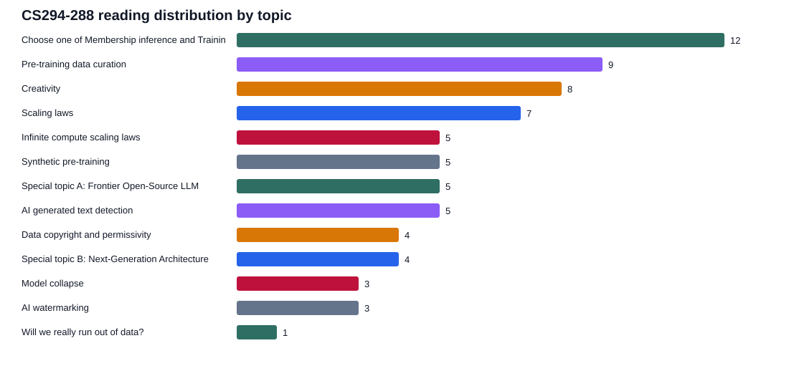
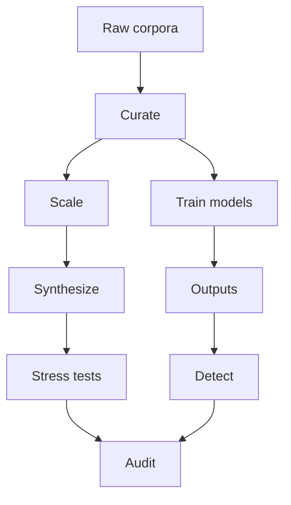

# How to Use This Book

This book is a paper companion for the Fall 2026 CS294-288 homepage reading list. Read it in three passes. First, use the Course Map to see the semester's argument: data curation and scaling laws set the base, synthetic data and collapse test how generated data behaves, provenance and permissivity determine what data can be used, open models and new architectures show what the data enables, and watermarking/detection/memorization ask what can be audited after training [1](#source-1) [2](#source-2) [31](#source-31) [65](#source-65).

Second, read the unit summaries as substitutes for a guided skim of each PDF. Each paper entry names the course role, the research question, the mechanism or evidence object, the main takeaway, and the caveat that matters for a data-centric LLM practitioner. Citations link to the public source; exact local artifacts and line refs are preserved after the bibliography in the Verification Appendix.

Third, use the cheat sheets and review questions as retrieval handles. The goal is not to memorize every result. It is to leave with a working model of how pretraining data is collected, filtered, generated, audited, legally constrained, detected, traced, and extracted.

# Course Map

The course is organized around a single pressure point: frontier LLM capability increasingly depends on data choices that are hard to observe directly. The first third of the course asks how web-scale data is built and how scaling laws change the value of tokens [2](#source-2) [10](#source-10). The middle asks whether synthetic data expands or corrupts that supply [25](#source-25) [27](#source-27). The final third asks whether provenance, detectors, tracing, membership inference, and extraction can make invisible training data visible after the fact [44](#source-44) [53](#source-53) [68](#source-68).

{width=95%}

| Course block | What to watch |
|---|---|
| Pre-training data curation | Filtering quality is inseparable from deduplication, contamination, domain mix, and benchmark choice. |
| Scaling laws | Compute-optimality changes when data is scarce, repeated, filtered, or routed through sparse experts. |
| Synthetic pre-training | Synthetic data can expand control and coverage, but generator bias and diversity loss become first-order risks. |
| Provenance and permissivity | Legal and consent constraints turn data access into an engineering constraint, not only a policy topic. |
| Detection and tracing | Post-hoc attribution methods are useful but fragile because outputs can be paraphrased, edited, or sampled from memorized tails. |

# Prerequisite Crash Course

Pretraining data is not a neutral pile of text. GPT-2 and GPT-3 made the practical case that broad web text plus scale unlocks task-general behavior, but they also made data documentation sparse relative to its importance [4](#source-4) [1](#source-1). T5 turned transfer into a controlled text-to-text study, showing why objective, data mixture, and task format matter when comparing language-modeling recipes [5](#source-5).

Scaling laws are the course's quantitative grammar. Kaplan-style laws describe smooth loss trends with parameter count, data, and compute, while Chinchilla reframes the optimum toward more data for a given compute budget [10](#source-10) [11](#source-11). Later readings complicate that picture: repeated data, filtered data, scarce data, over-training, and sparse experts all change what "more tokens" means [12](#source-12) [17](#source-17) [18](#source-18).

Curation has three recurring levers. Deduplication removes repeated text that can inflate benchmark contamination and memorization risk [6](#source-6). Quality filtering attempts to spend compute on tokens that improve downstream generalization [3](#source-3). Mixture design controls domain coverage, licensing, safety, and the long tail of skills [7](#source-7) [8](#source-8).

Synthetic data is both a data source and a feedback loop. Textbook-style synthetic corpora show that generated material can teach compact models, but model-collapse papers show that recursively training on generated samples can erase distributional tails unless real data or diversity controls remain in the loop [22](#source-22) [27](#source-27) [29](#source-29).

Auditing is the course's closing theme. Watermarks try to add a detectable signal at generation time [44](#source-44). Detectors infer generatedness from text statistics or classifier boundaries [47](#source-47). Tracing, membership inference, and extraction ask whether generated outputs can reveal the data a model saw during training [53](#source-53) [60](#source-60) [65](#source-65).

# Unit 1: Pre-training Data Curation

## Paper 01: Language Models are Few-Shot Learners

Course role: main reading. GPT-3 is the scaling baseline for the entire course: it argues that sufficiently large autoregressive language models can perform many tasks from instructions or a few in-context examples without gradient updates [1](#source-1). The data lesson is indirect but crucial: broad pretraining turns data mixture and scale into the substrate for apparent task generality.

Mechanism: train one very large decoder-only model on broad internet text, then evaluate it in zero-shot, one-shot, and few-shot prompting regimes. The paper's core move is to treat context as an adaptation interface rather than building task-specific fine-tuning sets. For this course, that makes pretraining data quality and diversity the hidden curriculum behind in-context behavior. [1](#source-1)

Takeaway: GPT-3 makes data-centric questions unavoidable. If capability comes from a huge unsupervised corpus, then source composition, contamination, memorization, and licensing become central technical variables. Caveat: the paper demonstrates scale-driven behavior more than it explains which documents or filters caused which abilities. [1](#source-1)

## Paper 02: DataComp-LM

Course role: main reading. DataComp-LM turns pretraining data curation into a benchmarkable experiment rather than a private recipe [2](#source-2). It provides a large Common Crawl-derived pool, standardized training recipes, and a broad evaluation suite so different filtering and selection strategies can be compared under controlled compute.

Mechanism: hold model/training conditions comparatively fixed and vary how the dataset is selected from a shared raw corpus. That lets the reader separate "better model" from "better data pipeline." The paper is especially important because it makes data curation falsifiable: a filter has to survive downstream evaluations, not just look clean to humans. [2](#source-2)

Takeaway: treat curation as an optimization problem over candidate documents, filtering signals, and evaluation targets. Caveat: a benchmark can still overfit its public evaluation suite; a filter that wins DataComp-LM may not be universally best for a different model scale, domain, or deployment risk. [2](#source-2)

## Paper 03: FineWeb

Course role: main reading. FineWeb is the practical recipe paper for turning Common Crawl into a competitive open pretraining corpus [3](#source-3). The course link points to a Hugging Face Space wrapper, so this run substituted the substantive arXiv FineWeb paper and recorded that substitution in the manifest.

Mechanism: collect many Common Crawl snapshots, apply language identification, quality filtering, deduplication, document cleaning, and ablation-based validation, then train models to test whether the resulting corpus improves downstream performance. FineWeb-Edu adds an educational-quality filter to create a smaller corpus targeted at knowledge and reasoning benchmarks. [3](#source-3)

Takeaway: data curation should be measured through model behavior, not only through document-level heuristics. Caveat: a curated open web corpus still inherits web coverage, language, licensing, and benchmark-contamination questions; the value is that those choices are documented and ablated. [3](#source-3)

## Paper 04: Language Models are Unsupervised Multitask Learners

Course role: additional reading. GPT-2 is the earlier demonstration that next-token prediction on broad web text can induce useful task behavior without task-specific supervised training [4](#source-4). It frames the web itself as a multitask dataset: translation, summarization, question answering, and commonsense patterns appear as natural text.

Mechanism: train a transformer language model on WebText and evaluate it across downstream tasks using natural-language prompts or contexts. The important data move is dataset construction from outbound Reddit links, a heuristic proxy for human-interest and quality. [4](#source-4)

Takeaway: dataset sourcing choices can substitute for some task annotation, but the proxy is socially and temporally contingent. Caveat: the paper predates today's scrutiny around consent, copyright, and benchmark contamination, so use it as a capability milestone rather than a modern data-governance template. [4](#source-4)

## Paper 05: T5

Course role: additional reading. T5 systematizes transfer learning by converting many NLP tasks into a text-to-text format and comparing objectives, architectures, pretraining data, and scaling choices [5](#source-5). It is a prerequisite because later data papers implicitly assume this style of controlled recipe comparison.

Mechanism: use the C4 corpus, train encoder-decoder models under different denoising and language-modeling objectives, and evaluate across many tasks. The text-to-text framing reduces task-format variation, making data and objective comparisons easier to interpret. [5](#source-5)

Takeaway: data curation is not separable from objective design. A corpus that works for one pretraining objective may not transfer equally under another. Caveat: T5's C4 cleaning decisions became influential, but many downstream users copied the dataset without always copying the paper's careful ablation mindset. [5](#source-5)

## Paper 06: Deduplicating Training Data Makes Language Models Better

Course role: additional reading. This paper makes deduplication a first-class training-data intervention [6](#source-6). It argues that near-duplicate examples are common in NLP corpora and can distort both training efficiency and evaluation reliability.

Mechanism: detect near duplicates in training and validation corpora, remove duplicates, and compare how language models behave when trained on cleaned versus uncleaned data. The course-relevant idea is that duplicate text can make a model look stronger while also increasing memorization and contamination risk. [6](#source-6)

Takeaway: deduplication is not housekeeping; it changes the empirical meaning of model performance. Caveat: aggressive deduplication can remove legitimate repeated formats, quotations, boilerplate, or domain-specific redundancy, so the deduplication threshold is itself a data policy. [6](#source-6)

## Paper 07: The Pile

Course role: additional reading. The Pile is a foundational open corpus assembled from many text domains, designed to support large-scale language-model training with better documentation than opaque web crawls [7](#source-7). It gives the course a baseline for mixture-based dataset design.

Mechanism: combine books, academic papers, code, web text, forums, legal material, and other sources into an 800GB corpus, then evaluate models trained on it across diverse benchmarks. The key mechanism is mixture composition: the corpus is not "the web" but a deliberate blend of domains. [7](#source-7)

Takeaway: open corpora can improve reproducibility and analysis, but mixture design creates value judgments about what language, expertise, and behavior should be represented. Caveat: The Pile also shows how hard it is to fully audit licensing, personal data, and quality at web scale. [7](#source-7)

## Paper 08: Dolma

Course role: additional reading. Dolma is an open pretraining corpus designed for transparency around sources, filters, and model-development recipes [8](#source-8). It extends the Pile-style agenda into the modern open-model era.

Mechanism: assemble trillions of tokens from web, code, academic, books, and other sources; document filtering and deduplication; and pair the corpus with OLMo-style reproducible model training. The course value is the coupling between dataset release and model recipe release. [8](#source-8)

Takeaway: data transparency is more useful when it includes the pipeline, not only the final text dump. Caveat: even transparent corpora can be too large for full human audit, so downstream users still need sampling, provenance metadata, and risk-specific filters. [8](#source-8)

## Paper 09: Nemotron-CC

Course role: additional reading. Nemotron-CC is a Common Crawl transformation pipeline aimed at producing a refined long-horizon pretraining dataset [9](#source-9). It represents the industrial version of web-corpus curation: many filters, large scale, and model-facing evaluation.

Mechanism: start from Common Crawl, clean and classify documents, filter low-quality content, deduplicate, and shape the corpus for long-context or long-horizon training needs. Its importance is the operational stack: crawl snapshots become model data through multiple irreversible gates. [9](#source-9)

Takeaway: curation pipelines should be read as model architecture's partner; a long-context model's behavior depends on whether the corpus actually contains coherent long documents. Caveat: refined crawl pipelines can hide exclusion decisions unless every filter and sampling step is documented. [9](#source-9)

# Unit 2: Scaling Laws

## Paper 10: Scaling Laws for Neural Language Models

Course role: prerequisite. Kaplan et al. provide the classic empirical scaling-law frame: loss changes predictably with model size, dataset size, and compute over broad ranges [10](#source-10). This gives the course its first quantitative way to ask how much data is "enough."

Mechanism: train many transformer language models while sweeping parameters, data, and compute, then fit power-law relationships. The result is a planning tool: for a given compute budget, estimate whether more parameters or more tokens should be prioritized. [10](#source-10)

Takeaway: smooth scaling makes LLM development look forecastable. Caveat: the original optimum underweighted data relative to later findings, and it treats data mostly as quantity, not as quality, provenance, or repeated exposure. [10](#source-10)

## Paper 11: Training Compute-Optimal Large Language Models

Course role: prerequisite. Chinchilla revises the compute-optimal recipe by showing that many large models were undertrained on too few tokens for their parameter counts [11](#source-11). For a data-centric course, this is the paper that turns token supply into the bottleneck.

Mechanism: compare model families under fixed compute and derive an optimum that scales model size and training tokens together more evenly. The practical implication is that a smaller model trained on more data can outperform a larger undertrained model at the same compute. [11](#source-11)

Takeaway: data quantity matters more than the early scaling-law consensus suggested. Caveat: "more tokens" only helps when the additional data is sufficiently diverse, high quality, and not merely repeated noise. [11](#source-11)

## Paper 12: Language models scale reliably with over-training and on downstream tasks

Course role: main reading. This paper asks whether scaling predictions remain reliable when models are trained beyond classical compute-optimal token budgets and evaluated beyond next-token loss [12](#source-12). It bridges scaling-law theory to real downstream use.

Mechanism: train or analyze models under over-training regimes, then compare loss trends with downstream benchmark behavior. The data-centric point is that extra tokens can continue to buy downstream gains even when a simplistic compute-optimal formula would suggest stopping. [12](#source-12)

Takeaway: compute optimality is not the same as product optimality. Caveat: downstream tasks are themselves limited probes, so over-training decisions should be tied to target capabilities, contamination checks, and serving economics. [12](#source-12)

## Paper 13: Scaling Laws for Fine-Grained Mixture of Experts

Course role: one-of reading. This paper moves scaling laws into sparse expert routing, where activated parameters and total parameters differ [13](#source-13). It matters because data allocation across experts becomes part of the scaling problem.

Mechanism: study fine-grained MoE models and fit laws that account for routing granularity, expert count, and compute. The central question is how sparse capacity changes the tradeoff between model size, tokens, and compute. [13](#source-13)

Takeaway: MoE scaling is not just dense scaling with a cheaper forward pass; routing determines which tokens train which capacity. Caveat: empirical laws can be brittle if routing imbalance, domain skew, or expert specialization changes across scales. [13](#source-13)

## Paper 14: Towards Greater Leverage

Course role: one-of reading. This paper studies scaling laws for efficient MoE language models, looking for leverage from sparse computation [14](#source-14). It is useful as a design comparison against dense Chinchilla-style planning.

Mechanism: vary MoE architecture and training settings, then measure how efficiently additional parameters and experts convert compute into loss reduction. The data angle is that experts may specialize on subsets of the data distribution, making mixture composition and routing diagnostics important. [14](#source-14)

Takeaway: sparse models can increase effective capacity, but only if routing and training data keep experts useful. Caveat: MoE efficiency claims should always specify equal-resource comparisons, inference costs, and failure modes from underused experts. [14](#source-14)

## Paper 15: Mixture-of-Experts Can Surpass Dense LLMs Under Strictly Equal Resource

Course role: one-of reading. This paper asks a clean comparison question: can MoE outperform dense models when resource accounting is strict [15](#source-15)? That makes it a useful antidote to vague sparse-model efficiency claims.

Mechanism: compare dense and MoE models under matched compute or resource constraints, then evaluate whether sparse routing still wins. For the course, the key is that data and routing interact: equal compute does not imply equal token exposure per parameter. [15](#source-15)

Takeaway: MoE can be a genuine scaling lever, but the comparison has to include training, inference, and utilization details. Caveat: equal-resource experiments may still depend on implementation choices that do not transfer across hardware or serving regimes. [15](#source-15)

## Paper 16: Slicing and Dicing

Course role: one-of reading. This paper treats MoE configuration as an optimization space rather than a single architectural trick [16](#source-16). It asks how expert count, granularity, routing, and compute budget should be configured together.

Mechanism: analyze many MoE configurations and map how architectural slices affect performance. The course-relevant lesson is that data distribution and expert allocation are coupled: a routing architecture is partly a data partitioning machine. [16](#source-16)

Takeaway: optimal sparse models require joint design of model, data, and training budget. Caveat: configuration search can become benchmark-specific; the winning configuration for a public suite may not be robust under domain shift or long-tail data. [16](#source-16)

# Unit 3: Infinite Compute and Data Scarcity

## Paper 17: Scaling Data-Constrained Language Models

Course role: prerequisite. This paper studies the regime where high-quality human-generated data is limited and repeated data becomes unavoidable [17](#source-17). It reframes scaling from "how much data should we use" to "what happens when the good data runs out."

Mechanism: model performance under repeated tokens, limited unique data, and different compute allocations. The core issue is whether repeated epochs over finite data substitute for new data or mainly increase overfitting and memorization. [17](#source-17)

Takeaway: data scarcity changes the scaling optimum and makes corpus uniqueness a resource. Caveat: the answer depends on what counts as unique or high quality; deduplicated web text, books, code, and domain data have different scarcity profiles. [17](#source-17)

## Paper 18: Scaling Laws for Data Filtering

Course role: prerequisite. This paper argues that data curation cannot be compute agnostic [18](#source-18). A filter that is optimal for one compute budget may throw away useful data for another budget.

Mechanism: evaluate data-filtering strategies across scales and show how the tradeoff between quality and quantity shifts as compute changes. The important move is to treat filtering thresholds as scale-dependent hyperparameters. [18](#source-18)

Takeaway: "keep only the best data" is not a universal recipe. Caveat: quality scores can encode the evaluator's biases, so scale-aware filtering still needs domain, language, and safety audits. [18](#source-18)

## Paper 19: Pre-training under infinite compute

Course role: main reading. This reading pushes scaling-law reasoning toward an asymptotic question: if compute were no longer the binding constraint, what kind of data remains valuable [19](#source-19)? It clarifies why data diversity and irreducible information matter.

Mechanism: analyze pretraining when the model can revisit or exhaust available corpora, then ask how additional data sources, filtering, and synthetic generation affect the frontier. The course role is conceptual: infinite compute exposes finite data as the actual bottleneck. [19](#source-19)

Takeaway: the long-run value of a corpus is not just its average quality but its marginal novelty. Caveat: "infinite compute" is a thought experiment; practical decisions still face energy, hardware, latency, and opportunity costs. [19](#source-19)

## Paper 20: A Bitter Lesson for Data Filtering

Course role: main reading. This paper challenges the intuition that smarter data filtering always beats scale [20](#source-20). The title echoes the broader bitter lesson: general methods that exploit compute can dominate hand-designed heuristics.

Mechanism: test filtering strategies under scaling conditions where throwing away data may reduce diversity or long-tail coverage. The paper is useful because it asks whether curation can overfit to short-term benchmarks while harming broad capability. [20](#source-20)

Takeaway: filtering is powerful but dangerous when it collapses the data distribution too aggressively. Caveat: this does not mean "use everything"; it means filters need scale-aware ablations and out-of-distribution checks. [20](#source-20)

## Paper 21: Synthetic bootstrapped pretraining

Course role: additional reading. This paper explores whether generated data can bootstrap pretraining when natural data is scarce or expensive [21](#source-21). It sits between scaling laws and the later synthetic-data unit.

Mechanism: use models or procedures to create synthetic pretraining text, then train subsequent models on the expanded corpus. The key question is whether generated samples add useful coverage or merely recirculate the generator's biases. [21](#source-21)

Takeaway: bootstrapping is attractive because it turns model capability into a data-production process. Caveat: without diversity controls and real-data anchoring, bootstrapping can accelerate collapse, contamination, or benchmark overfitting. [21](#source-21)

# Unit 4: Synthetic Pre-training

## Paper 22: Textbooks are all you need

Course role: prerequisite. This paper made synthetic textbook-style data a mainstream pretraining idea by showing that small code models can be surprisingly strong when trained on carefully generated educational material [22](#source-22). It is a data-quality argument, not just a small-model result.

Mechanism: generate or curate textbook-like code and reasoning examples, then train compact models on that high-density curriculum. The core hypothesis is that examples written to teach can be more sample-efficient than raw web code. [22](#source-22)

Takeaway: synthetic data can concentrate useful structure. Caveat: the approach depends heavily on generator quality, prompt design, and benchmark alignment; it may not cover messy real-world distributions. [22](#source-22)

## Paper 23: Cosmopedia

Course role: prerequisite. Cosmopedia is the open synthetic-data engineering companion to the textbook-data idea [23](#source-23). It documents how to create billions of tokens of synthetic educational content using prompt curation, web-derived topics, clustering, and large-scale generation.

Mechanism: build millions of prompts from curated educational sources and web clusters, generate synthetic textbooks and related formats with Mixtral, decontaminate benchmarks, and train a 1B model to test utility. The value is not only the dataset but the disclosed pipeline. [23](#source-23)

Takeaway: synthetic pretraining data is a production system: topic mining, prompt diversity, generation throughput, deduplication, contamination checks, and model evaluation all matter. Caveat: generated facts can be wrong, so synthetic corpora need retrieval, validation, or domain-specific checking. [23](#source-23)

## Paper 24: Synthetic pretraining

Course role: prerequisite. This blog-style reading gives a broader conceptual frame for synthetic pretraining [24](#source-24). It asks when generated data should be treated as curriculum, augmentation, compression, or contamination.

Mechanism: compare the motivations for using synthetic text before supervised instruction tuning: coverage of rare skills, controllable format, privacy or licensing constraints, and curriculum density. For the course, it is a vocabulary bridge between textbook data and web rephrasing. [24](#source-24)

Takeaway: synthetic data is useful when it changes the training distribution in a controlled way. Caveat: control can become over-control; a synthetic corpus may look clean while losing real-world messiness. [24](#source-24)

## Paper 25: Rephrasing the Web

Course role: main reading. This paper proposes rephrasing web text as a compute- and data-efficient pretraining recipe [25](#source-25). Instead of inventing all content from scratch, it uses existing web documents as semantic seeds.

Mechanism: transform or rewrite web data to improve clarity, density, or model-facing utility, then train and evaluate models on the rewritten corpus. The data-centric idea is that generation can be a cleaning operator, not only a source of new facts. [25](#source-25)

Takeaway: rephrasing may preserve web coverage while reducing noise and increasing learnability. Caveat: rephrasing can also erase provenance, authorial style, rare wording, and legal distinctions between original and derivative data. [25](#source-25)

## Paper 26: BeyondWeb

Course role: main reading. BeyondWeb studies synthetic data at trillion-token scale, asking what changes when generated corpora become large enough to compete with natural web data [26](#source-26). It is the scale-up counterpart to Cosmopedia and Rephrasing the Web.

Mechanism: generate and evaluate large synthetic pretraining corpora, analyze scaling behavior, and compare against web-derived baselines. The course value is the operational evidence: synthetic data has to survive trillion-token economics, not just small ablations. [26](#source-26)

Takeaway: synthetic data can be a serious pretraining source, but scale magnifies generator bias, diversity, cost, and evaluation contamination. Caveat: results depend on the generator and prompt distribution; a future generator may change the optimum. [26](#source-26)

# Unit 5: Model Collapse

## Paper 27: The Curse of Recursion

Course role: main reading. This paper provides the canonical warning that recursively training on model-generated data can make models forget the original distribution [27](#source-27). It is the failure-mode anchor for the synthetic-data unit.

Mechanism: analyze training loops where generated samples feed future models, showing how approximation errors and distributional narrowing accumulate. The core idea is that generated data often underrepresents tails, so recursion amplifies the missing mass. [27](#source-27)

Takeaway: synthetic data needs anchoring, diversity, and real-data refresh. Caveat: collapse is not inevitable in every setup; the severity depends on sampling, filtering, model quality, and how much real data remains. [27](#source-27)

## Paper 28: The Curious Decline of Linguistic Diversity

Course role: main reading. This paper studies how training on synthetic text affects linguistic diversity [28](#source-28). It turns collapse from an abstract distributional concern into observable changes in language variety.

Mechanism: measure diversity, lexical richness, and distributional properties when models consume generated text. The course-relevant point is that quality metrics can miss diversity loss if they focus only on average benchmark scores. [28](#source-28)

Takeaway: data quality must include variance and tail coverage, not just cleanliness. Caveat: diversity metrics are proxies; the operational question is which forms of diversity matter for downstream reasoning, creativity, and robustness. [28](#source-28)

## Paper 29: Is Model Collapse Inevitable?

Course role: main reading. This paper asks whether collapse can be avoided by accumulating real and synthetic data rather than replacing the real distribution [29](#source-29). It is the constructive counterpart to the curse-of-recursion warning.

Mechanism: analyze mixtures of real and generated data across recursive training cycles. The key hypothesis is that retaining or adding real samples can stabilize the distribution and prevent generated data from dominating the tails. [29](#source-29)

Takeaway: synthetic data policy should specify mixture schedules, not just generation methods. Caveat: "real" data can still be contaminated by prior model outputs as the internet changes, so future real/synthetic boundaries may be hard to verify. [29](#source-29)

# Unit 6: Copyright, Consent, and Data Supply

## Paper 30: Foundation Models and Fair Use

Course role: main reading. This legal analysis frames foundation-model training as a fair-use question and explains why data access cannot be separated from copyright doctrine [30](#source-30). It gives technical readers the legal vocabulary behind training-data disputes.

Mechanism: analyze transformative use, market substitution, copying, and public-interest arguments as they apply to model training. For the course, the important lesson is that legal evaluation depends on what the model does with data and how outputs affect original works. [30](#source-30)

Takeaway: data permissivity is a design constraint. Caveat: legal standards are jurisdiction-specific and unresolved; engineering teams should not treat fair-use arguments as deterministic permissions. [30](#source-30)

## Paper 31: Consent in Crisis

Course role: main reading. This paper documents a rapid decline in openly available or permissive data for AI training [31](#source-31). It turns consent from an abstract value into a measurable change in the data ecosystem.

Mechanism: track website policies, robots exclusions, terms, and other access signals over time to estimate how the AI data commons is shrinking. The paper matters because scaling laws assume data supply, while consent dynamics can reduce it. [31](#source-31)

Takeaway: future LLM training may face scarcity from governance, not only from natural text limits. Caveat: access signals do not fully encode copyright, consent, or enforceability, and crawlers may still behave differently from stated policy. [31](#source-31)

## Paper 32: The Common Pile v0.1

Course role: main reading. The Common Pile attempts to build a large public-domain and openly licensed corpus [32](#source-32). It is a constructive response to permissivity concerns.

Mechanism: assemble text sources whose legal status is clearer, document licenses, and evaluate whether a permissive corpus can support useful model training. The course-relevant point is that legal cleanliness and data scale are in tension. [32](#source-32)

Takeaway: open and public-domain corpora can reduce legal risk but require careful provenance tracking. Caveat: permissive data may differ in domain mix, freshness, and style from the broader web, affecting model behavior. [32](#source-32)

## Paper 33: SILO Language Models

Course role: additional reading. SILO proposes isolating legal risk in a nonparametric datastore rather than placing all knowledge into model weights [33](#source-33). It is a systems idea for separating model training from retrieval-time data use.

Mechanism: train or use language models with retrieval over controlled stores, so some risky or licensed content can remain outside parameters and be governed separately. The data-centric insight is that architecture can encode legal boundaries. [33](#source-33)

Takeaway: not all data has to be absorbed into pretraining. Caveat: retrieval systems still face access, attribution, privacy, and leakage risks; moving data outside weights does not remove governance obligations. [33](#source-33)

## Paper 34: Will we run out of data?

Course role: main reading. This paper estimates limits on human-generated text supply for LLM scaling [34](#source-34). It is the natural-resource version of the course's data-scarcity question.

Mechanism: compare projected token needs from scaling laws with estimates of available high-quality human text. The analysis asks when frontier training might exhaust useful data absent new sources, synthetic generation, or repeated epochs. [34](#source-34)

Takeaway: data supply can become a binding constraint even before compute does. Caveat: estimates depend on what counts as high quality, whether private/licensed data is available, and whether synthetic or multimodal data changes the accounting. [34](#source-34)

# Unit 7: Frontier Open-Source LLMs

## Paper 35: The Llama 3 Herd of Models

Course role: main reading. The Llama 3 report documents a modern open-weight model family and its training stack [35](#source-35). It is valuable because it discloses enough about data, post-training, safety, and evaluation to connect course themes to a frontier-scale system.

Mechanism: train large decoder models on massive curated corpora, then apply instruction tuning, preference optimization, safety mitigations, and multilingual/code/math evaluation. The data lesson is that pretraining mixture, filtering, and post-training data all interact. [35](#source-35)

Takeaway: open model reports are data-governance artifacts as much as model cards. Caveat: even detailed reports summarize data pipelines at a high level; they do not provide full document-level provenance. [35](#source-35)

## Paper 36: DeepSeek-V3 Technical Report

Course role: main reading. DeepSeek-V3 describes a high-performing open model with efficiency-oriented architecture and training choices [36](#source-36). It helps readers connect data-centric thinking with cost-constrained frontier training.

Mechanism: combine a large-scale training corpus, efficient MoE-style architecture, and post-training procedures to produce strong reasoning and coding performance. For this course, the interest is how architecture and training data jointly reduce cost. [36](#source-36)

Takeaway: data and compute efficiency are co-designed in modern open models. Caveat: technical reports often provide aggregate data descriptions rather than auditable source inventories. [36](#source-36)

## Paper 37: DeepSeek-R1

Course role: main reading. DeepSeek-R1 focuses on reasoning capability induced through reinforcement learning and related post-training [37](#source-37). It broadens the course from pretraining data into how training signals shape reasoning behavior.

Mechanism: use reinforcement learning and distillation-style recipes to elicit chain-of-thought-like reasoning and improve math/code tasks. The data-centric angle is that reward data, prompts, and distilled traces become training data with their own biases. [37](#source-37)

Takeaway: reasoning improvements are not purely architectural; they are also data and feedback-pipeline products. Caveat: reasoning traces can be optimized for benchmark behavior and may not reflect faithful internal reasoning. [37](#source-37)

## Paper 38: GLM-5

Course role: main reading. GLM-5 is framed around agentic engineering and coding-oriented behavior [38](#source-38). It is useful for seeing how model training targets shift toward tool use, code tasks, and software workflows.

Mechanism: combine broad pretraining with specialized data and evaluations for coding, agentic tasks, and interactive engineering. The course tie-in is that "agentic" ability depends on curated trajectories, repositories, tool examples, and feedback data. [38](#source-38)

Takeaway: future internet data may include interaction traces, tool calls, and code-edit histories, not only static documents. Caveat: those traces raise privacy, consent, and benchmark leakage questions more sharply than static web text. [38](#source-38)

## Paper 39: DeepSeek-V4 Technical Report

Course role: main reading, degraded. The course homepage links to a Hugging Face PDF path for DeepSeek-V4, but the path returned HTTP 404 during this run [39](#source-39). No substantive PDF was available locally, so this book does not summarize the model's method or results.

Mechanism: unavailable. The local artifact records the original URL, the normalized Hugging Face `resolve` URL, and the 404 result. Treat this as a syllabus placeholder rather than a verified source. [39](#source-39)

Takeaway: the course list appears to anticipate a future or moved technical report. Caveat: do not infer architecture, training data, or performance from the title until a working public PDF is supplied. [39](#source-39)

# Unit 8: Next-Generation Architecture

## Paper 40: Memory Layers at Scale

Course role: main reading. This paper studies memory layers as a way to add large factual or associative capacity without making every token attend to every parameter [40](#source-40). It connects data storage to architecture.

Mechanism: augment transformer models with memory layers that store and retrieve learned representations at scale. The course-relevant question is whether some knowledge should be represented as lookup-like memory rather than dense parametric compression. [40](#source-40)

Takeaway: memory mechanisms blur the line between pretraining data, parameters, and retrieval. Caveat: memory layers need careful analysis of update behavior, privacy leakage, and whether stored facts can be audited or deleted. [40](#source-40)

## Paper 41: Conditional Memory via Scalable Lookup

Course role: main reading. This paper proposes conditional memory as a new sparsity axis for large language models [41](#source-41). It is a direct architectural response to the cost of dense capacity.

Mechanism: use scalable lookup to activate memory conditionally, letting the model access additional stored information when relevant. The data-centric point is that retrieval conditions determine which training examples influence which outputs. [41](#source-41)

Takeaway: conditional memory can make capacity more selective and potentially more inspectable. Caveat: lookup systems introduce failure modes around stale memory, adversarial retrieval, and uneven coverage of rare domains. [41](#source-41)

## Paper 42: DeltaFormer

Course role: main reading, degraded. The course links to an OpenReview page for DeltaFormer, but OpenReview required challenge verification and returned access errors in this environment [42](#source-42). The local artifact preserves that failure page, not the paper.

Mechanism: unavailable from the local artifact. The title suggests a state-space or transformer-state mechanism, but this book does not treat that as verified evidence. [42](#source-42)

Takeaway: this source needs manual browser access or an alternate PDF before it can be used as a real course note. Caveat: summaries elsewhere should not cite this run as proof of DeltaFormer's claims. [42](#source-42)

## Paper 43: MSA

Course role: main reading. MSA studies memory sparse attention for efficient end-to-end memory scaling to very long contexts [43](#source-43). It belongs in the architecture unit because it treats attention memory as the bottleneck.

Mechanism: introduce sparse attention or memory mechanisms intended to support extremely long token contexts without dense quadratic cost. For data-centric LLMs, long context changes what training examples and retrieval traces the model can condition on. [43](#source-43)

Takeaway: architecture can expand usable data at inference time, not only during pretraining. Caveat: long-context claims need task-specific evaluation; a model can accept many tokens without using them reliably. [43](#source-43)

# Unit 9: AI Watermarking

## Paper 44: A Watermark for Large Language Models

Course role: main reading. This paper proposes embedding a statistical signal into generated text so outputs can later be detected as model-generated [44](#source-44). It is the baseline watermarking mechanism for the course.

Mechanism: bias token sampling toward a secret greenlist while preserving fluency, then detect the bias statistically in generated text. The data-centric insight is that provenance can be encoded at generation time rather than inferred afterward. [44](#source-44)

Takeaway: watermarking is attractive because it is source-aware and testable. Caveat: it depends on access to the generator, sampling assumptions, sufficient text length, and robustness against paraphrase or editing. [44](#source-44)

## Paper 45: Robust Distortion-free Watermarks

Course role: main reading. This paper seeks watermarking schemes that are robust while preserving the output distribution more carefully [45](#source-45). It responds to concerns that a watermark may degrade text quality or be easy to remove.

Mechanism: design watermark signals with distortion-free or low-distortion properties and evaluate detectability under attacks. The course value is the tradeoff triangle: detectability, output fidelity, and robustness. [45](#source-45)

Takeaway: provenance signals need formal distributional guarantees, not only empirical detector accuracy. Caveat: real deployment faces adaptive attackers, model diversity, and policy questions about who controls the watermark key. [45](#source-45)

## Paper 46: AI Watermarking: Why Big Tech is Betting on AI Provenance, and Losing

Course role: additional reading. This article critiques watermarking as a practical provenance strategy [46](#source-46). It provides an industry-facing counterweight to the technical watermark papers.

Mechanism: review why watermark signals can be stripped, bypassed, or made irrelevant by open models and editing workflows. The useful course role is to connect formal watermarking to deployment incentives. [46](#source-46)

Takeaway: watermarking is not a complete provenance solution. Caveat: critique pieces can understate narrow use cases where watermarks still help, such as controlled platforms or high-volume detection. [46](#source-46)

# Unit 10: AI-Generated Text Detection

## Paper 47: Artificial Writing and Automated Detection

Course role: main reading. This paper studies automated detection of AI-written text in economically or socially relevant writing settings [47](#source-47). It introduces detection as an empirical measurement problem rather than a moral panic.

Mechanism: build or evaluate detectors against human and generated writing, then analyze error rates and robustness. The course connection is that detectors are post-hoc data classifiers trained on evolving model-output distributions. [47](#source-47)

Takeaway: detection accuracy is context-dependent and can decay as models and editing habits change. Caveat: false positives and domain shifts make detector outputs risky as individual-level evidence. [47](#source-47)

## Paper 48: EditLens

Course role: main reading. EditLens quantifies the extent of AI editing in text rather than reducing the question to generated versus human [48](#source-48). That is a better match for real writing workflows.

Mechanism: estimate how much text has been edited or transformed with AI assistance, likely using linguistic and model-based signals. The important conceptual move is to treat AI involvement as a spectrum. [48](#source-48)

Takeaway: provenance tools should measure degrees and types of intervention. Caveat: partial editing is hard to ground because human revision and model paraphrase can converge stylistically. [48](#source-48)

## Paper 49: People who frequently use ChatGPT for writing tasks are accurate and robust detectors of AI-generated text

Course role: main reading. This paper asks whether humans with heavy ChatGPT writing experience can detect AI-generated text better than others [49](#source-49). It broadens detection beyond automated classifiers.

Mechanism: compare human judgments across participants with different exposure levels and text conditions. The course relevance is that detection skill may be learned from interaction with model outputs. [49](#source-49)

Takeaway: human familiarity can be a signal, but it is not a scalable audit system. Caveat: participant populations, text domains, and model versions can strongly affect the result. [49](#source-49)

## Paper 50: Technical Report on the Pangram AI-Generated Text Classifier

Course role: main reading. This technical report documents a deployed classifier for AI-generated text [50](#source-50). It is useful because it exposes practical detector evaluation and product assumptions.

Mechanism: train a classifier on human and AI-generated corpora, evaluate it across domains, and report calibration or robustness properties. The data-centric question is what training distribution makes detector claims credible. [50](#source-50)

Takeaway: detector reports should disclose training sources, model coverage, thresholds, and false-positive tradeoffs. Caveat: detectors can become obsolete quickly as generation and editing methods change. [50](#source-50)

## Paper 51: Quantifying large language model usage in scientific papers

Course role: main reading. This Nature Human Behaviour article estimates LLM usage in scientific writing [51](#source-51). It is a measurement paper about AI traces in a high-stakes publication ecosystem.

Mechanism: analyze scientific-paper text for linguistic markers or model-associated shifts, then infer aggregate usage trends. The course value is methodological: detecting generated text at corpus level is easier and safer than accusing individual documents. [51](#source-51)

Takeaway: post-hoc measurement can reveal ecosystem-level changes in writing practices. Caveat: aggregate linguistic signals can be confounded by editorial norms, non-native writing support, discipline mix, and changing model styles. [51](#source-51)

# Unit 11: Creativity, Attribution, and Novelty

## Paper 52: Infini-gram

Course role: main reading. Infini-gram scales n-gram language modeling to a trillion tokens, offering a retrieval-like lens on exact and near-exact textual continuation [52](#source-52). It is useful for separating novelty from corpus recurrence.

Mechanism: build a massive n-gram index over very large text and query it to estimate continuation statistics without training a neural model. The course role is to show that simple corpus lookup remains powerful at web scale. [52](#source-52)

Takeaway: some "model creativity" can be audited by checking whether text patterns already exist in training-scale corpora. Caveat: n-gram lookup misses semantic paraphrase and higher-level idea reuse. [52](#source-52)

## Paper 53: OLMoTrace

Course role: main reading. OLMoTrace traces language-model outputs back to training tokens at massive scale [53](#source-53). It is a core provenance reading because it connects generation to source evidence.

Mechanism: index the training corpus and provide tools for matching model outputs to source text spans. The course-relevant mechanism is attribution by corpus search, not model introspection. [53](#source-53)

Takeaway: open training data enables concrete tracing tools that closed corpora cannot support. Caveat: tracing exact spans does not prove causal influence, and paraphrases or distributed facts can evade exact attribution. [53](#source-53)

## Paper 54: RAVEN

Course role: main reading. RAVEN evaluates linguistic novelty in text generation by comparing generated outputs against training-like corpora [54](#source-54). It gives a metric-oriented view of copying and originality.

Mechanism: measure overlap, novelty, or attribution patterns between generated text and source corpora. The course connection is that creativity can be operationalized as distance from observed text, but only through chosen metrics. [54](#source-54)

Takeaway: novelty metrics can audit copying risk and creative variation. Caveat: low n-gram overlap does not necessarily mean conceptual originality, and high overlap can be legitimate quotation or formulaic language. [54](#source-54)

## Paper 55: AI as Humanity's Salieri

Course role: main reading. This paper quantifies linguistic creativity of model text by systematic attribution against web text [55](#source-55). It asks whether LLM outputs recombine existing language in detectable ways.

Mechanism: compare generated text with web-scale references and measure attribution patterns or creative distance. The paper matters because it treats creativity as an empirical relation to the data ecosystem. [55](#source-55)

Takeaway: creativity claims should be grounded in source comparison, not vibes. Caveat: linguistic novelty is only one dimension of creativity; usefulness, intent, and cultural context are not captured by attribution metrics alone. [55](#source-55)

## Paper 56: Can Good Writing Be Generative?

Course role: main reading. This paper studies whether fine-tuning on high-quality books can produce expert-level AI writing [56](#source-56). It ties creative output quality directly to curated copyrighted or high-quality text.

Mechanism: fine-tune or train models on selected book corpora, then evaluate writing quality with human or model-assisted judgments. The data-centric question is whether premium writing data transfers into model style and preference. [56](#source-56)

Takeaway: data quality can show up as voice, coherence, and reader preference, not only benchmark accuracy. Caveat: book-trained writing raises copyright, consent, and market-substitution concerns. [56](#source-56)

## Paper 57: Readers Prefer Outputs of AI Trained on Copyrighted Books over Expert Human Writers

Course role: main reading. This paper makes a provocative empirical claim about reader preference for outputs from models trained on copyrighted books [57](#source-57). It sharpens the legal and ethical stakes of high-quality creative data.

Mechanism: compare reader judgments across AI outputs and expert human writing under controlled conditions. For the course, the central issue is data advantage: copyrighted corpora may materially affect perceived output quality. [57](#source-57)

Takeaway: training-data rights are not peripheral if protected works improve outputs in the market for writing. Caveat: preference experiments depend on task framing, participant pool, and the exact model/data comparison. [57](#source-57)

## Paper 58: Death of the Novel(ty)

Course role: main reading. This paper critiques n-gram novelty as a sufficient metric for textual creativity [58](#source-58). It is a useful correction after Infini-gram and RAVEN.

Mechanism: analyze cases where n-gram measures miss deeper reuse or overstate copying, then propose broader novelty criteria. The course lesson is that operational metrics shape what auditors can see. [58](#source-58)

Takeaway: novelty requires multiple lenses: exact overlap, semantic similarity, structure, source attribution, and human judgment. Caveat: richer metrics are harder to scale and can introduce subjective thresholds. [58](#source-58)

## Paper 59: Measuring AI "Slop" in Text

Course role: main reading. This paper studies measurable properties of low-quality or formulaic AI-generated text [59](#source-59). It connects creativity, detection, and ecosystem degradation.

Mechanism: define signals for repetitive, generic, or low-information generated content, then measure them across text corpora. The data-centric concern is feedback: if low-quality generated text enters the web, it becomes future pretraining data. [59](#source-59)

Takeaway: internet data quality is dynamic; models can pollute their own future data supply. Caveat: "slop" is a loaded category, so metrics need transparent definitions and domain-specific calibration. [59](#source-59)

# Unit 12: Membership Inference and Training Data Extraction

## Paper 60: Detecting Pretraining Data from Large Language Models

Course role: prerequisite. This paper studies whether one can infer if data was present in a model's pretraining corpus [60](#source-60). It introduces membership-style auditing for large generative models.

Mechanism: query the model and compare likelihoods, completions, or other signals for candidate texts. The course relevance is direct: if training data is hidden, auditors look for behavioral traces. [60](#source-60)

Takeaway: model outputs can leak evidence about training data, but the evidence is probabilistic. Caveat: distributional similarity, memorization, and calibration errors can make membership claims fragile. [60](#source-60)

## Paper 61: Do Membership Inference Attacks Work on Large Language Models?

Course role: prerequisite. This paper evaluates whether membership inference attacks actually work reliably for LLMs [61](#source-61). It is a skepticism reading for audit claims.

Mechanism: test attack methods under controlled conditions where membership is known, then measure error and calibration. The key question is whether attacks distinguish training membership from naturally likely text. [61](#source-61)

Takeaway: membership inference is harder than it may look from small models or classification settings. Caveat: negative results for one setup do not rule out attacks on overfit models, rare texts, or exposed likelihood APIs. [61](#source-61)

## Paper 62: LLM Dataset Inference

Course role: prerequisite. This paper asks a dataset-level question: did you train on my dataset [62](#source-62)? That is often more actionable than proving membership of a single example.

Mechanism: aggregate evidence across many examples from a candidate dataset, using model behavior to infer whether the dataset was likely included. The data-centric move is from item-level accusation to corpus-level statistical signal. [62](#source-62)

Takeaway: dataset-level inference can be more stable than single-record membership. Caveat: overlapping distributions, benchmark contamination, and public derivative datasets can confound attribution. [62](#source-62)

## Paper 63: Reassessing EMNLP 2024's Best Paper

Course role: main reading. This blog-style reassessment examines whether divergence-based calibration for membership inference holds up [63](#source-63). It is included because it models adversarial scrutiny of a high-profile audit method.

Mechanism: revisit assumptions, reproduce or challenge calibration choices, and test whether the claimed inference signal survives alternate analysis. The course value is methodological humility. [63](#source-63)

Takeaway: membership-inference claims require careful baselines and calibration. Caveat: a critique of one method is not a proof that all membership inference is impossible. [63](#source-63)

## Paper 64: Membership Inference Attacks Cannot Prove that a Model Was Trained On Your Data

Course role: main reading. This paper argues that membership inference attacks cannot provide definitive proof that a model trained on a specific dataset [64](#source-64). It is the strongest caution in the membership unit.

Mechanism: analyze ambiguity between training membership and distributional similarity, showing why observed behavior can have multiple explanations. The legal and scientific implication is that probabilistic evidence must be framed carefully. [64](#source-64)

Takeaway: membership inference is an audit signal, not a courtroom-grade proof by itself. Caveat: weak proof does not mean no privacy risk; it means claims need uncertainty, controls, and supporting evidence. [64](#source-64)

## Paper 65: Extracting Training Data from Large Language Models

Course role: prerequisite. This classic extraction paper demonstrates that language models can emit memorized training examples under certain prompts and sampling procedures [65](#source-65). It grounds the extraction half of the unit.

Mechanism: generate many completions from a model, search for high-likelihood or unusual text, and match outputs back to training data. The course lesson is that memorization is an observable behavior, not just an internal risk. [65](#source-65)

Takeaway: rare or repeated data can leak through generation. Caveat: extraction depends on access, sampling budget, model size, deduplication, and whether matching data is available for verification. [65](#source-65)

## Paper 66: Language Models May Verbatim Complete Text They Were Not Explicitly Trained On

Course role: main reading. This paper complicates extraction by showing that verbatim completion can occur even when the exact text was not explicitly in training data [66](#source-66). It attacks a common inference shortcut.

Mechanism: test completions against held-out or non-trained texts and analyze why models can reproduce plausible continuations from distributional regularities or adjacent data. The data-centric point is that output overlap is not automatically membership proof. [66](#source-66)

Takeaway: verbatim generation and training membership are related but not identical. Caveat: the result should temper proof claims, not dismiss memorization risks for texts that truly were present. [66](#source-66)

## Paper 67: Extracting memorized pieces of copyrighted books from open-weight language models

Course role: main reading. This paper studies extraction of memorized book passages from open-weight models [67](#source-67). It connects technical leakage directly to copyright and creative-data concerns.

Mechanism: use open model access to search for prompts and continuations that elicit memorized book text, then match outputs against copyrighted sources. The importance is that open weights can enable more intensive extraction than black-box APIs. [67](#source-67)

Takeaway: open models shift the audit and abuse surface: they help researchers verify memorization, but they also give attackers more leverage. Caveat: extraction success depends on prompt search, model family, corpus overlap, and matching databases. [67](#source-67)

## Paper 68: Extracting books from production language models

Course role: main reading. This paper asks whether production models can be induced to reveal book-length or book-derived memorized content [68](#source-68). It is the black-box counterpart to open-weight extraction.

Mechanism: query deployed models with prompts designed to trigger memorized sequences, then verify outputs against books or other copyrighted sources. The course point is that safety layers and API controls become part of data governance. [68](#source-68)

Takeaway: production systems can leak training data even when weights are closed. Caveat: black-box extraction evidence is shaped by refusal policies, rate limits, prompt filters, and incomplete source matching. [68](#source-68)

## Paper 69: Measuring memorization in language models via probabilistic extraction

Course role: main reading. This paper proposes probabilistic extraction as a measurement framework for memorization [69](#source-69). It tries to move beyond anecdotal extracted snippets.

Mechanism: define extraction probabilities or sampling procedures that estimate how likely a model is to emit memorized text under certain conditions. The value is a more quantitative way to compare models and datasets. [69](#source-69)

Takeaway: memorization should be measured as a distributional risk, not a binary property. Caveat: any probability estimate depends on the prompting distribution and available verification corpus. [69](#source-69)

## Paper 70: Recite, Reconstruct, Recollect

Course role: additional reading. This paper frames memorization as multifaceted rather than a single phenomenon [70](#source-70). It helps organize the extraction unit's many failure modes.

Mechanism: distinguish forms such as exact recitation, partial reconstruction, and semantic recollection, then relate them to evaluation methods. The course value is taxonomy: different risks require different tests. [70](#source-70)

Takeaway: a model can memorize facts, phrases, structures, or whole passages in different ways. Caveat: taxonomy does not solve measurement; each category still needs operational thresholds. [70](#source-70)

## Paper 71: Alignment Whack-a-Mole

Course role: additional reading. This paper argues that fine-tuning can activate verbatim recall of copyrighted books [71](#source-71). It connects alignment/post-training to latent memorization.

Mechanism: compare model behavior before and after fine-tuning or alignment changes, looking for increased recall of protected text. The key idea is that safety or capability tuning can reveal memorized content that was previously dormant. [71](#source-71)

Takeaway: memorization risk is not fixed at pretraining time; post-training can change what is accessible. Caveat: the effect may depend on fine-tuning data, prompts, model family, and the memorization already present in the base model. [71](#source-71)

# Study Checkpoints by Paper

## Checkpoint 01: Language Models are Few-Shot Learners

- Inspect how task demonstrations are placed in the context window, because the course's later data questions inherit GPT-3's claim that pretraining can make context act like adaptation data [1](#source-1).
- Compare the paper's broad web-scale pretraining story with DataComp-LM and FineWeb, where the hidden data mixture becomes an explicit experimental object rather than background infrastructure [1](#source-1) [2](#source-2) [3](#source-3).
- Watch for contamination and memorization limits: few-shot performance is impressive, but the paper is not a document-level audit of what the model saw during training [1](#source-1).
- Exam angle: explain why in-context learning makes pretraining data more important, not less important, even though no gradient update happens at test time [1](#source-1).

## Checkpoint 02: DataComp-LM

- Read DataComp-LM as an experimental harness: raw pool, fixed training recipe, candidate filters, and downstream suite are all part of the contribution [2](#source-2).
- Compare it with FineWeb: DataComp-LM asks how to choose data under controlled competition, while FineWeb presents a concrete high-performing recipe [2](#source-2) [3](#source-3).
- Do not reduce it to "Common Crawl but cleaner"; the benchmark structure is meant to make curation claims falsifiable across many evaluations [2](#source-2).
- Exam angle: identify which variables must be held fixed before one can claim that a data filter, rather than a training trick, improved a model [2](#source-2).

## Checkpoint 03: FineWeb

- Trace the curation pipeline in order: crawl snapshots, language and quality filters, deduplication, ablations, and model-based validation [3](#source-3).
- Compare FineWeb-Edu with Cosmopedia: both target educational density, but one filters web text while the other generates synthetic educational text [3](#source-3) [23](#source-23).
- Do not treat the course's dynamic Hugging Face Space wrapper as the inspected artifact; this run used the substantive FineWeb arXiv PDF as the verified substitute [3](#source-3).
- Exam angle: explain why a filter's value should be judged by trained-model behavior, not by document cleanliness alone [3](#source-3).

## Checkpoint 04: Language Models are Unsupervised Multitask Learners

- Focus on WebText as a sourcing heuristic: outbound links from Reddit stand in for a human-interest filter, creating a data quality proxy before modern transparency norms [4](#source-4).
- Compare GPT-2 with GPT-3: GPT-2 motivates unsupervised multitask behavior, GPT-3 scales that behavior into few-shot prompting [4](#source-4) [1](#source-1).
- Do not copy the data-governance assumptions uncritically; this paper predates today's consent, robots, licensing, and extraction concerns [4](#source-4) [31](#source-31).
- Exam angle: describe how a web-data sourcing proxy can both improve average quality and encode social bias [4](#source-4).

## Checkpoint 05: T5

- Use T5 to understand controlled recipe comparison: format tasks as text-to-text, vary objectives and data, then compare transfer results [5](#source-5).
- Cross-link T5's C4 corpus with later curation papers; C4 is not just a dataset name but a set of cleaning and filtering decisions [5](#source-5) [3](#source-3).
- Avoid overreading T5 as only an architecture paper; its importance here is the coupling of objective, data, and evaluation [5](#source-5).
- Exam angle: explain why changing the pretraining objective can change which data mixture looks optimal [5](#source-5).

## Checkpoint 06: Deduplicating Training Data Makes Language Models Better

- Read for the mechanism of near-duplicate detection and for the empirical link between duplicates, validation leakage, and memorization [6](#source-6).
- Compare deduplication with filtering: dedup removes repeated evidence, while quality filters choose which evidence is worth keeping [6](#source-6) [18](#source-18).
- Do not assume more aggressive dedup is always better; repeated forms can be meaningful in code, legal text, boilerplate, and quotations [6](#source-6).
- Exam angle: give one reason deduplication changes training efficiency and one reason it changes evaluation credibility [6](#source-6).

## Checkpoint 07: The Pile

- Inspect the mixture table mentally: each component source teaches different domains, registers, and risks [7](#source-7).
- Compare The Pile with Dolma and Common Pile: all are open-corpus projects, but they differ in scale, documentation, licensing goals, and reproducibility hooks [7](#source-7) [8](#source-8) [32](#source-32).
- Do not treat openness as equivalent to legal or ethical completeness; an open corpus can still contain personal, copyrighted, or low-quality material [7](#source-7).
- Exam angle: explain how corpus mixture can act like a curriculum even without labels [7](#source-7).

## Checkpoint 08: Dolma

- Read Dolma as corpus plus recipe: the point is not only releasing tokens but documenting enough pipeline detail to support OLMo-style reproducibility [8](#source-8).
- Cross-link it to OLMoTrace, because open training data later enables attribution tools that closed corpora cannot support [8](#source-8) [53](#source-53).
- Do not assume transparency removes audit cost; trillions of tokens still require sampling, metadata, and downstream risk checks [8](#source-8).
- Exam angle: explain why a reproducible model report needs data-processing code, not only final model weights [8](#source-8).

## Checkpoint 09: Nemotron-CC

- Focus on the industrial pipeline shape: Common Crawl becomes model data through language ID, cleaning, quality classification, deduplication, and long-document shaping [9](#source-9).
- Compare it with FineWeb to ask which curation choices are general web hygiene and which are tuned to a model family or context-length target [9](#source-9) [3](#source-3).
- Do not treat "refined Common Crawl" as self-explanatory; every refinement gate has recall and bias consequences [9](#source-9).
- Exam angle: connect long-context capability to the availability of coherent long documents in the pretraining corpus [9](#source-9).

## Checkpoint 10: Scaling Laws for Neural Language Models

- Focus on the fitted power laws and what they make predictable: loss as a function of parameters, data, and compute [10](#source-10).
- Compare Kaplan with Chinchilla; the key update is that the original data allocation was too small for compute-optimal training [10](#source-10) [11](#source-11).
- Do not confuse smooth loss prediction with full capability prediction; data quality, contamination, and downstream transfer are outside the simplest law [10](#source-10).
- Exam angle: explain why a scaling law can be useful even when it is later revised [10](#source-10).

## Checkpoint 11: Training Compute-Optimal Large Language Models

- Read Chinchilla for the token budget correction: many large models were undertrained relative to their parameter count [11](#source-11).
- Cross-link with data scarcity papers; if compute-optimal training wants more tokens, the supply of unique high-quality data becomes more valuable [11](#source-11) [17](#source-17) [34](#source-34).
- Do not quote Chinchilla as "smaller is always better"; the claim is conditional on fixed compute and token allocation [11](#source-11).
- Exam angle: derive the qualitative reason more data can beat more parameters under a fixed compute budget [11](#source-11).

## Checkpoint 12: Language models scale reliably with over-training

- Focus on the distinction between loss-optimal and downstream-useful training; extra tokens can matter even after a simple compute-optimal stopping rule [12](#source-12).
- Compare this with Chinchilla and data-constrained scaling, because over-training changes when repeated or marginal data becomes worth using [12](#source-12) [11](#source-11) [17](#source-17).
- Do not treat downstream gains as universal; the target benchmark suite determines what "over-training helps" means [12](#source-12).
- Exam angle: explain why product teams may rationally over-train relative to a pure loss-compute optimum [12](#source-12).

## Checkpoint 13: Scaling Laws for Fine-Grained Mixture of Experts

- Read for how sparse activation changes scaling variables: total parameters, active parameters, routing granularity, and token-to-expert assignment [13](#source-13).
- Compare with dense scaling laws; sparse capacity creates data allocation questions that dense parameter-count formulas hide [13](#source-13) [10](#source-10).
- Do not assume every token trains every expert; specialization and imbalance matter [13](#source-13).
- Exam angle: explain why MoE scaling has to account for routing, not only parameter count [13](#source-13).

## Checkpoint 14: Towards Greater Leverage

- Focus on leverage: how much performance is gained per unit compute when sparse experts are configured efficiently [14](#source-14).
- Compare with strict equal-resource MoE work; both ask whether sparse models win after fair accounting [14](#source-14) [15](#source-15).
- Do not accept an efficiency claim without checking inference cost, routing overhead, and utilization [14](#source-14).
- Exam angle: name two ways a sparse model can look cheaper in training but less attractive in deployment [14](#source-14).

## Checkpoint 15: MoE Can Surpass Dense LLMs Under Strictly Equal Resource

- Inspect what "strictly equal resource" means in the experiments; the comparison is only as clean as the accounting boundary [15](#source-15).
- Cross-link with Slicing and Dicing to see how configuration search can change the dense-versus-sparse conclusion [15](#source-15) [16](#source-16).
- Do not generalize from one hardware or routing setup to all MoE deployments [15](#source-15).
- Exam angle: explain why equal FLOPs, equal wall-clock cost, and equal serving cost are different claims [15](#source-15).

## Checkpoint 16: Slicing and Dicing

- Read as a design-space map: expert count, granularity, router behavior, and compute budget interact [16](#source-16).
- Compare with fine-grained MoE scaling laws; both show that sparse-model data allocation is a hidden curriculum [16](#source-16) [13](#source-13).
- Do not search for one universal MoE configuration; the optimal slice depends on data distribution and deployment target [16](#source-16).
- Exam angle: describe how a router can turn model architecture into data partitioning [16](#source-16).

## Checkpoint 17: Scaling Data-Constrained Language Models

- Focus on repeated data: when unique high-quality tokens are scarce, multiple epochs are not equivalent to fresh data [17](#source-17).
- Compare with Chinchilla; the compute-optimal token appetite makes data scarcity a practical bottleneck [17](#source-17) [11](#source-11).
- Do not treat all scarcity equally; code, books, web text, and domain-specific corpora have different replacement costs [17](#source-17).
- Exam angle: explain how deduplication can make the data-constrained regime arrive earlier [17](#source-17) [6](#source-6).

## Checkpoint 18: Scaling Laws for Data Filtering

- Read for scale dependence: filter thresholds that help small runs can be wrong for larger compute budgets [18](#source-18).
- Compare with A Bitter Lesson for Data Filtering, which warns that hand-designed quality cuts can remove useful diversity [18](#source-18) [20](#source-20).
- Do not equate high classifier quality score with high marginal training value [18](#source-18).
- Exam angle: explain why a data filter should be swept like a hyperparameter rather than fixed once [18](#source-18).

## Checkpoint 19: Pre-training under infinite compute

- Use this as a thought experiment: if compute is unconstrained, marginal data novelty becomes the scarce resource [19](#source-19).
- Cross-link with "will we run out of data" and synthetic bootstrapping; all three ask what happens when easy human text is exhausted [19](#source-19) [34](#source-34) [21](#source-21).
- Do not turn infinite compute into an engineering forecast; it is a lens for reasoning about data value [19](#source-19).
- Exam angle: distinguish average data quality from marginal data novelty [19](#source-19).

## Checkpoint 20: A Bitter Lesson for Data Filtering

- Read as a challenge to over-curation: deleting noisy or low-scoring data can also delete long-tail signal [20](#source-20).
- Compare with FineWeb, where filtering is useful because it is ablated and evaluated rather than assumed good [20](#source-20) [3](#source-3).
- Do not conclude that all filtering is bad; conclude that filters need scale-aware evidence [20](#source-20).
- Exam angle: provide one benchmark-overfitting failure mode for a data-quality classifier [20](#source-20).

## Checkpoint 21: Synthetic bootstrapped pretraining

- Track the loop: model capability creates synthetic data, synthetic data trains later models, and errors can compound [21](#source-21).
- Compare with model-collapse papers; bootstrapping is the opportunity, collapse is the failure mode [21](#source-21) [27](#source-27).
- Do not call synthetic data "free"; generation compute, diversity control, and verification all cost resources [21](#source-21).
- Exam angle: explain when synthetic bootstrapping expands coverage versus when it recycles bias [21](#source-21).

## Checkpoint 22: Textbooks are all you need

- Focus on density: the paper's claim is that carefully generated educational examples can outperform raw noisy data for compact models [22](#source-22).
- Compare with Cosmopedia, which operationalizes this intuition into a larger open synthetic-data pipeline [22](#source-22) [23](#source-23).
- Do not assume benchmark performance proves broad world coverage; synthetic textbooks can be narrow and overly clean [22](#source-22).
- Exam angle: explain why curriculum-like data can change sample efficiency [22](#source-22).

## Checkpoint 23: Cosmopedia

- Trace prompt curation, seed data, clustering, generation, decontamination, and model evaluation as one pipeline [23](#source-23).
- Compare with Rephrasing the Web: Cosmopedia generates educational material from prompts, while rephrasing transforms existing web semantics [23](#source-23) [25](#source-25).
- Do not ignore hallucination: generated textbooks may be fluent but factually wrong [23](#source-23).
- Exam angle: list three operational subsystems needed to create a synthetic pretraining corpus at scale [23](#source-23).

## Checkpoint 24: Synthetic pretraining

- Use this reading to organize motivations: curriculum density, controllability, licensing pressure, privacy, and rare-skill coverage [24](#source-24).
- Compare with BeyondWeb to separate conceptual arguments from trillion-token empirical scaling [24](#source-24) [26](#source-26).
- Do not treat synthetic data as one category; generated stories, rewritten web pages, and distilled reasoning traces behave differently [24](#source-24).
- Exam angle: classify a proposed synthetic corpus by source seed, generator, filtering, and evaluation target [24](#source-24).

## Checkpoint 25: Rephrasing the Web

- Follow the transformation claim: web documents are rewritten to become cleaner or more learnable without abandoning web coverage [25](#source-25).
- Compare with FineWeb; one cleans selected raw text, the other may regenerate the presentation of that text [25](#source-25) [3](#source-3).
- Do not overlook provenance loss; rephrasing can make source attribution, license status, and style ownership harder to track [25](#source-25).
- Exam angle: explain why rephrasing can be both a quality filter and a legal/provenance complication [25](#source-25).

## Checkpoint 26: BeyondWeb

- Read for scale: the question is whether synthetic data remains useful at trillion-token pretraining size [26](#source-26).
- Compare with model collapse: BeyondWeb asks how to use synthetic data productively, while collapse papers ask what happens when generated data dominates recursively [26](#source-26) [27](#source-27).
- Do not generalize beyond the generator and prompt distribution used; synthetic data quality is generator-dependent [26](#source-26).
- Exam angle: explain why small synthetic-data wins may fail to scale to trillion-token training [26](#source-26).

## Checkpoint 27: The Curse of Recursion

- Trace the recursive loop: generated samples approximate the distribution, future models train on that approximation, and tails disappear [27](#source-27).
- Compare with Is Model Collapse Inevitable, which tests whether accumulating real data can break the curse [27](#source-27) [29](#source-29).
- Do not say "synthetic data causes collapse" without specifying mixture, sampling, and real-data retention [27](#source-27).
- Exam angle: define model collapse in terms of distributional tail loss [27](#source-27).

## Checkpoint 28: The Curious Decline of Linguistic Diversity

- Focus on linguistic diversity metrics rather than benchmark accuracy; the harm may be loss of variety before loss of average task score [28](#source-28).
- Compare with Measuring AI Slop, where generated text affects ecosystem-level quality [28](#source-28) [59](#source-59).
- Do not rely on a single diversity metric; lexical, syntactic, semantic, and domain diversity can move differently [28](#source-28).
- Exam angle: explain why clean synthetic text can still be bad training data if it narrows expression [28](#source-28).

## Checkpoint 29: Is Model Collapse Inevitable?

- Read for stabilization: mixing accumulated real data with synthetic data can change collapse dynamics [29](#source-29).
- Compare with data-scarcity work; if real high-quality data is limited, retaining it across generations becomes a strategic asset [29](#source-29) [17](#source-17).
- Do not treat "real data" as automatically uncontaminated in a future web full of AI outputs [29](#source-29).
- Exam angle: describe a mixture policy that could reduce collapse risk [29](#source-29).

## Checkpoint 30: Foundation Models and Fair Use

- Focus on legal factors as engineering constraints: transformative use, market harm, copying, and output substitution affect data strategy [30](#source-30).
- Compare with Common Pile and SILO: one seeks permissive data, the other changes architecture to isolate risk [30](#source-30) [32](#source-32) [33](#source-33).
- Do not treat the paper as universal legal advice; jurisdiction and future case law matter [30](#source-30).
- Exam angle: explain why fair-use uncertainty can change model design even before a court resolves it [30](#source-30).

## Checkpoint 31: Consent in Crisis

- Read for time trend: websites and data owners are changing access signals in response to AI training [31](#source-31).
- Compare with "will we run out of data"; scarcity can come from consent and policy, not only finite human text [31](#source-31) [34](#source-34).
- Do not equate robots or terms with complete legal status; they are signals in a broader governance system [31](#source-31).
- Exam angle: explain how a shrinking data commons affects scaling-law assumptions [31](#source-31).

## Checkpoint 32: The Common Pile v0.1

- Focus on provenance and licensing discipline: the corpus tries to trade raw scale for clearer permissions [32](#source-32).
- Compare with The Pile and Dolma; all are open corpora, but Common Pile optimizes legal clarity more directly [32](#source-32) [7](#source-7) [8](#source-8).
- Do not assume permissive data matches the full web distribution; domain coverage may differ [32](#source-32).
- Exam angle: name one capability risk and one legal-risk benefit of training on permissive-only data [32](#source-32).

## Checkpoint 33: SILO Language Models

- Read SILO as architecture for governance: risky data can live in a nonparametric store instead of only in weights [33](#source-33).
- Compare with retrieval-augmented generation and memory layers; all separate some knowledge from dense parameters [33](#source-33) [40](#source-40).
- Do not assume retrieval solves copyright or privacy; it changes the control surface [33](#source-33).
- Exam angle: explain why deleteability and attribution are easier in a datastore than in model weights [33](#source-33).

## Checkpoint 34: Will we run out of data?

- Track the accounting: projected token demand from scaling versus estimates of available human-generated data [34](#source-34).
- Compare with consent decline and synthetic data; one reduces supply, the other attempts to create substitutes [34](#source-34) [31](#source-31) [26](#source-26).
- Do not treat all tokens as interchangeable; high-quality human text, code, and domain data have different marginal values [34](#source-34).
- Exam angle: explain why data scarcity can appear even when the internet still contains many unused bytes [34](#source-34).

## Checkpoint 35: The Llama 3 Herd of Models

- Read for the full system: pretraining data, model family, post-training, safety, and evaluation are reported together [35](#source-35).
- Compare with DeepSeek and GLM reports; model reports expose data choices unevenly, so note what is disclosed and what remains aggregated [35](#source-35) [36](#source-36) [38](#source-38).
- Do not confuse open weights with open data; the report still abstracts away document-level provenance [35](#source-35).
- Exam angle: explain why a model card or technical report is also a data-governance artifact [35](#source-35).

## Checkpoint 36: DeepSeek-V3 Technical Report

- Focus on efficiency: architecture, data, and training recipe are co-designed to reduce the cost of frontier-scale capability [36](#source-36).
- Compare with MoE scaling readings; DeepSeek-style reports show sparse or efficient design in a deployed model family context [36](#source-36) [15](#source-15).
- Do not overclaim document-level transparency; technical reports usually provide aggregate corpus descriptions [36](#source-36).
- Exam angle: identify which parts of model efficiency come from data recipe versus architecture [36](#source-36).

## Checkpoint 37: DeepSeek-R1

- Read R1 as post-training data design: reward signals, prompts, traces, and distillation become the data that shapes reasoning [37](#source-37).
- Compare with GPT-3 few-shot prompting; one uses context at inference, the other uses training signals to reshape behavior [37](#source-37) [1](#source-1).
- Do not treat reasoning traces as necessarily faithful explanations of internal computation [37](#source-37).
- Exam angle: explain why reinforcement-learning data belongs in a data-centric LLM course [37](#source-37).

## Checkpoint 38: GLM-5

- Focus on agentic engineering: coding tasks, tool-like workflows, and interaction traces become training and evaluation targets [38](#source-38).
- Compare with document/static web pretraining; agentic data includes sequences of actions, states, feedback, and code changes [38](#source-38).
- Do not separate agent behavior from data governance; user traces and repositories can be sensitive [38](#source-38).
- Exam angle: describe how an agentic training corpus differs from a web-text corpus [38](#source-38).

## Checkpoint 39: DeepSeek-V4 Technical Report

- Treat this as a blocked syllabus item, not as a summarized paper; the local fetch returned Hugging Face 404 [39](#source-39).
- Compare the failure with the rest of the source audit: a reading list can include future, moved, or access-controlled links [39](#source-39).
- Do not infer architecture, data, or performance from the title [39](#source-39).
- Exam angle: state how you would update the companion if a working DeepSeek-V4 PDF appears later [39](#source-39).

## Checkpoint 40: Memory Layers at Scale

- Read memory layers as a storage question: what should be represented in dense weights versus lookup-like learned memory [40](#source-40)?
- Compare with SILO and conditional memory; each changes where knowledge lives and how it can be accessed [40](#source-40) [33](#source-33) [41](#source-41).
- Do not ignore privacy and deletion: memory-like modules may make stored information more inspectable but also more directly leakable [40](#source-40).
- Exam angle: explain why memory architecture is a data-governance issue [40](#source-40).

## Checkpoint 41: Conditional Memory via Scalable Lookup

- Focus on conditional activation: lookup decides when extra memory contributes to a token prediction [41](#source-41).
- Compare with MoE routing; both selectively activate capacity, but one frames the capacity as memory [41](#source-41) [13](#source-13).
- Do not assume lookup improves all domains uniformly; rare domains can be under-indexed or poorly retrieved [41](#source-41).
- Exam angle: describe how stale or adversarial memory could affect model outputs [41](#source-41).

## Checkpoint 42: DeltaFormer

- Treat this as degraded: OpenReview blocked PDF access behind challenge verification during the run [42](#source-42).
- Compare with DeepSeek-V4's 404; both are coverage risks, but one is access-controlled and one appears missing [42](#source-42) [39](#source-39).
- Do not summarize the claimed mechanism without a verified artifact [42](#source-42).
- Exam angle: identify what minimum metadata is needed before incorporating this paper into architecture notes [42](#source-42).

## Checkpoint 43: MSA

- Focus on memory sparse attention as a way to make very long context computationally usable [43](#source-43).
- Compare with memory layers and conditional memory; all attack the limits of dense attention or dense parameters [43](#source-43) [40](#source-40) [41](#source-41).
- Do not equate accepting 100M tokens with reliably using 100M tokens [43](#source-43).
- Exam angle: explain how long-context architecture changes what data can be supplied at inference time [43](#source-43).

## Checkpoint 44: A Watermark for Large Language Models

- Trace the greenlist mechanism: sampling is biased toward secret token sets, and detection tests for the bias [44](#source-44).
- Compare with classifier detection; watermarking uses generator cooperation, while detectors infer generatedness from examples [44](#source-44) [50](#source-50).
- Do not ignore paraphrase and editing attacks; watermarks are strongest under controlled generation conditions [44](#source-44).
- Exam angle: explain why watermarking is a provenance method rather than a source-attribution method [44](#source-44).

## Checkpoint 45: Robust Distortion-free Watermarks

- Read for the distributional guarantee: the watermark should preserve output quality while remaining detectable [45](#source-45).
- Compare with the original watermark paper; the improvement target is robustness and lower distortion [45](#source-45) [44](#source-44).
- Do not evaluate only accuracy; ask what happens to fluency, diversity, and attack resistance [45](#source-45).
- Exam angle: describe the tradeoff between detectability, distortion, and secret-key control [45](#source-45).

## Checkpoint 46: AI Watermarking critique

- Read this as deployment critique: even technically valid watermarks can fail when open models, editing, and incentives bypass them [46](#source-46).
- Compare with robust watermarking to separate formal guarantees from ecosystem adoption [46](#source-46) [45](#source-45).
- Do not overcorrect by saying watermarks are useless; they can still help in controlled platforms [46](#source-46).
- Exam angle: name one technical and one incentive reason watermarking may fail in the wild [46](#source-46).

## Checkpoint 47: Artificial Writing and Automated Detection

- Focus on detector evaluation: data domains, generated-model versions, thresholds, and false positives determine usefulness [47](#source-47).
- Compare with scientific-paper usage measurement, where aggregate analysis is safer than individual accusation [47](#source-47) [51](#source-51).
- Do not treat detector scores as proof of authorship [47](#source-47).
- Exam angle: explain why a detector can be accurate in one domain and harmful in another [47](#source-47).

## Checkpoint 48: EditLens

- Read for degree-of-editing rather than binary generatedness [48](#source-48).
- Compare with ordinary detection; real writing workflows often mix human drafting, AI suggestions, and human revision [48](#source-48) [47](#source-47).
- Do not force a human/AI binary when the task is to measure assistance [48](#source-48).
- Exam angle: propose a metric for partial AI editing and name a likely confound [48](#source-48).

## Checkpoint 49: ChatGPT users as detectors

- Focus on human expertise: frequent model users may learn artifacts that help them identify generated text [49](#source-49).
- Compare with classifier-based detection; humans can adapt qualitatively but do not provide scalable calibrated evidence [49](#source-49) [50](#source-50).
- Do not assume familiarity transfers across models, languages, or domains [49](#source-49).
- Exam angle: explain why human detection is useful for study but weak as institutional enforcement [49](#source-49).

## Checkpoint 50: Pangram classifier report

- Read the report like a model card: training data, evaluation domains, thresholds, and error tradeoffs matter [50](#source-50).
- Compare with watermarking; Pangram-style classifiers work without generator cooperation but need representative labeled data [50](#source-50) [44](#source-44).
- Do not ignore model drift; detector performance can decay as generators and editing workflows change [50](#source-50).
- Exam angle: list the disclosures required to trust an AI-text classifier report [50](#source-50).

## Checkpoint 51: LLM usage in scientific papers

- Focus on aggregate measurement: the safer claim is ecosystem-level usage trend, not accusing a single paper [51](#source-51).
- Compare with EditLens and artificial-writing detection; all measure AI involvement but at different granularity [51](#source-51) [48](#source-48).
- Do not ignore confounds such as discipline mix, editorial norms, and non-native writing assistance [51](#source-51).
- Exam angle: explain why corpus-level signals can be useful even when individual-level classification is unreliable [51](#source-51).

## Checkpoint 52: Infini-gram

- Read Infini-gram as a retrieval-scale baseline for textual recurrence [52](#source-52).
- Compare with OLMoTrace: both use corpus access, but Infini-gram focuses on n-gram continuation and OLMoTrace on output-to-training-source tracing [52](#source-52) [53](#source-53).
- Do not mistake exact n-gram absence for conceptual novelty [52](#source-52).
- Exam angle: explain why simple corpus lookup remains powerful at trillion-token scale [52](#source-52).

## Checkpoint 53: OLMoTrace

- Focus on the enabling condition: open training data makes source tracing possible [53](#source-53).
- Compare with closed-model extraction papers; tracing with known corpora is cleaner than inferring membership from behavior alone [53](#source-53) [65](#source-65).
- Do not claim causal influence from exact text match without additional evidence [53](#source-53).
- Exam angle: separate attribution, membership, and causality [53](#source-53).

## Checkpoint 54: RAVEN

- Read RAVEN as a novelty metric framework for generated text [54](#source-54).
- Compare with Death of the Novel(ty), which warns that n-gram novelty is not enough [54](#source-54) [58](#source-58).
- Do not reduce creativity to overlap alone [54](#source-54).
- Exam angle: name one strength and one blind spot of n-gram-based novelty evaluation [54](#source-54).

## Checkpoint 55: AI as Humanity's Salieri

- Focus on systematic attribution against web text as a way to quantify linguistic creativity [55](#source-55).
- Compare with Infini-gram and RAVEN; all ground creativity claims in source comparison rather than impression [55](#source-55) [52](#source-52) [54](#source-54).
- Do not conflate linguistic novelty with artistic value [55](#source-55).
- Exam angle: explain how web-scale attribution can challenge claims that LLMs are simply original writers [55](#source-55).

## Checkpoint 56: Can Good Writing Be Generative?

- Read for data-quality transfer: high-quality book data may improve voice, coherence, and reader preference [56](#source-56).
- Compare with copyright readings; if books improve model outputs, legal and market-substitution stakes rise [56](#source-56) [30](#source-30).
- Do not treat preference results as universal across genres or audiences [56](#source-56).
- Exam angle: explain why creative-writing quality is a data-selection result [56](#source-56).

## Checkpoint 57: Readers Prefer Outputs of AI Trained on Copyrighted Books

- Focus on the causal claim implied by the comparison: copyrighted book data may change reader preference [57](#source-57).
- Compare with fair-use and extraction readings; quality gains and memorization risks are separate but related concerns [57](#source-57) [30](#source-30) [67](#source-67).
- Do not overgeneralize a preference experiment beyond its tasks and participant pool [57](#source-57).
- Exam angle: explain why output preference matters for market-harm debates [57](#source-57).

## Checkpoint 58: Death of the Novel(ty)

- Read as a metric critique: n-gram novelty can miss structural or semantic reuse [58](#source-58).
- Compare with RAVEN; the useful move is not abandoning metrics but combining multiple novelty lenses [58](#source-58) [54](#source-54).
- Do not assume a single threshold can define creativity [58](#source-58).
- Exam angle: design a novelty evaluation that includes exact overlap and semantic similarity [58](#source-58).

## Checkpoint 59: Measuring AI Slop

- Focus on ecosystem feedback: low-quality generated text can become future web data [59](#source-59).
- Compare with model-collapse readings; slop is the public-web version of recursive synthetic-data contamination [59](#source-59) [27](#source-27).
- Do not use "slop" without operational definition [59](#source-59).
- Exam angle: explain how generated text pollution changes future pretraining corpora [59](#source-59).

## Checkpoint 60: Detecting Pretraining Data

- Read for behavioral evidence: model likelihoods and completions can suggest whether text was in pretraining [60](#source-60).
- Compare with later skepticism papers; the signal is useful but not definitive [60](#source-60) [64](#source-64).
- Do not ignore naturally likely text; a model can assign high probability without membership [60](#source-60).
- Exam angle: distinguish privacy risk from proof of inclusion [60](#source-60).

## Checkpoint 61: Do Membership Inference Attacks Work on LLMs?

- Focus on evaluation under known membership conditions [61](#source-61).
- Compare with dataset-level inference, where aggregating many examples may improve stability [61](#source-61) [62](#source-62).
- Do not transfer small-model attack intuition directly to LLMs [61](#source-61).
- Exam angle: explain why calibration is central to membership inference [61](#source-61).

## Checkpoint 62: LLM Dataset Inference

- Read for the dataset-level shift: proving one record is hard, but many examples can provide a stronger aggregate signal [62](#source-62).
- Compare with single-example membership critiques [62](#source-62) [64](#source-64).
- Do not ignore derivative or overlapping corpora; inclusion of related data can mimic inclusion of the target dataset [62](#source-62).
- Exam angle: explain why dataset inference can be legally or operationally more useful than sample inference [62](#source-62).

## Checkpoint 63: Reassessing EMNLP 2024's Best Paper

- Read this as a reproducibility and critique exercise rather than just a blog post [63](#source-63).
- Compare with membership-inference papers; it shows how calibration and baselines can change conclusions [63](#source-63) [61](#source-61).
- Do not treat a critique of one method as a field-wide impossibility theorem [63](#source-63).
- Exam angle: name the baseline you would require before trusting a membership attack [63](#source-63).

## Checkpoint 64: Membership Inference Attacks Cannot Prove Training

- Focus on the epistemic claim: membership attacks can provide evidence, but not definitive proof, because behavior has alternative explanations [64](#source-64).
- Compare with extraction, where exact recovered text can be stronger but still needs source verification [64](#source-64) [65](#source-65).
- Do not weaken the claim into "membership inference is useless"; the paper argues about proof standards [64](#source-64).
- Exam angle: explain what additional evidence would strengthen a membership-inference claim [64](#source-64).

## Checkpoint 65: Extracting Training Data

- Trace the extraction pipeline: generate many samples, identify suspicious memorized spans, and match them to training text [65](#source-65).
- Compare with watermarking and tracing; extraction is an adversarial recovery method, not a cooperative provenance signal [65](#source-65) [44](#source-44) [53](#source-53).
- Do not ignore sampling budget; extraction success can scale with attempts [65](#source-65).
- Exam angle: explain why rare repeated text is especially vulnerable [65](#source-65).

## Checkpoint 66: Verbatim Complete Text Not Explicitly Trained On

- Read this as a warning against naive proof by overlap [66](#source-66).
- Compare with membership-inference skepticism; both emphasize that behavior can arise from distributional similarity, not only direct inclusion [66](#source-66) [64](#source-64).
- Do not use the result to dismiss all memorization; it narrows what a verbatim completion proves [66](#source-66).
- Exam angle: describe a case where exact completion is not evidence of exact training membership [66](#source-66).

## Checkpoint 67: Extracting copyrighted books from open-weight models

- Focus on open-weight access: researchers and attackers can run larger prompt searches than a closed API allows [67](#source-67).
- Compare with production-model extraction; open weights and black-box APIs expose different attack surfaces [67](#source-67) [68](#source-68).
- Do not conflate extraction with ordinary style imitation; verified passage recovery is a stronger claim [67](#source-67).
- Exam angle: explain why open models can improve both auditability and abuse potential [67](#source-67).

## Checkpoint 68: Extracting books from production models

- Read for black-box constraints: refusals, rate limits, safety filters, and prompt policies shape what can be extracted [68](#source-68).
- Compare with open-weight extraction; production systems hide weights but still may leak through outputs [68](#source-68) [67](#source-67).
- Do not assume closed APIs eliminate memorization risk [68](#source-68).
- Exam angle: list two controls a production model can use to reduce extraction and one reason each may fail [68](#source-68).

## Checkpoint 69: Probabilistic extraction

- Focus on measuring extraction probability rather than collecting anecdotes [69](#source-69).
- Compare with classic extraction; probabilistic framing helps compare models, prompts, and corpora systematically [69](#source-69) [65](#source-65).
- Do not forget that the prompting distribution defines the measured risk [69](#source-69).
- Exam angle: explain why memorization should be reported as a distributional risk [69](#source-69).

## Checkpoint 70: Recite, Reconstruct, Recollect

- Read for taxonomy: exact recitation, partial reconstruction, and semantic recollection are different forms of memorization [70](#source-70).
- Compare with verbatim completion and extraction papers; the taxonomy helps explain why one metric cannot cover all leakage [70](#source-70) [66](#source-66).
- Do not treat memorization as a single scalar [70](#source-70).
- Exam angle: map three audit methods to three memorization modes [70](#source-70).

## Checkpoint 71: Alignment Whack-a-Mole

- Focus on post-training activation: fine-tuning can expose recall that was latent in the base model [71](#source-71).
- Compare with R1 and other post-training reports; alignment data can change what a model is willing or likely to emit [71](#source-71) [37](#source-37).
- Do not assume pretraining-time memorization risk is fixed forever [71](#source-71).
- Exam angle: explain how a safety or capability fine-tune could increase one memorization risk while reducing another [71](#source-71).

# Cheat Sheets

## Data Curation

- Ask what raw pool was available, what filters were applied, what was deduplicated, and what evaluation suite chose the winner [2](#source-2) [3](#source-3) [6](#source-6).
- Treat dataset mixture as an architectural choice: books, code, papers, forums, web pages, and educational text teach different behaviors [7](#source-7) [8](#source-8).
- Record substitutions and blocked links. In this run, FineWeb required a substantive arXiv substitution, DeepSeek-V4 404ed, and DeltaFormer was OpenReview-blocked [3](#source-3) [39](#source-39) [42](#source-42).

## Scaling

- Kaplan-style laws give smooth predictability; Chinchilla shifts the optimum toward more data; data-constrained work asks what happens when unique data is scarce [10](#source-10) [11](#source-11) [17](#source-17).
- Filtering thresholds are compute-dependent. A filter that helps small models can harm larger runs by deleting useful long-tail tokens [18](#source-18) [20](#source-20).
- Sparse expert models add routing and utilization questions to the data budget [13](#source-13) [16](#source-16).

## Synthetic Data

- Synthetic data can be curriculum, augmentation, rewriting, bootstrapping, or contamination depending on how it is mixed [21](#source-21) [24](#source-24) [25](#source-25).
- Collapse risk is mainly about recursive distribution narrowing; real-data accumulation and diversity controls are the stabilizers [27](#source-27) [29](#source-29).
- Always ask whether the generator's errors, style, and benchmark exposure became part of the new training corpus [23](#source-23) [26](#source-26).

## Provenance and Audit

- Watermarks are generation-time provenance signals; detectors are post-hoc classifiers; tracing and extraction are source-recovery methods [44](#source-44) [47](#source-47) [53](#source-53) [65](#source-65).
- Membership inference is best treated as probabilistic evidence, especially at dataset level, not definitive proof for a single example [62](#source-62) [64](#source-64).
- Exact copying, semantic recollection, and stylistic imitation are different risks and need different tests [54](#source-54) [70](#source-70).

# Glossary

- **Curation:** The sequence of collection, cleaning, filtering, deduplication, mixing, and evaluation choices that turns raw text into training data.
- **Deduplication:** Removal of exact or near-duplicate text to reduce contamination, memorization, and wasted compute.
- **Compute-optimality:** A scaling-law target that allocates model size and tokens to minimize loss for a compute budget.
- **Data-constrained scaling:** Training analysis when unique high-quality tokens are scarce relative to compute.
- **Synthetic pretraining:** Use of model-generated text as pretraining data, either from scratch or as a transformed version of natural data.
- **Model collapse:** Distributional degradation caused by recursively training on generated data without enough real-data anchoring.
- **Permissive corpus:** A dataset assembled from public-domain or openly licensed sources with lower legal risk.
- **Watermark:** A statistical signal embedded in generated text to support later detection.
- **Membership inference:** An attempt to infer whether a sample or dataset was included in model training.
- **Training data extraction:** A procedure that elicits memorized training text from a model and verifies it against a source corpus.
- **Attribution tracing:** Matching generated output to candidate training or source text spans.

# Exam-Style Review

1. Compare DataComp-LM and FineWeb. Which one is more like a benchmark, which one is more like a recipe, and why does the distinction matter for reproducibility [2](#source-2) [3](#source-3)?
2. Explain why Chinchilla changes the value of web-scale data relative to the original Kaplan scaling-law picture [10](#source-10) [11](#source-11).
3. Give a case where filtering improves model quality and a case where filtering may delete valuable long-tail information [18](#source-18) [20](#source-20).
4. Describe the difference between generated textbook data, rephrased web data, and bootstrapped synthetic data [22](#source-22) [25](#source-25) [21](#source-21).
5. Why does model collapse depend on mixture policy rather than simply on whether synthetic data is present [27](#source-27) [29](#source-29)?
6. What engineering strategy does SILO propose for legal risk, and how is it different from training all knowledge into weights [33](#source-33)?
7. Why is corpus-level detection of AI writing safer than individual accusation in scientific papers [51](#source-51)?
8. Compare watermarking, classifier-based detection, and tracing. Which requires cooperation from the generator, which requires labeled examples, and which requires source corpus access [44](#source-44) [50](#source-50) [53](#source-53)?
9. Why can verbatim completion fail as proof of training membership [66](#source-66)?
10. Explain how post-training can change memorization exposure even when the base model's pretraining data is fixed [71](#source-71).

# Citation Appendix

### [1] Language Models are Few-Shot Learners {#source-1}

- URL: https://arxiv.org/abs/2005.14165
- Type: pdf
- Course slot: 09/01 Tue / Pre-training data curation / Main readings
- Fetch status: downloaded
- Fetch URL used: https://arxiv.org/pdf/2005.14165

### [2] DataComp-LM: In search of the next generation of training sets for language models {#source-2}

- URL: https://arxiv.org/abs/2406.11794
- Type: pdf
- Course slot: 09/01 Tue / Pre-training data curation / Main readings
- Fetch status: downloaded
- Fetch URL used: https://arxiv.org/pdf/2406.11794

### [3] FineWeb: decanting the web for the finest text data at scale {#source-3}

- URL: https://huggingface.co/spaces/HuggingFaceFW/blogpost-fineweb-v1
- Type: pdf
- Course slot: 09/01 Tue / Pre-training data curation / Main readings
- Fetch status: downloaded
- Fetch URL used: https://arxiv.org/pdf/2406.17557

### [4] Language Models are Unsupervised Multitask Learners {#source-4}

- URL: https://cdn.openai.com/better-language-models/language_models_are_unsupervised_multitask_learners.pdf
- Type: pdf
- Course slot: 09/01 Tue / Pre-training data curation / Additional readings
- Fetch status: downloaded

### [5] Exploring the Limits of Transfer Learning with a Unified Text-to-Text Transformer {#source-5}

- URL: https://arxiv.org/abs/1910.10683
- Type: pdf
- Course slot: 09/01 Tue / Pre-training data curation / Additional readings
- Fetch status: downloaded
- Fetch URL used: https://arxiv.org/pdf/1910.10683

### [6] Deduplicating Training Data Makes Language Models Better {#source-6}

- URL: https://arxiv.org/abs/2107.06499
- Type: pdf
- Course slot: 09/01 Tue / Pre-training data curation / Additional readings
- Fetch status: downloaded
- Fetch URL used: https://arxiv.org/pdf/2107.06499

### [7] The Pile: An 800GB Dataset of Diverse Text for Language Modeling {#source-7}

- URL: https://arxiv.org/abs/2101.00027
- Type: pdf
- Course slot: 09/01 Tue / Pre-training data curation / Additional readings
- Fetch status: downloaded
- Fetch URL used: https://arxiv.org/pdf/2101.00027

### [8] Dolma: an Open Corpus of Three Trillion Tokens for Language Model Pretraining Research {#source-8}

- URL: https://arxiv.org/abs/2402.00159
- Type: pdf
- Course slot: 09/01 Tue / Pre-training data curation / Additional readings
- Fetch status: downloaded
- Fetch URL used: https://arxiv.org/pdf/2402.00159

### [9] Nemotron-CC: Transforming Common Crawl into a Refined Long-Horizon Pretraining Dataset {#source-9}

- URL: https://arxiv.org/abs/2412.02595
- Type: pdf
- Course slot: 09/01 Tue / Pre-training data curation / Additional readings
- Fetch status: downloaded
- Fetch URL used: https://arxiv.org/pdf/2412.02595

### [10] Scaling Laws for Neural Language Models {#source-10}

- URL: https://arxiv.org/abs/2001.08361
- Type: pdf
- Course slot: 09/08 Tue / Scaling laws / Prerequisite
- Fetch status: downloaded
- Fetch URL used: https://arxiv.org/pdf/2001.08361

### [11] Training Compute-Optimal Large Language Models {#source-11}

- URL: https://arxiv.org/abs/2203.15556
- Type: pdf
- Course slot: 09/08 Tue / Scaling laws / Prerequisite
- Fetch status: downloaded
- Fetch URL used: https://arxiv.org/pdf/2203.15556

### [12] Language models scale reliably with over-training and on downstream tasks {#source-12}

- URL: https://arxiv.org/abs/2403.08540
- Type: pdf
- Course slot: 09/08 Tue / Scaling laws / Main readings
- Fetch status: downloaded
- Fetch URL used: https://arxiv.org/pdf/2403.08540

### [13] Scaling Laws for Fine-Grained Mixture of Experts {#source-13}

- URL: https://arxiv.org/abs/2402.07871
- Type: pdf
- Course slot: 09/08 Tue / Scaling laws / One of
- Fetch status: downloaded
- Fetch URL used: https://arxiv.org/pdf/2402.07871

### [14] Towards Greater Leverage: Scaling Laws for Efficient Mixture-of-Experts Language Models {#source-14}

- URL: https://arxiv.org/abs/2507.17702
- Type: pdf
- Course slot: 09/08 Tue / Scaling laws / One of
- Fetch status: downloaded
- Fetch URL used: https://arxiv.org/pdf/2507.17702

### [15] Mixture-of-Experts Can Surpass Dense LLMs Under Strictly Equal Resource {#source-15}

- URL: https://arxiv.org/abs/2506.12119
- Type: pdf
- Course slot: 09/08 Tue / Scaling laws / One of
- Fetch status: downloaded
- Fetch URL used: https://arxiv.org/pdf/2506.12119

### [16] Slicing and Dicing: Configuring Optimal Mixtures of Experts {#source-16}

- URL: https://arxiv.org/abs/2605.11689
- Type: pdf
- Course slot: 09/08 Tue / Scaling laws / One of
- Fetch status: downloaded
- Fetch URL used: https://arxiv.org/pdf/2605.11689

### [17] Scaling Data-Constrained Language Models {#source-17}

- URL: https://arxiv.org/abs/2305.16264
- Type: pdf
- Course slot: 09/10 Thu / Infinite compute scaling laws / Prerequisite
- Fetch status: downloaded
- Fetch URL used: https://arxiv.org/pdf/2305.16264

### [18] Scaling Laws for Data Filtering – Data Curation cannot be Compute Agnostic {#source-18}

- URL: https://arxiv.org/abs/2404.07177
- Type: pdf
- Course slot: 09/10 Thu / Infinite compute scaling laws / Prerequisite
- Fetch status: downloaded
- Fetch URL used: https://arxiv.org/pdf/2404.07177

### [19] Pre-training under infinite compute {#source-19}

- URL: https://arxiv.org/abs/2509.14786
- Type: pdf
- Course slot: 09/10 Thu / Infinite compute scaling laws / Main readings
- Fetch status: downloaded
- Fetch URL used: https://arxiv.org/pdf/2509.14786

### [20] A Bitter Lesson for Data Filtering {#source-20}

- URL: https://arxiv.org/abs/2605.19407
- Type: pdf
- Course slot: 09/10 Thu / Infinite compute scaling laws / Main readings
- Fetch status: downloaded
- Fetch URL used: https://arxiv.org/pdf/2605.19407

### [21] Synthetic bootstrapped pretraining {#source-21}

- URL: https://arxiv.org/abs/2509.15248
- Type: pdf
- Course slot: 09/10 Thu / Infinite compute scaling laws / Additional readings
- Fetch status: downloaded
- Fetch URL used: https://arxiv.org/pdf/2509.15248

### [22] Textbooks are all you need {#source-22}

- URL: https://arxiv.org/abs/2309.05463
- Type: pdf
- Course slot: 09/15 Tue / Synthetic pre-training / Prerequisite
- Fetch status: downloaded
- Fetch URL used: https://arxiv.org/pdf/2309.05463

### [23] Cosmopedia: how to create large-scale synthetic data for pre-training {#source-23}

- URL: https://huggingface.co/blog/cosmopedia
- Type: html
- Course slot: 09/15 Tue / Synthetic pre-training / Prerequisite
- Fetch status: downloaded

### [24] Synthetic pretraining {#source-24}

- URL: https://vintagedata.org/blog/posts/synthetic-pretraining
- Type: html
- Course slot: 09/15 Tue / Synthetic pre-training / Prerequisite
- Fetch status: downloaded

### [25] Rephrasing the Web: A Recipe for Compute and Data-Efficient Language Modeling {#source-25}

- URL: https://arxiv.org/abs/2401.16380
- Type: pdf
- Course slot: 09/15 Tue / Synthetic pre-training / Main readings
- Fetch status: downloaded
- Fetch URL used: https://arxiv.org/pdf/2401.16380

### [26] BeyondWeb: Lessons from Scaling Synthetic Data for Trillion-scale Pretraining {#source-26}

- URL: https://arxiv.org/abs/2508.10975
- Type: pdf
- Course slot: 09/15 Tue / Synthetic pre-training / Main readings
- Fetch status: downloaded
- Fetch URL used: https://arxiv.org/pdf/2508.10975

### [27] The Curse of Recursion: Training on Generated Data Makes Models Forget {#source-27}

- URL: https://arxiv.org/abs/2305.17493
- Type: pdf
- Course slot: 09/17 Thu / Model collapse / Main readings
- Fetch status: downloaded
- Fetch URL used: https://arxiv.org/pdf/2305.17493

### [28] The Curious Decline of Linguistic Diversity: Training Language Models on Synthetic Text {#source-28}

- URL: https://arxiv.org/abs/2311.09807
- Type: pdf
- Course slot: 09/17 Thu / Model collapse / Main readings
- Fetch status: downloaded
- Fetch URL used: https://arxiv.org/pdf/2311.09807

### [29] Is Model Collapse Inevitable? Breaking the Curse of Recursion by Accumulating Real and Synthetic Data {#source-29}

- URL: https://arxiv.org/abs/2404.01413
- Type: pdf
- Course slot: 09/17 Thu / Model collapse / Main readings
- Fetch status: downloaded
- Fetch URL used: https://arxiv.org/pdf/2404.01413

### [30] Foundation Models and Fair Use {#source-30}

- URL: https://arxiv.org/pdf/2303.15715
- Type: pdf
- Course slot: 09/22 Tue / Data copyright and permissivity / Main readings
- Fetch status: downloaded

### [31] Consent in Crisis: The Rapid Decline of the AI Data Commons {#source-31}

- URL: https://arxiv.org/abs/2407.14933
- Type: pdf
- Course slot: 09/22 Tue / Data copyright and permissivity / Main readings
- Fetch status: downloaded
- Fetch URL used: https://arxiv.org/pdf/2407.14933

### [32] The Common Pile v0.1: An 8TB Dataset of Public Domain and Openly Licensed Text {#source-32}

- URL: https://arxiv.org/abs/2506.05209
- Type: pdf
- Course slot: 09/22 Tue / Data copyright and permissivity / Main readings
- Fetch status: downloaded
- Fetch URL used: https://arxiv.org/pdf/2506.05209

### [33] SILO Language Models: Isolating Legal Risk In a Nonparametric Datastore {#source-33}

- URL: https://arxiv.org/abs/2308.04430
- Type: pdf
- Course slot: 09/22 Tue / Data copyright and permissivity / Additional readings
- Fetch status: downloaded
- Fetch URL used: https://arxiv.org/pdf/2308.04430

### [34] Will we run out of data? Limits of LLM scaling based on human-generated data {#source-34}

- URL: https://arxiv.org/abs/2211.04325
- Type: pdf
- Course slot: 09/24 Thu / Will we really run out of data? / Main readings
- Fetch status: downloaded
- Fetch URL used: https://arxiv.org/pdf/2211.04325

### [35] The Llama 3 Herd of Models {#source-35}

- URL: https://arxiv.org/abs/2407.21783
- Type: pdf
- Course slot: 09/29 Tue / Special topic A: Frontier Open-Source LLM / Main readings
- Fetch status: downloaded
- Fetch URL used: https://arxiv.org/pdf/2407.21783

### [36] DeepSeek-V3 Technical Report {#source-36}

- URL: https://arxiv.org/abs/2412.19437
- Type: pdf
- Course slot: 09/29 Tue / Special topic A: Frontier Open-Source LLM / Main readings
- Fetch status: downloaded
- Fetch URL used: https://arxiv.org/pdf/2412.19437

### [37] DeepSeek-R1: Incentivizing Reasoning Capability in LLMs via Reinforcement Learning {#source-37}

- URL: https://arxiv.org/abs/2501.12948
- Type: pdf
- Course slot: 09/29 Tue / Special topic A: Frontier Open-Source LLM / Main readings
- Fetch status: downloaded
- Fetch URL used: https://arxiv.org/pdf/2501.12948

### [38] GLM-5: from Vibe Coding to Agentic Engineering {#source-38}

- URL: https://arxiv.org/abs/2602.15763
- Type: pdf
- Course slot: 09/29 Tue / Special topic A: Frontier Open-Source LLM / Main readings
- Fetch status: downloaded
- Fetch URL used: https://arxiv.org/pdf/2602.15763

### [39] DeepSeek-V4 Technical Report {#source-39}

- URL: https://huggingface.co/deepseek-ai/DeepSeek-V4-Pro/blob/main/DeepSeek_V4.pdf
- Type: blocked_note
- Course slot: 09/29 Tue / Special topic A: Frontier Open-Source LLM / Main readings
- Fetch status: blocked
- Fetch URL used: https://huggingface.co/deepseek-ai/DeepSeek-V4-Pro/resolve/main/DeepSeek_V4.pdf

### [40] Memory Layers at Scale {#source-40}

- URL: https://arxiv.org/abs/2412.09764
- Type: pdf
- Course slot: 10/01 Thu / Special topic B: Next-Generation Architecture / Main readings
- Fetch status: downloaded
- Fetch URL used: https://arxiv.org/pdf/2412.09764

### [41] Conditional Memory via Scalable Lookup: A New Axis of Sparsity for Large Language Models {#source-41}

- URL: https://arxiv.org/abs/2601.07372
- Type: pdf
- Course slot: 10/01 Thu / Special topic B: Next-Generation Architecture / Main readings
- Fetch status: downloaded
- Fetch URL used: https://arxiv.org/pdf/2601.07372

### [42] DeltaFormer: Unlock the state space of Transformer {#source-42}

- URL: https://openreview.net/forum?id=GSE3oaiDL2
- Type: html
- Course slot: 10/01 Thu / Special topic B: Next-Generation Architecture / Main readings
- Fetch status: blocked
- Fetch URL used: https://openreview.net/attachment?id=GSE3oaiDL2&name=pdf

### [43] MSA: Memory Sparse Attention for Efficient End-to-End Memory Model Scaling to 100M Tokens {#source-43}

- URL: https://arxiv.org/abs/2603.23516
- Type: pdf
- Course slot: 10/01 Thu / Special topic B: Next-Generation Architecture / Main readings
- Fetch status: downloaded
- Fetch URL used: https://arxiv.org/pdf/2603.23516

### [44] A Watermark for Large Language Models {#source-44}

- URL: https://arxiv.org/abs/2301.10226
- Type: pdf
- Course slot: 10/27 Tue / AI watermarking / Main readings
- Fetch status: downloaded
- Fetch URL used: https://arxiv.org/pdf/2301.10226

### [45] Robust Distortion-free Watermarks for Language Models {#source-45}

- URL: https://arxiv.org/abs/2307.15593
- Type: pdf
- Course slot: 10/27 Tue / AI watermarking / Main readings
- Fetch status: downloaded
- Fetch URL used: https://arxiv.org/pdf/2307.15593

### [46] AI Watermarking: Why Big Tech is Betting on AI Provenance, and Losing {#source-46}

- URL: https://www.pangram.com/blog/ai-watermarking
- Type: html
- Course slot: 10/27 Tue / AI watermarking / Additional readings
- Fetch status: downloaded

### [47] Artificial Writing and Automated Detection {#source-47}

- URL: https://bfi.uchicago.edu/wp-content/uploads/2025/09/BFI_WP_2025-116.pdf
- Type: pdf
- Course slot: 10/29 Thu / AI generated text detection / Main readings
- Fetch status: downloaded

### [48] EditLens: Quantifying the Extent of AI Editing in Text {#source-48}

- URL: https://arxiv.org/abs/2510.03154
- Type: pdf
- Course slot: 10/29 Thu / AI generated text detection / Main readings
- Fetch status: downloaded
- Fetch URL used: https://arxiv.org/pdf/2510.03154

### [49] People who frequently use ChatGPT for writing tasks are accurate and robust detectors of AI-generated text {#source-49}

- URL: https://aclanthology.org/2025.acl-long.267/
- Type: pdf
- Course slot: 10/29 Thu / AI generated text detection / Main readings
- Fetch status: downloaded
- Fetch URL used: https://aclanthology.org/2025.acl-long.267.pdf

### [50] Technical Report on the Pangram AI-Generated Text Classifier {#source-50}

- URL: https://arxiv.org/abs/2402.14873
- Type: pdf
- Course slot: 10/29 Thu / AI generated text detection / Main readings
- Fetch status: downloaded
- Fetch URL used: https://arxiv.org/pdf/2402.14873

### [51] Quantifying large language model usage in scientific papers {#source-51}

- URL: https://www.nature.com/articles/s41562-025-02273-8
- Type: html
- Course slot: 10/29 Thu / AI generated text detection / Main readings
- Fetch status: downloaded

### [52] Infini-gram: Scaling Unbounded n-gram Language Models to a Trillion Tokens {#source-52}

- URL: https://arxiv.org/abs/2401.17377
- Type: pdf
- Course slot: 11/03 Tue / Creativity / Main readings
- Fetch status: downloaded
- Fetch URL used: https://arxiv.org/pdf/2401.17377

### [53] OLMoTrace: Tracing Language Model Outputs Back to Trillions of Training Tokens {#source-53}

- URL: https://arxiv.org/abs/2504.07096
- Type: pdf
- Course slot: 11/03 Tue / Creativity / Main readings
- Fetch status: downloaded
- Fetch URL used: https://arxiv.org/pdf/2504.07096

### [54] How much do language models copy from their training data? Evaluating linguistic novelty in text generation using RAVEN {#source-54}

- URL: https://arxiv.org/abs/2111.09509
- Type: pdf
- Course slot: 11/03 Tue / Creativity / Main readings
- Fetch status: downloaded
- Fetch URL used: https://arxiv.org/pdf/2111.09509

### [55] AI as Humanity’s Salieri: Quantifying Linguistic Creativity of Language Models via Systematic Attribution of Machine Text against Web Text {#source-55}

- URL: https://arxiv.org/abs/2410.04265
- Type: pdf
- Course slot: 11/03 Tue / Creativity / Main readings
- Fetch status: downloaded
- Fetch URL used: https://arxiv.org/pdf/2410.04265

### [56] Can Good Writing Be Generative? Expert-Level AI Writing Emerges through Fine-Tuning on High-Quality Books {#source-56}

- URL: https://arxiv.org/abs/2601.18353
- Type: pdf
- Course slot: 11/03 Tue / Creativity / Main readings
- Fetch status: downloaded
- Fetch URL used: https://arxiv.org/pdf/2601.18353

### [57] Readers Prefer Outputs of AI Trained on Copyrighted Books over Expert Human Writers {#source-57}

- URL: https://arxiv.org/abs/2510.13939
- Type: pdf
- Course slot: 11/03 Tue / Creativity / Main readings
- Fetch status: downloaded
- Fetch URL used: https://arxiv.org/pdf/2510.13939

### [58] Death of the Novel(ty): Beyond n-Gram Novelty as a Metric for Textual Creativity {#source-58}

- URL: https://arxiv.org/abs/2509.22641
- Type: pdf
- Course slot: 11/03 Tue / Creativity / Main readings
- Fetch status: downloaded
- Fetch URL used: https://arxiv.org/pdf/2509.22641

### [59] Measuring AI “Slop” in Text {#source-59}

- URL: https://arxiv.org/abs/2509.19163
- Type: pdf
- Course slot: 11/03 Tue / Creativity / Main readings
- Fetch status: downloaded
- Fetch URL used: https://arxiv.org/pdf/2509.19163

### [60] Detecting Pretraining Data from Large Language Models {#source-60}

- URL: https://arxiv.org/abs/2310.16789
- Type: pdf
- Course slot: 11/10 Tue / Choose one of Membership inference and Training data extraction / Prerequisite
- Fetch status: downloaded
- Fetch URL used: https://arxiv.org/pdf/2310.16789

### [61] Do Membership Inference Attacks Work on Large Language Models? {#source-61}

- URL: https://arxiv.org/abs/2402.07841
- Type: pdf
- Course slot: 11/10 Tue / Choose one of Membership inference and Training data extraction / Prerequisite
- Fetch status: downloaded
- Fetch URL used: https://arxiv.org/pdf/2402.07841

### [62] LLM Dataset Inference: Did you train on my dataset? {#source-62}

- URL: https://arxiv.org/abs/2406.06443
- Type: pdf
- Course slot: 11/10 Tue / Choose one of Membership inference and Training data extraction / Prerequisite
- Fetch status: downloaded
- Fetch URL used: https://arxiv.org/pdf/2406.06443

### [63] Reassessing EMNLP 2024’s Best Paper: Does Divergence-Based Calibration for Membership Inference Attacks Hold Up? {#source-63}

- URL: https://www.anshumansuri.com/blog/2024/calibrated-mia/
- Type: html
- Course slot: 11/10 Tue / Choose one of Membership inference and Training data extraction / Main readings
- Fetch status: downloaded

### [64] Membership Inference Attacks Cannot Prove that a Model Was Trained On Your Data {#source-64}

- URL: https://arxiv.org/abs/2409.19798
- Type: pdf
- Course slot: 11/10 Tue / Choose one of Membership inference and Training data extraction / Main readings
- Fetch status: downloaded
- Fetch URL used: https://arxiv.org/pdf/2409.19798

### [65] Extracting Training Data from Large Language Models {#source-65}

- URL: https://arxiv.org/abs/2012.07805
- Type: pdf
- Course slot: 11/10 Tue / Choose one of Membership inference and Training data extraction / Prerequisite
- Fetch status: downloaded
- Fetch URL used: https://arxiv.org/pdf/2012.07805

### [66] Language Models May Verbatim Complete Text They Were Not Explicitly Trained On {#source-66}

- URL: https://arxiv.org/abs/2503.17514
- Type: pdf
- Course slot: 11/10 Tue / Choose one of Membership inference and Training data extraction / Main readings
- Fetch status: downloaded
- Fetch URL used: https://arxiv.org/pdf/2503.17514

### [67] Extracting memorized pieces of (copyrighted) books from open-weight language models {#source-67}

- URL: https://arxiv.org/abs/2505.12546
- Type: pdf
- Course slot: 11/10 Tue / Choose one of Membership inference and Training data extraction / Main readings
- Fetch status: downloaded
- Fetch URL used: https://arxiv.org/pdf/2505.12546

### [68] Extracting books from production language models {#source-68}

- URL: https://arxiv.org/abs/2601.02671v1
- Type: pdf
- Course slot: 11/10 Tue / Choose one of Membership inference and Training data extraction / Main readings
- Fetch status: downloaded
- Fetch URL used: https://arxiv.org/pdf/2601.02671

### [69] Measuring memorization in language models via probabilistic extraction {#source-69}

- URL: https://arxiv.org/abs/2410.19482
- Type: pdf
- Course slot: 11/10 Tue / Choose one of Membership inference and Training data extraction / Main readings
- Fetch status: downloaded
- Fetch URL used: https://arxiv.org/pdf/2410.19482

### [70] Recite, Reconstruct, Recollect: Memorization in LMs as a Multifaceted Phenomenon {#source-70}

- URL: https://arxiv.org/abs/2406.17746
- Type: pdf
- Course slot: 11/10 Tue / Choose one of Membership inference and Training data extraction / Additional readings
- Fetch status: downloaded
- Fetch URL used: https://arxiv.org/pdf/2406.17746

### [71] Alignment Whack-a-Mole : Finetuning Activates Verbatim Recall of Copyrighted Books in Large Language Models {#source-71}

- URL: https://arxiv.org/abs/2603.20957
- Type: pdf
- Course slot: 11/10 Tue / Choose one of Membership inference and Training data extraction / Additional readings
- Fetch status: downloaded
- Fetch URL used: https://arxiv.org/pdf/2603.20957

# Verification Appendix

## Artifact Coverage

- Candidate log: `sources/candidates.jsonl`
- Raw artifact manifest: `sources/manifest.jsonl`
- Course reading registry: `sources/course_readings.jsonl`
- Reading extracts: `sources/reading_extracts.jsonl`
- Fanout report: `reviews/fanout-report.md`
- Evidence matrix: `verification/evidence-matrix.jsonl` and `verification/evidence-matrix.md`

## Source Status Table

| # | Source | Status | Local artifact | Evidence refs |
|---:|---|---|---|---|
| 1 | Language Models are Few-Shot Learners | downloaded | `sources/papers/p001-language-models-are-few-shot-learners.pdf` | `sources/text/p001-language-models-are-few-shot-learners.txt:26`, `sources/text/p001-language-models-are-few-shot-learners.txt:57`, `sources/text/p001-language-models-are-few-shot-learners.txt:29` |
| 2 | DataComp-LM: In search of the next generation of training sets for language models | downloaded | `sources/papers/p002-datacomp-lm-in-search-of-the-next-generation-of-training-sets-for-langua.pdf` | `sources/text/p002-datacomp-lm-in-search-of-the-next-generation-of-training-sets-for-langua.txt:36`, `sources/text/p002-datacomp-lm-in-search-of-the-next-generation-of-training-sets-for-langua.txt:96`, `sources/text/p002-datacomp-lm-in-search-of-the-next-generation-of-training-sets-for-langua.txt:159` |
| 3 | FineWeb: decanting the web for the finest text data at scale | downloaded | `sources/papers/p003-fineweb-decanting-the-web-for-the-finest-text-data-at-scale.pdf` | `sources/text/p003-fineweb-decanting-the-web-for-the-finest-text-data-at-scale.txt:16`, `sources/text/p003-fineweb-decanting-the-web-for-the-finest-text-data-at-scale.txt:33`, `sources/text/p003-fineweb-decanting-the-web-for-the-finest-text-data-at-scale.txt:143` |
| 4 | Language Models are Unsupervised Multitask Learners | downloaded | `sources/papers/p004-language-models-are-unsupervised-multitask-learners.pdf` | `sources/text/p004-language-models-are-unsupervised-multitask-learners.txt:7`, `sources/text/p004-language-models-are-unsupervised-multitask-learners.txt:38`, `sources/text/p004-language-models-are-unsupervised-multitask-learners.txt:12` |
| 5 | Exploring the Limits of Transfer Learning with a Unified Text-to-Text Transformer | downloaded | `sources/papers/p005-exploring-the-limits-of-transfer-learning-with-a-unified-text-to-text-tr.pdf` | `sources/text/p005-exploring-the-limits-of-transfer-learning-with-a-unified-text-to-text-tr.txt:29`, `sources/text/p005-exploring-the-limits-of-transfer-learning-with-a-unified-text-to-text-tr.txt:46`, `sources/text/p005-exploring-the-limits-of-transfer-learning-with-a-unified-text-to-text-tr.txt:33` |
| 6 | Deduplicating Training Data Makes Language Models Better | downloaded | `sources/papers/p006-deduplicating-training-data-makes-language-models-better.pdf` | `sources/text/p006-deduplicating-training-data-makes-language-models-better.txt:10`, `sources/text/p006-deduplicating-training-data-makes-language-models-better.txt:41`, `sources/text/p006-deduplicating-training-data-makes-language-models-better.txt:127` |
| 7 | The Pile: An 800GB Dataset of Diverse Text for Language Modeling | downloaded | `sources/papers/p007-the-pile-an-800gb-dataset-of-diverse-text-for-language-modeling.pdf` | `sources/text/p007-the-pile-an-800gb-dataset-of-diverse-text-for-language-modeling.txt:11`, `sources/text/p007-the-pile-an-800gb-dataset-of-diverse-text-for-language-modeling.txt:44`, `sources/text/p007-the-pile-an-800gb-dataset-of-diverse-text-for-language-modeling.txt:436` |
| 8 | Dolma: an Open Corpus of Three Trillion Tokens for Language Model Pretraining Research | downloaded | `sources/papers/p008-dolma-an-open-corpus-of-three-trillion-tokens-for-language-model-pretrai.pdf` | `sources/text/p008-dolma-an-open-corpus-of-three-trillion-tokens-for-language-model-pretrai.txt:35`, `sources/text/p008-dolma-an-open-corpus-of-three-trillion-tokens-for-language-model-pretrai.txt:206`, `sources/text/p008-dolma-an-open-corpus-of-three-trillion-tokens-for-language-model-pretrai.txt:49` |
| 9 | Nemotron-CC: Transforming Common Crawl into a Refined Long-Horizon Pretraining Dataset | downloaded | `sources/papers/p009-nemotron-cc-transforming-common-crawl-into-a-refined-long-horizon-pretra.pdf` | `sources/text/p009-nemotron-cc-transforming-common-crawl-into-a-refined-long-horizon-pretra.txt:13`, `sources/text/p009-nemotron-cc-transforming-common-crawl-into-a-refined-long-horizon-pretra.txt:68`, `sources/text/p009-nemotron-cc-transforming-common-crawl-into-a-refined-long-horizon-pretra.txt:50` |
| 10 | Scaling Laws for Neural Language Models | downloaded | `sources/papers/p010-scaling-laws-for-neural-language-models.pdf` | `sources/text/p010-scaling-laws-for-neural-language-models.txt:22`, `sources/text/p010-scaling-laws-for-neural-language-models.txt:46`, `sources/text/p010-scaling-laws-for-neural-language-models.txt:48` |
| 11 | Training Compute-Optimal Large Language Models | downloaded | `sources/papers/p011-training-compute-optimal-large-language-models.pdf` | `sources/text/p011-training-compute-optimal-large-language-models.txt:31`, `sources/text/p011-training-compute-optimal-large-language-models.txt:53`, `sources/text/p011-training-compute-optimal-large-language-models.txt:25` |
| 12 | Language models scale reliably with over-training and on downstream tasks | downloaded | `sources/papers/p012-language-models-scale-reliably-with-over-training-and-on-downstream-task.pdf` | `sources/text/p012-language-models-scale-reliably-with-over-training-and-on-downstream-task.txt:17`, `sources/text/p012-language-models-scale-reliably-with-over-training-and-on-downstream-task.txt:36`, `sources/text/p012-language-models-scale-reliably-with-over-training-and-on-downstream-task.txt:41` |
| 13 | Scaling Laws for Fine-Grained Mixture of Experts | downloaded | `sources/papers/p013-scaling-laws-for-fine-grained-mixture-of-experts.pdf` | `sources/text/p013-scaling-laws-for-fine-grained-mixture-of-experts.txt:45`, `sources/text/p013-scaling-laws-for-fine-grained-mixture-of-experts.txt:52`, `sources/text/p013-scaling-laws-for-fine-grained-mixture-of-experts.txt:203` |
| 14 | Towards Greater Leverage: Scaling Laws for Efficient Mixture-of-Experts Language Models | downloaded | `sources/papers/p014-towards-greater-leverage-scaling-laws-for-efficient-mixture-of-experts-l.pdf` | `sources/text/p014-towards-greater-leverage-scaling-laws-for-efficient-mixture-of-experts-l.txt:1112`, `sources/text/p014-towards-greater-leverage-scaling-laws-for-efficient-mixture-of-experts-l.txt:47`, `sources/text/p014-towards-greater-leverage-scaling-laws-for-efficient-mixture-of-experts-l.txt:85` |
| 15 | Mixture-of-Experts Can Surpass Dense LLMs Under Strictly Equal Resource | downloaded | `sources/papers/p015-mixture-of-experts-can-surpass-dense-llms-under-strictly-equal-resource.pdf` | `sources/text/p015-mixture-of-experts-can-surpass-dense-llms-under-strictly-equal-resource.txt:46`, `sources/text/p015-mixture-of-experts-can-surpass-dense-llms-under-strictly-equal-resource.txt:54`, `sources/text/p015-mixture-of-experts-can-surpass-dense-llms-under-strictly-equal-resource.txt:714` |
| 16 | Slicing and Dicing: Configuring Optimal Mixtures of Experts | downloaded | `sources/papers/p016-slicing-and-dicing-configuring-optimal-mixtures-of-experts.pdf` | `sources/text/p016-slicing-and-dicing-configuring-optimal-mixtures-of-experts.txt:23`, `sources/text/p016-slicing-and-dicing-configuring-optimal-mixtures-of-experts.txt:43`, `sources/text/p016-slicing-and-dicing-configuring-optimal-mixtures-of-experts.txt:802` |
| 17 | Scaling Data-Constrained Language Models | downloaded | `sources/papers/p017-scaling-data-constrained-language-models.pdf` | `sources/text/p017-scaling-data-constrained-language-models.txt:14`, `sources/text/p017-scaling-data-constrained-language-models.txt:64`, `sources/text/p017-scaling-data-constrained-language-models.txt:102` |
| 18 | Scaling Laws for Data Filtering – Data Curation cannot be Compute Agnostic | downloaded | `sources/papers/p018-scaling-laws-for-data-filtering-data-curation-cannot-be-compute-agnostic.pdf` | `sources/text/p018-scaling-laws-for-data-filtering-data-curation-cannot-be-compute-agnostic.txt:60`, `sources/text/p018-scaling-laws-for-data-filtering-data-curation-cannot-be-compute-agnostic.txt:81`, `sources/text/p018-scaling-laws-for-data-filtering-data-curation-cannot-be-compute-agnostic.txt:56` |
| 19 | Pre-training under infinite compute | downloaded | `sources/papers/p019-pre-training-under-infinite-compute.pdf` | `sources/text/p019-pre-training-under-infinite-compute.txt:7`, `sources/text/p019-pre-training-under-infinite-compute.txt:31`, `sources/text/p019-pre-training-under-infinite-compute.txt:14` |
| 20 | A Bitter Lesson for Data Filtering | downloaded | `sources/papers/p020-a-bitter-lesson-for-data-filtering.pdf` | `sources/text/p020-a-bitter-lesson-for-data-filtering.txt:20`, `sources/text/p020-a-bitter-lesson-for-data-filtering.txt:29`, `sources/text/p020-a-bitter-lesson-for-data-filtering.txt:30` |
| 21 | Synthetic bootstrapped pretraining | downloaded | `sources/papers/p021-synthetic-bootstrapped-pretraining.pdf` | `sources/text/p021-synthetic-bootstrapped-pretraining.txt:35`, `sources/text/p021-synthetic-bootstrapped-pretraining.txt:719`, `sources/text/p021-synthetic-bootstrapped-pretraining.txt:88` |
| 22 | Textbooks are all you need | downloaded | `sources/papers/p022-textbooks-are-all-you-need.pdf` | `sources/text/p022-textbooks-are-all-you-need.txt:11`, `sources/text/p022-textbooks-are-all-you-need.txt:170`, `sources/text/p022-textbooks-are-all-you-need.txt:17` |
| 23 | Cosmopedia: how to create large-scale synthetic data for pre-training | downloaded | `sources/raw/p023-cosmopedia-how-to-create-large-scale-synthetic-data-for-pre-training.html` | `sources/text/p023-cosmopedia-how-to-create-large-scale-synthetic-data-for-pre-training.txt:46`, `sources/text/p023-cosmopedia-how-to-create-large-scale-synthetic-data-for-pre-training.txt:60`, `sources/text/p023-cosmopedia-how-to-create-large-scale-synthetic-data-for-pre-training.txt:38` |
| 24 | Synthetic pretraining | downloaded | `sources/raw/p024-synthetic-pretraining.html` | `sources/text/p024-synthetic-pretraining.txt:47`, `sources/text/p024-synthetic-pretraining.txt:18`, `sources/text/p024-synthetic-pretraining.txt:17` |
| 25 | Rephrasing the Web: A Recipe for Compute and Data-Efficient Language Modeling | downloaded | `sources/papers/p025-rephrasing-the-web-a-recipe-for-compute-and-data-efficient-language-mode.pdf` | `sources/text/p025-rephrasing-the-web-a-recipe-for-compute-and-data-efficient-language-mode.txt:15`, `sources/text/p025-rephrasing-the-web-a-recipe-for-compute-and-data-efficient-language-mode.txt:44`, `sources/text/p025-rephrasing-the-web-a-recipe-for-compute-and-data-efficient-language-mode.txt:128` |
| 26 | BeyondWeb: Lessons from Scaling Synthetic Data for Trillion-scale Pretraining | downloaded | `sources/papers/p026-beyondweb-lessons-from-scaling-synthetic-data-for-trillion-scale-pretrai.pdf` | `sources/text/p026-beyondweb-lessons-from-scaling-synthetic-data-for-trillion-scale-pretrai.txt:11`, `sources/text/p026-beyondweb-lessons-from-scaling-synthetic-data-for-trillion-scale-pretrai.txt:71`, `sources/text/p026-beyondweb-lessons-from-scaling-synthetic-data-for-trillion-scale-pretrai.txt:35` |
| 27 | The Curse of Recursion: Training on Generated Data Makes Models Forget | downloaded | `sources/papers/p027-the-curse-of-recursion-training-on-generated-data-makes-models-forget.pdf` | `sources/text/p027-the-curse-of-recursion-training-on-generated-data-makes-models-forget.txt:33`, `sources/text/p027-the-curse-of-recursion-training-on-generated-data-makes-models-forget.txt:896`, `sources/text/p027-the-curse-of-recursion-training-on-generated-data-makes-models-forget.txt:115` |
| 28 | The Curious Decline of Linguistic Diversity: Training Language Models on Synthetic Text | downloaded | `sources/papers/p028-the-curious-decline-of-linguistic-diversity-training-language-models-on.pdf` | `sources/text/p028-the-curious-decline-of-linguistic-diversity-training-language-models-on.txt:13`, `sources/text/p028-the-curious-decline-of-linguistic-diversity-training-language-models-on.txt:47`, `sources/text/p028-the-curious-decline-of-linguistic-diversity-training-language-models-on.txt:26` |
| 29 | Is Model Collapse Inevitable? Breaking the Curse of Recursion by Accumulating Real and Synthetic Data | downloaded | `sources/papers/p029-is-model-collapse-inevitable-breaking-the-curse-of-recursion-by-accumula.pdf` | `sources/text/p029-is-model-collapse-inevitable-breaking-the-curse-of-recursion-by-accumula.txt:27`, `sources/text/p029-is-model-collapse-inevitable-breaking-the-curse-of-recursion-by-accumula.txt:105`, `sources/text/p029-is-model-collapse-inevitable-breaking-the-curse-of-recursion-by-accumula.txt:187` |
| 30 | Foundation Models and Fair Use | downloaded | `sources/papers/p030-foundation-models-and-fair-use.pdf` | `sources/text/p030-foundation-models-and-fair-use.txt:912`, `sources/text/p030-foundation-models-and-fair-use.txt:37`, `sources/text/p030-foundation-models-and-fair-use.txt:81` |
| 31 | Consent in Crisis: The Rapid Decline of the AI Data Commons | downloaded | `sources/papers/p031-consent-in-crisis-the-rapid-decline-of-the-ai-data-commons.pdf` | `sources/text/p031-consent-in-crisis-the-rapid-decline-of-the-ai-data-commons.txt:26`, `sources/text/p031-consent-in-crisis-the-rapid-decline-of-the-ai-data-commons.txt:48`, `sources/text/p031-consent-in-crisis-the-rapid-decline-of-the-ai-data-commons.txt:104` |
| 32 | The Common Pile v0.1: An 8TB Dataset of Public Domain and Openly Licensed Text | downloaded | `sources/papers/p032-the-common-pile-v0-1-an-8tb-dataset-of-public-domain-and-openly-licensed.pdf` | `sources/text/p032-the-common-pile-v0-1-an-8tb-dataset-of-public-domain-and-openly-licensed.txt:25`, `sources/text/p032-the-common-pile-v0-1-an-8tb-dataset-of-public-domain-and-openly-licensed.txt:44`, `sources/text/p032-the-common-pile-v0-1-an-8tb-dataset-of-public-domain-and-openly-licensed.txt:51` |
| 33 | SILO Language Models: Isolating Legal Risk In a Nonparametric Datastore | downloaded | `sources/papers/p033-silo-language-models-isolating-legal-risk-in-a-nonparametric-datastore.pdf` | `sources/text/p033-silo-language-models-isolating-legal-risk-in-a-nonparametric-datastore.txt:36`, `sources/text/p033-silo-language-models-isolating-legal-risk-in-a-nonparametric-datastore.txt:32`, `sources/text/p033-silo-language-models-isolating-legal-risk-in-a-nonparametric-datastore.txt:48` |
| 34 | Will we run out of data? Limits of LLM scaling based on human-generated data | downloaded | `sources/papers/p034-will-we-run-out-of-data-limits-of-llm-scaling-based-on-human-generated-d.pdf` | `sources/text/p034-will-we-run-out-of-data-limits-of-llm-scaling-based-on-human-generated-d.txt:7`, `sources/text/p034-will-we-run-out-of-data-limits-of-llm-scaling-based-on-human-generated-d.txt:50`, `sources/text/p034-will-we-run-out-of-data-limits-of-llm-scaling-based-on-human-generated-d.txt:169` |
| 35 | The Llama 3 Herd of Models | downloaded | `sources/papers/p035-the-llama-3-herd-of-models.pdf` | `sources/text/p035-the-llama-3-herd-of-models.txt:4326`, `sources/text/p035-the-llama-3-herd-of-models.txt:31`, `sources/text/p035-the-llama-3-herd-of-models.txt:20` |
| 36 | DeepSeek-V3 Technical Report | downloaded | `sources/papers/p036-deepseek-v3-technical-report.pdf` | `sources/text/p036-deepseek-v3-technical-report.txt:9`, `sources/text/p036-deepseek-v3-technical-report.txt:74`, `sources/text/p036-deepseek-v3-technical-report.txt:238` |
| 37 | DeepSeek-R1: Incentivizing Reasoning Capability in LLMs via Reinforcement Learning | downloaded | `sources/papers/p037-deepseek-r1-incentivizing-reasoning-capability-in-llms-via-reinforcement.pdf` | `sources/text/p037-deepseek-r1-incentivizing-reasoning-capability-in-llms-via-reinforcement.txt:10`, `sources/text/p037-deepseek-r1-incentivizing-reasoning-capability-in-llms-via-reinforcement.txt:32`, `sources/text/p037-deepseek-r1-incentivizing-reasoning-capability-in-llms-via-reinforcement.txt:343` |
| 38 | GLM-5: from Vibe Coding to Agentic Engineering | downloaded | `sources/papers/p038-glm-5-from-vibe-coding-to-agentic-engineering.pdf` | `sources/text/p038-glm-5-from-vibe-coding-to-agentic-engineering.txt:14`, `sources/text/p038-glm-5-from-vibe-coding-to-agentic-engineering.txt:79`, `sources/text/p038-glm-5-from-vibe-coding-to-agentic-engineering.txt:135` |
| 39 | DeepSeek-V4 Technical Report | blocked | `sources/raw/p039-deepseek-v4-technical-report-blocked.txt` | `sources/raw/p039-deepseek-v4-technical-report-blocked.txt:6`, `sources/raw/p039-deepseek-v4-technical-report-blocked.txt:3`, `sources/raw/p039-deepseek-v4-technical-report-blocked.txt:4` |
| 40 | Memory Layers at Scale | downloaded | `sources/papers/p040-memory-layers-at-scale.pdf` | `sources/text/p040-memory-layers-at-scale.txt:32`, `sources/text/p040-memory-layers-at-scale.txt:138`, `sources/text/p040-memory-layers-at-scale.txt:85` |
| 41 | Conditional Memory via Scalable Lookup: A New Axis of Sparsity for Large Language Models | downloaded | `sources/papers/p041-conditional-memory-via-scalable-lookup-a-new-axis-of-sparsity-for-large.pdf` | `sources/text/p041-conditional-memory-via-scalable-lookup-a-new-axis-of-sparsity-for-large.txt:18`, `sources/text/p041-conditional-memory-via-scalable-lookup-a-new-axis-of-sparsity-for-large.txt:40`, `sources/text/p041-conditional-memory-via-scalable-lookup-a-new-axis-of-sparsity-for-large.txt:171` |
| 42 | DeltaFormer: Unlock the state space of Transformer | blocked | `sources/raw/p042-deltaformer-unlock-the-state-space-of-transformer-openreview-challenge.html` | `sources/text/p042-deltaformer-unlock-the-state-space-of-transformer.txt:8`, `sources/text/p042-deltaformer-unlock-the-state-space-of-transformer.txt:18`, `sources/text/p042-deltaformer-unlock-the-state-space-of-transformer.txt:29` |
| 43 | MSA: Memory Sparse Attention for Efficient End-to-End Memory Model Scaling to 100M Tokens | downloaded | `sources/papers/p043-msa-memory-sparse-attention-for-efficient-end-to-end-memory-model-scalin.pdf` | `sources/text/p043-msa-memory-sparse-attention-for-efficient-end-to-end-memory-model-scalin.txt:24`, `sources/text/p043-msa-memory-sparse-attention-for-efficient-end-to-end-memory-model-scalin.txt:52`, `sources/text/p043-msa-memory-sparse-attention-for-efficient-end-to-end-memory-model-scalin.txt:30` |
| 44 | A Watermark for Large Language Models | downloaded | `sources/papers/p044-a-watermark-for-large-language-models.pdf` | `sources/text/p044-a-watermark-for-large-language-models.txt:8`, `sources/text/p044-a-watermark-for-large-language-models.txt:45`, `sources/text/p044-a-watermark-for-large-language-models.txt:105` |
| 45 | Robust Distortion-free Watermarks for Language Models | downloaded | `sources/papers/p045-robust-distortion-free-watermarks-for-language-models.pdf` | `sources/text/p045-robust-distortion-free-watermarks-for-language-models.txt:6`, `sources/text/p045-robust-distortion-free-watermarks-for-language-models.txt:31`, `sources/text/p045-robust-distortion-free-watermarks-for-language-models.txt:7` |
| 46 | AI Watermarking: Why Big Tech is Betting on AI Provenance, and Losing | downloaded | `sources/raw/p046-ai-watermarking-why-big-tech-is-betting-on-ai-provenance-and-losing.html` | `sources/text/p046-ai-watermarking-why-big-tech-is-betting-on-ai-provenance-and-losing.txt:26`, `sources/text/p046-ai-watermarking-why-big-tech-is-betting-on-ai-provenance-and-losing.txt:10`, `sources/text/p046-ai-watermarking-why-big-tech-is-betting-on-ai-provenance-and-losing.txt:24` |
| 47 | Artificial Writing and Automated Detection | downloaded | `sources/papers/p047-artificial-writing-and-automated-detection.pdf` | `sources/text/p047-artificial-writing-and-automated-detection.txt:23`, `sources/text/p047-artificial-writing-and-automated-detection.txt:61`, `sources/text/p047-artificial-writing-and-automated-detection.txt:163` |
| 48 | EditLens: Quantifying the Extent of AI Editing in Text | downloaded | `sources/papers/p048-editlens-quantifying-the-extent-of-ai-editing-in-text.pdf` | `sources/text/p048-editlens-quantifying-the-extent-of-ai-editing-in-text.txt:689`, `sources/text/p048-editlens-quantifying-the-extent-of-ai-editing-in-text.txt:692`, `sources/text/p048-editlens-quantifying-the-extent-of-ai-editing-in-text.txt:57` |
| 49 | People who frequently use ChatGPT for writing tasks are accurate and robust detectors of AI-generated text | downloaded | `sources/papers/p049-people-who-frequently-use-chatgpt-for-writing-tasks-are-accurate-and-rob.pdf` | `sources/text/p049-people-who-frequently-use-chatgpt-for-writing-tasks-are-accurate-and-rob.txt:11`, `sources/text/p049-people-who-frequently-use-chatgpt-for-writing-tasks-are-accurate-and-rob.txt:67`, `sources/text/p049-people-who-frequently-use-chatgpt-for-writing-tasks-are-accurate-and-rob.txt:106` |
| 50 | Technical Report on the Pangram AI-Generated Text Classifier | downloaded | `sources/papers/p050-technical-report-on-the-pangram-ai-generated-text-classifier.pdf` | `sources/text/p050-technical-report-on-the-pangram-ai-generated-text-classifier.txt:385`, `sources/text/p050-technical-report-on-the-pangram-ai-generated-text-classifier.txt:29`, `sources/text/p050-technical-report-on-the-pangram-ai-generated-text-classifier.txt:18` |
| 51 | Quantifying large language model usage in scientific papers | downloaded | `sources/raw/p051-quantifying-large-language-model-usage-in-scientific-papers.html` | `sources/text/p051-quantifying-large-language-model-usage-in-scientific-papers.txt:57`, `sources/text/p051-quantifying-large-language-model-usage-in-scientific-papers.txt:176`, `sources/text/p051-quantifying-large-language-model-usage-in-scientific-papers.txt:148` |
| 52 | Infini-gram: Scaling Unbounded n-gram Language Models to a Trillion Tokens | downloaded | `sources/papers/p052-infini-gram-scaling-unbounded-n-gram-language-models-to-a-trillion-token.pdf` | `sources/text/p052-infini-gram-scaling-unbounded-n-gram-language-models-to-a-trillion-token.txt:16`, `sources/text/p052-infini-gram-scaling-unbounded-n-gram-language-models-to-a-trillion-token.txt:63`, `sources/text/p052-infini-gram-scaling-unbounded-n-gram-language-models-to-a-trillion-token.txt:110` |
| 53 | OLMoTrace: Tracing Language Model Outputs Back to Trillions of Training Tokens | downloaded | `sources/papers/p053-olmotrace-tracing-language-model-outputs-back-to-trillions-of-training-t.pdf` | `sources/text/p053-olmotrace-tracing-language-model-outputs-back-to-trillions-of-training-t.txt:18`, `sources/text/p053-olmotrace-tracing-language-model-outputs-back-to-trillions-of-training-t.txt:31`, `sources/text/p053-olmotrace-tracing-language-model-outputs-back-to-trillions-of-training-t.txt:174` |
| 54 | How much do language models copy from their training data? Evaluating linguistic novelty in text generation using RAVEN | downloaded | `sources/papers/p054-how-much-do-language-models-copy-from-their-training-data-evaluating-lin.pdf` | `sources/text/p054-how-much-do-language-models-copy-from-their-training-data-evaluating-lin.txt:11`, `sources/text/p054-how-much-do-language-models-copy-from-their-training-data-evaluating-lin.txt:52`, `sources/text/p054-how-much-do-language-models-copy-from-their-training-data-evaluating-lin.txt:51` |
| 55 | AI as Humanity’s Salieri: Quantifying Linguistic Creativity of Language Models via Systematic Attribution of Machine Text against Web Text | downloaded | `sources/papers/p055-ai-as-humanity-s-salieri-quantifying-linguistic-creativity-of-language-m.pdf` | `sources/text/p055-ai-as-humanity-s-salieri-quantifying-linguistic-creativity-of-language-m.txt:143`, `sources/text/p055-ai-as-humanity-s-salieri-quantifying-linguistic-creativity-of-language-m.txt:88`, `sources/text/p055-ai-as-humanity-s-salieri-quantifying-linguistic-creativity-of-language-m.txt:39` |
| 56 | Can Good Writing Be Generative? Expert-Level AI Writing Emerges through Fine-Tuning on High-Quality Books | downloaded | `sources/papers/p056-can-good-writing-be-generative-expert-level-ai-writing-emerges-through-f.pdf` | `sources/text/p056-can-good-writing-be-generative-expert-level-ai-writing-emerges-through-f.txt:8`, `sources/text/p056-can-good-writing-be-generative-expert-level-ai-writing-emerges-through-f.txt:54`, `sources/text/p056-can-good-writing-be-generative-expert-level-ai-writing-emerges-through-f.txt:38` |
| 57 | Readers Prefer Outputs of AI Trained on Copyrighted Books over Expert Human Writers | downloaded | `sources/papers/p057-readers-prefer-outputs-of-ai-trained-on-copyrighted-books-over-expert-hu.pdf` | `sources/text/p057-readers-prefer-outputs-of-ai-trained-on-copyrighted-books-over-expert-hu.txt:696`, `sources/text/p057-readers-prefer-outputs-of-ai-trained-on-copyrighted-books-over-expert-hu.txt:343`, `sources/text/p057-readers-prefer-outputs-of-ai-trained-on-copyrighted-books-over-expert-hu.txt:28` |
| 58 | Death of the Novel(ty): Beyond n-Gram Novelty as a Metric for Textual Creativity | downloaded | `sources/papers/p058-death-of-the-novel-ty-beyond-n-gram-novelty-as-a-metric-for-textual-crea.pdf` | `sources/text/p058-death-of-the-novel-ty-beyond-n-gram-novelty-as-a-metric-for-textual-crea.txt:21`, `sources/text/p058-death-of-the-novel-ty-beyond-n-gram-novelty-as-a-metric-for-textual-crea.txt:48`, `sources/text/p058-death-of-the-novel-ty-beyond-n-gram-novelty-as-a-metric-for-textual-crea.txt:210` |
| 59 | Measuring AI “Slop” in Text | downloaded | `sources/papers/p059-measuring-ai-slop-in-text.pdf` | `sources/text/p059-measuring-ai-slop-in-text.txt:30`, `sources/text/p059-measuring-ai-slop-in-text.txt:62`, `sources/text/p059-measuring-ai-slop-in-text.txt:673` |
| 60 | Detecting Pretraining Data from Large Language Models | downloaded | `sources/papers/p060-detecting-pretraining-data-from-large-language-models.pdf` | `sources/text/p060-detecting-pretraining-data-from-large-language-models.txt:33`, `sources/text/p060-detecting-pretraining-data-from-large-language-models.txt:27`, `sources/text/p060-detecting-pretraining-data-from-large-language-models.txt:204` |
| 61 | Do Membership Inference Attacks Work on Large Language Models? | downloaded | `sources/papers/p061-do-membership-inference-attacks-work-on-large-language-models.pdf` | `sources/text/p061-do-membership-inference-attacks-work-on-large-language-models.txt:19`, `sources/text/p061-do-membership-inference-attacks-work-on-large-language-models.txt:42`, `sources/text/p061-do-membership-inference-attacks-work-on-large-language-models.txt:156` |
| 62 | LLM Dataset Inference: Did you train on my dataset? | downloaded | `sources/papers/p062-llm-dataset-inference-did-you-train-on-my-dataset.pdf` | `sources/text/p062-llm-dataset-inference-did-you-train-on-my-dataset.txt:13`, `sources/text/p062-llm-dataset-inference-did-you-train-on-my-dataset.txt:35`, `sources/text/p062-llm-dataset-inference-did-you-train-on-my-dataset.txt:16` |
| 63 | Reassessing EMNLP 2024’s Best Paper: Does Divergence-Based Calibration for Membership Inference Attacks Hold Up? | downloaded | `sources/raw/p063-reassessing-emnlp-2024-s-best-paper-does-divergence-based-calibration-fo.html` | `sources/text/p063-reassessing-emnlp-2024-s-best-paper-does-divergence-based-calibration-fo.txt:13`, `sources/text/p063-reassessing-emnlp-2024-s-best-paper-does-divergence-based-calibration-fo.txt:14`, `sources/text/p063-reassessing-emnlp-2024-s-best-paper-does-divergence-based-calibration-fo.txt:11` |
| 64 | Membership Inference Attacks Cannot Prove that a Model Was Trained On Your Data | downloaded | `sources/papers/p064-membership-inference-attacks-cannot-prove-that-a-model-was-trained-on-yo.pdf` | `sources/text/p064-membership-inference-attacks-cannot-prove-that-a-model-was-trained-on-yo.txt:9`, `sources/text/p064-membership-inference-attacks-cannot-prove-that-a-model-was-trained-on-yo.txt:20`, `sources/text/p064-membership-inference-attacks-cannot-prove-that-a-model-was-trained-on-yo.txt:68` |
| 65 | Extracting Training Data from Large Language Models | downloaded | `sources/papers/p065-extracting-training-data-from-large-language-models.pdf` | `sources/text/p065-extracting-training-data-from-large-language-models.txt:12`, `sources/text/p065-extracting-training-data-from-large-language-models.txt:35`, `sources/text/p065-extracting-training-data-from-large-language-models.txt:58` |
| 66 | Language Models May Verbatim Complete Text They Were Not Explicitly Trained On | downloaded | `sources/papers/p066-language-models-may-verbatim-complete-text-they-were-not-explicitly-trai.pdf` | `sources/text/p066-language-models-may-verbatim-complete-text-they-were-not-explicitly-trai.txt:9`, `sources/text/p066-language-models-may-verbatim-complete-text-they-were-not-explicitly-trai.txt:42`, `sources/text/p066-language-models-may-verbatim-complete-text-they-were-not-explicitly-trai.txt:20` |
| 67 | Extracting memorized pieces of (copyrighted) books from open-weight language models | downloaded | `sources/papers/p067-extracting-memorized-pieces-of-copyrighted-books-from-open-weight-langua.pdf` | `sources/text/p067-extracting-memorized-pieces-of-copyrighted-books-from-open-weight-langua.txt:20`, `sources/text/p067-extracting-memorized-pieces-of-copyrighted-books-from-open-weight-langua.txt:38`, `sources/text/p067-extracting-memorized-pieces-of-copyrighted-books-from-open-weight-langua.txt:29` |
| 68 | Extracting books from production language models | downloaded | `sources/papers/p068-extracting-books-from-production-language-models.pdf` | `sources/text/p068-extracting-books-from-production-language-models.txt:22`, `sources/text/p068-extracting-books-from-production-language-models.txt:48`, `sources/text/p068-extracting-books-from-production-language-models.txt:171` |
| 69 | Measuring memorization in language models via probabilistic extraction | downloaded | `sources/papers/p069-measuring-memorization-in-language-models-via-probabilistic-extraction.pdf` | `sources/text/p069-measuring-memorization-in-language-models-via-probabilistic-extraction.txt:11`, `sources/text/p069-measuring-memorization-in-language-models-via-probabilistic-extraction.txt:50`, `sources/text/p069-measuring-memorization-in-language-models-via-probabilistic-extraction.txt:22` |
| 70 | Recite, Reconstruct, Recollect: Memorization in LMs as a Multifaceted Phenomenon | downloaded | `sources/papers/p070-recite-reconstruct-recollect-memorization-in-lms-as-a-multifaceted-pheno.pdf` | `sources/text/p070-recite-reconstruct-recollect-memorization-in-lms-as-a-multifaceted-pheno.txt:518`, `sources/text/p070-recite-reconstruct-recollect-memorization-in-lms-as-a-multifaceted-pheno.txt:58`, `sources/text/p070-recite-reconstruct-recollect-memorization-in-lms-as-a-multifaceted-pheno.txt:609` |
| 71 | Alignment Whack-a-Mole : Finetuning Activates Verbatim Recall of Copyrighted Books in Large Language Models | downloaded | `sources/papers/p071-alignment-whack-a-mole-finetuning-activates-verbatim-recall-of-copyright.pdf` | `sources/text/p071-alignment-whack-a-mole-finetuning-activates-verbatim-recall-of-copyright.txt:21`, `sources/text/p071-alignment-whack-a-mole-finetuning-activates-verbatim-recall-of-copyright.txt:50`, `sources/text/p071-alignment-whack-a-mole-finetuning-activates-verbatim-recall-of-copyright.txt:208` |

## Full Evidence Row Index

This index mirrors `verification/evidence-matrix.jsonl` so the PDF remains auditable without opening sidecar files.

- Source 01 `p001-language-models-are-few-shot-learners` / abstract_or_question / verified: `sources/text/p001-language-models-are-few-shot-learners.txt:26` supports `Language Models are Few-Shot Learners summary claim for abstract_or_question`.
- Source 01 `p001-language-models-are-few-shot-learners` / setup / verified: `sources/text/p001-language-models-are-few-shot-learners.txt:57` supports `Language Models are Few-Shot Learners summary claim for setup`.
- Source 01 `p001-language-models-are-few-shot-learners` / method_or_dataset / verified: `sources/text/p001-language-models-are-few-shot-learners.txt:29` supports `Language Models are Few-Shot Learners summary claim for method_or_dataset`.
- Source 01 `p001-language-models-are-few-shot-learners` / evaluation_or_result / verified: `sources/text/p001-language-models-are-few-shot-learners.txt:27` supports `Language Models are Few-Shot Learners summary claim for evaluation_or_result`.
- Source 01 `p001-language-models-are-few-shot-learners` / limitations / verified: `sources/text/p001-language-models-are-few-shot-learners.txt:74` supports `Language Models are Few-Shot Learners summary claim for limitations`.
- Source 02 `p002-datacomp-lm-in-search-of-the-next-generation-of-training-sets-for-langua` / abstract_or_question / verified: `sources/text/p002-datacomp-lm-in-search-of-the-next-generation-of-training-sets-for-langua.txt:36` supports `DataComp-LM: In search of the next generation of training sets for language models summary claim for abstract_or_question`.
- Source 02 `p002-datacomp-lm-in-search-of-the-next-generation-of-training-sets-for-langua` / setup / verified: `sources/text/p002-datacomp-lm-in-search-of-the-next-generation-of-training-sets-for-langua.txt:96` supports `DataComp-LM: In search of the next generation of training sets for language models summary claim for setup`.
- Source 02 `p002-datacomp-lm-in-search-of-the-next-generation-of-training-sets-for-langua` / method_or_dataset / verified: `sources/text/p002-datacomp-lm-in-search-of-the-next-generation-of-training-sets-for-langua.txt:159` supports `DataComp-LM: In search of the next generation of training sets for language models summary claim for method_or_dataset`.
- Source 02 `p002-datacomp-lm-in-search-of-the-next-generation-of-training-sets-for-langua` / evaluation_or_result / verified: `sources/text/p002-datacomp-lm-in-search-of-the-next-generation-of-training-sets-for-langua.txt:39` supports `DataComp-LM: In search of the next generation of training sets for language models summary claim for evaluation_or_result`.
- Source 02 `p002-datacomp-lm-in-search-of-the-next-generation-of-training-sets-for-langua` / limitations / verified: `sources/text/p002-datacomp-lm-in-search-of-the-next-generation-of-training-sets-for-langua.txt:600` supports `DataComp-LM: In search of the next generation of training sets for language models summary claim for limitations`.
- Source 03 `p003-fineweb-decanting-the-web-for-the-finest-text-data-at-scale` / abstract_or_question / verified: `sources/text/p003-fineweb-decanting-the-web-for-the-finest-text-data-at-scale.txt:16` supports `FineWeb: decanting the web for the finest text data at scale summary claim for abstract_or_question`.
- Source 03 `p003-fineweb-decanting-the-web-for-the-finest-text-data-at-scale` / setup / verified: `sources/text/p003-fineweb-decanting-the-web-for-the-finest-text-data-at-scale.txt:33` supports `FineWeb: decanting the web for the finest text data at scale summary claim for setup`.
- Source 03 `p003-fineweb-decanting-the-web-for-the-finest-text-data-at-scale` / method_or_dataset / verified: `sources/text/p003-fineweb-decanting-the-web-for-the-finest-text-data-at-scale.txt:143` supports `FineWeb: decanting the web for the finest text data at scale summary claim for method_or_dataset`.
- Source 03 `p003-fineweb-decanting-the-web-for-the-finest-text-data-at-scale` / evaluation_or_result / verified: `sources/text/p003-fineweb-decanting-the-web-for-the-finest-text-data-at-scale.txt:28` supports `FineWeb: decanting the web for the finest text data at scale summary claim for evaluation_or_result`.
- Source 03 `p003-fineweb-decanting-the-web-for-the-finest-text-data-at-scale` / limitations / verified: `sources/text/p003-fineweb-decanting-the-web-for-the-finest-text-data-at-scale.txt:1120` supports `FineWeb: decanting the web for the finest text data at scale summary claim for limitations`.
- Source 04 `p004-language-models-are-unsupervised-multitask-learners` / abstract_or_question / verified: `sources/text/p004-language-models-are-unsupervised-multitask-learners.txt:7` supports `Language Models are Unsupervised Multitask Learners summary claim for abstract_or_question`.
- Source 04 `p004-language-models-are-unsupervised-multitask-learners` / setup / verified: `sources/text/p004-language-models-are-unsupervised-multitask-learners.txt:38` supports `Language Models are Unsupervised Multitask Learners summary claim for setup`.
- Source 04 `p004-language-models-are-unsupervised-multitask-learners` / method_or_dataset / verified: `sources/text/p004-language-models-are-unsupervised-multitask-learners.txt:12` supports `Language Models are Unsupervised Multitask Learners summary claim for method_or_dataset`.
- Source 04 `p004-language-models-are-unsupervised-multitask-learners` / evaluation_or_result / verified: `sources/text/p004-language-models-are-unsupervised-multitask-learners.txt:28` supports `Language Models are Unsupervised Multitask Learners summary claim for evaluation_or_result`.
- Source 04 `p004-language-models-are-unsupervised-multitask-learners` / limitations / verified: `sources/text/p004-language-models-are-unsupervised-multitask-learners.txt:575` supports `Language Models are Unsupervised Multitask Learners summary claim for limitations`.
- Source 05 `p005-exploring-the-limits-of-transfer-learning-with-a-unified-text-to-text-tr` / abstract_or_question / verified: `sources/text/p005-exploring-the-limits-of-transfer-learning-with-a-unified-text-to-text-tr.txt:29` supports `Exploring the Limits of Transfer Learning with a Unified Text-to-Text Transformer summary claim for abstract_or_question`.
- Source 05 `p005-exploring-the-limits-of-transfer-learning-with-a-unified-text-to-text-tr` / setup / verified: `sources/text/p005-exploring-the-limits-of-transfer-learning-with-a-unified-text-to-text-tr.txt:46` supports `Exploring the Limits of Transfer Learning with a Unified Text-to-Text Transformer summary claim for setup`.
- Source 05 `p005-exploring-the-limits-of-transfer-learning-with-a-unified-text-to-text-tr` / method_or_dataset / verified: `sources/text/p005-exploring-the-limits-of-transfer-learning-with-a-unified-text-to-text-tr.txt:33` supports `Exploring the Limits of Transfer Learning with a Unified Text-to-Text Transformer summary claim for method_or_dataset`.
- Source 05 `p005-exploring-the-limits-of-transfer-learning-with-a-unified-text-to-text-tr` / evaluation_or_result / verified: `sources/text/p005-exploring-the-limits-of-transfer-learning-with-a-unified-text-to-text-tr.txt:39` supports `Exploring the Limits of Transfer Learning with a Unified Text-to-Text Transformer summary claim for evaluation_or_result`.
- Source 05 `p005-exploring-the-limits-of-transfer-learning-with-a-unified-text-to-text-tr` / limitations / verified: `sources/text/p005-exploring-the-limits-of-transfer-learning-with-a-unified-text-to-text-tr.txt:530` supports `Exploring the Limits of Transfer Learning with a Unified Text-to-Text Transformer summary claim for limitations`.
- Source 06 `p006-deduplicating-training-data-makes-language-models-better` / abstract_or_question / verified: `sources/text/p006-deduplicating-training-data-makes-language-models-better.txt:10` supports `Deduplicating Training Data Makes Language Models Better summary claim for abstract_or_question`.
- Source 06 `p006-deduplicating-training-data-makes-language-models-better` / setup / verified: `sources/text/p006-deduplicating-training-data-makes-language-models-better.txt:41` supports `Deduplicating Training Data Makes Language Models Better summary claim for setup`.
- Source 06 `p006-deduplicating-training-data-makes-language-models-better` / method_or_dataset / verified: `sources/text/p006-deduplicating-training-data-makes-language-models-better.txt:127` supports `Deduplicating Training Data Makes Language Models Better summary claim for method_or_dataset`.
- Source 06 `p006-deduplicating-training-data-makes-language-models-better` / evaluation_or_result / verified: `sources/text/p006-deduplicating-training-data-makes-language-models-better.txt:22` supports `Deduplicating Training Data Makes Language Models Better summary claim for evaluation_or_result`.
- Source 06 `p006-deduplicating-training-data-makes-language-models-better` / limitations / verified: `sources/text/p006-deduplicating-training-data-makes-language-models-better.txt:508` supports `Deduplicating Training Data Makes Language Models Better summary claim for limitations`.
- Source 07 `p007-the-pile-an-800gb-dataset-of-diverse-text-for-language-modeling` / abstract_or_question / verified: `sources/text/p007-the-pile-an-800gb-dataset-of-diverse-text-for-language-modeling.txt:11` supports `The Pile: An 800GB Dataset of Diverse Text for Language Modeling summary claim for abstract_or_question`.
- Source 07 `p007-the-pile-an-800gb-dataset-of-diverse-text-for-language-modeling` / setup / verified: `sources/text/p007-the-pile-an-800gb-dataset-of-diverse-text-for-language-modeling.txt:44` supports `The Pile: An 800GB Dataset of Diverse Text for Language Modeling summary claim for setup`.
- Source 07 `p007-the-pile-an-800gb-dataset-of-diverse-text-for-language-modeling` / method_or_dataset / verified: `sources/text/p007-the-pile-an-800gb-dataset-of-diverse-text-for-language-modeling.txt:436` supports `The Pile: An 800GB Dataset of Diverse Text for Language Modeling summary claim for method_or_dataset`.
- Source 07 `p007-the-pile-an-800gb-dataset-of-diverse-text-for-language-modeling` / evaluation_or_result / verified: `sources/text/p007-the-pile-an-800gb-dataset-of-diverse-text-for-language-modeling.txt:37` supports `The Pile: An 800GB Dataset of Diverse Text for Language Modeling summary claim for evaluation_or_result`.
- Source 07 `p007-the-pile-an-800gb-dataset-of-diverse-text-for-language-modeling` / limitations / verified: `sources/text/p007-the-pile-an-800gb-dataset-of-diverse-text-for-language-modeling.txt:718` supports `The Pile: An 800GB Dataset of Diverse Text for Language Modeling summary claim for limitations`.
- Source 08 `p008-dolma-an-open-corpus-of-three-trillion-tokens-for-language-model-pretrai` / abstract_or_question / verified: `sources/text/p008-dolma-an-open-corpus-of-three-trillion-tokens-for-language-model-pretrai.txt:35` supports `Dolma: an Open Corpus of Three Trillion Tokens for Language Model Pretraining Research summary claim for abstract_or_question`.
- Source 08 `p008-dolma-an-open-corpus-of-three-trillion-tokens-for-language-model-pretrai` / setup / verified: `sources/text/p008-dolma-an-open-corpus-of-three-trillion-tokens-for-language-model-pretrai.txt:206` supports `Dolma: an Open Corpus of Three Trillion Tokens for Language Model Pretraining Research summary claim for setup`.
- Source 08 `p008-dolma-an-open-corpus-of-three-trillion-tokens-for-language-model-pretrai` / method_or_dataset / verified: `sources/text/p008-dolma-an-open-corpus-of-three-trillion-tokens-for-language-model-pretrai.txt:49` supports `Dolma: an Open Corpus of Three Trillion Tokens for Language Model Pretraining Research summary claim for method_or_dataset`.
- Source 08 `p008-dolma-an-open-corpus-of-three-trillion-tokens-for-language-model-pretrai` / evaluation_or_result / verified: `sources/text/p008-dolma-an-open-corpus-of-three-trillion-tokens-for-language-model-pretrai.txt:55` supports `Dolma: an Open Corpus of Three Trillion Tokens for Language Model Pretraining Research summary claim for evaluation_or_result`.
- Source 08 `p008-dolma-an-open-corpus-of-three-trillion-tokens-for-language-model-pretrai` / limitations / verified: `sources/text/p008-dolma-an-open-corpus-of-three-trillion-tokens-for-language-model-pretrai.txt:644` supports `Dolma: an Open Corpus of Three Trillion Tokens for Language Model Pretraining Research summary claim for limitations`.
- Source 09 `p009-nemotron-cc-transforming-common-crawl-into-a-refined-long-horizon-pretra` / abstract_or_question / verified: `sources/text/p009-nemotron-cc-transforming-common-crawl-into-a-refined-long-horizon-pretra.txt:13` supports `Nemotron-CC: Transforming Common Crawl into a Refined Long-Horizon Pretraining Dataset summary claim for abstract_or_question`.
- Source 09 `p009-nemotron-cc-transforming-common-crawl-into-a-refined-long-horizon-pretra` / setup / verified: `sources/text/p009-nemotron-cc-transforming-common-crawl-into-a-refined-long-horizon-pretra.txt:68` supports `Nemotron-CC: Transforming Common Crawl into a Refined Long-Horizon Pretraining Dataset summary claim for setup`.
- Source 09 `p009-nemotron-cc-transforming-common-crawl-into-a-refined-long-horizon-pretra` / method_or_dataset / verified: `sources/text/p009-nemotron-cc-transforming-common-crawl-into-a-refined-long-horizon-pretra.txt:50` supports `Nemotron-CC: Transforming Common Crawl into a Refined Long-Horizon Pretraining Dataset summary claim for method_or_dataset`.
- Source 09 `p009-nemotron-cc-transforming-common-crawl-into-a-refined-long-horizon-pretra` / evaluation_or_result / verified: `sources/text/p009-nemotron-cc-transforming-common-crawl-into-a-refined-long-horizon-pretra.txt:21` supports `Nemotron-CC: Transforming Common Crawl into a Refined Long-Horizon Pretraining Dataset summary claim for evaluation_or_result`.
- Source 09 `p009-nemotron-cc-transforming-common-crawl-into-a-refined-long-horizon-pretra` / limitations / verified: `sources/text/p009-nemotron-cc-transforming-common-crawl-into-a-refined-long-horizon-pretra.txt:577` supports `Nemotron-CC: Transforming Common Crawl into a Refined Long-Horizon Pretraining Dataset summary claim for limitations`.
- Source 10 `p010-scaling-laws-for-neural-language-models` / abstract_or_question / verified: `sources/text/p010-scaling-laws-for-neural-language-models.txt:22` supports `Scaling Laws for Neural Language Models summary claim for abstract_or_question`.
- Source 10 `p010-scaling-laws-for-neural-language-models` / setup / verified: `sources/text/p010-scaling-laws-for-neural-language-models.txt:46` supports `Scaling Laws for Neural Language Models summary claim for setup`.
- Source 10 `p010-scaling-laws-for-neural-language-models` / method_or_dataset / verified: `sources/text/p010-scaling-laws-for-neural-language-models.txt:48` supports `Scaling Laws for Neural Language Models summary claim for method_or_dataset`.
- Source 10 `p010-scaling-laws-for-neural-language-models` / evaluation_or_result / verified: `sources/text/p010-scaling-laws-for-neural-language-models.txt:391` supports `Scaling Laws for Neural Language Models summary claim for evaluation_or_result`.
- Source 10 `p010-scaling-laws-for-neural-language-models` / limitations / verified: `sources/text/p010-scaling-laws-for-neural-language-models.txt:1188` supports `Scaling Laws for Neural Language Models summary claim for limitations`.
- Source 11 `p011-training-compute-optimal-large-language-models` / abstract_or_question / verified: `sources/text/p011-training-compute-optimal-large-language-models.txt:31` supports `Training Compute-Optimal Large Language Models summary claim for abstract_or_question`.
- Source 11 `p011-training-compute-optimal-large-language-models` / setup / verified: `sources/text/p011-training-compute-optimal-large-language-models.txt:53` supports `Training Compute-Optimal Large Language Models summary claim for setup`.
- Source 11 `p011-training-compute-optimal-large-language-models` / method_or_dataset / verified: `sources/text/p011-training-compute-optimal-large-language-models.txt:25` supports `Training Compute-Optimal Large Language Models summary claim for method_or_dataset`.
- Source 11 `p011-training-compute-optimal-large-language-models` / evaluation_or_result / verified: `sources/text/p011-training-compute-optimal-large-language-models.txt:964` supports `Training Compute-Optimal Large Language Models summary claim for evaluation_or_result`.
- Source 11 `p011-training-compute-optimal-large-language-models` / limitations / verified: `sources/text/p011-training-compute-optimal-large-language-models.txt:44` supports `Training Compute-Optimal Large Language Models summary claim for limitations`.
- Source 12 `p012-language-models-scale-reliably-with-over-training-and-on-downstream-task` / abstract_or_question / verified: `sources/text/p012-language-models-scale-reliably-with-over-training-and-on-downstream-task.txt:17` supports `Language models scale reliably with over-training and on downstream tasks summary claim for abstract_or_question`.
- Source 12 `p012-language-models-scale-reliably-with-over-training-and-on-downstream-task` / setup / verified: `sources/text/p012-language-models-scale-reliably-with-over-training-and-on-downstream-task.txt:36` supports `Language models scale reliably with over-training and on downstream tasks summary claim for setup`.
- Source 12 `p012-language-models-scale-reliably-with-over-training-and-on-downstream-task` / method_or_dataset / verified: `sources/text/p012-language-models-scale-reliably-with-over-training-and-on-downstream-task.txt:41` supports `Language models scale reliably with over-training and on downstream tasks summary claim for method_or_dataset`.
- Source 12 `p012-language-models-scale-reliably-with-over-training-and-on-downstream-task` / evaluation_or_result / verified: `sources/text/p012-language-models-scale-reliably-with-over-training-and-on-downstream-task.txt:19` supports `Language models scale reliably with over-training and on downstream tasks summary claim for evaluation_or_result`.
- Source 12 `p012-language-models-scale-reliably-with-over-training-and-on-downstream-task` / limitations / verified: `sources/text/p012-language-models-scale-reliably-with-over-training-and-on-downstream-task.txt:585` supports `Language models scale reliably with over-training and on downstream tasks summary claim for limitations`.
- Source 13 `p013-scaling-laws-for-fine-grained-mixture-of-experts` / abstract_or_question / verified: `sources/text/p013-scaling-laws-for-fine-grained-mixture-of-experts.txt:45` supports `Scaling Laws for Fine-Grained Mixture of Experts summary claim for abstract_or_question`.
- Source 13 `p013-scaling-laws-for-fine-grained-mixture-of-experts` / setup / verified: `sources/text/p013-scaling-laws-for-fine-grained-mixture-of-experts.txt:52` supports `Scaling Laws for Fine-Grained Mixture of Experts summary claim for setup`.
- Source 13 `p013-scaling-laws-for-fine-grained-mixture-of-experts` / method_or_dataset / verified: `sources/text/p013-scaling-laws-for-fine-grained-mixture-of-experts.txt:203` supports `Scaling Laws for Fine-Grained Mixture of Experts summary claim for method_or_dataset`.
- Source 13 `p013-scaling-laws-for-fine-grained-mixture-of-experts` / evaluation_or_result / verified: `sources/text/p013-scaling-laws-for-fine-grained-mixture-of-experts.txt:108` supports `Scaling Laws for Fine-Grained Mixture of Experts summary claim for evaluation_or_result`.
- Source 13 `p013-scaling-laws-for-fine-grained-mixture-of-experts` / limitations / verified: `sources/text/p013-scaling-laws-for-fine-grained-mixture-of-experts.txt:166` supports `Scaling Laws for Fine-Grained Mixture of Experts summary claim for limitations`.
- Source 14 `p014-towards-greater-leverage-scaling-laws-for-efficient-mixture-of-experts-l` / abstract_or_question / verified: `sources/text/p014-towards-greater-leverage-scaling-laws-for-efficient-mixture-of-experts-l.txt:1112` supports `Towards Greater Leverage: Scaling Laws for Efficient Mixture-of-Experts Language Models summary claim for abstract_or_question`.
- Source 14 `p014-towards-greater-leverage-scaling-laws-for-efficient-mixture-of-experts-l` / setup / verified: `sources/text/p014-towards-greater-leverage-scaling-laws-for-efficient-mixture-of-experts-l.txt:47` supports `Towards Greater Leverage: Scaling Laws for Efficient Mixture-of-Experts Language Models summary claim for setup`.
- Source 14 `p014-towards-greater-leverage-scaling-laws-for-efficient-mixture-of-experts-l` / method_or_dataset / verified: `sources/text/p014-towards-greater-leverage-scaling-laws-for-efficient-mixture-of-experts-l.txt:85` supports `Towards Greater Leverage: Scaling Laws for Efficient Mixture-of-Experts Language Models summary claim for method_or_dataset`.
- Source 14 `p014-towards-greater-leverage-scaling-laws-for-efficient-mixture-of-experts-l` / evaluation_or_result / verified: `sources/text/p014-towards-greater-leverage-scaling-laws-for-efficient-mixture-of-experts-l.txt:79` supports `Towards Greater Leverage: Scaling Laws for Efficient Mixture-of-Experts Language Models summary claim for evaluation_or_result`.
- Source 14 `p014-towards-greater-leverage-scaling-laws-for-efficient-mixture-of-experts-l` / limitations / verified: `sources/text/p014-towards-greater-leverage-scaling-laws-for-efficient-mixture-of-experts-l.txt:889` supports `Towards Greater Leverage: Scaling Laws for Efficient Mixture-of-Experts Language Models summary claim for limitations`.
- Source 15 `p015-mixture-of-experts-can-surpass-dense-llms-under-strictly-equal-resource` / abstract_or_question / verified: `sources/text/p015-mixture-of-experts-can-surpass-dense-llms-under-strictly-equal-resource.txt:46` supports `Mixture-of-Experts Can Surpass Dense LLMs Under Strictly Equal Resource summary claim for abstract_or_question`.
- Source 15 `p015-mixture-of-experts-can-surpass-dense-llms-under-strictly-equal-resource` / setup / verified: `sources/text/p015-mixture-of-experts-can-surpass-dense-llms-under-strictly-equal-resource.txt:54` supports `Mixture-of-Experts Can Surpass Dense LLMs Under Strictly Equal Resource summary claim for setup`.
- Source 15 `p015-mixture-of-experts-can-surpass-dense-llms-under-strictly-equal-resource` / method_or_dataset / verified: `sources/text/p015-mixture-of-experts-can-surpass-dense-llms-under-strictly-equal-resource.txt:714` supports `Mixture-of-Experts Can Surpass Dense LLMs Under Strictly Equal Resource summary claim for method_or_dataset`.
- Source 15 `p015-mixture-of-experts-can-surpass-dense-llms-under-strictly-equal-resource` / evaluation_or_result / verified: `sources/text/p015-mixture-of-experts-can-surpass-dense-llms-under-strictly-equal-resource.txt:96` supports `Mixture-of-Experts Can Surpass Dense LLMs Under Strictly Equal Resource summary claim for evaluation_or_result`.
- Source 15 `p015-mixture-of-experts-can-surpass-dense-llms-under-strictly-equal-resource` / limitations / verified: `sources/text/p015-mixture-of-experts-can-surpass-dense-llms-under-strictly-equal-resource.txt:236` supports `Mixture-of-Experts Can Surpass Dense LLMs Under Strictly Equal Resource summary claim for limitations`.
- Source 16 `p016-slicing-and-dicing-configuring-optimal-mixtures-of-experts` / abstract_or_question / verified: `sources/text/p016-slicing-and-dicing-configuring-optimal-mixtures-of-experts.txt:23` supports `Slicing and Dicing: Configuring Optimal Mixtures of Experts summary claim for abstract_or_question`.
- Source 16 `p016-slicing-and-dicing-configuring-optimal-mixtures-of-experts` / setup / verified: `sources/text/p016-slicing-and-dicing-configuring-optimal-mixtures-of-experts.txt:43` supports `Slicing and Dicing: Configuring Optimal Mixtures of Experts summary claim for setup`.
- Source 16 `p016-slicing-and-dicing-configuring-optimal-mixtures-of-experts` / method_or_dataset / verified: `sources/text/p016-slicing-and-dicing-configuring-optimal-mixtures-of-experts.txt:802` supports `Slicing and Dicing: Configuring Optimal Mixtures of Experts summary claim for method_or_dataset`.
- Source 16 `p016-slicing-and-dicing-configuring-optimal-mixtures-of-experts` / evaluation_or_result / verified: `sources/text/p016-slicing-and-dicing-configuring-optimal-mixtures-of-experts.txt:64` supports `Slicing and Dicing: Configuring Optimal Mixtures of Experts summary claim for evaluation_or_result`.
- Source 16 `p016-slicing-and-dicing-configuring-optimal-mixtures-of-experts` / limitations / verified: `sources/text/p016-slicing-and-dicing-configuring-optimal-mixtures-of-experts.txt:597` supports `Slicing and Dicing: Configuring Optimal Mixtures of Experts summary claim for limitations`.
- Source 17 `p017-scaling-data-constrained-language-models` / abstract_or_question / verified: `sources/text/p017-scaling-data-constrained-language-models.txt:14` supports `Scaling Data-Constrained Language Models summary claim for abstract_or_question`.
- Source 17 `p017-scaling-data-constrained-language-models` / setup / verified: `sources/text/p017-scaling-data-constrained-language-models.txt:64` supports `Scaling Data-Constrained Language Models summary claim for setup`.
- Source 17 `p017-scaling-data-constrained-language-models` / method_or_dataset / verified: `sources/text/p017-scaling-data-constrained-language-models.txt:102` supports `Scaling Data-Constrained Language Models summary claim for method_or_dataset`.
- Source 17 `p017-scaling-data-constrained-language-models` / evaluation_or_result / verified: `sources/text/p017-scaling-data-constrained-language-models.txt:19` supports `Scaling Data-Constrained Language Models summary claim for evaluation_or_result`.
- Source 17 `p017-scaling-data-constrained-language-models` / limitations / verified: `sources/text/p017-scaling-data-constrained-language-models.txt:1215` supports `Scaling Data-Constrained Language Models summary claim for limitations`.
- Source 18 `p018-scaling-laws-for-data-filtering-data-curation-cannot-be-compute-agnostic` / abstract_or_question / verified: `sources/text/p018-scaling-laws-for-data-filtering-data-curation-cannot-be-compute-agnostic.txt:60` supports `Scaling Laws for Data Filtering – Data Curation cannot be Compute Agnostic summary claim for abstract_or_question`.
- Source 18 `p018-scaling-laws-for-data-filtering-data-curation-cannot-be-compute-agnostic` / setup / verified: `sources/text/p018-scaling-laws-for-data-filtering-data-curation-cannot-be-compute-agnostic.txt:81` supports `Scaling Laws for Data Filtering – Data Curation cannot be Compute Agnostic summary claim for setup`.
- Source 18 `p018-scaling-laws-for-data-filtering-data-curation-cannot-be-compute-agnostic` / method_or_dataset / verified: `sources/text/p018-scaling-laws-for-data-filtering-data-curation-cannot-be-compute-agnostic.txt:56` supports `Scaling Laws for Data Filtering – Data Curation cannot be Compute Agnostic summary claim for method_or_dataset`.
- Source 18 `p018-scaling-laws-for-data-filtering-data-curation-cannot-be-compute-agnostic` / evaluation_or_result / verified: `sources/text/p018-scaling-laws-for-data-filtering-data-curation-cannot-be-compute-agnostic.txt:171` supports `Scaling Laws for Data Filtering – Data Curation cannot be Compute Agnostic summary claim for evaluation_or_result`.
- Source 18 `p018-scaling-laws-for-data-filtering-data-curation-cannot-be-compute-agnostic` / limitations / verified: `sources/text/p018-scaling-laws-for-data-filtering-data-curation-cannot-be-compute-agnostic.txt:133` supports `Scaling Laws for Data Filtering – Data Curation cannot be Compute Agnostic summary claim for limitations`.
- Source 19 `p019-pre-training-under-infinite-compute` / abstract_or_question / verified: `sources/text/p019-pre-training-under-infinite-compute.txt:7` supports `Pre-training under infinite compute summary claim for abstract_or_question`.
- Source 19 `p019-pre-training-under-infinite-compute` / setup / verified: `sources/text/p019-pre-training-under-infinite-compute.txt:31` supports `Pre-training under infinite compute summary claim for setup`.
- Source 19 `p019-pre-training-under-infinite-compute` / method_or_dataset / verified: `sources/text/p019-pre-training-under-infinite-compute.txt:14` supports `Pre-training under infinite compute summary claim for method_or_dataset`.
- Source 19 `p019-pre-training-under-infinite-compute` / evaluation_or_result / verified: `sources/text/p019-pre-training-under-infinite-compute.txt:26` supports `Pre-training under infinite compute summary claim for evaluation_or_result`.
- Source 19 `p019-pre-training-under-infinite-compute` / limitations / verified: `sources/text/p019-pre-training-under-infinite-compute.txt:1686` supports `Pre-training under infinite compute summary claim for limitations`.
- Source 20 `p020-a-bitter-lesson-for-data-filtering` / abstract_or_question / verified: `sources/text/p020-a-bitter-lesson-for-data-filtering.txt:20` supports `A Bitter Lesson for Data Filtering summary claim for abstract_or_question`.
- Source 20 `p020-a-bitter-lesson-for-data-filtering` / setup / verified: `sources/text/p020-a-bitter-lesson-for-data-filtering.txt:29` supports `A Bitter Lesson for Data Filtering summary claim for setup`.
- Source 20 `p020-a-bitter-lesson-for-data-filtering` / method_or_dataset / verified: `sources/text/p020-a-bitter-lesson-for-data-filtering.txt:30` supports `A Bitter Lesson for Data Filtering summary claim for method_or_dataset`.
- Source 20 `p020-a-bitter-lesson-for-data-filtering` / evaluation_or_result / verified: `sources/text/p020-a-bitter-lesson-for-data-filtering.txt:24` supports `A Bitter Lesson for Data Filtering summary claim for evaluation_or_result`.
- Source 20 `p020-a-bitter-lesson-for-data-filtering` / limitations / verified: `sources/text/p020-a-bitter-lesson-for-data-filtering.txt:625` supports `A Bitter Lesson for Data Filtering summary claim for limitations`.
- Source 21 `p021-synthetic-bootstrapped-pretraining` / abstract_or_question / verified: `sources/text/p021-synthetic-bootstrapped-pretraining.txt:35` supports `Synthetic bootstrapped pretraining summary claim for abstract_or_question`.
- Source 21 `p021-synthetic-bootstrapped-pretraining` / setup / verified: `sources/text/p021-synthetic-bootstrapped-pretraining.txt:719` supports `Synthetic bootstrapped pretraining summary claim for setup`.
- Source 21 `p021-synthetic-bootstrapped-pretraining` / method_or_dataset / verified: `sources/text/p021-synthetic-bootstrapped-pretraining.txt:88` supports `Synthetic bootstrapped pretraining summary claim for method_or_dataset`.
- Source 21 `p021-synthetic-bootstrapped-pretraining` / evaluation_or_result / verified: `sources/text/p021-synthetic-bootstrapped-pretraining.txt:61` supports `Synthetic bootstrapped pretraining summary claim for evaluation_or_result`.
- Source 21 `p021-synthetic-bootstrapped-pretraining` / limitations / verified: `sources/text/p021-synthetic-bootstrapped-pretraining.txt:147` supports `Synthetic bootstrapped pretraining summary claim for limitations`.
- Source 22 `p022-textbooks-are-all-you-need` / abstract_or_question / verified: `sources/text/p022-textbooks-are-all-you-need.txt:11` supports `Textbooks are all you need summary claim for abstract_or_question`.
- Source 22 `p022-textbooks-are-all-you-need` / setup / verified: `sources/text/p022-textbooks-are-all-you-need.txt:170` supports `Textbooks are all you need summary claim for setup`.
- Source 22 `p022-textbooks-are-all-you-need` / method_or_dataset / verified: `sources/text/p022-textbooks-are-all-you-need.txt:17` supports `Textbooks are all you need summary claim for method_or_dataset`.
- Source 22 `p022-textbooks-are-all-you-need` / evaluation_or_result / verified: `sources/text/p022-textbooks-are-all-you-need.txt:156` supports `Textbooks are all you need summary claim for evaluation_or_result`.
- Source 22 `p022-textbooks-are-all-you-need` / limitations / verified: `sources/text/p022-textbooks-are-all-you-need.txt:239` supports `Textbooks are all you need summary claim for limitations`.
- Source 23 `p023-cosmopedia-how-to-create-large-scale-synthetic-data-for-pre-training` / abstract_or_question / verified: `sources/text/p023-cosmopedia-how-to-create-large-scale-synthetic-data-for-pre-training.txt:46` supports `Cosmopedia: how to create large-scale synthetic data for pre-training summary claim for abstract_or_question`.
- Source 23 `p023-cosmopedia-how-to-create-large-scale-synthetic-data-for-pre-training` / setup / verified: `sources/text/p023-cosmopedia-how-to-create-large-scale-synthetic-data-for-pre-training.txt:60` supports `Cosmopedia: how to create large-scale synthetic data for pre-training summary claim for setup`.
- Source 23 `p023-cosmopedia-how-to-create-large-scale-synthetic-data-for-pre-training` / method_or_dataset / verified: `sources/text/p023-cosmopedia-how-to-create-large-scale-synthetic-data-for-pre-training.txt:38` supports `Cosmopedia: how to create large-scale synthetic data for pre-training summary claim for method_or_dataset`.
- Source 23 `p023-cosmopedia-how-to-create-large-scale-synthetic-data-for-pre-training` / evaluation_or_result / verified: `sources/text/p023-cosmopedia-how-to-create-large-scale-synthetic-data-for-pre-training.txt:27` supports `Cosmopedia: how to create large-scale synthetic data for pre-training summary claim for evaluation_or_result`.
- Source 23 `p023-cosmopedia-how-to-create-large-scale-synthetic-data-for-pre-training` / limitations / verified: `sources/text/p023-cosmopedia-how-to-create-large-scale-synthetic-data-for-pre-training.txt:63` supports `Cosmopedia: how to create large-scale synthetic data for pre-training summary claim for limitations`.
- Source 24 `p024-synthetic-pretraining` / abstract_or_question / verified: `sources/text/p024-synthetic-pretraining.txt:47` supports `Synthetic pretraining summary claim for abstract_or_question`.
- Source 24 `p024-synthetic-pretraining` / setup / verified: `sources/text/p024-synthetic-pretraining.txt:18` supports `Synthetic pretraining summary claim for setup`.
- Source 24 `p024-synthetic-pretraining` / method_or_dataset / verified: `sources/text/p024-synthetic-pretraining.txt:17` supports `Synthetic pretraining summary claim for method_or_dataset`.
- Source 24 `p024-synthetic-pretraining` / evaluation_or_result / verified: `sources/text/p024-synthetic-pretraining.txt:16` supports `Synthetic pretraining summary claim for evaluation_or_result`.
- Source 24 `p024-synthetic-pretraining` / limitations / verified: `sources/text/p024-synthetic-pretraining.txt:34` supports `Synthetic pretraining summary claim for limitations`.
- Source 25 `p025-rephrasing-the-web-a-recipe-for-compute-and-data-efficient-language-mode` / abstract_or_question / verified: `sources/text/p025-rephrasing-the-web-a-recipe-for-compute-and-data-efficient-language-mode.txt:15` supports `Rephrasing the Web: A Recipe for Compute and Data-Efficient Language Modeling summary claim for abstract_or_question`.
- Source 25 `p025-rephrasing-the-web-a-recipe-for-compute-and-data-efficient-language-mode` / setup / verified: `sources/text/p025-rephrasing-the-web-a-recipe-for-compute-and-data-efficient-language-mode.txt:44` supports `Rephrasing the Web: A Recipe for Compute and Data-Efficient Language Modeling summary claim for setup`.
- Source 25 `p025-rephrasing-the-web-a-recipe-for-compute-and-data-efficient-language-mode` / method_or_dataset / verified: `sources/text/p025-rephrasing-the-web-a-recipe-for-compute-and-data-efficient-language-mode.txt:128` supports `Rephrasing the Web: A Recipe for Compute and Data-Efficient Language Modeling summary claim for method_or_dataset`.
- Source 25 `p025-rephrasing-the-web-a-recipe-for-compute-and-data-efficient-language-mode` / evaluation_or_result / verified: `sources/text/p025-rephrasing-the-web-a-recipe-for-compute-and-data-efficient-language-mode.txt:40` supports `Rephrasing the Web: A Recipe for Compute and Data-Efficient Language Modeling summary claim for evaluation_or_result`.
- Source 25 `p025-rephrasing-the-web-a-recipe-for-compute-and-data-efficient-language-mode` / limitations / verified: `sources/text/p025-rephrasing-the-web-a-recipe-for-compute-and-data-efficient-language-mode.txt:888` supports `Rephrasing the Web: A Recipe for Compute and Data-Efficient Language Modeling summary claim for limitations`.
- Source 26 `p026-beyondweb-lessons-from-scaling-synthetic-data-for-trillion-scale-pretrai` / abstract_or_question / verified: `sources/text/p026-beyondweb-lessons-from-scaling-synthetic-data-for-trillion-scale-pretrai.txt:11` supports `BeyondWeb: Lessons from Scaling Synthetic Data for Trillion-scale Pretraining summary claim for abstract_or_question`.
- Source 26 `p026-beyondweb-lessons-from-scaling-synthetic-data-for-trillion-scale-pretrai` / setup / verified: `sources/text/p026-beyondweb-lessons-from-scaling-synthetic-data-for-trillion-scale-pretrai.txt:71` supports `BeyondWeb: Lessons from Scaling Synthetic Data for Trillion-scale Pretraining summary claim for setup`.
- Source 26 `p026-beyondweb-lessons-from-scaling-synthetic-data-for-trillion-scale-pretrai` / method_or_dataset / verified: `sources/text/p026-beyondweb-lessons-from-scaling-synthetic-data-for-trillion-scale-pretrai.txt:35` supports `BeyondWeb: Lessons from Scaling Synthetic Data for Trillion-scale Pretraining summary claim for method_or_dataset`.
- Source 26 `p026-beyondweb-lessons-from-scaling-synthetic-data-for-trillion-scale-pretrai` / evaluation_or_result / verified: `sources/text/p026-beyondweb-lessons-from-scaling-synthetic-data-for-trillion-scale-pretrai.txt:26` supports `BeyondWeb: Lessons from Scaling Synthetic Data for Trillion-scale Pretraining summary claim for evaluation_or_result`.
- Source 26 `p026-beyondweb-lessons-from-scaling-synthetic-data-for-trillion-scale-pretrai` / limitations / verified: `sources/text/p026-beyondweb-lessons-from-scaling-synthetic-data-for-trillion-scale-pretrai.txt:86` supports `BeyondWeb: Lessons from Scaling Synthetic Data for Trillion-scale Pretraining summary claim for limitations`.
- Source 27 `p027-the-curse-of-recursion-training-on-generated-data-makes-models-forget` / abstract_or_question / verified: `sources/text/p027-the-curse-of-recursion-training-on-generated-data-makes-models-forget.txt:33` supports `The Curse of Recursion: Training on Generated Data Makes Models Forget summary claim for abstract_or_question`.
- Source 27 `p027-the-curse-of-recursion-training-on-generated-data-makes-models-forget` / setup / verified: `sources/text/p027-the-curse-of-recursion-training-on-generated-data-makes-models-forget.txt:896` supports `The Curse of Recursion: Training on Generated Data Makes Models Forget summary claim for setup`.
- Source 27 `p027-the-curse-of-recursion-training-on-generated-data-makes-models-forget` / method_or_dataset / verified: `sources/text/p027-the-curse-of-recursion-training-on-generated-data-makes-models-forget.txt:115` supports `The Curse of Recursion: Training on Generated Data Makes Models Forget summary claim for method_or_dataset`.
- Source 27 `p027-the-curse-of-recursion-training-on-generated-data-makes-models-forget` / evaluation_or_result / verified: `sources/text/p027-the-curse-of-recursion-training-on-generated-data-makes-models-forget.txt:492` supports `The Curse of Recursion: Training on Generated Data Makes Models Forget summary claim for evaluation_or_result`.
- Source 27 `p027-the-curse-of-recursion-training-on-generated-data-makes-models-forget` / limitations / verified: `sources/text/p027-the-curse-of-recursion-training-on-generated-data-makes-models-forget.txt:794` supports `The Curse of Recursion: Training on Generated Data Makes Models Forget summary claim for limitations`.
- Source 28 `p028-the-curious-decline-of-linguistic-diversity-training-language-models-on` / abstract_or_question / verified: `sources/text/p028-the-curious-decline-of-linguistic-diversity-training-language-models-on.txt:13` supports `The Curious Decline of Linguistic Diversity: Training Language Models on Synthetic Text summary claim for abstract_or_question`.
- Source 28 `p028-the-curious-decline-of-linguistic-diversity-training-language-models-on` / setup / verified: `sources/text/p028-the-curious-decline-of-linguistic-diversity-training-language-models-on.txt:47` supports `The Curious Decline of Linguistic Diversity: Training Language Models on Synthetic Text summary claim for setup`.
- Source 28 `p028-the-curious-decline-of-linguistic-diversity-training-language-models-on` / method_or_dataset / verified: `sources/text/p028-the-curious-decline-of-linguistic-diversity-training-language-models-on.txt:26` supports `The Curious Decline of Linguistic Diversity: Training Language Models on Synthetic Text summary claim for method_or_dataset`.
- Source 28 `p028-the-curious-decline-of-linguistic-diversity-training-language-models-on` / evaluation_or_result / verified: `sources/text/p028-the-curious-decline-of-linguistic-diversity-training-language-models-on.txt:33` supports `The Curious Decline of Linguistic Diversity: Training Language Models on Synthetic Text summary claim for evaluation_or_result`.
- Source 28 `p028-the-curious-decline-of-linguistic-diversity-training-language-models-on` / limitations / verified: `sources/text/p028-the-curious-decline-of-linguistic-diversity-training-language-models-on.txt:577` supports `The Curious Decline of Linguistic Diversity: Training Language Models on Synthetic Text summary claim for limitations`.
- Source 29 `p029-is-model-collapse-inevitable-breaking-the-curse-of-recursion-by-accumula` / abstract_or_question / verified: `sources/text/p029-is-model-collapse-inevitable-breaking-the-curse-of-recursion-by-accumula.txt:27` supports `Is Model Collapse Inevitable? Breaking the Curse of Recursion by Accumulating Real and Synthetic Data summary claim for abstract_or_question`.
- Source 29 `p029-is-model-collapse-inevitable-breaking-the-curse-of-recursion-by-accumula` / setup / verified: `sources/text/p029-is-model-collapse-inevitable-breaking-the-curse-of-recursion-by-accumula.txt:105` supports `Is Model Collapse Inevitable? Breaking the Curse of Recursion by Accumulating Real and Synthetic Data summary claim for setup`.
- Source 29 `p029-is-model-collapse-inevitable-breaking-the-curse-of-recursion-by-accumula` / method_or_dataset / verified: `sources/text/p029-is-model-collapse-inevitable-breaking-the-curse-of-recursion-by-accumula.txt:187` supports `Is Model Collapse Inevitable? Breaking the Curse of Recursion by Accumulating Real and Synthetic Data summary claim for method_or_dataset`.
- Source 29 `p029-is-model-collapse-inevitable-breaking-the-curse-of-recursion-by-accumula` / evaluation_or_result / verified: `sources/text/p029-is-model-collapse-inevitable-breaking-the-curse-of-recursion-by-accumula.txt:142` supports `Is Model Collapse Inevitable? Breaking the Curse of Recursion by Accumulating Real and Synthetic Data summary claim for evaluation_or_result`.
- Source 29 `p029-is-model-collapse-inevitable-breaking-the-curse-of-recursion-by-accumula` / limitations / verified: `sources/text/p029-is-model-collapse-inevitable-breaking-the-curse-of-recursion-by-accumula.txt:975` supports `Is Model Collapse Inevitable? Breaking the Curse of Recursion by Accumulating Real and Synthetic Data summary claim for limitations`.
- Source 30 `p030-foundation-models-and-fair-use` / abstract_or_question / verified: `sources/text/p030-foundation-models-and-fair-use.txt:912` supports `Foundation Models and Fair Use summary claim for abstract_or_question`.
- Source 30 `p030-foundation-models-and-fair-use` / setup / verified: `sources/text/p030-foundation-models-and-fair-use.txt:37` supports `Foundation Models and Fair Use summary claim for setup`.
- Source 30 `p030-foundation-models-and-fair-use` / method_or_dataset / verified: `sources/text/p030-foundation-models-and-fair-use.txt:81` supports `Foundation Models and Fair Use summary claim for method_or_dataset`.
- Source 30 `p030-foundation-models-and-fair-use` / evaluation_or_result / verified: `sources/text/p030-foundation-models-and-fair-use.txt:26` supports `Foundation Models and Fair Use summary claim for evaluation_or_result`.
- Source 30 `p030-foundation-models-and-fair-use` / limitations / verified: `sources/text/p030-foundation-models-and-fair-use.txt:1573` supports `Foundation Models and Fair Use summary claim for limitations`.
- Source 31 `p031-consent-in-crisis-the-rapid-decline-of-the-ai-data-commons` / abstract_or_question / verified: `sources/text/p031-consent-in-crisis-the-rapid-decline-of-the-ai-data-commons.txt:26` supports `Consent in Crisis: The Rapid Decline of the AI Data Commons summary claim for abstract_or_question`.
- Source 31 `p031-consent-in-crisis-the-rapid-decline-of-the-ai-data-commons` / setup / verified: `sources/text/p031-consent-in-crisis-the-rapid-decline-of-the-ai-data-commons.txt:48` supports `Consent in Crisis: The Rapid Decline of the AI Data Commons summary claim for setup`.
- Source 31 `p031-consent-in-crisis-the-rapid-decline-of-the-ai-data-commons` / method_or_dataset / verified: `sources/text/p031-consent-in-crisis-the-rapid-decline-of-the-ai-data-commons.txt:104` supports `Consent in Crisis: The Rapid Decline of the AI Data Commons summary claim for method_or_dataset`.
- Source 31 `p031-consent-in-crisis-the-rapid-decline-of-the-ai-data-commons` / evaluation_or_result / verified: `sources/text/p031-consent-in-crisis-the-rapid-decline-of-the-ai-data-commons.txt:991` supports `Consent in Crisis: The Rapid Decline of the AI Data Commons summary claim for evaluation_or_result`.
- Source 31 `p031-consent-in-crisis-the-rapid-decline-of-the-ai-data-commons` / limitations / verified: `sources/text/p031-consent-in-crisis-the-rapid-decline-of-the-ai-data-commons.txt:212` supports `Consent in Crisis: The Rapid Decline of the AI Data Commons summary claim for limitations`.
- Source 32 `p032-the-common-pile-v0-1-an-8tb-dataset-of-public-domain-and-openly-licensed` / abstract_or_question / verified: `sources/text/p032-the-common-pile-v0-1-an-8tb-dataset-of-public-domain-and-openly-licensed.txt:25` supports `The Common Pile v0.1: An 8TB Dataset of Public Domain and Openly Licensed Text summary claim for abstract_or_question`.
- Source 32 `p032-the-common-pile-v0-1-an-8tb-dataset-of-public-domain-and-openly-licensed` / setup / verified: `sources/text/p032-the-common-pile-v0-1-an-8tb-dataset-of-public-domain-and-openly-licensed.txt:44` supports `The Common Pile v0.1: An 8TB Dataset of Public Domain and Openly Licensed Text summary claim for setup`.
- Source 32 `p032-the-common-pile-v0-1-an-8tb-dataset-of-public-domain-and-openly-licensed` / method_or_dataset / verified: `sources/text/p032-the-common-pile-v0-1-an-8tb-dataset-of-public-domain-and-openly-licensed.txt:51` supports `The Common Pile v0.1: An 8TB Dataset of Public Domain and Openly Licensed Text summary claim for method_or_dataset`.
- Source 32 `p032-the-common-pile-v0-1-an-8tb-dataset-of-public-domain-and-openly-licensed` / evaluation_or_result / verified: `sources/text/p032-the-common-pile-v0-1-an-8tb-dataset-of-public-domain-and-openly-licensed.txt:203` supports `The Common Pile v0.1: An 8TB Dataset of Public Domain and Openly Licensed Text summary claim for evaluation_or_result`.
- Source 32 `p032-the-common-pile-v0-1-an-8tb-dataset-of-public-domain-and-openly-licensed` / limitations / verified: `sources/text/p032-the-common-pile-v0-1-an-8tb-dataset-of-public-domain-and-openly-licensed.txt:591` supports `The Common Pile v0.1: An 8TB Dataset of Public Domain and Openly Licensed Text summary claim for limitations`.
- Source 33 `p033-silo-language-models-isolating-legal-risk-in-a-nonparametric-datastore` / abstract_or_question / verified: `sources/text/p033-silo-language-models-isolating-legal-risk-in-a-nonparametric-datastore.txt:36` supports `SILO Language Models: Isolating Legal Risk In a Nonparametric Datastore summary claim for abstract_or_question`.
- Source 33 `p033-silo-language-models-isolating-legal-risk-in-a-nonparametric-datastore` / setup / verified: `sources/text/p033-silo-language-models-isolating-legal-risk-in-a-nonparametric-datastore.txt:32` supports `SILO Language Models: Isolating Legal Risk In a Nonparametric Datastore summary claim for setup`.
- Source 33 `p033-silo-language-models-isolating-legal-risk-in-a-nonparametric-datastore` / method_or_dataset / verified: `sources/text/p033-silo-language-models-isolating-legal-risk-in-a-nonparametric-datastore.txt:48` supports `SILO Language Models: Isolating Legal Risk In a Nonparametric Datastore summary claim for method_or_dataset`.
- Source 33 `p033-silo-language-models-isolating-legal-risk-in-a-nonparametric-datastore` / evaluation_or_result / verified: `sources/text/p033-silo-language-models-isolating-legal-risk-in-a-nonparametric-datastore.txt:1574` supports `SILO Language Models: Isolating Legal Risk In a Nonparametric Datastore summary claim for evaluation_or_result`.
- Source 33 `p033-silo-language-models-isolating-legal-risk-in-a-nonparametric-datastore` / limitations / verified: `sources/text/p033-silo-language-models-isolating-legal-risk-in-a-nonparametric-datastore.txt:274` supports `SILO Language Models: Isolating Legal Risk In a Nonparametric Datastore summary claim for limitations`.
- Source 34 `p034-will-we-run-out-of-data-limits-of-llm-scaling-based-on-human-generated-d` / abstract_or_question / verified: `sources/text/p034-will-we-run-out-of-data-limits-of-llm-scaling-based-on-human-generated-d.txt:7` supports `Will we run out of data? Limits of LLM scaling based on human-generated data summary claim for abstract_or_question`.
- Source 34 `p034-will-we-run-out-of-data-limits-of-llm-scaling-based-on-human-generated-d` / setup / verified: `sources/text/p034-will-we-run-out-of-data-limits-of-llm-scaling-based-on-human-generated-d.txt:50` supports `Will we run out of data? Limits of LLM scaling based on human-generated data summary claim for setup`.
- Source 34 `p034-will-we-run-out-of-data-limits-of-llm-scaling-based-on-human-generated-d` / method_or_dataset / verified: `sources/text/p034-will-we-run-out-of-data-limits-of-llm-scaling-based-on-human-generated-d.txt:169` supports `Will we run out of data? Limits of LLM scaling based on human-generated data summary claim for method_or_dataset`.
- Source 34 `p034-will-we-run-out-of-data-limits-of-llm-scaling-based-on-human-generated-d` / evaluation_or_result / verified: `sources/text/p034-will-we-run-out-of-data-limits-of-llm-scaling-based-on-human-generated-d.txt:205` supports `Will we run out of data? Limits of LLM scaling based on human-generated data summary claim for evaluation_or_result`.
- Source 34 `p034-will-we-run-out-of-data-limits-of-llm-scaling-based-on-human-generated-d` / limitations / verified: `sources/text/p034-will-we-run-out-of-data-limits-of-llm-scaling-based-on-human-generated-d.txt:93` supports `Will we run out of data? Limits of LLM scaling based on human-generated data summary claim for limitations`.
- Source 35 `p035-the-llama-3-herd-of-models` / abstract_or_question / verified: `sources/text/p035-the-llama-3-herd-of-models.txt:4326` supports `The Llama 3 Herd of Models summary claim for abstract_or_question`.
- Source 35 `p035-the-llama-3-herd-of-models` / setup / verified: `sources/text/p035-the-llama-3-herd-of-models.txt:31` supports `The Llama 3 Herd of Models summary claim for setup`.
- Source 35 `p035-the-llama-3-herd-of-models` / method_or_dataset / verified: `sources/text/p035-the-llama-3-herd-of-models.txt:20` supports `The Llama 3 Herd of Models summary claim for method_or_dataset`.
- Source 35 `p035-the-llama-3-herd-of-models` / evaluation_or_result / verified: `sources/text/p035-the-llama-3-herd-of-models.txt:16` supports `The Llama 3 Herd of Models summary claim for evaluation_or_result`.
- Source 35 `p035-the-llama-3-herd-of-models` / limitations / verified: `sources/text/p035-the-llama-3-herd-of-models.txt:1047` supports `The Llama 3 Herd of Models summary claim for limitations`.
- Source 36 `p036-deepseek-v3-technical-report` / abstract_or_question / verified: `sources/text/p036-deepseek-v3-technical-report.txt:9` supports `DeepSeek-V3 Technical Report summary claim for abstract_or_question`.
- Source 36 `p036-deepseek-v3-technical-report` / setup / verified: `sources/text/p036-deepseek-v3-technical-report.txt:74` supports `DeepSeek-V3 Technical Report summary claim for setup`.
- Source 36 `p036-deepseek-v3-technical-report` / method_or_dataset / verified: `sources/text/p036-deepseek-v3-technical-report.txt:238` supports `DeepSeek-V3 Technical Report summary claim for method_or_dataset`.
- Source 36 `p036-deepseek-v3-technical-report` / evaluation_or_result / verified: `sources/text/p036-deepseek-v3-technical-report.txt:22` supports `DeepSeek-V3 Technical Report summary claim for evaluation_or_result`.
- Source 36 `p036-deepseek-v3-technical-report` / limitations / verified: `sources/text/p036-deepseek-v3-technical-report.txt:130` supports `DeepSeek-V3 Technical Report summary claim for limitations`.
- Source 37 `p037-deepseek-r1-incentivizing-reasoning-capability-in-llms-via-reinforcement` / abstract_or_question / verified: `sources/text/p037-deepseek-r1-incentivizing-reasoning-capability-in-llms-via-reinforcement.txt:10` supports `DeepSeek-R1: Incentivizing Reasoning Capability in LLMs via Reinforcement Learning summary claim for abstract_or_question`.
- Source 37 `p037-deepseek-r1-incentivizing-reasoning-capability-in-llms-via-reinforcement` / setup / verified: `sources/text/p037-deepseek-r1-incentivizing-reasoning-capability-in-llms-via-reinforcement.txt:32` supports `DeepSeek-R1: Incentivizing Reasoning Capability in LLMs via Reinforcement Learning summary claim for setup`.
- Source 37 `p037-deepseek-r1-incentivizing-reasoning-capability-in-llms-via-reinforcement` / method_or_dataset / verified: `sources/text/p037-deepseek-r1-incentivizing-reasoning-capability-in-llms-via-reinforcement.txt:343` supports `DeepSeek-R1: Incentivizing Reasoning Capability in LLMs via Reinforcement Learning summary claim for method_or_dataset`.
- Source 37 `p037-deepseek-r1-incentivizing-reasoning-capability-in-llms-via-reinforcement` / evaluation_or_result / verified: `sources/text/p037-deepseek-r1-incentivizing-reasoning-capability-in-llms-via-reinforcement.txt:127` supports `DeepSeek-R1: Incentivizing Reasoning Capability in LLMs via Reinforcement Learning summary claim for evaluation_or_result`.
- Source 37 `p037-deepseek-r1-incentivizing-reasoning-capability-in-llms-via-reinforcement` / limitations / verified: `sources/text/p037-deepseek-r1-incentivizing-reasoning-capability-in-llms-via-reinforcement.txt:46` supports `DeepSeek-R1: Incentivizing Reasoning Capability in LLMs via Reinforcement Learning summary claim for limitations`.
- Source 38 `p038-glm-5-from-vibe-coding-to-agentic-engineering` / abstract_or_question / verified: `sources/text/p038-glm-5-from-vibe-coding-to-agentic-engineering.txt:14` supports `GLM-5: from Vibe Coding to Agentic Engineering summary claim for abstract_or_question`.
- Source 38 `p038-glm-5-from-vibe-coding-to-agentic-engineering` / setup / verified: `sources/text/p038-glm-5-from-vibe-coding-to-agentic-engineering.txt:79` supports `GLM-5: from Vibe Coding to Agentic Engineering summary claim for setup`.
- Source 38 `p038-glm-5-from-vibe-coding-to-agentic-engineering` / method_or_dataset / verified: `sources/text/p038-glm-5-from-vibe-coding-to-agentic-engineering.txt:135` supports `GLM-5: from Vibe Coding to Agentic Engineering summary claim for method_or_dataset`.
- Source 38 `p038-glm-5-from-vibe-coding-to-agentic-engineering` / evaluation_or_result / verified: `sources/text/p038-glm-5-from-vibe-coding-to-agentic-engineering.txt:25` supports `GLM-5: from Vibe Coding to Agentic Engineering summary claim for evaluation_or_result`.
- Source 38 `p038-glm-5-from-vibe-coding-to-agentic-engineering` / limitations / verified: `sources/text/p038-glm-5-from-vibe-coding-to-agentic-engineering.txt:2272` supports `GLM-5: from Vibe Coding to Agentic Engineering summary claim for limitations`.
- Source 39 `p039-deepseek-v4-technical-report` / abstract_or_question / degraded: `sources/raw/p039-deepseek-v4-technical-report-blocked.txt:6` supports `DeepSeek-V4 Technical Report summary claim for abstract_or_question`.
- Source 39 `p039-deepseek-v4-technical-report` / setup / degraded: `sources/raw/p039-deepseek-v4-technical-report-blocked.txt:3` supports `DeepSeek-V4 Technical Report summary claim for setup`.
- Source 39 `p039-deepseek-v4-technical-report` / method_or_dataset / degraded: `sources/raw/p039-deepseek-v4-technical-report-blocked.txt:4` supports `DeepSeek-V4 Technical Report summary claim for method_or_dataset`.
- Source 39 `p039-deepseek-v4-technical-report` / evaluation_or_result / degraded: `sources/raw/p039-deepseek-v4-technical-report-blocked.txt:5` supports `DeepSeek-V4 Technical Report summary claim for evaluation_or_result`.
- Source 39 `p039-deepseek-v4-technical-report` / limitations / degraded: `sources/raw/p039-deepseek-v4-technical-report-blocked.txt:8` supports `DeepSeek-V4 Technical Report summary claim for limitations`.
- Source 40 `p040-memory-layers-at-scale` / abstract_or_question / verified: `sources/text/p040-memory-layers-at-scale.txt:32` supports `Memory Layers at Scale summary claim for abstract_or_question`.
- Source 40 `p040-memory-layers-at-scale` / setup / verified: `sources/text/p040-memory-layers-at-scale.txt:138` supports `Memory Layers at Scale summary claim for setup`.
- Source 40 `p040-memory-layers-at-scale` / method_or_dataset / verified: `sources/text/p040-memory-layers-at-scale.txt:85` supports `Memory Layers at Scale summary claim for method_or_dataset`.
- Source 40 `p040-memory-layers-at-scale` / evaluation_or_result / verified: `sources/text/p040-memory-layers-at-scale.txt:108` supports `Memory Layers at Scale summary claim for evaluation_or_result`.
- Source 40 `p040-memory-layers-at-scale` / limitations / verified: `sources/text/p040-memory-layers-at-scale.txt:243` supports `Memory Layers at Scale summary claim for limitations`.
- Source 41 `p041-conditional-memory-via-scalable-lookup-a-new-axis-of-sparsity-for-large` / abstract_or_question / verified: `sources/text/p041-conditional-memory-via-scalable-lookup-a-new-axis-of-sparsity-for-large.txt:18` supports `Conditional Memory via Scalable Lookup: A New Axis of Sparsity for Large Language Models summary claim for abstract_or_question`.
- Source 41 `p041-conditional-memory-via-scalable-lookup-a-new-axis-of-sparsity-for-large` / setup / verified: `sources/text/p041-conditional-memory-via-scalable-lookup-a-new-axis-of-sparsity-for-large.txt:40` supports `Conditional Memory via Scalable Lookup: A New Axis of Sparsity for Large Language Models summary claim for setup`.
- Source 41 `p041-conditional-memory-via-scalable-lookup-a-new-axis-of-sparsity-for-large` / method_or_dataset / verified: `sources/text/p041-conditional-memory-via-scalable-lookup-a-new-axis-of-sparsity-for-large.txt:171` supports `Conditional Memory via Scalable Lookup: A New Axis of Sparsity for Large Language Models summary claim for method_or_dataset`.
- Source 41 `p041-conditional-memory-via-scalable-lookup-a-new-axis-of-sparsity-for-large` / evaluation_or_result / verified: `sources/text/p041-conditional-memory-via-scalable-lookup-a-new-axis-of-sparsity-for-large.txt:77` supports `Conditional Memory via Scalable Lookup: A New Axis of Sparsity for Large Language Models summary claim for evaluation_or_result`.
- Source 41 `p041-conditional-memory-via-scalable-lookup-a-new-axis-of-sparsity-for-large` / limitations / verified: `sources/text/p041-conditional-memory-via-scalable-lookup-a-new-axis-of-sparsity-for-large.txt:1196` supports `Conditional Memory via Scalable Lookup: A New Axis of Sparsity for Large Language Models summary claim for limitations`.
- Source 42 `p042-deltaformer-unlock-the-state-space-of-transformer` / abstract_or_question / degraded: `sources/text/p042-deltaformer-unlock-the-state-space-of-transformer.txt:8` supports `DeltaFormer: Unlock the state space of Transformer summary claim for abstract_or_question`.
- Source 42 `p042-deltaformer-unlock-the-state-space-of-transformer` / setup / degraded: `sources/text/p042-deltaformer-unlock-the-state-space-of-transformer.txt:18` supports `DeltaFormer: Unlock the state space of Transformer summary claim for setup`.
- Source 42 `p042-deltaformer-unlock-the-state-space-of-transformer` / method_or_dataset / degraded: `sources/text/p042-deltaformer-unlock-the-state-space-of-transformer.txt:29` supports `DeltaFormer: Unlock the state space of Transformer summary claim for method_or_dataset`.
- Source 42 `p042-deltaformer-unlock-the-state-space-of-transformer` / evaluation_or_result / degraded: `sources/text/p042-deltaformer-unlock-the-state-space-of-transformer.txt:39` supports `DeltaFormer: Unlock the state space of Transformer summary claim for evaluation_or_result`.
- Source 42 `p042-deltaformer-unlock-the-state-space-of-transformer` / limitations / degraded: `sources/text/p042-deltaformer-unlock-the-state-space-of-transformer.txt:8` supports `DeltaFormer: Unlock the state space of Transformer summary claim for limitations`.
- Source 43 `p043-msa-memory-sparse-attention-for-efficient-end-to-end-memory-model-scalin` / abstract_or_question / verified: `sources/text/p043-msa-memory-sparse-attention-for-efficient-end-to-end-memory-model-scalin.txt:24` supports `MSA: Memory Sparse Attention for Efficient End-to-End Memory Model Scaling to 100M Tokens summary claim for abstract_or_question`.
- Source 43 `p043-msa-memory-sparse-attention-for-efficient-end-to-end-memory-model-scalin` / setup / verified: `sources/text/p043-msa-memory-sparse-attention-for-efficient-end-to-end-memory-model-scalin.txt:52` supports `MSA: Memory Sparse Attention for Efficient End-to-End Memory Model Scaling to 100M Tokens summary claim for setup`.
- Source 43 `p043-msa-memory-sparse-attention-for-efficient-end-to-end-memory-model-scalin` / method_or_dataset / verified: `sources/text/p043-msa-memory-sparse-attention-for-efficient-end-to-end-memory-model-scalin.txt:30` supports `MSA: Memory Sparse Attention for Efficient End-to-End Memory Model Scaling to 100M Tokens summary claim for method_or_dataset`.
- Source 43 `p043-msa-memory-sparse-attention-for-efficient-end-to-end-memory-model-scalin` / evaluation_or_result / verified: `sources/text/p043-msa-memory-sparse-attention-for-efficient-end-to-end-memory-model-scalin.txt:47` supports `MSA: Memory Sparse Attention for Efficient End-to-End Memory Model Scaling to 100M Tokens summary claim for evaluation_or_result`.
- Source 43 `p043-msa-memory-sparse-attention-for-efficient-end-to-end-memory-model-scalin` / limitations / verified: `sources/text/p043-msa-memory-sparse-attention-for-efficient-end-to-end-memory-model-scalin.txt:102` supports `MSA: Memory Sparse Attention for Efficient End-to-End Memory Model Scaling to 100M Tokens summary claim for limitations`.
- Source 44 `p044-a-watermark-for-large-language-models` / abstract_or_question / verified: `sources/text/p044-a-watermark-for-large-language-models.txt:8` supports `A Watermark for Large Language Models summary claim for abstract_or_question`.
- Source 44 `p044-a-watermark-for-large-language-models` / setup / verified: `sources/text/p044-a-watermark-for-large-language-models.txt:45` supports `A Watermark for Large Language Models summary claim for setup`.
- Source 44 `p044-a-watermark-for-large-language-models` / method_or_dataset / verified: `sources/text/p044-a-watermark-for-large-language-models.txt:105` supports `A Watermark for Large Language Models summary claim for method_or_dataset`.
- Source 44 `p044-a-watermark-for-large-language-models` / evaluation_or_result / verified: `sources/text/p044-a-watermark-for-large-language-models.txt:94` supports `A Watermark for Large Language Models summary claim for evaluation_or_result`.
- Source 44 `p044-a-watermark-for-large-language-models` / limitations / verified: `sources/text/p044-a-watermark-for-large-language-models.txt:892` supports `A Watermark for Large Language Models summary claim for limitations`.
- Source 45 `p045-robust-distortion-free-watermarks-for-language-models` / abstract_or_question / verified: `sources/text/p045-robust-distortion-free-watermarks-for-language-models.txt:6` supports `Robust Distortion-free Watermarks for Language Models summary claim for abstract_or_question`.
- Source 45 `p045-robust-distortion-free-watermarks-for-language-models` / setup / verified: `sources/text/p045-robust-distortion-free-watermarks-for-language-models.txt:31` supports `Robust Distortion-free Watermarks for Language Models summary claim for setup`.
- Source 45 `p045-robust-distortion-free-watermarks-for-language-models` / method_or_dataset / verified: `sources/text/p045-robust-distortion-free-watermarks-for-language-models.txt:7` supports `Robust Distortion-free Watermarks for Language Models summary claim for method_or_dataset`.
- Source 45 `p045-robust-distortion-free-watermarks-for-language-models` / evaluation_or_result / verified: `sources/text/p045-robust-distortion-free-watermarks-for-language-models.txt:20` supports `Robust Distortion-free Watermarks for Language Models summary claim for evaluation_or_result`.
- Source 45 `p045-robust-distortion-free-watermarks-for-language-models` / limitations / verified: `sources/text/p045-robust-distortion-free-watermarks-for-language-models.txt:108` supports `Robust Distortion-free Watermarks for Language Models summary claim for limitations`.
- Source 46 `p046-ai-watermarking-why-big-tech-is-betting-on-ai-provenance-and-losing` / abstract_or_question / verified: `sources/text/p046-ai-watermarking-why-big-tech-is-betting-on-ai-provenance-and-losing.txt:26` supports `AI Watermarking: Why Big Tech is Betting on AI Provenance, and Losing summary claim for abstract_or_question`.
- Source 46 `p046-ai-watermarking-why-big-tech-is-betting-on-ai-provenance-and-losing` / setup / verified: `sources/text/p046-ai-watermarking-why-big-tech-is-betting-on-ai-provenance-and-losing.txt:10` supports `AI Watermarking: Why Big Tech is Betting on AI Provenance, and Losing summary claim for setup`.
- Source 46 `p046-ai-watermarking-why-big-tech-is-betting-on-ai-provenance-and-losing` / method_or_dataset / verified: `sources/text/p046-ai-watermarking-why-big-tech-is-betting-on-ai-provenance-and-losing.txt:24` supports `AI Watermarking: Why Big Tech is Betting on AI Provenance, and Losing summary claim for method_or_dataset`.
- Source 46 `p046-ai-watermarking-why-big-tech-is-betting-on-ai-provenance-and-losing` / evaluation_or_result / verified: `sources/text/p046-ai-watermarking-why-big-tech-is-betting-on-ai-provenance-and-losing.txt:37` supports `AI Watermarking: Why Big Tech is Betting on AI Provenance, and Losing summary claim for evaluation_or_result`.
- Source 46 `p046-ai-watermarking-why-big-tech-is-betting-on-ai-provenance-and-losing` / limitations / verified: `sources/text/p046-ai-watermarking-why-big-tech-is-betting-on-ai-provenance-and-losing.txt:50` supports `AI Watermarking: Why Big Tech is Betting on AI Provenance, and Losing summary claim for limitations`.
- Source 47 `p047-artificial-writing-and-automated-detection` / abstract_or_question / verified: `sources/text/p047-artificial-writing-and-automated-detection.txt:23` supports `Artificial Writing and Automated Detection summary claim for abstract_or_question`.
- Source 47 `p047-artificial-writing-and-automated-detection` / setup / verified: `sources/text/p047-artificial-writing-and-automated-detection.txt:61` supports `Artificial Writing and Automated Detection summary claim for setup`.
- Source 47 `p047-artificial-writing-and-automated-detection` / method_or_dataset / verified: `sources/text/p047-artificial-writing-and-automated-detection.txt:163` supports `Artificial Writing and Automated Detection summary claim for method_or_dataset`.
- Source 47 `p047-artificial-writing-and-automated-detection` / evaluation_or_result / verified: `sources/text/p047-artificial-writing-and-automated-detection.txt:41` supports `Artificial Writing and Automated Detection summary claim for evaluation_or_result`.
- Source 47 `p047-artificial-writing-and-automated-detection` / limitations / verified: `sources/text/p047-artificial-writing-and-automated-detection.txt:737` supports `Artificial Writing and Automated Detection summary claim for limitations`.
- Source 48 `p048-editlens-quantifying-the-extent-of-ai-editing-in-text` / abstract_or_question / verified: `sources/text/p048-editlens-quantifying-the-extent-of-ai-editing-in-text.txt:689` supports `EditLens: Quantifying the Extent of AI Editing in Text summary claim for abstract_or_question`.
- Source 48 `p048-editlens-quantifying-the-extent-of-ai-editing-in-text` / setup / verified: `sources/text/p048-editlens-quantifying-the-extent-of-ai-editing-in-text.txt:692` supports `EditLens: Quantifying the Extent of AI Editing in Text summary claim for setup`.
- Source 48 `p048-editlens-quantifying-the-extent-of-ai-editing-in-text` / method_or_dataset / verified: `sources/text/p048-editlens-quantifying-the-extent-of-ai-editing-in-text.txt:57` supports `EditLens: Quantifying the Extent of AI Editing in Text summary claim for method_or_dataset`.
- Source 48 `p048-editlens-quantifying-the-extent-of-ai-editing-in-text` / evaluation_or_result / verified: `sources/text/p048-editlens-quantifying-the-extent-of-ai-editing-in-text.txt:224` supports `EditLens: Quantifying the Extent of AI Editing in Text summary claim for evaluation_or_result`.
- Source 48 `p048-editlens-quantifying-the-extent-of-ai-editing-in-text` / limitations / verified: `sources/text/p048-editlens-quantifying-the-extent-of-ai-editing-in-text.txt:103` supports `EditLens: Quantifying the Extent of AI Editing in Text summary claim for limitations`.
- Source 49 `p049-people-who-frequently-use-chatgpt-for-writing-tasks-are-accurate-and-rob` / abstract_or_question / verified: `sources/text/p049-people-who-frequently-use-chatgpt-for-writing-tasks-are-accurate-and-rob.txt:11` supports `People who frequently use ChatGPT for writing tasks are accurate and robust detectors of AI-generated text summary claim for abstract_or_question`.
- Source 49 `p049-people-who-frequently-use-chatgpt-for-writing-tasks-are-accurate-and-rob` / setup / verified: `sources/text/p049-people-who-frequently-use-chatgpt-for-writing-tasks-are-accurate-and-rob.txt:67` supports `People who frequently use ChatGPT for writing tasks are accurate and robust detectors of AI-generated text summary claim for setup`.
- Source 49 `p049-people-who-frequently-use-chatgpt-for-writing-tasks-are-accurate-and-rob` / method_or_dataset / verified: `sources/text/p049-people-who-frequently-use-chatgpt-for-writing-tasks-are-accurate-and-rob.txt:106` supports `People who frequently use ChatGPT for writing tasks are accurate and robust detectors of AI-generated text summary claim for method_or_dataset`.
- Source 49 `p049-people-who-frequently-use-chatgpt-for-writing-tasks-are-accurate-and-rob` / evaluation_or_result / verified: `sources/text/p049-people-who-frequently-use-chatgpt-for-writing-tasks-are-accurate-and-rob.txt:93` supports `People who frequently use ChatGPT for writing tasks are accurate and robust detectors of AI-generated text summary claim for evaluation_or_result`.
- Source 49 `p049-people-who-frequently-use-chatgpt-for-writing-tasks-are-accurate-and-rob` / limitations / verified: `sources/text/p049-people-who-frequently-use-chatgpt-for-writing-tasks-are-accurate-and-rob.txt:672` supports `People who frequently use ChatGPT for writing tasks are accurate and robust detectors of AI-generated text summary claim for limitations`.
- Source 50 `p050-technical-report-on-the-pangram-ai-generated-text-classifier` / abstract_or_question / verified: `sources/text/p050-technical-report-on-the-pangram-ai-generated-text-classifier.txt:385` supports `Technical Report on the Pangram AI-Generated Text Classifier summary claim for abstract_or_question`.
- Source 50 `p050-technical-report-on-the-pangram-ai-generated-text-classifier` / setup / verified: `sources/text/p050-technical-report-on-the-pangram-ai-generated-text-classifier.txt:29` supports `Technical Report on the Pangram AI-Generated Text Classifier summary claim for setup`.
- Source 50 `p050-technical-report-on-the-pangram-ai-generated-text-classifier` / method_or_dataset / verified: `sources/text/p050-technical-report-on-the-pangram-ai-generated-text-classifier.txt:18` supports `Technical Report on the Pangram AI-Generated Text Classifier summary claim for method_or_dataset`.
- Source 50 `p050-technical-report-on-the-pangram-ai-generated-text-classifier` / evaluation_or_result / verified: `sources/text/p050-technical-report-on-the-pangram-ai-generated-text-classifier.txt:20` supports `Technical Report on the Pangram AI-Generated Text Classifier summary claim for evaluation_or_result`.
- Source 50 `p050-technical-report-on-the-pangram-ai-generated-text-classifier` / limitations / verified: `sources/text/p050-technical-report-on-the-pangram-ai-generated-text-classifier.txt:243` supports `Technical Report on the Pangram AI-Generated Text Classifier summary claim for limitations`.
- Source 51 `p051-quantifying-large-language-model-usage-in-scientific-papers` / abstract_or_question / verified: `sources/text/p051-quantifying-large-language-model-usage-in-scientific-papers.txt:57` supports `Quantifying large language model usage in scientific papers summary claim for abstract_or_question`.
- Source 51 `p051-quantifying-large-language-model-usage-in-scientific-papers` / setup / verified: `sources/text/p051-quantifying-large-language-model-usage-in-scientific-papers.txt:176` supports `Quantifying large language model usage in scientific papers summary claim for setup`.
- Source 51 `p051-quantifying-large-language-model-usage-in-scientific-papers` / method_or_dataset / verified: `sources/text/p051-quantifying-large-language-model-usage-in-scientific-papers.txt:148` supports `Quantifying large language model usage in scientific papers summary claim for method_or_dataset`.
- Source 51 `p051-quantifying-large-language-model-usage-in-scientific-papers` / evaluation_or_result / verified: `sources/text/p051-quantifying-large-language-model-usage-in-scientific-papers.txt:152` supports `Quantifying large language model usage in scientific papers summary claim for evaluation_or_result`.
- Source 51 `p051-quantifying-large-language-model-usage-in-scientific-papers` / limitations / verified: `sources/text/p051-quantifying-large-language-model-usage-in-scientific-papers.txt:56` supports `Quantifying large language model usage in scientific papers summary claim for limitations`.
- Source 52 `p052-infini-gram-scaling-unbounded-n-gram-language-models-to-a-trillion-token` / abstract_or_question / verified: `sources/text/p052-infini-gram-scaling-unbounded-n-gram-language-models-to-a-trillion-token.txt:16` supports `Infini-gram: Scaling Unbounded n-gram Language Models to a Trillion Tokens summary claim for abstract_or_question`.
- Source 52 `p052-infini-gram-scaling-unbounded-n-gram-language-models-to-a-trillion-token` / setup / verified: `sources/text/p052-infini-gram-scaling-unbounded-n-gram-language-models-to-a-trillion-token.txt:63` supports `Infini-gram: Scaling Unbounded n-gram Language Models to a Trillion Tokens summary claim for setup`.
- Source 52 `p052-infini-gram-scaling-unbounded-n-gram-language-models-to-a-trillion-token` / method_or_dataset / verified: `sources/text/p052-infini-gram-scaling-unbounded-n-gram-language-models-to-a-trillion-token.txt:110` supports `Infini-gram: Scaling Unbounded n-gram Language Models to a Trillion Tokens summary claim for method_or_dataset`.
- Source 52 `p052-infini-gram-scaling-unbounded-n-gram-language-models-to-a-trillion-token` / evaluation_or_result / verified: `sources/text/p052-infini-gram-scaling-unbounded-n-gram-language-models-to-a-trillion-token.txt:86` supports `Infini-gram: Scaling Unbounded n-gram Language Models to a Trillion Tokens summary claim for evaluation_or_result`.
- Source 52 `p052-infini-gram-scaling-unbounded-n-gram-language-models-to-a-trillion-token` / limitations / verified: `sources/text/p052-infini-gram-scaling-unbounded-n-gram-language-models-to-a-trillion-token.txt:597` supports `Infini-gram: Scaling Unbounded n-gram Language Models to a Trillion Tokens summary claim for limitations`.
- Source 53 `p053-olmotrace-tracing-language-model-outputs-back-to-trillions-of-training-t` / abstract_or_question / verified: `sources/text/p053-olmotrace-tracing-language-model-outputs-back-to-trillions-of-training-t.txt:18` supports `OLMoTrace: Tracing Language Model Outputs Back to Trillions of Training Tokens summary claim for abstract_or_question`.
- Source 53 `p053-olmotrace-tracing-language-model-outputs-back-to-trillions-of-training-t` / setup / verified: `sources/text/p053-olmotrace-tracing-language-model-outputs-back-to-trillions-of-training-t.txt:31` supports `OLMoTrace: Tracing Language Model Outputs Back to Trillions of Training Tokens summary claim for setup`.
- Source 53 `p053-olmotrace-tracing-language-model-outputs-back-to-trillions-of-training-t` / method_or_dataset / verified: `sources/text/p053-olmotrace-tracing-language-model-outputs-back-to-trillions-of-training-t.txt:174` supports `OLMoTrace: Tracing Language Model Outputs Back to Trillions of Training Tokens summary claim for method_or_dataset`.
- Source 53 `p053-olmotrace-tracing-language-model-outputs-back-to-trillions-of-training-t` / evaluation_or_result / verified: `sources/text/p053-olmotrace-tracing-language-model-outputs-back-to-trillions-of-training-t.txt:402` supports `OLMoTrace: Tracing Language Model Outputs Back to Trillions of Training Tokens summary claim for evaluation_or_result`.
- Source 53 `p053-olmotrace-tracing-language-model-outputs-back-to-trillions-of-training-t` / limitations / verified: `sources/text/p053-olmotrace-tracing-language-model-outputs-back-to-trillions-of-training-t.txt:95` supports `OLMoTrace: Tracing Language Model Outputs Back to Trillions of Training Tokens summary claim for limitations`.
- Source 54 `p054-how-much-do-language-models-copy-from-their-training-data-evaluating-lin` / abstract_or_question / verified: `sources/text/p054-how-much-do-language-models-copy-from-their-training-data-evaluating-lin.txt:11` supports `How much do language models copy from their training data? Evaluating linguistic novelty in text generation using RAVEN summary claim for abstract_or_question`.
- Source 54 `p054-how-much-do-language-models-copy-from-their-training-data-evaluating-lin` / setup / verified: `sources/text/p054-how-much-do-language-models-copy-from-their-training-data-evaluating-lin.txt:52` supports `How much do language models copy from their training data? Evaluating linguistic novelty in text generation using RAVEN summary claim for setup`.
- Source 54 `p054-how-much-do-language-models-copy-from-their-training-data-evaluating-lin` / method_or_dataset / verified: `sources/text/p054-how-much-do-language-models-copy-from-their-training-data-evaluating-lin.txt:51` supports `How much do language models copy from their training data? Evaluating linguistic novelty in text generation using RAVEN summary claim for method_or_dataset`.
- Source 54 `p054-how-much-do-language-models-copy-from-their-training-data-evaluating-lin` / evaluation_or_result / verified: `sources/text/p054-how-much-do-language-models-copy-from-their-training-data-evaluating-lin.txt:77` supports `How much do language models copy from their training data? Evaluating linguistic novelty in text generation using RAVEN summary claim for evaluation_or_result`.
- Source 54 `p054-how-much-do-language-models-copy-from-their-training-data-evaluating-lin` / limitations / verified: `sources/text/p054-how-much-do-language-models-copy-from-their-training-data-evaluating-lin.txt:662` supports `How much do language models copy from their training data? Evaluating linguistic novelty in text generation using RAVEN summary claim for limitations`.
- Source 55 `p055-ai-as-humanity-s-salieri-quantifying-linguistic-creativity-of-language-m` / abstract_or_question / verified: `sources/text/p055-ai-as-humanity-s-salieri-quantifying-linguistic-creativity-of-language-m.txt:143` supports `AI as Humanity’s Salieri: Quantifying Linguistic Creativity of Language Models via Systematic Attribution of Machine Text against Web Text summary claim for abstract_or_question`.
- Source 55 `p055-ai-as-humanity-s-salieri-quantifying-linguistic-creativity-of-language-m` / setup / verified: `sources/text/p055-ai-as-humanity-s-salieri-quantifying-linguistic-creativity-of-language-m.txt:88` supports `AI as Humanity’s Salieri: Quantifying Linguistic Creativity of Language Models via Systematic Attribution of Machine Text against Web Text summary claim for setup`.
- Source 55 `p055-ai-as-humanity-s-salieri-quantifying-linguistic-creativity-of-language-m` / method_or_dataset / verified: `sources/text/p055-ai-as-humanity-s-salieri-quantifying-linguistic-creativity-of-language-m.txt:39` supports `AI as Humanity’s Salieri: Quantifying Linguistic Creativity of Language Models via Systematic Attribution of Machine Text against Web Text summary claim for method_or_dataset`.
- Source 55 `p055-ai-as-humanity-s-salieri-quantifying-linguistic-creativity-of-language-m` / evaluation_or_result / verified: `sources/text/p055-ai-as-humanity-s-salieri-quantifying-linguistic-creativity-of-language-m.txt:182` supports `AI as Humanity’s Salieri: Quantifying Linguistic Creativity of Language Models via Systematic Attribution of Machine Text against Web Text summary claim for evaluation_or_result`.
- Source 55 `p055-ai-as-humanity-s-salieri-quantifying-linguistic-creativity-of-language-m` / limitations / verified: `sources/text/p055-ai-as-humanity-s-salieri-quantifying-linguistic-creativity-of-language-m.txt:277` supports `AI as Humanity’s Salieri: Quantifying Linguistic Creativity of Language Models via Systematic Attribution of Machine Text against Web Text summary claim for limitations`.
- Source 56 `p056-can-good-writing-be-generative-expert-level-ai-writing-emerges-through-f` / abstract_or_question / verified: `sources/text/p056-can-good-writing-be-generative-expert-level-ai-writing-emerges-through-f.txt:8` supports `Can Good Writing Be Generative? Expert-Level AI Writing Emerges through Fine-Tuning on High-Quality Books summary claim for abstract_or_question`.
- Source 56 `p056-can-good-writing-be-generative-expert-level-ai-writing-emerges-through-f` / setup / verified: `sources/text/p056-can-good-writing-be-generative-expert-level-ai-writing-emerges-through-f.txt:54` supports `Can Good Writing Be Generative? Expert-Level AI Writing Emerges through Fine-Tuning on High-Quality Books summary claim for setup`.
- Source 56 `p056-can-good-writing-be-generative-expert-level-ai-writing-emerges-through-f` / method_or_dataset / verified: `sources/text/p056-can-good-writing-be-generative-expert-level-ai-writing-emerges-through-f.txt:38` supports `Can Good Writing Be Generative? Expert-Level AI Writing Emerges through Fine-Tuning on High-Quality Books summary claim for method_or_dataset`.
- Source 56 `p056-can-good-writing-be-generative-expert-level-ai-writing-emerges-through-f` / evaluation_or_result / verified: `sources/text/p056-can-good-writing-be-generative-expert-level-ai-writing-emerges-through-f.txt:26` supports `Can Good Writing Be Generative? Expert-Level AI Writing Emerges through Fine-Tuning on High-Quality Books summary claim for evaluation_or_result`.
- Source 56 `p056-can-good-writing-be-generative-expert-level-ai-writing-emerges-through-f` / limitations / verified: `sources/text/p056-can-good-writing-be-generative-expert-level-ai-writing-emerges-through-f.txt:29` supports `Can Good Writing Be Generative? Expert-Level AI Writing Emerges through Fine-Tuning on High-Quality Books summary claim for limitations`.
- Source 57 `p057-readers-prefer-outputs-of-ai-trained-on-copyrighted-books-over-expert-hu` / abstract_or_question / verified: `sources/text/p057-readers-prefer-outputs-of-ai-trained-on-copyrighted-books-over-expert-hu.txt:696` supports `Readers Prefer Outputs of AI Trained on Copyrighted Books over Expert Human Writers summary claim for abstract_or_question`.
- Source 57 `p057-readers-prefer-outputs-of-ai-trained-on-copyrighted-books-over-expert-hu` / setup / verified: `sources/text/p057-readers-prefer-outputs-of-ai-trained-on-copyrighted-books-over-expert-hu.txt:343` supports `Readers Prefer Outputs of AI Trained on Copyrighted Books over Expert Human Writers summary claim for setup`.
- Source 57 `p057-readers-prefer-outputs-of-ai-trained-on-copyrighted-books-over-expert-hu` / method_or_dataset / verified: `sources/text/p057-readers-prefer-outputs-of-ai-trained-on-copyrighted-books-over-expert-hu.txt:28` supports `Readers Prefer Outputs of AI Trained on Copyrighted Books over Expert Human Writers summary claim for method_or_dataset`.
- Source 57 `p057-readers-prefer-outputs-of-ai-trained-on-copyrighted-books-over-expert-hu` / evaluation_or_result / verified: `sources/text/p057-readers-prefer-outputs-of-ai-trained-on-copyrighted-books-over-expert-hu.txt:93` supports `Readers Prefer Outputs of AI Trained on Copyrighted Books over Expert Human Writers summary claim for evaluation_or_result`.
- Source 57 `p057-readers-prefer-outputs-of-ai-trained-on-copyrighted-books-over-expert-hu` / limitations / verified: `sources/text/p057-readers-prefer-outputs-of-ai-trained-on-copyrighted-books-over-expert-hu.txt:856` supports `Readers Prefer Outputs of AI Trained on Copyrighted Books over Expert Human Writers summary claim for limitations`.
- Source 58 `p058-death-of-the-novel-ty-beyond-n-gram-novelty-as-a-metric-for-textual-crea` / abstract_or_question / verified: `sources/text/p058-death-of-the-novel-ty-beyond-n-gram-novelty-as-a-metric-for-textual-crea.txt:21` supports `Death of the Novel(ty): Beyond n-Gram Novelty as a Metric for Textual Creativity summary claim for abstract_or_question`.
- Source 58 `p058-death-of-the-novel-ty-beyond-n-gram-novelty-as-a-metric-for-textual-crea` / setup / verified: `sources/text/p058-death-of-the-novel-ty-beyond-n-gram-novelty-as-a-metric-for-textual-crea.txt:48` supports `Death of the Novel(ty): Beyond n-Gram Novelty as a Metric for Textual Creativity summary claim for setup`.
- Source 58 `p058-death-of-the-novel-ty-beyond-n-gram-novelty-as-a-metric-for-textual-crea` / method_or_dataset / verified: `sources/text/p058-death-of-the-novel-ty-beyond-n-gram-novelty-as-a-metric-for-textual-crea.txt:210` supports `Death of the Novel(ty): Beyond n-Gram Novelty as a Metric for Textual Creativity summary claim for method_or_dataset`.
- Source 58 `p058-death-of-the-novel-ty-beyond-n-gram-novelty-as-a-metric-for-textual-crea` / evaluation_or_result / verified: `sources/text/p058-death-of-the-novel-ty-beyond-n-gram-novelty-as-a-metric-for-textual-crea.txt:485` supports `Death of the Novel(ty): Beyond n-Gram Novelty as a Metric for Textual Creativity summary claim for evaluation_or_result`.
- Source 58 `p058-death-of-the-novel-ty-beyond-n-gram-novelty-as-a-metric-for-textual-crea` / limitations / verified: `sources/text/p058-death-of-the-novel-ty-beyond-n-gram-novelty-as-a-metric-for-textual-crea.txt:781` supports `Death of the Novel(ty): Beyond n-Gram Novelty as a Metric for Textual Creativity summary claim for limitations`.
- Source 59 `p059-measuring-ai-slop-in-text` / abstract_or_question / verified: `sources/text/p059-measuring-ai-slop-in-text.txt:30` supports `Measuring AI “Slop” in Text summary claim for abstract_or_question`.
- Source 59 `p059-measuring-ai-slop-in-text` / setup / verified: `sources/text/p059-measuring-ai-slop-in-text.txt:62` supports `Measuring AI “Slop” in Text summary claim for setup`.
- Source 59 `p059-measuring-ai-slop-in-text` / method_or_dataset / verified: `sources/text/p059-measuring-ai-slop-in-text.txt:673` supports `Measuring AI “Slop” in Text summary claim for method_or_dataset`.
- Source 59 `p059-measuring-ai-slop-in-text` / evaluation_or_result / verified: `sources/text/p059-measuring-ai-slop-in-text.txt:289` supports `Measuring AI “Slop” in Text summary claim for evaluation_or_result`.
- Source 59 `p059-measuring-ai-slop-in-text` / limitations / verified: `sources/text/p059-measuring-ai-slop-in-text.txt:689` supports `Measuring AI “Slop” in Text summary claim for limitations`.
- Source 60 `p060-detecting-pretraining-data-from-large-language-models` / abstract_or_question / verified: `sources/text/p060-detecting-pretraining-data-from-large-language-models.txt:33` supports `Detecting Pretraining Data from Large Language Models summary claim for abstract_or_question`.
- Source 60 `p060-detecting-pretraining-data-from-large-language-models` / setup / verified: `sources/text/p060-detecting-pretraining-data-from-large-language-models.txt:27` supports `Detecting Pretraining Data from Large Language Models summary claim for setup`.
- Source 60 `p060-detecting-pretraining-data-from-large-language-models` / method_or_dataset / verified: `sources/text/p060-detecting-pretraining-data-from-large-language-models.txt:204` supports `Detecting Pretraining Data from Large Language Models summary claim for method_or_dataset`.
- Source 60 `p060-detecting-pretraining-data-from-large-language-models` / evaluation_or_result / verified: `sources/text/p060-detecting-pretraining-data-from-large-language-models.txt:490` supports `Detecting Pretraining Data from Large Language Models summary claim for evaluation_or_result`.
- Source 60 `p060-detecting-pretraining-data-from-large-language-models` / limitations / verified: `sources/text/p060-detecting-pretraining-data-from-large-language-models.txt:758` supports `Detecting Pretraining Data from Large Language Models summary claim for limitations`.
- Source 61 `p061-do-membership-inference-attacks-work-on-large-language-models` / abstract_or_question / verified: `sources/text/p061-do-membership-inference-attacks-work-on-large-language-models.txt:19` supports `Do Membership Inference Attacks Work on Large Language Models? summary claim for abstract_or_question`.
- Source 61 `p061-do-membership-inference-attacks-work-on-large-language-models` / setup / verified: `sources/text/p061-do-membership-inference-attacks-work-on-large-language-models.txt:42` supports `Do Membership Inference Attacks Work on Large Language Models? summary claim for setup`.
- Source 61 `p061-do-membership-inference-attacks-work-on-large-language-models` / method_or_dataset / verified: `sources/text/p061-do-membership-inference-attacks-work-on-large-language-models.txt:156` supports `Do Membership Inference Attacks Work on Large Language Models? summary claim for method_or_dataset`.
- Source 61 `p061-do-membership-inference-attacks-work-on-large-language-models` / evaluation_or_result / verified: `sources/text/p061-do-membership-inference-attacks-work-on-large-language-models.txt:24` supports `Do Membership Inference Attacks Work on Large Language Models? summary claim for evaluation_or_result`.
- Source 61 `p061-do-membership-inference-attacks-work-on-large-language-models` / limitations / verified: `sources/text/p061-do-membership-inference-attacks-work-on-large-language-models.txt:2109` supports `Do Membership Inference Attacks Work on Large Language Models? summary claim for limitations`.
- Source 62 `p062-llm-dataset-inference-did-you-train-on-my-dataset` / abstract_or_question / verified: `sources/text/p062-llm-dataset-inference-did-you-train-on-my-dataset.txt:13` supports `LLM Dataset Inference: Did you train on my dataset? summary claim for abstract_or_question`.
- Source 62 `p062-llm-dataset-inference-did-you-train-on-my-dataset` / setup / verified: `sources/text/p062-llm-dataset-inference-did-you-train-on-my-dataset.txt:35` supports `LLM Dataset Inference: Did you train on my dataset? summary claim for setup`.
- Source 62 `p062-llm-dataset-inference-did-you-train-on-my-dataset` / method_or_dataset / verified: `sources/text/p062-llm-dataset-inference-did-you-train-on-my-dataset.txt:16` supports `LLM Dataset Inference: Did you train on my dataset? summary claim for method_or_dataset`.
- Source 62 `p062-llm-dataset-inference-did-you-train-on-my-dataset` / evaluation_or_result / verified: `sources/text/p062-llm-dataset-inference-did-you-train-on-my-dataset.txt:98` supports `LLM Dataset Inference: Did you train on my dataset? summary claim for evaluation_or_result`.
- Source 62 `p062-llm-dataset-inference-did-you-train-on-my-dataset` / limitations / verified: `sources/text/p062-llm-dataset-inference-did-you-train-on-my-dataset.txt:595` supports `LLM Dataset Inference: Did you train on my dataset? summary claim for limitations`.
- Source 63 `p063-reassessing-emnlp-2024-s-best-paper-does-divergence-based-calibration-fo` / abstract_or_question / verified: `sources/text/p063-reassessing-emnlp-2024-s-best-paper-does-divergence-based-calibration-fo.txt:13` supports `Reassessing EMNLP 2024’s Best Paper: Does Divergence-Based Calibration for Membership Inference Attacks Hold Up? summary claim for abstract_or_question`.
- Source 63 `p063-reassessing-emnlp-2024-s-best-paper-does-divergence-based-calibration-fo` / setup / verified: `sources/text/p063-reassessing-emnlp-2024-s-best-paper-does-divergence-based-calibration-fo.txt:14` supports `Reassessing EMNLP 2024’s Best Paper: Does Divergence-Based Calibration for Membership Inference Attacks Hold Up? summary claim for setup`.
- Source 63 `p063-reassessing-emnlp-2024-s-best-paper-does-divergence-based-calibration-fo` / method_or_dataset / verified: `sources/text/p063-reassessing-emnlp-2024-s-best-paper-does-divergence-based-calibration-fo.txt:11` supports `Reassessing EMNLP 2024’s Best Paper: Does Divergence-Based Calibration for Membership Inference Attacks Hold Up? summary claim for method_or_dataset`.
- Source 63 `p063-reassessing-emnlp-2024-s-best-paper-does-divergence-based-calibration-fo` / evaluation_or_result / verified: `sources/text/p063-reassessing-emnlp-2024-s-best-paper-does-divergence-based-calibration-fo.txt:31` supports `Reassessing EMNLP 2024’s Best Paper: Does Divergence-Based Calibration for Membership Inference Attacks Hold Up? summary claim for evaluation_or_result`.
- Source 63 `p063-reassessing-emnlp-2024-s-best-paper-does-divergence-based-calibration-fo` / limitations / verified: `sources/text/p063-reassessing-emnlp-2024-s-best-paper-does-divergence-based-calibration-fo.txt:17` supports `Reassessing EMNLP 2024’s Best Paper: Does Divergence-Based Calibration for Membership Inference Attacks Hold Up? summary claim for limitations`.
- Source 64 `p064-membership-inference-attacks-cannot-prove-that-a-model-was-trained-on-yo` / abstract_or_question / verified: `sources/text/p064-membership-inference-attacks-cannot-prove-that-a-model-was-trained-on-yo.txt:9` supports `Membership Inference Attacks Cannot Prove that a Model Was Trained On Your Data summary claim for abstract_or_question`.
- Source 64 `p064-membership-inference-attacks-cannot-prove-that-a-model-was-trained-on-yo` / setup / verified: `sources/text/p064-membership-inference-attacks-cannot-prove-that-a-model-was-trained-on-yo.txt:20` supports `Membership Inference Attacks Cannot Prove that a Model Was Trained On Your Data summary claim for setup`.
- Source 64 `p064-membership-inference-attacks-cannot-prove-that-a-model-was-trained-on-yo` / method_or_dataset / verified: `sources/text/p064-membership-inference-attacks-cannot-prove-that-a-model-was-trained-on-yo.txt:68` supports `Membership Inference Attacks Cannot Prove that a Model Was Trained On Your Data summary claim for method_or_dataset`.
- Source 64 `p064-membership-inference-attacks-cannot-prove-that-a-model-was-trained-on-yo` / evaluation_or_result / verified: `sources/text/p064-membership-inference-attacks-cannot-prove-that-a-model-was-trained-on-yo.txt:372` supports `Membership Inference Attacks Cannot Prove that a Model Was Trained On Your Data summary claim for evaluation_or_result`.
- Source 64 `p064-membership-inference-attacks-cannot-prove-that-a-model-was-trained-on-yo` / limitations / verified: `sources/text/p064-membership-inference-attacks-cannot-prove-that-a-model-was-trained-on-yo.txt:124` supports `Membership Inference Attacks Cannot Prove that a Model Was Trained On Your Data summary claim for limitations`.
- Source 65 `p065-extracting-training-data-from-large-language-models` / abstract_or_question / verified: `sources/text/p065-extracting-training-data-from-large-language-models.txt:12` supports `Extracting Training Data from Large Language Models summary claim for abstract_or_question`.
- Source 65 `p065-extracting-training-data-from-large-language-models` / setup / verified: `sources/text/p065-extracting-training-data-from-large-language-models.txt:35` supports `Extracting Training Data from Large Language Models summary claim for setup`.
- Source 65 `p065-extracting-training-data-from-large-language-models` / method_or_dataset / verified: `sources/text/p065-extracting-training-data-from-large-language-models.txt:58` supports `Extracting Training Data from Large Language Models summary claim for method_or_dataset`.
- Source 65 `p065-extracting-training-data-from-large-language-models` / evaluation_or_result / verified: `sources/text/p065-extracting-training-data-from-large-language-models.txt:75` supports `Extracting Training Data from Large Language Models summary claim for evaluation_or_result`.
- Source 65 `p065-extracting-training-data-from-large-language-models` / limitations / verified: `sources/text/p065-extracting-training-data-from-large-language-models.txt:304` supports `Extracting Training Data from Large Language Models summary claim for limitations`.
- Source 66 `p066-language-models-may-verbatim-complete-text-they-were-not-explicitly-trai` / abstract_or_question / verified: `sources/text/p066-language-models-may-verbatim-complete-text-they-were-not-explicitly-trai.txt:9` supports `Language Models May Verbatim Complete Text They Were Not Explicitly Trained On summary claim for abstract_or_question`.
- Source 66 `p066-language-models-may-verbatim-complete-text-they-were-not-explicitly-trai` / setup / verified: `sources/text/p066-language-models-may-verbatim-complete-text-they-were-not-explicitly-trai.txt:42` supports `Language Models May Verbatim Complete Text They Were Not Explicitly Trained On summary claim for setup`.
- Source 66 `p066-language-models-may-verbatim-complete-text-they-were-not-explicitly-trai` / method_or_dataset / verified: `sources/text/p066-language-models-may-verbatim-complete-text-they-were-not-explicitly-trai.txt:20` supports `Language Models May Verbatim Complete Text They Were Not Explicitly Trained On summary claim for method_or_dataset`.
- Source 66 `p066-language-models-may-verbatim-complete-text-they-were-not-explicitly-trai` / evaluation_or_result / verified: `sources/text/p066-language-models-may-verbatim-complete-text-they-were-not-explicitly-trai.txt:16` supports `Language Models May Verbatim Complete Text They Were Not Explicitly Trained On summary claim for evaluation_or_result`.
- Source 66 `p066-language-models-may-verbatim-complete-text-they-were-not-explicitly-trai` / limitations / verified: `sources/text/p066-language-models-may-verbatim-complete-text-they-were-not-explicitly-trai.txt:142` supports `Language Models May Verbatim Complete Text They Were Not Explicitly Trained On summary claim for limitations`.
- Source 67 `p067-extracting-memorized-pieces-of-copyrighted-books-from-open-weight-langua` / abstract_or_question / verified: `sources/text/p067-extracting-memorized-pieces-of-copyrighted-books-from-open-weight-langua.txt:20` supports `Extracting memorized pieces of (copyrighted) books from open-weight language models summary claim for abstract_or_question`.
- Source 67 `p067-extracting-memorized-pieces-of-copyrighted-books-from-open-weight-langua` / setup / verified: `sources/text/p067-extracting-memorized-pieces-of-copyrighted-books-from-open-weight-langua.txt:38` supports `Extracting memorized pieces of (copyrighted) books from open-weight language models summary claim for setup`.
- Source 67 `p067-extracting-memorized-pieces-of-copyrighted-books-from-open-weight-langua` / method_or_dataset / verified: `sources/text/p067-extracting-memorized-pieces-of-copyrighted-books-from-open-weight-langua.txt:29` supports `Extracting memorized pieces of (copyrighted) books from open-weight language models summary claim for method_or_dataset`.
- Source 67 `p067-extracting-memorized-pieces-of-copyrighted-books-from-open-weight-langua` / evaluation_or_result / verified: `sources/text/p067-extracting-memorized-pieces-of-copyrighted-books-from-open-weight-langua.txt:28` supports `Extracting memorized pieces of (copyrighted) books from open-weight language models summary claim for evaluation_or_result`.
- Source 67 `p067-extracting-memorized-pieces-of-copyrighted-books-from-open-weight-langua` / limitations / verified: `sources/text/p067-extracting-memorized-pieces-of-copyrighted-books-from-open-weight-langua.txt:245` supports `Extracting memorized pieces of (copyrighted) books from open-weight language models summary claim for limitations`.
- Source 68 `p068-extracting-books-from-production-language-models` / abstract_or_question / verified: `sources/text/p068-extracting-books-from-production-language-models.txt:22` supports `Extracting books from production language models summary claim for abstract_or_question`.
- Source 68 `p068-extracting-books-from-production-language-models` / setup / verified: `sources/text/p068-extracting-books-from-production-language-models.txt:48` supports `Extracting books from production language models summary claim for setup`.
- Source 68 `p068-extracting-books-from-production-language-models` / method_or_dataset / verified: `sources/text/p068-extracting-books-from-production-language-models.txt:171` supports `Extracting books from production language models summary claim for method_or_dataset`.
- Source 68 `p068-extracting-books-from-production-language-models` / evaluation_or_result / verified: `sources/text/p068-extracting-books-from-production-language-models.txt:36` supports `Extracting books from production language models summary claim for evaluation_or_result`.
- Source 68 `p068-extracting-books-from-production-language-models` / limitations / verified: `sources/text/p068-extracting-books-from-production-language-models.txt:89` supports `Extracting books from production language models summary claim for limitations`.
- Source 69 `p069-measuring-memorization-in-language-models-via-probabilistic-extraction` / abstract_or_question / verified: `sources/text/p069-measuring-memorization-in-language-models-via-probabilistic-extraction.txt:11` supports `Measuring memorization in language models via probabilistic extraction summary claim for abstract_or_question`.
- Source 69 `p069-measuring-memorization-in-language-models-via-probabilistic-extraction` / setup / verified: `sources/text/p069-measuring-memorization-in-language-models-via-probabilistic-extraction.txt:50` supports `Measuring memorization in language models via probabilistic extraction summary claim for setup`.
- Source 69 `p069-measuring-memorization-in-language-models-via-probabilistic-extraction` / method_or_dataset / verified: `sources/text/p069-measuring-memorization-in-language-models-via-probabilistic-extraction.txt:22` supports `Measuring memorization in language models via probabilistic extraction summary claim for method_or_dataset`.
- Source 69 `p069-measuring-memorization-in-language-models-via-probabilistic-extraction` / evaluation_or_result / verified: `sources/text/p069-measuring-memorization-in-language-models-via-probabilistic-extraction.txt:588` supports `Measuring memorization in language models via probabilistic extraction summary claim for evaluation_or_result`.
- Source 69 `p069-measuring-memorization-in-language-models-via-probabilistic-extraction` / limitations / verified: `sources/text/p069-measuring-memorization-in-language-models-via-probabilistic-extraction.txt:587` supports `Measuring memorization in language models via probabilistic extraction summary claim for limitations`.
- Source 70 `p070-recite-reconstruct-recollect-memorization-in-lms-as-a-multifaceted-pheno` / abstract_or_question / verified: `sources/text/p070-recite-reconstruct-recollect-memorization-in-lms-as-a-multifaceted-pheno.txt:518` supports `Recite, Reconstruct, Recollect: Memorization in LMs as a Multifaceted Phenomenon summary claim for abstract_or_question`.
- Source 70 `p070-recite-reconstruct-recollect-memorization-in-lms-as-a-multifaceted-pheno` / setup / verified: `sources/text/p070-recite-reconstruct-recollect-memorization-in-lms-as-a-multifaceted-pheno.txt:58` supports `Recite, Reconstruct, Recollect: Memorization in LMs as a Multifaceted Phenomenon summary claim for setup`.
- Source 70 `p070-recite-reconstruct-recollect-memorization-in-lms-as-a-multifaceted-pheno` / method_or_dataset / verified: `sources/text/p070-recite-reconstruct-recollect-memorization-in-lms-as-a-multifaceted-pheno.txt:609` supports `Recite, Reconstruct, Recollect: Memorization in LMs as a Multifaceted Phenomenon summary claim for method_or_dataset`.
- Source 70 `p070-recite-reconstruct-recollect-memorization-in-lms-as-a-multifaceted-pheno` / evaluation_or_result / verified: `sources/text/p070-recite-reconstruct-recollect-memorization-in-lms-as-a-multifaceted-pheno.txt:187` supports `Recite, Reconstruct, Recollect: Memorization in LMs as a Multifaceted Phenomenon summary claim for evaluation_or_result`.
- Source 70 `p070-recite-reconstruct-recollect-memorization-in-lms-as-a-multifaceted-pheno` / limitations / verified: `sources/text/p070-recite-reconstruct-recollect-memorization-in-lms-as-a-multifaceted-pheno.txt:416` supports `Recite, Reconstruct, Recollect: Memorization in LMs as a Multifaceted Phenomenon summary claim for limitations`.
- Source 71 `p071-alignment-whack-a-mole-finetuning-activates-verbatim-recall-of-copyright` / abstract_or_question / verified: `sources/text/p071-alignment-whack-a-mole-finetuning-activates-verbatim-recall-of-copyright.txt:21` supports `Alignment Whack-a-Mole : Finetuning Activates Verbatim Recall of Copyrighted Books in Large Language Models summary claim for abstract_or_question`.
- Source 71 `p071-alignment-whack-a-mole-finetuning-activates-verbatim-recall-of-copyright` / setup / verified: `sources/text/p071-alignment-whack-a-mole-finetuning-activates-verbatim-recall-of-copyright.txt:50` supports `Alignment Whack-a-Mole : Finetuning Activates Verbatim Recall of Copyrighted Books in Large Language Models summary claim for setup`.
- Source 71 `p071-alignment-whack-a-mole-finetuning-activates-verbatim-recall-of-copyright` / method_or_dataset / verified: `sources/text/p071-alignment-whack-a-mole-finetuning-activates-verbatim-recall-of-copyright.txt:208` supports `Alignment Whack-a-Mole : Finetuning Activates Verbatim Recall of Copyrighted Books in Large Language Models summary claim for method_or_dataset`.
- Source 71 `p071-alignment-whack-a-mole-finetuning-activates-verbatim-recall-of-copyright` / evaluation_or_result / verified: `sources/text/p071-alignment-whack-a-mole-finetuning-activates-verbatim-recall-of-copyright.txt:62` supports `Alignment Whack-a-Mole : Finetuning Activates Verbatim Recall of Copyrighted Books in Large Language Models summary claim for evaluation_or_result`.
- Source 71 `p071-alignment-whack-a-mole-finetuning-activates-verbatim-recall-of-copyright` / limitations / verified: `sources/text/p071-alignment-whack-a-mole-finetuning-activates-verbatim-recall-of-copyright.txt:1140` supports `Alignment Whack-a-Mole : Finetuning Activates Verbatim Recall of Copyrighted Books in Large Language Models summary claim for limitations`.

## Residual Risks

- DeepSeek-V4 was listed on the course homepage but the Hugging Face PDF returned HTTP 404 during this run.
- DeltaFormer was listed on OpenReview, but OpenReview required challenge verification and returned a 403/challenge page in this environment.
- HTML articles can lose figure layout during text extraction; summaries for HTML readings were grounded in fetched article text and marked by artifact type.
- The book is a study companion, not a legal opinion; copyright and fair-use readings are summarized for technical course context.
