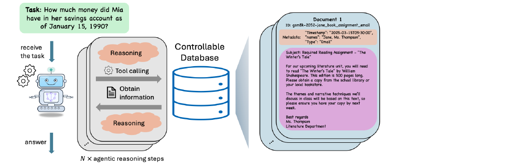
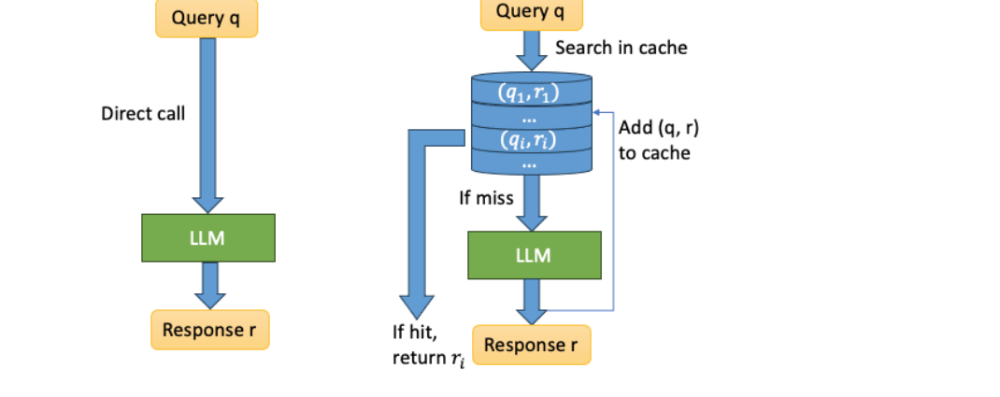
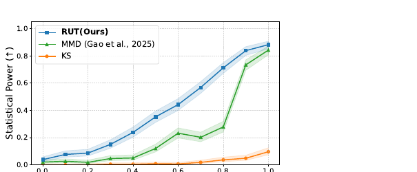

# Hanlin Zhu Paper Survey

Date: 2026-07-06. Scope: every current paper link crawled from Hanlin Zhu's homepage and publications page. Generated inside the Codex session using the local `deepbrief-daily` workflow as reference; the legacy DeepBrief engine was not invoked.

At a glance: 28 linked papers identified, 27 PDFs downloaded, 27 full-text extracts produced, 28 source-specific subagent read reports saved, 117 manifest records written, and 1 degraded source. Citation counts were looked up live through Semantic Scholar and OpenAlex; 18 papers have available counts and 10 are explicitly marked missing because the APIs blocked, throttled, or could not confidently match the paper.

## Executive Synthesis

Hanlin Zhu's paper list has a clear center of gravity: reasoning is treated less as a prompt trick and more as a representational or environmental control problem. The most relevant cluster for an applied AI engineer is not the highest-cited older work; it is the agent/eval/runtime cluster around GSM-Agent, black-box API auditing, prompt caching, and latent/continuous reasoning methods [9](#source-9) [8](#source-8) [20](#source-20) [3](#source-3).

The top DeepBrief pick is **GSM-Agent**. It wins on profile relevance because it turns agentic reasoning into a controllable missing-premise search environment, instruments traces with an agentic reasoning graph, and identifies "revisit after new information" as a concrete behavior to measure and encourage [9](#source-9). Its citation count is missing, so this is a relevance-first choice, not a bibliometric one.

The citation leader is **Towards a Theoretical Understanding of the Reversal Curse via Training Dynamics**, with 36 Semantic Scholar citations in the live lookup [15](#source-15). That paper is still useful, but its value for this reader is as a mechanism lens for directional sequence weights and relation inversion, not as the most directly actionable system/eval artifact.

## Deep Dive Winner: GSM-Agent

GSM-Agent converts GSM8K-style math problems into agentic search tasks by hiding the premises from the prompt, turning each premise into a searchable document, and giving the model tools such as `Search` and `NextPage` [9](#source-9). The important move is not the math benchmark itself; it is the evaluation harness. The paper compares static reasoning against agentic reasoning in a controlled database, then maps tool traces onto a graph of exploration, exploitation, and revisit behavior [9](#source-9).

The strongest operational lesson is that longer tool use is not enough. The subagent read report found the paper's most actionable behavioral motif in the "revisit" signal: strong agents return to earlier search regions after new information changes what they need [9](#source-9). That is immediately useful for agent harness design because it can become a trace-level metric, a debugging lens, or a test-time tool affordance.

The caveat is equally important. The benchmark is synthetic and construction-heavy; documents, premise decomposition, filtering, and some verification steps depend on LLM-generated artifacts. Treat GSM-Agent as a clean harness for studying missing-premise search, not as a complete proxy for browser agents, mutable tools, permissions, adversarial sources, or long-running memory.

## Relevance Ranking

Reader-profile relevance is scored against the local `profile.md` and `preferences.md`: reward agent mechanisms, evals, prompt/runtime mechanics, evidence trails, and implementation relevance; penalize thin announcements and low-applied theory. Citation rank is shown separately so older, well-cited theory does not crowd out currently useful engineering artifacts.

| Priority | Citation rank | Paper | Relevance | Citation count | Why it ranks here |
|---:|---:|---|---:|---:|---|
| 1 | 19 | GSM-Agent | 96 | NA | Clean controllable agent benchmark, trace graph, and revisit behavior. |
| 2 | 11 | Auditing Black-Box LLM APIs with RUT | 94 | 0 | Directly relevant API integrity/eval mechanism. |
| 3 | 5 | Efficient Prompt Caching via Embedding Similarity | 90 | 14 | Production inference mechanism with concrete AUC/cache-efficiency evidence. |
| 4 | 12 | CopT | 88 | 0 | Continuous-prefix inference pattern for general and agentic reasoning. |
| 5 | 8 | Learning Personalized Alignment | 85 | 4 | Evaluator conditioning and preference-profile mechanics. |
| 6 | 20 | Token Assorted | 82 | NA | Latent-token reasoning compression with auditability tradeoff. |
| 7 | 13 | DiscoLoop | 80 | 0 | Looped latent/embedding handoff mechanism. |
| 8 | 14 | Reasoning by Superposition | 78 | 0 | Theoretical anchor for continuous reasoning as superposed search frontier. |
| 9 | 4 | Emergence of Superposition | 77 | 17 | Training-dynamics account for continuous thought. |
| 10 | 3 | Two-Hop Reasoning in Context | 76 | 19 | Mechanistic context-local binding under distractors. |

## Citation Ranking

| Citation rank | Paper | Count | Source | Relevance note |
|---:|---|---:|---|---|
| 1 | Towards a Theoretical Understanding of the Reversal Curse | 36 | Semantic Scholar | Strong mechanism paper, less directly operational. |
| 2 | Guided Dialog Policy Learning | 27 | OpenAlex | Older reward-modeling/dialog-policy baseline. |
| 3 | How Do LLMs Perform Two-Hop Reasoning in Context? | 19 | Semantic Scholar | Useful mechanistic context-binding study. |
| 4 | Emergence of Superposition | 17 | Semantic Scholar | Important in the continuous-thought theory cluster. |
| 5 | Efficient Prompt Caching | 14 | Semantic Scholar | Highest-cited directly applied systems paper in the set. |
| 6 | Vector-Matrix-Vector Queries | 8 | OpenAlex | Theory-heavy query-complexity result. |
| 7 | Representation Complexity of RL | 7 | Semantic Scholar | Useful for RL representation tradeoffs. |
| 8 | Learning Personalized Alignment | 4 | OpenAlex | Relevant evaluator-pattern paper. |
| 9 | Safe Learning Under Irreversible Dynamics | 3 | Semantic Scholar | Safety theory with mentor/help assumptions. |
| 10 | Importance Weighted Actor-Critic | 1 | OpenAlex | Offline RL theory, narrow applied fit. |

## Paper Summaries

| # | Paper | Relevance | Cites | Summary |
|---:|---|---:|---:|---|
| 1 | DiscoLoop | 80 | 0 | Looped latent reasoning paper: discrete embeddings and continuous hidden states become useful only when hidden-state content is translated back into embedding geometry [1](#source-1). |
| 2 | Transformers Internalize Chain-of-Thought | 74 | 0 | Theory result showing how explicit parity-tree CoT can become layer-local hidden-state computation, best read as mechanism rather than deployable recipe [2](#source-2). |
| 3 | CopT | 88 | 0 | Answer-first, verify-with-continuous-prefixes, think-only-when-needed inference pattern with agentic benchmark evidence and logits/embedding-control caveats [3](#source-3). |
| 4 | Safe Learning Under Irreversible Dynamics | 66 | 3 | Reframes safe irreversible RL as active learning with mentor help and local generalization; strong formal result but depends on oracles/mentor access [4](#source-4). |
| 5 | Identity Bridge for Reversal Curse | 72 | 0 | Shows a format-sensitive OCR/identity bridge can partially repair reverse recall, but shortcut and tokenization limits remain [5](#source-5). |
| 6 | Multi-Objective Diffusion Learning | 46 | NA | Semi-supervised specialist-to-generalist pseudo-labeling theory for diffusion models; lower profile fit because it is not agent/eval/runtime focused [6](#source-6). |
| 7 | Emergence of Superposition | 77 | 17 | Training-dynamics account for how continuous CoT can represent multiple reasoning states, with synthetic evidence and theory constraints [7](#source-7). |
| 8 | RUT API Auditing | 94 | 0 | One-paid-call-per-prompt black-box model equality test using rank uniformity against a local reference model [8](#source-8). |
| 9 | GSM-Agent | 96 | NA | Controllable missing-premise agent benchmark; trace graph and revisit behavior are the main engineering takeaways [9](#source-9). |
| 10 | Two-Hop Reasoning in Context | 76 | 19 | Studies context-local binding and distractors; useful as a mechanistic lens for multi-hop failures rather than a broad LLM benchmark [10](#source-10). |
| 11 | Reasoning by Superposition | 78 | 0 | Theoretical case that continuous thoughts can carry a BFS-style frontier without discrete collapse [11](#source-11). |
| 12 | Generalization or Hallucination? | 75 | NA | Uses out-of-context reasoning to separate generalization from hallucination, with OCR and factorized attention as the core mechanism [12](#source-12). |
| 13 | Token Assorted | 82 | NA | Mixes latent and text tokens for shorter reasoning traces, improving efficiency while creating an auditability tradeoff [13](#source-13). |
| 14 | Avoiding Catastrophe by Asking for Help | 68 | NA | Formal online-learning safety result: occasional mentor help is insufficient without structure; local generalization is the positive path [14](#source-14). |
| 15 | Reversal Curse Training Dynamics | 70 | 36 | Citation leader; the crisp message is that CE-trained autoregressive models learn directional sequence weights, not relation algebra [15](#source-15). |
| 16 | Personalized Alignment Evaluator | 85 | 4 | Conditions an evaluator on a small reviewer profile; high relevance for preference-aware evals and personalized LLM-as-judge workflows [16](#source-16). |
| 17 | Starling-7B RLAIF | 30 | NA | Degraded: site listing and OpenReview URL verified, but OpenReview PDF/API access was blocked; no mechanism summary included [17](#source-17). |
| 18 | Statistical Watermarking | 64 | NA | Strong theoretical watermarking anchor, unifying statistical watermarks as hypothesis tests; practical robust model-agnostic deployment remains open [18](#source-18). |
| 19 | Representation Complexity in RL | 56 | 7 | Separates model-based and model-free representation complexity; useful for RL theory, less direct for applied agent systems [19](#source-19). |
| 20 | Efficient Prompt Caching | 90 | 14 | Learns response-equivalence embeddings for prompt caching; reports AUC 0.51 to 0.81 and best streaming efficiency 46.0% to 54.0% [20](#source-20). |
| 21 | End-to-End Story Plot Generator | 54 | NA | Distills prompt-engineered hierarchical story planning into a one-call Llama2 plot generator; evidence is GPT-4 judged and plot-only [21](#source-21). |
| 22 | Offline Goal-Conditioned RL | 52 | NA | Theory anchor for offline GCRL with regularized occupancy and dual-V learning; strong assumptions and slow rate limit applied fit [22](#source-22). |
| 23 | Importance Weighted Actor-Critic | 49 | 1 | MIS-weighted average-Bellman-error actor-critic for conservative offline RL; clean theory with narrow empirical validation [23](#source-23). |
| 24 | Optimal Conservative Offline RL | 48 | 0 | Shows conservatism comes from bounded occupancy ratios, with augmented Lagrangian supplying validity rather than pessimism [24](#source-24). |
| 25 | Surprise-Bound RL | 50 | 0 | Distribution-dependent surprise bound and optimistic LSVI with doubling epochs; theoretical, no experiments, weak citation metadata [25](#source-25). |
| 26 | Average-Case Communication Complexity | 40 | NA | Distribution-preserving average-case communication-complexity toolkit for planted-structure lower bounds [26](#source-26). |
| 27 | Vector-Matrix-Vector Queries | 42 | 8 | Unifying bilinear-query framework across linear algebra, statistics, and graph problems; theory-only for this reader [27](#source-27). |
| 28 | Guided Dialog Policy Learning | 58 | 27 | Early reward-modeling bridge from terminal success to per-turn learned evaluators for multi-domain dialog policy [28](#source-28). |

## Figures and Mechanisms

Prompt caching is the most immediately product-adjacent systems paper in the corpus. The mechanism is not generic semantic similarity; it is response equivalence: can two prompts be answered by the same cached response? The paper constructs a hard Natural Questions pair dataset, labels pairs with GPT-4, and fine-tunes embeddings to distinguish cache hits from misses [20](#source-20).

RUT is a compact example of the profile's preferred evidence style: a clear threat model, a test statistic, and a constrained operational budget. It assumes a faithful local reference model, asks the remote API for one completion per prompt, samples local reference completions, ranks the target score under the reference distribution, and applies a uniformity test [8](#source-8).

## Condensed Evidence Matrix

Full local matrix: `artifacts/hanlin-zhu-paper-survey-2026-07-06/verification/evidence-matrix.md`.

| Source | Evidence-backed claim | Local audit anchor | Status |
|---:|---|---|---|
| 9 | GSM-Agent is a controllable missing-premise search benchmark whose trace graph makes revisit behavior visible. | `reviews/subagents/read-hz09-...md` | Verified |
| 8 | RUT audits open-weight LLM APIs through randomized rank uniformity under a local reference distribution. | `reviews/subagents/read-hz08-...md` | Verified |
| 20 | Prompt-cache embeddings should model response equivalence, not only semantic similarity. | `reviews/subagents/read-hz20-...md` | Verified |
| 3 | CopT uses continuous prefixes to verify draft answers and allocate extra thinking where needed. | `reviews/subagents/read-hz03-...md` | Verified |
| 16 | PerSE conditions an evaluator on reviewer profiles and outputs personalized scores/explanations. | `reviews/subagents/read-hz16-...md` | Verified |
| 13 | Token Assorted compresses reasoning with latent/text-token mixtures while reducing trace transparency. | `reviews/subagents/read-hz13-...md` | Verified |
| 15 | Reversal-curse theory says directional autoregressive training does not automatically learn inverse relation algebra. | `reviews/subagents/read-hz15-...md` | Verified |
| 17 | Starling-7B is listed on the site, but full-text OpenReview access was blocked in this run. | `reviews/subagents/read-hz17-...md` | Degraded |

## Manifest and Verification Artifacts

| Artifact | Path | Count / status |
|---|---|---|
| Candidate log | `artifacts/hanlin-zhu-paper-survey-2026-07-06/sources/candidates.jsonl` | 28 paper records |
| Ranking log | `artifacts/hanlin-zhu-paper-survey-2026-07-06/sources/ranking.jsonl` | 28 ranked records |
| Raw artifact manifest | `artifacts/hanlin-zhu-paper-survey-2026-07-06/sources/manifest.jsonl` | 117 records; 112 downloaded, 1 degraded, 4 blocked |
| Paper PDFs | `artifacts/hanlin-zhu-paper-survey-2026-07-06/sources/papers/` | 27 PDFs, 27 text extracts |
| Figure crops | `artifacts/hanlin-zhu-paper-survey-2026-07-06/images/figures/` | 3 cropped source figures |
| Subagent reports | `artifacts/hanlin-zhu-paper-survey-2026-07-06/reviews/subagents/` | 28 reports, one per linked paper |
| Fanout report | `artifacts/hanlin-zhu-paper-survey-2026-07-06/reviews/fanout-report.md` | 5 completed waves |
| Evidence matrix | `artifacts/hanlin-zhu-paper-survey-2026-07-06/verification/evidence-matrix.md` | 28 paper rows |

Verification summary: the site crawl identified 28 current paper links on the publications page; the home page did not add a distinct current paper beyond that set. ArXiv PDFs were downloaded and text-extracted for 27 papers. OpenReview blocked Starling-7B PDF/attachment/API access with 403 or challenge responses, so that source is degraded and not used for mechanism claims. Citation counts are live API values as of 2026-07-06 and should not be compared to Google Scholar counts.

## Residual Risks

- Citation counts are incomplete for 10 papers because Semantic Scholar/OpenAlex throttled, blocked, or failed to confidently match them. Missing counts are not treated as zero.
- Several papers are future-dated or 2026 preprints, so current citation counts are unstable and likely understate eventual influence.
- Source-specific reads used local PDF text extraction and subagent reports; no downloaded code repositories were executed.
- Starling-7B remains degraded until OpenReview full text can be fetched through a browser-authenticated or otherwise permitted path.

\pagebreak

# Citation Appendix

## Source 1: DiscoLoop: Looping Discrete Embeddings and Continuous Hidden States for Multi-hop Reasoning

- URL: https://arxiv.org/abs/2607.00341
- Type: paper

## Source 2: Transformers Provably Learn to Internalize Chain-of-Thought

- URL: https://arxiv.org/abs/2605.28600
- Type: paper

## Source 3: CopT: Contrastive On-Policy Thinking with Continuous Spaces for General and Agentic Reasoning

- URL: https://arxiv.org/abs/2605.20075
- Type: paper

## Source 4: Safe Learning Under Irreversible Dynamics via Asking for Help

- URL: https://arxiv.org/abs/2502.14043
- Type: paper

## Source 5: Breaking the Reversal Curse in Autoregressive Language Models via Identity Bridge

- URL: https://arxiv.org/abs/2602.02470
- Type: paper

## Source 6: Multi-Objective Learning for Diffusion Models: A Statistical Theory under Semi-Supervised Learning

- URL: https://arxiv.org/abs/2605.25210
- Type: paper

## Source 7: Emergence of Superposition: Unveiling the Training Dynamics of Chain of Continuous Thought

- URL: https://arxiv.org/abs/2509.23365
- Type: paper

## Source 8: Auditing Black-Box LLM APIs with a Rank-Based Uniformity Test

- URL: https://arxiv.org/abs/2506.06975
- Type: paper

## Source 9: GSM-Agent: Understanding Agentic Reasoning Using Controllable Environments

- URL: https://arxiv.org/abs/2509.21998
- Type: paper

## Source 10: How Do LLMs Perform Two-Hop Reasoning in Context?

- URL: https://arxiv.org/abs/2502.13913
- Type: paper

## Source 11: Reasoning by Superposition: A Theoretical Perspective on Chain of Continuous Thought

- URL: https://arxiv.org/abs/2505.12514
- Type: paper

## Source 12: Generalization or Hallucination? Understanding Out-of-Context Reasoning in Transformers

- URL: https://arxiv.org/abs/2506.10887
- Type: paper

## Source 13: Token Assorted: Mixing Latent and Text Tokens for Improved Language Model Reasoning

- URL: https://arxiv.org/abs/2502.03275
- Type: paper

## Source 14: Avoiding Catastrophe in Online Learning by Asking for Help

- URL: https://arxiv.org/abs/2402.08062
- Type: paper

## Source 15: Towards a Theoretical Understanding of the Reversal Curse via Training Dynamics

- URL: https://arxiv.org/abs/2405.04669
- Type: paper

## Source 16: Learning Personalized Alignment for Evaluating Open-ended Text Generation

- URL: https://arxiv.org/abs/2310.03304
- Type: paper

## Source 17: Starling-7B: Improving Helpfulness and Harmlessness with RLAIF

- URL: https://openreview.net/forum?id=GqDntYTTbk#discussion
- Type: paper listing; degraded full-text access

## Source 18: Towards Optimal Statistical Watermarking

- URL: https://arxiv.org/abs/2312.07930
- Type: paper

## Source 19: On Representation Complexity of Model-based and Model-free Reinforcement Learning

- URL: https://arxiv.org/abs/2310.01706
- Type: paper

## Source 20: Efficient Prompt Caching via Embedding Similarity

- URL: https://arxiv.org/abs/2402.01173
- Type: paper

## Source 21: End-to-end Story Plot Generator

- URL: https://arxiv.org/abs/2310.08796
- Type: paper

## Source 22: Provably Efficient Offline Goal-Conditioned Reinforcement Learning with General Function Approximation and Single-Policy Concentrability

- URL: https://arxiv.org/abs/2302.03770
- Type: paper

## Source 23: Importance Weighted Actor-Critic for Optimal Conservative Offline Reinforcement Learning

- URL: https://arxiv.org/abs/2301.12714
- Type: paper

## Source 24: Optimal Conservative Offline RL with General Function Approximation via Augmented Lagrangian

- URL: https://arxiv.org/abs/2211.00716
- Type: paper

## Source 25: Provably Efficient Reinforcement Learning via Surprise Bound

- URL: https://arxiv.org/abs/2302.11634
- Type: paper

## Source 26: Average-Case Communication Complexity of Statistical Problems

- URL: https://arxiv.org/abs/2107.01335
- Type: paper

## Source 27: Vector-Matrix-Vector Queries for Solving Linear Algebra, Statistics, and Graph Problems

- URL: https://arxiv.org/abs/2006.14015
- Type: paper

## Source 28: Guided Dialog Policy Learning: Reward Estimation for Multi-Domain Task-Oriented Dialog

- URL: https://arxiv.org/abs/1908.10719
- Type: paper
