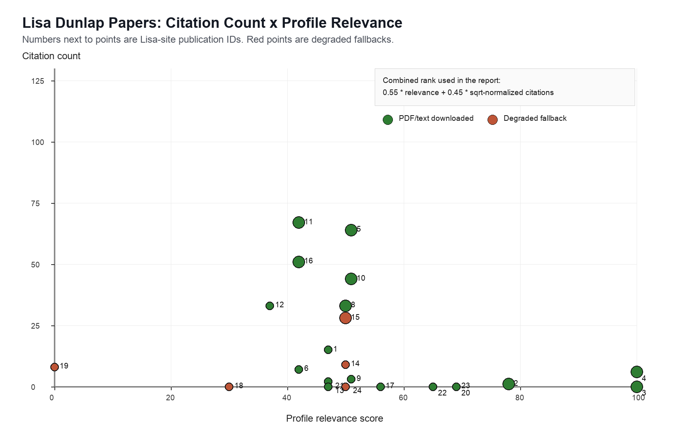
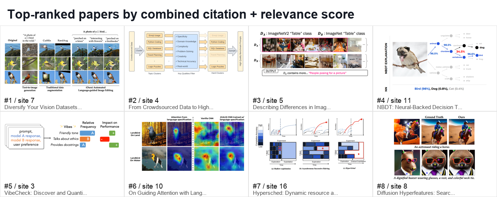

# Lisa Dunlap Papers: A Mechanism-First Reading Guide

Date: 2026-07-06  
Corpus: 24 publication records extracted from Lisa Dunlap's website bundle.  
Artifacts: 19 PDF/text-backed papers, 5 degraded fallback records, 24 source-specific subagent read reports.  
Ranking: 0.55 * profile relevance + 0.45 * sqrt-normalized citation count. Profile relevance follows the local DeepBrief reader profile: applied AI engineering, mechanisms, evals, agent/tool traces, document/evidence workflows, and systems tradeoffs.

## Executive Synthesis

Lisa Dunlap's publication arc is best read as a progression from language-guided dataset repair to evidence-oriented model evaluation. The strongest throughline is not one model family; it is a repeated workflow: expose hidden variation in data or model behavior, turn that variation into language or interpretable axes, then use those axes to improve training, evaluation, or debugging.

The highest-ranked paper is ALIA because it combines high citation count with a concrete applied loop: summarize dataset biases with language, use diffusion editing to generate counterfactual training examples, and filter the synthetic data before retraining [1](#source-1). Arena-Hard, VibeCheck, VisionArena, VPBench, VisGym, and StringSight then extend the same instinct into evaluation: benchmarks and traces are only useful when their hidden confounders are visible [2](#source-2) [5](#source-5) [10](#source-10) [15](#source-15) [16](#source-16) [21](#source-21).

The computer-vision papers are strongest when they translate a vague shift into a controllable object: a domain direction in CLIP space, a language attention map, a set-difference caption, a prompt that separates text-to-image models, or a visual prompt variant that changes benchmark rankings [3](#source-3) [6](#source-6) [8](#source-8) [17](#source-17) [19](#source-19). The systems papers are older but still useful because they make cost, deadline, and resource elasticity first-class objectives rather than background constraints [7](#source-7) [9](#source-9) [13](#source-13) [22](#source-22).

The practical reading order is: ALIA, Arena-Hard, VibeCheck, VisDiff, VisionArena, VisGym, VPBench, GALS, HyperSched, NBDT. Read the degraded ACM and blog items only for historical context unless you can recover full texts later.

## Ranked Reading Order

| Rank | Site ID | Citations | Relevance | Status | Paper and read verdict |
|---:|---:|---:|---:|---|---|
| 1 | 7 | 127 | 67 | PDF | ALIA. Read first: the cleanest dataset-inspection to synthetic-data repair loop [1](#source-1). |
| 2 | 4 | 6 | 100 | PDF | Arena-Hard and BenchBuilder. Read first if you care about eval construction from messy user data [2](#source-2). |
| 3 | 5 | 64 | 51 | PDF | VisDiff. Read for dataset-diff interfaces and language descriptions of visual shifts [3](#source-3). |
| 4 | 11 | 67 | 42 | PDF | NBDT. Read for early operational interpretability with decision-path explanations [4](#source-4). |
| 5 | 3 | 0 | 100 | PDF | VibeCheck. Read for qualitative model-difference axes tied to preference data [5](#source-5). |
| 6 | 10 | 44 | 51 | PDF | GALS. Read for language attention as training-time supervision against bias [6](#source-6). |
| 7 | 16 | 51 | 42 | PDF | HyperSched. Read for deadline-aware resource allocation in HPO [7](#source-7). |
| 8 | 8 | 33 | 50 | PDF | Diffusion Hyperfeatures. Read for diffusion-layer/timestep feature probing [8](#source-8). |
| 9 | 15 | 28 | 50 | Degraded | RubberBand. Skim only: high-level cloud HPO framing, full ACM text unavailable [9](#source-9). |
| 10 | 2 | 1 | 78 | PDF | VisionArena. Read for real-user VLM preference data and leaderboard artifacts [10](#source-10). |
| 11 | 12 | 33 | 37 | PDF | DeepMoE. Skim for dynamic routing and sparse CNN expert gates [11](#source-11). |
| 12 | 1 | 15 | 47 | PDF | Video Action Differencing. Read for comparative video feedback and LMM decomposition [12](#source-12). |
| 13 | 14 | 9 | 50 | Degraded | SEER / Elastic HPO. Skim only: metadata supports the framing, not implementation details [13](#source-13). |
| 14 | 20 | n/a | 69 | PDF | SAE Embeddings Toolkit. Read for sparse-feature embeddings as corpus-analysis tools [14](#source-14). |
| 15 | 23 | 0 | 69 | PDF | VisGym. Read for multimodal-agent diagnostics and trace failure modes [15](#source-15). |
| 16 | 22 | 0 | 65 | PDF | VPBench. Read for benchmark fragility under visual prompt choices [16](#source-16). |
| 17 | 9 | 3 | 51 | PDF | LADS. Read as the precursor to ALIA: language-named domain extension [17](#source-17). |
| 18 | 6 | 7 | 42 | PDF | SESAME. Skim for false-premise segmentation and VQA correction [18](#source-18). |
| 19 | 21 | 2 | 47 | PDF | CompCon. Read for pairwise text-to-image model behavior discovery [19](#source-19). |
| 20 | 17 | n/a | 56 | PDF | MICKIE. Skip for research; skim as satire of LLM cloud replacement [20](#source-20). |
| 21 | 24 | n/a | 50 | Degraded | StringSight. Read as a tool profile, not as a recovered paper [21](#source-21). |
| 22 | 13 | n/a | 47 | PDF | Image Gridding. Skim for client-side API cost arbitrage [22](#source-22). |
| 23 | 18 | n/a | 30 | Degraded | Log Parsing with NER. Skim as an engineering blog fallback [23](#source-23). |
| 24 | 19 | 8 | 0 | Degraded | Whiptail ecology paper. Keep only as authorship context [24](#source-24). |

## Theme 1: Language-Guided Dataset Repair

ALIA is the centerpiece. It uses a vision-language model to describe spurious or missing visual attributes, translates those descriptions into diffusion edits, filters the generated examples, and retrains with synthetic diversity [1](#source-1). Its value for an applied AI engineer is the closed loop: inspect a dataset, name the shift, generate counterexamples, and verify that the intervention improves robustness.

LADS and GALS are the two nearest predecessors. LADS uses text-domain directions in a CLIP embedding space to extend source data toward named unseen domains without target-domain images [17](#source-17). GALS uses language-derived attention maps as training-time regularization, so a model can learn to focus on task-relevant regions instead of biased context [6](#source-6). Together they show a clear progression: language first guides representation movement, then attention, then full image editing.

VisDiff and CompCon generalize the same idea from training repair to discovery. VisDiff asks what differs between two image sets and uses captions, LLM proposals, and CLIP ranking to surface candidate concepts [3](#source-3). CompCon searches for prompts that expose divergent visual representations between text-to-image models [19](#source-19). In both cases, the mechanism is not simply "ask an LLM"; it is a proposal-and-ranking loop over a large visual corpus.

## Theme 2: Evaluation Is an Artifact, Not a Number

Arena-Hard and BenchBuilder are the strongest evaluation papers for the local profile. They take crowdsourced Arena prompts, filter for high-quality and separability, then use judge controls to build a more useful benchmark from messy real interactions [2](#source-2). VibeCheck attacks a neighboring problem: once two models differ, which qualitative axes explain the preference gap? It discovers candidate vibes, scores them with judge panels, filters by agreement and separability, then iterates on failures [5](#source-5).

VisionArena, VPBench, and VisGym make the same warning more concrete for multimodal systems. VisionArena shows that real-user VLM battles contain valuable preference labels but also style and verbosity effects [10](#source-10). VPBench shows that visually prompted benchmark rankings can shift when marker styles, prompt variants, or preprocessing change [16](#source-16). VisGym moves from static prompts to interactive multimodal environments, where history length, feedback, representation format, and goal visibility change agent performance [15](#source-15).

StringSight is the most directly aligned with model-trace analysis, but it is degraded: the local artifact is a website/blog fallback rather than a full paper. Treat it as a signal that Lisa's newer work is moving from benchmark scores toward behavior clusters and trajectory inspection, not as a fully verified publication claim [21](#source-21).

## Theme 3: Multimodal Mechanisms and Failure Modes

Video Action Differencing is useful because it asks a more operational question than ordinary action recognition: given two videos of a task, can a model describe the skill-relevant difference? The read report identifies an agentic decomposition: propose likely differences, localize sub-actions, then run focused frame-level VQA [12](#source-12).

SESAME targets a different failure mode: referring-expression systems should not segment an object that is absent. It jointly trains recognition/dialogue behavior with segmentation so the model can see that a premise is false, say so, and propose alternatives [18](#source-18). Diffusion Hyperfeatures probes another foundation-model layer: diffusion models contain useful visual correspondence features across denoising time and network depth, but the best feature location depends on model and task [8](#source-8).

The common applied lesson is that multimodal robustness rarely comes from a single metric. These papers expose where the model is looking, what visual prompt convention it follows, whether it can compare two states, and whether it can say "the requested object is not there."

## Theme 4: Systems and Cost Tradeoffs

HyperSched is the strongest fully recovered systems paper. It reframes hyperparameter optimization as deadline-constrained model development, where the goal is the best trained model at the deadline rather than a clean best-arm identification problem [7](#source-7). RubberBand and SEER are related but degraded because ACM blocked the paper PDFs; use them only for high-level context around deadline-aware and elastic-resource HPO [9](#source-9) [13](#source-13).

Image Gridding is smaller but memorable: pack multiple images into one spatial grid so a per-request vision API sees one input, then remap detections back to the source images. The tradeoff is explicit: fewer paid requests versus lower per-image resolution and possible accuracy loss [22](#source-22). The log-parsing item is also degraded, but the preserved Splunk/NVIDIA fallback frames machine-log field extraction as named entity recognition deployed through a streaming GPU inference path [23](#source-23).

DeepMoE is the architecture-side systems bridge. It uses a shallow embedding to generate sparse gates for channel experts throughout a CNN, improving accuracy/FLOP tradeoffs in the reported settings [11](#source-11). It is less directly aligned with today's agent/eval preference profile, but it explains an older interest in dynamic compute allocation.

## Theme 5: Interpretability as a Working Surface

NBDT and the SAE Embeddings Toolkit are separated by several years but rhyme. NBDT makes a CNN expose a hierarchical decision path, so interpretability becomes a path a human can inspect rather than a heatmap alone [4](#source-4). The SAE toolkit turns LLM hidden states into sparse, interpretable embedding features that can be clustered, correlated, searched, or used as analyst hypotheses over a corpus [14](#source-14).

MICKIE belongs in a different bucket. It is explicitly marked as a joke paper and contains unresolved placeholders, so the only serious use is as a satirical artifact about LLMs replacing cloud APIs [20](#source-20). The whiptail ecology paper is also outside the applied AI preference profile and closed access locally; keep it as authorship context, not as part of the mechanism arc [24](#source-24).

## Pipeline Report

The website crawl found 24 embedded publication records in the JavaScript bundle, with site metadata, images, and links saved locally. Nineteen records have downloaded PDFs plus extracted text. Five are degraded: ACM access blocked papers 14 and 15, BioOne blocked and OpenAlex reports closed access for paper 19, and papers 18 and 24 have no paperLink in the site record and were preserved through fallback pages.

The subagent phase used a six-agent concurrency cap. Every site-listed record received one source-specific read report under `reviews/subagents/`, and the report audit found all 24 reports with the required section headings and final synthesis bullets. The fanout report is `reviews/fanout-report.md`; the local evidence bridge is `verification/evidence-matrix.md`.

The usual DeepBrief daily 100-candidate gate was not applied because this was not a general daily scout. The contract here was the complete Lisa-site publication corpus. Padding the candidate file with unrelated papers would have made the result less faithful to the user request.

## Errata

- Citation counts are from Semantic Scholar or OpenAlex lookups during this run. Missing counts mean no reliable match was available or the source is not indexed, not necessarily zero impact.
- Papers 14 and 15 are degraded because ACM returned HTTP 403 or Cloudflare challenge pages. Their PDF-level methods and results were not inspected.
- Paper 19 is degraded because BioOne returned an anti-bot page and OpenAlex reports the work as closed access.
- Papers 18 and 24 are degraded because Lisa's site does not list a direct paperLink; the run preserved the available blog/tool fallback.
- Paper 17 is a joke paper by site metadata and is not treated as a verified systems contribution.

# Citation Appendix

## Source 1: Diversify Your Vision Datasets with Automatic Diffusion-Based Augmentation {#source-1}
- URL: https://arxiv.org/abs/2305.16289
- Type: paper

## Source 2: From Crowdsourced Data to High-Quality Benchmarks: Arena-Hard and BenchBuilder Pipeline {#source-2}
- URL: https://arxiv.org/abs/2406.11939
- Type: paper

## Source 3: Describing Differences in Image Sets with Natural Language {#source-3}
- URL: https://arxiv.org/abs/2312.02974
- Type: paper

## Source 4: NBDT: Neural-Backed Decision Trees {#source-4}
- URL: https://arxiv.org/abs/2004.00221
- Type: paper

## Source 5: VibeCheck: Discover and Quantify Qualitative Differences in Large Language Models {#source-5}
- URL: https://arxiv.org/abs/2410.12851
- Type: paper

## Source 6: On Guiding Attention with Language Specification {#source-6}
- URL: https://arxiv.org/abs/2202.08926
- Type: paper

## Source 7: HyperSched: Dynamic Resource Allocation for Model Development on a Deadline {#source-7}
- URL: https://arxiv.org/abs/2001.02338
- Type: paper

## Source 8: Diffusion Hyperfeatures: Searching Through Time and Space for Semantic Correspondence {#source-8}
- URL: https://arxiv.org/abs/2305.14334
- Type: paper

## Source 9: RubberBand: Cloud Based Hyperparameter Tuning {#source-9}
- URL: https://dl.acm.org/doi/pdf/10.1145/3447786.3456245
- Type: degraded paper metadata

## Source 10: VisionArena: 230K Real World User-VLM Conversations with Preference Labels {#source-10}
- URL: https://arxiv.org/abs/2412.08687
- Type: paper

## Source 11: Deep Mixture of Experts Via Shallow Embedding {#source-11}
- URL: http://proceedings.mlr.press/v115/wang20d/wang20d.pdf
- Type: paper

## Source 12: Video Action Differencing {#source-12}
- URL: https://arxiv.org/abs/2503.07860
- Type: paper

## Source 13: Hyperparameter Tuning with Elastic Resources {#source-13}
- URL: https://dl.acm.org/doi/pdf/10.1145/3472883.3486989
- Type: degraded paper metadata

## Source 14: Interpretable Embeddings with Sparse Autoencoders: A Data Analysis Toolkit {#source-14}
- URL: https://arxiv.org/abs/2512.10092
- Type: paper

## Source 15: VisGym: Diverse, Customizable, Scalable Environments for Multimodal Agents {#source-15}
- URL: https://arxiv.org/abs/2601.16973
- Type: paper

## Source 16: Visually Prompted Benchmarks Are Surprisingly Fragile {#source-16}
- URL: https://arxiv.org/abs/2512.17875
- Type: paper

## Source 17: Using Language to Extend to Unseen Domains {#source-17}
- URL: https://arxiv.org/abs/2210.09520
- Type: paper

## Source 18: See, Say, and Segment: Teaching LMMs to Overcome False Premises {#source-18}
- URL: https://arxiv.org/abs/2312.08366
- Type: paper

## Source 19: Discovering Divergent Representations between Text-to-Image Models {#source-19}
- URL: https://arxiv.org/abs/2509.08940
- Type: paper

## Source 20: MICKIE: The Magically Interpretable Cloud Komputing Inference Engine {#source-20}
- URL: https://drive.google.com/file/d/1Opk2PfCaSHJABij7-GNlNtAwwmbNx_jF/view?usp=sharing
- Type: joke paper

## Source 21: Turning Model Traces into Actionable Insights {#source-21}
- URL: https://blog.stringsight.com
- Type: degraded tool/source profile

## Source 22: Improve Model Inference Cost with Image Gridding {#source-22}
- URL: https://dmlr.ai/assets/accepted-papers/79/CameraReady/Image_Gridding.pdf
- Type: paper

## Source 23: Machine Log Parsing with Named Entity Recognition {#source-23}
- URL: https://www.splunk.com/en_us/blog/it/how-splunk-is-parsing-machine-logs-with-machine-learning-on-nvidia-s-triton-and-morpheus.html
- Type: degraded engineering blog fallback

## Source 24: Habitat-dependent search behavior in the Colorado Checkered Whiptail {#source-24}
- URL: https://bioone.org/journals/Western-North-American-Naturalist/volume-80/issue-1/064.080.0102/Habitat-Dependent-Search-Behavior-in-the-Colorado-Checkered-Whiptail-Aspidoscelis/10.3398/064.080.0102.short
- Type: degraded closed-access paper metadata
