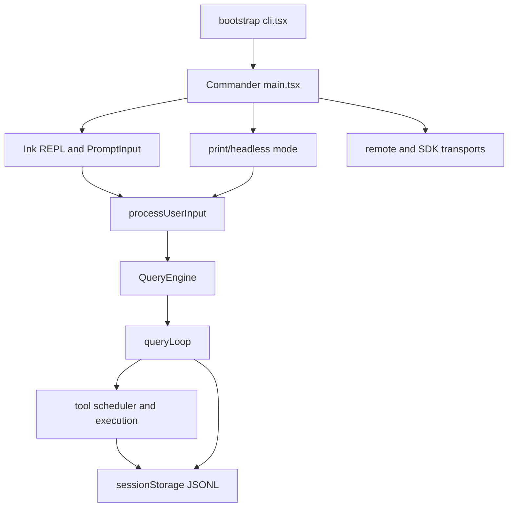
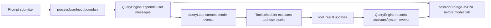
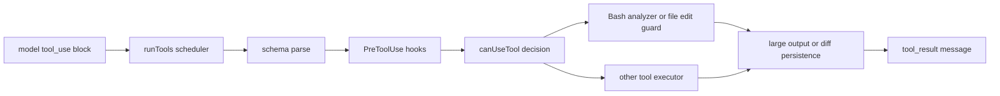
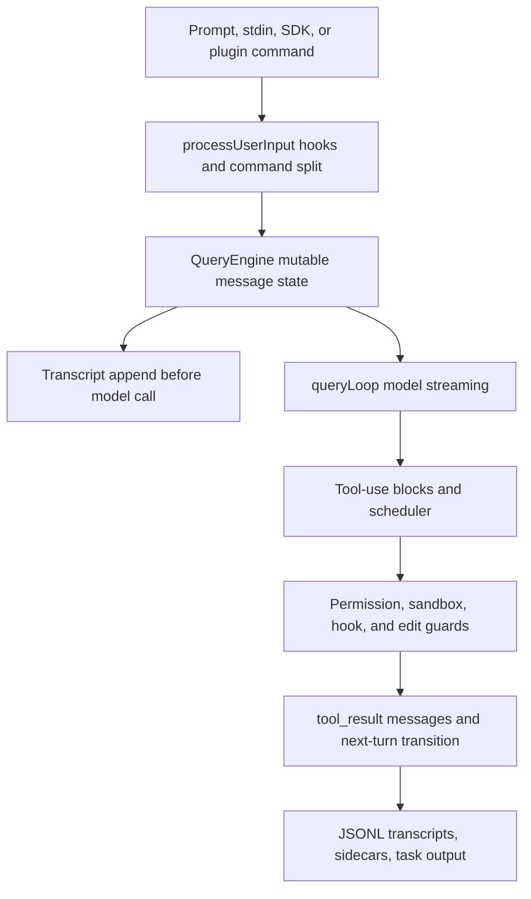
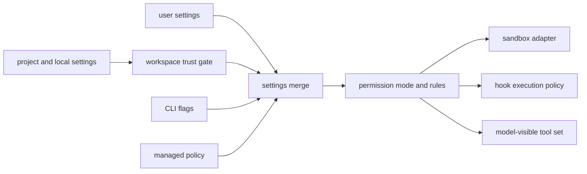
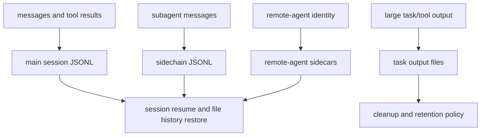
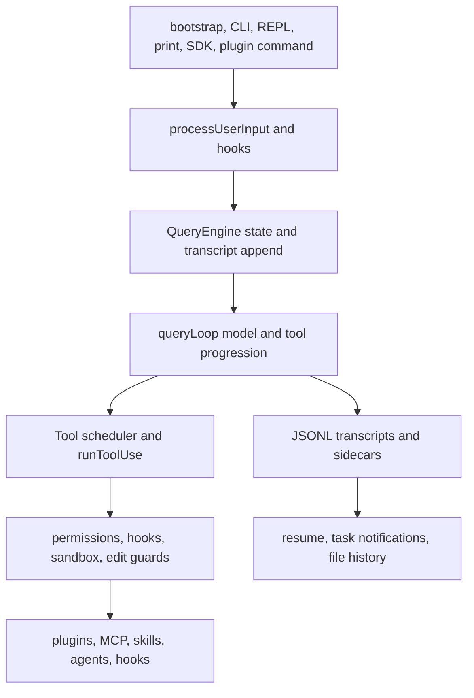
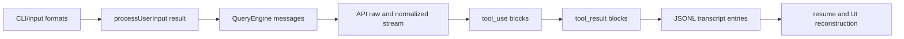
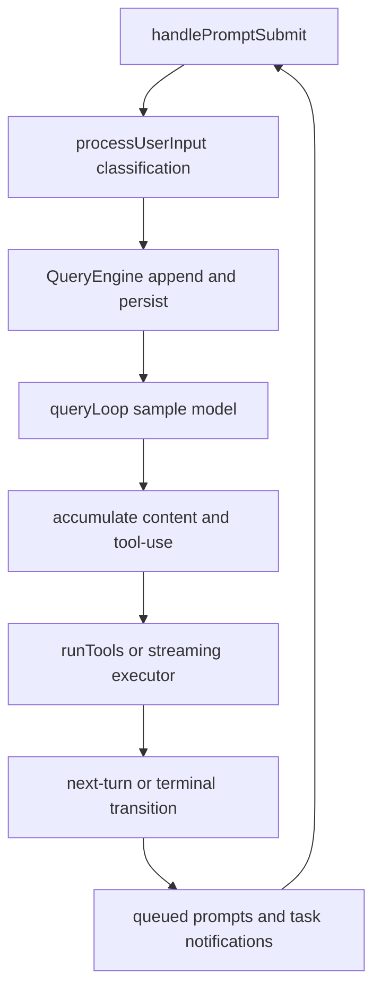
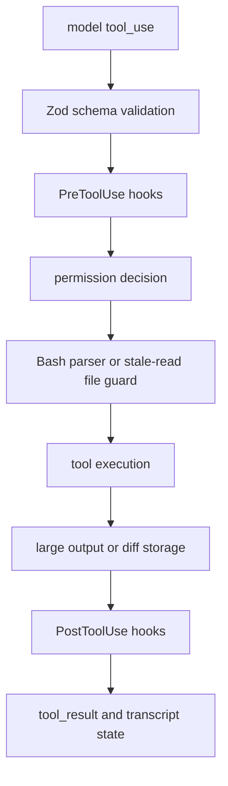

# Executive Synthesis

The inspected Claude Code repository is a TypeScript source snapshot whose own README describes recovery from an npm sourcemap. Treat it as highly informative source evidence, not as a complete package/release repository [1](#source-1) [10](#source-10). Within that boundary, the design is rich: CLI bootstrap, Commander parser, Ink UI, QueryEngine, query loop, tools, permissions, sandbox, settings, transcripts, plugins, MCP, hooks, skills, agents, remote SDK transports, and product notifications all live in one source tree.

The architecture style is product-integrated rather than crate-layered. A bootstrap entrypoint handles fast paths, then the main parser and REPL move input through prompt processing into QueryEngine [2](#source-2) [3](#source-3). QueryEngine owns mutable conversation state, transcript persistence, and async generator consumption, while query.ts owns the main model/tool loop [4](#source-4).

The control model is generator and queue oriented. Turns stream through queryLoop, accumulate tool-use blocks, run tools, append tool results, and either finish or transition into another turn [4](#source-4) [5](#source-5). Background tasks, local/remote agents, and task notifications are separate state machines that re-enter the user/query path through queues and attachments.

The tool/editing model differs sharply from Codex. Claude Code uses Zod-backed Tool objects, read-only/concurrency classification, a scheduler, permission hooks, Bash-specific command analysis, exact Edit/Write tools, notebook edits, and large-result persistence [5](#source-5) [6](#source-6). There is no inspected general apply_patch grammar equivalent.

The extension model is very broad. Plugins, marketplaces, plugin commands, skills, agents, MCP servers/bundles, hooks, output styles, and LSP servers are all represented, with settings/policy gates and scoped enablement [11](#source-11). The main gap is build/package/release authority: package manifests, CI workflows, and release pipelines are not present in this checkout [10](#source-10).

# Monthly Themes

## Theme 1: Product Runtime In One TypeScript Tree

Claude Code's source tree keeps the agent loop close to UI and product state. Bootstrap, main parser, REPL, QueryEngine, queryLoop, tools, settings, session storage, and extension loaders are separate modules, but they share one application graph [2](#source-2) [4](#source-4). That makes cross-feature behavior easy to express but harder to reason about in isolation.

## Theme 2: Transcript-Centered Persistence

Local JSONL transcripts are the durable history model. They include messages plus rich metadata: worktree state, file history, attribution snapshots, context-collapse records, queue operations, and sidechain/subagent records [9](#source-9). Unlike Codex's SQLite-backed thread index, this checkout does not show a central local database for session state.

## Theme 3: Permissions Are Product UX And Security

Permissions are not a simple prompt. The system merges settings sources, trust state, CLI flags, managed policy, allow/deny/ask rules, interactive permission handlers, sandbox availability, Bash command analysis, file write checks, and remote-mode constraints [8](#source-8). This gives strong ergonomics but many precedence edges.

## Theme 4: Extensibility Is A Marketplace System

Claude Code's extension story is deeper than MCP. Plugins can bring commands, agents, skills, hooks, MCP servers, MCP bundles, output styles, and settings. Marketplaces and installed state are separated from scoped enablement [11](#source-11). This is powerful, but it means path containment, dependency policy, hook allowlists, and server scoping are core security boundaries.

# Deep Dives

## Architecture Topology: A Product-Integrated TypeScript Agent CLI

### TL;DR

Claude Code's inspected source is a broad TypeScript agent application. The user surfaces include CLI bootstrap, Commander commands, interactive Ink UI, print/headless mode, SDK schemas, remote transports, desktop handoff, and extension management. These surfaces converge through processUserInput, QueryEngine, queryLoop, tools, settings, and transcript storage [2](#source-2) [3](#source-3).

### Mental model

Think of the repository as one application with several in-process control planes. The process plane handles bootstrap, env setup, command parsing, remote-control flags, update redirects, and print mode [2](#source-2). The UI plane handles PromptInput, slash commands, React/Ink state, permission dialogs, and task notifications. The runtime plane is QueryEngine plus query.ts [3](#source-3) [4](#source-4). The policy plane is settings, permissions, sandbox, trust, and managed environment. The extension plane is plugins, MCP, skills, hooks, agents, and marketplaces [8](#source-8) [11](#source-11).

That topology differs from Codex. Claude Code has module boundaries, but not the same Rust crate separation and protocol-centered app-server boundary. Many features are close to UI state and settings state, which supports integrated UX such as interactive permission choices, plugin notifications, remote agent restoration, and desktop handoff [2](#source-2).

### Why this matters now

The biggest contributor risk is assuming that a path is "just CLI" or "just UI." A prompt can become a slash command, a local JSX command, a queued prompt, a task notification, a QueryEngine user message, or a headless SDK request [3](#source-3). A plugin can load commands, agents, skills, hooks, and MCP. A settings change can alter env, permission mode, sandbox behavior, model provider, and hook policy [8](#source-8) [11](#source-11).

### Mechanism trace



Bootstrap handles fast paths before importing the full application. main.tsx configures command parsing, stdin handling, print mode, remote URLs, session source, and subcommands [2](#source-2). Interactive input enters PromptInput and handlePromptSubmit, then processUserInput splits hooks, slash commands, bash mode, local commands, attachments, and normal user prompts [3](#source-3).

### Evidence map

| Surface | Main owner | Design role | Main risk |
|---|---|---|---|
| Bootstrap | entrypoint | fast path and process setup | divergent early behavior |
| Commander | main parser | CLI options and commands | option precedence drift |
| REPL | Ink components | interactive UX | queue and interrupt races |
| QueryEngine | runtime owner | mutable conversation and transcript | persistence coupling |
| query.ts | loop owner | model/tool turn progression | complex transitions |
| Extensions | plugin/MCP/hooks/skills | third-party capabilities | trust and path policy |

The file inventory found 1,906 tracked files: 1,800 source files, 92 prompt files, 6 tests, 3 assets, 1 README, and 4 generated files. There is no tracked root package manifest, no `.github/workflows` directory, and no clear repository-level release pipeline in this checkout [10](#source-10).

### Walkthrough

Start from process entry. The bootstrap path handles version, system prompt, MCP flags, remote aliases, daemon workers, template jobs, tmux/worktree helpers, update redirects, bare mode, and early input capture before main app import [2](#source-2). The main parser then defines root options including print/bare modes, output/input formats, permission flags, allowed/disallowed tools, MCP config, system prompt, resume, model, effort, agents, settings, additional dirs, IDE, session id, plugins, slash-command disabling, Chrome flags, and file input [2](#source-2).

Interactive input is not handed directly to the model. PromptInput normalizes UI cases, handlePromptSubmit maps exit words, paste refs, local commands, queues, and prompt execution, then processUserInput runs hooks and dispatches slash/bash/plain prompt behavior [3](#source-3). That processing boundary is the architecture's real input gate.

### Implementation notes

QueryEngine is the runtime owner in this design. A short source-derived excerpt captures the class boundary and turn submission style:

```typescript source="https://github.com/yasasbanukaofficial/claude-code/blob/a371abbe75ffa0d0a3c92290e2bbf56a7ef54367/src/QueryEngine.ts#L184-L213"
export class QueryEngine {
  async *submitMessage(
    input: string | UserMessage,
    options: QueryOptions = {},
  ): AsyncGenerator<Message> {
    // turn lifecycle continues in query()
  }
}
```

How to modify this codebase safely: classify whether a change belongs to bootstrap, parser, interactive input, processUserInput, QueryEngine, query loop, tool execution, settings, persistence, or extension loading before editing. Then check every alternate surface that can reach the same behavior: print mode, SDK mode, remote mode, plugins, and slash commands [2](#source-2) [3](#source-3).

### Try it yourself

In 45 minutes, trace a hypothetical new slash command from command registration through availability/source metadata, processUserInput dispatch, optional local command behavior, QueryEngine effects, persistence, and plugin compatibility. The goal is to detect whether it is a UI command, a prompt command, or a runtime state transition [3](#source-3) [11](#source-11).

### Open questions

The checkout lacks authoritative package metadata. The actual npm package may include generated files, bundled entrypoints, or build substitutions not represented here. Runtime availability of internal-only or feature-gated commands also remains uncertain [10](#source-10).

### Sources & citations

- Repository tree and README provenance [1](#source-1), [10](#source-10).
- CLI bootstrap and Commander parser [2](#source-2).
- QueryEngine and input processing path [3](#source-3).

## Runtime Lifecycle: QueryEngine, queryLoop, Queues, And Tasks

### TL;DR

Claude Code runtime is a distributed state machine. Session identity lives in bootstrap state; conversation mutation and transcript writes live in QueryEngine; model/tool turn progression lives in query.ts; queued prompts/task notifications live in queue managers and REPL effects; local/remote agents live as task records [3](#source-3) [4](#source-4) [9](#source-9).

### Mental model

A turn is an async generator pipeline. Accepted user input becomes messages, QueryEngine persists them before model execution, query() invokes queryLoop, queryLoop streams model events, captures tool-use blocks, runs tools, appends tool results, and returns terminal state or a next-turn transition [4](#source-4) [5](#source-5).

Cancellation is abort-controller based rather than task-token based. Prompt submission during streaming can abort the current controller and enqueue the new command. Queue draining later turns queued prompts and task notifications into attachments. That design keeps the UI responsive but makes priority, agent-id scoping, and removal semantics important [4](#source-4).

### Why this matters now

Claude Code's background-agent behavior depends on queues, task records, and transcript side effects rather than a single thread manager. Local agent tasks, remote agent tasks, and in-process teammate tasks register lifecycle state, enqueue notifications, and may restore from sidecars on session resume [4](#source-4) [9](#source-9). Contributors changing "just task output" or "just queueing" can break user-visible turn order.

### Mechanism trace



QueryEngine stores mutable messages, abort controller, permission denials, usage, and read-file state [3](#source-3). submitMessage appends accepted user messages, records them to transcript, calls query(), consumes emitted messages, and updates in-memory state. queryLoop maintains messages, tool-use context, compaction tracking, recovery counters, pending summaries, turn count, and transition state [4](#source-4).

### Evidence map

| Runtime part | Owner | Persistence coupling |
|---|---|---|
| Session id | bootstrap state | transcript paths and resume |
| Prompt processing | handlePromptSubmit/processUserInput | queued commands and hooks |
| Conversation | QueryEngine | transcript append before query |
| Turn loop | query.ts | compaction and tool result turns |
| Tools | tool scheduler/execution | persisted output references |
| Tasks | Task framework and AgentTool | sidecars and queue notifications |

### Walkthrough

Session identity starts in bootstrap state with a random UUID. switchSession changes session id and cwd during resume, then transcript adoption and restored remote-agent polling occur [9](#source-9). During normal operation, handlePromptSubmit either executes command batches, queues input, interrupts streaming, or calls executeUserInput [3](#source-3). QueryEngine then writes user messages before model execution, which is an important crash-resumability choice.

queryLoop is where compaction and tools meet. Before sampling it can snip, microcompact, collapse context, or run auto-compact. During streaming it accumulates tool-use blocks. After streaming, it runs tools through the scheduler or streaming executor, yields tool updates, builds tool-result messages, and transitions to a follow-up turn when needed [4](#source-4) [5](#source-5).

### Implementation notes

The query loop makes tool execution part of the turn transition, not an external callback.

```typescript source="https://github.com/yasasbanukaofficial/claude-code/blob/a371abbe75ffa0d0a3c92290e2bbf56a7ef54367/src/query.ts#L1378-L1385"
const toolUpdates = shouldStream
  ? streamingToolExecutor.execute(toolUseBlocks)
  : runTools(toolUseBlocks, assistantMessages, canUseTool, toolUseContext)

for await (const update of toolUpdates) {
  yield update
}
```

How to modify safely: do not add a new queue or task notification path without defining abort reason, priority, agent-id targeting, transcript representation, and removal semantics. Do not change compaction without checking transcript boundary markers and resume display [4](#source-4) [9](#source-9).

### Try it yourself

Design a read-only trace for "user submits while a remote agent completes." Identify the active abort controller, queued command priority, task notification agent id, transcript append point, and next queryLoop transition. No execution is needed; the exercise is to locate ownership [4](#source-4).

### Open questions

Race behavior between React effects, abort controllers, async generators, and task polling was not executed. A complete verification plan needs targeted runtime tests for interrupted streams, queued task notifications, compaction boundaries, and resume after remote-agent sidecars [4](#source-4) [9](#source-9).

### Sources & citations

- QueryEngine mutable state and submission [3](#source-3).
- queryLoop and tool transitions [4](#source-4).
- Session storage and resume model [9](#source-9).

## Tooling And Permissions: Exact Edits, Bash Analysis, And Policy UX

### TL;DR

Claude Code's action layer uses schema-backed Tool objects, a scheduler, permission handlers, Bash-specific command analysis, exact Edit/Write tools, large output persistence, and settings/sandbox gates. It is more tool-specific and UX-integrated than a single generic patch/exec abstraction [5](#source-5) [6](#source-6) [8](#source-8).

### Mental model

Tools have identity, schema, permission behavior, result mapping, read-only/concurrency flags, destructive flags, and max result sizes. getTools filters the set by mode and deny rules. runTools partitions safe concurrent calls from serial mutation calls. runToolUse validates, runs hooks, asks permission, executes, maps results, and emits tool_result messages [5](#source-5).

Editing is not a general patch language. Edit requires exact old/new string replacement, previous read state, ambiguity checks, stale-file checks, display patch generation, write, editor/LSP notification, and read-state refresh. Write performs full replacement with similar staleness protection for existing files [6](#source-6).

### Why this matters now

Claude Code's ergonomics depend on permission UX. Bash can be classified and suggested, file writes show diffs, sandbox mode can auto-allow some Bash while still respecting deny/ask rules, and managed policy can disable bypass modes [8](#source-8). That UX is powerful, but it means tool behavior is spread across tool definitions, permissions, hooks, sandbox adapter, settings, and output storage [5](#source-5).

### Mechanism trace



Bash permissioning combines AST parsing or fallback parsing, complex/dangerous detection, compound command splitting, explicit deny precedence, redirection checks, and command-injection analysis [5](#source-5). File write permission checks combine deny rules, internal editable paths, session allowances, safety checks, ask rules, accept-edits mode, allow rules, and default ask behavior [6](#source-6) [8](#source-8).

### Evidence map

| Capability | Mechanism | Risk |
|---|---|---|
| Bash | parser, permission rules, sandbox | command injection and host mutation |
| Edit | exact replacement and stale read | wrong file edits |
| Write | full replacement with read guard | clobbering user changes |
| Hooks | pre/post/permission events | behavioral mutation |
| Sandbox | external runtime adapter | silent fallback |
| Output persistence | tool-results files and previews | hidden full output state |

### Walkthrough

Settings sources are merged in user, project, local, flag, then policy order, with policy and flags always included. Permission mode resolves from dangerous skip flags, explicit permission-mode flag, settings default, then default behavior. Remote mode ignores broad settings defaults that would grant access silently [8](#source-8). Sandbox settings are separate: network domains, sockets, filesystem rules, managed-only controls, fail-if-unavailable, auto-allow, and excluded commands feed the adapter [8](#source-8).

The tool layer then applies these policies. runToolUse validates the input and invokes permission checks before execution [5](#source-5). Edit and Write check file read state and staleness before writing [6](#source-6). Large outputs may be persisted under session tool-results, with model-visible previews and references [5](#source-5) [9](#source-9).

### Implementation notes

The exact-edit model is visible in the FileEdit tool's constraints. This is not patch inference; it is old-string/new-string replacement with stale-read checks.

```typescript source="https://github.com/yasasbanukaofficial/claude-code/blob/a371abbe75ffa0d0a3c92290e2bbf56a7ef54367/src/tools/FileEditTool/FileEditTool.ts#L275-L282"
if (!hasReadFile(file_path)) {
  return { result: false, message: "File must be read before editing" }
}

if (isModifiedSinceRead(file_path)) {
  return { result: false, message: "File changed since last read" }
}
```

How to modify safely: add new tools with schema, permission matching, hook behavior, concurrency/read-only classification, output persistence, UI display, and tests. For Bash, keep parser, prefix suggestions, hidden sed fields, sandbox flags, and raw-output handling aligned. For file edits, preserve read-before-write and staleness checks [5](#source-5) [6](#source-6).

### Try it yourself

Specify a hypothetical "RenameFile" tool. Decide whether it is concurrency-safe, which permission rules match it, what stale-read checks apply, what diff or preview is shown, how large output is persisted, and how sandbox mode changes the decision [5](#source-5) [8](#source-8).

### Open questions

The external sandbox runtime was not inspected or executed. The repository source also references many feature-gated branches; runtime policy in a packaged build may differ by provider, organization settings, platform, or internal feature flags [8](#source-8).

### Sources & citations

- Tool execution scheduler and result mapping [5](#source-5).
- FileEdit exact replacement behavior [6](#source-6).
- Settings, permission, and sandbox policy [8](#source-8).

# Skim Cards

## model_training

This lane covers Anthropic/provider API transport.

> **Verdict: watch.** Provider support is branch-based, so adding a provider is a multi-file product change rather than a plugin drop-in [7](#source-7).

Provider choice comes from environment and model config. getAnthropicClient branches into direct Anthropic, Bedrock, Foundry, and Vertex, then queryModelWithStreaming builds beta message params and streams with app-owned retry semantics [7](#source-7). Capability refresh is first-party Anthropic only; custom or third-party models rely on static configs and overrides.

## applied_product

This lane covers persistence and transcript UX.

> **Verdict: adopt with caution.** JSONL transcripts are expressive and easy to inspect, but they are privacy-sensitive local artifacts [9](#source-9).

Transcripts include message state plus worktree, file history, attribution, context collapse, and queue metadata. Sidechains and remote-agent sidecars preserve background work. Cleanup defaults to 30 days, and persistence can be disabled in some modes [9](#source-9). New entry types should be treated as durable schemas with privacy review.

## discourse

This lane covers extension and marketplace surfaces.

> **Verdict: adopt selectively.** Claude Code's plugin system is richer than a simple MCP list, but path and policy boundaries carry much of the risk [11](#source-11).

Plugins can define commands, agents, skills, hooks, MCP servers and bundles, output styles, LSP servers, settings, and userConfig. Marketplaces, global install metadata, scoped enablement, managed policy, and cache-only loading all affect what appears at runtime [11](#source-11). This is productive for ecosystem work and risky for maintainers who treat extension files as passive content.

# Change Maps

## Code And Repository Map

| Area | What to inspect | Main gap |
|---|---|---|
| CLI/bootstrap | entrypoint and main parser | shipped binary wiring absent |
| Runtime | QueryEngine and query.ts | distributed state |
| Tools | tools, toolExecution, Bash/Edit/Write | tool-specific security |
| Config | settings, permissions, sandbox | precedence complexity |
| Persistence | sessionStorage and cleanup | transcript privacy |
| Extensions | plugins, MCP, hooks, skills | path and trust policy |

This map should drive future work: identify which application plane owns behavior before changing it [1](#source-1).

## Config And Permission Map

| Source or knob | Precedence or default | Security implication |
|---|---|---|
| user/project/local/flag/policy settings | policy and flags always included | policy can constrain user/project |
| `--permission-mode` | after dangerous skip, before settings default | direct UX control |
| `--allowedTools` and deny lists | live context plus settings rules | allow is not sandbox isolation |
| managed policy | remote/MDM/file/HKCU order | enterprise control |
| sandbox.enabled | off unless configured | no silent security guarantee |
| env settings | pre-trust allowlist, post-trust broader | project env can redirect behavior |
| provider/auth env | protected names | token and routing risk |
| hooks | settings/plugin/session sources | executable extension |

Config ergonomics are expressive but demand tests around source order, trust, remote mode, and managed-only switches [8](#source-8).

## Build, Test, And Release Map

| Surface | Evidence in checkout | Consequence |
|---|---|---|
| README | present | source provenance and basic run notes only |
| package manifest | absent | package entrypoints unverifiable |
| CI workflows | absent | test coverage cannot be mapped from workflows |
| release notes command | present | fetches changelog, not release automation |
| tests | minimal tracked tests | weak repository-level coverage map |
| assets | present | visual/package UX evidence |

This is the clearest degraded area. The source is useful for design analysis, but not sufficient for release or packaging confidence [10](#source-10).

# Pipeline Report

| Metric | Count |
|---|---:|
| Tracked files inventoried | 1906 |
| Source files | 1800 |
| Prompt files | 92 |
| Tests | 6 |
| Docs | 1 |
| Assets | 3 |
| Generated files skipped from deep read | 4 |
| Raw artifact records | 126 |

Candidate log: `sources/candidates.jsonl`. Manifest: `sources/manifest.jsonl`. File inventory: `file-inventory.csv`, `file-inventory.jsonl`, and `file-inventory.md`. Fanout reports are under `reviews/fanout/`, and the local evidence matrix is `verification/evidence-matrix.md`.

Deep-read coverage focused on CLI/UX entrypoints, QueryEngine/query loop, tool execution/editing, model transport, config/security, persistence/logging, extensions, and available docs/package/release signals. Generated event types were inventoried but not deep-read. Build/release/test metadata is degraded because authoritative manifests and workflows are absent [10](#source-10).

## Source Visual

{width=3.20in}

The embedded logo is a tracked repository asset, included as inspected visual evidence rather than as external artwork [1](#source-1). The small asset set also reflects the repository snapshot's shape: most evidence is source code, prompts, and runtime modules, not release collateral or extensive documentation [10](#source-10).

## Feature Catalog

| Feature surface | Primary owner | Runtime dependency | Modification risk |
|---|---|---|---|
| CLI bootstrap | entrypoints/cli | process flags and fast paths | divergent early exits |
| Commander parser | main.tsx | settings, stdin, subcommands | option precedence drift |
| Interactive REPL | Ink components | PromptInput and queues | interrupt race behavior |
| Headless print | cli/print | QueryEngine and structured IO | stream-json compatibility |
| Query loop | query.ts | model API, tools, compaction | transition bugs |
| Tool system | tools and services/tools | permissions and hooks | unsafe actions |
| Persistence | sessionStorage | transcripts and sidecars | privacy and resume |
| Extensions | plugins, MCP, skills, hooks | settings and policy | path/trust issues |

The catalog highlights a core difference from Codex: many product behaviors are close together in one TypeScript graph. That gives Claude Code rich UX, but it means small changes often cross boundaries between parser, UI, query loop, storage, and settings [2](#source-2) [3](#source-3). A safe change begins by naming every entrypoint that can reach the behavior: interactive prompt, print mode, SDK-style input, remote mode, plugin command, and slash command [2](#source-2) [11](#source-11).

## End-To-End Request Lifecycle

| Step | What happens | Evidence owner | Failure mode |
|---|---|---|---|
| 1 | CLI/main/REPL receives prompt, stdin, or command | main and PromptInput | mode divergence |
| 2 | processUserInput runs hooks, slash split, bash mode, attachments | input utilities | unsafe bridge command |
| 3 | QueryEngine appends accepted user messages and persists them | QueryEngine/sessionStorage | crash-resume gap |
| 4 | queryLoop builds model request and streams events | query.ts/API | unhandled event |
| 5 | Tool-use blocks are accumulated and scheduled | tool orchestration | concurrency mistake |
| 6 | Permissions, hooks, sandbox, and tool-specific guards run | toolExecution/permissions | unsafe allow |
| 7 | Tool results and attachments create next-turn state | query.ts | lost task notification |
| 8 | Transcript, sidecars, and task output persist state | sessionStorage/task output | privacy and cleanup risk |

This lifecycle is less centralized than Codex's Session loop. The benefit is integrated behavior: prompt queues, permission dialogs, transcript writes, task notifications, and tool streaming all participate in the same application flow. The cost is that runtime correctness depends on several modules keeping shared assumptions about abort reasons, consumed command IDs, parent UUIDs, and pending attachment removal [3](#source-3) [4](#source-4) [9](#source-9).



## Config, Environment, Flag, And Feature Reference

| Control | Discovered examples | Precedence/default | Security implication |
|---|---|---|---|
| Settings files | user, project, local, flag, policy | later sources override, policy/flag always included | project/local trust matters |
| Managed policy | remote, MDM/HKLM/plist, managed files, HKCU | first managed source wins | enterprise safety boundary |
| CLI flags | print, bare, allowed/disallowed tools, permission mode, settings | parser-level overrides | unsafe in automation if misused |
| Permission modes | acceptEdits, bypassPermissions, default, dontAsk, plan | dangerous skip first, then flag, then settings | bypass must stay explicit |
| Sandbox settings | enabled, domains, sockets, read/write paths, failIfUnavailable | off unless configured | silent fallback is dangerous |
| Env vars | CLAUDE_CONFIG_DIR, Anthropic/provider tokens, model routing vars | pre-trust allowlist, post-trust broader | project env can redirect traffic |
| Hooks | command, prompt, HTTP, agent, plugin/session sources | managed-only and allowlist gates | executable or network side effects |
| Feature gates | transcript classifier, betas, provider branches, sandbox runtime | build/org/runtime dependent | static source may not equal shipped behavior |

The most important rule is that allow rules and sandbox isolation are different mechanisms. A tool can be allowed by policy yet still need sandbox constraints; a sandboxed Bash command can still respect explicit deny or ask rules [8](#source-8). Remote mode further constrains broad defaults so settings do not silently grant elevated access in nonlocal contexts [8](#source-8).



## Data And State Persistence Model

Claude Code centers persistence on JSONL transcripts. The main transcript lives under a sanitized project path and session id; subagent sidechains and agent metadata live next to it; remote-agent tasks store sidecars; task outputs can spill under a temp task-output tree; debug logs and cache paths use OS cache/config locations [9](#source-9). This model is direct and inspectable, but every transcript entry type becomes a long-lived schema.

The transcript is richer than a chat log. Entries can include cwd, session id, version, git branch, worktree state, file history snapshots, attribution snapshots, content replacements, queue operations, speculation accepts, and context-collapse records [9](#source-9). That richness supports resume and product UX, but it also increases privacy exposure. Prompts, tool inputs, tool outputs, paths, branches, file hashes, and task commands can all become local state [9](#source-9).



## Build, Package, Release, And Test Model

The release story is the largest degraded area. The repository snapshot has a README and release-notes runtime code, but no root package manifest, no GitHub workflow directory, no clear package scripts, and no authoritative CI matrix [10](#source-10). The release-notes command fetches and caches changelog content; it does not demonstrate package publication or binary build steps [10](#source-10).

For future operationalization, add package and test metadata before making source changes that depend on a build. A minimal recovery plan would introduce a package manifest, lockfile policy, test command, typecheck command, lint command, CI workflow, release artifact naming, and an explicit provenance note explaining how this source relates to any published package [10](#source-10). Until then, design conclusions are stronger than release conclusions.

| Test or release area | Evidence in snapshot | Confidence |
|---|---|---|
| README instructions | present | low to medium |
| package manifest | absent | degraded |
| CI workflows | absent | degraded |
| release command | release-notes only | runtime UX, not release |
| tests | very small tracked set | low |
| assets | logo/package images | medium for visual identity |

## How To Modify Claude Code Safely

Start by classifying the surface. If the change touches input, update interactive PromptInput, print/headless mode, processUserInput, QueryEngine, and any SDK/remote path that can produce the same message shape [2](#source-2) [3](#source-3). If it touches the query loop, define how compaction, tool-use accumulation, streaming tool executor, recovery counters, and next-turn transitions behave [4](#source-4).

For tools, do not only edit the Tool object. Update schema, permission matching, read-only/concurrency flags, hook payloads, output size/persistence, UI permission rendering, sandbox interactions, and result mapping [5](#source-5) [8](#source-8). For Edit and Write, preserve read-before-write and stale-file checks because they are the main guard against overwriting user changes [6](#source-6).

For extensions, preserve the separation between global installed metadata and scoped enablement. Keep plugin server names scoped, dependency policy explicit, project MCP approval separate from project-controlled settings, and hook allowlists strict [11](#source-11). For session storage, treat new entry types as replay schemas with cleanup and privacy behavior, not as arbitrary log lines [9](#source-9).

## Risk And Unknowns Table

| Risk | Why it matters | Mitigation |
|---|---|---|
| Sourcemap-derived source | packaged build may differ | verify against real package artifact |
| Missing package metadata | build/release unverified | add manifests and CI |
| Distributed runtime state | queue/query/task bugs are subtle | targeted runtime tests |
| Exact edit only | multi-hunk edits are awkward | document or add patch tool |
| Sandbox external package | static adapter is not runtime proof | execute sandbox tests separately |
| Transcript privacy | local JSONL is rich and sensitive | entry-type privacy review |
| Plugin path handling | marketplace code can load files | containment audits |
| Managed policy precedence | project config could weaken safety if wrong | precedence matrix tests |

## Required Design Summary: Claude Code Surfaces And Runtime Contracts

This section restates the Claude Code snapshot in the categories used for the Codex report, while preserving the evidence limits of this checkout. Entry points and UX surfaces include the bootstrap file, the Commander parser, interactive Ink components, print/headless mode, SDK-like schemas, remote/control surfaces, prompt commands, plugin commands, and MCP-related commands [2](#source-2) [3](#source-3). Unlike Codex, these surfaces are not separated by a stable app-server protocol boundary in the inspected source. They converge inside a TypeScript application graph through processUserInput, QueryEngine, queryLoop, tool execution, settings, and transcript storage [3](#source-3) [4](#source-4).

The runtime/control loop is generator-centered. QueryEngine owns mutable conversation state, transcript writes, abort controller state, read-file state, usage tracking, and message submission [3](#source-3). query.ts owns the model/tool progression: build params, stream assistant output, accumulate tool-use blocks, execute tools, create tool_result messages, handle compaction/recovery, and transition to another turn when tool results need another model call [4](#source-4) [5](#source-5). This is a powerful design for integrated UX because UI can stream intermediate messages naturally, but it means runtime correctness is shared across several modules.

The tool execution and editing model is tool-specific. getTools filters tool availability; runTools partitions read-only/concurrent tools from mutation tools; runToolUse validates schema, fires hooks, checks permission, executes, persists oversized output, and maps a result into the transcript/model stream [5](#source-5). Editing uses exact FileEdit and full FileWrite with read-before-write and stale-read checks [6](#source-6). There is no inspected general apply_patch grammar, which makes simple edits easy to validate but multi-file/multi-hunk edits less naturally represented.

Model/provider integration is branch-based. Provider selection checks environment, model aliases, Bedrock, Vertex, Foundry, Anthropic-direct, beta headers, auth refresh, and request construction [7](#source-7). queryModelWithStreaming normalizes raw stream events into application messages while keeping SDK-style raw events available [7](#source-7). The benefit is tight Anthropic product integration. The tradeoff is that new providers and capability changes require coordinated edits across maps, client construction, validation, request params, retry behavior, and stream accumulation.

Config and permissions are broad and UX-heavy. Settings merge user, project, local, flag, and policy sources. Permission mode can come from dangerous skip flags, explicit flags, settings default, or fallback behavior. Workspace trust controls environment loading. Managed policy can override user/project intent. Sandbox settings are separate from allow/deny rules and can fail closed if required [8](#source-8). This gives users and organizations many control points, but it creates a large precedence matrix that must be tested directly.

Persistence/state is transcript-centered. JSONL transcripts are the durable local source for conversations. Sidechain JSONL, remote-agent sidecars, task output files, debug logs, caches, and cleanup rules extend that model [9](#source-9). The transcript is more than chat: it can include cwd, branch, worktree state, file history, attribution, queue operations, context collapse, and task metadata [9](#source-9). Contributors should treat every new persisted entry as a replay schema and a privacy surface.

Extensibility is marketplace-style. Plugins can contribute commands, agents, skills, hooks, MCP servers, MCP bundles, output styles, LSP servers, settings, dependencies, and user config [11](#source-11). Installed plugin metadata is separate from scoped enablement, and plugin-loaded MCP server names are scoped. Compared with Codex, this is broader as a product ecosystem but less clearly separated from the main application runtime [11](#source-11).

Packaging and release shape are degraded in the inspected checkout. The README says the source was recovered from an npm sourcemap, and root package metadata/CI workflows are absent [10](#source-10). Therefore packaging conclusions should remain conservative: the source explains design well, but it does not prove build commands, release artifacts, dependency provenance, or test gates.



## Protocol And Control Event Reference

Claude Code does not expose the same central protocol/event architecture as Codex in this checkout. The closest durable contracts are input formats, SDK/raw stream event schemas, QueryEngine message shapes, tool_use/tool_result blocks, transcript entries, and plugin/MCP schemas [3](#source-3) [4](#source-4) [11](#source-11). Those contracts still deserve protocol-level care because multiple surfaces consume them: print mode, interactive UI, SDK adapters, remote tasks, transcript resume, and plugin commands.

| Contract element | Direction | What it means | Safe-change checklist |
|---|---|---|---|
| CLI input/output formats | user/process to app | prompt, stream-json, print, bare modes | backwards-compatible automation |
| processUserInput result | input utilities to QueryEngine | slash, bash, local command, prompt | hook and queue behavior |
| QueryEngine messages | runtime internal and transcript | user/assistant/system/tool state | persistence and resume |
| raw stream events | API to SDK/consumers | Anthropic beta stream details | accumulator compatibility |
| tool_use blocks | model to tool scheduler | concrete tool requests | schema and permission matching |
| tool_result blocks | tools to model | result content and errors | output truncation and persistence |
| transcript entries | runtime to disk | durable replay and metadata | privacy and cleanup |
| plugin schemas | extension to runtime | commands, agents, skills, hooks, MCP | path and trust policy |

The absence of a single protocol boundary is not automatically a flaw. It lets product features move quickly inside one app. But it shifts compatibility burden to module-level types and schemas. A future maintainer should treat QueryEngine message shapes, sessionStorage entries, plugin schemas, and tool schemas as public-ish contracts even when they are not exported as a separate protocol crate [3](#source-3) [9](#source-9) [11](#source-11).



## Runtime Control Loop Playbook

The runtime loop should be reviewed as a chain of ownership rather than one function. Prompt submission owns user intent and interruption. processUserInput owns command classification and hooks. QueryEngine owns conversation mutation and transcript append. queryLoop owns model/tool turn progression. toolExecution owns the permission-gated action. sessionStorage owns durable replay. REPL/AppState owns UI-side task queues and notifications [3](#source-3) [4](#source-4) [5](#source-5) [9](#source-9).

| Runtime owner | State it owns | Change hazard |
|---|---|---|
| PromptInput/handlePromptSubmit | pending input, queue intent, interrupt handling | duplicate or lost commands |
| processUserInput | slash/bash/local/plain prompt split | bypassed hooks |
| QueryEngine | messages, abort controller, usage, read state | transcript divergence |
| queryLoop | turn transition, compaction, model stream | endless loop or lost tool turn |
| toolExecution | permission and result mapping | unsafe or malformed tool result |
| AppState/tasks | local/remote agent records | stale task notification |
| sessionStorage | JSONL and sidecars | resume or privacy regression |

A contributor adding a new input mode should start from this table. For example, a "batch prompt" mode is not complete when the parser accepts a flag. It must define whether prompts are persisted separately, whether hooks run per item, how abort works, how stream-json represents progress, whether queued task notifications interleave, and what transcript entries appear on resume [3](#source-3) [4](#source-4) [9](#source-9).



## Tool Editing And Permission Playbook

Claude Code's tool layer should be modified with a four-part checklist: schema, permission, execution, and presentation. Schema means Zod input validation plus model-facing descriptions. Permission means canUseTool, allow/deny matching, hook events, managed policy, workspace trust, and sandbox choices. Execution means read-only/concurrent classification, cancellation behavior, filesystem or shell mutation, output capture, and error handling. Presentation means permission UI, diff display, stream-json shape, transcript output, and large-result storage [5](#source-5) [6](#source-6) [8](#source-8).

| Tool family | Permission challenge | Editing/output challenge |
|---|---|---|
| Bash | parsing, injection, redirection, sandbox | raw output and shell compatibility |
| FileEdit | stale reads and ambiguous replacements | exact old/new string diff |
| FileWrite | clobber prevention | full-file replacement display |
| Notebook edit | cell-level mutation | notebook-specific display |
| Agent/tool tasks | subagent scope and background output | task sidecars and notifications |
| MCP tools | external server policy | schema and credential exposure |
| Plugin commands | extension provenance | scoped path and command behavior |

The most distinctive editing guard is read-before-write. FileEdit and FileWrite require that existing files have been read, then check that the file has not changed since that read [6](#source-6). This is a concrete protection against overwriting user changes. It also means any future patch-like tool should either reuse the same read-state guard or explicitly document why it has an equivalent concurrency protection.



## Extension Marketplace Notes

The plugin system is the most ecosystem-oriented part of the snapshot. Plugin schemas include names, versions, commands, agents, skills, hooks, MCP servers, MCP bundles, output styles, LSP servers, dependencies, settings, and userConfig [11](#source-11). Loader code merges session plugin directories, marketplace-installed plugins, and built-ins, then applies enablement and policy. This is enough to create a real extension marketplace, not merely a list of MCP servers.

That breadth has maintenance costs. Plugin commands can affect prompt UX. Plugin skills can alter model context. Plugin hooks can run before/after tool use or on session events. Plugin MCP servers can expose executable tools and credentials. Output styles can affect presentation. LSP servers can touch local projects [11](#source-11). The safe design posture is to assume plugin content can become active runtime behavior and require explicit path containment, scoped names, dependency policy, and trust checks.

| Extension type | Runtime effect | Security question |
|---|---|---|
| Commands | new slash or prompt actions | who can enable and run them |
| Agents | background or specialized prompts | what state they can access |
| Skills | context and instructions | when full content is loaded |
| Hooks | pre/post/session callbacks | what executable path is trusted |
| MCP servers | external tools | credentials and approval policy |
| Output styles | response presentation | prompt injection and provenance |
| LSP servers | editor/project integration | path and process control |

## Packaging Gap Audit

The packaging gap is not just "missing files." It changes confidence in every operational claim. Without a package manifest, one cannot verify dependency versions, build command, entrypoint mapping, scripts, typecheck target, or publication metadata. Without workflows, one cannot verify the CI matrix, release checks, secret usage, platform targets, or artifact naming [10](#source-10). Without a lockfile policy, one cannot evaluate reproducibility.

This does not invalidate design observations. Source modules still reveal architecture, runtime, tools, settings, persistence, and extension behavior. It does mean future contributors should avoid treating the checkout as directly buildable without adding provenance and build metadata first [10](#source-10). If this repository were to be used as an engineering base, the first PR should be packaging/test reconstruction, not feature work.

| Missing authority | Why it matters | First remediation |
|---|---|---|
| package manifest | entrypoint and dependency truth | add package.json with scripts |
| lockfile | reproducibility | pin dependency graph |
| CI workflow | test gate truth | add lint/typecheck/test matrix |
| release workflow | artifact provenance | document build and publish |
| package-source note | sourcemap origin ambiguity | record relation to upstream package |
| test map | behavior confidence | add runtime and permission tests |

## Gaps Compared With Codex

Claude Code's biggest gap versus Codex is not product surface; it has plenty. The gap is boundary clarity. Codex exposes an explicit protocol/session/tool/state architecture, while Claude Code relies more on application-level module conventions [3](#source-3) [4](#source-4). That makes Claude Code feel integrated and featureful, but it increases the number of places a maintainer must inspect before changing runtime behavior.

Codex also has stronger repository operations evidence. Its release workflows, installers, SDK packaging, tests, and generated-schema expectations are visible [11](#source-11). Claude Code's checkout has strong source evidence but weak operational evidence [10](#source-10). The practical consequence is that Codex can support a "change and verify" workflow from repo metadata, while Claude Code first needs a build/test/release authority layer.

The most useful Claude Code advantages are UX-integrated permissions, exact-edit stale-read protection, broad marketplace extension concepts, and transcript inspectability [6](#source-6) [8](#source-8) [9](#source-9) [11](#source-11). The most useful Codex advantages are explicit protocol surfaces, a grammar-backed patch tool, replay/index separation, and clearer release/test scaffolding [3](#source-3) [7](#source-7) [9](#source-9) [11](#source-11).

## Expanded Coverage And Gaps

The audit deep-read the main TypeScript entrypoints, parser, REPL path, QueryEngine, query loop, tool scheduler and execution path, Bash/Edit/Write tools, settings, permissions, sandbox adapter, session storage, plugins, MCP, hooks, assets, README, and available tests. Generated event files were inventoried but not deeply read except as contract signals. Prompt files were inventoried because they are behavior-affecting assets, but only representative prompt/runtime paths were deep-read due their volume.

The strongest coverage areas are entrypoints, runtime lifecycle, tool/edit/security behavior, model transport, settings/permissions, transcript storage, and extensibility [2](#source-2) [4](#source-4) [5](#source-5) [7](#source-7) [8](#source-8) [9](#source-9) [11](#source-11). The weakest areas are package/release/build/test authority, live sandbox runtime behavior, provider auth flows, and any behavior generated or substituted during packaging. These are true residual risks of the source snapshot rather than reading omissions [10](#source-10).

## Inspection Appendix: Inventory Interpretation

The Claude Code snapshot has a very different inventory profile from Codex. Almost everything is TypeScript source or prompt content, with very little repository-level packaging metadata [10](#source-10). That makes the source tree dense with behavior but thin on operational authority. A reader should therefore separate design confidence from build/release confidence. The source explains how the application likely works; the repository does not prove how it is built, tested, or published [10](#source-10).

| Inventory class | Reader interpretation | Deep-read treatment |
|---|---|---|
| Source | main behavioral evidence | deep-read all major entrypoints and runtime owners |
| Prompts | model-visible behavior | inventoried and sampled |
| Tests | sparse regression evidence | read for coverage signal |
| README | provenance and basic usage | deep-read as confidence boundary |
| Assets | product identity | included when inspected |
| Generated files | contract hints, not primary logic | inventoried and sampled |
| Package metadata | mostly absent | reported as degraded |
| CI/release metadata | absent | reported as degraded |

This inventory matters for how to read the report. When the book describes QueryEngine, queryLoop, tool execution, settings, sandbox, persistence, or plugins, the evidence is direct source code [3](#source-3) [4](#source-4) [5](#source-5) [8](#source-8) [9](#source-9) [11](#source-11). When it describes packaging, release, or test coverage, the evidence is mostly absence plus README provenance [10](#source-10). That is why the report treats release shape as a gap rather than filling in assumptions from the public product.

## Reviewer Checklist: Entry Points And UX Surfaces

Entry point review should begin before main parser setup. The bootstrap file has fast paths and special modes that may bypass the full application import [2](#source-2). Then review Commander root options, print/headless mode, interactive REPL, PromptInput, handlePromptSubmit, processUserInput, SDK-style schemas, remote control, and plugin command paths [2](#source-2) [3](#source-3). The safe question is not "where does the prompt normally enter?" but "what alternate surface can produce the same semantic input?"

| Surface | Review question | Regression to avoid |
|---|---|---|
| Bootstrap | does this bypass full app setup? | fast-path behavior drift |
| Main parser | does flag precedence stay clear? | option silently changes permissions |
| Print/headless | does structured output remain stable? | automation breakage |
| Interactive REPL | does queue/interrupt behavior work? | lost prompt during stream |
| processUserInput | do hooks and commands still run? | direct model bypass |
| SDK/remote | does message shape match runtime? | remote-only bug |
| Plugin command | does provenance remain visible? | extension command masquerade |

A change to UX text can be local, but a change to input semantics rarely is. For example, adding a new prompt prefix should update processUserInput, local command handling, hook behavior, print mode, and transcript representation [3](#source-3) [9](#source-9). Adding a flag that affects tools should update settings, permissions, tool filtering, and maybe sandbox behavior [5](#source-5) [8](#source-8).

## Reviewer Checklist: Runtime And Control Loop

Runtime review should trace ownership across PromptInput, handlePromptSubmit, processUserInput, QueryEngine, queryLoop, toolExecution, AppState tasks, and sessionStorage [3](#source-3) [4](#source-4) [5](#source-5) [9](#source-9). Each owns a different part of the turn. QueryEngine owns messages and transcript writes. queryLoop owns model/tool transitions. toolExecution owns permission-gated side effects. AppState owns visible task records. sessionStorage owns durable replay.

| Runtime state | Must stay true | Test idea |
|---|---|---|
| Abort controller | current stream can be interrupted | prompt during model stream |
| Queued commands | priority and agent id stay correct | task notification plus user prompt |
| Messages | transcript and memory match | crash after user append |
| Tool-use blocks | accumulated before execution | multi-tool response |
| Compaction | boundaries persist | resume after compact |
| Task records | local/remote tasks clean up | completed remote task resume |
| File history | read state survives enough | edit after resume |

The most important runtime smell is a second source of truth. If a new feature stores task state in React only, resume may lose it. If it stores messages on disk but not in QueryEngine, the current turn may miss them. If it modifies queryLoop transition state but not transcript entries, replay may disagree with the live session [4](#source-4) [9](#source-9). The design is workable precisely because each state owner is visible; the review job is to keep ownership from drifting.

## Reviewer Checklist: Tools, Edits, And Host Actions

Tool review should start with the tool object but not end there. A complete tool change includes schema, permission rules, allow/deny matching, hook payloads, sandbox interaction, read-only/concurrency classification, cancellation, output mapping, output persistence, UI display, and transcript behavior [5](#source-5) [8](#source-8). A tool that mutates files must also define stale-read behavior and user-visible diff behavior [6](#source-6).

| Tool review area | Required evidence | Regression to avoid |
|---|---|---|
| Schema | Zod parse and model description | malformed tool_use accepted |
| Permissions | ask/allow/deny matching | unsafe silent allow |
| Hooks | pre/post/session behavior | extension blind spot |
| Sandbox | adapter config and fallback | user thinks command is isolated |
| Concurrency | read-only flag correctness | races between mutating tools |
| Edit guard | read-before-write and stale check | overwriting user changes |
| Output | truncation and spill files | hidden large result state |
| Transcript | persisted tool_result shape | resume mismatch |

Bash needs a separate checklist because command strings are not structured like file edits. Review parsing, compound command splitting, redirection detection, command injection checks, prefix suggestions, hidden sed simulation fields, and sandbox decision logic [5](#source-5) [8](#source-8). A Bash change should be tested with simple commands, compound commands, redirections, denied prefixes, sandbox exclusions, and commands that produce large output.

## Reviewer Checklist: Config, Flags, And Environment

Claude Code config has many inputs: user settings, project settings, local settings, flag settings, policy settings, CLI options, env vars, workspace trust, managed policy, permission modes, sandbox settings, provider env, and feature gates [8](#source-8). The reviewer should decide whether a setting is user convenience, security policy, provider routing, extension behavior, or runtime state. Security and provider settings need stricter precedence review than display settings.

| Config category | Trust question | Security implication |
|---|---|---|
| Permission mode | can flags/settings bypass prompts? | host action consent |
| Allowed tools | who grants tool names? | tool exposure |
| Deny rules | are they always stronger? | destructive command block |
| Workspace trust | which env/settings load before trust? | project-controlled routing |
| Managed policy | does enterprise override stick? | organization safety |
| Sandbox | what if runtime missing? | false sense of isolation |
| Provider env | where tokens and endpoints come from | API exfiltration |
| Hooks | who enables executable callbacks? | policy mutation |

Remote mode deserves special attention. Settings that are reasonable for a local trusted project may be dangerous in remote or automated mode. The inspected code contains branches that avoid broad default grants in remote contexts [8](#source-8). Any future permission work should preserve that asymmetry: local ergonomics should not quietly become remote authority.

## Reviewer Checklist: Extensions

The extension system is broad enough that plugin review should look like package review. Plugin schemas can describe commands, agents, skills, hooks, MCP servers, bundles, output styles, LSP servers, dependencies, settings, and userConfig [11](#source-11). Installation and enablement are separate. Loading can include built-ins, marketplace installs, and session plugin directories. This means a plugin is not a passive data file; it may shape prompts, execute hooks, expose tools, and affect UI.

| Extension surface | Primary risk | Reviewer question |
|---|---|---|
| Commands | user-visible behavior injection | are names and sources clear |
| Agents | background execution and prompts | what state can they access |
| Skills | prompt/context injection | when does content load |
| Hooks | executable callbacks | what path and policy authorize them |
| MCP servers | external tools | how are credentials scoped |
| MCP bundles | grouped tools | how are names scoped |
| Output styles | response shaping | can it hide provenance |
| LSP servers | project process integration | what directories are exposed |

The strongest design choice is scoped enablement: installing a plugin is not the same as enabling it everywhere [11](#source-11). The review task is to keep that separation intact. A future marketplace feature should not blur global installed metadata, local project enablement, session-only plugin directories, managed policy, and cache-only loading.

## Reviewer Checklist: Persistence And Privacy

Persistence review should treat the transcript as both product state and sensitive data. Claude Code stores rich JSONL entries with messages, cwd, branch, worktree state, file history, queue operations, content replacements, context collapse, and task metadata [9](#source-9). That is useful for resume and debugging, but it means a transcript can reveal more than the visible conversation. Every new entry type needs a privacy note.

| Persisted item | Benefit | Privacy or correctness risk |
|---|---|---|
| User/assistant messages | replay and resume | prompt content retained |
| Tool results | model continuation | command output retained |
| File history | edit safety | project path and hashes |
| Worktree state | context display | branch/repo metadata |
| Task sidecars | remote/local task resume | commands and status |
| Output spill files | large result handling | hidden sensitive output |
| Debug logs | support diagnostics | accidental secret logging |
| Cleanup rules | retention control | premature or late deletion |

A strong persistence test plan includes crash after user append, crash after assistant stream starts, crash after tool result, resume after compaction, cleanup of old transcripts, and deletion of task output files [9](#source-9). The source shows cleanup and storage concepts, but a packaged build still needs runtime verification because file paths and OS cache/config behavior vary by environment [9](#source-9).

## Contributor Scenario: Add A Patch-Like Editing Tool

A patch-like editing tool would fill a clear gap compared with Codex, but it must not bypass Claude Code's existing stale-read protection [6](#source-6). The plan should define a schema for hunks, require prior reads for existing files, check file modification since read, generate a user-visible diff, update read state after write, notify editor/LSP integrations, and persist an appropriate tool_result. It should also specify concurrency behavior: a patch tool is mutating and should not run concurrently with other mutating tools [5](#source-5).

The permission model must distinguish patch intent from Bash. A patch tool should match filesystem write rules rather than shell command rules, and it should remain visible to hooks as an edit operation [5](#source-5) [8](#source-8). If the implementation reuses internal sed simulation or hidden bash fields, the risk is that user-facing edit semantics become coupled to shell parsing. A first-class patch tool should have its own schema and display path.

## Contributor Scenario: Add A New Provider

A new provider is not a one-file change. It touches provider detection, model config, client construction, auth refresh, beta/header handling, validation, request parameter shaping, retry semantics, streaming event accumulation, and possibly SDK raw event exposure [7](#source-7). The test plan should cover missing credentials, invalid model alias, provider-specific max tokens, streaming interruption, retryable errors, nonretryable errors, and transcript metadata.

The main design risk is branch sprawl. The current provider model is branch-based rather than plugin/trait-based [7](#source-7). That is acceptable if provider count stays small and tests are strong. If providers multiply, the system would benefit from a metadata-driven boundary closer to Codex's provider metadata approach. Until then, every provider change should include a table of touched branches and capability assumptions.

## Contributor Scenario: Operationalize The Snapshot

If the goal were to turn this checkout into a maintainable engineering repository, the first work should not be a product feature. It should be operational authority. Add a package manifest, lockfile policy, typecheck script, test script, lint script, CI workflow, release workflow, artifact naming, and a provenance note explaining how sourcemap-derived source relates to any published package [10](#source-10). Then run a coverage audit to decide which runtime paths need tests before feature work.

This scenario is included because the source is rich enough to tempt direct edits. Direct feature work without build/test authority can create a repository that looks improved but cannot prove correctness. The design handbook should therefore be used as an architecture map, while packaging reconstruction should be treated as the first engineering milestone [10](#source-10).

## Failure Mode Index

This index translates the Claude Code architecture into practical review risks. Because the snapshot is product-integrated, many failures are cross-module rather than local syntax errors. A change may work in the interactive REPL but break print mode, remote mode, transcript resume, plugin commands, or permission prompts [2](#source-2) [3](#source-3) [9](#source-9) [11](#source-11).

| Failure mode | Usual cause | Where to look |
|---|---|---|
| Print mode diverges | interactive path gained special logic | main parser, print, QueryEngine |
| Prompt bypasses hooks | direct QueryEngine call | processUserInput and hooks |
| Stream cannot abort cleanly | abort controller ownership drift | QueryEngine and queryLoop |
| Tool result malformed | result mapping skipped edge case | toolExecution and query loop |
| Edit overwrites user change | stale-read guard bypassed | FileEdit/FileWrite |
| Permission silently broadens | settings precedence changed | settings and permissions |
| Remote mode too permissive | local defaults reused remotely | permission setup |
| Resume misses task state | sidecar/transcript not updated | sessionStorage and task records |
| Plugin escapes scope | path or enablement rule weak | plugin loader and schemas |
| Build cannot be verified | manifests/workflows absent | repository operations gap |

The review priority depends on when the bug appears. Immediate REPL bugs are easiest. Automation bugs appear in print or SDK-like modes. Resume bugs appear after restart. Policy bugs appear when settings, trust, or managed config changes. Packaging bugs cannot be fully assessed until package metadata exists [10](#source-10). This is why the report separates design findings from operational confidence.

## End-To-End Modification Scenarios

Scenario one: add a new prompt command. The change needs command registration, availability metadata, processUserInput routing, hook behavior, interactive display, print-mode behavior if applicable, transcript representation, plugin collision handling, and tests for disabled slash commands [2](#source-2) [3](#source-3) [11](#source-11). If the command mutates runtime state, it also needs QueryEngine and sessionStorage review [3](#source-3) [9](#source-9).

Scenario two: add a new tool. Start with the Tool object and schema, then define permission behavior, hook payloads, read-only/concurrency classification, sandbox interaction, output limits, UI display, and transcript mapping [5](#source-5) [8](#source-8). If the tool writes files, it needs stale-read or equivalent concurrency protection [6](#source-6). If it calls external systems, it needs credential and managed-policy review [8](#source-8).

Scenario three: change compaction. The change must preserve queryLoop transition behavior, transcript markers, recovered summaries, context-collapse records, and resume display [4](#source-4) [9](#source-9). Compaction should be tested with pending tools, queued prompts, remote-agent notifications, and a resumed session. A model-context optimization is unsafe if it makes the visible transcript or replay inconsistent.

Scenario four: add a plugin contribution type. The change needs schema updates, validation, installation metadata, scoped enablement, loader integration, managed policy, path containment, UI display, and cleanup/uninstall behavior [11](#source-11). If the contribution is executable, such as hooks, MCP servers, or LSP servers, it also needs permission and environment review [8](#source-8) [11](#source-11).

Scenario five: operationalize release. The first step is not changing application code. It is adding package manifest, lockfile, scripts, CI, release workflow, provenance note, and test matrix [10](#source-10). Only after that can maintainers run typecheck/test/build consistently and compare source behavior with packaged behavior. Without this, a feature branch can be convincing in source review but impossible to validate as a shipped artifact.

## Evidence Reading Guide

The report uses public commit URLs in the PDF and keeps exact local file-line evidence in the evidence matrix. For Claude Code this matters even more than for Codex because the repository snapshot's provenance is a confidence boundary [10](#source-10). Public citations show which pinned source file supports a claim; local evidence gives exact line anchors used during the audit; the README provenance explains why build/release claims remain cautious.

| Reader task | Best artifact | Why |
|---|---|---|
| Understand architecture | PDF or Markdown book | narrative and diagrams |
| Verify a runtime claim | evidence matrix | exact local line references |
| Inspect lane details | fanout reports | subagent read notes |
| Check repository scope | inventory and candidates | all tracked files |
| Assess operational gaps | Pipeline Report and Errata | missing manifests/workflows |
| Compare with Codex | design summary | cross-system tradeoffs |

The strongest Claude Code claims are about source behavior: entrypoints, QueryEngine, queryLoop, tool execution, Bash/Edit/Write, model/provider transport, settings, permissions, sandbox adapter, session storage, and plugins [2](#source-2) [3](#source-3) [4](#source-4) [5](#source-5) [6](#source-6) [7](#source-7) [8](#source-8) [9](#source-9) [11](#source-11). The weakest claims are operational: how this source maps to a package, what CI runs, how releases are built, and which feature gates are active in production [10](#source-10).

## Safety Boundaries For Future Contributors

The first boundary is "input goes through processUserInput unless there is a documented reason." That boundary keeps slash commands, local commands, bash mode, hooks, attachments, and normal prompts from diverging [3](#source-3). Directly feeding QueryEngine may be appropriate for tests or internal adapters, but product features should preserve the input classification and hook pipeline.

The second boundary is "QueryEngine and queryLoop own different things." QueryEngine owns mutable message state, transcript append, abort controller state, usage, and read-file state. queryLoop owns model sampling, streaming accumulation, tool-use block handling, compaction, recovery, and next-turn transitions [3](#source-3) [4](#source-4). Mixing those responsibilities makes it harder to reason about resume and cancellation.

The third boundary is "tools are policy-mediated." Bash, Edit, Write, MCP, plugin commands, and task/agent tools should not bypass permission checks, hooks, sandbox settings, output persistence, or transcript mapping [5](#source-5) [8](#source-8). File mutation specifically should preserve read-before-write and stale-read checks [6](#source-6).

The fourth boundary is "extension content is active runtime content." Plugins, skills, hooks, agents, MCP servers, output styles, and LSP servers can affect model context, host commands, UI behavior, or external tool access [11](#source-11). Global installation, scoped enablement, managed policy, and session plugin directories should remain separate concepts.

The fifth boundary is "transcripts are sensitive." JSONL history can include prompts, tool results, paths, branches, worktree data, file history, task metadata, and context-collapse records [9](#source-9). A new transcript field needs a retention and privacy story, not just a serialization call.

## Expanded Test Coverage Map

A future test plan should focus on behavior that crosses modules.

| Behavior | Existing confidence from source | Highest-value new test |
|---|---|---|
| Bootstrap fast paths | medium | version/MCP/remote modes without full app |
| Parser flags | medium | permission and settings precedence matrix |
| processUserInput | high concept, medium tests | hooks plus slash/bash/plain prompts |
| QueryEngine submit | high concept | crash after transcript append |
| queryLoop transitions | medium | tool result to next-turn recursion |
| Abort/queue behavior | medium | prompt during stream plus task notification |
| FileEdit/FileWrite | high concept | stale-read and concurrent edit cases |
| Bash permissions | medium | injection, redirection, compound commands |
| Plugins | medium | scoped enablement and path containment |
| Package/release | low | add CI before feature testing |

The most urgent tests are not necessarily the most glamorous. Settings precedence, stale file edits, queued prompts, transcript resume, plugin path containment, and package scripts would raise confidence more than broad end-to-end demos [6](#source-6) [8](#source-8) [9](#source-9) [10](#source-10) [11](#source-11). The source is complex enough that targeted regression tests should precede large feature work.

## Final Claude Code Design Takeaway

Claude Code's design is strongest when viewed as an integrated product runtime: many entrypoints and UX surfaces converge through processUserInput, QueryEngine, queryLoop, tools, settings, transcripts, and extensions [2](#source-2) [3](#source-3) [4](#source-4) [5](#source-5) [8](#source-8) [9](#source-9) [11](#source-11). Its source reveals a rich agent application, especially around permission UX, exact edits, transcript state, and plugin marketplaces. Its main weakness in this checkout is operational proof: package, build, CI, and release authority are absent, and the sourcemap-derived provenance keeps packaged-build claims deliberately conservative [10](#source-10).

# Month-Ahead Queue

1. Add authoritative package/build/test/release manifests before treating this checkout as operational source [10](#source-10).
2. Build tests for QueryEngine cancellation, queued task notifications, compaction boundaries, and resume after remote-agent sidecars [4](#source-4).
3. Harden plugin path handling by auditing schema `./` checks and loader join/containment behavior together [11](#source-11).
4. Write a permissions precedence test matrix covering CLI flags, settings sources, managed policy, trust, remote mode, and sandbox fallback [8](#source-8).
5. Document the exact edit model for contributors so they do not assume apply_patch-like behavior [6](#source-6).

# Errata

- Static source audit only. No repository code, tests, package scripts, dependency installs, sandbox runtime, model API calls, MCP servers, plugin loaders, or desktop links were executed.
- This checkout lacks package manifests and CI/release workflows; packaging, release, and test coverage are degraded areas.
- The README states this source was recovered from an npm sourcemap, so conclusions should be treated as source-snapshot observations rather than packaged-build verification.

# Citation Appendix

### [1] Claude Code repository at pinned commit {#source-1}

https://github.com/yasasbanukaofficial/claude-code/tree/a371abbe75ffa0d0a3c92290e2bbf56a7ef54367

### [2] Claude Code main CLI parser {#source-2}

https://github.com/yasasbanukaofficial/claude-code/blob/a371abbe75ffa0d0a3c92290e2bbf56a7ef54367/src/main.tsx

### [3] Claude Code QueryEngine {#source-3}

https://github.com/yasasbanukaofficial/claude-code/blob/a371abbe75ffa0d0a3c92290e2bbf56a7ef54367/src/QueryEngine.ts

### [4] Claude Code query loop {#source-4}

https://github.com/yasasbanukaofficial/claude-code/blob/a371abbe75ffa0d0a3c92290e2bbf56a7ef54367/src/query.ts

### [5] Claude Code tool execution {#source-5}

https://github.com/yasasbanukaofficial/claude-code/blob/a371abbe75ffa0d0a3c92290e2bbf56a7ef54367/src/services/tools/toolExecution.ts

### [6] Claude Code FileEdit tool {#source-6}

https://github.com/yasasbanukaofficial/claude-code/blob/a371abbe75ffa0d0a3c92290e2bbf56a7ef54367/src/tools/FileEditTool/FileEditTool.ts

### [7] Claude Code API stream transport {#source-7}

https://github.com/yasasbanukaofficial/claude-code/blob/a371abbe75ffa0d0a3c92290e2bbf56a7ef54367/src/services/api/claude.ts

### [8] Claude Code settings source order {#source-8}

https://github.com/yasasbanukaofficial/claude-code/blob/a371abbe75ffa0d0a3c92290e2bbf56a7ef54367/src/utils/settings/constants.ts

### [9] Claude Code session storage {#source-9}

https://github.com/yasasbanukaofficial/claude-code/blob/a371abbe75ffa0d0a3c92290e2bbf56a7ef54367/src/utils/sessionStorage.ts

### [10] Claude Code README provenance {#source-10}

https://github.com/yasasbanukaofficial/claude-code/blob/a371abbe75ffa0d0a3c92290e2bbf56a7ef54367/README.md

### [11] Claude Code plugin schema {#source-11}

https://github.com/yasasbanukaofficial/claude-code/blob/a371abbe75ffa0d0a3c92290e2bbf56a7ef54367/src/utils/plugins/schemas.ts
