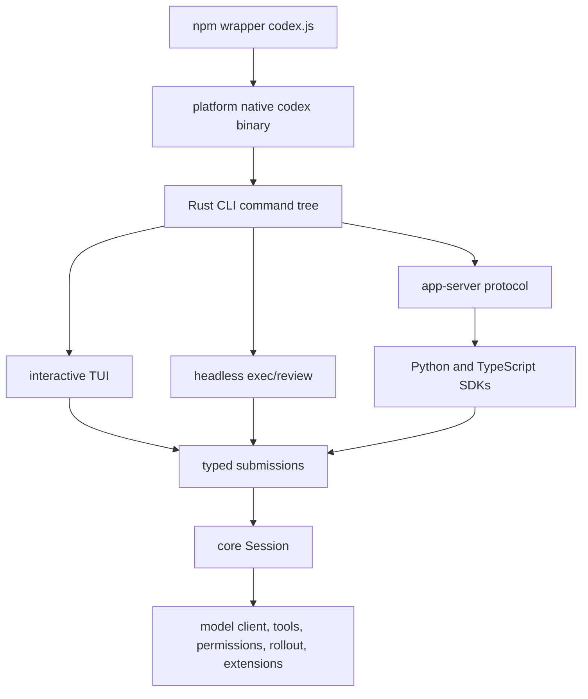
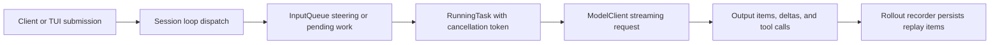
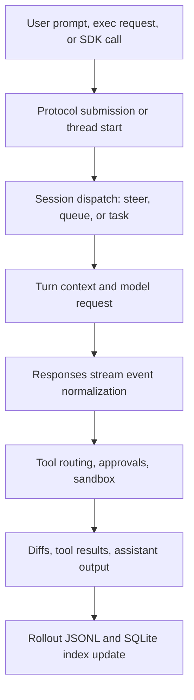
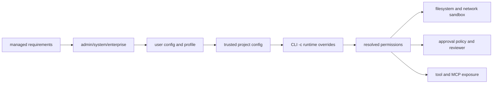
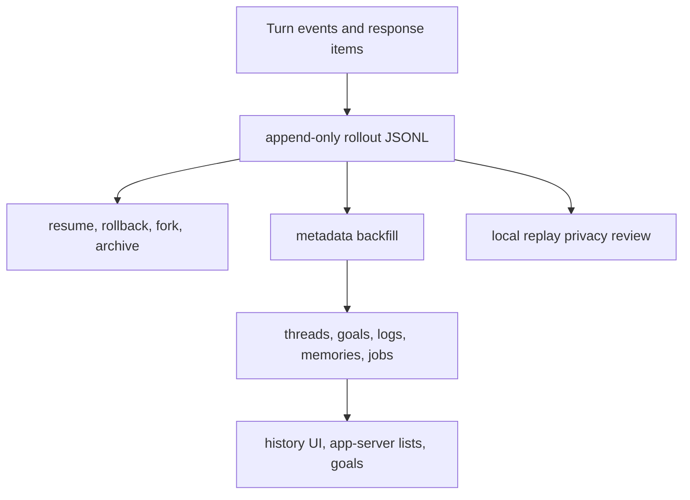
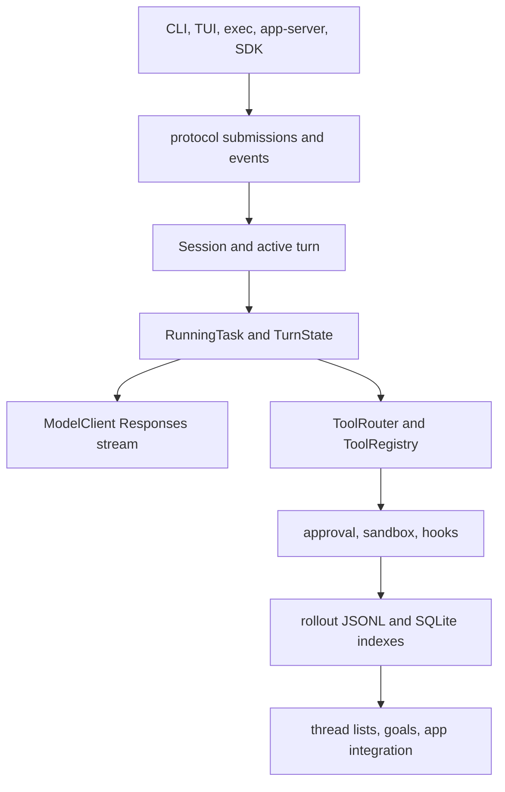
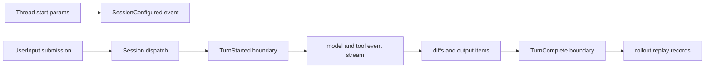
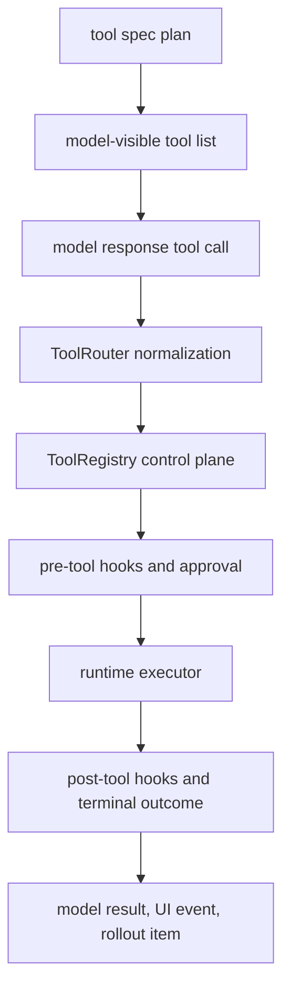

# Executive Synthesis

Codex is best understood as a Rust-native agent operating system with several user surfaces over one session core. The npm package is only the launcher; real behavior sits in Rust crates for CLI, TUI, app-server, exec, model transport, tool runtime, persistence, plugins, skills, hooks, and SDK bridge surfaces [1](#source-1) [2](#source-2). The main design move is convergence: interactive TUI, headless exec, SDK, app-server, and plugin/MCP administration reach the same typed protocol and session service layer.

The runtime mental model is "thread plus active turn plus services." A Session owns a live thread, conversation, input queue, active turn, model client, tools, permissions, and extension managers. A Codex handle sends typed submissions into the session loop, and the loop either steers current work, queues future input, or starts task kinds such as regular, review, or compaction [4](#source-4) [5](#source-5).

The tool model is stricter than a generic shell wrapper. Model-visible tool specs are generated separately from runtime executors; ToolRouter normalizes calls, ToolRegistry dispatches, hooks can block or rewrite, and unified exec/apply_patch are assessed through approval and sandbox policy [6](#source-6) [7](#source-7). The edit path is grammar-backed rather than a loose text instruction.

The security posture is policy composition. Config layers, permission profiles, approval policy, filesystem sandbox, network access, command approval rules, MCP approval templates, plugin provenance, and hook trust are separate controls that meet at tool execution time [8](#source-8) [10](#source-10). That separation is the central contributor-facing rule: do not collapse permission, approval, and isolation into one switch.

The persistence model is replay-first. Rollout JSONL is the durable record; SQLite is an index and feature store for threads, logs, goals, memories, agent jobs, and graph metadata [9](#source-9). Release shape is also explicit: Rust binaries, npm wrapper packages, Python/TypeScript SDKs, installers, workflows, checksums, and signing are visible in the repository [11](#source-11).

# Monthly Themes

## Theme 1: One Core, Many Front Doors

The repository carries many user-facing commands, but not many independent agent loops. CLI subcommands, interactive TUI, headless `exec`, app-server, SDK bridges, plugin management, MCP administration, and desktop handoff all route into protocol and session machinery [2](#source-2) [3](#source-3). This is why the topology is large without being arbitrary: surfaces are product affordances, while the session core is the architecture.

## Theme 2: Turn State Is Product State

The turn loop is not only model streaming. It is where same-turn steering, pending input, mailbox messages, compaction, cancellation, tool futures, diff emission, and rollout persistence meet [5](#source-5). The design favors explicit task state over hidden async side effects, which makes resume, rollback, and subagent coordination tractable.

## Theme 3: Extensibility Is Governed, Not Bolted On

MCP servers, plugins, apps/connectors, skills, dynamic tools, and hooks are not just discovery features. They feed into model-visible tool planning, host-side authorization, session startup, plugin cache/data directories, and app-server protocol summaries [10](#source-10). The same mechanism that makes Codex extensible also raises the importance of provenance, trust, and policy consistency.

## Theme 4: Local State Is A Replay Contract

Rollout JSONL is more important than the SQLite index. SQLite gives fast lists, goals, logs, memories, and job metadata, but recovery assumes the replay stream can rebuild enough state [9](#source-9). That makes every new persistent event a schema decision, not merely a logging decision.

# Deep Dives

## Architecture Topology: Surfaces Converge Into A Rust Session Core

### TL;DR

Codex is a layered Rust repository with an npm shim, a broad CLI command tree, a TUI, headless exec, app-server/SDK surfaces, protocol crates, core runtime crates, tool runtimes, config/permissions, rollout/state/thread store, and extension crates. The architecture is wide at the boundary and narrow at the center [1](#source-1) [2](#source-2).

### Mental model

Think of Codex as five rings. Ring one is distribution: npm wrapper, installers, release archives, and platform-native binaries. Ring two is user surface: CLI subcommands, TUI input, exec mode, app-server, SDKs, desktop handoff, and plugin/MCP commands [2](#source-2) [3](#source-3). Ring three is protocol: typed submissions, events, app-server v2 messages, model metadata, and SDK request/response types. Ring four is core runtime: Session, tasks, model client, tool router, permissions, persistence, and extensions. Ring five is host policy: filesystem roots, sandbox, approval reviewer, feature flags, auth, hooks, and managed requirements [8](#source-8).

The important design property is that each front door pays a conversion cost early, then hands typed work to the same center. That is why the npm package can stay thin while Rust crates do most of the work. It is also why SDKs can use app-server protocol instead of owning model/tool logic [3](#source-3).

### Why this matters now

A future contributor can be misled by the number of directories and commands. The safe way to modify the repository is not to start from the UI one sees first, but to identify which layer owns the behavior. CLI command spelling belongs near the Clap command tree; slash command behavior belongs in the TUI command registry; app clients belong in app-server protocol; turn semantics belong in core session/tasks; tool behavior belongs in tool executors and runtimes [2](#source-2) [6](#source-6).

This separation is especially important for app integration. The requested scope included CLI/TUI/app-server/SDK surfaces, protocol events and submissions, MCP/apps/plugins/skills/hooks, goals, subagents, notifications, and app integration. Those are not equal layers. Some are entrypoints, some are protocol, some are runtime state, and some are extension/policy surfaces [3](#source-3) [10](#source-10).

### Mechanism trace



First, the npm wrapper selects the platform binary and forwards process state [2](#source-2). Next, the Rust CLI parses global options and subcommands. When no subcommand owns the call, interactive TUI is the default; otherwise exec, review, MCP, plugin, app-server, remote-control, app, resume, fork, archive, cloud, feature, and support commands dispatch to owning modules [2](#source-2). The TUI composer and slash command dispatcher convert typed user input into submissions, while app-server and SDK clients use JSON-RPC protocol types [3](#source-3).

### Evidence map

| Surface | Owner | Design role | Security consequence |
|---|---|---|---|
| npm wrapper | Launcher script | Select native binary and forward process state | Keep argv/env/signal behavior stable |
| CLI/TUI | Rust CLI and TUI crates | Human command/input surface | Respect global options and trust prompts |
| app-server | Protocol and server crates | Desktop/SDK bridge | Keep generated protocol bindings aligned |
| core session | Core runtime | Conversation, task, tool, model, persistence owner | Single-active-task and rollout rules matter |
| tools | Tool router/registry/runtimes | Model action execution | Approval, sandbox, hook payloads must align |
| extensions | MCP/plugins/skills/hooks | Custom capabilities | Provenance and trust must survive loading |

The file inventory reinforces the map: 4,881 tracked files were inventoried, including 1,546 source files, 1,277 tests, 504 docs, 392 config/build/release files, 822 schemas, 103 scripts, 26 prompts, and 94 generated/vendor files. Vendor/generated directories were inventoried but excluded from deep reading unless they defined protocol or security contracts [1](#source-1).

### Walkthrough

Start at the launcher, then move inward. The package boundary is intentionally small: it finds a vendor binary, sets managed package metadata, and delegates execution [2](#source-2). The CLI boundary is wide: command variants cover exec, review, login, MCP, plugin, app-server, remote-control, desktop app, sandbox, apply, resume, archive, fork, cloud, exec-server, and features [2](#source-2). The app-server protocol carries thread start fields such as model, provider, cwd, workspace roots, approval policy, sandbox, permissions, instructions, environment, and dynamic tools [3](#source-3).

Once inside the session layer, topology changes from command routing to service composition. Session startup receives config, auth, model manager, exec policy, events, initial history, skills/plugins/MCP managers, extensions, thread store, and environment data [4](#source-4). That means many directories are not peer entrypoints; they are dependencies of one constructed runtime.

### Implementation notes

The CLI surface is an enum-shaped contract. A small excerpt shows the style: commands are explicit, typed, and dispatched centrally rather than discovered from arbitrary files.

```rust source="https://github.com/openai/codex/blob/e0cb4ede4e44a371d595520b29d0c80336b8733e/codex-rs/cli/src/main.rs#L119-L149"
enum Command {
    Exec(ExecCli),
    Review(ReviewArgs),
    Login(LoginCommand),
    Logout(LogoutCommand),
    Mcp(McpCli),
    Plugin(PluginCli),
    McpServer,
    AppServer(AppServerCli),
}
```

The design summary for Codex is therefore: CLI/TUI/app-server/SDK are presentation and transport surfaces; protocol events/submissions are the interop contract; Session/task/turn structures are runtime truth; ToolRouter/ToolRegistry/runtimes are the action layer; config/approval/sandbox/MCP/plugin/skill/hook systems are the guarded extension layer [4](#source-4) [6](#source-6) [10](#source-10).

### Try it yourself

In a 45 minute read-only pass, trace one new user-visible command from its CLI or slash command declaration to the exact module that owns behavior, then identify whether it touches protocol, Session, tool runtime, persistence, or extensions. Do not run the binary. The goal is to classify the change layer before writing code [2](#source-2).

### Open questions

The desktop app implementation is not fully present in this checkout, so app integration is inferred through CLI/TUI handoff, app-server protocol, and SDK bridge code. Generated protocol bindings were inventoried but not regenerated. Cloud paths and managed enterprise requirements may add deployment constraints outside this static source pass [3](#source-3).

### Sources & citations

- Repository tree at pinned commit [1](#source-1).
- CLI command and dispatch surface [2](#source-2).
- App-server thread protocol and SDK bridge [3](#source-3).

## Runtime Lifecycle: Submissions Become Tasks, Turns, Events, And Rollouts

### TL;DR

Codex runtime is a session loop plus task loop. A client sends a protocol Submission; the session loop dispatches the Op; regular work starts or steers an ActiveTurn; the turn loop streams model events, dispatches tools, emits diffs, and persists replay records [4](#source-4) [5](#source-5).

### Mental model

The smallest correct runtime model is not "prompt in, answer out." It is "submission in, state transition out." The Codex handle is compact: submission channel, event receiver, status receiver, and the session join handle. The Session is large: thread id, event sender, status, state, features, conversation, active turn, input queue, and services [4](#source-4).

ActiveTurn is the hinge. It holds a RunningTask and TurnState. RunningTask owns the spawned async task, cancellation token, task kind, context, and extension data. TurnState owns pending approvals, pending tool output, pending input, mailbox phase, permission state, and token baseline. This is why steering, cancellation, compaction, and subagent mailbox behavior can be reasoned about without guessing which async closure owns state [4](#source-4).

### Why this matters now

Most agent regressions happen when a contributor changes "one turn" but forgets resume, compaction, rollback, or notification behavior. Codex's architecture makes these linked. TurnStarted and TurnComplete affect status; model stream items affect conversation and tool dispatch; rollout items affect resume; mailbox/task events affect subagents; compaction affects future model input [5](#source-5) [9](#source-9).

### Mechanism trace



The submission loop receives protocol operations such as interrupt, user input, compact, rollback, review, and shutdown [4](#source-4). User input may steer the active turn if the task allows it; otherwise the input queue records pending work. Regular tasks emit TurnStarted, run the turn, and repeat while same-turn input remains [5](#source-5). The turn loop builds a sampling request, streams normalized response events, runs tools, drains in-flight tool futures, emits turn diffs, and returns completion or abort state [5](#source-5) [6](#source-6).

### Evidence map

| Lifecycle part | Source of truth | What to preserve |
|---|---|---|
| Session startup | Session constructor | thread id, services, config event |
| Submission routing | Protocol Op and handlers | typed dispatch and cancellation semantics |
| Active turn | TurnState and RunningTask | pending input, approvals, tool outputs |
| Model stream | ModelClient and turn loop | normalized events and usage |
| Tool side effects | ToolRouter and runtimes | terminal outcomes and diffs |
| Replay | Rollout JSONL | resume, rollback, compaction |

### Walkthrough

A fresh session creates or resumes a LiveThread, initializes the input queue, sets active_turn to none, constructs services, and emits SessionConfigured [4](#source-4). The public Codex handle spawns the session loop, then callers submit operations over a bounded channel. That loop is the only normal path from protocol to runtime mutation, which makes it a useful choke point for new operations.

Once a regular task runs, the turn loop becomes the main state machine. Before sampling it may compact context. During sampling it streams response items and text/reasoning/tool deltas. Completed output items are handled as they arrive; tool argument deltas can feed diff consumers; server model, verification, and rate-limit metadata become events; and final usage is recorded [5](#source-5).

Rollout persistence is not an afterthought. Events, response items, turn context, compacted history, user messages, and rollback boundaries are durable replay items [9](#source-9). SQLite thread metadata is useful, but the system is designed to fall back to scanning and reconstructing from rollouts.

### Implementation notes

The protocol operation enum is the front door for runtime state changes. The exact variants are more numerous than this excerpt, but the shape matters: runtime actions are typed before they reach the session loop.

```rust source="https://github.com/openai/codex/blob/e0cb4ede4e44a371d595520b29d0c80336b8733e/codex-rs/protocol/src/protocol.rs#L479-L490"
pub enum Op {
    Interrupt,
    UserInput { items: Vec<InputItem> },
    Compact,
    Shutdown,
}
```

The safe contributor rule is to avoid starting side futures that mutate session state outside this lifecycle. Use the existing task helpers, input queue, rollout recording, and event emission instead [4](#source-4) [9](#source-9).

### Try it yourself

Pick a hypothetical new Op such as "pause current turn." In 30 to 60 minutes, list every place that must change: protocol type, submission dispatch, active-turn cancellation or state, emitted events, status derivation, rollout persistence, resume reconstruction, and UI display [4](#source-4) [9](#source-9).

### Open questions

Static inspection cannot validate race behavior under cancellation, same-turn steering, and tool futures. The next verification layer should be targeted tests for interrupted tool calls, compaction during pending input, and resume after subagent mailbox events [5](#source-5).

### Sources & citations

- Session construction and service wiring [4](#source-4).
- Turn loop and streaming lifecycle [5](#source-5).
- Rollout persistence and replay model [9](#source-9).

## Tooling And Permission Model: Action Is Routed Through Policy

### TL;DR

Codex tools are governed actions. Model-visible declarations are generated from a spec plan; runtime calls pass through ToolRouter, ToolRegistry, hooks, telemetry, permission requests, sandbox assessment, and tool-specific runtimes. apply_patch is a grammar-backed edit tool; unified exec is a sandboxed command session [6](#source-6) [7](#source-7).

### Mental model

The action layer has three contracts. The model contract defines what the model can call. The runtime contract defines which executor receives the call and how the result is represented. The host policy contract decides whether the action is allowed, requires approval, must be sandboxed, or must be blocked [6](#source-6) [8](#source-8).

This division is essential because Codex supports shell commands, write-stdin, apply_patch, MCP tools, deferred/discoverable tools, plugin/app install tools, dynamic tools, and hidden compatibility tools. A single "execute tool" function would be too weak; Codex instead uses router/registry/runtime layers [6](#source-6) [10](#source-10).

### Why this matters now

Agent coding tools sit at the boundary between helpful automation and unsafe host mutation. Codex makes the boundary explicit. Approval policy is separate from sandbox mode. Workspace roots are separate from network policy. Plugin provenance is separate from tool exposure. Hook trust is separate from command execution. Those separations make the code safer but also require contributors to update several layers when changing a tool [8](#source-8) [10](#source-10).

### Mechanism trace



```mermaid
flowchart LR
  Spec["model-visible tool spec"] --> Call["response item call"]
  Call --> Router["ToolRouter normalizes"]
  Router --> Registry["ToolRegistry dispatch"]
  Registry --> Hooks["pre-tool hooks"]
  Hooks --> Policy["approval and sandbox policy"]
  Policy --> Runtime["exec, apply_patch, MCP, dynamic runtime"]
  Runtime --> Result["tool output and terminal outcome"]
  Result --> Hooks2["post-tool hooks"]
  Hooks2 --> Model["model-visible result"]
```

ToolRouter handles function calls, tool search calls, and custom tool calls, then delegates to ToolRegistry [6](#source-6). The registry handles unsupported tools, active-turn accounting, pre-tool hooks, telemetry, tool execution, post-tool hooks, and terminal outcomes. Unified exec validates command, cwd, shell, login, tty, output budgets, sandbox override, additional permissions, justification, and prefix rule fields before constructing the execution request [6](#source-6).

### Evidence map

| Mechanism | Codex design | Risk controlled |
|---|---|---|
| Tool exposure | direct, deferred, hidden, dynamic | accidental model access |
| Hooking | pre/post/permission/session events | policy integration and audit |
| Approval | on-request, never, granular, trusted modes | user consent |
| Sandbox | read-only, workspace-write, danger-full-access | host mutation and network |
| apply_patch | grammar and file change analysis | precise edits |
| Output truncation | model-visible budget and raw session state | context overload |

### Walkthrough

apply_patch is the clearest edit example. The model emits a freeform patch in a grammar, the handler parses hunks into file changes, computes affected paths and write permissions, checks environment filesystem policy, then applies through the patch runtime and lower-level patch crate [7](#source-7). Shell interception keeps legacy `apply_patch` shaped commands aligned with the custom tool path.

Config controls decide how much freedom the runtime has. The TOML schema includes approval policy, approval reviewer, shell environment policy, login-shell behavior, sandbox mode, workspace-write details, default permission profiles, named permission profiles, MCP servers, auth/OAuth settings, tools, feature flags, and web search [8](#source-8). Project-local config is constrained so untrusted project files cannot quietly redefine high-risk provider or telemetry behavior.

### Implementation notes

The edit tool's grammar-backed identity is visible even in a small excerpt: it is not merely a shell command.

```rust source="https://github.com/openai/codex/blob/e0cb4ede4e44a371d595520b29d0c80336b8733e/codex-rs/core/src/tools/handlers/apply_patch_spec.rs#L7-L14"
pub struct ApplyPatchSpec;

impl ToolSpec for ApplyPatchSpec {
    fn name(&self) -> &'static str {
        "apply_patch"
    }
}
```

How to modify this codebase safely: add or change tools only after listing model spec, registry registration, runtime, hook payloads, approval keys, sandbox inputs, TUI rendering, diff emission, persistence, and tests. For config changes, update schema, loader/overrides, managed requirements, CLI flags, and prompt instructions together [6](#source-6) [8](#source-8).

### Try it yourself

Design a new read-only tool on paper. Classify it as direct, deferred, hidden, or dynamic; define whether hooks see it; identify its permission payload; decide whether output truncation is enough; and name the tests that prove it cannot write files or request network unexpectedly [6](#source-6).

### Open questions

Runtime sandbox behavior was not executed. The static code shows policy and request construction, but platform sandboxes, network proxy behavior, and approval UI flows require separate host-specific testing [8](#source-8).

### Sources & citations

- Tool router and registry design [6](#source-6).
- apply_patch edit runtime [7](#source-7).
- Config, approval, and sandbox schema [8](#source-8).

# Skim Cards

## model_training

This lane covers model/provider/API transport rather than model research.

> **Verdict: adopt.** Keep Responses API metadata and stream normalization centralized in ModelClient; avoid per-surface model-call forks [5](#source-5).

Codex provider metadata carries base URLs, auth env keys, command auth, AWS config, wire API, retry/idle settings, WebSocket support, and OpenAI-auth requirements [8](#source-8). Each turn builds a Responses request from model capabilities, tools, reasoning, service tier, prompt cache, and metadata, then chooses HTTP SSE or provider-gated WebSocket transport [5](#source-5).

## applied_product

This lane covers persistence, thread store, goals, logging, and app/product integration.

> **Verdict: adopt.** Treat rollout JSONL as the replay contract and SQLite as rebuildable product state [9](#source-9).

Rollout JSONL stores session replay material; SQLite stores threads, logs, goals, memories, agent jobs, and spawn edges. ThreadStore bridges both worlds and flushes JSONL before SQLite metadata gets ahead [9](#source-9). This is a strong design for local-first resumability because stale indexes can be repaired from the replay stream.

## discourse

This lane covers extension and contributor surfaces.

> **Verdict: watch.** Plugins, hooks, MCP servers, and skills are powerful enough to change behavior before and after tool use [10](#source-10).

Plugin manifests can declare skills, MCP servers, apps, hooks, and interface metadata. Hook discovery merges config and plugin hooks, then enables only managed, trusted, or bypassed hooks. The contribution model is broad, so the safe modification rule is to preserve manifest path validation, hook trust hashes, MCP credential rules, and app-server protocol summaries together [10](#source-10).

# Change Maps

## Code And Repository Map

| Area | What changed for a reader | Safe owner |
|---|---|---|
| CLI/TUI | User-visible commands and prompts | CLI/TUI crates |
| Protocol | Typed submissions/events | protocol and app-server-protocol |
| Runtime | Session, tasks, turns | core session/tasks |
| Tools | Router, registry, runtimes | core tools |
| Persistence | Rollout, state, thread store | rollout/state/thread-store |
| Extensions | MCP, plugins, skills, hooks | core plugins/skills/hooks |

The map is ownership-oriented: identify the owner before editing, then verify protocol, runtime, policy, and persistence implications [1](#source-1).

## Config And Permission Map

| Config source or knob | Default or precedence | Security implication |
|---|---|---|
| `config.toml` layers | requirements, admin/system/enterprise/user/profile/project/runtime | high-risk keys denied in project-local config |
| `-c key=value` | final runtime override | powerful, TOML parsed |
| approval policy | on-request unless changed | user consent boundary |
| sandbox mode | read-only/workspace-write/full access | filesystem and network isolation |
| permission profiles | built-in plus named profiles | profile inheritance can broaden rights |
| MCP config | stdio/HTTP plus approval policy | remote tool and credential exposure |
| provider env keys | provider-defined | auth material must not be logged |
| hooks | trusted/managed/bypassed | executable policy extension |

Config ergonomics are strong because sources are typed and layered, but the number of layers makes precedence tests essential [8](#source-8).

## Build, Test, And Release Map

| Surface | Evidence | Risk |
|---|---|---|
| Rust release | workflow and binary archive scripts | signing/toolchain dependency |
| npm package | launcher and staging scripts | platform asset name drift |
| Python SDK/runtime | pyproject and release workflows | wheel/runtime coupling |
| TypeScript SDK | package metadata | generated protocol drift |
| installers | shell and PowerShell scripts | checksum and asset mismatch |
| tests | Cargo/Bazel/SDK tests | mixed ecosystem cost |

Release automation is explicit and broad, but complete verification requires CI secrets and platform toolchains that were intentionally not run in this read-only audit [11](#source-11).

# Pipeline Report

| Metric | Count |
|---|---:|
| Tracked files inventoried | 4881 |
| Source files | 1546 |
| Tests | 1277 |
| Docs | 504 |
| Config/build/release files | 392 |
| Schemas | 822 |
| Generated/vendor files skipped from deep read | 94 |
| Raw artifact records | 126 |

Candidate log: `sources/candidates.jsonl`. Manifest: `sources/manifest.jsonl`. File inventory: `file-inventory.csv`, `file-inventory.jsonl`, and `file-inventory.md`. Fanout reports are under `reviews/fanout/`, and the local evidence matrix is `verification/evidence-matrix.md`.

Deep-read coverage focused on CLI/TUI/app-server/SDK entrypoints, session/turn loop, tool execution/editing, model transport, config/security, persistence/logging, extensions, and release/test surfaces. Generated/vendor directories, especially vendored Bubblewrap content and generated schemas, were inventoried and excluded from deep reading unless they defined a first-party protocol or security boundary [1](#source-1).

## Source Visual

{width=4.80in}

The embedded image is a repository asset from the skill system. It is included to keep the handbook anchored in inspected artifacts rather than generic decoration [10](#source-10). The asset also reinforces a design point: Codex skills are file-backed packages that can include instructions, scripts, references, and assets, while the runtime controls when full skill content is injected [10](#source-10).

## Feature Catalog

| Feature surface | Primary owner | Runtime dependency | Modification risk |
|---|---|---|---|
| CLI command tree | Rust CLI | Config, TUI, exec, app-server | dispatch and option drift |
| Interactive TUI | TUI crate | protocol submissions and events | command/input state |
| Headless exec/review | exec crate | Session and tools | stdout, JSON, approvals |
| App-server and SDKs | app-server protocol | JSON-RPC bridge | generated binding drift |
| Model transport | ModelClient | provider metadata | capability mismatch |
| Tool runtime | ToolRouter and registry | approval, hooks, sandbox | unsafe side effects |
| Persistence | rollout/state/thread-store | JSONL plus SQLite | resume breakage |
| Extensions | MCP/plugins/skills/hooks | trust and provenance | executable untrusted code |

The catalog shows why Codex is easier to change when contributors start from ownership instead of directory size. A CLI spelling change is small if it stays near the parser, but a new tool or new protocol event touches model-visible schema, host policy, event streams, persistence, SDKs, and UI renderers [2](#source-2) [6](#source-6). A new extension contribution is even broader because plugin manifests, marketplace admission, cache/data paths, MCP overlays, skill loading, hook trust, and app-server protocol summaries must agree [10](#source-10).

## End-To-End Request Lifecycle

| Step | What happens | Evidence owner | Failure mode |
|---|---|---|---|
| 1 | User enters TUI text, exec prompt, SDK request, or app-server thread start | CLI/TUI/app-server | prompt source ambiguity |
| 2 | Surface normalizes input into typed submission or thread params | protocol | schema mismatch |
| 3 | Session loop dispatches Op and decides steer, queue, or start task | Session handlers | lost same-turn input |
| 4 | Task builds turn context and starts cancellable work | tasks | orphaned async state |
| 5 | ModelClient streams Responses events | client/transport | unhandled event type |
| 6 | ToolRouter builds and dispatches tool calls | tools | unsupported or unsafe call |
| 7 | Runtime emits output, diffs, and lifecycle events | tools/turn | user/model view divergence |
| 8 | Rollout recorder persists replay items | rollout/thread-store | resume or rollback gap |

The lifecycle is useful because each row has a different owner. New user input features should be checked at rows 1 through 3; new model events at rows 5 through 8; new tools at rows 6 through 8; new persistence features at rows 7 and 8 plus resume reconstruction [4](#source-4) [5](#source-5) [9](#source-9). The fastest safe review is to ask which rows the change crosses.



## Config, Environment, Flag, And Feature Reference

| Control | Discovered examples | Precedence/default | Security implication |
|---|---|---|---|
| Config files | global/user/profile/project/runtime TOML layers | high to low layer stack, runtime override last | untrusted project config is constrained |
| CLI flags | model, profile, sandbox, approval, config override, dangerous bypass | root and subcommand options merge | flags can override safe defaults |
| Approval policy | on-request, never, granular, untrusted/unless-trusted | separate from sandbox | consent is not isolation |
| Sandbox mode | read-only, workspace-write, danger-full-access | read/workspace no network by default | network and filesystem must be explicit |
| Env vars | CODEX_HOME, CODEX_SQLITE_HOME, provider env keys, bearer token env vars | provider/config scoped | tokens must stay out of logs and config |
| Feature flags | tools, web search, multi-agent version, model capabilities | config and model metadata | gated behavior can change tool surface |
| MCP config | stdio/HTTP, OAuth, tool approval policy, env bearer token | session refresh and plugin overlays | remote tool credentials and policy |
| Hooks | PreToolUse, PostToolUse, PermissionRequest, Stop, SessionStart | trusted/managed/bypassed | executable policy extension |

Config precedence is a safety feature, not just an ergonomics feature. The loader's project denylist keeps high-risk keys out of local project files, while permission profiles compile into filesystem/network policy. Dangerous bypass combines no approvals and no sandbox, so it should remain an explicit, warned path [8](#source-8). MCP bearer tokens are env-var based rather than inline, which is a concrete credential-handling rule for extension authors [10](#source-10).



## Data And State Persistence Model

Codex persists two categories of state. The first is replay state: rollout JSONL records the conversation, response items, compacted history, events, turn context, and enough metadata for resume, fork, archive, rollback, and reconstruction [9](#source-9). The second is product state: SQLite stores thread indexes, logs, goals, memories, agent jobs, spawn edges, and derived metadata. The two are intentionally not equal; SQLite can be stale or unavailable, while rollouts remain the durable compatibility artifact [9](#source-9).

Privacy follows the same split. Rollouts can contain prompts, reasoning summaries, tool calls, cwd, git metadata, tool outputs, and compacted summaries. Logs can include tracing fields. Message history has owner-only permissions but still deserves filtering review. Analytics paths attempt to reduce leakage, for example by not uploading path/line fingerprints for accepted-line analytics [9](#source-9). Any new state must declare whether it belongs in replay, index, log, analytics, or ephemeral runtime memory.



## Build, Package, Release, And Test Model

Codex has an unusually explicit release surface. The Rust release workflow validates tags, cross-compiles targets, signs or strips binaries, archives package artifacts, emits checksums, and publishes releases [11](#source-11). npm packaging stages the wrapper and platform binaries. Python runtime and SDK workflows build wheels and publish packages. TypeScript SDK metadata is present. Installer scripts download release assets and validate checksums [11](#source-11).

The test surface is correspondingly broad. There are Cargo tests, Bazel checks, SDK tests, TUI snapshots, apply_patch tests, exec policy tests, GitHub workflow scripts, and packaging checks. A contributor changing tool execution should expect tests in core tools, TUI snapshots, policy tests, and patch fixtures. A contributor changing release naming should update workflows, package staging scripts, installers, checksums, and docs together [11](#source-11).

| Test or release area | What it protects | Follow-up check |
|---|---|---|
| apply_patch tests | grammar and edit behavior | shell interception compatibility |
| exec policy tests | command approvals and dangerous behavior | sandbox retry paths |
| TUI snapshots | user-visible events and diffs | approval and MCP display |
| protocol/SDK tests | app-server contract | generated binding sync |
| release workflows | binary/package publishing | asset names and checksums |
| installer scripts | user installation path | release URL compatibility |

## How To Modify Codex Safely

Start every change with a boundary statement. If the change is a command, name the CLI/TUI owner and whether it emits a protocol Op. If it is a runtime change, name the Session, task, turn, or input queue state it mutates. If it is a tool, name the model spec, runtime executor, approval key, sandbox request, hook payload, output shape, and diff behavior. If it is persistence, name the rollout item and how resume reconstructs it [4](#source-4) [6](#source-6) [9](#source-9).

Then verify cross-surface compatibility. Interactive TUI, exec, app-server, SDK, and desktop handoff do not necessarily display errors the same way. A protocol change should include app-server and SDK review. A tool change should include headless exec and TUI transcript review. A config change should include CLI overrides, project-local restrictions, managed requirements, and prompt instructions [2](#source-2) [3](#source-3) [8](#source-8).

Finally, preserve failure semantics. Sandbox denial, missing permissions, unsupported tools, cancelled turns, failed model streams, stale SQLite indexes, plugin install rejection, and hook blocks are product behaviors. Treat each as part of the public contract, even when the code path looks like an internal error handler [5](#source-5) [10](#source-10).

## Risk And Unknowns Table

| Risk | Why it matters | Mitigation |
|---|---|---|
| Desktop internals absent | app behavior inferred through protocol and handoff | verify with app-server/app tests |
| Sandbox not executed | host-specific policy can drift | run platform sandbox tests |
| Generated bindings | protocol changes can desync SDKs | regenerate and diff bindings |
| Plugin trust | hooks and MCP can execute or expose tools | preserve provenance checks |
| SQLite fallback | stale indexes can hide resume bugs | test replay from JSONL |
| Release secrets | CI signing cannot be static-audited | keep release dry-run docs |
| Output truncation | model may miss hidden diagnostics | expose raw output paths clearly |
| Config precedence | unsafe override order can broaden access | add precedence tests |

## Required Design Summary: Codex Surfaces And Runtime Contracts

This section restates the Codex design in the exact categories future maintainers are most likely to modify. The CLI, TUI, app-server, and SDK surfaces are not four implementations of the agent. They are four ways to reach the same runtime contract. The CLI owns platform command shape and subcommand dispatch. The TUI owns interactive composition, slash-command UX, rendering, approval prompts, and status. The app-server owns typed remote/app protocol and thread lifecycle requests. The SDKs are clients of that app-server surface rather than independent model/tool runtimes [2](#source-2) [3](#source-3). This is why any new product surface should first answer whether it needs a protocol field, a new submission, a display-only event, or only a wrapper around an existing operation.

Protocol events and submissions are the repository's interop boundary. Submissions describe host-to-session intent: user input, interrupt, compaction, review, rollback, shutdown, and similar state changes [4](#source-4). Events describe session-to-host observation: session configuration, turn lifecycle, deltas, tool calls, tool outputs, diffs, approvals, rate-limit data, and terminal outcomes [5](#source-5). The design rule is that protocol should expose stable state transitions, not internal helper calls. A new event should be justified because another surface needs to render, persist, replay, or coordinate it.

The turn loop and session/task structure form the runtime spine. Session owns one active turn and its services. RunningTask owns cancellable work and task kind. TurnState owns input, pending approvals, tool output, mailbox phase, and permission state [4](#source-4). A task may be regular conversation, review, compaction, or another structured activity, but the safe path is always to make task kind explicit and let the session loop coordinate cancellation and input steering. Hidden background mutation creates resume and rollback bugs because the rollout stream cannot easily explain it afterward [9](#source-9).

The tool router, registry, and runtimes are the action contract. ToolRouter maps model response items into runtime calls; ToolRegistry handles discovery, hooks, telemetry, cancellation, and dispatch; tool runtimes perform concrete work such as exec, write-stdin, apply_patch, dynamic tools, or MCP calls [6](#source-6) [7](#source-7). The registry is therefore a policy checkpoint, not just an enum match. If a contributor adds a tool, the change is not complete until exposure, approval shape, sandbox inputs, hook payloads, output truncation, telemetry, UI rendering, and tests all match the intended risk profile [6](#source-6) [8](#source-8).

Approval and sandbox policy are deliberately independent. Approval decides whether a user or reviewer must authorize an action. Sandbox decides what the process can do if it runs. Permission profiles define filesystem and network constraints, while approval policy defines consent and prompting behavior [8](#source-8). A useful mental test is this: an approved command can still be sandboxed, and a sandboxed command can still require approval. Maintaining that distinction prevents "allowed" from being mistaken for "isolated."

MCP, apps, plugins, skills, and hooks are related but not interchangeable. MCP exposes tool servers. Plugins package contributions such as skills, hooks, MCP servers, apps/connectors, and metadata. Skills are instruction bundles whose full content is loaded selectively. Hooks are executable policy and workflow callbacks. Apps/connectors are integration surfaces exposed through plugin and app-server layers [10](#source-10). The architecture gains power from treating these as first-class runtime inputs; the security cost is that provenance, trust, path resolution, environment variables, and credential handling become part of the core system, not peripheral configuration [10](#source-10).

Persistence, thread store, rollout, and state should be read as a hierarchy. Rollout JSONL is the replay source. Thread store and SQLite indexes make local product workflows fast. Goals, subagents, memories, logs, and agent jobs are feature stores layered around the thread. Notifications and app integration consume events and indexes, but they should not become the only copy of information needed for resume [9](#source-9). When adding state, the key question is whether future replay needs it, whether listing/search needs it, or whether it is ephemeral UI-only state.



## Protocol Event And Submission Reference

| Contract element | Direction | What it means | Safe-change checklist |
|---|---|---|---|
| Thread start params | surface to app-server | initial model, cwd, roots, policy, env, dynamic tools | SDK schema and app-server sync |
| Submission Op | client to Session | mutate runtime state or enqueue work | dispatch, cancellation, rollout |
| User input items | client to Session | prompt, image/file/context payloads | steering and persistence |
| TurnStarted/TurnComplete | Session to host | visible lifecycle boundary | status, transcript, notifications |
| Model deltas | model client to host | assistant text, reasoning, tool args | rendering and truncation |
| Tool call events | runtime to host | approval, start, output, completion | policy, UI, replay |
| SessionConfigured | Session to host | resolved runtime config and capabilities | sensitive field filtering |
| Error/abort events | runtime to host | failed stream, cancelled task, blocked tool | retry and user wording |

Protocol discipline matters because Codex has multiple consumers. The TUI wants responsive display, headless exec wants stable machine output, app-server clients want JSON-RPC compatibility, SDKs want generated or mirrored types, and persistence wants enough information for replay [3](#source-3) [5](#source-5). A field that is harmless in one surface can become a compatibility break in another. The safest contributor habit is to write down whether a field is source-of-truth state, derived display state, sensitive host state, or transient progress state.

Event granularity also controls product behavior. Too few events force consumers to infer state from text; too many internal events leak implementation details and make compatibility expensive. Codex's current design mostly exposes meaningful lifecycle and action events: session configured, turn started, model output, tool activity, diffs, approval, and completion [4](#source-4) [5](#source-5). A new event should carry an ownership note: who emits it, who consumes it, whether it is persisted, and whether old clients can ignore it safely.



## Tool Router And Registry Runtime Map

The action subsystem is easier to modify when treated as two maps. The first map is model-visible: which names can the model call, under which feature gates, with which JSON schema, and in which tool mode. The second map is host-visible: which executor receives the call, which permissions are consulted, whether hooks can observe or rewrite, how output is truncated, and which event/diff records are emitted [6](#source-6). Both maps must change together.

| Tool class | Model-visible role | Runtime owner | Special review point |
|---|---|---|---|
| unified exec | shell command sessions | exec handler and sandboxing | cwd, shell, login, network, prefix rules |
| write_stdin | existing session interaction | exec session manager | session id and output budget |
| apply_patch | precise file edits | grammar spec and patch runtime | path permissions and hunk parser |
| MCP tools | external server tools | MCP manager/tool bridge | credentials and approval policy |
| dynamic tools | host/app supplied tools | dynamic registry | schema trust and cancellation |
| deferred tools | discoverable tool loading | deferred registry | accidental exposure |
| plugin/app tools | connector/plugin actions | plugin/app managers | provenance and install permissions |

The router and registry also centralize observability. If a tool fails validation, is blocked by a hook, is denied by approval, is killed by cancellation, or returns oversized output, the runtime needs a consistent terminal outcome [6](#source-6). The model sees one form of result; the user may see richer diagnostics; the rollout may persist replay data; telemetry may record an aggregate. Changing only the executor risks splitting these views.



## Module Ownership Map

| Module family | Owns | Does not own | Common unsafe edit |
|---|---|---|---|
| launcher/package | distribution entrypoint | runtime semantics | adding behavior in wrapper |
| CLI/TUI | human input and display | model/tool implementation | bypassing protocol |
| protocol/app-server | typed interop | business logic | exposing internal-only fields |
| core session/tasks | lifecycle and state mutation | platform UI | mutating state from side tasks |
| model client | request/stream transport | tool policy | per-surface model calls |
| tools | action execution | config precedence | missing hook/approval path |
| config/permissions | resolved policy | concrete side effects | assuming allow equals sandbox |
| rollout/state | durable replay and indexes | display wording | logging unreplayable state |
| plugins/skills/hooks | extension contribution | unconditional trust | loading paths without provenance |
| release scripts | package publication | source semantics | asset name drift |

This ownership map is intentionally conservative. It prevents an attractive shortcut from becoming architecture debt. For example, a TUI-only tool button may seem local, but if it invokes model-visible behavior it belongs in protocol and tools. A config key may seem harmless, but if project-local config can set it, it might become a workspace trust issue [8](#source-8). A plugin contribution may look like data, but a hook or MCP server can execute host code [10](#source-10).

## Contributor Playbooks

To add a CLI command, start with the parser and user help, then identify whether the command is a pure local utility, a TUI command, an app-server command, or a session operation [2](#source-2). If it reaches the runtime, add a protocol submission or reuse an existing one. Add display behavior for TUI/headless modes, define cancellation behavior, and decide whether the command is persisted. Do not make the CLI directly mutate session internals.

To add a protocol field, update the source type, generated bindings or SDK mirrors, app-server serialization, consumers, and compatibility notes [3](#source-3). Decide whether the field is optional for older clients and whether it contains local paths, tokens, environment data, or other sensitive host details. Add a test or fixture proving old consumers can ignore it or new consumers can reject missing data clearly.

To add a tool, write the model-facing spec first and the runtime policy second. Define whether it is read-only, write-capable, network-capable, workspace-scoped, or extension-provided. Add hook payloads, approval keys, sandbox request fields, output truncation behavior, cancellation behavior, TUI rendering, event emission, rollout implications, and tests [6](#source-6) [8](#source-8). If the tool edits files, compare it to apply_patch and justify any different grammar or permission path [7](#source-7).

To add a config key, update TOML schema, defaulting, CLI override behavior, managed requirements, project-local restrictions, docs, and prompt-facing instructions [8](#source-8). Then classify it as security-relevant or display-only. Security-relevant keys should get precedence tests and explicit reasoning about whether project config may set them. Config is not complete until runtime code consumes it from the resolved config object rather than re-reading env or files ad hoc.

To add persistence, choose between rollout, SQLite index, logs, memory, goal state, agent-job state, or ephemeral in-memory state [9](#source-9). If future resume or rollback needs it, put it in rollout. If product listing needs it, index it. If diagnostics need it, log it with filtering. Then write a reconstruction story: what happens when SQLite is stale, missing, or rebuilt from JSONL?

To add an extension type, define manifest schema, install path, cache/data path, trust model, environment handling, runtime loader, app-server summary, and removal behavior [10](#source-10). Extensions should fail closed when provenance, path, or credential requirements are unclear. Hook-capable extensions deserve extra review because they can change behavior before or after tool execution.

## Expanded Coverage And Gaps

The audit deep-read all major entrypoints and runtime owners, then sampled supporting tests, docs, scripts, generated schemas, and release files. Generated/vendor files were not ignored; they were inventoried and classified. They were excluded from deep reading only when they represented third-party payloads or generated artifacts whose source-of-truth was elsewhere. The exception was public protocol or security boundary files, which were read even if mechanically generated because consumers depend on their shape [1](#source-1).

The strongest coverage areas are CLI/TUI/app-server topology, session/turn lifecycle, tool routing, apply_patch, config/permissions, rollout/state, extension surfaces, and release automation [2](#source-2) [4](#source-4) [6](#source-6) [9](#source-9) [10](#source-10) [11](#source-11). The weakest areas are desktop app internals outside this checkout, live host sandbox behavior, cloud-managed deployment policy, and generated binding regeneration. Those are not omissions in reading; they are limits of a static repository audit under the user's no-execution constraint.

## Inspection Appendix: Inventory Interpretation

The inventory numbers are meaningful only if read by ownership layer. Codex contains many files that are mechanically generated, release-oriented, or test-supporting, so raw file count alone overstates runtime complexity. The runtime center is smaller: CLI/TUI/app-server entrypoints, protocol definitions, core session/tasks, model client, tool router/registry, config, rollout/state, and extension managers [2](#source-2) [4](#source-4) [6](#source-6) [9](#source-9) [10](#source-10). The large test, schema, and workflow footprint is still important because it shows where compatibility and release risk lives.

| Inventory class | Reader interpretation | Deep-read treatment |
|---|---|---|
| Source | first-party behavior and runtime contracts | deep-read entrypoints and core owners |
| Tests | expected semantics and regression boundaries | sampled by owning subsystem |
| Docs | user-facing contract and contributor hints | read when linked to surfaces |
| Schemas | generated or protocol-like shape | read when public contract |
| Config/build/release | operational contract | read for package/release model |
| Scripts | installer, release, helper behavior | read when user-facing or release-critical |
| Prompts | model-visible behavior | inventoried and sampled |
| Assets | product/skill visuals | included only when inspected |
| Generated/vendor | external or derived material | inventoried, excluded unless boundary-defining |

This classification also explains the fanout design. Lane 1 studied user surfaces. Lane 2 studied runtime lifecycle. Lane 3 studied tool execution and edits. Lane 4 studied model transport. Lane 5 studied config, flags, sandbox, and security. Lane 6 studied persistence and logging. Lane 7 studied extensions. Lane 8 studied tests, docs, packaging, and release. The synthesis then collapsed those lanes into three deep dives plus skim cards and change maps. That shape is deliberate: it keeps the handbook readable without hiding the raw evidence files and per-lane reports.

## Reviewer Checklist: Entry Points

Entry point review should start at distribution and move inward. First, verify that the package launcher still delegates rather than implementing runtime logic [2](#source-2). Second, verify that CLI flags and subcommands map to owning modules. Third, verify that interactive TUI behavior and headless exec behavior do not fork model/tool semantics. Fourth, verify that app-server and SDK changes are represented in shared protocol types [3](#source-3). Fifth, verify that new user-visible features emit or consume events with stable names and safe fields.

| Question | Good answer | Review smell |
|---|---|---|
| Is this only launcher behavior? | wrapper delegates to native binary | wrapper gains runtime rules |
| Is this a CLI command? | parsed and dispatched to owner | side-effect hidden in parser |
| Is this TUI-only display? | consumes existing event | mutates runtime state directly |
| Does SDK need it? | app-server protocol covers it | SDK invents separate semantics |
| Does exec need it? | structured output still works | TUI-only text becomes contract |

The practical review move is to ask what happens in the three common modes: interactive, headless, and app-server/SDK. If behavior changes in only one mode, that can be acceptable only when the feature is genuinely presentation-only. If the behavior affects model input, tools, permissions, state, or persistence, it should pass through the common protocol/session path [3](#source-3) [4](#source-4).

## Reviewer Checklist: Runtime And Turns

Runtime review should identify the exact state owner. Is the change modifying session construction, submission dispatch, input queue behavior, active-turn cancellation, turn context, model request building, tool-call handling, rollout persistence, or resume reconstruction [4](#source-4) [5](#source-5) [9](#source-9)? A change that cannot answer that question is not ready for code review because it may accidentally split runtime truth across multiple async tasks.

| Runtime state | Must stay true | Test idea |
|---|---|---|
| Session services | constructed once with resolved config | session configured event matches config |
| Input queue | same-turn steering is explicit | user input during tool call |
| Active turn | one running task owns cancellation | interrupt while streaming |
| Turn context | model request sees intended history | compact before sample |
| Tool futures | terminal outcomes are emitted | cancelled tool future |
| Rollout | replay can reconstruct state | resume from JSONL only |
| SQLite index | can lag behind replay | rebuild/backfill path |

The runtime is especially sensitive to "helpful" shortcuts. For example, directly appending a message outside Query/Session helpers may render in one surface but fail to persist or replay. Directly notifying the app without a rollout item may look correct in the moment but disappear after resume. Directly cancelling a future without setting task status may leave the UI waiting. The current structure avoids those errors by keeping submission dispatch, task state, events, and rollout close together [4](#source-4) [9](#source-9).

## Reviewer Checklist: Tools, Edits, And Host Actions

Tool review should assume that every host action has four audiences: the model, the user, the persistence layer, and the security policy. The model needs a schema and a result. The user needs a meaningful prompt, progress, and diff/output. Persistence needs replayable records. Security needs approval, sandbox, filesystem roots, network policy, hook visibility, and maybe MCP approval [6](#source-6) [8](#source-8) [10](#source-10). Missing any audience is a design bug.

| Tool review area | Required evidence | Regression to avoid |
|---|---|---|
| Model spec | name, schema, description, feature gate | invisible tool drift |
| Runtime dispatch | registry entry and handler | unsupported call at runtime |
| Approval | reviewer payload and cache key | stale approval reused unsafely |
| Sandbox | cwd, fs roots, network, shell fields | approved but unrestricted action |
| Hooks | pre/post/permission payload | extension blind spot |
| Output | truncation and raw access story | hidden failure detail |
| Diff/edit | file list and write policy | user changes overwritten |
| Persistence | events and rollout records | resume loses tool state |

apply_patch deserves special treatment. It is a structured edit language with a parser and explicit affected paths [7](#source-7). That makes it better suited for multi-hunk code edits than ordinary shell text. If a future contributor wants a second edit tool, the burden is to explain why apply_patch cannot cover the case and how the new tool will maintain equivalent permission, diff, and rollback clarity [7](#source-7).

## Reviewer Checklist: Config, Flags, And Environment

Configuration review should focus on who is allowed to set a value and when it is resolved. Codex has command-line overrides, TOML layers, profiles, project-local rules, managed requirements, provider metadata, env variables, feature flags, and dynamic runtime values [8](#source-8). A safe key has a default, a parser, a precedence rule, a trust rule, documentation, and a runtime consumer. An unsafe key lacks one of those.

| Config category | Trust question | Security implication |
|---|---|---|
| Provider/auth | can project files set it? | token routing and data exfiltration |
| Sandbox | can it be widened silently? | host filesystem/network exposure |
| Approval | can consent be bypassed? | user authorization boundary |
| Shell env | which env vars survive? | secret leakage and tool behavior |
| MCP server | where credentials live | remote tool control |
| Hooks | who trusts executable paths? | policy mutation |
| Feature flags | who turns tools on | hidden capability exposure |
| Profiles | inherited defaults | broad rights through aliases |

The rule "approval is not sandbox" should appear in every config review. A user may approve an operation while still expecting workspace-write confinement. Conversely, a sandboxed command may still require approval because the action is surprising or destructive within the workspace [8](#source-8). Config changes should be tested in at least default, project-local, profile, CLI-override, and managed-policy cases.

## Reviewer Checklist: Extensions

Extension review should use the threat model of active code. A skill file is instruction content but can influence model behavior. A hook can execute host-side commands. An MCP server can expose tools. A plugin can bundle all of those plus app/connector metadata [10](#source-10). The loader therefore needs path validation, manifest validation, install provenance, cache/data directory rules, environment handling, and trust checks.

| Extension surface | Primary risk | Reviewer question |
|---|---|---|
| MCP server | remote/external tool execution | how are approval and credentials scoped |
| Plugin | bundled capabilities | how is provenance tracked |
| Skill | prompt/context injection | when is full content loaded |
| Hook | executable side effect | who trusts the hook |
| App/connector | external workspace access | what user consent is required |
| Marketplace/cache | stale or tampered install | how is update/removal handled |
| Dynamic tool | host-supplied schema | who vouches for schema and runtime |

Extension changes should also be reviewed from the app-server perspective. If a plugin adds a capability that the desktop app or SDK needs to display, the protocol summary must expose enough metadata without leaking sensitive local paths or credentials [3](#source-3) [10](#source-10). If a hook can block or rewrite tool calls, the tool registry and UI must show a terminal outcome that the user can understand [6](#source-6).

## Reviewer Checklist: Persistence, Goals, Subagents, And Notifications

Goals, subagents, notifications, and app integration are state features layered around the thread. They work only if the replay/index split remains clear [9](#source-9). A subagent spawn, task update, goal change, notification, or app-visible thread update should have a durable source of truth when it affects resume. If the state is only a live notification, it should be safe to lose after restart.

| Feature | Durable requirement | App/user requirement |
|---|---|---|
| Goals | state store plus thread association | current status and completion |
| Subagents | spawn/job metadata and mailbox history | parent/child visibility |
| Notifications | event or state source | no duplicate stale alerts |
| Thread lists | index backed by rollout | fast list and recovery |
| Logs | filtered diagnostics | no secret/path overexposure |
| Memory | explicit store | clear provenance and update path |
| Rollback/fork | replay boundary | predictable branch history |

A useful safety test is "delete the index, keep the rollout." The system should still recover enough history to make thread resume meaningful [9](#source-9). Another test is "replay without the UI." The core should not depend on a desktop notification to know what happened. These tests keep product state from becoming invisible runtime state.

## Contributor Scenario: Add A New MCP Tool Type

Suppose a contributor wants a new MCP-hosted tool class. The implementation plan should start with manifest/schema metadata, then server config, approval policy, environment variables, credential handling, registry exposure, and model-visible schema [10](#source-10). Next, define how the tool appears in TUI and app-server summaries, whether hooks see it as an MCP call or a first-party call, what cancellation means, and how output is truncated [6](#source-6). Finally, define tests for denied approval, missing credential env var, failed server startup, oversized output, and resume after tool completion.

The anti-pattern is to treat MCP as "just another tool call." MCP changes trust boundaries because tool behavior lives outside the core binary. That does not make it unsafe by default, but it means provenance, approval, and credential scope are central. The tool registry should preserve enough identity to explain which server and tool ran, while avoiding leakage of secrets in user-visible or persisted output [6](#source-6) [10](#source-10).

## Contributor Scenario: Change Release Asset Names

Release asset naming touches more than workflows. The npm wrapper, package staging, installers, release archive scripts, checksums, signing, platform detection, and documentation may all assume names or target triples [2](#source-2) [11](#source-11). A safe change starts with an inventory of every consumer of the asset name, then updates all consumers in one change. The test plan should include dry-run packaging, installer URL construction, checksum file names, and platform lookup.

This scenario is included because release bugs often bypass normal unit tests. The runtime may remain correct while users cannot install or update it. Codex's visible release workflows and installers are a strength, but only if contributors treat them as part of the product contract [11](#source-11).

## Failure Mode Index

This index is a practical bridge between architecture and day-to-day maintenance. It lists common ways a Codex change can fail even when the immediate code path looks correct. The point is not to make every small change heavyweight; it is to help reviewers decide quickly which surrounding contracts need attention.

| Failure mode | Usual cause | Where to look |
|---|---|---|
| Interactive works, exec fails | display path used as runtime contract | CLI, TUI, exec, protocol |
| SDK breaks after event change | app-server type changed without client update | protocol and SDK bridge |
| Resume loses action | state was emitted but not rolled out | session, turn, rollout |
| Tool appears but cannot run | spec exposure and registry disagree | router, registry, runtime |
| Tool runs unsafely | approval and sandbox inputs incomplete | config, exec policy, sandbox |
| Hook blocks silently | terminal outcome not rendered | registry, TUI, events |
| Plugin works locally only | manifest/path/provenance assumption | plugin loader and app-server summary |
| Release installs wrong binary | artifact name mismatch | package staging and workflows |

The safest review shortcut is to ask whether the failure would be visible immediately, after restart, in another surface, or only during release. Immediate failures are usually caught by unit tests. Restart failures require rollout/replay tests [9](#source-9). Cross-surface failures require protocol and TUI/exec/app-server checks [3](#source-3). Release failures require workflow and installer review [11](#source-11). Codex has enough structure to support all four, but the reviewer must pick the right class.

## End-To-End Modification Scenarios

Scenario one: add a new turn-level notification. The owner is not the notification UI; it is the event and state boundary. The change needs an event shape, emission point in session or turn logic, optional rollout item if resume needs it, TUI rendering, app-server compatibility, and SDK consideration [3](#source-3) [4](#source-4) [5](#source-5). If the notification is derived from existing persisted state, it may not need new rollout. If it represents new state, it probably does.

Scenario two: add a new approval reviewer mode. The owner is config and policy, but the change crosses tools. It needs TOML schema/defaulting, CLI override behavior if exposed, managed-policy implications, approval request payloads, approval cache key review, TUI wording, app-server messages, and negative tests for denied or stale approvals [6](#source-6) [8](#source-8). It should also state how the mode behaves with read-only, workspace-write, and full-access sandbox modes.

Scenario three: change prompt or skill injection. The owner is the skill/prompt subsystem, but runtime effects appear in model requests. The change needs skill discovery/loading review, prompt composition order, token-budget behavior, enablement rules, provenance, and tests showing that inactive skills are not injected [10](#source-10). If the change affects model-visible tool instructions, tool specs and prompt text must be reviewed together [6](#source-6).

Scenario four: modify compaction. The owner is the turn/session lifecycle and persistence. The change must preserve user messages, tool results, reasoning summaries, rollback boundaries, and resume reconstruction [5](#source-5) [9](#source-9). Compaction is not only a token-budget feature; it is a historical rewrite in the replay stream. A safe change includes before/after transcript fixtures and at least one resume test from a compacted conversation.

Scenario five: add a new release target. The owner is release automation, but product users experience it through install/update. The change needs target triple naming, archive naming, installer lookup, checksum generation, signing or stripping rules, npm package staging if relevant, and platform documentation [2](#source-2) [11](#source-11). A release-only change can still break the CLI if the wrapper cannot find the expected binary.

## Evidence Reading Guide

The report cites public URLs in the PDF, while local evidence matrices preserve exact file and line references for audit reproducibility. That split is intentional. Public URLs make the PDF portable and stable for readers. Local file-line evidence makes the workspace audit verifiable without filling the prose with machine-specific paths. If a later reader wants to validate a claim, start with the Citation Appendix for public context, then use the evidence matrix for exact local line references.

| Reader task | Best artifact | Why |
|---|---|---|
| Understand architecture | PDF or Markdown book | narrative and diagrams |
| Verify a claim | evidence matrix | exact file-line references |
| Review raw coverage | file inventory and candidates | full repository scope |
| Audit subagent output | fanout reports | lane-specific findings |
| Rebuild the draft | generator script and manifest | reproducibility |
| Compare systems | design summary | cross-repo tradeoffs |

The strongest claims in the Codex book have three layers: narrative explanation, public citation, and local evidence. Examples include session construction, turn loop behavior, tool registry dispatch, apply_patch, config/security, rollout persistence, extension loading, and release automation [4](#source-4) [5](#source-5) [6](#source-6) [7](#source-7) [8](#source-8) [9](#source-9) [10](#source-10) [11](#source-11). Weaker claims are explicitly labeled as inferred or degraded, especially desktop app internals and live sandbox behavior.

## Safety Boundaries For Future Contributors

The highest-value safety boundary is "all host mutation passes through tools and policy." A contributor should not add filesystem writes, process execution, network access, plugin loading, or credential use in a UI helper or parser callback. Those actions belong behind tool runtimes, config, approval, sandbox, hooks, and events [6](#source-6) [8](#source-8). This keeps permissions understandable and keeps headless/app-server behavior from diverging.

The second boundary is "all replay-critical state passes through rollout." If a future conversation needs the state to resume, fork, rollback, or reconstruct, it belongs in the replay stream or in a rebuildable index derived from it [9](#source-9). A local SQLite row without a rollout source may make the current UI faster but can become a recovery liability. Conversely, not every UI detail belongs in rollout; ephemeral progress can stay ephemeral if losing it after restart is acceptable.

The third boundary is "extension code is active." Skills affect prompts, hooks affect tool execution, MCP servers affect capabilities, plugins can combine multiple contribution types, and apps/connectors can reach external workspaces [10](#source-10). The loader, manifest, trust, and path rules are therefore part of the security model. Contributors should review extension features with the same seriousness as first-party tools.

The fourth boundary is "protocol is a product contract." Once a field or event is consumed by TUI, exec, app-server, SDK, desktop, or persisted replay, it is no longer a private helper [3](#source-3). Versioning, optional fields, old-client behavior, and sensitive data filtering matter. That is why protocol changes should have a compatibility note even when the Rust compiler accepts the change.

## Expanded Test Coverage Map

A future test plan can use this coverage map as a backlog. It is intentionally framed around behaviors rather than file names.

| Behavior | Existing confidence from source | Highest-value new test |
|---|---|---|
| CLI dispatch | high | command matrix with global options |
| TUI event rendering | medium | approval/tool/diff snapshots |
| app-server compatibility | medium | thread-start and event schema fixtures |
| Session cancellation | medium | interrupt during tool and stream |
| Same-turn input | medium | prompt while tool is running |
| apply_patch | high | multi-file permission edge cases |
| MCP approval | medium | denied/allowed server tool calls |
| Plugin hooks | medium | trusted/untrusted hook execution |
| Rollout reconstruction | high concept, medium test | resume from JSONL after compaction |
| Release assets | medium | installer dry-run against staged names |

The test map also shows where static analysis cannot finish the job. Host sandboxes, shell behavior, filesystem permission details, network blocking, and installer behavior depend on platform execution. Those were intentionally not run in this audit, but they are exactly the next tests to run in a normal engineering environment [8](#source-8) [11](#source-11).

## One-Page Verification Playbook

For a future Codex contributor, a compact verification pass should combine static and runtime checks. Static checks should confirm ownership and schema alignment before any binary runs. Runtime checks should then exercise only the surfaces affected by the change. For example, a config-only change needs loader, precedence, and permission tests, not a full TUI run. A tool-runtime change needs approval, sandbox, hook, output, and persistence tests in both interactive and headless contexts [6](#source-6) [8](#source-8). A protocol change needs app-server and SDK compatibility tests before product UI polish [3](#source-3).

| Change type | Minimum static check | Minimum runtime check |
|---|---|---|
| CLI option | parser, help, config mapping | command invocation with override |
| Protocol field | type, serialization, SDK mirror | old/new client fixture |
| Turn lifecycle | task owner and event ordering | interrupt/resume scenario |
| Tool executor | spec, registry, policy payload | approval plus denied sandbox case |
| apply_patch behavior | grammar and affected paths | multi-hunk edit and stale conflict |
| MCP/plugin | manifest, trust, env handling | disabled, approved, and denied load |
| Rollout state | replay item and reconstruction | resume from JSONL |
| Release asset | workflow, installer, package map | staged install dry run |

The order of checks matters. Run schema and ownership checks first because they catch design drift cheaply. Then run unit tests for the owning crate or package. Then run integration checks for the affected surface. Finally, run release or installer checks only when artifact naming, package boundaries, or platform targets changed [11](#source-11). This order keeps verification proportional while still respecting Codex's cross-surface architecture.

A good review note should include four lines: the owner changed, the contracts touched, the tests run, and the residual risk. For example: "ToolRegistry and unified exec changed; touched approval payloads, sandbox request fields, TUI output, and rollout events; ran policy and exec tests; residual risk is platform-specific sandbox behavior." This format forces the reviewer to look beyond the immediate function while avoiding vague claims of broad coverage [6](#source-6) [8](#source-8) [9](#source-9).

## Final Codex Design Takeaway

Codex's design is strongest when treated as a layered contract: distribution launches one binary, surfaces translate user intent into protocol, Session owns runtime truth, ToolRouter/ToolRegistry own actions, config/approval/sandbox own host policy, rollout owns replay, and extensions enter through managed loaders [2](#source-2) [3](#source-3) [4](#source-4) [6](#source-6) [8](#source-8) [9](#source-9) [10](#source-10). The repository is large, but the modification rule is compact: find the owner, preserve the adjacent contracts, and test the mode that would otherwise fail silently.

# Month-Ahead Queue

1. Add targeted runtime tests for cancellation during in-flight tool execution, compaction with pending input, and resume after subagent mailbox notifications [4](#source-4).
2. Build a protocol compatibility checklist for every app-server or SDK event change [3](#source-3).
3. Create a security review template for new tools that covers spec exposure, hooks, approval keys, sandbox inputs, and output truncation [6](#source-6).
4. Audit generated schema regeneration steps and document which files are source-of-truth versus generated artifacts [11](#source-11).
5. Add a contributor guide that starts from the ownership map in this book rather than from directory names [1](#source-1).

# Errata

- Static source audit only. No repository code, test suite, package script, MCP server, desktop handoff, or downloaded dependency was executed.
- Desktop app internals beyond CLI/TUI handoff and app-server protocol were not fully present in the inspected checkout.
- Vendor/generated files were inventoried but not deeply read except where they described a first-party boundary.

# Citation Appendix

### [1] OpenAI Codex repository at pinned commit {#source-1}

https://github.com/openai/codex/tree/e0cb4ede4e44a371d595520b29d0c80336b8733e

### [2] Codex Rust CLI command surface {#source-2}

https://github.com/openai/codex/blob/e0cb4ede4e44a371d595520b29d0c80336b8733e/codex-rs/cli/src/main.rs

### [3] Codex app-server thread protocol {#source-3}

https://github.com/openai/codex/blob/e0cb4ede4e44a371d595520b29d0c80336b8733e/codex-rs/app-server-protocol/src/protocol/v2/thread.rs

### [4] Codex Session construction {#source-4}

https://github.com/openai/codex/blob/e0cb4ede4e44a371d595520b29d0c80336b8733e/codex-rs/core/src/session/session.rs

### [5] Codex turn loop {#source-5}

https://github.com/openai/codex/blob/e0cb4ede4e44a371d595520b29d0c80336b8733e/codex-rs/core/src/session/turn.rs

### [6] Codex tool router {#source-6}

https://github.com/openai/codex/blob/e0cb4ede4e44a371d595520b29d0c80336b8733e/codex-rs/core/src/tools/router.rs

### [7] Codex apply_patch handler {#source-7}

https://github.com/openai/codex/blob/e0cb4ede4e44a371d595520b29d0c80336b8733e/codex-rs/core/src/tools/handlers/apply_patch.rs

### [8] Codex config schema {#source-8}

https://github.com/openai/codex/blob/e0cb4ede4e44a371d595520b29d0c80336b8733e/codex-rs/config/src/config_toml.rs

### [9] Codex rollout recorder {#source-9}

https://github.com/openai/codex/blob/e0cb4ede4e44a371d595520b29d0c80336b8733e/codex-rs/rollout/src/recorder.rs

### [10] Codex plugin manifest and extension system {#source-10}

https://github.com/openai/codex/blob/e0cb4ede4e44a371d595520b29d0c80336b8733e/codex-rs/core-plugins/src/manifest.rs

### [11] Codex Rust release workflow {#source-11}

https://github.com/openai/codex/blob/e0cb4ede4e44a371d595520b29d0c80336b8733e/.github/workflows/rust-release.yml
