# Executive Synthesis

The six-month shift is from answer production to evidence control. EMB-S, DocSeeker, SPD-RAG, BRTR, CUE-R, CiteRAG, and Reducto's citation docs all point at the same failure mode from different levels: a system can sound correct while retrieving the wrong document, missing one required source, losing page/cell coordinates, or citing evidence that does not support the field. The stack upgrade is to treat evidence access, evidence use, and citation support as separate logged contracts, not as a byproduct of final JSON generation. [2](#source-2) [26](#source-26) [9](#source-9) [7](#source-7) [22](#source-22) [73](#source-73) [81](#source-81)

Agentic retrieval is becoming a control problem, not a synonym for "LLM plus search." RAGSearch asks where structure should live between online control and offline GraphRAG; SPD-RAG gives each document its own worker and synthesizes local findings; CORPUS2SKILL compiles enterprise corpora into navigable files; adaptive routing sends cross-reference questions to structural traversal. For this stack, the default should be dense and exact search plus trajectory evaluation, with graph/navigation/worker fan-out triggered by recurring evidence misses rather than by architecture fashion. [21](#source-21) [9](#source-9) [28](#source-28) [25](#source-25)

Document and spreadsheet agents need artifact-state verification. Spreadsheet-RL trains against final workbooks in a real Excel environment; BRTR indexes row, column, window, and image chunks while preserving traceability; AutoSAM pauses at a YAML-like intermediate representation before solver syntax; Reducto's spreadsheet parser/viewer exposes table-boundary, formula, hidden-content, row/column, and overlay contracts. That is a stronger production pattern than "convert everything to Markdown and hope retrieval works": keep Markdown as a readable IR, but attach typed spans, workbook coordinates, parse policy, and verifier state. [83](#source-83) [7](#source-7) [78](#source-78) [84](#source-84) [82](#source-82)

The runtime layer is hardening into an agent operating system. MCPServerManager handles server lifecycle, partial availability, reconnects, and cleanup affinity; tool guardrails move policy into `function_tool`; Codex safety and Windows sandboxing show sandbox/network/approval/telemetry boundaries as first-class system features; the OpenDev harness paper decomposes scaffolding, context refresh, tool schemas, compaction, reminders, and process execution. The system to build is not a single prompt but a logged runtime where tool availability, sandbox state, trace spans, and confidence gates are observable. [45](#source-45) [38](#source-38) [64](#source-64) [63](#source-63) [92](#source-92)

Evaluation and observability are converging around traces. LangSmith shows OpenAI Agents SDK and OpenTelemetry trace routing; Braintrust fetches preprocessed threads inside scorers; Langfuse scores individual observations; Phoenix packages a correctness evaluator; OpenTelemetry adds server-tool-call envelopes; AgentTrace turns execution logs into causal graphs for root-cause analysis. The month-ahead work is to make every field answer evaluable from its trace: which tools ran, which ranges were browsed, which citations survived conversion, which confidence bucket fired, and which verifier accepted or rejected the output. [58](#source-58) [62](#source-62) [75](#source-75) [74](#source-74) [69](#source-69) [76](#source-76) [13](#source-13)

Ranking formula retained for auditability: $U = 0.55R + 0.25G + 0.20D$, where the final composition prioritized direct leverage for the current system, grounding strength, and implementation inspectability over release hype or generic RAG tutorials.

# Monthly Themes

## 1. Evidence Sufficiency Became the Center of Gravity

The best sources separate evidence access from answer use. EMB-S makes hard negatives and all-evidence retrieval visible; DocSeeker optimizes evidence-page localization directly; CUE-R perturbs retrieved items to expose dependence; Reducto citations attach coordinates, confidence, and parent context to extracted values. The upgrade is to score retrieval sufficiency before scoring the answer, especially for multi-document fields and spreadsheet-derived values. [2](#source-2) [26](#source-26) [22](#source-22) [81](#source-81)

## 2. Structure Moved Between Offline Indices and Online Agents

The retrieval architecture debate is no longer dense RAG versus GraphRAG. RAGSearch tests common agent control over dense and graph backends; SPD-RAG decomposes by document; CORPUS2SKILL turns a corpus into navigable files; linked-memory and query-routing work point toward typed structures that agents can inspect. The practical answer is workload-specific: start with simple retrieval, then add structure where trace failures show repeated multi-hop, cross-reference, or topic-routing misses. [21](#source-21) [9](#source-9) [28](#source-28) [12](#source-12) [25](#source-25)

## 3. Spreadsheets Stopped Being "Just Tables"

Spreadsheet sources converged on file-native state: BRTR uses row/column/window/image handles and planner-executor workflows; Spreadsheet-RL trains agents through Excel and oracle workbook comparison; Reducto's parser and viewer expose clustering, row chunks, formulas, colors, hidden content, and clickable cell-region overlays. The stack implication is that Excel subagents should return workbook coordinates, formula visibility, parse policy, and verifier outcomes alongside values. [7](#source-7) [83](#source-83) [84](#source-84) [82](#source-82)

## 4. Harness Quality Became a Systems Problem

MCP lifecycle, provider capability gates, tool guardrails, typed subagent roles, Windows sandbox users, Codex telemetry, and interpreter middleware all show the same direction: agent quality depends on explicit runtime contracts. The prompt is only one layer; tool schemas, server state, sandbox principals, approval policy, trace export, and executable interpreter state determine whether an agent can work repeatedly without losing control boundaries. [45](#source-45) [31](#source-31) [38](#source-38) [44](#source-44) [63](#source-63) [64](#source-64) [56](#source-56)

## 5. Evals Moved Into the Trace Pipeline

The strongest eval/observability evidence says scoring should attach to production-like traces instead of separate notebooks. OpenTelemetry and LangSmith route spans to experiment rows, Braintrust makes thread context available to scorers, Langfuse queues observation-level judges, Phoenix packages evaluator configs, and AgentTrace adds post-hoc causal analysis over execution logs. This supports a field-level eval harness where scoring reads the same artifacts, spans, and citations that operators debug. [62](#source-62) [75](#source-75) [74](#source-74) [69](#source-69) [13](#source-13)

# Deep Dives

## Evidence Sufficiency: Beyond the Needle's Illusion: Decoupled Evaluation of Evidence Access and Use under Semantic Interference at 326M-Token Scale

### TL;DR

- EMB-S turns Needle-in-a-Haystack from benign span localization into a semantic discrimination benchmark by adding semantically close, constraint-violating near-miss negatives. [2](#source-2)
- The benchmark separates evidence access from evidence use with document-ID localization before full-context QA, so a bad answer can be traced to retrieval, partial multi-document access, distraction by hard negatives, or answer synthesis. [2](#source-2)

### Mental model

Think of EMB-S as an access/use microscope for long-context and RAG systems. Standard NIAH makes the target nearly unique, so the model can win by finding a conspicuous string; EMB-S makes the system choose the exact evidence under semantic interference, where distractors overlap, paraphrase, or satisfy part of the query while violating a constraint. [2](#source-2)

### Why this matters now

Agent memory and enterprise search failures often look like "the model reasoned badly" when the system actually failed earlier: it retrieved the wrong document, retrieved only one item from a multi-document RefList, or accepted a hard negative that was semantically close but constraint-wrong. EMB-S gives those cases separate names and metrics through evidence access versus evidence use. [2](#source-2)

### Mechanism trace

EMB-S starts by standardizing heterogeneous long-context benchmark items into query, answer, and reference-document fields, then screens out ambiguous or unsupported items. It then deliberately creates multi-source evidence needs through RefDoc atomization and retrieval-guided query rewriting, so the answer depends on more than one document. [2](#source-2)

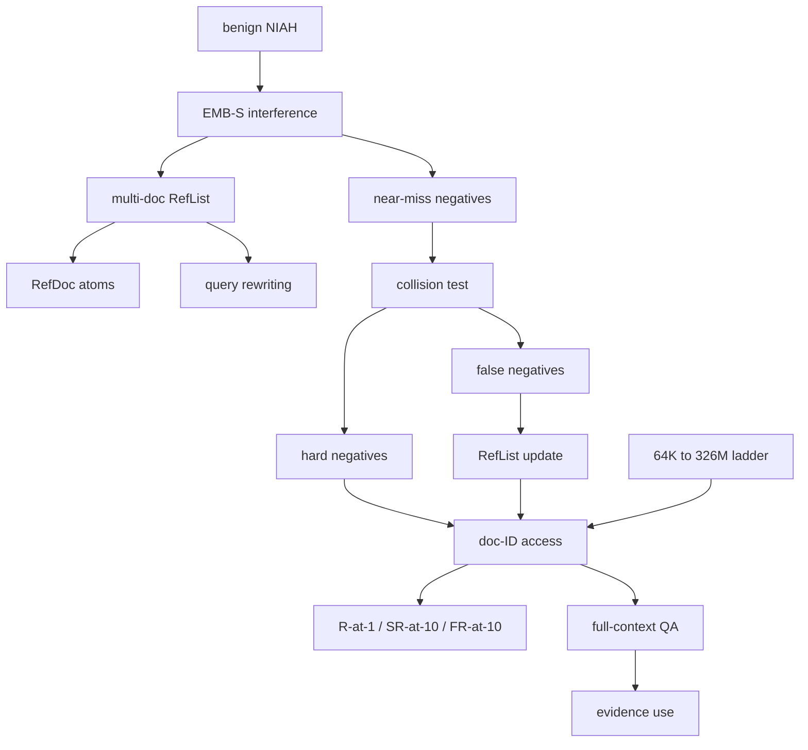

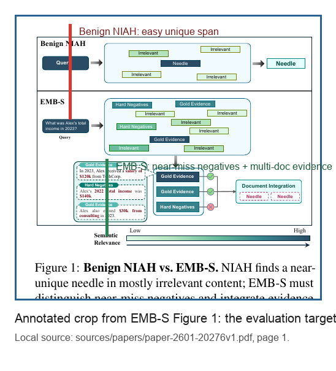{width=4.6in}

Caption: The crop highlights the paper's actual contrast between benign NIAH retrieval and EMB-S: the benchmark injects semantically close near-miss documents and multi-document evidence, so evidence access has to be scored before answer quality. [2](#source-2)

### Evidence map

| Claim | Evidence | Sufficiency note |
|---|---:|---|
| EMB-S is an adversarial NIAH-style benchmark over a 326M-token MemoryBank with collision-tested hard negatives, multi-document evidence, and separate access/use reporting. | [2](#source-2) | The read report ties the abstract, construction method, and experiment setup to the same benchmark identity. |
| The corpus starts from nine public long-context datasets and becomes a 326M-token, 160,280-document MemoryBank. | [2](#source-2) | This is a dataset-construction claim backed by the report's method inventory. |
| The final query set is 483 collision-tested and LLM-verified queries after aggregation, human screening, synthesis, deduplication, and difficulty calibration. | [2](#source-2) | The table inventory gives the stage counts and final benchmark size. |

### Walkthrough

The inspected artifact set for this source included the saved paper PDF and a line-anchored text extraction; the PDF metadata reported 11 A4 pages, and the text extraction had 1,933 lines. The read report uses the extraction for stable evidence refs because the two-column extraction can interleave neighboring content. [2](#source-2)

The document structure is clean: abstract and introduction define adversarial NIAH, EMB-S, near-miss negatives, document-ID localization, and access/use decoupling; dataset construction defines MemoryBank, query/evidence schema, three-stage construction, and the corpus ladder; experiments split retrieval evidence access from full-context QA; limitations cover benchmark compactness, ID-interface calibration, model dependence, and efficiency omissions. [2](#source-2)

### Implementation notes

For a DeepBrief-style evaluator, the adaptation is to make the evidence contract explicit before judging answers: require document-ID localization, record retrieved IDs, score R-at-1/SR-at-10/FR-at-10, and only then evaluate answer quality. This mirrors the paper's access/use split and avoids treating a plausible answer as proof that the right evidence was found. [2](#source-2)

```yaml source="/Users/liuzikai/Documents/GitHub/deepbrief/artifacts/sixmonth-agent-search-2025-12-12_2026-06-12/reviews/subagents/read-paper-2601-20276v1.md:41-43"
emb_s_access_contract:
  evidence_surface: document-ID localization
  retrieval_metrics:
    R-at-1: single-source top-rank indicator
    SR-at-10: overlap recall between retrieved IDs and gold IDs
    FR-at-10: all reference documents must appear in top 10
  strict_id_matching: no credit for semantically similar hard negatives
```

### Try it yourself

In 30-60 minutes, take ten multi-document questions from an internal corpus and build a miniature EMB-S-style access test. For each question, list the exact gold document IDs, add one near-miss negative that overlaps semantically but violates a year, entity, number, or other constraint, and score a retriever with both SR-at-10 and FR-at-10. [2](#source-2)

### Open questions

- Does EMB-S release the 326M-token MemoryBank, the 483 final queries, RefLists, hard negatives, and collision labels in a reproducible form with license and schema details? [2](#source-2)
- How sensitive are the results to the mining model, given that Qwen3-Embedding-8B is used for collision testing and difficulty calibration and is also one of the evaluated retrievers? [2](#source-2)

### Sources & citations

- [2](#source-2) Primary source for this dive: the EMB-S paper's benchmark construction, semantic interference mechanism, document-ID localization, context-length ladder, retrieval metrics, numeric retrieval results, QA caveats, and limitations.
- [2](#source-2) Method and mechanism evidence: standardized query/answer/reference-document schema, RefDoc atomization, retrieval-guided query rewriting, collision testing, hard negatives, false negatives, and RefList promotion.
- [2](#source-2) Results evidence: R-at-1/SR-at-10/FR-at-10 retrieval, FR-at-10/all-evidence collapse under 326M-token distractor injection, reranking partial mitigation, and full-context QA only where the window fits.
- [6](#source-6), [22](#source-22), and [73](#source-73) are assignment-supplied supporting registry links for adjacent context; the EMB-S-specific claims above are grounded in [2](#source-2).

## Page-Grounded Document Reasoning: DocSeeker: Structured Visual Reasoning with Evidence Grounding for Long Document Understanding

### TL;DR

- DocSeeker turns long-document visual QA into page-grounded reasoning by interleaving page identifiers with each page's visual tokens, so the model has stable handles for the evidence it later names. [26](#source-26)
- Its output contract is Analysis-Localization-Reasoning: question analysis, evidence localization, reasoning process, evidence pages, and final answer, rather than a plain answer or unconstrained chain of thought. [26](#source-26)

### Mental model

Think of DocSeeker as a visual document reader trained to perform its own page search before answering. The core move is not an external OCR parser, a mandatory retriever, or a separate compressor; it is a page-aware input representation plus an output schema that makes the model say which page identifiers support the answer. [26](#source-26)

### Why this matters now

Long-document VQA has a low signal-to-noise problem: the relevant visual evidence is buried among many irrelevant pages, and ordinary short-answer labels do not teach a model how to find the page or explain why that page matters. DocSeeker attacks that problem by giving page identifiers to visual spans and forcing the output through a locate-then-reason contract. [26](#source-26)

### Mechanism trace

DocSeeker's mechanism has three coupled surfaces: a page-aware input, an ALR output, and a training objective that directly scores evidence localization. The student model sees complete documents during SFT, while the teacher distillation step uses minimal context made of known evidence pages, distractors, page IDs, and the question. [26](#source-26)

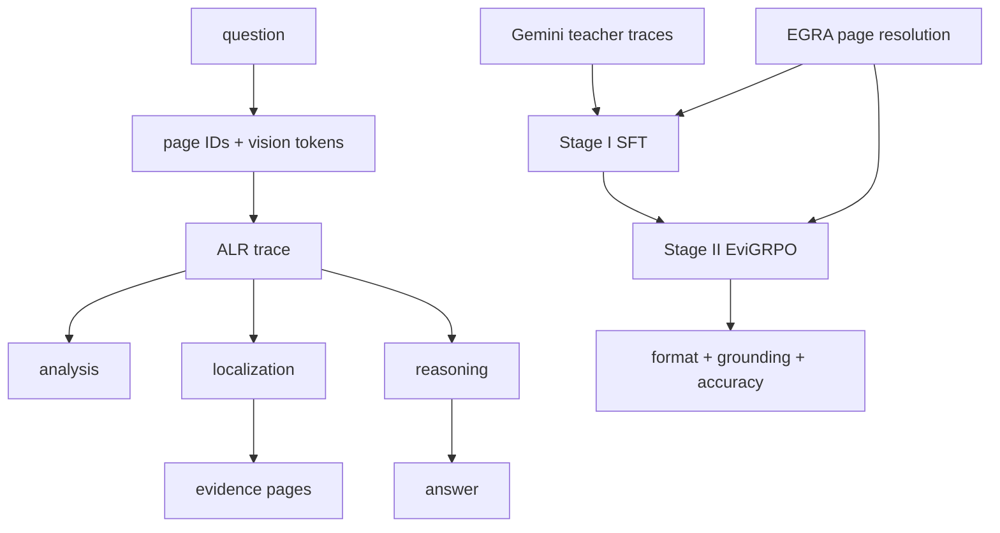

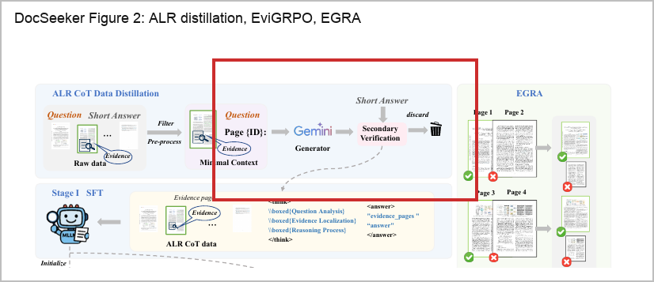{width=4.6in}

Caption: The paper's training schematic shows the concrete contract to copy: ALR trace distillation creates page-grounded supervision, EviGRPO rewards both evidence and answer quality, and EGRA keeps evidence pages high resolution while retaining low-resolution distractors. [26](#source-26)

### Evidence map

| Claim | Evidence basis | Caveat |
|---|---|---|
| Page identifiers prefix visual tokens and act as pointers for page-level evidence grounding. [26](#source-26) | The read report describes question embeddings followed by page-id text embeddings interleaved with each page's visual tokens. | Page IDs are coarse handles; they do not prove region-level or paragraph-level grounding. [26](#source-26) |
| The ALR contract decomposes output into Question Analysis, Evidence Localization, Reasoning Process, evidence pages, and final answer. [26](#source-26) | The read report maps the model's `think` and `answer` blocks to those fields and notes that Figure 1 visualizes the workflow. | Structured output improves inspectability, but Table 8 still shows cases with complete evidence recall and wrong answers. [26](#source-26) |
| Stage I uses Gemini-2.5-Flash to distill ALR traces from minimal context, then trains the student on complete documents. [26](#source-26) | The report says minimal context raises distillation success and that 13,986 ALR samples survive filtering from 19,386 curated samples. | The pipeline depends on evidence-page labels and a closed teacher/judge model setup. [26](#source-26) |

### Walkthrough

The local read covered the paper PDF and extracted text only: a 20-page paper with a 2,414-line extraction, plus the source report's figure and table inventory. It did not inspect the remote project repository, model weights, generated ALR data, evaluation scripts, or exact splits, so implementation reproducibility remains a caveat rather than a verified claim. [26](#source-26)

The paper starts from Qwen2.5-VL-7B-Instruct and adds no extraneous module in the core model path. The input side gives every page a textual page identifier and its visual tokens, which turns "page 12" into a model-visible pointer rather than a citation label invented after generation. [26](#source-26)

### Implementation notes

The most compact implementation artifact is the ALR output shape. The paper defines the output as a composition of thought and answer fields, where the thought side contains analysis, localization, and reasoning, and the answer side contains evidence pages and the final answer. [26](#source-26)

```text source="/Users/liuzikai/Documents/GitHub/deepbrief/artifacts/sixmonth-agent-search-2025-12-12_2026-06-12/sources/papers/paper-2604-12812v5.txt"
Y = Yth ⊕ Yans = (YA ⊕ YL ⊕ YR) ⊕ (YE ⊕ YF)
YA: Question Analysis
YL: Evidence Localization
YR: Reasoning Process
YE: evidence pages
YF: final answer
```

### Try it yourself

Run a 30-60 minute miniature version of the evidence-only vs full-document comparison. Pick a small set of multi-page documents where the answer and evidence page IDs are known, then evaluate the same visual model under three conditions: evidence pages only, full document with a plain-answer prompt, and full document with an ALR-style prompt that must name evidence pages before answering. Track answer accuracy, evidence-page recall/F1, and output-format validity separately. [26](#source-26)

### Open questions

- Can the public project reproduce the reported gains under a third-party run, given that the local audit saw only the paper and extracted text rather than code, weights, generated ALR samples, or evaluation logs? [26](#source-26)
- How much of DocSeeker's gain comes from better page grounding versus better answer reasoning, especially when the paper reports many cases with complete evidence recall but wrong answers? [26](#source-26)

### Sources & citations

- [26](#source-26) is the main source for every DocSeeker mechanism, result, limitation, experiment, and open question in this section.
- [7](#source-7) supplies the spreadsheet-side analogue: page evidence becomes row, column, window, and image handles instead of flat text chunks.
- [20](#source-20) is included for the structured-diagram VQA comparison point, where visual localization also has to survive non-natural document layouts.
- [11](#source-11) anchors the OCR-model backdrop for DocSeeker's choice to train page-aware reasoning rather than rely only on an external text extractor.

## Per-Document Control: SPD-RAG: Sub-Agent Per Document Retrieval-Augmented Generation

### TL;DR

- SPD-RAG factors multi-document QA by document: a coordinator writes shared extraction tasks, one sub-agent searches each document, and a central synthesizer merges local findings. [9](#source-9)
- The document loop is deliberately bounded: before marking a fact absent, a worker should try at least two focused searches, and the loop is capped at five search calls. [9](#source-9)

### Mental model

Think of SPD-RAG as "one local investigator per document, then one editor for the room." The coordinator cannot inspect the documents; it writes `sub_agent_todos` and a `synthesis_directive` that every document worker applies independently, so missing evidence is recorded per document instead of disappearing behind a global top-k retriever. [9](#source-9)

### Why this matters now

DeepBrief already relies on source-specific reading work, and SPD-RAG is the closest paper in this lane to that operational pattern: one worker per document, local evidence extraction, bounded search, and central synthesis. The paper's read report says the final synthesis should treat SPD-RAG as a mirror for source-specific subagent workflows, not only as a benchmark result. [9](#source-9)

### Mechanism trace

SPD-RAG starts with a Coordination Layer that turns the user query and corpus into a structured `WriteTodos` object: `sub_agent_todos` for each document worker and a `synthesis_directive` for the final merge. The Parallel Retrieval Layer assigns one document sub-agent to each document, constrains each worker to that document's Qdrant index, and runs all document RAG loops concurrently through LangGraph's Send API fan-out. [9](#source-9)

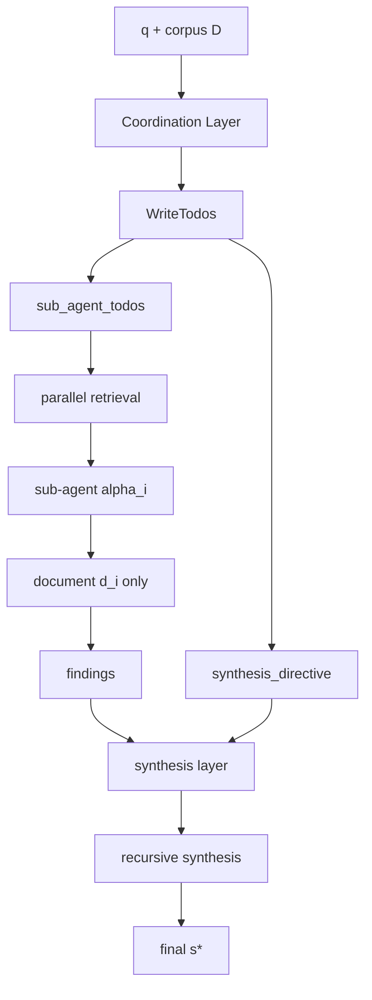

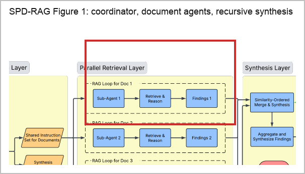{width=4.6in}

Caption: The paper's architecture figure makes the axis of decomposition visible: the coordinator gives each document its own RAG loop, then the synthesis layer merges document-local findings instead of letting one global retriever decide coverage. [9](#source-9)

### Evidence map

| Claim | Evidence status | Reader-facing citation |
|---|---|---|
| SPD-RAG's core mechanism is one sub-agent per document plus central synthesis over local findings. | Verified from the inspected PDF and extracted text in the read report. | [9](#source-9) |
| The document worker loop is bounded by at least two searches before absence and at most five search calls across tasks. | Verified from the methodology inventory in the read report. | [9](#source-9) |
| On 102 Loong instances, SPD-RAG beats Normal RAG and Agentic RAG but trails the full-context Gemini 2.5 Pro baseline. | Verified from the main results table summarized by the read report. | [9](#source-9) |

### Walkthrough

The inspected artifact set for this source is the 12-page arXiv PDF plus extracted full text; the read report notes that no repository checkout, LangSmith traces, Qdrant indexes, per-instance predictions, or evaluation logs were included in this assignment. That means the brief can verify the paper's claims from the paper artifact, but cannot audit implementation fidelity or trace-derived cost accounting. [9](#source-9)

The central claim is architectural: multi-document QA should be decomposed along document boundaries when evidence coverage matters. The coordinator writes atomic, self-contained tasks, and each document gets the same information requirements, including the ability to answer "not found" for that document. [9](#source-9)

### Implementation notes

The implementation shape worth copying is a small set of hard boundaries: one worker per document, bounded search before absence, local findings, central synthesis, and explicit cost/latency accounting. The read report also notes the paper's references to prompt definitions, model constants, and LangSmith cost extraction, but those files were not locally available in this assignment. [9](#source-9)

```yaml source="/Users/liuzikai/Documents/GitHub/deepbrief/artifacts/sixmonth-agent-search-2025-12-12_2026-06-12/reviews/subagents/read-paper-2603-08329v1.md:15-19"
document_sub_agent:
  scope: one_document
  absence_threshold_searches: 2
  max_search_calls: 5
retrieval:
  index: per_document_qdrant
  embedding: cohere_embed_v4_0
  top_k: 15
  rerank_top_n: 5
synthesis:
  input: local_findings
  merge_token_budget: 750000
  recursive_path_status: unactivated_in_loong
```

### Try it yourself

Run a small document-bundle replay with two variants: global retrieval over the whole bundle, then SPD-RAG-style per-document workers with the same shared extraction todos. Keep the source's two search constraints, collect local findings before synthesis, and score the run for evidence coverage, final answer quality, cost, and latency. [9](#source-9)

### Open questions

- Can the public repository reproduce the exact prompts, per-instance predictions, evaluation scripts, and LangSmith-derived cost accounting, given that this assignment did not include repo checkout or traces? [9](#source-9)
- How stable is the coordinator when it must write tasks broad enough for unknown documents but specific enough for exact values, caveats, and technical academic content? [9](#source-9)

### Sources & citations

- Primary: [9](#source-9) https://arxiv.org/abs/2603.08329v1
- Supporting lane context: [8](#source-8) https://arxiv.org/abs/2603.07379v1
- Supporting lane context: [21](#source-21) https://arxiv.org/abs/2604.09666v1
- Supporting lane context: [28](#source-28) https://arxiv.org/abs/2604.14572v3

## Spreadsheet Evidence Handles: Beyond Rows to Reasoning: Agentic Retrieval for Multimodal Spreadsheet Understanding and Editing

### TL;DR

- BRTR treats spreadsheet QA as bounded iterative search over row chunks, column chunks, window chunks, and image chunks, not as a one-shot compression or full-context loading problem. [7](#source-7)
- The retrieval layer uses hybrid dense+BM25 retrieval with Reciprocal Rank Fusion, then exposes coordinate-aware tools so the model can refine by content type and cell location. [7](#source-7)

### Mental model

Think of BRTR as a spreadsheet evidence-handle machine: it converts a workbook into addressable row chunks, column chunks, window chunks, and image chunks that retain sheet names, cell coordinates, and headers, then lets the model search and revise its evidence set as the workbook structure becomes clearer. [7](#source-7)

### Why this matters now

The paper's useful move is to reject "retrieve once, answer once" as the default spreadsheet pattern. Its motivation is that compression can erase resolution, single-pass retrieval can miss required context, and naive full-context loading can overflow or bury the signal in large workbooks; BRTR instead makes search observable and revisable. [7](#source-7)

### Mechanism trace

BRTR starts by indexing spreadsheet content into row chunks, column chunks, rectangular window chunks, and embedded image chunks, then retrieves with hybrid dense+BM25 search before the agent chooses typed tools, coordinates, and follow-up searches inside a bounded iterative loop. [7](#source-7)

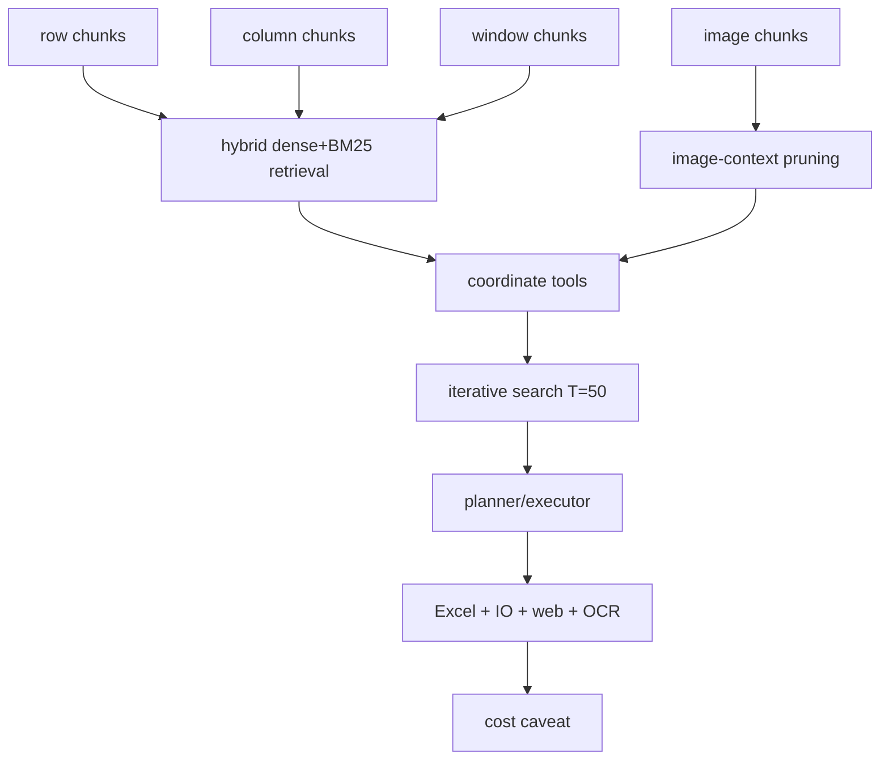

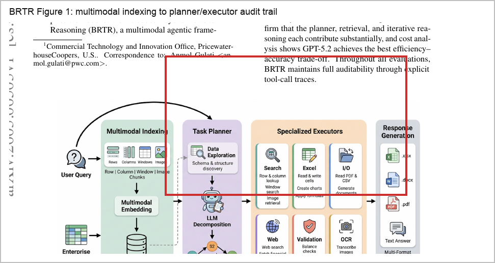{width=4.6in}

Caption: The source figure shows why BRTR is not just spreadsheet RAG: the index has row, column, window, and image handles; the planner decomposes tasks; executors operate over Excel, IO, web, validation, OCR, and search; and the response carries provenance. [7](#source-7)

### Evidence map

| Claim | Evidence handle in the read report | Citation |
|---|---|---|
| BRTR indexes workbooks as row chunks, column chunks, window chunks, and image chunks with sheet, cell, and header metadata. | Method inventory and mechanism summary identify the four chunk families and retained spreadsheet metadata. | [7](#source-7) |
| Retrieval is hybrid dense+BM25 with RRF fusion, `k = 60`, and top-K set to 10 in the reported setup. | Mechanism summary states dense cosine search and BM25 are combined across chunk types with Reciprocal Rank Fusion. | [7](#source-7) |
| The tool API is coordinate-aware through `search_rows`, `search_columns`, `search_windows`, `search_images`, and `search_all`. | Method inventory and mechanism summary name the five tools and note optional row/column coordinate filters. | [7](#source-7) |

### Walkthrough

The local read report inspected a 15-page paper PDF and a 1,369-line extracted text artifact, then inventoried five figures, seven tables, Algorithm 1, the chunking and tool APIs, the planner prompt, and the evaluation sections. [7](#source-7)

The paper's central claim is that spreadsheet understanding and editing should be solved through agentic retrieval over structured spreadsheet evidence, not by compressing the file once, retrieving a single context set, or stuffing the workbook into the model context. [7](#source-7)

### Implementation notes

If you adapt BRTR, start with the evidence surface before the model prompt: define chunk types, preserve sheet/cell/header metadata, make the search tools coordinate-aware, and log each tool call/result pair so later evaluation can inspect how the answer was found. [7](#source-7)

```text source=/Users/liuzikai/Documents/GitHub/deepbrief/artifacts/sixmonth-agent-search-2025-12-12_2026-06-12/reviews/subagents/read-arxiv-spreadsheet-agents-beyond-rows-to-reasoning-agentic-retrieval-for-multimodal-spreads.md
BRTR retrieval surface:
- chunks: row chunks, column chunks, rectangular window chunks, embedded-image chunks
- tools: search_rows, search_columns, search_windows, search_images, search_all
- retrieval: dense cosine similarity + BM25, Reciprocal Rank Fusion k=60, top-K=10
- loop bound: T=50 tool-call iterations; frontier models usually average 3-6 calls
- image context: always-prune previous base64 image content, keep textual metadata
- executors: Excel, IO, web, validation, OCR, search
```

### Try it yourself

Run a 30-60 minute micro-ablation on a small workbook set: answer the same cross-sheet or image-bearing spreadsheet questions with one-shot full-context input, one-shot retrieval, BRTR-style bounded iterative search, and BRTR-style planner-executor decomposition; record accuracy, tool calls, tokens, latency, and whether the final answer cites exact sheet/cell or image handles. [7](#source-7)

### Open questions

Can BRTR's reported gains be reproduced outside the authors' environment when the read report says the artifacts lack runnable code, benchmark corpora, raw evaluator sheets, full execution traces, and detailed model configuration files? [7](#source-7)

How much of the improvement is retrieval quality versus model/tool discipline, given that the ablations show retrieval and iteration matter but the paper does not run a head-to-head comparison against a tightly constrained code-execution spreadsheet agent on the same FINCH-style workflows? [7](#source-7)

### Sources & citations

- Primary: [7](#source-7) https://arxiv.org/abs/2603.06503
- Supporting spreadsheet-agent benchmark context: [83](#source-83) https://arxiv.org/abs/2605.22642v1
- Supporting spreadsheet-viewer context: [82](#source-82) https://docs.reducto.ai/components/spreadsheet-viewer
- Supporting spreadsheet-parser context: [84](#source-84) https://docs.reducto.ai/configs/parse/spreadsheet

## Trace RCA: AgentTrace: Causal Graph Tracing for Root Cause Analysis in Deployed Multi-Agent Systems

### TL;DR

- AgentTrace treats trace RCA as an observability problem for deployed multi-agent systems: reconstruct a causal graph from multi-agent event logs, walk backward from the observed error node, and rank upstream candidate causes without calling an LLM during debugging. [13](#source-13)
- The graph uses agent actions as nodes and three edge types as causal dependencies: sequential edges, communication edges, and data-dependency edges. [13](#source-13)

### Mental model

Think of AgentTrace as a deterministic "go upstream" layer beside an agent runtime. The runtime records multi-agent event logs; AgentTrace turns actions into graph nodes, connects them with causal edges, starts at the node where the error manifests, and searches backward for the earliest decision point whose correction would prevent the failure. [13](#source-13)

### Why this matters now

Agent workflows are moving from single chats into deployed customer-support, DevOps remediation, research-assistant, and other specialist-agent systems where a visible error can appear several steps downstream from the bad choice that caused it. AgentTrace gives those systems a concrete debugging primitive: preserve causal structure in logs, reconstruct the graph, and rank upstream causes rather than inspecting only the surface error. [13](#source-13)

### Mechanism trace

AgentTrace's mechanism has four load-bearing pieces: multi-agent event logs, causal graph reconstruction, bounded backward traversal from the observed error node, and weighted candidate ranking. Nodes are tool calls, messages, and decisions; edges are sequential, communication, and data-dependency links; candidates are ancestors of the error node within the traversal depth. [13](#source-13)

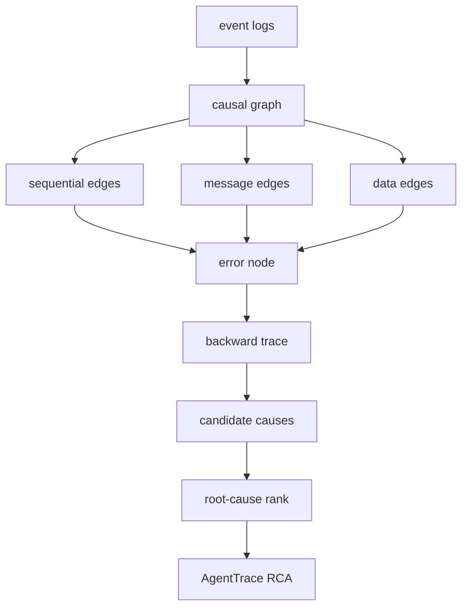

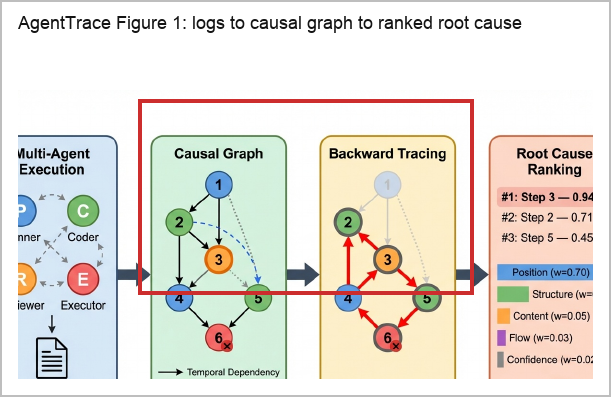{width=4.6in}

Caption: The figure crop shows the key move: AgentTrace turns execution logs into a causal graph and performs backward tracing before ranking causes, rather than asking an LLM to reread the whole trace at debugging time. [13](#source-13)

### Evidence map

| Claim | Evidence status | Reader takeaway |
| --- | --- | --- |
| AgentTrace reconstructs causal graphs from execution logs, traces backward from error manifestations, and ranks candidate causes without LLM inference at debugging time. [13](#source-13) | Verified local paper artifact and extracted text are mapped in the evidence matrix for citation 13. [13](#source-13) | Treat it as a post-hoc debugging layer for deployed multi-agent systems, not as a new agent reasoner. [13](#source-13) |
| The graph model uses agent actions as nodes and sequential, communication, and data-dependency edges as causal dependencies. [13](#source-13) | The read report anchors the formal graph definition and edge-type evidence to the extracted paper. [13](#source-13) | The method depends on instrumentation quality; weak logs mean weak candidate sets. [13](#source-13) |
| Backward root-cause ranking is dominated by an early-bug prior, with position weight 0.70 and position-only Hit-at-1 of 87.3%. [13](#source-13) | The read report ties the ranking weights and ablation to the paper's feature table and experiments. [13](#source-13) | Use the score as a production prior that needs recalibration when late failures are common. [13](#source-13) |

### Walkthrough

The local artifact set is complete for a paper read: the saved PDF is 11 pages, the extracted text is 1,046 lines, and the read report covers the abstract, framework, benchmark, experiments, appendices, figure/table inventory, reproducibility statement, and hyperparameter table. [13](#source-13)

Start with the failure definition. AgentTrace defines the root cause as the earliest decision point whose correction would prevent the observed error, so the target is upstream prevention rather than the downstream symptom. That definition explains why the algorithm starts at the observed error node and searches parents, rather than scanning the transcript in chronological order. [13](#source-13)

### Implementation notes

The first implementation note is a logging contract, not a model call: capture multi-agent event logs with stable action IDs, agent identity, action type, timestamps, message routing, variable references, content, role metadata, stated confidence when available, and enough parent links to reconstruct sequential, communication, and data-dependency edges. [13](#source-13)

```yaml source="/Users/liuzikai/Documents/GitHub/deepbrief/artifacts/sixmonth-agent-search-2025-12-12_2026-06-12/reviews/subagents/read-arxiv-customer-support-agents-agenttrace-causal-graph-tracing-for-root-cause-analysis-in-d.md"
agenttrace_trace_rca:
  graph_nodes: ["tool calls", "messages", "decisions"]
  graph_edges: ["sequential edges", "communication edges", "data-dependency edges"]
  traversal: "bounded reverse BFS from the observed error node"
  ranking_weights:
    position: 0.70
    structure: 0.20
    content: 0.05
    flow: 0.03
    confidence: 0.02
  adoption_caveats:
    - "synthetic/single-root benchmark caveat"
    - "early-bug prior needs production recalibration"
    - "accurate execution logging is assumed"
```

### Try it yourself

In 30-60 minutes, take one failed multi-agent run and turn it into a minimal AgentTrace-style trace RCA record: list each action as a node, mark the observed error node, add sequential edges for same-agent actions, add communication edges for message send/receive, and add data-dependency edges where one action produces data consumed by another. [13](#source-13)

### Open questions

- Can the 94.9% Hit-at-1 result survive real production trace corpora where root causes are not injected, multiple causes interact, and the earliest bad step may be only one contributor rather than a sufficient explanation? [13](#source-13)
- What is the minimum logging schema for reliable causal graph reconstruction across sequential edges, communication edges, data-dependency edges, memory/retrieval links, hidden tool state, and cross-run effects? [13](#source-13)

### Sources & citations

- Primary paper and mechanism evidence: [13](#source-13) https://arxiv.org/abs/2603.14688
- Benchmark, ablation, and runtime evidence: [13](#source-13) https://arxiv.org/abs/2603.14688
- Caveats, failure analysis, and production-readiness questions: [13](#source-13) https://arxiv.org/abs/2603.14688

## Agentic Control vs Graph Structure: Do We Still Need GraphRAG? Benchmarking RAG and GraphRAG for Agentic Search Systems

### TL;DR

- RAGSearch turns the GraphRAG debate into a controlled matrix: the same agentic search loop talks to either a dense RAG backend or a GraphRAG backend, so the paper can separate online control from offline retrieval structure. [21](#source-21)
- The practical result is not "GraphRAG is dead"; agentic control narrows the dense-vs-graph gap, especially with RL, but explicit graph structure remains stronger for complex multi-hop aggregation when graph costs can be amortized. [21](#source-21)

### Mental model

Think of RAGSearch as a structure-placement test. Dense RAG leaves structure mostly implicit in chunks and semantic similarity; GraphRAG pays offline to construct nodes, paths, subgraphs, trees, hypergraphs, or linear graph structures; agentic search can create some temporary structure online by decomposing, searching, verifying, and deciding when to stop. [21](#source-21)

### Why this matters now

Agentic RAG systems are increasingly judged by their trajectory, not just by the final answer. This paper fits that shift because it treats retrieval as a repeated interaction: the model reasons, searches, receives information, appends it to state, and either searches again or emits an answer. That framing makes the agentic search loop itself a variable in retrieval-system design. [21](#source-21)

### Mechanism trace

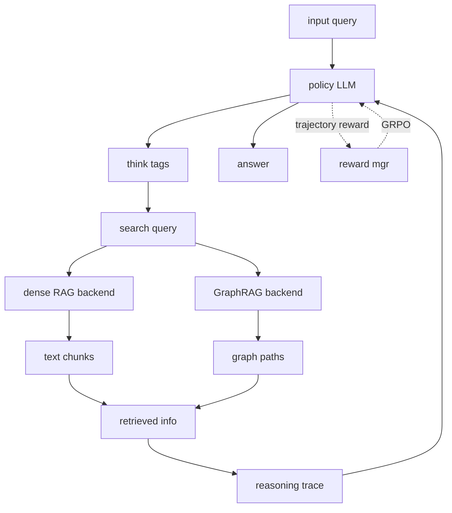

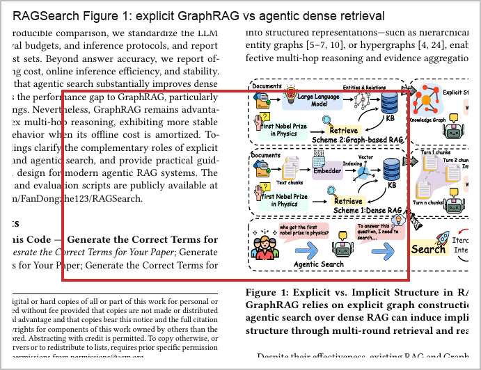{width=4.6in}

Caption: The crop preserves the paper's core comparison: explicit GraphRAG construction builds structure offline, while the agentic RAGSearch path moves part of that structure into online decomposition, retrieval, verification, and answer control. [21](#source-21)

The trace reduces the paper's mechanism to its central abstraction: a policy LLM runs the same agentic search loop over backend `B`, where `B` can be dense RAG or GraphRAG, and the retrieved information can be text chunks or graph/subgraph evidence appended to the ongoing reasoning sequence. [21](#source-21)

### Evidence map

| Claim | Evidence | Citation |
|---|---|---|
| RAGSearch isolates retrieval infrastructure by letting the same agent loop operate over dense RAG and GraphRAG backends. | The read report identifies the unified agentic-search abstraction and the interchangeable dense/graph backend design as the benchmark contribution. | [21](#source-21) |
| Agentic search narrows but does not eliminate the graph advantage. | The read report summarizes the conclusion: online control moves some structure into interaction, while explicit graphs remain useful for complex multi-hop reasoning. | [21](#source-21) |
| GraphSearch is a stronger dense-RAG workflow than generic on-demand search because it adds decomposition, verification, and query expansion. | The read report distinguishes Search-o1-style on-demand search from GraphSearch-style orchestration and says GraphSearch partially closes the gap without an explicit graph. | [21](#source-21) |

### Walkthrough

The local read verified a preserved 19-page PDF plus a 2,169-line extracted text artifact, then inventoried the figures, tables, methods, limitations, and evidence anchors before synthesis. The report flags Figure 2 as the central RAGSearch schematic and Table 1 as the headline Contain Exact Match comparison, with appendix tables covering F1 and cost. [21](#source-21)

The method starts by defining standard RAG as one-shot chunk retrieval and GraphRAG as retrieval over nodes, paths, or subgraphs whose nodes encode documents, entities, or summaries and whose edges encode relationships. It then defines agentic search as a ReAct-style loop over a backend `B`, which is the control point that lets RAGSearch swap dense and graph retrieval without changing the agentic interface. [21](#source-21)

### Implementation notes

Use RAGSearch's control contract as the implementation pattern: keep the agent, search protocol, and reward stable while swapping the retrieval environment. The source-derived skeleton below is intentionally short because the paper's useful engineering detail is the interface boundary, not a long pseudocode listing. [21](#source-21)

```text source="/Users/liuzikai/Documents/GitHub/deepbrief/artifacts/sixmonth-agent-search-2025-12-12_2026-06-12/reviews/subagents/read-paper-2604-09666v1.md:17-21"
Search-o1: Query -> Think -> Search -> Knowledge Refinement -> Answer
GraphSearch: Query -> Decomposition -> Search -> Verification -> Answer
Backend: dense RAG returns text chunks; GraphRAG returns structured graph-based evidence.
```

### Try it yourself

Run a 30-60 minute mini-RAGSearch on a small multi-hop QA slice: keep one agent prompt and answer-after-search protocol fixed, connect it first to a dense RAG backend and then to a GraphRAG backend, cap retrieval consistently, and record Contain EM or F1 plus search turns, retrieval recall, variance, retrieval latency, and context length. The point is not to reproduce the paper's tables; it is to test whether your own failure cases need explicit graph structure or better agentic control. [21](#source-21)

### Open questions

- Can the public code and evaluation scripts reproduce the paper's table values exactly, given that the local read only verified the preserved paper artifacts and did not execute external code? [21](#source-21)
- How stable are the conclusions when the GraphRAG backend is pre-registered instead of selected as the best of five graph variants after evaluation? [21](#source-21)

### Sources & citations

- [21](#source-21) is the primary source for this section's RAGSearch mechanism, controlled dense-vs-GraphRAG matrix, results pattern, limitations, and open questions.
- [8](#source-8) gives the broader agentic-RAG taxonomy that explains why RAGSearch treats retrieval control as more than a vector-store decision.
- [9](#source-9) is the per-document worker counterpoint: agentic control can also mean isolating search loops by source before merging evidence.
- [28](#source-28) covers the offline-navigation alternative, where enterprise corpora are compiled into navigable skills rather than queried through a graph.

## Tool-Server Lifecycle: OpenAI Agents SDK Python: feat: add MCPServerManager for safely managing server lifecycle (#2350)

### TL;DR

- `MCPServerManager` is an opt-in lifecycle wrapper around existing `MCPServer` instances, not a change that makes `Agent` own server lifecycle; callers still own connect and cleanup, but can delegate orchestration to the manager when they need safer task-affine behavior. [45](#source-45)
- The motivating bug class is concrete: a `TaskBoundServer` test records `asyncio.current_task()` during `connect()` and raises on `cleanup()` if cleanup runs from a different task, matching the "cancel scope" failure mode the manager is meant to avoid. [45](#source-45)

### Mental model

Think of `MCPServerManager` as a small supervisor around a list of MCP tool servers. Its job is to transform "all configured servers" into an `active_servers` snapshot that an `Agent` can safely receive, while separately remembering `failed_servers`, `_connected_servers`, and `errors` so startup, partial availability, cleanup, and reconnects do not collapse into one fragile `connect()` loop. [45](#source-45)

### Why this matters now

The report frames this commit as applied agent infrastructure: tool-server lifecycle, failure isolation, reconnect paths, timeout handling, and task-affine cleanup become library-level affordances instead of incidental setup code in each application. That matters for long-lived web services where one unavailable MCP endpoint should not necessarily bring down the whole agent surface. [45](#source-45)

### Mechanism trace

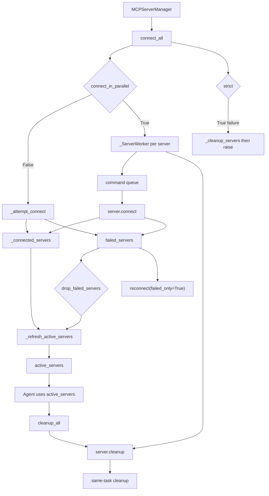

The trace follows the manager's actual contract: `connect_all()` records successes in `_connected_servers`, failures in `failed_servers` and `errors`, refreshes `active_servers` using `drop_failed_servers`, and in parallel mode routes per-server connect and cleanup through `_ServerWorker` so concurrency happens across servers rather than by splitting one server's lifecycle across arbitrary tasks. [45](#source-45)

### Evidence map

| Claim | Evidence | Citation |
|---|---|---|
| `MCPServerManager` is the commit's main production change. | The read report identifies a new 411-line `src/agents/mcp/manager.py` with `MCPServerManager`, `_ServerWorker`, `_ServerCommand`, and `_run_with_timeout_in_task`, plus export from `agents.mcp`. | [45](#source-45) |
| The manager addresses task-affine connect and cleanup, not general agent reasoning. | The report describes `TaskBoundServer` recording the current task in `connect()` and raising during cross-task `cleanup()`, then shows the manager tests preserving same-task cleanup. | [45](#source-45) |
| Parallel connection preserves per-server lifecycle affinity. | The report says `_connect_all_parallel()` creates outer tasks, while each server's actual connect and cleanup run through one `_ServerWorker` queue that exits after cleanup. | [45](#source-45) |

### Walkthrough

The patch header identifies commit `dfc1f33fda2b0ecdeffc00c3ec999dd9aa8923ee`, authored January 23, 2026, with 8 changed files, 1,125 insertions, and 1 deletion. The new files are the FastAPI manager example, `src/agents/mcp/manager.py`, and `tests/mcp/test_mcp_server_manager.py`; the smaller changes update `agent.py`, `agents.mcp.__init__`, and `server.py`. [45](#source-45)

The first contract change appears in documentation and export surface. `agent.py` still says users must call `server.connect()` before passing servers to an agent and `server.cleanup()` when done, but now recommends `MCPServerManager` from `agents.mcp` to keep connect and cleanup in the same task; `agents.mcp.__init__` exports the manager as public API. [45](#source-45)

### Implementation notes

The most important implementation detail is that the public API is a manager around existing servers, not a new server type. Use it where app startup needs partial MCP availability, where cleanup must happen in the same task as connect, or where reconnect should be an explicit operator action rather than a process restart. [45](#source-45)

```python source="/Users/liuzikai/Documents/GitHub/deepbrief/artifacts/sixmonth-agent-search-2025-12-12_2026-06-12/repos/commit-openai-openai-agents-python-dfc1f33fda2b-a4dbcc6d.patch:451-475"
def __init__(
    self,
    servers: Iterable[MCPServer],
    *,
    connect_timeout_seconds: float | None = 10.0,
    cleanup_timeout_seconds: float | None = 10.0,
    drop_failed_servers: bool = True,
    strict: bool = False,
    suppress_cancelled_error: bool = True,
    connect_in_parallel: bool = False,
) -> None:
    self._all_servers = list(servers)
    self._active_servers = list(servers)
    self.connect_timeout_seconds = connect_timeout_seconds
    self.cleanup_timeout_seconds = cleanup_timeout_seconds
    self.drop_failed_servers = drop_failed_servers
    self.strict = strict
    self.suppress_cancelled_error = suppress_cancelled_error
    self.connect_in_parallel = connect_in_parallel
    self._workers: dict[MCPServer, _ServerWorker] = {}

    self.failed_servers: list[MCPServer] = []
    self._failed_server_set: set[MCPServer] = set()
    self._connected_servers: set[MCPServer] = set()
    self.errors: dict[MCPServer, BaseException] = {}
```

### Try it yourself

Recreate the example's intended failure path: start the Streamable HTTP MCP server, then start the FastAPI app with the manager enabled and leave the inactive MCP URL pointing at the default unavailable endpoint. `/health` should show the real server in `connected_servers` and the inactive one in `failed_servers`, demonstrating `drop_failed_servers=True` and `active_servers` as the source of truth. [45](#source-45)

### Open questions

- Which findings from this patch-only report should survive final synthesis after cross-lane comparison, especially the distinction between public lifecycle orchestration and changes to agent execution? [45](#source-45)
- Are any patch-line references too coarse for final evidence-map claims, given that the read report's evidence anchors are local patch lines rather than executed runtime traces? [45](#source-45)

### Sources & citations

- [45](#source-45) is the primary source for this section's `MCPServerManager` mechanism, task-affinity contract, FastAPI example, lifecycle tests, implementation notes, limitations, and open questions.
- [38](#source-38) is the adjacent policy hook: lifecycle management decides whether a tool server exists, while guardrails decide whether a tool result is allowed through.
- [64](#source-64) connects the SDK lifecycle change to Codex's broader production safety boundary around network policy, approvals, and telemetry.
- [63](#source-63) gives the OS-isolation comparison case: MCP cleanup and sandbox cleanup are different layers of the same runtime-control problem.

## Tool Boundary Policy: OpenAI Agents SDK Python: feat: Add tool guardrails to function_tool decorator args (ref #2218) (#2227)

### TL;DR


### Mental model

Treat `function_tool` as the conversion point where a Python callable becomes a `FunctionTool`: the same surface already handled schema behavior, enablement, and error handling, and this commit adds per-tool policy lists to that declaration path. [38](#source-38)

### Why this matters now

The practical SDK impact is ergonomic: builders using the decorator/factory path can attach per-tool input and output guardrails without manually constructing or mutating a lower-level `FunctionTool`, which keeps capability declaration and policy attachment in one API surface. [38](#source-38)

### Mechanism trace

The mechanism visible in the patch is a configuration-carrying path: caller configuration enters `function_tool`, is closed over by `_create_function_tool`, and reaches the `FunctionTool` constructor alongside existing fields such as `on_invoke_tool`, `strict_json_schema`, and `is_enabled`. [38](#source-38)

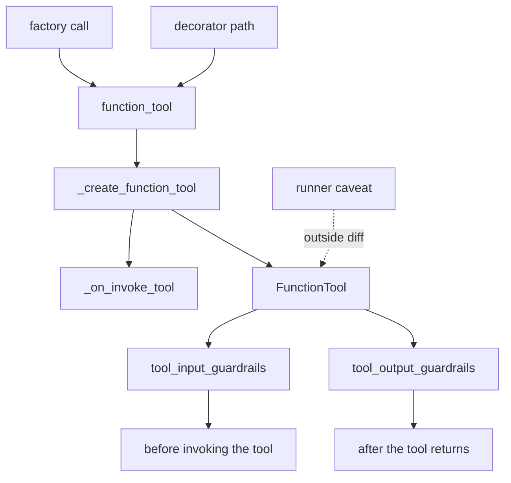

### Evidence map

| Claim | Evidence from the read report | Confidence |
| --- | --- | --- |
| The diff is intentionally narrow: two files, 53 insertions, no deletions. [38](#source-38) | The report identifies `src/agents/tool.py` as the production surface with 10 insertions and `tests/test_function_tool.py` as the test surface with 43 insertions. [38](#source-38) | High |
| `function_tool` gains optional `tool_input_guardrails` and `tool_output_guardrails` in both overloads and the concrete implementation signature. [38](#source-38) | The report maps additions across the direct-call overload, decorator-with-arguments overload, and implementation signature, all defaulting to `None`. [38](#source-38) | High |
| The docstring frames the new fields as pre-tool and post-tool hooks. [38](#source-38) | The report states input guardrails are documented as running before invoking the tool and output guardrails as running after the tool returns. [38](#source-38) | High |

### Walkthrough

The production change starts in `function_tool`'s public typing surfaces: both supported call styles gain `tool_input_guardrails: list[ToolInputGuardrail[Any]] | None = None` and `tool_output_guardrails: list[ToolOutputGuardrail[Any]] | None = None`, and the concrete implementation signature receives the same optional parameters. [38](#source-38)

The docstring then assigns boundary semantics: input guardrails are optional checks before invoking the tool, and output guardrails are optional checks after the tool returns, which places policy around the tool boundary instead of around the entire model turn. [38](#source-38)

### Implementation notes

The important implementation detail is not a new executor branch; it is the final object construction that turns the decorator/factory configuration into fields on `FunctionTool`. [38](#source-38)

```diff source="/Users/liuzikai/Documents/GitHub/deepbrief/artifacts/sixmonth-agent-search-2025-12-12_2026-06-12/repos/commit-openai-openai-agents-python-718a99e1e07f-181f8eaf.patch"
             on_invoke_tool=_on_invoke_tool,
             strict_json_schema=strict_mode,
             is_enabled=is_enabled,
+            tool_input_guardrails=tool_input_guardrails,
+            tool_output_guardrails=tool_output_guardrails,
         )
```

### Try it yourself

Reproduce the direct factory-call test by defining one `@tool_input_guardrail` fixture that accepts `ToolInputGuardrailData` and returns `ToolGuardrailFunctionOutput.reject_content(...)`, one `@tool_output_guardrail` fixture that accepts `ToolOutputGuardrailData` and returns `ToolGuardrailFunctionOutput.allow(...)`, then calling `function_tool(simple_function, tool_input_guardrails=[...], tool_output_guardrails=[...])` and asserting the resulting `FunctionTool` stores those same lists. [38](#source-38)

### Open questions

- Does the existing runner execute `tool_input_guardrails` before business logic and `tool_output_guardrails` after return in every supported invocation path, or only in paths outside this patch's test coverage? [38](#source-38)
- Are multiple tool guardrails executed in caller-supplied order, and how are conflicts between reject and allow outputs resolved? [38](#source-38)

### Sources & citations

- [38](#source-38) Primary source for this section: the OpenAI Agents SDK Python commit that adds `tool_input_guardrails` and `tool_output_guardrails` to `function_tool`.
- [31](#source-31) Supporting context: Inspect AI's tool-not-supported harness fix, useful as a nearby eval-runtime boundary example.
- [33](#source-33) Supporting context: Inspect AI's `skill()` tool support, useful as a nearby tool-surface packaging example.
- [64](#source-64) Supporting context: OpenAI's Codex safety post, useful for the broader approval and tool-boundary control-plane pattern.

## Enterprise Control Plane: Running Codex safely at OpenAI

### TL;DR

- OpenAI frames Codex safety as an enterprise control plane: sandbox boundary, approval boundary, network policy, identity, managed configuration, and agent-native telemetry all have to line up before local coding agents are broadly usable. [64](#source-64)
- The key separation is sandbox versus approval: the sandbox defines where Codex can write, whether it can reach the network, and which paths are protected; approval policy decides when boundary-crossing work must pause. [64](#source-64)

### Mental model

Treat Codex as a delegated local operator, not just a chat model. The OpenAI post says coding agents can review repositories, run commands, and interact with development tools, which changes actions that previously required direct human execution into agent-mediated work. The control problem is therefore not "can the model answer safely?" but "which execution, identity, network, approval, and audit boundaries govern the agent while it acts?" [64](#source-64)

### Why this matters now

Developer agents are moving from suggestion systems into tools that operate inside real repositories and shells. OpenAI's post is valuable because it maps the enterprise safety surface in operational terms: what Codex can access, when humans approve, which systems it can interact with, and what telemetry exists to explain behavior. [64](#source-64)

### Mechanism trace

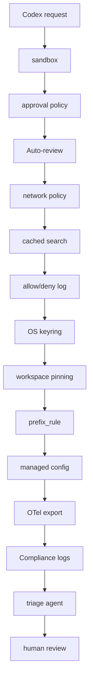

Stage 1 is containment. The sandbox boundary defines where Codex can write, whether it can reach the network, and which paths remain protected; `sandbox_workspace_write.writable_roots` and `allowed_sandbox_modes = ["read-only", "workspace-write"]` make that execution posture configurable rather than informal. [64](#source-64)

### Evidence map

| Claim | Evidence in this source | Citation |
|---|---|---|
| Codex governance is a layered control plane, not a single sandbox setting. | The read report identifies technical execution, approval, network, identity, administrative configuration, and observability boundaries as the post's core mechanism. | [64](#source-64) |
| The sandbox boundary and approval boundary do different jobs. | The post distinguishes where Codex may write, reach the network, and touch protected paths from the policy that decides when Codex must ask to perform an action. | [64](#source-64) |
| Auto-review mode is a contextual approval reviewer. | The read report says Codex sends the planned action and recent context to an approval subagent that can approve lower-risk work or sufficiently authorized higher-risk work. | [64](#source-64) |

### Walkthrough

The local artifact inventory for this source is one saved OpenAI HTML page for "Running Codex safely at OpenAI," published on May 8, 2026 under Security and Safety, authored by OpenAI. The page has three named sections: "Controlling how Codex operates," "Agent-native telemetry and audit trails," and "Looking ahead"; the read report found five configuration examples for approval/sandbox posture, network policy, identity and credentials, shell-command rules, and OpenTelemetry export. [64](#source-64)

The central claim is that Codex should be productive inside a bounded environment, with low-risk everyday actions kept frictionless and higher-risk actions stopped for review. The article then decomposes that goal into sandboxing and approvals, network access, identity and credentials, rules, managed configs, and telemetry. [64](#source-64)

### Implementation notes

The source-derived configuration below captures the network-policy pattern OpenAI shows: cached web fetch, network proxy enabled, localhost binding allowed, explicit deny list, and explicit allow list. [64](#source-64)

```toml source="/Users/liuzikai/Documents/GitHub/deepbrief/artifacts/sixmonth-agent-search-2025-12-12_2026-06-12/sources/raw/openai-news-running-codex-safely-at-openai.html"
allowed_web_search_modes = ["cached"]

[experimental_network]
enabled = true
allow_local_binding = true
denied_domains = ["pastebin.com"]
allowed_domains = ["login.microsoftonline.com", "*.openai.com"]
```

### Try it yourself

In 45 minutes, turn the OpenAI control-plane map into a rollout checklist for one repository group. Use six columns: sandbox boundary, approval boundary, network policy, identity/workspace policy, `prefix_rule` policy, and telemetry/export. For each column, write the concrete default, who owns exceptions, what event should be logged, and what would trigger human review. [64](#source-64)

### Open questions

- What exact fields are emitted in Codex OpenTelemetry events, and which fields are redacted or hashed by default? [64](#source-64)
- How does Auto-review classify command risk, network risk, write-scope risk, and user authorization level, and are those policies customer-configurable or OpenAI-managed? [64](#source-64)

### Sources & citations

- [64](#source-64) Primary source for this deep dive: OpenAI's "Running Codex safely at OpenAI," the May 8, 2026 engineering/security post on Codex sandboxing, approvals, network policy, identity, managed configuration, OpenTelemetry export, Compliance Platform logging, and AI-powered security triage.
- [63](#source-63) Supporting context: OpenAI's Windows sandbox writeup, useful for the adjacent OS-specific sandbox implementation story referenced by the lane synthesis.
- [45](#source-45) Supporting context: an OpenAI Agents SDK commit on MCP server lifecycle management, useful background for the MCP operational surface named in the telemetry and identity discussion.
- [38](#source-38) Supporting context: an OpenAI Agents SDK commit on tool guardrails, useful background for the broader move toward explicit tool safety boundaries.

## Agent OS Harness: Building Effective AI Coding Agents for the Terminal: Scaffolding, Harness, Context Engineering, and Lessons Learned

### TL;DR

- Read this as an agent-OS systems map, not a benchmark win: the paper decomposes a terminal coding agent into scaffolding before the first prompt and a harness after the prompt starts running. [92](#source-92)
- The scaffolding side is concrete: `MainAgent`, `AgentFactory`, `BaseAgent.__init__`, `refresh_tools`, allowed-tool filtering, prompt overrides, subagent registry setup, and model-role wiring decide what the model can see before work begins. [92](#source-92)

### Mental model

The useful mental model is to split a terminal coding agent into two different engineering surfaces. Scaffolding is the construction phase: build the system prompt, tool schemas, subagent registry, model roles, and dependency wiring before the first user prompt. Harness is the runtime phase: run the extended ReAct loop, dispatch tools, enforce approvals, compact context, inject reminders, persist state, and decide when the loop should stop. [92](#source-92)

### Why this matters now

Coding agents are moving from one-shot model answers toward compound runtimes whose useful behavior depends on harness, context, and tool boundaries. The paper's read report makes that shift concrete by naming the parts that decide whether a terminal agent can stay useful across long sessions: scaffolding, an extended ReAct executor, dynamic prompt sections, tool-output offloading, Adaptive Context Compaction, reminders, memory, approvals, and schema-gated tools. [92](#source-92)

### Mechanism trace

The mechanism is a staged handoff from construction-time schema and prompt assembly to runtime loop control. Scaffolding fixes the agent's visible world; the harness then repeatedly decides what to think about, what to hide or compact, which tools can be called, which calls need approval, and when enough work has been done. [92](#source-92)

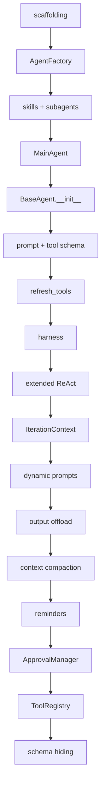

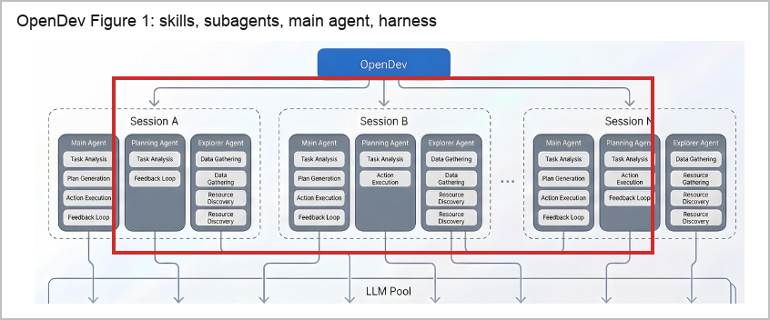{width=4.6in}

Caption: The figure crop makes the paper's agent-OS boundary concrete: skills and subagents are constructed before the main agent, while the harness owns runtime loops, context refresh, tool execution, compaction, reminders, and process state. [92](#source-92)

### Evidence map

| Claim | Evidence in the read report | Citation |
|---|---|---|
| Scaffolding and harness are separate phases. | The report defines scaffolding as pre-prompt construction and harness as post-prompt runtime coordination for ReAct, tool dispatch, approvals, compaction, reminders, persistence, and termination. | [92](#source-92) |
| `MainAgent` behavior is parameterized rather than class-split. | The report says `MainAgent` varies through filtered `allowed_tools`, prompt overrides, and `is_subagent`, while `BaseAgent.__init__` eagerly builds prompt and schema. | [92](#source-92) |
| `AgentFactory` ordering matters. | The report records a three-phase order, skills then subagents then main agent, so `spawn_subagent` can be exposed only after subagents are known. | [92](#source-92) |

### Walkthrough

Start with the inspected artifact shape. The read report says the local evidence for this source consisted of an 81-page arXiv PDF and a 4,407-line extracted text file, with a figure and table inventory covering session-agent-workflow-LLM hierarchy, system layers, harness structure, extended ReAct, context engineering, prompt composition, reminders, compaction, memory, retrieval, tool schemas, process execution, LSP, MCP discovery, and tool/subagent/config catalogs. [92](#source-92)

The central claim is architectural rather than benchmark-driven. The paper argues that an effective terminal coding agent is assembled through scaffolding before it runs and governed through a harness afterward; the report's synthesis pull is that the decisive engineering surface is the harness, context, and tool boundary rather than the base model alone. [92](#source-92)

### Implementation notes

The direct implementation takeaway is to make the construction/runtime boundary explicit. A builder should be able to point to the code that assembles prompt sections and tool schemas before the run, then separately point to the loop state, approval policy, context compactor, reminder injector, tool registry, and termination signals that govern execution. [92](#source-92)

```yaml source="/Users/liuzikai/Documents/GitHub/deepbrief/artifacts/sixmonth-agent-search-2025-12-12_2026-06-12/reviews/subagents/read-paper-2603-05344v3.md"
scaffolding:
  AgentFactory:
    order: [skills, subagents, main_agent]
    main_agent_schema_depends_on: spawn_subagent_after_subagents_are_known
  MainAgent:
    variation_by: [allowed_tools, prompt_overrides, is_subagent]
  BaseAgent.__init__:
    builds_before_run: [system_prompt, tool_schema]
  refresh_tools:
    rebuilds_after: [MCP_changes, skill_changes]
harness:
  executor: extended_ReAct_executor
  iteration_state: IterationContext
  controls:
    - ApprovalManager
    - ToolRegistry
    - dynamic_prompt_sections
    - tool-output_offloading
    - Adaptive_Context_Compaction
    - reminders
    - schema_invisibility
```

### Try it yourself

Run a 45-minute harness audit on any coding-agent prototype by drawing the scaffolding/harness boundary first, then tracing one iteration through the runtime loop. The audit is source-derived: it uses the paper's split between pre-prompt construction and post-prompt control, plus the report's component list for `MainAgent`, `AgentFactory`, `BaseAgent.__init__`, `refresh_tools`, extended ReAct, `IterationContext`, `ApprovalManager`, `ToolRegistry`, dynamic prompt sections, tool-output offloading, Adaptive Context Compaction, reminders, and schema invisibility. [92](#source-92)

### Open questions

- Do these scaffolding and harness choices outperform simpler terminal-agent designs under controlled SWE-bench, Terminal-Bench, or LongCLI-Bench evaluation? The read report says those quantitative evaluations are future work. [92](#source-92)
- Which constants should become adaptive policies? The report flags fixed compaction thresholds, nudge attempts, and thinking depth levels as candidates for adaptive resource allocation. [92](#source-92)

### Sources & citations

- [92](#source-92) is the primary source for this deep dive: the arXiv paper on terminal coding-agent scaffolding, harness design, context engineering, tools, approvals, compaction, reminders, and limitations.
- [86](#source-86) is useful adjacent context for file-native context engineering; this section does not use it to support OpenDev-specific mechanism claims.
- [89](#source-89) is useful adjacent context for task-specific software-engineering context learning; this section does not use it to support OpenDev-specific mechanism claims.
- [94](#source-94) is useful adjacent context for least-privilege harness engineering; this section does not use it to support OpenDev-specific mechanism claims.

## Workbook-Verifier Training: Spreadsheet-RL: Advancing Large Language Model Agents on Realistic Spreadsheet Tasks via Reinforcement Learning

### TL;DR

- Spreadsheet-RL treats spreadsheet automation as artifact editing inside a real Microsoft Excel runtime, then rewards the policy by comparing the produced workbook with an oracle final workbook on specified manipulation regions. [83](#source-83)
- The task shape follows SpreadsheetBench: initial spreadsheets, a natural-language instruction, an oracle final spreadsheet, and answer/manipulation regions for outcome scoring. [83](#source-83)

### Mental model

Think of Spreadsheet-RL as a workbook-verifier loop, not a table-QA benchmark: the policy edits mutable spreadsheet state, the environment preserves Excel semantics, and the reward comes from whether the final workbook matches an oracle final workbook in the specified answer/manipulation regions. [83](#source-83)

### Why this matters now

Spreadsheet-RL is a concrete recipe for turning a productivity application into an RL substrate: collect real support-style workbook tasks, synthesize oracle final workbooks, run the agent in the target application, isolate state per rollout, and score exact manipulation-region success instead of judging a text answer. [83](#source-83)

### Mechanism trace

The mechanism starts with forum-derived workbook tasks, routes them through a real Excel gym, and closes the RL loop with an asynchronous verifier that opens, recalculates, compares, stores SQLite job state, and reports done/error status. [83](#source-83)

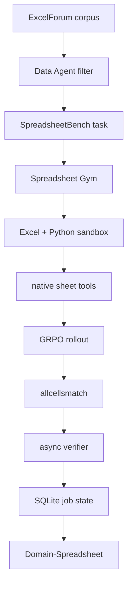

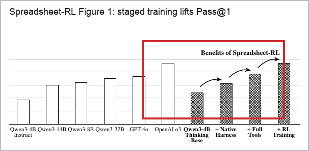{width=4.6in}

Caption: The source figure highlights the staged agent-training story: native thinking, harness scaffolding, tool access, and RL each add measurable Pass-at-1 before the paper evaluates on realistic spreadsheet tasks. [83](#source-83)

### Evidence map

| Claim | Evidence |
|---|---|
| Task shape | SpreadsheetBench tasks combine initial spreadsheets, a natural-language instruction, an oracle final spreadsheet, and answer/manipulation regions used for reward computation. [83](#source-83) |
| Data scale | The ExcelForum pipeline starts from 18,855 raw threads, 32,691 attachments, and 144,694 replies, then filters to 5,928 high-quality tasks. [83](#source-83) |
| Runtime fidelity | Spreadsheet Gym uses Microsoft Excel because modern formulas such as `FILTER`, `UNIQUE`, `SORT`, `TAKE`, and `MAP` are not reliably covered by alternative spreadsheet engines. [83](#source-83) |

### Walkthrough

The local artifact inventory for this read consists of the arXiv PDF and extracted full text; the read report verifies a 21-page PDF, a 1,590-line text extraction, manifest hashes for both artifacts, and a duplicate extracted-text copy with the same SHA-256 treated as non-separate evidence. [83](#source-83)

The paper's central claim is that spreadsheet agents can be specialized through reinforcement learning when the environment preserves real Excel semantics and the reward compares final workbook state against an oracle final workbook, rather than relying on free-form textual answers. [83](#source-83)

### Implementation notes

The source-derived implementation skeleton is a reward-service contract, not a prompt trick: keep mutable workbook state inside a rollout-specific directory, expose spreadsheet-native tools, and route reward through Excel recalculation plus answer-region comparison. [83](#source-83)

```text source="/Users/liuzikai/Documents/GitHub/deepbrief/artifacts/sixmonth-agent-search-2025-12-12_2026-06-12/reviews/subagents/read-paper-2605-22642v1.md"
workspace: one unique per-rollout filesystem workspace with seeded data.xlsx
tools: find_cells, inspect_range, fill_formula, clear_range, delete_rows, delete_columns, recalculate_and_read
reward: 0 for no valid output; otherwise allcellsmatch(Dpred, Do) on specified manipulation regions
verifier: open workbook in Excel -> recalculate -> compare answer-region cells against oracle -> store SQLite job state -> poll done/error
```

### Try it yourself

In 30-60 minutes, build a tiny workbook-verifier dry run from one spreadsheet task: define an initial workbook, a natural-language instruction, an oracle final workbook, and a small answer/manipulation region, then test whether a candidate output can be scored by exact manipulation-region comparison after recalculation. [83](#source-83)

### Open questions

1. How much of the gain comes from GRPO over the 5,928-task forum-derived set versus the spreadsheet-native harness and tool protocol that already raise SpreadsheetBench performance before RL? [83](#source-83)
2. Would the same reward and Spreadsheet Gym design scale to larger dense models, mixture-of-experts models, or closed frontier models, given that the reported experiments focus on relatively lightweight open-source models? [83](#source-83)
3. How often are coding-agent-generated oracle final workbooks wrong in ways that pass rule-based filters, and what human audit rate would be needed to measure that risk? [83](#source-83)
4. Why does real estate remain flat at 1.1 Pass-at-1 after RL while finance improves substantially on Domain-Spreadsheet? [83](#source-83)
5. Can the asynchronous Excel verifier meet multi-tenant production privacy and audit requirements, beyond the cleanup, timeout, bounded-worker, and minimal-retention mitigations described for RL throughput? [83](#source-83)
6. Does RL improve robustness to adversarial or malformed spreadsheets, hidden sheets, external links, macros, protected ranges, and locale-specific formulas, or only to the benchmarked workbook task distribution? [83](#source-83)

### Sources & citations

- [83](#source-83) Primary source for this deep dive: Spreadsheet-RL arXiv paper, local read report, artifact inventory, mechanism summary, evidence notes, limitations, and open questions.
- [7](#source-7) Related spreadsheet-agent context: multimodal spreadsheet understanding and editing.
- [81](#source-81) Supporting workflow context: extracted-value citations with source coordinates and confidence.
- [82](#source-82) Supporting workflow context: spreadsheet review UI with sheet/row/column overlays.
- [84](#source-84) Supporting workflow context: spreadsheet parsing controls for table boundaries, chunking, formulas, hidden content, and cell-count limits.

## Interpreter Layer: Interpreters in Deep Agents: Code Between Tool Calls and Sandboxes

### TL;DR

- LangChain's interpreter is a small runtime inside the agent loop: the model calls an `eval` tool, QuickJS evaluates TypeScript in a controlled context, and the harness decides which external capabilities are exposed through a host bridge. [56](#source-56)
- The practical gain is not "arbitrary code execution"; it is code-level composition over scoped capabilities, live interpreter state, and compact returns to model context instead of routing every intermediate tool observation through the model. [56](#source-56)

### Mental model

Think of the interpreter as a governed state-and-control layer between serial tool loops and full sandboxes: message history is what the model reasons over now, filesystem state is durable working memory, and live interpreter state is where arrays, maps, counters, queues, and helper functions can remain available across `eval` calls without immediately becoming prompt text. [56](#source-56)

### Why this matters now

The company/lab-docs lane frames this as a production agent-infrastructure pattern: progress is showing up in harness/runtime/control-plane design, and item 56 is the clearest runtime mechanism because it makes state placement, tool exposure, and context admission explicit. [56](#source-56) [53](#source-53) [64](#source-64) [92](#source-92)

### Mechanism trace

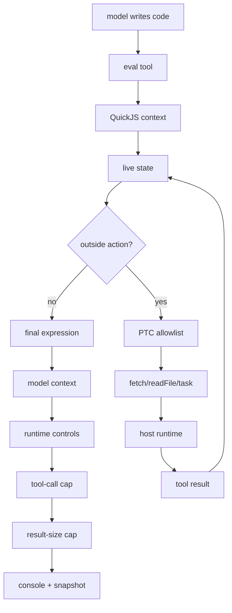

Reading the trace: the `eval` tool is the model-facing entry point, QuickJS is the constrained language context, the PTC allowlist is the bridge policy, the host runtime owns real capabilities, and the final expression is what returns to model context after interpreter code filters, aggregates, or delegates. [56](#source-56)

### Evidence map

| Claim | Evidence strength | What to preserve in implementation |
| --- | --- | --- |
| The interpreter sits between serial tool calls and full sandboxes, giving code-level composition over scoped capabilities. [56](#source-56) | Strong for architecture; the official post and read report give the mechanism and call flow, but not audited middleware internals. [56](#source-56) | Keep the boundary explicit: `eval` runs in QuickJS, while external actions cross a host bridge. [56](#source-56) |
| PTC is exposed by middleware through an allowlist, and allowlisted tools appear under the global `tools` namespace as async functions. [56](#source-56) | Strong for API shape; defaults and failure paths are not shown in the local artifact. [56](#source-56) | Store the PTC allowlist with runtime limits, argument validation, serialization rules, and error policy. [56](#source-56) |
| Live interpreter state can hold arrays, objects, maps, counters, queues, and helpers across repeated `eval` calls. [56](#source-56) | Strong as a design claim; snapshotting semantics for closures, promises, and handles remain open. [56](#source-56) | Treat snapshotting as preservation of serializable working data, not live resource preservation. [56](#source-56) |

### Walkthrough

Start with a document-heavy agent that needs to classify, extract, or synthesize across 10,000 documents. In a serial tool loop, the model searches, receives results in context, decides what to inspect next, and repeats; at scale, the read report flags verification difficulty, excessive intermediate context, latency, context limits, tool-call limits, and degraded state management through history. [56](#source-56)

With the interpreter path, the model writes code through `eval`: runtime arrays and maps hold document/search state, code iterates through batches, large-document candidate filtering narrows the set, `tools.task` performs subagent fan-out only on selected slices, and the interpreter returns compact evidence such as matched documents, extracted fields, unresolved cases, or summaries worth reasoning over. [56](#source-56)

### Implementation notes

Enable the interpreter as middleware, then expose tools deliberately. In the source's Python path, `CodeInterpreterMiddleware` adds the `eval` tool; adding `ptc=["task"]` is the allowlist move that lets interpreter code call the `task` bridge without exposing all agent tools. [56](#source-56)

```python source="/Users/liuzikai/Documents/GitHub/deepbrief/artifacts/sixmonth-agent-search-2025-12-12_2026-06-12/sources/raw/langchain-blog-blog-give-your-agents-an-interpreter-eb62e55c.html:803-820"
agent = create_deep_agent(
    model="openai:gpt-5.5",
    middleware=[CodeInterpreterMiddleware(ptc=["task"])],
)
```

### Try it yourself

Build a small retrieval-batching prototype with the same shape as the article's large-document example: load document metadata into live interpreter state, filter candidates programmatically, call `tools.task` only for selected slices, and return a compact evidence set rather than every intermediate search result. [56](#source-56)

### Open questions

- What are the default memory limits, per-eval timeout values, maximum PTC call counts, and maximum result sizes in the released Python and TypeScript packages? [56](#source-56)
- How are exceptions represented across the interpreter boundary: thrown tool errors, serialized return values, model-visible observations, trace events, or retriable middleware failures? [56](#source-56)

### Sources & citations

- Primary: [56](#source-56) https://www.langchain.com/blog/give-your-agents-an-interpreter
- Supporting: [53](#source-53) https://www.langchain.com/blog/the-anatomy-of-an-agent-harness
- Supporting: [64](#source-64) https://openai.com/index/running-codex-safely
- Supporting: [92](#source-92) https://arxiv.org/abs/2603.05344v3

# Skim Cards

## Papers, Evals, and Benchmarks

This lane moved from answer-only RAG scores toward generated evidence sets, perturbation tests, routing policies, and long-horizon task harnesses.

### MiRAGE: A Multiagent Framework for Generating Multimodal Multihop Question-Answer Dataset for RAG Evaluation

> **Verdict: watch for synthetic eval generation.** The recursive context-expansion loop is useful, but the visual-grounding scores and proprietary model stack keep it below direct adoption. [1](#source-1)

Item id: `paper-2601-15487v1`; source URL: https://arxiv.org/abs/2601.15487v1

MiRAGE composes a multimodal RAG-test generator from layout parsing, visual-element description, persona/domain identification, multihop context construction, QA verification, and deduplication. The part to borrow is not the whole generator; it is the recursive completeness loop that asks whether the current evidence context is enough, searches for missing chunks, reranks candidates, and admits them only when they add needed support. [1](#source-1)

### ChartEditBench: Evaluating Grounded Multi-Turn Chart Editing in Multimodal Language Models

> **Verdict: adopt the evaluation shape, not the dataset wholesale.** Stateful chart editing exposes accumulated code/visual drift that one-shot chart QA hides. [3](#source-3)

Item id: `arxiv_2602_15758`; source URL: https://arxiv.org/abs/2602.15758

ChartEditBench turns chart work into dependent turns: the model edits matplotlib code, renders an image, then must continue from its own prior prediction. The benchmark validates generated code with AST parsing, isolated execution, render checks, and required save/close structure before judging instruction following and visual similarity. [3](#source-3)

### Resources for Automated Evaluation of Assistive RAG Systems that Help Readers with News Trustworthiness Assessment

> **Verdict: mine for support-evaluation mechanics.** DRAGUN is not a general enterprise benchmark, but it is a concrete reminder that RAG outputs need source-support scoring, not only plausibility scoring. [4](#source-4)

Item id: `arxiv_2602_24277`; source URL: https://arxiv.org/abs/2602.24277

The TREC DRAGUN resource paper focuses on assistive RAG for news trustworthiness assessment. Its value for this stack is the evaluation stance: readers need help judging claims, so generated answers should be assessed against evidence, support, and usefulness to a verification task, not just against a reference answer. [4](#source-4)

### RAG-X: Systematic Diagnosis of Retrieval-Augmented Generation for Medical Question Answering

> **Verdict: borrow the diagnostic posture.** The medical domain is specialized, but the failure taxonomy is closer to production RAG debugging than aggregate answer accuracy. [6](#source-6)

Item id: `paper-2603-03541v1`; source URL: https://arxiv.org/abs/2603.03541v1

RAG-X is useful because it treats RAG as a coupled system whose failures can originate in retrieval, evidence selection, answer synthesis, or domain-specific reasoning. For a document/search/extraction stack, that means evals should separate "did the right evidence enter the context?" from "did the model interpret it correctly?" and "did citation selection stay faithful?" [6](#source-6)

### SoK: Agentic Retrieval-Augmented Generation (RAG): Taxonomy, Architectures, Evaluation, and Research Directions

> **Verdict: skim as a map, then move on.** It is useful for vocabulary alignment, but it is less actionable than mechanism papers and code diffs. [8](#source-8)

Item id: `paper-2603-07379v1`; source URL: https://arxiv.org/abs/2603.07379v1

The SoK gives a broad taxonomy for agentic RAG: query planning, retrieval actions, iterative refinement, memory, verification, and evaluation. Its main contribution to this brief is connective tissue, helping compare SPD-RAG, RAGSearch, navigable skills, and evidence-sufficiency benchmarks without calling all of them "agentic retrieval." [8](#source-8)

## Source-Code and Repository Changes

The repo lane mostly shows control boundaries becoming explicit: provider capability checks, skill packaging, typed subagent roles, content preservation, and request-parameter fidelity.

### Inspect AI evaluation harness: fix tool not supported errors (#2939)

> **Verdict: adopt the capability-gate pattern.** Provider-native tool declarations should be gated before request construction, not discovered through provider errors. [31](#source-31)

Item id: `commit-UKGovernmentBEIS-inspect_ai-4d1ab1c5083c-c7a37d3e`; source URL: https://github.com/UKGovernmentBEIS/inspect_ai/commit/4d1ab1c5083c892c6e164e8a24782f9731f1f8d3

The patch tightens Inspect's computer-tool lowering: OpenAI `computer_use_preview` now requires `computer-use-preview` in the model name, and Anthropic `computer_20251124` is limited to Claude Opus 4.5 rather than all Claude 4.5 models. The diff is narrow, but it protects eval runs from advertising provider-native tools to models that cannot accept them. [31](#source-31)

### Inspect AI evaluation harness: `skill()` tool for agent skills (#2976)

> **Verdict: steal the packaged-skill test surface.** Skills become measurable when they are installed into a sandbox and invoked as a tool. [33](#source-33)

Item id: `commit-UKGovernmentBEIS-inspect_ai-214f69a64cc1-3065da39`; source URL: https://github.com/UKGovernmentBEIS/inspect_ai/commit/214f69a64cc1ad38e783e7454d02b99f5eb5dd63

This Inspect commit adds a `skill()` tool plus `install_skills`, `read_skills`, `Skill`, and `SkillInfo`. The implementation validates `SKILL.md` frontmatter, copies skill folders into a sample sandbox under `skills/<name>`, marks scripts executable, and returns command metadata plus instructions when the model asks for a skill. [33](#source-33)

### OpenAI Agents SDK Python: fix: #2163 Preserve non-text tool outputs in LiteLLM and chatcmpl converters (#2214)

> **Verdict: adopt as a trace contract.** Tool output converters must preserve non-text payloads or citation/evidence artifacts quietly disappear. [34](#source-34)

Item id: `commit-openai-openai-agents-python-ba55bbd5961c-702bc2eb`; source URL: https://github.com/openai/openai-agents-python/commit/ba55bbd5961cd6e3f1003b188fa3aee74a73f097

The skimmed patch preserves non-text tool outputs when converting through LiteLLM and Chat Completions paths. For document/search systems, that class of change matters because tools increasingly return structured blocks, images, bounding boxes, files, or spreadsheet ranges rather than only strings. [34](#source-34)

### Reducto Python document AI SDK: feat(api): api update

> **Verdict: adopt the row/column table-control idea.** Large-table parsing needs shape-aware knobs, not only a scalar chunk size. [41](#source-41)

Item id: `commit-reductoai-reducto-python-sdk-3233b72f5777-802acbaa`; source URL: https://github.com/reductoai/reducto-python-sdk/commit/3233b72f57774b02f3793f9b8c4f43508eae442a

The Reducto Python SDK patch models large-table chunking as either the prior integer size or an explicit row/column policy. The read report anchors the new `Size` model and request-param mirror to patch lines that add row and column fields, while retaining the older scalar path. [41](#source-41)

### OpenAI Codex terminal coding agent: feat: add agent roles to collab tools (#9275)

> **Verdict: adopt typed delegation roles.** Multi-agent work gets safer when role selection is a tool argument, not only a prose convention. [44](#source-44)

Item id: `commit-openai-codex-05b960671dcd-1feead1f`; source URL: https://github.com/openai/codex/commit/05b960671dcd3ab062a1214b93447851ea432636

The Codex patch adds an `agent_type` parameter to `spawn_agent`, introduces an `AgentRole` enum, and maps roles such as `default`, `orchestrator`, and `worker` into concrete profile changes. The orchestrator prompt tells the spawned agent to delegate, monitor, verify, and close workers rather than perform all work itself. [44](#source-44)

## Company and Lab Engineering Notes

The company-doc lane is strongest when it exposes operational boundaries: harness composition, document-agent product requirements, trace wiring, OCR failure modes, and OS sandbox tradeoffs.

### The Anatomy of an Agent Harness

> **Verdict: use as framing language.** It names the harness boundary cleanly, but it should be paired with harder code and eval evidence. [53](#source-53)

Item id: `langchain_blog_blog-the-anatomy-of-an-agent-harness_0f31af34`; source URL: https://www.langchain.com/blog/the-anatomy-of-an-agent-harness

The article's useful formula is `Agent = Model + Harness`. The harness includes prompts, tools, MCPs, filesystem and browser infrastructure, sandboxes, subagent orchestration, model routing, compaction, continuation, linting, and verification hooks. That is exactly the right vocabulary for explaining why agent quality in this report is mostly runtime design, not only base-model intelligence. [53](#source-53)

### What is an Agentic Document Platform? | Reducto

> **Verdict: keep as a product taxonomy.** It captures where document AI is going, while the implementation claims need separate proof. [55](#source-55)

Item id: `reducto_site_blog-reducto-what-is-an-agentic-document-platform_43e262dc`; source URL: https://reducto.ai/blog/reducto-what-is-an-agentic-document-platform

Reducto frames the progression from OCR to IDP to ADP to an "agentic document platform" that supports ingestion, understanding, comparison, manipulation, generation, downstream action, human handoff, and reliability at scale. The operational buyer criteria are also useful: private zero-shot accuracy, production throughput, multimodal file fidelity, API/control surface quality, and enterprise posture. [55](#source-55)

### Trace OpenAI Agents SDK applications - Docs by LangChain

> **Verdict: adopt the trace-processor wiring.** Agent steps, model calls, tool calls, and handoffs should enter one trace surface. [58](#source-58)

Item id: `langchain_docs_langsmith-trace-with-openai-agents-sdk_ac080413`; source URL: https://docs.langchain.com/langsmith/trace-with-openai-agents-sdk

The LangSmith docs show a concrete bridge: install `langsmith[openai-agents]`, set LangSmith and OpenAI environment variables, import `Agent`, `Runner`, and `set_trace_processors`, then attach `OpenAIAgentsTracingProcessor` so OpenAI Agents SDK runs appear in LangSmith with spans and details. [58](#source-58)

### Engineering Insights: Failure Modes That Break VLM-Powered OCR in Production

> **Verdict: adopt the failure taxonomy.** OCR/VLM failures are production interface failures, not just model-recognition errors. [60](#source-60)

Item id: `llamaindex-blog-engineering-insights-failure-modes-that-break-vlm-powered-ocr-in-productio`; source URL: https://www.llamaindex.ai/blog/engineering-insights-failure-modes-that-break-vlm-powered-ocr-in-production

The LlamaIndex post is useful because it treats VLM OCR as a production system with failure modes around layout, tables, visual regions, long documents, and messy document structure. That is closer to PDF extraction reality than a clean OCR benchmark where text accuracy is the only target. [60](#source-60)

### Evaluate With OpenTelemetry

> **Verdict: adopt trace-routed evaluation.** The key move is binding production traces to dataset examples through span attributes. [62](#source-62)

Item id: `langchain-docs-docs-langchain-com-langsmith-evaluate-with-opentelemetry`; source URL: https://docs.langchain.com/langsmith/evaluate-with-opentelemetry

This LangSmith doc turns ordinary OpenTelemetry traces into experiment rows by requiring attributes such as `langsmith.trace.session_id`, `langsmith.reference_example_id`, `inputs`, and `outputs`. Evaluators attached to the dataset can then score traces routed to the experiment session. [62](#source-62)

## Eval, Observability, and Security

This lane shows eval infrastructure becoming part of runtime telemetry: scorer inputs, judge prompts, observation jobs, and GenAI tool envelopes are moving into code and schemas.

### Arize-ai/phoenix commit da13ad54784b: correctness evaluator

> **Verdict: adopt only after customization.** Phoenix's packaged correctness judge is a good scaffold, but binary "correct/incorrect" is too blunt for field-level extraction. [69](#source-69)

Item id: `github-arize-ai-phoenix-commits-arize-ai-phoenix-commit-da13ad54784b-cor`; source URL: https://github.com/Arize-ai/phoenix/commit/da13ad54784bfbdcd133a0c18e5f99e80a2b6482

The Phoenix patch adds a generated correctness prompt, TypeScript `createCorrectnessEvaluator`, Python `CorrectnessEvaluator`, public exports, and a benchmark with paired correct/incorrect variants across factual accuracy, completeness, logical consistency, partial correctness, and technical precision. The rubric maps `correct` to 1 and `incorrect` to 0 with `MAXIMIZE` optimization. [69](#source-69)

### What Should I Cite? A RAG Benchmark for Academic Citation Prediction

> **Verdict: borrow the citation-prediction framing.** The scores are modest, but the task shape is a strong analogue for citation-support retrieval. [73](#source-73)

Item id: `arxiv-citation-grounding-what-should-i-cite-a-rag-benchmark-for-academic`; source URL: https://arxiv.org/abs/2601.14949

CiteRAG defines two citation tasks: produce a ranked reference list from title/abstract, and fill individual citation placeholders from local context plus corpus metadata. The corpus has three levels of paper representation and removes evaluation papers from the retrieval pool to reduce contamination. [73](#source-73)

### langfuse/langfuse commit a604f8e61bd2: single observation evals

> **Verdict: adopt as an observability architecture signal.** Runtime observations can become scoring jobs without waiting for offline experiment batches. [74](#source-74)

Item id: `github-langfuse-langfuse-commits-langfuse-langfuse-commit-a604f8e61bd2-s`; source URL: https://github.com/langfuse/langfuse/commit/a604f8e61bd21c89a968463adf3c9e562066c5f5

The Langfuse patch moves LLM-as-judge scoring toward individual production observations. The read report describes normalization, active-config filtering and sampling, replayable payload persistence, queueing an isolated judge job, and writing score events through the existing executor path. [74](#source-74)

### braintrustdata/braintrust-sdk commit ef1c89e8f840: thread fetching in trace scorers

> **Verdict: adopt the scorer-context idea.** Judges need the conversation thread users recognize, not a raw span pile. [75](#source-75)

Item id: `github-braintrustdata-braintrust-sdk-commits-braintrustdata-braintrust-s-2`; source URL: https://github.com/braintrustdata/braintrust-sdk-javascript/commit/ef1c89e8f840a14f44cd6682bc92f7ce2ea9d07d

Braintrust adds `Trace.getThread(options)` for JavaScript scorer code, plus thread utilities for formatting messages, preserving tool-call context, merging preprocessor fragments, and exposing template variables such as `thread`, `first_message`, and `last_message`. `flushBeforeScoring` forces span persistence before scoring when needed. [75](#source-75)

### open-telemetry/semantic-conventions commit 08de1bce7fa1: built-in tools support

> **Verdict: adopt the envelope distinction.** Provider-executed tools and client-executed functions need separate telemetry shapes. [76](#source-76)

Item id: `github-open-telemetry-semantic-conventions-commits-open-telemetry-semant-2`; source URL: https://github.com/open-telemetry/semantic-conventions/commit/08de1bce7fa19dd7710d50b2a4649bb67357332e

The OpenTelemetry semantic-conventions patch adds `server_tool_call` and `server_tool_call_response` message parts so provider-side tools such as code interpreter or web search can be represented separately from client-side function calls. The schema uses a fixed outer envelope with extensible provider-specific bodies. [76](#source-76)

## Applied Document, Spreadsheet, and Workflow AI

The applied lane makes the document-agent stack more concrete: deterministic synthetic corpora, auditable intermediate models, spreadsheet coordinate overlays, and parser configuration surfaces.

### Scalable and Reliable Evaluation of AI Knowledge Retrieval Systems: RIKER and the Coherent Simulated Universe

> **Verdict: adopt the benchmark-construction trick.** Generate ground truth first, then render documents, instead of asking an LLM judge to infer truth from messy outputs. [77](#source-77)

Item id: `paper-2601-08847v2`; source URL: https://arxiv.org/abs/2601.08847v2

RIKER builds a relational ground-truth database, renders coherent documents from it, and generates answer-keyed questions from the same source of truth. Its Coherent Simulated Universe reuses people, properties, companies, and relationships across leases, field reports, and HR records, then separates single-document extraction, aggregation, and hallucination probes. [77](#source-77)

### AutoSAM: an Agentic Framework for Automating Input File Generation for the SAM Code with Multi-Modal Retrieval-Augmented Generation

> **Verdict: adopt the intermediate-representation checkpoint.** Safety-critical document automation should pause at a human-readable structured model before final syntax. [78](#source-78)

Item id: `paper-2603-24736v1`; source URL: https://arxiv.org/abs/2603.24736v1

AutoSAM turns heterogeneous engineering artifacts into SAM thermal-hydraulics input decks through expert instructions, RAG over manuals, and tools for PDFs, images, spreadsheets, text, validation, and Python execution. The key design is a YAML-like intermediate file that domain experts can verify before an Input Creator Tool emits solver syntax. [78](#source-78)

### Citations - Reducto

> **Verdict: adopt the response-shape standard.** Extracted values should carry source coordinates, source text, confidence, and parent context by default. [81](#source-81)

Item id: `reducto-docs-docs-reducto-ai-configs-extract-citations`; source URL: https://docs.reducto.ai/configs/extract/citations

Reducto's citation config changes extraction responses from scalar fields into `value` plus `citations`. Each citation can include block type, source content, normalized PDF/image bounding boxes, sheet/cell coordinates for spreadsheets, page/original-page fields, categorical confidence, numeric granular confidence, and parent block context. [81](#source-81)

### SpreadsheetViewer - Reducto

> **Verdict: adopt the UI primitive.** Spreadsheet evidence is spatial; users need sheet/row/column overlays, not only JSON. [82](#source-82)

Item id: `reducto-docs-docs-reducto-ai-components-spreadsheet-viewer`; source URL: https://docs.reducto.ai/components/spreadsheet-viewer

`SpreadsheetViewer` is a read-only React component for viewing Excel files with clickable colored bounding boxes. Its `BoundingBox` records use `page` as one-indexed sheet number, `top` and `left` as row/column starts, and `width` / `height` as spans, with optional labels and metadata for linking extraction blocks back to workbook regions. [82](#source-82)

### Spreadsheet Processing - Reducto

> **Verdict: adopt parser knobs as eval variables.** Spreadsheet ingestion needs explicit policies for clustering, chunking, hidden content, formulas, and cell caps. [84](#source-84)

Item id: `reducto-docs-docs-reducto-ai-configs-parse-spreadsheet`; source URL: https://docs.reducto.ai/configs/parse/spreadsheet

Reducto's spreadsheet parse config exposes table clustering, large-table splitting, cell metadata extraction, hidden-content exclusions, and `max_cell_count` guardrails. Clustering can be `accurate`, `fast`, or `disabled`; large tables default to 50-row chunks with repeated headers; formulas and colors can be preserved when needed. [84](#source-84)

## Model Training, Inference, Memory, and Context

This lane is less about frontier model releases and more about the operating substrate: file-native context, task-matched examples, operational contracts, personal-context tools, and least-privilege harnesses.

### Structured Context Engineering for File-Native Agentic Systems: Evaluating Schema Accuracy, Format Effectiveness, and Multi-File Navigation at Scale

> **Verdict: adopt the "grep tax" lens.** Compact formats are not automatically efficient for agents if the retrieval tool surface fights model priors. [86](#source-86)

Item id: `paper-2602-05447v2`; source URL: https://arxiv.org/abs/2602.05447v2

The paper compares file-native schema navigation against prompt-stuffed schema context across YAML, Markdown, JSON, and TOON, with schemas up to 10,000 tables. The finding is model-contingent: frontier models gain modestly from file-native retrieval, while some open-source models struggle, and YAML can beat more compact formats because it is sparse, familiar, and grep-friendly. [86](#source-86)

### CL4SE: Benchmarking Context Learning on Software Engineering

> **Verdict: adopt task-specific context policies.** More examples help some coding tasks and hurt others; retrieval depth should depend on the cognitive demand. [89](#source-89)

Item id: `paper-2602-23047v3`; source URL: https://arxiv.org/abs/2602.23047v3

CL4SE maps four context types to software-engineering tasks: interpretable examples for code generation, project-specific context for summarization, procedural decision traces for code review, and mixed positive/negative examples for patch correctness. The read report highlights that code review improves up to five-shot, while code summarization peaks at one-shot and degrades with additional examples. [89](#source-89)

### PARCER as an Operational Contract to Reduce Variance, Cost, and Risk in LLM Systems

> **Verdict: use as a checklist, not an evidence-backed system.** The operational-contract shape is useful; the paper does not prove the contract reduces variance. [90](#source-90)

Item id: `paper-2603-00856v1`; source URL: https://arxiv.org/abs/2603.00856v1

PARCER proposes a YAML operational contract with seven phases: objective rewrite, risk mapping, constrained tool execution, validation tribunal, metrics export, handoff, and changelog. The validation phase names evidence dockets, assumptions registers, derivation traces, hard gates, and decision-hygiene checks; budgeting adapts under uncertainty and context pressure. [90](#source-90)

### ASTRA-bench: Evaluating Tool-Use Agent Reasoning and Action Planning with Personal User Context

> **Verdict: adapt the personal-context diagnostics.** Retrieval recall is not enough when the failure is structured action arguments. [91](#source-91)

Item id: `arxiv_2603_01357`; source URL: https://arxiv.org/abs/2603.01357

ASTRA-bench builds personal-assistant scenarios over simulated users with biographies, social graphs, events, emails, calendars, messages, contacts, WhatsApp threads, and call logs. It extends a tool sandbox with personal context, a temporal anchor, 27 tools across six domains, and rule-based plus LLM-based evaluators. [91](#source-91)

### Herding CATs: ALARA for Agent Harness Engineering in Portable Composable Multi-Agent Teams

> **Verdict: adopt least-privilege tool catalogs.** Tools absent from the schema cannot be invoked by prompt injection or attention drift. [94](#source-94)

Item id: `paper-2603-20380v2`; source URL: https://arxiv.org/abs/2603.20380v2

Herding CATs proposes file-native context files, NPC files, and Jinxes: YAML tool definitions with typed inputs and ordered steps over engines such as Python, bash, LLM calls, or other Jinxes. The Jinx list is both catalog and permission set, so each agent sees only the capabilities its role needs. [94](#source-94)

# Change Maps

## Code and Repo Change Map

| Change | Stack translation |
|---|---|
| MCPServerManager | Track server connect, failure, reconnect, active set, and cleanup as trace state. [45](#source-45) |
| Tool guardrails | Attach input/output policy at tool declaration time. [38](#source-38) |
| Inspect tool and skill changes | Test tool availability, skill packaging, and provider-specific lowering before eval runs. [31](#source-31) [33](#source-33) |
| Codex roles and safety docs | Make delegation role, sandbox, approval, network, identity, and telemetry explicit config. [44](#source-44) [64](#source-64) |
| Non-text output preservation | Keep files, media, and structured tool outputs through adapter conversion. [34](#source-34) |

## Paper and Eval Map

| Source | Mechanism to steal |
|---|---|
| EMB-S / CUE-R | Score all required evidence and perturb support before answer quality. [2](#source-2) [22](#source-22) |
| DocSeeker / SPD-RAG | Put localization in the schema and decompose search by page or document. [26](#source-26) [9](#source-9) |
| BRTR / Spreadsheet-RL | Treat spreadsheets as coordinate-bearing workbooks with verifiers, not flat tables. [7](#source-7) [83](#source-83) |
| RAGSearch / structured context | Compare dense, graph, and navigation controls under the same trajectory metric. [21](#source-21) [86](#source-86) |
| RIKER | Generate ground truth first, render documents second, and score deterministic keys. [77](#source-77) |

## Company and Product Map

| Product signal | Market read |
|---|---|
| Codex safety and Windows sandbox | Local agents need OS-level containment plus enterprise policy and telemetry. [64](#source-64) [63](#source-63) |
| LangSmith / OTel | Agent steps, tool calls, handoffs, and eval identity are becoming trace-native. [58](#source-58) [62](#source-62) |
| Reducto citations/viewers | Source coordinates and review surfaces are becoming document-AI primitives. [81](#source-81) [82](#source-82) |
| Interpreters | Code-between-tools gives stateful composition without a full VM per task. [56](#source-56) |
| OCR failure writing | Production parsing needs layout/visual failure fixtures, not only text-recognition scores. [60](#source-60) |

## Upgrade Plan For My Stack

| Area | Concrete change |
|---|---|
| Markdown KB as typed IR | Compile Markdown into section IDs, entities, source ranges, cell coordinates, and navigation links. [28](#source-28) [86](#source-86) |
| Pydantic field evals | Score value, citation sufficiency, confidence reason, and ambiguity separately by field type. [69](#source-69) [73](#source-73) |
| Retrieval sufficiency | Add FR-at-k/all-evidence metrics, support-removal ablations, and cited-span checks. [2](#source-2) [22](#source-22) |
| Tool trajectory eval | Store `rag_search`, `grep_search`, browsed ranges, skipped candidates, Excel runs, and final validation in one scorer-readable trace. [75](#source-75) [62](#source-62) |
| Excel subagent | Return workbook path, sheet, row/column span, formula visibility, parse policy, and verifier result per value. [83](#source-83) [84](#source-84) |
| Observability | Separate client tools, server tools, MCP lifecycle, interpreter evals, citation validators, and schema validation as span kinds. [76](#source-76) [45](#source-45) |
| Adversarial fixtures | Add hard-negative PDFs, hidden spreadsheet sheets, OCR traps, prompt-injection text, and malicious formulas. [2](#source-2) [60](#source-60) |
| Confidence calibration | Calibrate by field, tool path, source bucket, parse confidence, and evidence sufficiency. [77](#source-77) [81](#source-81) |

# Pipeline Report

## Research Coverage

| Gate | Result |
|---|---:|
| Screened candidates | 2,747 |
| Raw manifest artifacts | 158 |
| Selected source-specific reads | 100 |
| Read reports | 100 |
| Report set rows | 70 |
| Local repo patch/diff artifacts | 110 |
| Degraded buffer-only artifacts | 3 |
| Deep dives / skim cards | 12 / 30 |

Discovery covered the full 2025-12-12 through 2026-06-12 window across papers, repos, company docs, eval/observability/security, applied workflows, model/context, builder discourse, and lectures. Raw lane outputs live under `reviews/fanout/`; eight lane syntheses live under `reviews/synthesis/`.

## Fan-Out and Verification

Source-specific reads ran in 17 waves with a cap of 6, yielding 100 completed read agents, 0 timeouts, and 0 failures. The 12 deep dives were drafted by source-specific composer subagents from read reports plus lane syntheses. The final audit found no duplicate Mermaid blocks, no duplicate code blocks, no repeated boilerplate over the renderer limit, and no high-overlap deep-dive pairs.

Verification artifacts: `sources/candidates.jsonl`, `sources/manifest.jsonl`, `sources/selected-for-read.jsonl`, `sources/selected-for-report.jsonl`, `reviews/fanout-report.md`, `reviews/composition-report.md`, `verification/evidence-matrix.jsonl`, `verification/gate-validation.json`, and `verification/source-quality-audit.md`.

## Boundary Notes

The legacy DeepBrief engine, `deepbrief`, `python -m deepbrief.cli`, Anthropic/Claude Agent SDK stages, provider secrets, `.env`, downloaded repository tests/builds, and downloaded repository code execution were not invoked. Three degraded HTML buffer captures are excluded from material claims.

# Month-Ahead Queue

1. Build a 30-question evidence-sufficiency eval with gold document IDs, near-miss negatives, and FR-at-k/all-evidence metrics. [2](#source-2) [22](#source-22)
2. Add typed citation objects: source type, page/sheet/range, quoted content, confidence bucket, parse confidence, and support verdict. [81](#source-81) [82](#source-82)
3. Instrument search, browse, Excel Python, and final validation as one OpenTelemetry-compatible trace. [62](#source-62) [75](#source-75)
4. Run a spreadsheet eval sprint over hidden sheets, merged headers, formulas, cross-sheet refs, and long ledgers. [83](#source-83) [84](#source-84)
5. Prototype a KB navigation layer with `INDEX.md`, entity links, and `get_document_range` as the factual-evidence call. [28](#source-28) [86](#source-86)
6. Add untrusted-document fixtures for PDFs, emails, OCR traps, hidden spreadsheet content, and malicious formulas. [60](#source-60) [63](#source-63)

# Errata

- The earlier rendered PDF was rejected for template-stamped composition; this version uses source-specific composer drafts and individually written skim cards.
- Five previous read-report padding sections were removed before composition; line-range refs are accepted without padding.
- Three degraded HTML buffer artifacts are excluded from material claims.
- Some HTML evidence is minified or single-line; read reports and the evidence matrix use line refs plus anchor phrases.
- Repo sources were inspected as patches/diffs only; no downloaded repo code was executed.

# Citation Appendix

### [1] MiRAGE: A Multiagent Framework for Generating Multimodal Multihop Question-Answer Dataset for RAG Evaluation {#source-1}

- URL: https://arxiv.org/abs/2601.15487v1
- Type: paper

### [2] Beyond the Needle's Illusion: Decoupled Evaluation of Evidence Access and Use under Semantic Interference at 326M-Token Scale {#source-2}

- URL: https://arxiv.org/abs/2601.20276v1
- Type: paper

### [3] ChartEditBench: Evaluating Grounded Multi-Turn Chart Editing in Multimodal Language Models {#source-3}

- URL: https://arxiv.org/abs/2602.15758
- Type: paper

### [4] Resources for Automated Evaluation of Assistive RAG Systems that Help Readers with News Trustworthiness Assessment {#source-4}

- URL: https://arxiv.org/abs/2602.24277
- Type: paper

### [6] RAG-X: Systematic Diagnosis of Retrieval-Augmented Generation for Medical Question Answering {#source-6}

- URL: https://arxiv.org/abs/2603.03541v1
- Type: paper

### [7] Beyond Rows to Reasoning: Agentic Retrieval for Multimodal Spreadsheet Understanding and Editing {#source-7}

- URL: https://arxiv.org/abs/2603.06503
- Type: paper

### [8] SoK: Agentic Retrieval-Augmented Generation (RAG): Taxonomy, Architectures, Evaluation, and Research Directions {#source-8}

- URL: https://arxiv.org/abs/2603.07379v1
- Type: paper

### [9] SPD-RAG: Sub-Agent Per Document Retrieval-Augmented Generation {#source-9}

- URL: https://arxiv.org/abs/2603.08329v1
- Type: paper

### [11] GLM-OCR Technical Report {#source-11}

- URL: https://arxiv.org/abs/2603.10910v2
- Type: paper

### [12] Structured Linked Data as a Memory Layer for Agent-Orchestrated Retrieval {#source-12}

- URL: https://arxiv.org/abs/2603.10700v1
- Type: paper

### [13] AgentTrace: Causal Graph Tracing for Root Cause Analysis in Deployed Multi-Agent Systems {#source-13}

- URL: https://arxiv.org/abs/2603.14688
- Type: paper

### [20] OmniSch: A Multimodal PCB Schematic Benchmark For Structured Diagram Visual Reasoning {#source-20}

- URL: https://arxiv.org/abs/2604.00270v4
- Type: paper

### [21] Do We Still Need GraphRAG? Benchmarking RAG and GraphRAG for Agentic Search Systems {#source-21}

- URL: https://arxiv.org/abs/2604.09666v1
- Type: paper

### [22] CUE-R: Beyond the Final Answer in Retrieval-Augmented Generation {#source-22}

- URL: https://arxiv.org/abs/2604.05467v1
- Type: paper

### [25] Adaptive Query Routing: A Tier-Based Framework for Hybrid Retrieval Across Financial, Legal, and Medical Documents {#source-25}

- URL: https://arxiv.org/abs/2604.14222v1
- Type: paper

### [26] DocSeeker: Structured Visual Reasoning with Evidence Grounding for Long Document Understanding {#source-26}

- URL: https://arxiv.org/abs/2604.12812v5
- Type: paper

### [28] Don't Retrieve, Navigate: Distilling Enterprise Knowledge into Navigable Agent Skills for QA and RAG {#source-28}

- URL: https://arxiv.org/abs/2604.14572v3
- Type: paper

### [31] Inspect AI evaluation harness: fix tool not supported errors (#2939) {#source-31}

- URL: https://github.com/UKGovernmentBEIS/inspect_ai/commit/4d1ab1c5083c892c6e164e8a24782f9731f1f8d3
- Type: repo_commit

### [33] Inspect AI evaluation harness: `skill()` tool for agent skills (#2976) {#source-33}

- URL: https://github.com/UKGovernmentBEIS/inspect_ai/commit/214f69a64cc1ad38e783e7454d02b99f5eb5dd63
- Type: repo_commit

### [34] OpenAI Agents SDK Python: fix: #2163 Preserve non-text tool outputs in LiteLLM and chatcmpl converters (#2214) {#source-34}

- URL: https://github.com/openai/openai-agents-python/commit/ba55bbd5961cd6e3f1003b188fa3aee74a73f097
- Type: repo_commit

### [38] OpenAI Agents SDK Python: feat: Add tool guardrails to function_tool decorator args (ref #2218) (#2227) {#source-38}

- URL: https://github.com/openai/openai-agents-python/commit/718a99e1e07fd0b5ef108183a61d5cb0799a92b3
- Type: repo_commit

### [41] Reducto Python document AI SDK: feat(api): api update {#source-41}

- URL: https://github.com/reductoai/reducto-python-sdk/commit/3233b72f57774b02f3793f9b8c4f43508eae442a
- Type: repo_commit

### [44] OpenAI Codex terminal coding agent: feat: add agent roles to collab tools (#9275) {#source-44}

- URL: https://github.com/openai/codex/commit/05b960671dcd3ab062a1214b93447851ea432636
- Type: repo_commit

### [45] OpenAI Agents SDK Python: feat: add MCPServerManager for safely managing server lifecycle (#2350) {#source-45}

- URL: https://github.com/openai/openai-agents-python/commit/dfc1f33fda2b0ecdeffc00c3ec999dd9aa8923ee
- Type: repo_commit

### [53] The Anatomy of an Agent Harness {#source-53}

- URL: https://www.langchain.com/blog/the-anatomy-of-an-agent-harness
- Type: engineering_post

### [55] What is an Agentic Document Platform? | Reducto {#source-55}

- URL: https://reducto.ai/blog/reducto-what-is-an-agentic-document-platform
- Type: engineering_post

### [56] Interpreters in Deep Agents: Code Between Tool Calls and Sandboxes {#source-56}

- URL: https://www.langchain.com/blog/give-your-agents-an-interpreter
- Type: engineering_post

### [58] Trace OpenAI Agents SDK applications - Docs by LangChain {#source-58}

- URL: https://docs.langchain.com/langsmith/trace-with-openai-agents-sdk
- Type: technical_doc

### [60] Engineering Insights: Failure Modes That Break VLM-Powered OCR in Production {#source-60}

- URL: https://www.llamaindex.ai/blog/engineering-insights-failure-modes-that-break-vlm-powered-ocr-in-production
- Type: article

### [62] Evaluate With OpenTelemetry {#source-62}

- URL: https://docs.langchain.com/langsmith/evaluate-with-opentelemetry
- Type: technical_doc

### [63] Building a safe, effective sandbox to enable Codex on Windows {#source-63}

- URL: https://openai.com/index/building-codex-windows-sandbox/
- Type: technical_doc

### [64] Running Codex safely at OpenAI {#source-64}

- URL: https://openai.com/index/running-codex-safely
- Type: engineering_post

### [69] Arize-ai/phoenix commit da13ad54784b: correctness evaluator {#source-69}

- URL: https://github.com/Arize-ai/phoenix/commit/da13ad54784bfbdcd133a0c18e5f99e80a2b6482
- Type: repo_commit

### [73] What Should I Cite? A RAG Benchmark for Academic Citation Prediction {#source-73}

- URL: https://arxiv.org/abs/2601.14949
- Type: paper

### [74] langfuse/langfuse commit a604f8e61bd2: single observation evals {#source-74}

- URL: https://github.com/langfuse/langfuse/commit/a604f8e61bd21c89a968463adf3c9e562066c5f5
- Type: repo_commit

### [75] braintrustdata/braintrust-sdk commit ef1c89e8f840: thread fetching in trace scorers {#source-75}

- URL: https://github.com/braintrustdata/braintrust-sdk-javascript/commit/ef1c89e8f840a14f44cd6682bc92f7ce2ea9d07d
- Type: repo_commit

### [76] open-telemetry/semantic-conventions commit 08de1bce7fa1: built-in tools support {#source-76}

- URL: https://github.com/open-telemetry/semantic-conventions/commit/08de1bce7fa19dd7710d50b2a4649bb67357332e
- Type: repo_commit

### [77] Scalable and Reliable Evaluation of AI Knowledge Retrieval Systems: RIKER and the Coherent Simulated Universe {#source-77}

- URL: https://arxiv.org/abs/2601.08847v2
- Type: paper

### [78] AutoSAM: an Agentic Framework for Automating Input File Generation for the SAM Code with Multi-Modal Retrieval-Augmented Generation {#source-78}

- URL: https://arxiv.org/abs/2603.24736v1
- Type: paper

### [81] Citations - Reducto {#source-81}

- URL: https://docs.reducto.ai/configs/extract/citations
- Type: technical_doc

### [82] SpreadsheetViewer - Reducto {#source-82}

- URL: https://docs.reducto.ai/components/spreadsheet-viewer
- Type: technical_doc

### [83] Spreadsheet-RL: Advancing Large Language Model Agents on Realistic Spreadsheet Tasks via Reinforcement Learning {#source-83}

- URL: https://arxiv.org/abs/2605.22642v1
- Type: paper

### [84] Spreadsheet Processing - Reducto {#source-84}

- URL: https://docs.reducto.ai/configs/parse/spreadsheet
- Type: technical_doc

### [86] Structured Context Engineering for File-Native Agentic Systems: Evaluating Schema Accuracy, Format Effectiveness, and Multi-File Navigation at Scale {#source-86}

- URL: https://arxiv.org/abs/2602.05447v2
- Type: paper

### [89] CL4SE: Benchmarking Context Learning on Software Engineering {#source-89}

- URL: https://arxiv.org/abs/2602.23047v3
- Type: paper

### [90] PARCER as an Operational Contract to Reduce Variance, Cost, and Risk in LLM Systems {#source-90}

- URL: https://arxiv.org/abs/2603.00856v1
- Type: paper

### [91] ASTRA-bench: Evaluating Tool-Use Agent Reasoning and Action Planning with Personal User Context {#source-91}

- URL: https://arxiv.org/abs/2603.01357
- Type: paper

### [92] Building Effective AI Coding Agents for the Terminal: Scaffolding, Harness, Context Engineering, and Lessons Learned {#source-92}

- URL: https://arxiv.org/abs/2603.05344v3
- Type: paper

### [94] Herding CATs: ALARA for Agent Harness Engineering in Portable Composable Multi-Agent Teams {#source-94}

- URL: https://arxiv.org/abs/2603.20380v2
- Type: paper
