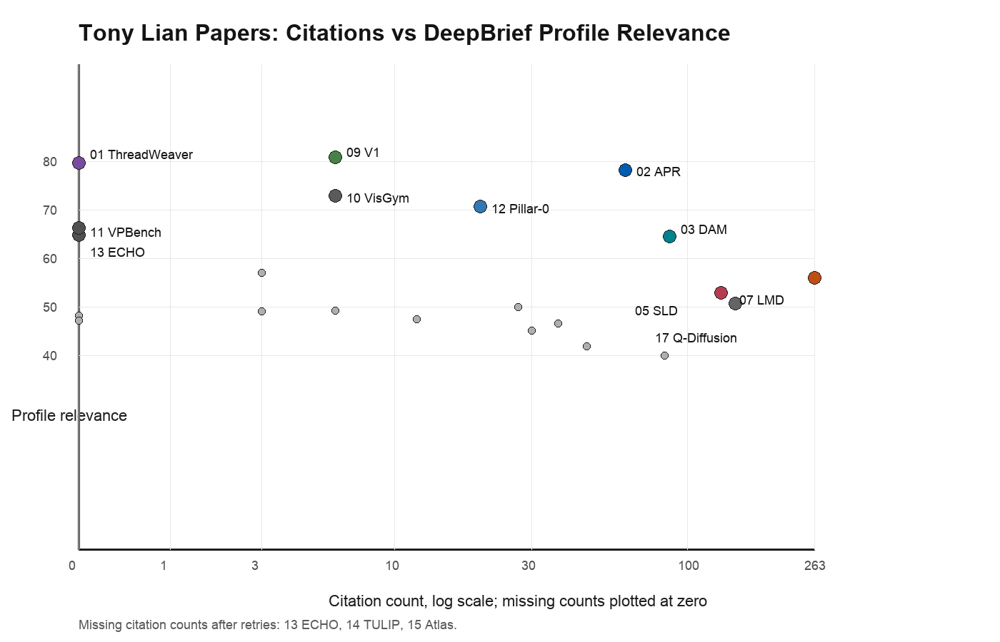
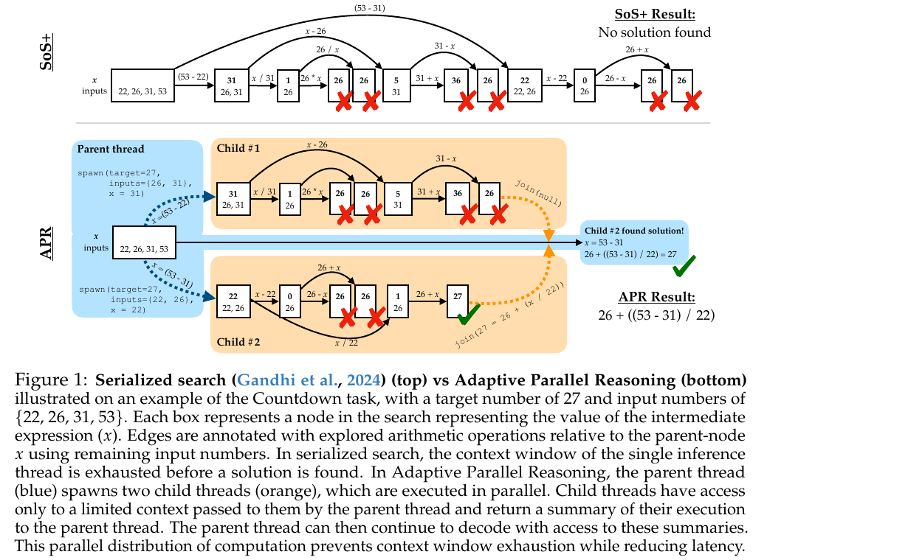

# Tony Lian Papers: Citation and Relevance Brief

Date: 2026-07-06  
Scope: every publication entry linked from `https://tonylian.com/` as of the local crawl.  
Safety note: generated inside a Codex session using the local `deepbrief-daily` workflow as reference; the legacy DeepBrief engine was not invoked.

## Executive Summary

The crawl found 22 Tony Lian publication entries with paper links. All 22 PDFs were downloaded locally, extracted to text, and assigned to actual source-specific subagents. The local artifact gate passed: 22 PDFs, 22 extracted texts, 22 read reports, 165 manifest records, and no blocked paper downloads.

The raw citation winner is `LLM-grounded Diffusion` with 263 Semantic Scholar citations [S07](#source-s07). The strongest profile-relevance item is `V1`, followed closely by `ThreadWeaver` and APR, because the local reader profile rewards mechanism-first agent/runtime work, evals, LLM-as-judge mechanics, and implementation tradeoffs [S09](#source-s09) [S01](#source-s01) [S02](#source-s02). The combined reader-utility winner is APR: it has substantial citation signal, a concrete `spawn()`/`join()` runtime, end-to-end RL training, and direct transfer to agent orchestration [S02](#source-s02).

Three citation counts remain explicitly missing after retries: ECHO, TULIP, and Atlas [S13](#source-s13) [S14](#source-s14) [S15](#source-s15). Their PDFs and read reports are verified; only live citation counts are degraded.

## Method

The crawler used Tony Lian's homepage as the candidate source and treated only publication blocks as papers. Side projects such as the SDXL demo, AnimeGAN.js, and Rainbow were excluded because they are not listed as publications.

Citation counts were looked up live using Semantic Scholar first, then OpenAlex, with Crossref exact-title fallback for Q-Diffusion and U2Seg where the primary APIs were rate-limited or unmatched [S17](#source-s17) [S16](#source-s16). Missing citation data is not imputed. Profile relevance uses the local `profile.md` and `preferences.md`: mechanism-first applied AI, code/runtime grounding, agent orchestration, evals, auditability, document/multimodal grounding, and penalties for thin announcements.

The combined score is not a universal ranking. It is a DeepBrief reader-utility score: `0.55 * profile relevance + 0.45 * citation bucket`. Citation ranking and relevance ranking are shown separately so the tradeoff is visible.

## Ranking Results

### Citation Count Ranking

| Rank | Citations | Source | Paper |
|---:|---:|---|---|
| 1 | 263 | Semantic Scholar | LLM-grounded Diffusion [S07](#source-s07) |
| 2 | 144 | Crossref exact-title | Q-Diffusion [S17](#source-s17) |
| 3 | 129 | Semantic Scholar | Self-correcting LLM-controlled Diffusion Models [S05](#source-s05) |
| 4 | 87 | Semantic Scholar retry | Describe Anything [S03](#source-s03) |
| 5 | 84 | OpenAlex | Debiased Learning from Naturally Imbalanced Pseudo-Labels [S20](#source-s20) |
| 6 | 62 | Semantic Scholar retry | Learning Adaptive Parallel Reasoning [S02](#source-s02) |
| 7 | 46 | Semantic Scholar | Unsupervised Selective Labeling [S19](#source-s19) |
| 8 | 37 | Crossref exact-title | Unsupervised Universal Image Segmentation [S16](#source-s16) |
| 9 | 30 | OpenAlex retry | RIDE [S22](#source-s22) |
| 10 | 27 | OpenAlex | Unsupervised Visual Attention and Invariance for RL [S21](#source-s21) |
| 11 | 20 | Semantic Scholar | Pillar-0 [S12](#source-s12) |
| 12 | 12 | OpenAlex | RCF Video Objectness [S18](#source-s18) |
| 13 | 6 | Semantic Scholar | AutoGaze [S08](#source-s08) |
| 14 | 6 | Semantic Scholar retry | V1 [S09](#source-s09) |
| 15 | 6 | Semantic Scholar | VisGym [S10](#source-s10) |
| 16 | 3 | OpenAlex | CrossMAE [S04](#source-s04) |
| 17 | 3 | OpenAlex | LLM-grounded Video Diffusion [S06](#source-s06) |
| 18 | 0 | OpenAlex | ThreadWeaver [S01](#source-s01) |
| 19 | 0 | OpenAlex | VPBench [S11](#source-s11) |
| 20 | missing | missing | ECHO [S13](#source-s13) |
| 21 | missing | missing | TULIP [S14](#source-s14) |
| 22 | missing | missing | Atlas [S15](#source-s15) |

### Profile-Relevance Ranking

| Rank | Relevance | Paper | Why it fits the reader |
|---:|---:|---|---|
| 1 | 80.8 | V1 [S09](#source-s09) | Pairwise self-verification, sparse tournaments, and unified generation-verification RL map directly to LLM-as-judge and parallel agent selection. |
| 2 | 79.7 | ThreadWeaver [S01](#source-s01) | Fork/join markup, API-call parallel inference, trie packing, and P-GRPO are a concrete runtime/training contract for parallel reasoning. |
| 3 | 78.2 | APR [S02](#source-s02) | The model learns to spawn child threads and join their summaries, then trains that orchestration loop with RL. |
| 4 | 72.8 | VisGym [S10](#source-s10) | A suite of long-horizon visual interaction environments provides agent-evaluation and training structure. |
| 5 | 70.6 | Pillar-0 [S12](#source-s12) | Volumetric medical foundation modeling plus RATE label extraction is strong document/extraction and audit workflow material. |
| 6 | 66.3 | VPBench [S11](#source-s11) | Shows benchmark rankings are sensitive to marker design, sample size, and compression artifacts. |
| 7 | 64.8 | ECHO [S13](#source-s13) | Turns live user failure reports around image models into an evolving benchmark, aligning with evaluation freshness. |
| 8 | 64.5 | Describe Anything [S03](#source-s03) | Localized captioning treats region grounding, benchmark design, and evidence questions as first-class mechanisms. |
| 9 | 57.0 | CrossMAE [S04](#source-s04) | Mechanism-rich pretraining paper about where reconstruction information actually flows. |
| 10 | 55.9 | LLM-grounded Diffusion [S07](#source-s07) | LLM layout generation plus a frozen diffusion actuator is an inspectable plan/control split. |

### Combined Reader-Utility Ranking

| Rank | Score | Paper | Rationale |
|---:|---:|---|---|
| 1 | 76.3 | APR [S02](#source-s02) | Best balance of live citation signal and direct agent-runtime relevance. |
| 2 | 75.7 | LLM-grounded Diffusion [S07](#source-s07) | Highest citation impact and still useful as a structured planner/actuator pattern. |
| 3 | 68.8 | Describe Anything [S03](#source-s03) | Strong applied multimodal grounding, benchmark design, and data pipeline. |
| 4 | 67.7 | Self-correcting LLM-controlled Diffusion Models [S05](#source-s05) | Mature citation signal plus closed-loop verifier/controller mechanics. |
| 5 | 66.5 | Q-Diffusion [S17](#source-s17) | Strong citation signal and a clean systems lesson about calibration matching runtime distributions. |
| 6 | 65.8 | Pillar-0 [S12](#source-s12) | High profile fit through volumetric modeling, medical labels, and auditability. |
| 7 | 64.7 | V1 [S09](#source-s09) | Highest relevance, but still early by citations. |
| 8 | 60.3 | VisGym [S10](#source-s10) | High relevance for multimodal agent evaluation despite modest current citations. |
| 9 | 55.3 | DebiasPL [S20](#source-s20) | Mature pseudo-label feedback-loop paper, less direct to agents. |
| 10 | 54.4 | VAI for RL [S21](#source-s21) | Useful modular perception-adapter precedent for visual agents. |

## Deep Section: Why APR Wins the Combined Ranking

APR wins the combined reader-utility ranking because it is both profile-aligned and already showing external attention. It turns parallel reasoning from "sample more chains" into a trained runtime interface: a parent thread can call `spawn(msgs)`, child threads work on limited contexts, and the parent uses `join(msg)` summaries to continue decoding [S02](#source-s02).

The key operational move is context budgeting. APR does not ask every thread to share the full reasoning trace. The parent chooses what each child sees, each child explores a distinct subproblem, and the parent recomposes the result. This is exactly the kind of mechanism the local profile rewards: concrete runtime loop, context flow, tool-like operations, RL training, and measurable latency/accuracy tradeoffs [S02](#source-s02).

APR is also less mature than its combined score might suggest. Its strongest results are on Countdown, the training stack uses symbolic demonstrations plus GRPO, and the serving story depends on SGLang-style child-thread execution. For a production agent engineer, the takeaway is not "use APR unchanged"; it is "trained orchestration primitives can make parallel inference a model behavior rather than a handwritten agent scaffold" [S02](#source-s02).

ThreadWeaver and V1 are the natural companion papers. ThreadWeaver moves closer to deployability by using markup, ordinary API-call parallelism, trie-based train/inference co-design, and parallelization-aware RL [S01](#source-s01). V1 attacks the downstream selection problem: when parallel reasoning produces multiple candidates, pairwise self-verification and tournament-style aggregation are often a better interface than independent point scores [S09](#source-s09).

## Paper Summaries

### Parallel Reasoning and Self-Verification

**S01 ThreadWeaver.** A very high-relevance, low-citation-newness paper. It defines parallel reasoning trajectories with fork/join markup, uses trie packing to align training with inference requests, and adds acceleration-aware RL only when correctness is preserved [S01](#source-s01). It is the most implementation-shaped successor to APR in this corpus.

**S02 APR.** APR teaches a language model to decide when to branch and merge reasoning. The paper's useful artifact is the parent/child context contract, not only the Countdown numbers [S02](#source-s02). It is the combined ranking winner because it has both 62 citations and direct relevance to agent orchestration.

**S09 V1.** V1 treats parallel reasoning as a selection problem. Its pairwise verifier, sparse Swiss-style refinement, and unified RL training are directly applicable to LLM-as-judge pipelines and coding-agent patch selection [S09](#source-s09). It is the profile-relevance winner, but citation signal is still early.

### LLM-Grounded Multimodal Generation and Control

**S07 LLM-grounded Diffusion.** LMD is the raw citation leader. Its durable idea is the plan/actuator split: an LLM emits boxes, labels, background, and negative prompts, then a layout-grounded controller steers a frozen diffusion model [S07](#source-s07).

**S05 Self-correcting LLM-controlled Diffusion.** SLD adds a verifier/controller loop around generation: parse the prompt, inspect generated objects, identify mismatches, and apply targeted latent correction [S05](#source-s05). It is valuable as a general generate-audit-repair pattern.

**S06 LLM-grounded Video Diffusion.** LVD extends the same planning idea to video with dynamic scene layouts. The paper is useful because failures can be decomposed into planner, parser, controller, and base-generator errors [S06](#source-s06).

### Multimodal Grounding, Benchmarks, and Agent Environments

**S03 Describe Anything.** DAM is a strong applied multimodal system: focal prompts preserve local detail and global context, a localized vision backbone injects mask information, and DLC-Bench evaluates region-specific descriptions through evidence questions [S03](#source-s03).

**S10 VisGym.** VisGym provides 17 long-horizon visual interaction environments for multimodal agents. It is one of the most relevant evaluation papers for this reader because it stresses interaction, state, and environment diversity rather than static VQA alone [S10](#source-s10).

**S11 VPBench.** VPBench shows visually prompted benchmark results can shift with marker color, marker size, data size, and JPEG compression [S11](#source-s11). The main lesson is that visual benchmark protocols need prompt-style audit trails.

**S13 ECHO.** ECHO proposes constantly refreshing image-generation benchmarks from social-media evidence of real model-use failures [S13](#source-s13). Its citation count is missing, but its relevance is high because it operationalizes benchmark freshness.

**S12 Pillar-0.** Pillar-0 is a radiology foundation-model stack for volumetric CT/MRI, paired with RATE for scalable label extraction [S12](#source-s12). It is outside the agent core but strongly aligned with document/extraction AI and auditability.

### Vision Architectures and Efficiency

**S08 AutoGaze.** AutoGaze reduces video tokens before the expensive visual encoder by learning a causal, multi-scale patch selector [S08](#source-s08). It is a systems paper for making long, high-resolution video usable by MLLMs.

**S14 TULIP.** TULIP reframes image and text as different views of the same latent reality, combining image-text, image-image, and text-text contrastive learning with generative augmentation and reconstruction [S14](#source-s14). Citation data is missing, but the mechanism is relevant to fine-grained visual understanding.

**S15 Atlas.** Atlas uses Multi-Scale Attention with bidirectional cross-scale communication, preserving both coarse global routing and local fidelity [S15](#source-s15). Its transferable lesson is that long-context image modeling should not reduce summaries to one-way compression.

**S04 CrossMAE.** CrossMAE argues masked reconstruction can be treated as independent readout from a globally contextual encoder, enabling a cross-attention decoder and partial reconstruction [S04](#source-s04). It is mechanism-rich but less central to the agent profile.

**S17 Q-Diffusion.** Q-Diffusion is the strongest efficiency paper by citation signal. It shows that diffusion quantization needs timestep-aware calibration and split shortcut quantization because repeated denoising creates nonstationary runtime distributions [S17](#source-s17).

### Data Selection, Pseudo-Labels, and Visual Robustness

**S16 U2Seg.** U2Seg orchestrates pseudo masks, semantic clusters, copy-paste controls, and supervised segmentation architectures into an unsupervised universal segmentation system [S16](#source-s16). The useful lesson is pseudo-label orchestration and evaluation alignment.

**S18 RCF Video Objectness.** RCF video objectness uses relaxed common fate for motion-supervised object discovery, then repairs motion mistakes with visual grouping [S18](#source-s18). It is a clean weak-signal bootstrapping pattern.

**S19 USL.** USL selects which unlabeled examples to annotate before semi-supervised learning, optimizing representativeness and diversity instead of model-specific uncertainty [S19](#source-s19). Its broad lesson is that data selection can be a reusable system component.

**S20 DebiasPL.** DebiasPL diagnoses pseudo-labeling as a feedback loop that can amplify natural class-prior imbalance, then debiases logits with a momentum prior and adaptive margins [S20](#source-s20). The mechanism is directly portable to other self-training systems.

**S21 VAI for RL.** VAI adapts the observation stream rather than the policy, learning keypoints, masks, and invariance so a standard visual RL policy sees a cleaner foreground image [S21](#source-s21). It is a useful precedent for modular perception adapters in agents.

**S22 RIDE.** RIDE routes examples through diverse distribution-aware experts for long-tailed recognition [S22](#source-s22). Its best transfer is conditional computation under skew, not a direct agent architecture.

## Evidence Matrix Summary

The full local evidence matrix is saved as `verification/evidence-matrix.md`. The matrix maps report claims to local PDF text lines, page metadata, subagent reports, citation metadata, and public source IDs. Material claims in this PDF avoid local path citations in the prose, but every selected claim has a local audit trail.

## Manifest and Verification

- Candidate log: `sources/candidates.jsonl`
- Enriched paper registry: `sources/papers.enriched.json`
- Raw artifact manifest: `sources/manifest.jsonl`
- Source-specific subagent reports: `reviews/subagents/read-*.md`
- Fanout report: `reviews/fanout-report.md`
- Ranking data: `verification/ranking.md` and `verification/ranking.json`
- Evidence matrix: `verification/evidence-matrix.md`
- Source visual: `images/apr-figure1-cropped.png`
- Ranking visual: `images/citation-vs-relevance.png`

Verification status: all 22 paper PDFs exist locally with nonzero byte counts; all 22 extracted text files exist; all 22 subagent reports passed required-section, word-count, and local-evidence checks. No downloaded code was executed. No legacy DeepBrief command was invoked.

Residual risks: citation counts are live-service snapshots and may change; three citation counts are missing because repeated API queries were rate-limited or did not return exact high-confidence matches; Crossref counts for Q-Diffusion and U2Seg are exact-title fallbacks rather than the primary Semantic Scholar source.

# Citation Appendix

## Source S01: ThreadWeaver: Adaptive Threading for Efficient Parallel Reasoning in Language Models {#source-s01}

- URL: https://threadweaver-parallel.github.io/assets/paper.pdf
- Type: paper

## Source S02: Learning Adaptive Parallel Reasoning with Language Models {#source-s02}

- URL: https://arxiv.org/abs/2504.15466
- Type: paper

## Source S03: Describe Anything: Detailed Localized Image and Video Captioning {#source-s03}

- URL: https://arxiv.org/abs/2504.16072
- Type: paper

## Source S04: CrossMAE: Rethinking Patch Dependence for Masked Autoencoders {#source-s04}

- URL: https://arxiv.org/abs/2401.14391
- Type: paper

## Source S05: Self-correcting LLM-controlled Diffusion Models {#source-s05}

- URL: https://arxiv.org/abs/2311.16090
- Type: paper

## Source S06: LLM-grounded Video Diffusion Models {#source-s06}

- URL: https://arxiv.org/abs/2309.17444
- Type: paper

## Source S07: LLM-grounded Diffusion: Enhancing Prompt Understanding of Text-to-Image Diffusion Models with Large Language Models {#source-s07}

- URL: https://arxiv.org/abs/2305.13655
- Type: paper

## Source S08: Attend Before Attention: Efficient and Scalable Video Understanding via Autoregressive Gazing {#source-s08}

- URL: https://arxiv.org/abs/2603.12254
- Type: paper

## Source S09: V1: Unifying Generation and Self-Verification for Parallel Reasoners {#source-s09}

- URL: https://arxiv.org/abs/2603.04304
- Type: paper

## Source S10: VisGym: Diverse, Customizable, Scalable Environments for Multimodal Agents {#source-s10}

- URL: https://arxiv.org/abs/2601.16973
- Type: paper

## Source S11: Visually Prompted Benchmarks Are Surprisingly Fragile {#source-s11}

- URL: https://arxiv.org/abs/2512.17875
- Type: paper

## Source S12: Pillar-0: A New Frontier for Radiology Foundation Models {#source-s12}

- URL: https://arxiv.org/abs/2511.17803
- Type: paper

## Source S13: Constantly Improving Image Models Need Constantly Improving Benchmarks {#source-s13}

- URL: https://arxiv.org/abs/2510.15021
- Type: paper

## Source S14: TULIP: Towards Unified Language-Image Pretraining {#source-s14}

- URL: https://arxiv.org/abs/2503.15485
- Type: paper

## Source S15: Atlas: Multi-Scale Attention Improves Long Context Image Modeling {#source-s15}

- URL: https://arxiv.org/abs/2503.12355
- Type: paper

## Source S16: Unsupervised Universal Image Segmentation {#source-s16}

- URL: https://arxiv.org/abs/2312.17243
- Type: paper

## Source S17: Q-Diffusion: Quantizing Diffusion Models {#source-s17}

- URL: https://arxiv.org/abs/2302.04304
- Type: paper

## Source S18: Bootstrapping Objectness from Videos by Relaxed Common Fate and Visual Grouping {#source-s18}

- URL: https://arxiv.org/abs/2304.08025
- Type: paper

## Source S19: Unsupervised Selective Labeling for More Effective Semi-Supervised Learning {#source-s19}

- URL: https://arxiv.org/abs/2110.03006
- Type: paper

## Source S20: Debiased Learning from Naturally Imbalanced Pseudo-Labels {#source-s20}

- URL: https://arxiv.org/abs/2201.01490
- Type: paper

## Source S21: Unsupervised Visual Attention and Invariance for Reinforcement Learning {#source-s21}

- URL: https://arxiv.org/abs/2104.02921
- Type: paper

## Source S22: Long-tailed Recognition by Routing Diverse Distribution-aware Experts {#source-s22}

- URL: https://arxiv.org/pdf/2010.01809
- Type: paper
